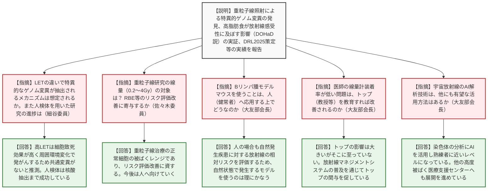
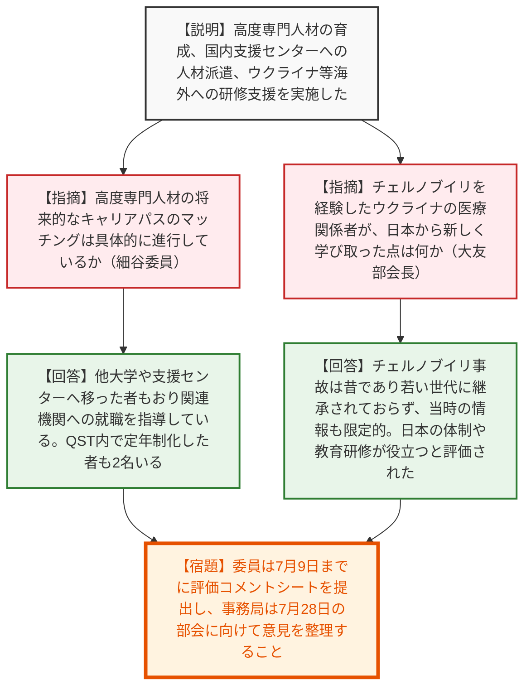

# 第23回国立研究開発法人審議会量子科学技術研究開発機構部会（令和8年7月7日）
> 出典 : https://youtube.com/live/LTqFW6e0nYw?si=WcGCrfUx5vTxteJL

## 会合の概要作成
* **QSTの革新的な研究成果に対する高い評価:** 重粒子線照射による特異的なゲノム変異の発見や、胎児・小児期の栄養環境（高脂肪食）が放射線感受性に影響を与えること（DOHaD説）を動物モデルで世界で初めて実証したことなど、将来の被ばく医療や宇宙進出に直結するQSTの基礎研究に対し、委員から極めて高い評価と称賛が寄せられました。
* **社会実装と現場改善への着実な貢献:** 医療被ばくにおける診断参考レベル（Japan DRL 2025）の策定や、法改正に伴う医療従事者の個人線量計装着率の実態調査など、QSTの取り組みが医療現場の意識改革と被ばく低減に直接的に寄与していることが確認されました。また、医師の線量計装着率が依然として低いという課題に対しても、トップマネジメントの意識改革を促す仕組みづくりが進められていることが示されました。
* **高度専門人材の育成と国内外への知見展開:** 基幹高度被ばく医療支援センターとしての役割を通じ、育成した高度専門人材を国内の大学等へ派遣・定着させるキャリアパスの構築が進んでいることが報告されました。また、ウクライナやリトアニアの医療関係者への研修を通じ、チェルノブイリの経験が途絶えつつある若い世代へ日本の事故対応の知見を継承する国際貢献も高く評価されました。

---

## 議題ごとの詳細整理（テキスト）

**【議題：国立研究開発法人量子科学技術研究開発機構の令和7年度における業務の実績に関する評価（原子力規制委員会共管部分）について】**

**■ 論点1：放射線影響に係る研究、福島復興支援、被ばく医療に係る研究実績について**
* **議論の背景と論点:** QSTの第3期中長期計画に基づく令和7年度の業務実績（評価単位5）について、放射線影響の基礎研究、宇宙放射線計測、プルトニウム内部被ばく評価などの研究成果の妥当性と社会実装への見通しが論点となった。
* **質疑応答（詳細）:**
  * 【説明者側】（QST 中山理事、今岡）重粒子線の種類（LETの違い）によってBリンパ腫のゲノム変異パターンが異なることを発見した。また、母親の高脂肪食が子の放射線感受性を高める（生存率を低下させる）ことをマウス実験で解明した。その他、医療被ばく実態調査によるDRL2025の策定、宇宙放射線計測のAI自動解析化、大洗事故の教訓を活かしたプルトニウム内部被ばくの線量評価の精緻化等の成果を報告する。
  * 【規制側】（細谷委員）重粒子線の研究について、LETの違いで特異的なゲノム変異が抽出されるメカニズムは想定されるか。また、人検体を用いた研究プロセスはどの程度進んでいるか。
  * 【説明者側】（QST 今岡）高LETでは細胞致死効果が高く、直接被ばくした細胞の周囲の環境変化で発がんするため共通変異がないと推測する。低LETで特定の染色体欠失が起きるのは電離密度分布と染色体ダメージの絡みと想像している。人検体については、乳がん再発患者の検体を対象に倫理審査を終え、核酸抽出に成功しており、今後配列解析を進める。
  * 【規制側】（佐々木委員）重粒子線研究の0.2〜4Gyという線量は宇宙飛行士の被ばくか、重粒子線治療の正常細胞の被ばくか。LETによる違いの知見はRBE（生物学的効果比）等のリスク評価改善に寄与するか。
  * 【説明者側】（QST 今岡）線量としては重粒子線治療の正常細胞の被ばくレンジに入る。ご指摘の通りRBE等のリスク評価改善に資するものであり、今後は人に向けていく。
  * 【規制側】（佐々木委員）高脂肪食モデルの生存率グラフで100日齢と200日齢以降で下がり方が違うのは、骨髄造血障害と胸腺リンパ腫の違いか。
  * 【説明者側】（QST 今岡）100日より前は骨髄造血障害が多い傾向がある。
  * 【規制側】（佐々木委員）宇宙放射線評価のAI自動解析化のグラフについて、縦軸はISSでの1日の線量か。また中性子線は含まれるか。
  * 【説明者側】（QST 内堀）ISSの実測に基づく船内線量率である。中性子そのものは判別できていないが、中性子が人体を反跳した際に出る高LET粒子の線量として部分的に含まれている。
  * 【規制側】（佐々木委員）プルトニウムとアメリシウムのピーク分離解析手法は、バイオアッセイ併用等の成果に活かされたか、今後の見通しは。
  * 【説明者側】（QST 栗原）大洗事故の経験を踏まえ、同位体組成比を考慮しピーク分離を行って迅速に線量評価するシステムを構築している。万一の事故時に対応できるよう標準化や他センターへの展開を考えている。
  * 【規制側】（大友部会長）Bリンパ腫の研究で、自然状態でもBリンパ腫を発症するモデルマウスを使っているが、人（健常者）への応用はどうなるのか。
  * 【説明者側】（QST 今岡）人の場合も自然発生の疾患があり、それに対する放射線の相対リスクを評価するため、自然状態で発生するモデルを使うのは理にかなっている。
  * 【規制側】（大友部会長）医療従事者の線量計装着率について、医師の装着率が診療科の文化（教授の考え等）に依存するなら、教授を教育すれば上がるのか。
  * 【説明者側】（QST 今岡）トップの方針が大きく影響するが、現状はそこに至っていない。現在「放射線マネジメントシステム」を構築・普及させており、トップの関与による改善を期待している。
  * 【規制側】（大友部会長）宇宙放射線評価のAI解析は熟練者の技を元にしており親和性が高い。他にも有望な活用方法はあるか。
  * 【説明者側】（QST 内堀）染色体の分析にAIを活用し、熟練者に近いレベルになりつつある。この技術を他の高度被ばく医療支援センターへ展開するよう進めている。

**■ 論点2：基幹高度被ばく医療支援センター等における人材育成について**
* **議論の背景と論点:** QSTが実施している高度専門人材の育成プログラム（5年目）の成果と、育成した人材のキャリアパス、および海外（ウクライナ等）への研修支援の意義が論点となった。
* **質疑応答（詳細）:**
  * 【説明者側】（QST）令和3年度から高度専門人材の育成を実施し、福井大学、長崎大学、弘前大学などの高度被ばく医療支援センターへ人材を派遣し研修等を支援した。また、JICAプロジェクト等でウクライナやリトアニアの医療関係者に放射線災害対応の研修を実施した。
  * 【規制側】（細谷委員）高度専門人材の将来的なキャリアパスのマッチングは具体的に進行しているか。
  * 【説明者側】（QST 内堀）途中で他の高度支援センターや大学医学部へ移った者もおり、関連機関へ就職するよう指導している。QST内で定年制（パーマネント）化した者も既に2名おり、今後も優秀な人材の定年制化を検討していく。
  * 【規制側】（大友部会長）チェルノブイリ事故を経験したウクライナの医療関係者が、日本から新しく学び取った点は何か。
  * 【説明者側】（QST 内堀）チェルノブイリ事故は昔の出来事であり、今回参加した若い世代には知見が継承されていない。また旧ソ連時代のため一般従事者には詳細な情報が公開されていない背景がある。日本の事故対応の体制や教育研修が非常に役立つとの感想を得ている。

* **結論と宿題事項（アクションアイテム）:**
  * QSTの令和7年度業務実績（評価単位5）について、委員からのヒアリングを完了した。
  * 【宿題】各委員は本日のヒアリングを踏まえた評価コメント等記入シートを7月9日までに事務局へ提出すること。
  * 【宿題】事務局は提出されたコメントを整理し、7月28日の部会にて部会としての意見（評価）を取りまとめること。

---

## 論理構造の可視化（Mermaid）

### 質疑1：放射線影響・被ばく医療に係る研究実績

### 質疑2：高度専門人材の育成と支援センター運営

