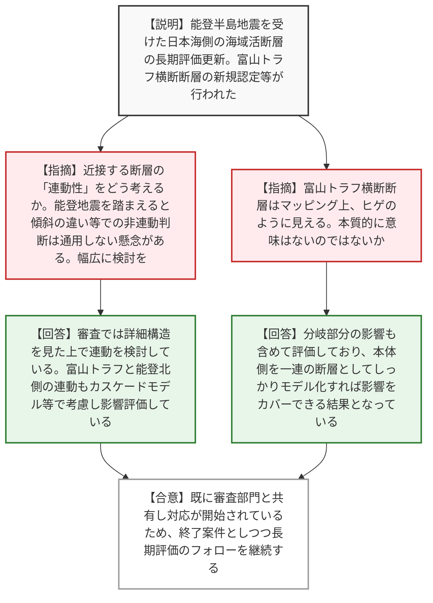
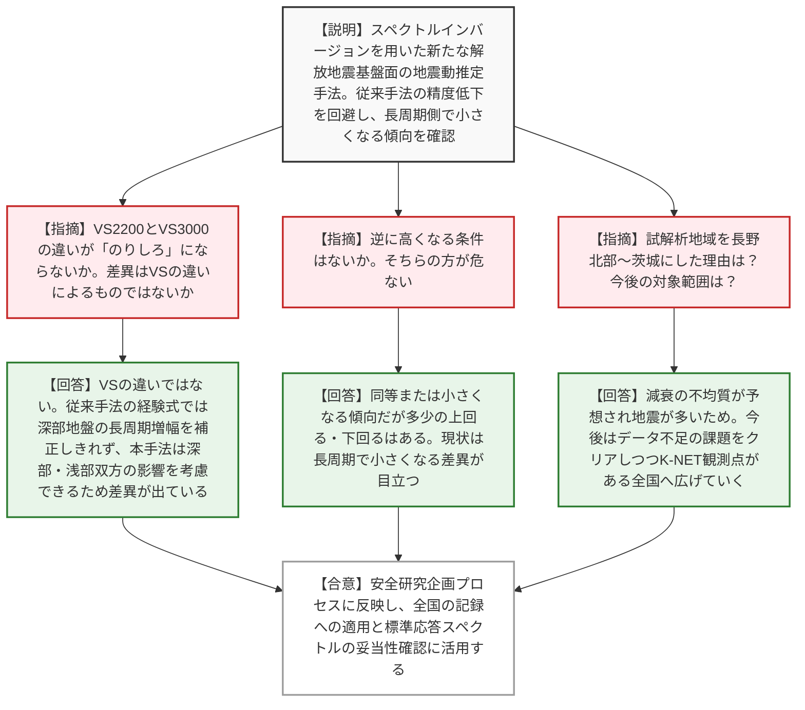
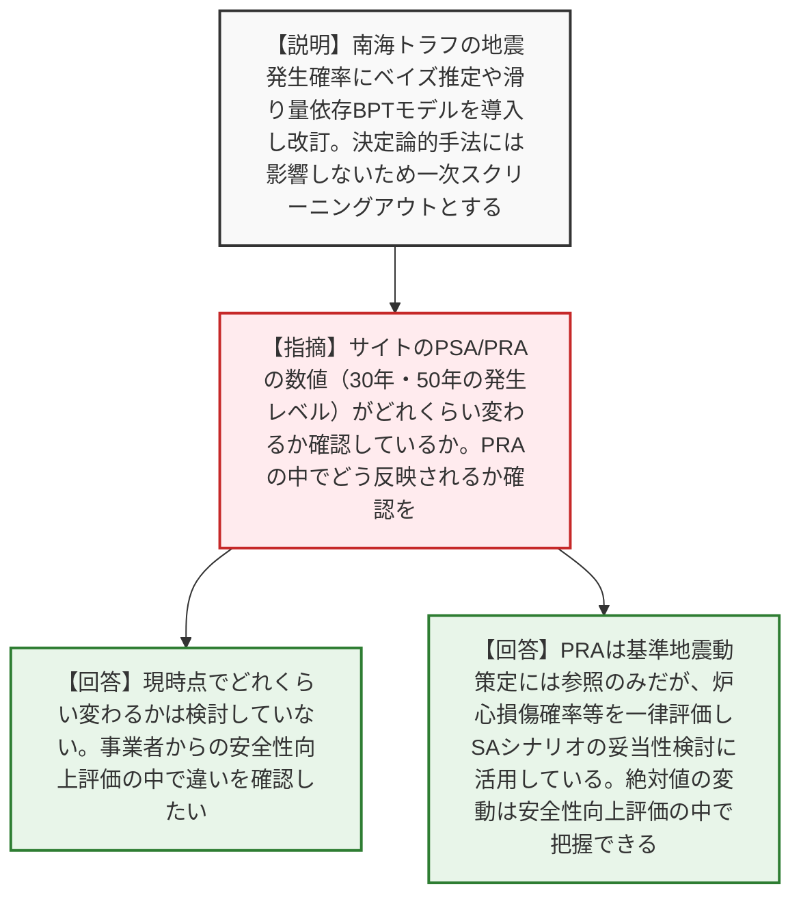
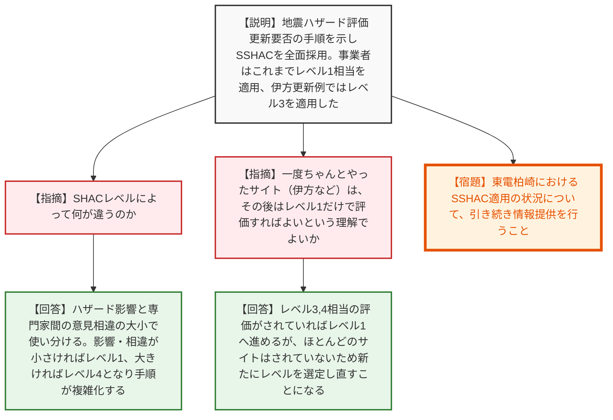
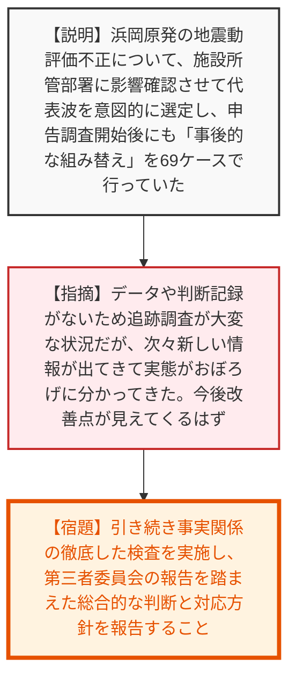

# 第6回原子炉安全専門審査会及び核燃料安全専門審査会地震・津波部会（令和8年7月7日）
> 出典 : https://youtube.com/live/b4mXb1APt-s?si=Wd3-p42LrpP1fzyD

## 会合の概要作成
* **ハザード新知見の規制への取り込みに対する深い専門的議論:** 日本海側や南海トラフの長期評価、標準応答スペクトル推定の新手法など、最新の自然ハザード知見の分析結果が報告されました。委員からは、断層の連動性の判断基準や、新しい確率論的手法（ベイズ推定・最尤法）がPRA（確率論的リスク評価）に与える影響について鋭い質疑が飛び交い、規制庁側も実務への反映方針を論理的に回答し、おおむね納得が得られる議論となりました。
* **SSHAC（専門家判断抽出手法）の国内適用に対する実務的確認:** 日本原子力学会標準の改定に伴うSSHACレベルの使い分けについて、国内プラントでの適用状況と今後の更新要否のフローが確認されました。海外（NRC）と異なり事業者が単独で実施する日本の枠組みにおいて、規制側がどのように妥当性を確認していくかという規制スタンスが示されました。
* **中部電力の不正行為に対する強い懸念と徹底調査の要求:** 浜岡原発の地震動評価における不正行為について、申告調査開始後にも「事後的な組み替え」が行われていたなどの詳細な手口が報告されました。意図的なデータ操作と記録の隠蔽に対し、部会長からも「データがないため追跡調査が大変だが、今後改善点が見えてくるはず」と、継続的な徹底調査と根本原因の究明を強く求める姿勢が示されました。

---

## 議題ごとの詳細整理（テキスト）

**【議題1：原子力規制庁が収集した地震・津波等の事象に関する知見の分析結果について】**

**■ ナンバー1：日本海側の海域活断層の長期評価（兵庫県北方沖～新潟県上越地方沖）**
* **議論の背景と論点:** 令和6年能登半島地震を受けて更新・公表された長期評価について。富山トラフ横断断層の新規認定や年代的定義の変更があった中、近接する断層帯の「連動性」をどう評価し、審査に反映するかが論点となった。
* **質疑応答（詳細）:**
  * 【説明者側】（内田）本長期評価では、地層の撓曲や傾動などを活断層と判断し、富山トラフ横断断層を新たに認定した。当該情報は一時スクリーニングアウト（審査ガイドの改定不要）としたが、審査部門と共有し既に対応が開始されているため「終了案件」とする。
  * 【規制側】（東委員）断層の連動性について、特に近接する位置関係にあるものをどこまで連動すると考慮するのか整理を教えてほしい。能登の地震を見ると、傾斜が逆だから一緒に動かない、最近動いているから広がらないという判断基準が通用しない懸念がある。幅広に検討してほしい。
  * 【説明者側】（内田）昔の「5kmルール」のような距離ベースの記載は今の審査ガイドにはなく、変動地形学、地質学、地球物理学的に総合的に解釈して対応している。
  * 【説明者側】（名倉）実際の審査では、詳細な構造を見た上で連動の可能性を検討している。柏崎刈羽の意見聴取会合では、能登半島地震の震源となった3つの断層の連動を考慮している。富山トラフと能登北側の断層帯の連動については、カスケードモデル等で連動を考慮し影響を評価している。
  * 【規制側】（東委員）マッピングを見ると、富山トラフ横断断層は以前から描かれている断層からヒゲみたいに出ているだけで、本質的に意味はないように見えるがどうか。
  * 【説明者側】（名倉）敷地への影響の観点で、分岐して曲がっているところの影響も含めて見ている。本体側を一連の断層として考慮するものと、枝分かれ側へ及ぶものとして考慮するものの影響を比較した結果、本体側をしっかりモデル化すれば大きいという評価になっている。
  * 【説明者側】（内田：追加補足）富山トラフ横断断層は長さ20kmでM7程度、変位量2m。一方、本体側の富山トラフ西縁断層は長さ61kmでM7.8、変位量6mであり、横断断層は一回り小さいものとなっている。

**■ ナンバー2：標準応答スペクトル策定に用いた解放地震基盤相当面における地震動を推定する手法の信頼性向上に資する知見**
* **議論の背景と論点:** スペクトルインバージョン解析を用いた新しい地震動推定手法の妥当性。地盤増幅率の補正において、VS2200m/sとVS3000m/sの定義の違いが結果に与える影響や、深部地盤での長周期側の増幅補正が論点となった。
* **質疑応答（詳細）:**
  * 【説明者側】（田島）地中観測記録のスペクトルを、スペクトルインバージョン解析で求めた経験的サイト増幅率で割ることで、解放地震基盤面でのスペクトルを逆算する新手法を提案した。従来手法（剥ぎ取り解析＋地盤物性補正）の精度低下を回避し、長周期側で従来より小さくなる傾向（深部地盤の影響を適正に評価）を確認した。
  * 【規制側】（三宅委員）VS2200以上とVS3000程度の定義の違いが、使う側の「のりしろ（調整代）」にならないか。差異はVSの違いによるものではないのか。
  * 【説明者側】（田島）差異はVSを変えたことによるものではない。従来手法は一般的な経験式で補正していたため、地震基盤が深い場合の長周期での増幅を補正しきれていなかった。本手法は観測点ごとに深部と浅部の影響を考慮するため差異が出ていると考察している。
  * 【規制側】（三宅委員）現時点ではそういう説明だと理解するが、重要な点なので安全研究企画プロセスでの引き続きの検討をよろしくお願いする。
  * 【規制側】（久田部会長）論文の査読意見はどのようなものがあったか。
  * 【説明者側】（田島）理論伝達関数の最適化や、点震源仮定における震源特性の正確性について確認があり、妥当性を示して受理された。
  * 【規制側】（谷岡委員）本手法で低くなった場合があるというが、逆に高くなる条件はあるか。そちらの方が危ないと思うが。
  * 【説明者側】（田島）同等または小さくなる傾向であり、多少の上回る・下回るはある。統計処理したときにどう現れるかは今後確認が必要だが、現状では長周期で小さくなる差異が目立つ。
  * 【規制側】（東委員）試解析の対象を長野県北部から茨城県にした理由は？今後の対象範囲は？
  * 【説明者側】（田島）活火山があり減衰の不均質が予想され、内陸の浅い地震が多いため試解析に適切と判断した。今後はK-NET観測点がある全国を対象にする。本年度は北側を解析したがデータ不足などの課題もあり、南側も含め全国に広げていく。

**■ ナンバー4：南海トラフの地震活動の長期評価 第2版一部改訂**
* **議論の背景と論点:** 南海トラフの地震発生確率計算に、ベイズ推定や「すべり量依存BPTモデル」を取り入れた一部改訂。確率論的ハザード評価（PRA）の数値にどう影響するか、またそれが規制（基準地震動策定等）にどう反映されるかが論点。
* **質疑応答（詳細）:**
  * 【説明者側】（道口）過去の隆起量データの不確実性を確率分布で見直し、地震予測モデルとBPTモデルを融合したすべり量依存BPTモデルやベイズ推定を導入し、発生確率を算出し直した。基準地震動や基準津波は決定論的手法に基づくため影響はないとし、一次スクリーニングアウトとした。
  * 【規制側】（東委員）手法が増えたことで審査の枠組みに影響はないとのことだが、サイトの確率論的安全評価（PSA/PRA）において数値がどれくらい変わるか確認されているか。
  * 【説明者側】（道口）我々の方ではどのくらい変わるか検討していない。安全性向上評価などで事業者が検討してくるので、そこで違いを確認したい。
  * 【規制側】（東委員）基準地震動の策定には基本変わらないが、30年・50年での発生レベルの評価には効いてくるので、PRAの中でどう反映されているか確認してほしい。
  * 【説明者側】（名倉）PRA評価は基準地震動策定では参照するのみなので規制上の判断に影響はない。ただし、炉心損傷確率などを一律評価し、SA対策のシナリオの妥当性検討に活用している。絶対的な値の変動はあるかもしれないが、安全性向上評価の中で影響を把握できる。

**■ ナンバー3：日本原子力学会標準「原子力発電所に対する地震を起因とした確率論的リスク評価に関する実施基準2024」**
* **議論の背景と論点:** 地震ハザード評価の不確かさを扱うSSHAC（専門家判断抽出手法）の全面採用に関する学会標準の改定。SHACレベルの使い分けと、国内プラントでの適用状況・更新要否の判断フローが論点。
* **質疑応答（詳細）:**
  * 【説明者側】（真室）実施基準2024ではSSHACの手法を全面的に採用し、地震ハザード評価の更新要否の手順が示された。事業者はこれまでSHACレベル1相当を適用してきたが、伊方発電所の更新例ではレベル3が用いられた。
  * 【規制側】（東委員）SHACのレベルによって何が違うのか書かれていないが、簡単に説明してほしい。
  * 【説明者側】（真室）ハザードへの影響の大小と、専門家間の意見の相違の大小で使い分ける。影響と相違が小さければレベル1、大きければレベル4。レベル1は専門家数が少なく、レベルが上がるとワークショップ等を含む複雑な手順になる。
  * 【規制側】（東委員）フローチャートを見ると、一度ちゃんとやったサイト（伊方など）は、その後の情報に基づいてレベル1だけで評価すればいいという理解でよいか。
  * 【説明者側】（真室）実際にSHACレベル3,4相当の評価がされていればそうなるが、ほとんどのサイトはされていないため、新たにレベルを選定し直すことになる。伊方はレベル1（右側）に行ける。
  * 【規制側】（森下）久田部会長からの意見として、東電柏崎のSHAC適用について引き続き情報提供してほしいというコメントがあったので入れておく。

**【議題2：その他（中部電力の不正行為への対応状況）】**
* **議論の背景と論点:** 浜岡原発の基準地震動策定において、代表波の意図的な選定や、申告調査開始後における「事後的な組み替え」などの悪質なデータ操作が発覚した件。事実関係の解明状況と、今後の規制庁の対応方針（検査継続、罰則導入の検討、トレーサビリティの確保）が報告された。
* **質疑応答（詳細）:**
  * 【説明者側】（竹内）225ケースの調査状況を報告。委託業者に1000波計算させ、選定基準以上はグラフ化させず、施設所管部署に影響確認をさせて意図的に代表波を選定していた。決まらなければ2万波など数を増やして都合のいい波が出るまで繰り返した。さらに、申告調査開始後にも残りの19波の「事後的な組み替え」を69ケースで行っていたことが判明した。引き続き検査を継続する。
  * 【規制側】（久田部会長）今進行中で第三者委員会の報告も待たれる状況だが、次々新しい情報が出てくる中でおぼろげながら実態が分かってきた。データや判断の記録が残っていないため追跡調査が大変な状況だと思うが、今後色々と改善点が見えてくる状況だと思う。引き続き検討と報告をお願いしたい。

* **結論と宿題事項（アクションアイテム）:**
  * 各知見の分析結果および対応方針（安全研究企画プロセスへの反映、終了案件化など）について了承された。
  * 【宿題】中部電力の不正事案について、引き続き事実関係の徹底した検査を実施し、第三者委員会の報告を踏まえた総合的な判断と対応方針を部会へ報告すること。
  * 【宿題】東電柏崎におけるSSHAC適用の状況について、引き続き情報提供を行うこと。

---

## 論理構造の可視化（Mermaid）

### 議題1-1：日本海中南部の海域活断層の長期評価

### 議題1-2：標準応答スペクトル策定に用いた地震動推定手法

### 議題1-3：南海トラフの地震活動の長期評価

### 議題1-4：日本原子力学会標準「実施基準2024」（SSHAC）

### 議題2：その他（中部電力の不正行為への対応状況）

