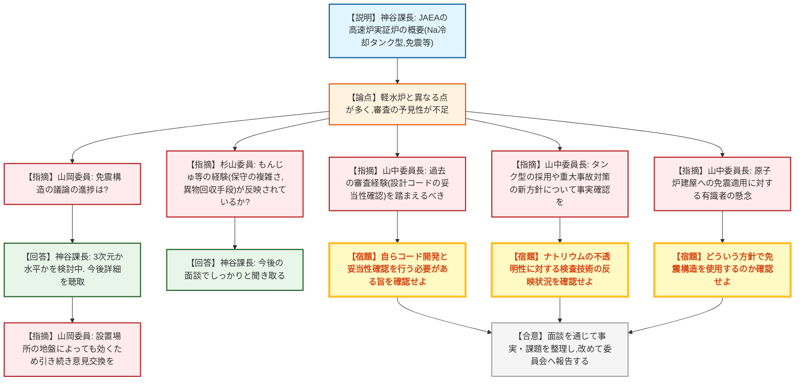
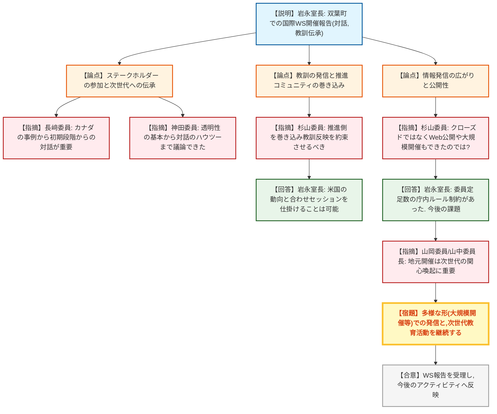
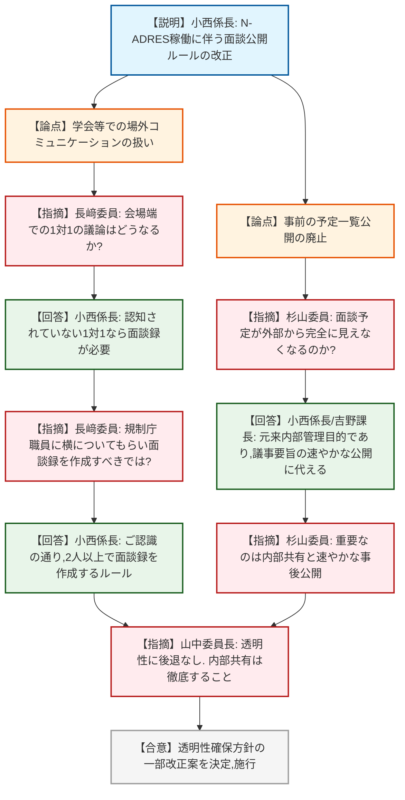
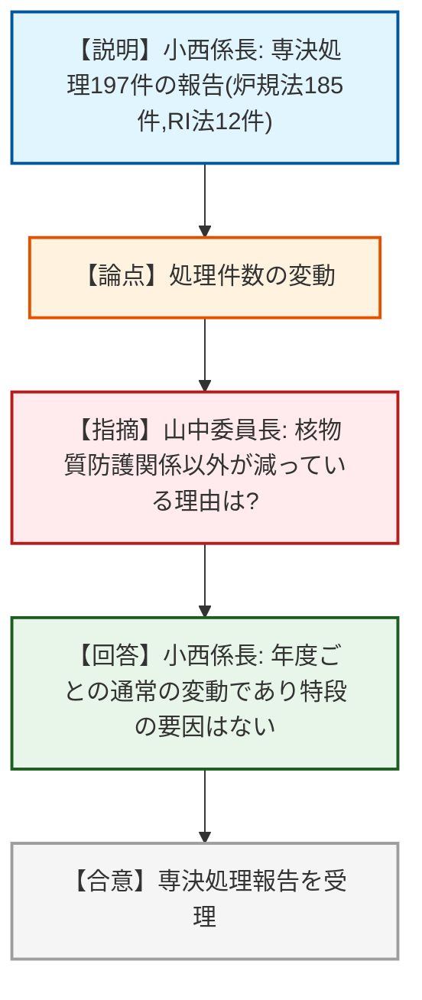

# 第19回原子力規制委員会（令和8年7月8日）
> 出典 : https://youtube.com/live/A8URmGlAQ-8?si=xHtMuhsG4OkhCISO

## 会合の概要
* **次世代高速炉の審査に向けた規制側の高いハードルの提示**
  JAEAが進める高速炉実証炉の概念設計について、過去の「もんじゅ」や「常陽」の経験（保守点検の困難さ、設計コードの妥当性確認など）を十分に踏まえているかについて、委員長をはじめ規制側から厳しい指摘が相次いだ。既存の軽水炉とは設計が根本的に異なるため、安易な前提での審査はできず、基本方針の事実確認から慎重に積み上げる方針が示された。
* **福島第一原発事故15年の節目を受けた国際ワークショップの総括**
  地元・双葉町で開催された国際WSについて、ステークホルダーとの対話や次世代への教訓伝承の重要性が確認された。一方で、推進・開発コミュニティへの教訓の反映や、公開性のあり方（より広く一般に届けるための手法）について、規制庁の運用ルールの壁も含めた課題が浮き彫りとなった。
* **透明性確保ルールの実態に合わせたアップデート**
  面談記録の公開について、検索システム（N-ADRES）の稼働に伴い、形骸化していた事後の「予定一覧公開」から「議事要旨の速やかな直接リンク公開」へシフトし、実質的な透明性の向上と事務の効率化を図る方針が全会一致で決定された。学会等の場外での1対1の接触に対する厳しい戒めも再確認された。

---

## 議題ごとの詳細整理

### 【議題1】高速炉実証炉の概念設計に関する日本原子力研究開発機構との面談の概要及び今後の対応方針
* **議論の背景と論点:**
  JAEAが進めるナトリウム冷却タンク型高速炉実証炉の概念設計に関して実施された面談の報告。従来のループ型（もんじゅ）からの変更、免震建屋の採用検討などの新要素が含まれており、新規制基準適合性審査に向けた予見性の確保と、過去の高速炉の失敗や課題がどこまでフィードバックされているかが争点となった。

* **質疑応答（詳細）:**
    * 【説明者側】神谷課長（技術基盤課）
      実証炉はナトリウム冷却タンク型（熱出力150万kW、電気出力60万kW）、酸化物または金属燃料を検討しており、建屋には免震構造（3次元または水平）の採用を検討している。しかし、軽水炉と大きく異なるうえ、詳細設計や成立性の根拠が未提示であるため、規制庁として面談を継続し、規制上の課題の整理状況を確認していく。
    * 【規制側】山岡委員
      フュージョンでも議論となっている免震構造について、実用炉を含め現状どこまで議論が進んでいるのか。設置場所によって効いてくる可能性が高い。
    * 【説明者側】神谷課長（技術基盤課）
      JAEAにとっても免震構造の採用がクリティカルポイントだが、現時点では3次元か水平かを検討中という段階であり、今後詳細を聞き取る。
    * 【規制側】杉山委員
      今後の面談において、「もんじゅ」や「常陽」の経験が反映されているか特に聞き取ってほしい。もんじゅは点検漏れなど管理しきれない複雑なシステムが原因で停止した。また、炉内に落ちた小さなパーツを見つけて回収する手段がなかった。現実の保安規定で押さえ込める設計になっているか確認が必要。
    * 【説明者側】神谷課長（技術基盤課）
      承知した。今後の面談でしっかりと聞き取る。
    * 【規制側】山中委員長
      過去のナトリウム冷却高速炉に関する審査の経験を踏まえているかが基本。常陽の審査では設計コードがほとんど無く、妥当性の確認ができないことが大問題だった。原型炉を飛ばして実証炉を作るなら、自らコード開発と妥当性確認を行う必要がある。
    * 【規制側】山中委員長（継続）
      また、タンク型の採用や重大事故対策の方針など、全く新しい特徴についてどういう方針で臨むのか事実確認を行い、委員会で議論したい。ナトリウムが不透明であることに対する検査手段（超音波や紫外線観察等）の開発蓄積がどう設計に反映されるかも確認すること。
    * 【規制側】山中委員長（継続）
      免震構造について、有識者は周辺建屋への適用には肯定的だったが、原子炉建屋への適用には躊躇していた。どういう方針で免震構造を使うのか確認する必要がある。

* **結論と宿題事項（アクションアイテム）:**
    * **決定事項:** 技術基盤グループを中心にJAEA等と面談を継続し、実証炉の検討状況と規制上の課題整理状況を聴取する方針を了承。
    * **宿題事項:** 面談において、過去の高速炉（もんじゅ・常陽）の経験・教訓（保守管理の現実性、異物回収の手段、設計コードの開発と妥当性確認、不透明なナトリウム環境下での検査技術）が設計にどう反映されているかを徹底的に聞き取り、事実関係を整理したうえで改めて委員会に報告すること。

---

### 【議題2】東京電力福島第一原子力発電所事故後15年の節目に関する国際ワークショップの結果概要
* **議論の背景と論点:**
  福島県双葉町で開催されたOECD/NEA等共催の国際ワークショップの報告。事故から15年が経過する中、ステークホルダーとの対話のあり方、次世代への教訓の伝承、そして開発・推進側へのフィードバックをどのように担保していくかが論点となった。

* **質疑応答（詳細）:**
    * 【説明者側】岩永室長（1F室）
      事故分析と廃炉からの教訓、Complex siteの廃止措置、ステークホルダーとの信頼構築について議論された。透明性の確保、若者の参画、世代間の情報伝承の重要性が共有された。7月中を目処に動画を公開予定。
    * 【規制側】長﨑委員
      長期プロジェクトにおいて、今の担当者はリタイアするため次世代への引き継ぎが極めて重要かつ困難であると痛感した。カナダのチョークリバーの事例で、初期段階から先住民（ステークホルダー）に参加してもらわなかったために計画が白紙になった話があり、最初期からの対話と信頼構築の重要性を再認識した。
    * 【規制側】神田委員
      セッション3では、透明性・信頼性という基本から、対話の成果をどうまとめるかというハウツーまで議論できた。参加者全員が何らかのステークホルダーとしての当事者意識を持っていた。
    * 【規制側】杉山委員
      世界に教訓を発信する上で、開発・推進コミュニティが乖離してしまっては困る。彼らを巻き込んで教訓の反映を約束させないと十分ではない。今後の展開はどう見えているか。
    * 【説明者側】岩永室長（1F室）
      本会合は事故分析が中心だが、米国からは教訓を新型炉の安全性追求の大きなモチベーションにしているとの発言があった。米国と共に歩む中で、推進側への反映を意識したセッションを仕掛けていくことは可能と考える。
    * 【規制側】杉山委員
      地元開催は良かったが、クローズドな会合であり多くの人に伝える意味では、Webでの完全公開や東京等の大都市での大規模開催など、やり方はもっとあったのではないか。
    * 【説明者側】岩永室長（1F室）
      規制委員が3人以上集まると公開会議の扱いとなり困るという庁内ルールの制約があった。動画は公開するが、広く一般に向けてどう展開するかは、規制庁の中期目標におけるステークホルダーとの関係性の中で議論されるべき課題と認識している。
    * 【規制側】山岡委員
      地元での開催はシンボリックであり、次世代（大学院生やポスドク等）が関心を持ち主体的に取り組むきっかけになる。
    * 【規制側】山中委員長
      地元開催の意義は大きい。多様なステークホルダーの調和を考え未来を作る必要がある。今回のスタイルを一つの形として継続しつつ、別の主催者による東京での大規模開催なども並行して実施していくことが重要。

* **結論と宿題事項（アクションアイテム）:**
    * **決定事項:** 本ワークショップの結果報告を了承。
    * **宿題事項:** 次世代への教育・インプット活動を継続すること。また、庁内ルールの制約等の課題を整理しつつ、開発・推進側への教訓の反映や、より広範な一般市民への情報発信のあり方について、今後のアクティビティの中で工夫・検討していくこと。

---

### 【議題3】原子力規制委員会の業務運営の透明性の確保のための方針の改正
* **議論の背景と論点:**
  アーカイブ検索システム（N-ADRES）の稼働に伴い、面談予約一覧の事後公開という形骸化した手続きを見直し、実態に即した透明性確保のルール改正を行う。学会等の場外における規制側と被規制者の接触に関する解釈が論点となった。

* **質疑応答（詳細）:**
    * 【説明者側】小西係長（総務課）
      面談予約一覧の作成・公開に代え、N-ADRESのリンクを掲載する。有識者会議議事録の速やかな公開、学会等における広く認知された場での議論は面談に含めないことの明確化、資料の公開タイミングの適正化などを改正案として提示する。
    * 【規制側】長﨑委員
      学会等での発表後、会場の端などで被規制者（例：JAEAの研究者）と1対1でディスカッションした場合の扱いはどうなるか。
    * 【説明者側】小西係長（総務課）
      周りに人がいて認知されている形であれば面談に該当しないが、誰も聞いていない端の場などで1対1で行う場合は、面談録を作成していただく必要がある。
    * 【規制側】長﨑委員
      その場合、規制庁職員に横についてもらい、客観的に面談録を書いてもらうよう配慮する方が透明性の観点から正しいということでよいか。
    * 【説明者側】小西係長（総務課）
      ご認識の通り。基本的に2人以上で会って面談録を作るのがルールである。
    * 【規制側】杉山委員
      予定の公開がなくなることで、面談の予定が外から完全に見えなくなるということでよいか。
    * 【説明者側】小西係長（総務課） / 吉野課長（総務課）
      業務システムは外部から見えない。元々、平成25年の事案（幹部が単独で面談）を受けた「組織的な予定把握（内部管理）」が目的であった。実態としても事後公開になっていたため、組織的管理の徹底は維持しつつ、議事要旨の公開に代えたい。
    * 【規制側】杉山委員
      予定の事前公開が実施を保証するものではない以上、事後公開を速やかに行うことが重要であると理解した。
    * 【規制側】山中委員長
      実質的に事後公開となっていたものを、議事録を早く公開することで透明性を確保するルール変更であり問題ない。内部での情報共有は事前事後に関わらず徹底すること。

* **結論と宿題事項（アクションアイテム）:**
    * **決定事項:** 「原子力規制委員会の業務運営の透明性の確保のための方針」の一部改正案を全会一致で決定。本日付で施行する。
    * **制約・留意事項:** 学会等の場外においても、被規制者と非公開の状態で接する場合は必ず複数名で対応し、面談録を作成するという原則を厳格に運用すること。

---

### 【議題4】令和7年度第4四半期における専決処理（報告）
* **議論の背景と論点:**
  原子炉等規制法および放射性同位元素規制法に基づく、報告を要する専決処理状況（令和7年度第4四半期）の確認。

* **質疑応答（詳細）:**
    * 【説明者側】小西係長（総務課）
      計197件の専決処理を報告。炉規法関係185件（審査基準改正に伴う核物質防護規定変更が約130件と多数を占める。クリアランス1件、計量管理規定21件等）。RI法関係12件（使用許可9件、特定許可使用者の合併に伴う地位承継3件）。
    * 【規制側】山中委員長
      例年に比べると若干件数が少ない印象。核物質防護関係が突出しているが、それ以外の分野の件数が減っている特段の理由は考えられるか。
    * 【説明者側】小西係長（総務課）
      年度ごとの通常の変動の範囲内であり、特段の減少要因があったわけではないと認識している。

* **結論と宿題事項（アクションアイテム）:**
    * **決定事項:** 専決処理の報告を受理し、了承。宿題事項は特になし。

---

## 論理構造の可視化（Mermaid）

### 【議題1】高速炉実証炉の概念設計に関する面談概要

### 【議題2】福島第一原発事故後15年の節目に関する国際WS

### 【議題3】業務運営の透明性確保のための方針改正

### 【議題4】令和7年度第4四半期専決処理（報告）

