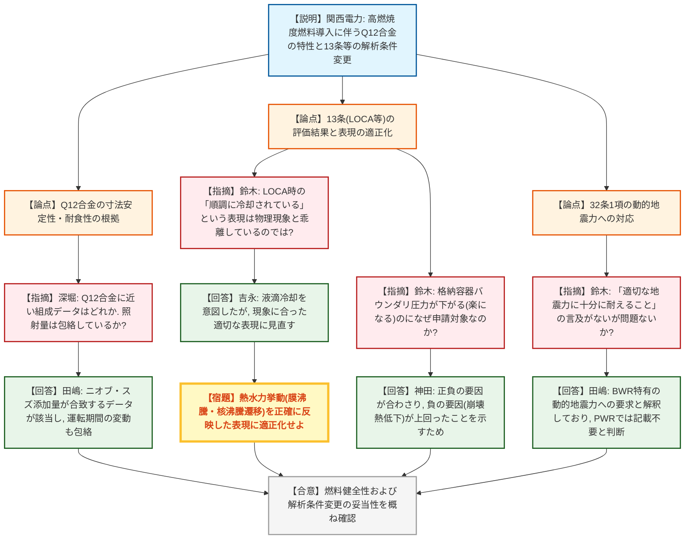
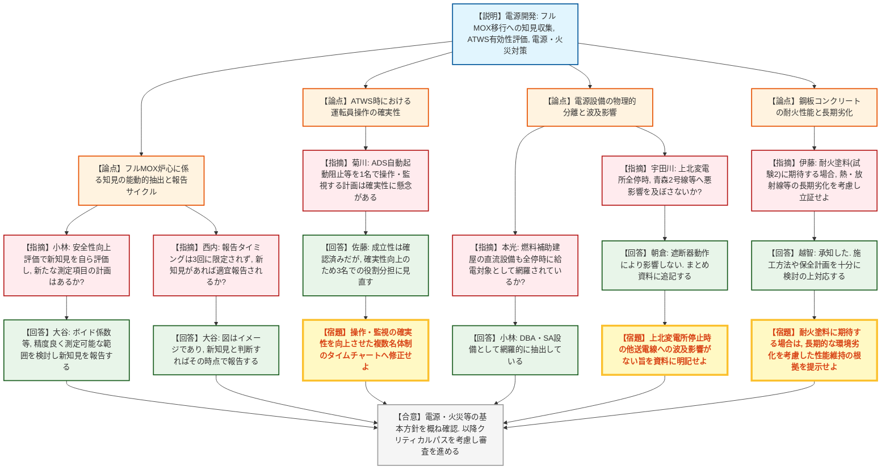

# 第1420回原子力発電所の新規制基準適合性に係る審査会合（令和8年7月9日）
> 出典 : https://youtube.com/live/EPb5onR0isk?si=1pY0HQcNBzBeUK_L

## 会合の概要
* **高浜3・4号炉の高燃焼度燃料導入（ステップ2）における解析条件の適正化**
  関西電力から、輸入ウラン燃料（Q12合金）の寸法安定性・耐食性の妥当性や、燃焼度引き上げに伴う崩壊熱等の解析条件変更がLOCAや被ばく評価等に与える影響について詳細な説明がなされた。規制側は評価条件がプラント挙動に与える正負の要因を概ね理解したものの、審査資料における熱水力挙動（膜沸騰・核沸騰への遷移等）の物理現象に即した正確な表現への見直しを求めた。
* **大間原発のフルMOX炉心移行に向けた知見収集と自律的な評価サイクルの構築**
  電源開発から、フルMOX炉心への段階的移行に伴う各設計手法の適用性確認と、安全性向上評価届出の枠組みが示された。規制側は、単なる規定のデータ報告にとどまらず、事業者自らが新たな測定項目の可能性を探り、新知見を抽出して能動的に報告する「自律的な安全性向上プロセス」の構築を強く要求した。
* **原子炉停止機能喪失（ATWS）時における運転員操作の確実性確保**
  ATWS時におけるADS（自動減圧系）自動起動阻止やホウ酸水注入などの重大な操作について、1名の運転員が操作と状態監視を兼任する計画に対し、規制側から確実性の観点で疑義が呈された。これを受け、事業者はシミュレータでの成立性を主張しつつも、より確実性を高めるため3名体制での役割分担に見直すことを約束した。
* **鋼板コンクリートの耐火性能担保と長期使用時の劣化懸念**
  大間原発の内部火災対策において、鋼板コンクリートの耐火性能を担保するための火災耐久試験計画が議論された。床荷重増大を想定した「耐火塗料」の追加施工（試験2）について、将来的に基準適合の根拠とする場合には、熱や放射線などの長期使用環境下での劣化を考慮した厳しい立証が不可欠であると、規制側から事前の釘刺しが行われた。

---

## 議題ごとの詳細整理

### 【議題1】関西電力（株）高浜発電所3号炉及び4号炉の高燃焼度燃料導入に係る設置変更許可申請の審査について
* **議論の背景と論点:**
  国産ウラン燃料と輸入ウラン燃料（Q12合金等）の差異による燃料健全性への影響、及び高燃焼度燃料（ステップ2燃料）導入に伴う解析条件（崩壊熱、水素生成G値、理論密度の変更等）の適正化が、第13条（LOCA等）や第27条（被ばく評価）に与える影響の妥当性が論点となった。

* **質疑応答（詳細）:**
    * 【説明者側】田嶋・吉永・神田（関西電力）
      輸入ウラン燃料で使用するQ12合金はジルカロイ4と同等の物性を持ち、ニオブ添加による寸法安定性・耐食性の向上が海外研究炉データでも示されている。また、第13条（LOCA等）の解析において、日本原子力学会推奨値に基づく崩壊熱への変更等の正負の要因を考慮した結果、燃料被覆管温度や格納容器圧力等は判断基準を下回ることを確認した。
    * 【規制側】深堀（規制庁）
      提示されたQ12合金に近い組成のデータはどれか。また、その照射データは今回の燃料の照射量（燃焼度）を包絡しているか。
    * 【説明者側】田嶋（関西電力）
      ニオブとスズの添加量が該当するデータ（Cに属する下方の線）が最も近い。グラフ中ほどの照射量に該当し、運転期間の変動は包絡されている。
    * 【規制側】鈴木（規制庁）
      13条LOCA事象の評価結果において、「炉心の冷却が順調に行われている」との表現があるが、再冠水開始後も最高温度に達するまでは膜沸騰等の状態であり、十分な冷却とは言えない。この表現は実際の解析挙動と乖離しており不適切ではないか。
    * 【説明者側】吉永（関西電力）
      液滴の巻き込みによる冷却効果を意図していたが、ご指摘の通り物理現象に合ったより適切な表現に見直すよう検討する。
    * 【規制側】鈴木（規制庁）
      格納容器バウンダリにかかる圧力・温度が変更前より下がる（楽になる）にも関わらず、なぜ設置変更許可申請の対象としたのか。
    * 【説明者側】神田（関西電力）
      保有熱量増加という正の要因と、崩壊熱低下という負の要因が合わさった結果として負の要因が打ち勝ったということを、解析条件の変更効果として明確に示すためである。
    * 【規制側】鈴木（規制庁）
      第32条1項の「適切な地震力に十分に耐えること」についての言及がないが、説明する必要はないのか。
    * 【説明者側】田嶋（関西電力）
      当該条文の地震力は、BWRのサプレッションチェンバ特有の動的地震力に関する要求と解釈しているため、PWRである本プラントでは記載していない。

* **結論と宿題事項（アクションアイテム）:**
  * **決定事項:** Q12合金の照射データに基づく燃料健全性や、第13条・第27条等における解析条件変更に伴う評価結果の妥当性については概ね理解が得られ、今後の過渡事象・SA関係の審査へ進むことが確認された。
  * **宿題事項:** 13条のLOCA事象説明資料における「順調に冷却されている」という表現について、実際の熱水力挙動（膜沸騰・核沸騰への遷移等）を正確に反映した表現に適正化すること。

---

### 【議題2】電源開発（株）大間原子力発電所の設計基準への適合性及び重大事故等対策について
* **議論の背景と論点:**
  フルMOX炉心への段階的移行に伴う知見収集・適用性確認の枠組み、原子炉停止機能喪失（ATWS）時の有効性評価と運転員操作の確実性、さらに第14条・33条（電源）、第8条・41条（内部火災）への適合性が論点となった。

* **質疑応答（詳細）:**
  **＜フルMOX炉心に係る知見収集＞**
    * 【説明者側】土渕・大谷（電源開発）
      フルMOX炉心に対する各設計手法の適用性を再整理し、ウラン炉心と同等の精度で予測できることを確認した。フルMOXへの移行過程において、安全性向上評価届出を通じ、運転実績データの評価やTIP/ガンマスキャンによる測定結果を報告する。
    * 【規制側】小林（規制庁）
      安全性向上評価届出では、単にデータを示すだけでなく、事業者自らが新たな知見の有無を評価しクレジットとして報告すべき。また、データ拡充に向けた新たな測定項目の計画はあるか。
    * 【説明者側】大谷（電源開発）
      事業者の責任で新知見を取りまとめて報告する。ボイド係数など実機での測定が難しいパラメータもあるが、精度良く測定可能な範囲を検討し、報告の拡充に努めたい。
    * 【規制側】西内（規制庁）
      資料では報告タイミングが3回に規定されているように見えるが、新知見が得られた場合はタイミングによらず適切に報告されるという理解でよいか。
    * 【説明者側】大谷（電源開発）
      図はあくまでイメージであり、新知見と判断すればその時点で速やかに報告する。

  **＜原子炉停止機能喪失（ATWS）の有効性評価＞**
    * 【説明者側】久野（電源開発）
      ATWS時の有効性評価において、動的ボイド係数等に保守因子を考慮した上で、フルMOX炉心が最も厳しい条件として代表可能であることを確認した。
    * 【規制側】菊川（規制庁）
      ADS自動起動阻止やホウ酸水注入系の起動などについて、1名の運転員が操作と状態監視を兼任するタイムチャートとなっているが、時間内に確実に実施可能か。
    * 【説明者側】佐藤（電源開発）
      シミュレータ訓練で1名での成立性は確認しているが、監視と操作の重要性を考慮し、確実性を向上させるため想定している3名での役割分担を見直すこととする。

  **＜第14条・33条（電源）、第8条・41条（火災）＞**
    * 【説明者側】小林・朝倉・越智・西田（電源開発）
      非常用直流電源の容量確保、大間特有の送電線ルート（上北変電所での交差・近接等）の物理的分離、鋼板コンクリートの耐火性能試験計画（試験1: 基本、試験2: 耐火塗料追加）等について説明した。
    * 【規制側】本光（規制庁）
      燃料補助建屋の直流設備についても、全交流動力電源喪失時に給電が必要な設備が網羅的に抽出され容量が確保されているか。
    * 【説明者側】小林（電源開発）
      DBAおよびSA設備として網羅的に抽出し、給電対象としている。
    * 【規制側】宇田川（規制庁）
      上北変電所が全停した場合、それをバイパスしている青森2号線などに悪影響を及ぼさないか。
    * 【説明者側】朝倉（電源開発）
      遮断器が動作するため他回線には影響を及ぼさない。まとめ資料にもその旨を追記する。
    * 【規制側】伊藤（規制庁）
      内部火災の鋼板コンクリートについて、試験1が不合格となり自主的な試験2（耐火塗料）に期待して基準適合を説明する場合、想定される使用環境下（熱・放射線等）での長期的な劣化を考慮しても十分な耐火性能が維持されることを説明する必要がある。
    * 【説明者側】越智（電源開発）
      ご指摘を承知した。耐火塗料に期待する場合には施工方法や保全計画を十分に検討の上、対応する。

* **結論と宿題事項（アクションアイテム）:**
  * **決定事項:** 電源・火災等の各条文に対する基本方針は概ね確認された。今後、地震・津波PRA等のクリティカルパスを考慮した現実的なスケジュールで審査を進める。
  * **宿題事項:** 
    1. フルMOXへの移行においては、事業者の主体的な評価と知見抽出（新たな測定項目の検討等）に基づく柔軟な報告サイクルを運用すること。
    2. ATWS時のADS自動起動阻止等の操作について、運転員の役割分担を1名から複数名へ見直し、操作・監視の確実性を向上させたタイムチャートへ修正すること。
    3. 電源設備について、上北変電所停止時の他送電線への波及影響がない旨をまとめ資料に明記すること。
    4. 鋼板コンクリートの耐火性能について、将来的に耐火塗料（試験2）に期待する場合は、長期的な環境劣化（熱・放射線）を考慮した性能維持の根拠を提示すること。

---

## 論理構造の可視化（Mermaid）

### 【議題1】高浜発電所3号炉及び4号炉の高燃焼度燃料導入に係る審査

### 【議題2】大間原子力発電所の設計基準への適合性及び重大事故等対策

