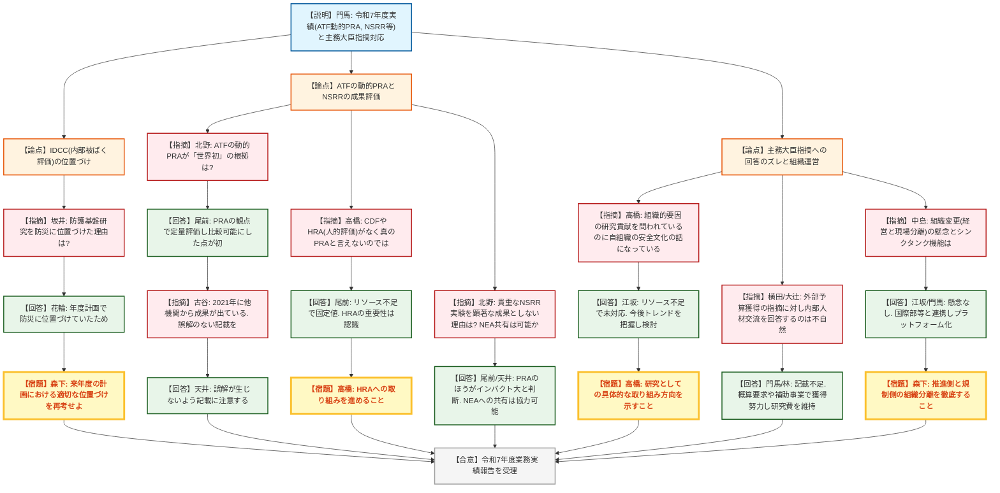
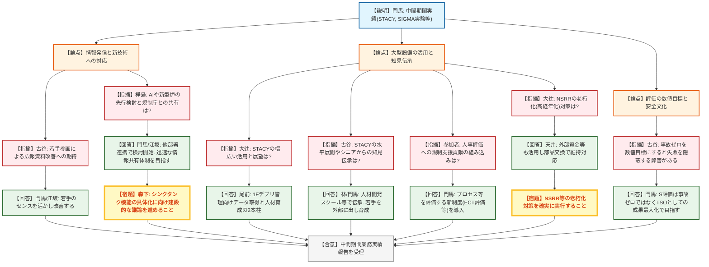
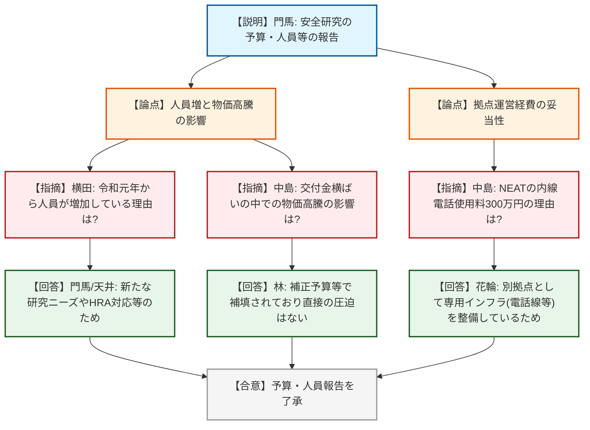

# 第26回国立研究開発法人審議会日本原子力研究開発機構部会（令和8年7月9日）
> 出典 : https://youtube.com/live/8tl931TGtCI?si=fGYeXjDT9VJaVwRo

## 会合の概要
* **主務大臣指摘に対する回答のズレへの厳しい追及**
  JAEA側から提出された主務大臣評価（安全文化・人的組織的要因の研究貢献、外部資金獲得）に対する対応状況の報告について、委員および規制庁側から「本来求められている研究としての貢献や外部リソース獲得の趣旨から根本的にズレている」との厳しい指摘が相次ぎ、方針の再考と具体的な取り組みの提示が求められた。
* **TSO（技術的支援機関）としてのシンクタンク機能の再定義**
  AIや新型炉などの新技術に対する先行的な検討や、ATF（事故耐性燃料）の動的PRA評価におけるHRA（人的信頼性評価）の導入など、規制側が真に求めるリスク情報の提供が不十分であることが浮き彫りとなった。かつての原研時代のような「課題発生時の迅速な情報共有と提案」を取り戻すための体制構築が強く期待された。
* **大型施設の高経年化と次世代への知見伝承**
  NSRRやSTACYといった世界的に貴重な大型研究施設の老朽化対策と、そこで培われたシニア層の安全へのノウハウをいかに若手へ伝承するかが焦点となった。人材開発スクールの取り組みや若手研究者の積極的な外部への登用が確認された一方で、事故ゼロを数値目標とすることの弊害（報告を躊躇する文化の懸念）についても議論が交わされた。

---

## 議題ごとの詳細整理

### 【議題1】令和7年度における業務の実績に関する評価（原子力規制委員会共管部分）について
* **議論の背景と論点:**
  JAEAの令和7年度業務実績（自己評価A）に関する報告。ATFの動的PRA手法の開発、NSRRでのRIA模擬実験、内部被ばく線量評価ソフト（IDCC）などが成果として挙げられた。一方で、主務大臣からの指摘事項（安全文化研究への貢献、外部資金獲得、組織変更の影響など）に対するJAEAの対応・回答の妥当性が大きな論点となった。

* **質疑応答（詳細）:**
    * 【説明者側】門馬（JAEA）
      自己評価はA。ATFの事故進展遅延効果を定量化する動的PRA手法を開発（世界初）。NSRRでの高燃焼度燃料のRIA実験成果は規制庁の技術情報検討会で最新知見とされた。主務大臣指摘に対しても、組織変更による意思決定の迅速化、外部資金の獲得努力などを行っている。
    * 【規制側】坂井（規制庁）
      IDCCは防護の基盤的成果であるにも関わらず、防災の評価根拠として位置づけた理由は何か。委託目的との関係や防災への接続方法を説明してほしい。
    * 【説明者側】花輪（JAEA）
      年度計画において防災として位置づけて活動しており、災害時の被ばく評価や防災活動に活用できるため防災の項目でまとめた。
    * 【規制側】森下（規制庁）
      成果自体は評価するが、次年度の計画において防護と防災のどちらに位置づけるべきかは持ち帰って再考してほしい。
    * 【説明者側】花輪（JAEA）
      持ち帰って次年度に向けて調整する。
    * 【規制側】北野（規制庁）
      ATFの動的PRAが「世界初」というのはどの点か。
    * 【説明者側】尾前（JAEA）
      ATFの遅延効果をPRAの観点で定量的に評価し、各材料の比較を可能にした点が初であると考えている。
    * 【規制側】古谷委員
      動的PRAは2021年には他機関からSBOのコーピングタイム等の詳細な結果が出ている。新しいポイントについて誤解のないように記載すべき。
    * 【説明者側】天井（JAEA）
      誤解が生じないように注意する。
    * 【規制側】高橋委員（※終盤の出戻り質疑）
      動的PRAで遅延効果を示しているが、時間延長によって運転員のエラー率が下がるという人的な部分（HRA: 人的信頼性評価）や、最終的なCDF（炉心損傷頻度）の評価がなければPRAとは言えないのではないか。
    * 【説明者側】尾前（JAEA）
      HRAの考慮は重要と認識しているが、現状は固定値が入っているのみである。人的リソースの制限があり集中して取り組めていないが、重要性は認識しており取り組みたい。
    * 【規制側】北野（規制庁）
      NSRRの実験は世界でも貴重だが、資料で黄色ハッチング（顕著な成果）にしていないのはなぜか。また、NEA等での成果共有に協力できるか。
    * 【説明者側】尾前・天井（JAEA）
      動的PRAの方がインパクトが大きいと考えたため。NEA等への報告・提供には協力可能である。
    * 【規制側】高橋委員
      主務大臣評価の「人的組織的要因の貢献が弱い」という指摘に対し、自組織の安全文化醸成の取り組みを回答しており、根本的にズレている。プラントにおける組織的要因等の研究としての貢献が求められている。
    * 【説明者側】江坂・門馬（JAEA）
      回答がズレており申し訳ない。現状はハードウェア研究が主でリソースがなく対応できていないが、国際的なトレンドを把握し今後の取り組み方向を検討する。
    * 【規制側】横田委員
      主務大臣からの「外部予算や人員の確保」の指摘に対し、対応状況に「機構内の人材交流」が挙げられているのは意図が違うのではないか。
    * 【説明者側】門馬（JAEA）
      文章の記載が不十分だった。人員の内部やりくりと予算獲得を混ぜて書いてしまった。
    * 【規制側】大辻（規制庁）
      交付金が横ばいの中、補助金や外部資金の幅広い獲得に向けた令和7年度の具体的な取り組みは何か。
    * 【説明者側】門馬・江坂・林（JAEA）
      概算要求での増額要求や補助事業でのストーリー作りを行っているが文科省に響いていない部分がある。全体として人件費高騰分を飲み込みながら、安全研究の一定額をキープする努力をしている。
    * 【規制側】中島（規制庁）
      組織変更により経営と現場（研究所長）が分離されたが、懸念事項はないか。また、新技術対応に向けたシンクタンク機能の発揮はどのように進めるか。
    * 【説明者側】門馬・江坂（JAEA）
      マイナス面は特段ない。TSOとしての機能強化のため、国際部や軽水炉推進室と連携し、プラットフォームとして外部ニーズをキャッチする体制を強化している。
    * 【規制側】森下（規制庁）
      推進側と規制側の組織分離をしっかり担保した上で、オールJAEAとしての情報共有を進めるよう注意すること。

* **結論と宿題事項（アクションアイテム）:**
    * **結論:** 令和7年度の業務実績の報告を受理。
    * **宿題事項:** 
      1. IDCCの計画上の位置づけ（防災か防護か）を次年度に向けて整理すること。
      2. ATFの動的PRAにおける新規性（世界初）の表現を正確にすること。および、HRA（人的信頼性評価）の実装に向けた取り組みを進めること。
      3. 主務大臣からの指摘事項（安全文化研究への貢献、外部資金の獲得等）の趣旨を正しく理解し、それに対する具体的な改善策・取り組みの方向性を次回会合で説明すること。

---

### 【議題2】第4期中長期目標中間期間の業務の実績に関する評価（原子力規制委員会共管部分）について
* **議論の背景と論点:**
  第4期中長期目標の中間期間における業務実績報告。STACYを用いた燃料デブリ臨界評価、SIGMAを用いた水素爆発実験等の成果に加え、外部TSOとしてAIや新型炉等の新技術にどう対応していくか、また大型施設の高経年化対策とシニアから若手への知見伝承の仕組みが論点となった。

* **質疑応答（詳細）:**
    * 【説明者側】門馬（JAEA）
      STACYを活用した1F燃料デブリの臨界シミュレーション・実験（フランス等と協業）、SIGMAによる3号機水素爆発の検証、能登地震対応などの防災支援を実施した。
    * 【規制側】古谷委員
      若手職員の広報資料改善へのタスクグループ参加を評価する。図の作り方など、若手や外部の目を入れることで資料がより分かりやすくなることを期待する。
    * 【説明者側】門馬・江坂（JAEA）
      プレゼン資料の改善は課題と認識しており、若い職員のセンスを活かして改善していく。
    * 【規制側】樺島（規制庁）
      AIや新型炉など新技術がもたらすリスクに対する先行的な検討は行われているか。
    * 【説明者側】門馬・江坂（JAEA）
      システム計算科学センターや他部署と連携し検討を開始している。
    * 【規制側】樺島（規制庁）
      その検討の目的や成果は規制庁と十分に共有されているか。
    * 【説明者側】門馬（JAEA）
      かつての原研時代のように、課題発生時に迅速に情報共有と提案ができる関係が理想であり、コミュニケーションをさらに進化させる必要がある。
    * 【規制側】大辻（規制庁）
      STACYについて、受託事業にとどまらず、施設のポテンシャルを最大化するさらなる展望はあるか。
    * 【説明者側】尾前（JAEA）
      1Fデブリの管理に向けたデータ取得と、大学プログラム等を通じた人材育成の2つの柱で活用を考えている。
    * 【規制側】古谷委員
      STACYの水平展開（LSTF等への適用）や、古い設備で安全を考えてきたシニアの思想・ノウハウを若手へどう伝承していくか。
    * 【説明者側】林・門馬（JAEA）
      人材開発スクールを立ち上げ、シニアから若手への教育を継続的に実施している。また、若手をATENA等との意見交換の場に積極的に出し、情報吸収を図っている。
    * 【規制側】参加者
      外部TSOの人材育成として、論文数だけでなく「規制支援への貢献」を人事評価の軸とすべきではないか。
    * 【説明者側】門馬（JAEA）
      多様な軸が必要である。目標達成に向けたプロセスやアイデア、コミュニケーションを評価する制度（ECT評価等）を導入しており、TSOとしての成果最大化を図る。
    * 【規制側】大辻（規制庁）
      NSRRは50周年を迎えたが、老朽化・高経年化対策はどのように行っているか。
    * 【説明者側】天井（JAEA）
      施設中長期計画において継続利用と位置づけている。予算は厳しいが、外部資金等も活用し、部品交換などを行いながら維持対応している。
    * 【規制側】古谷委員
      評価において「事故ゼロ」を数値目標とすると、小さな失敗を報告しにくくなる弊害がある。ゼロを目指すのではなく、失敗を共有し活かせる安全文化が重要。
    * 【説明者側】門馬（JAEA）
      安全確保は大前提であり理事長のマネジメントレビュー等で担保しているが、評価における「S」は、規制のルールに直接的に強い影響を及ぼすようなTSOとしての最大成果を挙げた場合に目指すものである。

* **結論と宿題事項（アクションアイテム）:**
    * **結論:** 第4期中長期目標中間期間の業務実績報告を受理。
    * **宿題事項:** 
      1. AIや新型炉などの新技術に関する先行研究を進め、規制庁との間でTSOとしてのシンクタンク機能・役割分担に関する建設的な議論を具体化すること。
      2. NSRR等における老朽化対策を確実に実行し、研究ツールとして維持すること。

---

### 【議題3】原子力安全規制行政に対する技術的支援とそのための安全研究に係る予算及び人員等について
* **議論の背景と論点:**
  安全研究に係る予算と人員の決算報告。交付金が横ばいの中での物価高騰の影響や、人員増の背景、拠点運営に伴う経費の妥当性が確認された。

* **質疑応答（詳細）:**
    * 【説明者側】門馬（JAEA）
      令和7年度の安全研究費は約8億円。人員は安全研究センター92名、NEAT32名。厳しい交付金の中で一定の資源を確保するよう努力している。
    * 【規制側】横田委員
      令和元年から人員が8名ほどじりじりと増えている理由は何か。
    * 【説明者側】門馬・天井（JAEA）
      新たな研究ニーズや補助事業への対応、またヒューマンファクター等への対応に向けて、必要な人員を拡充しているため。
    * 【規制側】中島（規制庁）
      物価高騰が進む中、同額程度の交付金では足りない部分が出ているのではないか。
    * 【説明者側】林（JAEA）
      直近数年は補正予算等で物価高騰分が補填されており、それが直接的に研究費を圧迫する状況にはなっていない。
    * 【規制側】中島（規制庁）
      決算内訳にある「内線電話使用料300万円」というのは金額的に大きく感じるが、事情があるのか。
    * 【説明者側】花輪（JAEA）
      原子力防災を担うNEATは原科研等の別個の組織・拠点として構えており、そこに専用のインフラ（電話線等）を引いているため、その程度の費用が計上されている。

* **結論と宿題事項（アクションアイテム）:**
    * **結論:** 予算・人員等に関する報告を了承。
    * **宿題事項:** 交付金に頼るだけでなく、シンクタンクとして将来の規制課題を自ら特定し、それに必要な外部資金の獲得にさらに努めること（議題1の宿題事項と連動）。

---

## 論理構造の可視化（Mermaid）

### 【議題1】令和7年度業務実績と主務大臣指摘への対応

### 【議題2】第4期中長期目標中間期間の業務実績

### 【議題3】安全研究に係る予算及び人員等について

