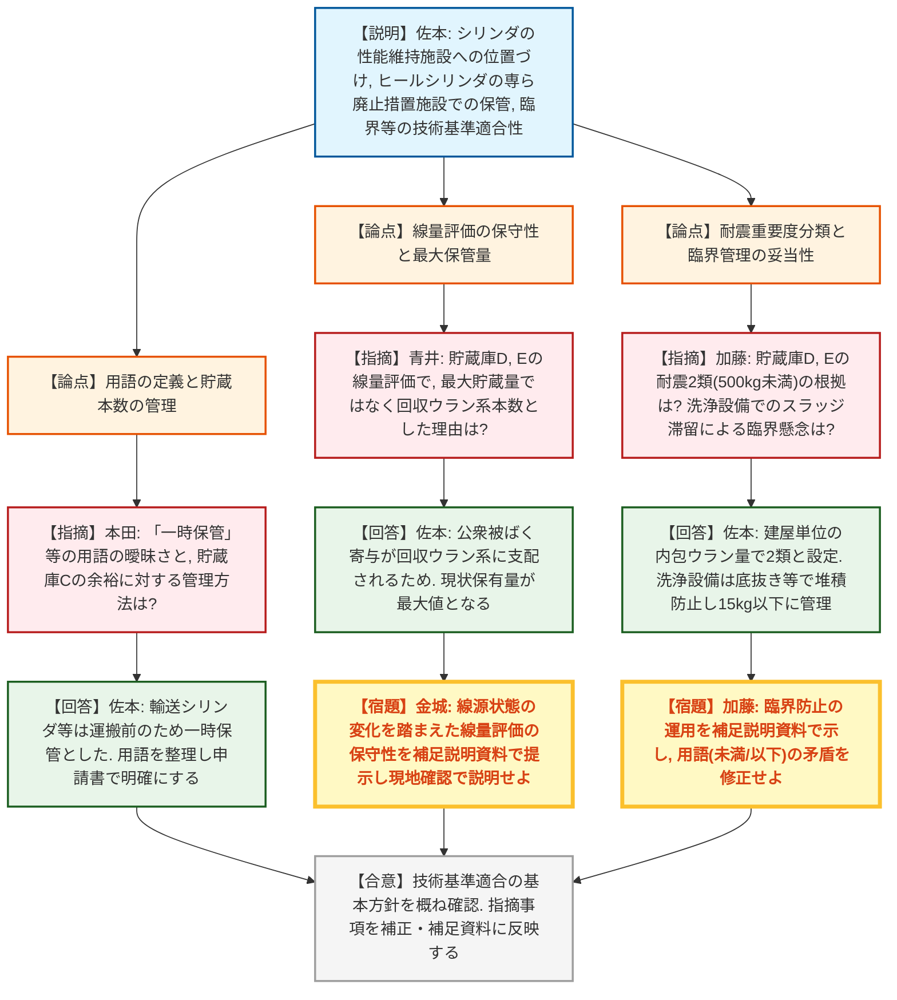
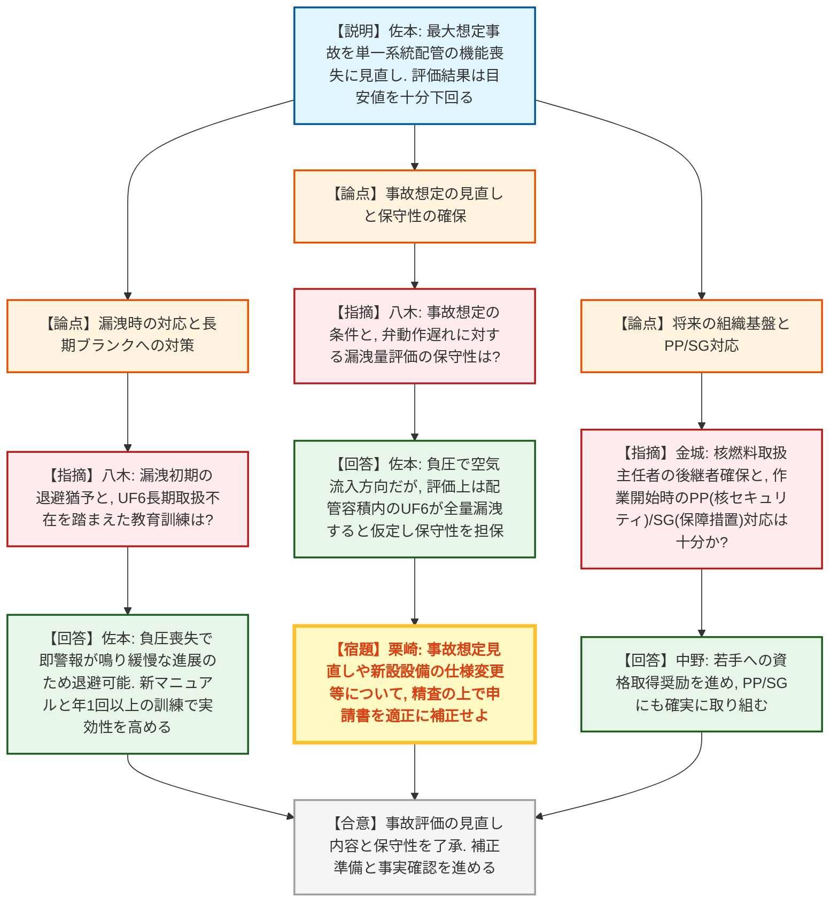

# 第48回核燃料施設等の廃止措置計画に係る審査会合（令和8年7月10日）
> 出典 : https://youtube.com/live/rj6ExGFCIS0?si=LEvSW-STLgch1unQ

## 会合の概要
* **シリンダの保管管理・譲り渡しプロセスの厳格化と明確化**
  JAEA人形峠環境技術センターの廃止措置において、使用施設由来の六フッ化ウラン(UF6)内包シリンダを加工施設の性能維持施設に位置づけ、他の事業者へ譲り渡す方針が示された。規制側は「一時保管」や「貯蔵」といった用語の使い分けの曖昧さを指摘し、各貯蔵庫における本数制限や線量評価の保守性について、保安規定に基づく明確な管理と根拠の提示を強く求めた。
* **UF6漏洩事故評価の見直しと補正の確実な反映**
  詰め替え設備等における最大想定事故の想定が「全配管の機能喪失」から「内包量が最大となる単一系統配管の機能喪失」に見直された。規制側は、負圧環境を考慮した評価の保守性に一定の理解を示したものの、申請時点からの変更となるため、申請書への確実な補正反映を求めた。
* **長期ブランクを踏まえた教育訓練と現場管理の徹底**
  UF6の取り扱いが長期間行われていなかった実態を踏まえ、新たな設備導入に伴うマニュアルの新規作成や、漏洩時の防護具（半面マスク等）着用・退避、HF暴露に対する緊急医療体制の構築について、実効性のある教育訓練の実施が求められた。また、核燃料取扱主任者の後継者育成や、核セキュリティ(PP)・保障措置(SG)の確実な対応など、廃止措置を長期にわたり安全に完遂するための組織的基盤の維持が要請された。

---

## 議題ごとの詳細整理

### 【前回審査会合におけるコメント回答等】
* **議論の背景と論点:**
  前回の審査会合で指摘された、使用施設と加工施設間におけるシリンダの移動・保管の法的な位置づけ、およびそれに伴う閉じ込め・臨界・遮蔽等の技術基準適合性が論点となった。特に、各貯蔵庫での本数制限の管理方法と、線量評価の前提条件（回収ウラン系ヒールシリンダの扱い）の妥当性が焦点となった。

* **質疑応答（詳細）:**
    * 【説明者側】佐本（JAEA）
      使用施設のシリンダは照合検査等を経て加工施設の性能維持施設に位置づけ、有価物として譲り受ける。大部分のヒールシリンダは貯蔵庫D・Eを「専ら廃止措置のために導入する施設として供用」し一時保管する。技術基準（臨界、地震、閉じ込め、遮蔽）への適合性も確認した。
    * 【規制側】本田（規制庁）
      貯蔵庫Cで数日間待機することや、ハンドリング建屋での長期の滞在を「一時保管」と表現しているが、用語の使い分けは適切か。申請書の中で「貯蔵」や「保管廃棄」など正しい記載を検討してほしい。
    * 【説明者側】佐本（JAEA）
      輸送シリンダになるものは貯蔵施設に位置づけていないため、運搬までの期間を一時保管と整理した。今後、補正の中で用語を適正に整理する。
    * 【規制側】本田（規制庁）
      貯蔵庫Cにおける30Bシリンダの貯蔵設計本数と、保安規定での管理方法について補足説明資料で示してほしい。
    * 【説明者側】佐本（JAEA）
      承知した。申請書の中で説明を加える。
    * 【規制側】青井（規制庁）
      貯蔵庫D・Eにおける公衆被ばく線量評価において、最大貯蔵量ではなく、回収ウラン系のヒールシリンダ本数で評価した理由は何か。また、その本数を超えない管理はどう行うか。
    * 【説明者側】佐本（JAEA）
      公衆被ばくへの寄与は、子孫核種（Tl-208等）からのガンマ線を放出する回収ウラン系が大部分を占め、天然・劣化ウランの影響は小さいため。既に廃止措置段階であり、現状保有している回収ウラン系シリンダの本数が最大値となる。この本数を保安規定の第6の1表に明記して管理する。
    * 【規制側】金城（規制庁）
      線源の状態が時期によって変わることも踏まえ、線量評価の保守性を丁寧に補足説明資料で説明し、現地確認時にも整合した説明を求める。
    * 【説明者側】佐本（JAEA）
      承知した。現地確認の準備も進める。
    * 【規制側】加藤（規制庁）
      貯蔵庫D・Eの耐震重要度分類について、ヒールシリンダ内のウランは1〜5kg程度であり、既許可の分類では第3類（5kg未満）に該当するのではないか。なぜ第2類（500kg未満）と分類したのか。
    * 【説明者側】佐本（JAEA）
      シリンダ単体ではなく、貯蔵庫（建屋）単位で内包するヒールシリンダの合計ウラン量で管理するため、500kgウラン未満として第2類と整理している。
    * 【規制側】加藤（規制庁）
      シリンダ洗浄設備について、スラッジがドラム缶に収納されるまでの設備内滞留による臨界の懸念はないか。また、資料中の「15kg未満」と「15kg以下」の混在や、「15kgを超える場合」という表現の矛盾を修正してほしい。
    * 【説明者側】佐本（JAEA）
      洗浄は水や蒸気で行い、底抜きやフラッシングにより堆積しない設計。事前の秤量と組み合わせで15kgウラン以下に管理する。用語の使い分けは適正に行い、「超える場合」については、超えない範囲でドラム缶を交換する意図であることを明確にする。

* **結論と宿題事項（アクションアイテム）:**
    * **決定事項:** シリンダの性能維持施設への位置づけや、技術基準適合性の基本方針については概ね理解が得られた。
    * **宿題事項:** 
      1. 「一時保管」等の用語を適正に整理し、各貯蔵庫における本数制限や運用管理について申請書および保安規定の補正を確実に行うこと。
      2. 貯蔵庫D・Eの線量評価の保守性、およびシリンダ洗浄設備のクリーンアップ方法・臨界防止の運用について、補足説明資料を提出し、現地確認時に適切に説明すること。
      3. 遮蔽評価において、従事者の線量限度（5年間100mSv、1年間50mSv）を正確に記載すること。

---

### 【事故時の安全評価】
* **議論の背景と論点:**
  UF6詰め替え設備における最大想定事故の見直し（全配管の機能喪失から、単一系統の機能喪失へ）の妥当性、および負圧環境下における漏洩挙動の保守性が論点となった。また、UF6の取り扱いに関する長期ブランクを踏まえた教育訓練の実効性確保が議論された。

* **質疑応答（詳細）:**
    * 【説明者側】佐本（JAEA）
      最大想定事故を「発生槽から回収槽への内包UF6量が最も多い単一系統配管(40m, 65A)での閉じ込め機能喪失」に見直した。漏洩時、周辺監視区域境界の最大実効線量は 5.3E-3 mSv と目安値(5mSv)を大きく下回る。配管内は負圧であり、インターロックによる自動弁閉止でUF6は配管内に隔離され、保温材により漏洩は緩慢となる。
    * 【規制側】八木（規制庁）
      事故想定が申請時点から異なるため、申請書の補正が必要。弁の動作遅れを考慮した漏洩量想定でも十分な保守性があるか。
    * 【説明者側】佐本（JAEA）
      負圧のため空気は流入方向であり本来配管内に留まるが、評価上は配管容積内のUF6が一度に全量管理区域内に漏洩すると仮定しており、保守性は確保されている。
    * 【規制側】八木（規制庁）
      漏洩初期の退避において、防護具着用の時間的猶予はどの程度あるか。
    * 【説明者側】佐本（JAEA）
      負圧異常により空気が流入し始めた時点で警報が発報する。漏洩進展は緩やかであり、作業員は携帯する半面マスクやゴーグルを着用して速やかに退避可能である。
    * 【規制側】八木（規制庁）
      長期間UF6の取り扱いがなかったが、再教育や漏洩事故時の教育訓練はどう行っていくか。
    * 【説明者側】佐本（JAEA）
      新規設備導入にあたり対応マニュアルを新規作成する。HF対策の緊急医療薬剤や防護具を拡充し、保安規定に基づく年1回以上の非常事態訓練で実効性を向上させる。
    * 【規制側】栗崎（規制庁）
      事故評価見直し等の補正を確実に行うこと。また、参考資料に示された新設・追加設備の仕様変更等に誤りがないか再度精査すること。
    * 【説明者側】佐本（JAEA）
      現状を精査し、適正に補正を行う。
    * 【規制側】金城（規制庁）
      核燃料取扱主任者のような有資格者は、今後の長期スパンを見据えて十分確保されているか。また、PP（核セキュリティ）とSG（保障措置）の対応もしっかりお願いしたい。
    * 【説明者側】中野（JAEA）
      現在の主任者は高齢だが、後継年齢層の資格取得者もおり、若手への取得奨励も進めている。PP・SGについてもしっかり取り組む。

* **結論と宿題事項（アクションアイテム）:**
    * **決定事項:** 見直し後の事故評価の前提条件および保守性、初期対応の方針について了承された。
    * **宿題事項:** 
      1. 最大想定事故の見直し内容、および設備仕様変更等の内容を精査し、廃止措置計画変更認可申請書へ正確に補正反映すること。
      2. 新規マニュアルの整備および年1回以上の非常事態訓練を通じて、UF6漏洩時の事故対応の実効性を確保すること。

---

## 論理構造の可視化（Mermaid）

### 【前回審査会合におけるコメント回答等（資料1）】

### 【事故時の安全評価（資料2）】

