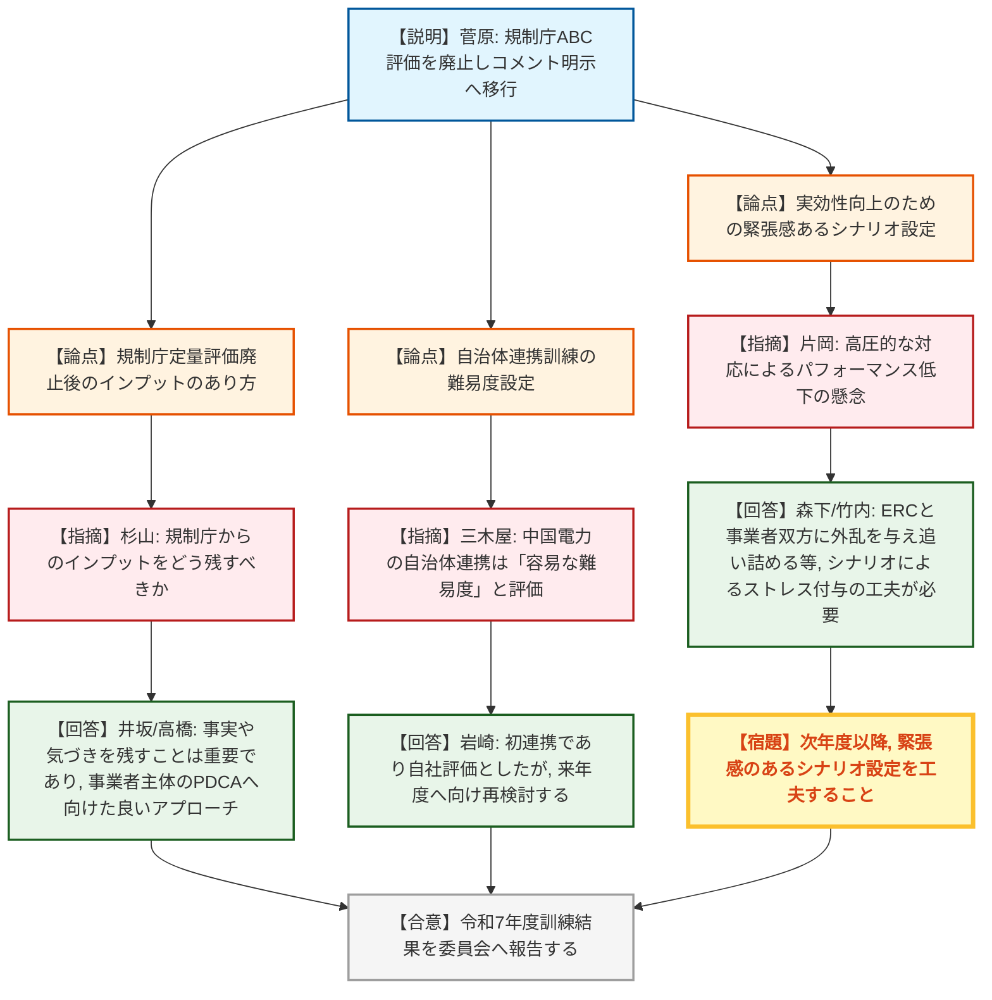
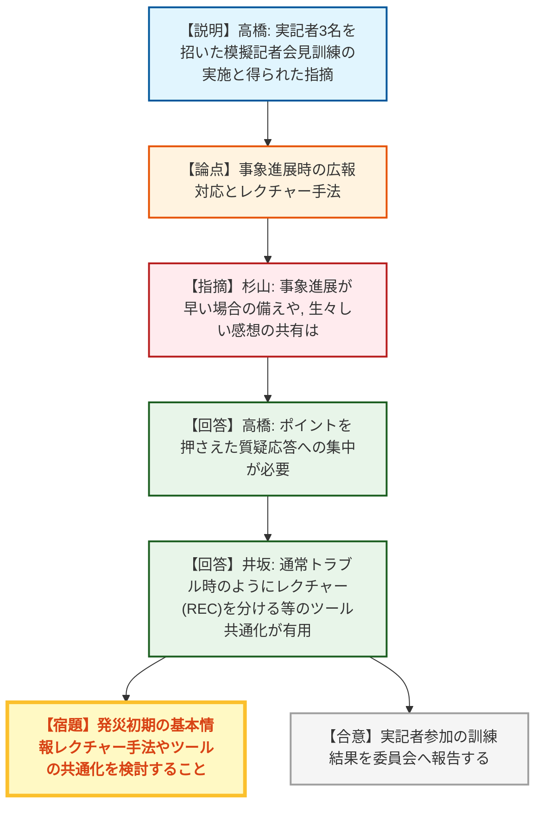
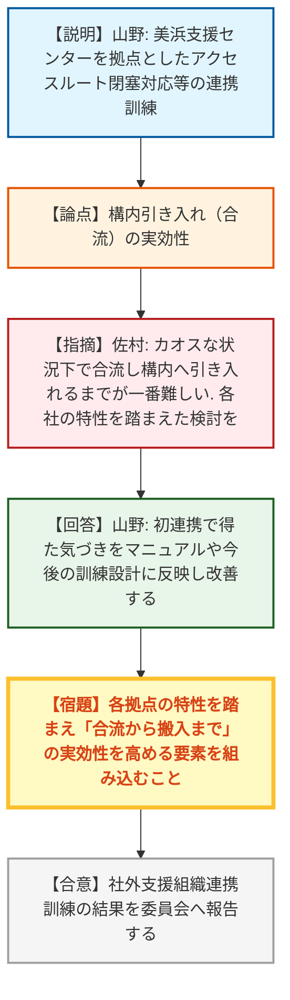
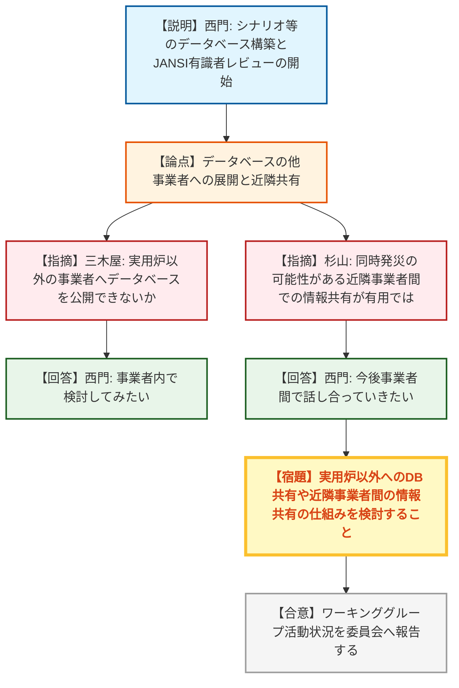
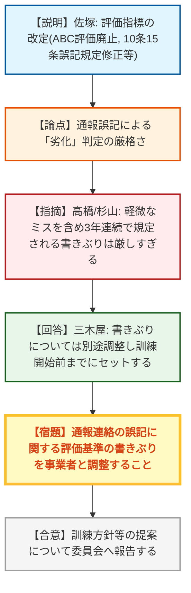
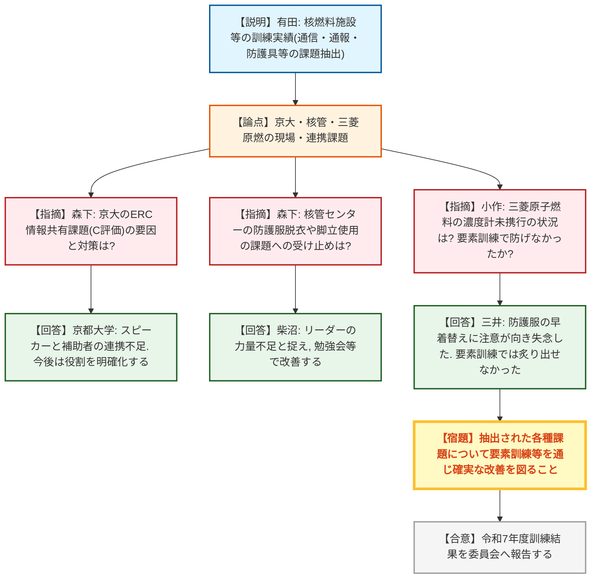
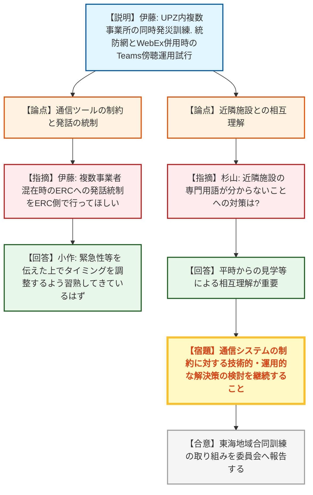
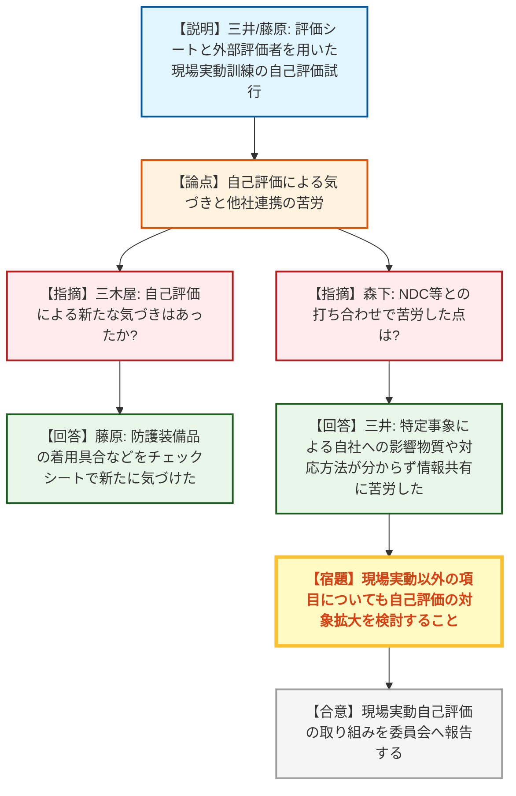
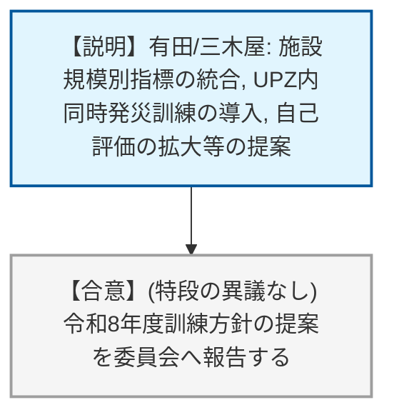

# 第18回原子力事業者防災訓練報告会（令和8年7月13日）
> 出典 : https://youtube.com/live/0AKpWasi8Mo?si=oUVsnTjbHY2At-l0

## 会合の概要
* **事業者主体の訓練評価への移行とPDCAサイクルの自律化の推進**
  規制庁によるABC評価を段階的に廃止し、事業者自身の自己評価と気づきを主軸とする枠組みへの移行が確認された。現場実動訓練等の自己評価の試行を通じて、各社が自律的に課題を抽出し改善につなげる姿勢が評価された。
* **実戦的でストレスフルな環境下での情報共有・連携の実効性検証**
  実記者を招いた広報訓練や、複数事業所（最大リスク施設のUPZ内等）の同時発災シナリオなど、より緊張感を伴う訓練が実施された。発災時の混乱（カオス）の中での合流・搬入の難しさや、ERCへの発話タイミングの調整など、実践的な課題が浮き彫りとなった。
* **通信ツールの技術的課題と運用上の工夫の共有**
  「統防網」と「WebEx」の併用における音声のハウリングや情報分断の課題に対し、Teamsを傍聴用として介在させるなどの工夫が共有された。システムの根本的な改善は次期システムに委ねられるものの、現行システム下での運用ルール（緊急時の発話要領等）の習熟が求められた。

---

## 議題ごとの詳細整理

### 【第1部：実用発電用原子炉対象】

### 【議題1】実用発電用原子炉の令和7年度訓練結果について
* **議論の背景と論点:**
  令和7年度の訓練結果の報告。今回から規制庁によるABC評価を廃止し、事業者評価のみとし、規制庁からはコメント（気づき事項）を明示する形式への移行の是非とそのあり方が論点となった。

* **質疑応答（詳細）:**
    * 【説明者側】菅原・三木屋（規制庁）
      各社の訓練は概ね適切に実施された。今回から規制庁のABC評価をやめ、コメントを明示する方式とした。また、中国電力の指標10-1（自治体との通信連携の難易度）については、容易な難易度であったと評価している。
    * 【規制側】杉山（規制庁）
      定量評価廃止について、規制庁側からのインプットをどう残すべきか事業者の意見を聞きたい。
    * 【説明者側】井坂（関西電力） / 高橋（東京電力HD）
      規制庁からのコメントとして事実関係や気づきを残してもらうことは非常に重要であり、事業者主体でPDCAを回すための一歩進んだ良いアプローチであると捉えている。
    * 【説明者側】岩崎（中国電力）
      自治体との実連携が初めてであったため自社評価として設定したが、難易度については来年度に向けて再度検討する。
    * 【規制側】森下（規制庁）
      実効性向上のため、今回うまくいかなかったことを次回の計画シナリオに組み込んで回すやり方も提案したい。
    * 【規制側】竹内（規制庁） / 片岡（JANSI） / 森下（規制庁）
      緊迫感を持たせるための規制庁側の対応（高圧的な態度等）について、ストレスでパフォーマンスが落ちるのも問題であり、ERCと事業者の双方に外乱（要求）を与えて追い詰められるシナリオにするなど、シナリオ設定で緊張感を生む工夫が必要との認識が共有された。

* **結論と宿題事項（アクションアイテム）:**
    * **決定事項:** 令和7年度の訓練結果について、委員会へ報告する準備を進める。
    * **宿題事項:** 次年度以降、実効性を高めるための緊張感のあるシナリオ設定（ERCと事業者の双方に負荷をかける等）を工夫すること。

### 【議題2】原子力防災訓練への実記者の参加について
* **議論の背景と論点:**
  東京電力HDが実施した、実記者を招いての広報対応（模擬記者会見）訓練の成果と課題。有事において記者が求める情報レベルと、事業者の説明のあり方が論点となった。

* **質疑応答（詳細）:**
    * 【説明者側】高橋（東京電力HD）
      福島第一・第二の同時発災シナリオで実記者3名を招き訓練を実施した。事象全体の説明に30分かかったが、記者からは「ポイントを10分程度で説明し、早めに質疑応答に移る方がありがたい」等の指摘を得た。
    * 【規制側】三木屋（規制庁）
      社内で意見が割れている状況をあえて記者に問うなど、工夫が見られ非常に良い訓練だった。
    * 【規制側】杉山（規制庁）
      実記者にも有事の経験を積んでもらう側面がある。事象進展が早い場合の備えとして、基本事項は別途用意しておくなどの工夫が必要。また、他社や地元の記者も巻き込んで実施してほしい。
    * 【説明者側】高橋（東京電力HD） / 井坂（関西電力）
      事象が動いている断面ではポイントを押さえた質疑応答が重要。通常のトラブル時と同様に、基本情報のレクチャー（REC）を別に行うなどのツールやルールを規制庁・事業者間で共通化できると円滑になる。シニア記者の参加継続には地域差や課題があるため相談しながら進めたい。

* **結論と宿題事項（アクションアイテム）:**
    * **決定事項:** 実記者参加の訓練結果について、委員会へ報告する準備を進める。
    * **宿題事項:** 発災初期の基本情報のレクチャー手法やツールの共通化について、規制庁・事業者間で検討すること。

### 【議題3】原子力事業所災害対策支援拠点における社外支援組織との連携訓練
* **議論の背景と論点:**
  関西電力が実施した、美浜原子力緊急事態支援センターを災害対策支援拠点とした連携訓練の成果。発災時のアクセスルート閉塞等の状況下での、資機材と要員の搬入・合流の実効性が論点となった。

* **質疑応答（詳細）:**
    * 【説明者側】山野（関西電力）
      美浜支援センターを拠点とし、構内での土砂崩れやクレーン転倒によるアクセスルート閉塞をマルファンクションとして付与。大型車両の待機と小型車両でのピストン輸送など、迂回ルートや搬送計画を策定し連携する訓練を実施した。
    * 【規制側】佐村（規制庁）
      発災時のカオスな状況下では、会ったこともない支援要員と合流し、構内へ引き入れるまでが一番難しい。四国の急な坂道など各発電所のチョークポイントを考慮し、引きずり込むまでの要素を自社の訓練に反映してほしい。
    * 【説明者側】山野（関西電力）
      初めての連携で多くの気づきを得た。マニュアルや教育、今後の訓練設計に反映して改善に努める。

* **結論と宿題事項（アクションアイテム）:**
    * **決定事項:** 社外支援組織との連携訓練の結果について、委員会へ報告する準備を進める。
    * **宿題事項:** 各社は、自社拠点の地理的特性やチョークポイントを踏まえ、支援要員との「合流から構内搬入まで」の実効性を高める訓練要素を組み込むこと。

### 【議題4】訓練経験共有ワーキンググループの活動状況報告
* **議論の背景と論点:**
  事業者主体で運営される「訓練経験共有ワーキンググループ」による、シナリオ等のデータベース化と活用状況。この枠組みを実用炉以外の核燃料施設等へ展開できるかが論点となった。

* **質疑応答（詳細）:**
    * 【説明者側】西門（四国電力）
      シナリオ、マルファンクション、第三者レビュアー、模擬記者会見の各データベースを構築し、各社が訓練設計に活用している。JANSI有識者によるレビューも開始し、意見交換会を通じて課題解決の一助となっている。
    * 【規制側】三木屋（規制庁）
      非常に有益なデータベースである。実用炉以外の核燃料施設等の事業者にも、参考として公開・共有することは可能か。
    * 【説明者側】西門（四国電力）
      データベースの拡充を続けつつ、実用炉以外の施設への展開についても事業者内で検討してみたい。
    * 【規制側】杉山（規制庁）
      同時発災の可能性がある近隣（同一エリア）の事業者間での情報共有が、いざという時に役立つのではないか。
    * 【説明者側】西門（四国電力）
      現時点ではそこまでできていないが、今後事業者の中で話し合っていきたい。

* **結論と宿題事項（アクションアイテム）:**
    * **決定事項:** ワーキンググループの活動状況について、委員会へ報告する準備を進める。
    * **宿題事項:** 実用炉以外の事業者へのデータベース共有の可能性や、近隣事業者間での情報共有の仕組みについて、事業者間で検討を進めること。

### 【議題5】訓練評価指標の見直し及び令和8年度訓練方針に係る規制庁からの提案
* **議論の背景と論点:**
  訓練のあり方意見交換会を踏まえた評価指標の改定案。ABC評価の廃止、指標10-1（難度）の要素整理、および通報連絡の誤記等に対する評価の厳格化の表現が論点となった。

* **質疑応答（詳細）:**
    * 【説明者側】佐塚（規制庁）
      指標1（中期計画）にPDCA確認を明記し、ABC評価をやめ有無の確認へ変更した。指標10-1（難度）には8つの要素を例示として追加した。また、10条・15条通報に限らず、全ての通報連絡の誤記等が3年連続で続いた場合の規定を修正する提案を行った。
    * 【規制側】川津（九州電力）
      提案の大部分が反映されており感謝する。指標10-1の「経験」の要素については、訓練計画に影響するため、今後の面談の中でその扱いを議論していきたい。
    * 【説明者側】三木屋（規制庁）
      指標10-1の要素はあくまで例示であり、「経験」の要素についても計画段階で議論させていただきたい。
    * 【説明者側】高橋（東京電力HD） / 杉山（規制庁）
      通報連絡の「誤記」について、軽微なケアレスミスを含めて3年連続でどかしらの文書にミスがあっただけで「劣化」とみなされるような書きぶりは、非常に厳しすぎるため議論が必要ではないか。
    * 【説明者側】三木屋（規制庁）
      書きぶりについては別途調整し、訓練開始前までに再セットすることとしたい。

* **結論と宿題事項（アクションアイテム）:**
    * **決定事項:** 評価指標の見直しおよび訓練方針の提案について、委員会へ報告する準備を進める。
    * **宿題事項:** 通報連絡の誤記に関する評価基準（3年連続の規定等）の書きぶりについて、厳しすぎる表現とならないよう事業者と別途調整を行うこと。

---

### 【第2部：核燃料施設等対象】

### 【議題6】核燃料施設等の令和7年度訓練結果について
* **議論の背景と論点:**
  原科研などのリスクの大きい施設と、その他の核燃料施設等における令和7年度訓練実績の報告。通信ツールの不備による情報伝達の遅れや、現場実動における防護具・機材使用の課題が論点となった。

* **質疑応答（詳細）:**
    * 【説明者側】有田（規制庁）
      原燃等の大規模施設は概ねA評価であったが、統防網とWebExのやり取りの傍受ができず報告が妨げられる課題があった。小規模施設では、通報の遅れや防護具着用の不備等の課題が抽出された。
    * 【規制側】森下（規制庁）
      京都大学においてERCプラント班との情報共有に課題（C評価）があったが、要因と対策は？
    * 【説明者側】京都大学
      メインスピーカーと補助者の連携が崩れ、補助者が進展予測にリソースを割かれたため。今後は役割を明確化し、単独で発話することがないようにする。
    * 【規制側】小作（規制庁）
      要素訓練の段階でその分担のズレは炙り出せなかったのか？
    * 【説明者側】京都大学
      ブラインド訓練であったため、事前の細かい調整が難しかった。
    * 【規制側】森下（規制庁）
      核管センターの現場実動訓練で防護服の脱衣方法や脚立の使用に課題があったが受け止めは？
    * 【説明者側】柴沼（核管センター）
      高さ不足の脚立での作業や手順違いがあり、リーダーの力量付与不足と捉えている。勉強会等で改善する。
    * 【規制側】小作（規制庁）
      三菱原子燃料の現場実動でフッ化水素濃度計の未携行があったが、状況は？
    * 【説明者側】三井（三菱原子燃料）
      防護服をいかに早く着るかに注意が向き、濃度計の携行を失念してしまった。要素訓練だけでは炙り出せなかった点である。
    * 【規制側】有田（規制庁）
      日本核燃料開発（NFD）はリエゾン活動の訓練がなかったが、要素訓練でも構わないので対応してほしい。
    * 【説明者側】日本核燃料開発
      今年度は要素訓練として組み入れる。

* **結論と宿題事項（アクションアイテム）:**
    * **決定事項:** 核燃料施設等の令和7年度訓練結果について、委員会へ報告する準備を進める。
    * **宿題事項:** 抽出された課題（防護具着用、通信連携、リエゾン活動等）について、要素訓練等を通じて確実な改善を図ること。

### 【議題7】東海地域合同防災訓練での取り組みについて
* **議論の背景と論点:**
  最大リスク施設のUPZ内に所在する複数事業所（原科研、東大、核管センター）の同時発災を想定した訓練の先行実施事例。統防網とWebExが混在する環境下での情報共有のあり方が論点となった。

* **質疑応答（詳細）:**
    * 【説明者側】伊藤（JAEA）
      東海NOA協定の枠組みやホットラインを活用し、隣接事業者間で情報を共有した。通信手段については、統防網とWebExの音声ミキシングができないため、Teamsを介してマイクをオンにし、他事業者のやり取りを傍聴する運用を試行し、発話タイミングの調整に成功した。
    * 【規制側】三木屋（規制庁）
      統防網とWebExの併用不可は現状のシステム上の制約であり、次期システムでの改善を要望として持っている。
    * 【説明者側】伊藤（JAEA）
      複数事業者が混在する場合、どの事象が重要かなど、ERC側で発話の統制（優先順位づけ）をしてもらえるとやりやすい。
    * 【規制側】小作（規制庁）
      発話の統制というより、これまでの訓練で「緊急性や内容の程度感を伝えた上でタイミングを調整する」感覚を習熟してきていると考えており、その運用で対応してほしい。
    * 【規制側】杉山（規制庁）
      近隣施設の専門用語（アルファベットの系統名等）が分からないこともあるため、平時からの見学等による相互理解を深めることが重要。

* **結論と宿題事項（アクションアイテム）:**
    * **決定事項:** 東海地域合同防災訓練の取り組み結果について、委員会へ報告する準備を進める。
    * **宿題事項:** 複数事業者同時発災時における通信システムの制約（統防網とWebEx）に対する技術的・運用的な解決策の検討を継続すること。

### 【議題8】現場実動訓練の自己評価への取り組みについて
* **議論の背景と論点:**
  現場を熟知した事業者が自ら評価を行う「自己評価」の試行的な取り組みの成果。評価シートの導入による課題抽出の精度向上が論点となった。

* **質疑応答（詳細）:**
    * 【説明者側】三井（三菱原子燃料） / 藤原（GNFJ）
      評価シートを作成し、外部評価者（隣接事業者等）を交えて評価を実施した。避難誘導の漏れ、濃度計未携行、防護装備品の着用不備などを課題として抽出し、マニュアルへの反映や仕組み作りを検討している。
    * 【規制側】三木屋（規制庁）
      自己評価によって得られた新たな気づき（社内的フィードバック）はあるか。
    * 【説明者側】三井（三菱原子燃料） / 藤原（GNFJ）
      三菱原子燃料：規制庁目線を加えた評価シートは新しかったが、具体的な気づきはパッと出てこない。GNFJ：細かな防護装備品の着用具合などをチェックシートで新たに気づくことができた。
    * 【規制側】森下（規制庁）
      NDC等との打ち合わせや準備で苦労した点は？
    * 【説明者側】三井（三菱原子燃料）
      NDCの特定事象による自社への影響物質や対応方法が分からず、情報共有ツールの選定や他班への展開に非常に苦労した。

* **結論と宿題事項（アクションアイテム）:**
    * **決定事項:** 現場実動訓練の自己評価への取り組み結果について、委員会へ報告する準備を進める。
    * **宿題事項:** 現場実動以外の項目についても、自己評価の対象を拡大していくよう各事業者で検討すること。

### 【議題9】核燃料施設等の令和8年度訓練に係る原子力規制庁からの提案について
* **議論の背景と論点:**
  施設規模に基づく評価指標の統合（大きい施設と小さい施設）、評価方法の変更（ABC評価から有無の確認等）、およびUPZ内同時発災訓練の導入提案が論点となった。

* **質疑応答（詳細）:**
    * 【説明者側】有田・三木屋（規制庁）
      令和8年度から施設規模による指標を統合し、要件を整理する。10条15条通報の正確性等を独立した指標に格上げする。また、UPZ内での同時発災訓練の実施、現場実動以外の項目への自己評価の拡大、広報対応訓練の継続、通報連絡の迅速性・正確性の追求を提案する。
    * 【規制側・事業者側】
      （特段の質問や異議はなし）

* **結論と宿題事項（アクションアイテム）:**
    * **決定事項:** 令和8年度の核燃料施設等訓練方針について、委員会へ報告する準備を進める。

---

## 論理構造の可視化（Mermaid）

### 【第1部】
### 【議題1】実用発電用原子炉の令和7年度訓練結果について

### 【議題2】原子力防災訓練への実記者の参加について

### 【議題3】原子力事業所災害対策支援拠点における社外支援組織との連携訓練

### 【議題4】訓練経験共有ワーキンググループの活動状況報告

### 【議題5】訓練評価指標の見直し及び令和8年度訓練方針に係る規制庁からの提案

### 【第2部】
### 【議題6】核燃料施設等の令和7年度訓練結果について

### 【議題7】東海地域合同防災訓練での取り組みについて

### 【議題8】現場実動訓練の自己評価への取り組みについて

### 【議題9】核燃料施設等の令和8年度訓練に係る原子力規制庁からの提案について

