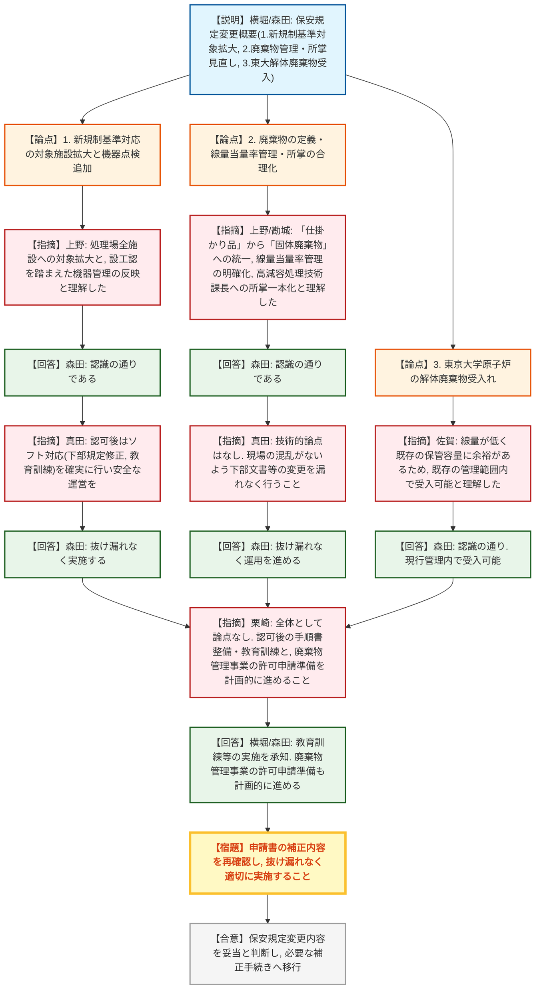

# 第588回核燃料施設等の新規制基準適合性に係る審査会合（令和8年7月14日）
> 出典 : https://youtube.com/live/9zwMuQyUa58?si=QRB1vo6dvw_BXYkq

## 会合の概要
* **保安規定変更内容の妥当性を確認し、円滑に合意形成**
  JAEA原子力科学研究所の放射性廃棄物処理場に係る保安規定変更について、①新規制基準対応施設の拡大、②廃棄物管理の適正化・所掌変更、③東京大学原子炉の解体廃棄物受け入れの3つの論点に分けて審議が行われた。規制側からの確認に対し、JAEAは的確に回答し、技術的な懸案事項はなく円滑に合意が形成された。
* **運用移行に向けたソフト面（手順書・教育訓練）の対応の徹底要求**
  ハード面（施設・設備）の対応が完了し保安規定に反映される段階となったことから、規制側は、認可後に伴う下部規定（手順書）の整備や業務従事者への教育訓練といったソフト面の確実な実施を強く求めた。
* **今後の手続き（補正および廃棄物管理事業の許可申請）の計画的実施**
  軽微な補正事項について抜け漏れのない確実な対応が求められるとともに、本件の新規制基準対応が完了した後に予定されている「廃棄物管理事業の許可申請」に向けて、計画的に準備を進めるよう規制側から念押しがなされた。

---

## 議題ごとの詳細整理

### 【議題1】日本原子力研究開発機構原子力科学研究所原子炉施設（放射性廃棄物の廃棄施設）保安規定変更認可申請について
* **議論の背景と論点:**
  JAEA原子力科学研究所の放射性廃棄物処理場について、設工認が完了したことを踏まえた保安規定の変更。論点は大きく3つに分類され、①新規制基準対応の対象施設拡大と機器点検の追加、②廃棄物の「仕掛かり品」から「固体廃棄物」への定義変更・線量当量率の管理追加・所掌の合理化、③東京大学原子炉（廃止措置）からの解体廃棄物受け入れの妥当性が確認された。

* **質疑応答（詳細）:**
    * 【説明者側】横堀・森田（JAEA）
      保安規定変更の概要を説明。一部使用承認を受けていた施設（排水貯留ポンド等）から処理場全体へ新規制基準対応の範囲を拡大し、外部火災・竜巻・津波等の対策や、通信連絡設備・消火設備・漏えい警報装置等の点検を追加した。また、「仕掛かり品」を「固体廃棄物」に定義し直し、建屋式保管廃棄施設の表面線量当量率を320μSv/h以下とする管理を追加。解体分別保管棟の所掌を高減容処理技術課長に一体化し、東大原子炉の解体廃棄物を受け入れる旨を追加した。
    * 【規制側】真田（規制庁）
      論点を「①新規制基準の適用拡大」「②仕掛かり品定義見直し・線量当量率管理・所掌変更」「③東大解体廃棄物の受入れ」の3つに整理して確認を進める。
    * 【規制側】上野（規制庁）
      論点①について、新規制基準の適用対象を処理場の全施設に拡大し、設工認の内容を踏まえて機器の点検や数量・維持管理等が適切に保安規定に反映されていると理解してよいか。
    * 【説明者側】森田（JAEA）
      認識の通りである。
    * 【規制側】真田（規制庁）
      処理場はソフトとハードを合わせ持って安全性を確保する施設である。認可後は下部規定の修正や業務従事者への教育訓練をしっかり行い、安全な施設運営を行うこと。
    * 【説明者側】森田（JAEA）
      下部規定等のソフト対応についても抜け漏れなく実施する。
    * 【規制側】上野（規制庁）
      論点②について、他の原子炉施設の運用に合わせて「仕掛かり品」を「固体廃棄物」に統一したこと、および建屋式保管廃棄施設の線量当量率を320μSv/h以下に管理する運用を明確化したものと理解した。
    * 【説明者側】森田（JAEA）
      認識の通りである。
    * 【規制側】勘城（規制庁）
      解体分別保管棟の施設・区域管理について、保管室とそれ以外で分かれていた所掌を合理化の観点から高減容処理技術課長に一体化する変更と理解した。
    * 【説明者側】森田（JAEA）
      認識の通りである。
    * 【規制側】真田（規制庁）
      論点②についても技術的な論点はなく、下部文書等の変更を漏れなく行い、現場の混乱がないよう対応すること。
    * 【説明者側】森田（JAEA）
      抜け漏れなく運用を進める。
    * 【規制側】佐賀（規制庁）
      論点③について、東大の解体廃棄物を運転廃棄物と同様に受託処理することを明確にする変更と理解した。当該廃棄物は線量当量率が低く既存の措置で対応可能であり、保管容量に対しても十分余裕があるため、既存の管理範囲内で受け入れ可能と理解してよいか。また、予定している補正について抜け漏れがないよう改めて確認すること。
    * 【説明者側】森田（JAEA）
      現行の管理内で受け入れ可能であり、本数も十分余裕がある。補正内容についても再度確認し適切に行う。
    * 【規制側】栗崎（規制庁）
      全体として大きな論点はないと認識した。認可後には関連する手順書の整備と教育訓練を確実に行うこと。また、バックエンド監視チーム会合で議論していた「廃棄物管理事業の許可申請」に向けた準備を計画的に進めること。
    * 【説明者側】横堀・森田（JAEA）
      文書改訂や教育訓練の抜け漏れなき実施を承知した。廃棄物管理事業の許可申請についても、新規制基準対応後、計画的に準備を進める。

* **結論と宿題事項（アクションアイテム）:**
    * **決定事項:** 保安規定変更認可申請について、新規制基準の適用拡大、廃棄物管理規定の見直し、東大解体廃棄物の受け入れのいずれも妥当と判断され、大きな論点はないことが確認された。
    * **宿題事項:** 
      1. 申請書について、他に抜け漏れがないか再確認の上、適切に補正を実施すること。
      2. 保安規定認可後、下部規定（手順書）の整備と業務従事者への教育訓練を確実に実施し、現場での確実な運用を図ること。
      3. 本件対応完了後、「廃棄物管理事業の許可申請」に向けた準備を計画的に進めること。

---

## 論理構造の可視化（Mermaid）

### 【議題1】放射性廃棄物処理場に係る保安規定変更認可申請

