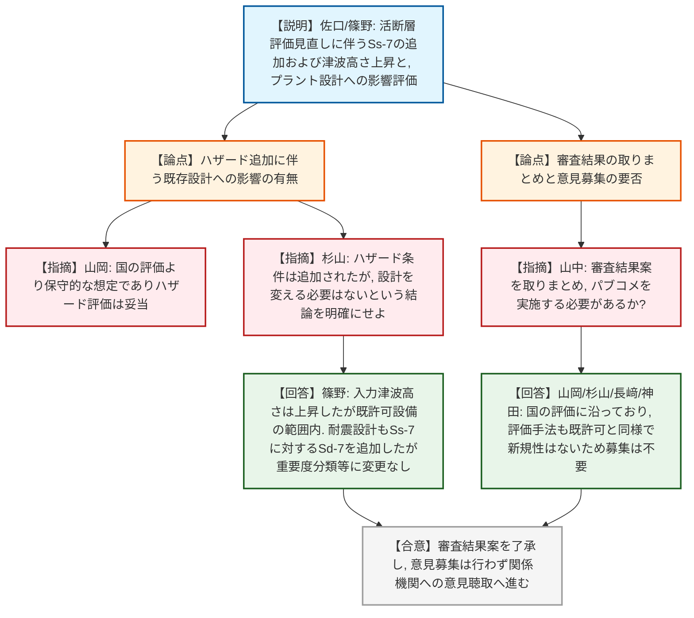
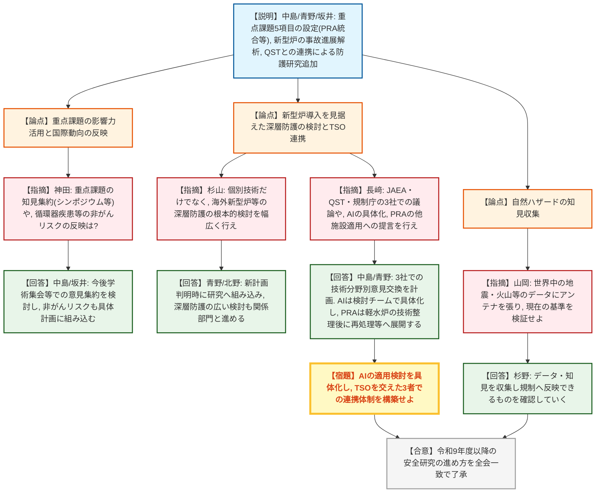
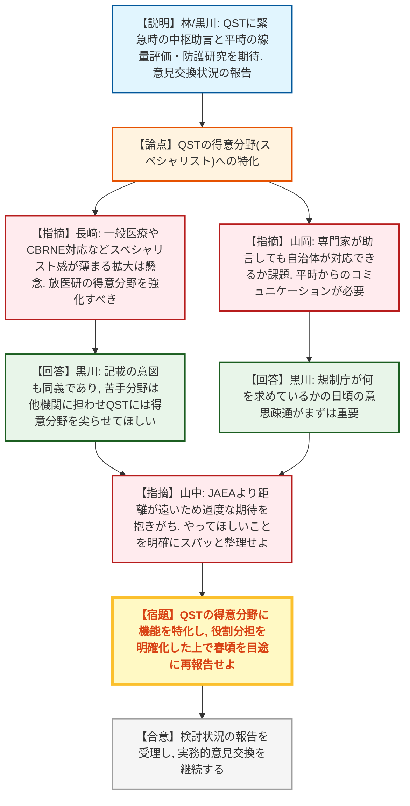

# 第21回原子力規制委員会（令和8年7月15日）
> 出典 : https://youtube.com/live/jlhN1JEf9oE?si=JTWdZGO0OdJvBWF8

## 会合の概要
* **玄海原子力発電所の設置変更許可申請における自然ハザードの最新知見の反映と審査完了**
  地震調査委員会による「日本海南西部の海域活断層の長期評価」の最新知見を踏まえ、基準地震動Ss-7の追加および基準津波の変更が行われた。これらが既許可の耐震・耐津波の基本方針や設備設計の範囲内に収まることが確認され、全会一致で審査結果案の取りまとめと意見募集（パブコメ）の省略が決定された。
* **令和9年度以降の安全研究実施方針とTSOとの連携強化**
  レベル1〜3のリスク評価（PRA）の統合や、海外の新型炉導入を見据えた深層防護の根本的検討など、先を見据えた安全研究の重点課題が設定された。また、JAEAやQSTといった外部TSO（技術的支援機関）と連携し、学術集会等を通じた知見の集約やプラットフォーム化を進める方針が確認された。
* **QST（量子科学技術研究開発機構）に求めるTSOとしての役割の明確化**
  QSTへの過度な期待（実務から助言、研究までの全方位対応）を戒め、強みである「被ばく線量評価（バイオアッセイ等）」や「放射線防護研究」など、QSTにしかできない専門分野を尖らせる方向での機能整理が求められた。緊急時において中枢への助言を効果的に行うため、日頃からの行政や自治体とのコミュニケーションの重要性が強調された。

---

## 議題ごとの詳細整理

### 【議題1】九州電力株式会社玄海原子力発電所の発電用原子炉設置変更許可申請書に関する審査の結果の案の取りまとめ
* **議論の背景と論点:**
  地震調査委員会（2022年）による日本海南西部の海域活断層の長期評価の公表を踏まえ、玄海原子力発電所における基準地震動および基準津波の再評価が行われた。ハザードの変更がプラントの既存の耐震・耐津波設計に与える影響の有無と、審査結果案の取りまとめ、および科学的・技術的意見の募集（パブコメ）の要否が論点となった。

* **質疑応答（詳細）:**
    * 【説明者側】中川（実用炉審査部門）
      本申請は平和目的以外の利用の恐れがなく、経理的基礎や品質管理体制にも変更がない。審査書案のポイントについてハザード側とプラント側から説明する。
    * 【説明者側】佐口（地震・津波審査部門）
      活断層（壱岐北東部・警固断層帯など）の評価を見直し、基準地震動Ss-7を追加した。Ss-7はSs-1と応答スペクトルは同じだが、長周期帯の応答が大きく継続時間が約3倍長い。地盤の支持力や周辺斜面の安定性はSs-7に対しても基準を満足する。基準津波についても、断層の連動を考慮し水位変動量が1.5〜2倍程度大きくなったが、評価は適切であることを確認した。
    * 【説明者側】篠野（地震・津波審査部門）
      Ss-7の追加に伴い弾性設計用地震動Sd-7を新たに設定する。津波に対しては、入力津波高さが上昇したものの、敷地北西側の岩盤部標高（TP+16m）が入力津波高さ（TP+14m）を上回るため、遡上波は到達せず流入しないことを確認した。
    * 【規制側】山岡委員
      国の評価に沿って評価しており、活断層の連動により断層が長くなり継続時間の長いSs-7が追加された。津波も国の評価より保守的な想定であり問題ないと整理できる。
    * 【規制側】杉山委員
      ハザード条件は追加されたが、「これまでの設計を変える必要はない」という結論が明確に説明されていなかったので、改めて説明を求める。
    * 【説明者側】篠野（地震・津波審査部門）
      入力津波高さは変更されたが既許可の設備対応の範囲内であり、津波の基本方針に変更はない。耐震設計についても重要度分類や荷重の組み合わせ等に既許可からの変更はないことを確認している。
    * 【規制側】山中委員長
      自然ハザードの新知見に対し、審査終了案件についても設置変更許可申請を出して審査する手順をとった。審査結果案の取りまとめと関係機関への意見聴取を実施することでよいか（全委員同意）。
    * 【規制側】山中委員長
      続いて、審査書案に対する科学的・技術的意見の募集の要否について意見を求める。
    * 【規制側】山岡委員・杉山委員・長﨑委員・神田委員
      国の長期評価を受け入れ、かつ保守的に扱っていること、評価手法も既許可と同様であり特段の新規性はないことから、意見募集は不要である。
    * 【規制側】山中委員長
      第2案（意見募集を行わない）で了承する。

* **結論と宿題事項（アクションアイテム）:**
    * **決定事項:** 玄海原子力発電所の設置変更許可申請に関する審査結果案を了承。原子力委員会および経済産業大臣への意見聴取を実施し、科学的・技術的意見の募集は行わないことを決定した。

---

### 【議題2】令和9年度以降の安全研究の進め方
* **議論の背景と論点:**
  令和9年度以降の安全研究の実施方針の策定。重点課題の設定（PRAの統合等）、海外の新型炉導入等を見据えた深層防護の検討、および外部TSO（JAEA、QST）との研究連携のあり方が論点となった。

* **質疑応答（詳細）:**
    * 【説明者側】中島（技術基盤課）
      重点課題として5課題を設定（レベル1〜3のPRAを統合）。JAEAやQSTと意見交換を実施し、TSO間で課題認識を共有して連携して対応することが重要である旨を記載した。
    * 【説明者側】青野（シビアアクシデント研究部門）
      リスク評価分野で、PRAの適用可能範囲や不確実さの整理、リスク情報活用の具体的方法の技術的知見を整理する。シビアアクシデント分野では、新型炉等の新設計を考慮した事故進展解析等を実施する。
    * 【説明者側】坂井（放射線・廃棄物研究部門）
      放射線防護分野において、被ばくモニタリングから意思決定に至る一連の防護措置の連携性を高める課題（O-1）を追加し、QSTの知見（バイオアッセイ等）を活かす。
    * 【規制側】神田委員
      国が重点課題として選定することには強い影響力がある。学術集会等でのシンポジウム等を通じて知見を集約するような取り組みは考えているか。また、以前指摘があった循環器疾患（非がん疾患）リスクの国際動向はどう反映されているか。
    * 【説明者側】中島・坂井（規制庁）
      重点課題の活用はこれまで不十分だったため、今後は学術集会等での意見集約などの活用を検討する。循環器疾患等の非がん疾患についてもコメントを踏まえて具体的な計画立案の中で進める。
    * 【規制側】長﨑委員
      QSTとの連携について、課題O-1はまだ課題抽出の段階であり熟度を期待するものではないと感じるが、QSTにとっても新たな挑戦となるのか。また、JAEA・QST・規制庁の3社での議論は予定されているか。AIについても「検討する」を超えた段階に進んでほしい。PRAについては他の施設への適用に向けた提言等も考えてほしい。
    * 【説明者側】坂井・中島・青野（規制庁）
      QSTとは検討の端緒についたばかりだが、QST特有の技術を組み込み企画を立案する。QSTとは大枠の意見交換を経て、JAEA・QSTを交えた技術分野ごとの意見交換会に持っていきたい。AIについては検討チームを立ち上げ、JAEA等にプラットフォーム的な働きをしてもらうことも検討中。PRAは軽水炉での評価技術を基礎とし、適用範囲や不確実さを整理した上で再処理施設等への技術の活用に繋げたい。
    * 【規制側】杉山委員
      「今後導入する可能性がある技術要素」について、海外の新型炉等を含め、根本的な深層防護の考え方に関する検討を幅広く行ってほしい。
    * 【説明者側】青野・北野（規制庁）
      目に見えている静的安全設備等を対象としつつ、新たな計画が出た段階で研究に組み込む。個別技術だけでなく、深層防護の概念や考え方を含めた広い検討も関係部門と相談して進める。
    * 【規制側】山岡委員
      ハザード関係について、世界中の地震や火山、地盤災害について常にアンテナを張り、現在の基準を検証してほしい。
    * 【説明者側】杉野（地震・津波担当）
      世界の大きな地震等からのデータ・知見を収集し、規制に反映できるものを確認していく。
    * 【規制側】山中委員長
      新しい分野の知見収集も必要だが、基盤的な研究力の維持が重要。情報収集・分析・発信の努力を続け、軌道修正しながら研究を進めてほしい。

* **結論と宿題事項（アクションアイテム）:**
    * **決定事項:** 令和9年度以降の安全研究の進め方について、全会一致で了承。
    * **宿題事項:** AI技術の規制への適用検討を具体化させること。また、学術集会等を活用した重点課題の知見集約や、JAEA・QSTを交えた3者での技術分野ごとの連携体制の構築を進めること。

---

### 【議題3】国立研究開発法人量子科学技術研究開発機構の役割・機能の在り方に関する検討状況
* **議論の背景と論点:**
  規制委員会とQST（放医研が中心）との関係において、QSTに求めるTSOとしての役割・機能の明確化に向けた意見交換の状況報告。QSTの得意分野（線量評価や防護研究）への特化と、一般医療やCBRNE対応などスペシャリスト感が薄まる領域への拡大の是非が論点となった。

* **質疑応答（詳細）:**
    * 【説明者側】林（放射線防護規格課）
      これまでの4回の意見交換を通じて、緊急時は中枢の意思決定部門への専門的な助言や情報発信を期待し、現場の実務は担わない方針。平時は放射線被ばく防護に関する研究、線量評価の専門性維持、放射線審議会のための調査研究等を期待。QSTの強みに重点化し、他機関との連携で機能を維持する考えである。
    * 【規制側】神田委員
      双方が共通の目的を持って意見交換できたことは有意義。QSTの実績は単発のものが多いが、外部TSOの技術基盤の維持にも留意し、ニーズとシーズのマッチングの議論を続けてほしい。
    * 【規制側】長﨑委員
      QSTといっても放射線医学（放医研）が中心であることを明確にすべき。被ばく医療から一般医療（多数の傷病者対応）への拡大やCBRNE対応など、スペシャリスト感が薄まる方向への拡大が懸念される。QSTにしかできない得意分野を強化するあり方を考えるべき。また、防護規格課と基盤グループとQSTだけでなく、より広い人々の間で議論する機会を作ってはどうか。
    * 【説明者側】黒川（放射線防護規格課長）
      記載の意図はまさにその懸念の通りで、QSTの苦手分野（一般医療等）を他機関に担ってもらい、QSTには得意分野を尖らせてほしいという課題意識である。これまでは医療関係の繋がりが中心で研究面の連携が弱かったため、技術基盤グループの巻き込み方を含め工夫が必要である。
    * 【規制側】神田委員
      重度の被ばく治療等の研究はQSTの成り立ちからも重要であり、放医研に閉じずに量子医科学研究所等も含めて連携してほしい。
    * 【規制側】山岡委員
      専門家が緊急時に助言をしても、受け取る側（自治体等）がどう対応できるかが課題。日常的なコミュニケーションを通じて、いざという時に専門的知識が活かせるような関係構築が必要ではないか。
    * 【説明者側】黒川（放射線防護規格課長）
      日常的なコミュニケーションが不可欠。自治体は数が多いが、まずは規制庁側がいざという時に何を教えてほしいかといった日頃の意思疎通が重要である。
    * 【規制側】山中委員長
      TSOとしての距離感において、JAEAに比べてQSTは遠いため、実務から助言、研究まで全方位の過度な期待を抱きがちである。どこをQSTにしっかりやってもらうかを明確にする必要がある。提案文書の意図はわかるが、何をやってほしいかが分かりづらいため、あと半年ほど意見交換を続け、双方にズレがないよう明確に整理・議論してほしい。

* **結論と宿題事項（アクションアイテム）:**
    * **決定事項:** QSTの役割・機能の在り方に関する検討状況の報告を受理。
    * **宿題事項:** QSTに期待する機能（線量評価や防護研究等の得意分野）を明確にし、過度な実務負担を避ける方向で役割分担を整理すること。今後半年程度の実務的意見交換を継続し、春頃を目途に考え方を整理して委員会へ再度報告すること。

---

## 論理構造の可視化（Mermaid）

### 【議題1】玄海原子力発電所の発電用原子炉設置変更許可申請書に関する審査

### 【議題2】令和9年度以降の安全研究の進め方

### 【議題3】国立研究開発法人量子科学技術研究開発機構の役割・機能の在り方

