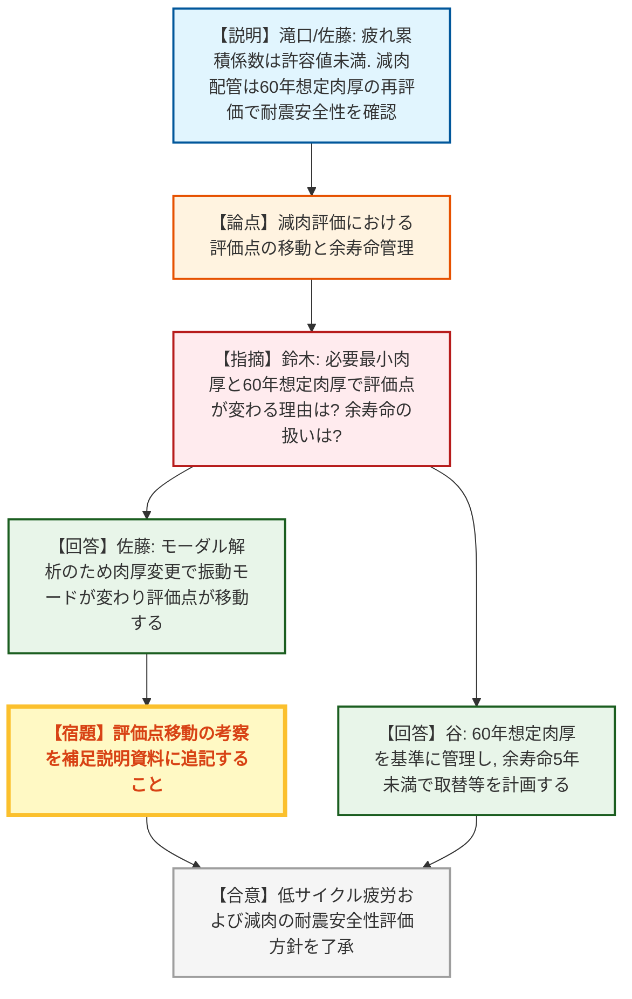
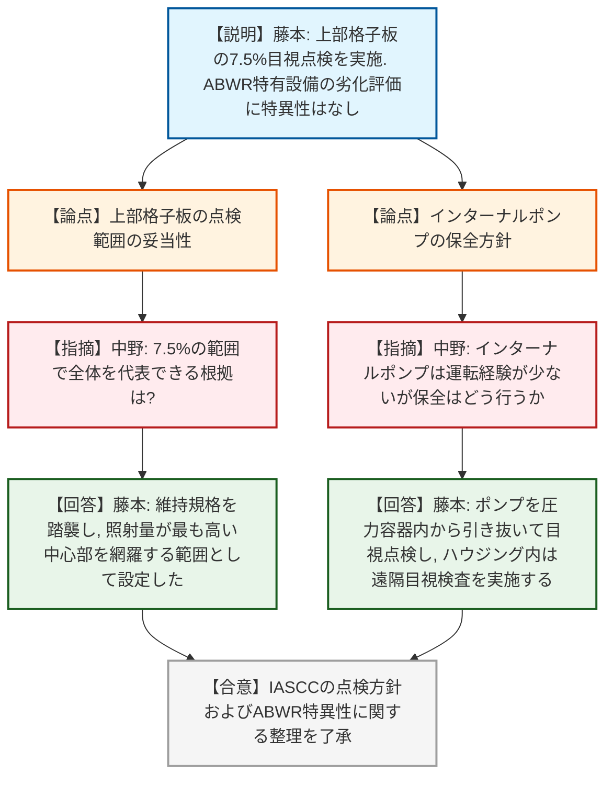
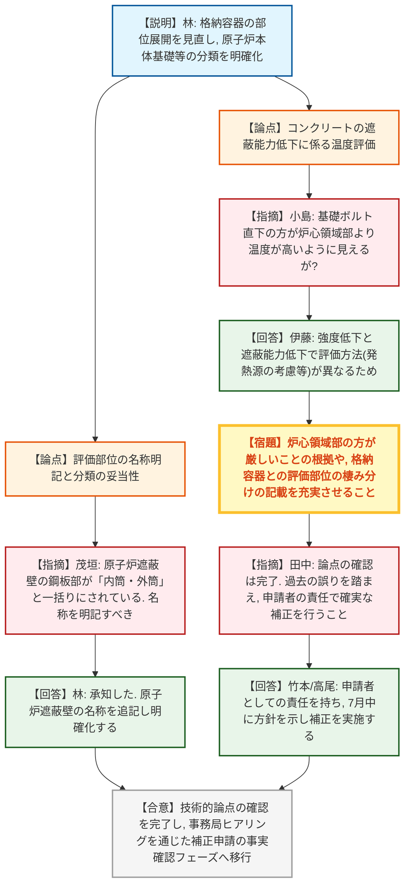

# 第33回実用発電用原子炉の長期施設管理計画等に係る審査会合（令和8年7月16日）
> 出典 : https://youtube.com/live/n2dAvgdVT_Q?si=bO75dOz1TTyPFal1

## 会合の概要
* **技術的論点の確認完了と申請書補正への移行**
  柏崎刈羽6号炉の長期施設管理計画（高経年化技術評価）に関するこれまでの指摘事項に対する回答が全て行われ、規制側は必要な技術的論点の確認が完了したと認識。今後は事務局ヒアリングを通じて、申請書および補足説明資料への補正反映状況の事実確認を進めるフェーズへと移行することが確認された。
* **評価部位の分類見直しと説明性の向上**
  ABWR特有の巨大な鉄筋コンクリート製格納容器（RCCV）等の評価において、当初の申請では原子炉本体基礎やライナー等の評価部位の分類（強度・遮蔽等の期待機能に基づく仕分け）が大括りであり不明確であった点が認められた。事業者は分類を再整理し、原子炉遮蔽壁等の名称明記や温度評価の妥当性について記載を充実させることを約束した。
* **ABWR固有設備の特異性の整理**
  原子炉内蔵型インターナルポンプや電動駆動の制御棒駆動系など、ABWRの特徴的な設備についての劣化評価の特異性が確認された。事業者は、機器構成に特徴はあるものの、評価手法自体は既存の規格基準やBWRでの実績に基づくため、劣化評価における特異性はないと整理し、規制側もこれを了承した。

---

## 議題ごとの詳細整理

### 【議題1】東京電力ホールディングス（株）柏崎刈羽原子力発電所６号炉の長期施設管理計画認可申請に係る審査について
* **議論の背景と論点:**
  柏崎刈羽6号炉の長期施設管理計画認可申請に関し、前回の審査会合で提示された指摘事項（低サイクル疲労の評価、減肉配管の評価、照射誘起型応力腐食割れ(IASCC)の点検方針、格納容器・コンクリート構造物の評価部位の分類、ABWR特有設備の劣化評価における特異性）に対する回答と、今後の申請書補正に向けた対応が論点となった。

* **質疑応答（詳細）:**
    **＜指摘事項1-1, 1-2：低サイクル疲労および流れ加速型腐食（減肉）の評価＞**
    * 【説明者側】滝口・佐藤（東京電力）
      給水系配管の低サイクル疲労評価について、運転実績と地震動（Ss, Sd）を考慮した疲れ累積係数の合計値が許容値（1.0）を下回ることを確認した。また、減肉を想定した必要最小肉厚での評価で許容応力を超えた7モデルについて、60年時点の想定肉厚で再評価を実施し、裕度が1を超え耐震安全性に問題ないことを確認した。
    * 【規制側】鈴木（規制庁）
      必要最小肉厚と60年想定肉厚とで応力が厳しくなる評価点（場所）が変わっているモデルがあるが、同等の結果とみなせる理由は何か。また、取替の基準となる厚さ（耐震管理厚さ）の設定や余寿命の扱いはどうなっているか。
    * 【説明者側】佐藤・谷（東京電力）
      スペクトルモーダル解析を用いているため、肉厚変更により振動モードが変化し発生応力分布が変わるため評価点が移動するが、適正に評価できている。この考察は補足説明資料に追記する。また、60年想定肉厚を基準としてそれより薄くならないよう管理し、余寿命が5年を下回った場合に取替等を計画する。

    **＜指摘事項2：照射誘起型応力腐食割れ(IASCC)の点検＞**
    * 【説明者側】藤本（東京電力）
      上部格子板グリッドプレートについて、IASCCのしきい照射量を超えた後の定検（運転開始から現状44年後想定）で初回の目視点検（MVT-1）を実施し、以降10年ごとに点検する。範囲は円周方向約27度（7.5%、19セル）の目視可能全範囲とする。
    * 【規制側】中野（規制庁）
      7.5%の範囲で全体を代表できる根拠は何か。また、応力や照射量が高い部位を事前に想定して検査するのか。
    * 【説明者側】藤本（東京電力）
      維持規格の標準検査の考え方を踏襲した。照射量は中心部が最も高いため、これを網羅する範囲で設定している。自重応力がかかる下面中央部が厳しいと想定するが、IASCCは下面に限定されないため目視可能全範囲を点検する。

    **＜指摘事項3-1, 3-2：コンクリート及び原子炉格納容器の評価部位の明確化＞**
    * 【説明者側】林（東京電力）
      原子炉格納容器（RCCV）の評価部位抽出において、原子炉本体基礎やライナー等の扱いが不明確だったため分類を見直した。原子炉本体基礎内のコンクリートは強度・遮蔽能力を期待しないため、鋼板部を格納容器の評価書で評価する。また、ステンレス部の応力腐食割れは塩化物イオンの持ち込みがないため発生可能性が低いとの根拠を拡充する。
    * 【規制側】茂垣（規制庁）
      当初申請で適切に分類できなかった背景は何か。また、原子炉遮蔽壁の鋼板部が「内筒・外筒」と一括りにされ名称が記載されていないため明確にすべき。
    * 【説明者側】林（東京電力）
      RCCVなどの巨大な構造物を分ける中で大括りになり、扱いが不明確になった。原子炉遮蔽壁については名称を追記し明確化する。
    * 【規制側】小島（規制庁）
      コンクリートの熱による遮蔽能力低下の評価について、評価点（炉心領域部：58.8℃）よりも原子炉圧力容器基礎ボルト直下（57.56〜72.12℃）の方が温度解析の結果が高いように見えるがどうか。
    * 【説明者側】伊藤・板本（東京電力）
      強度低下の評価（雰囲気温度考慮）と遮蔽能力低下の評価（ガンマ線発熱考慮）で評価方法が異なる。炉心領域部の方が温度が高いということや、格納容器との評価部位の棲み分けについて、申請書や補足説明資料の記載を充実させる。

    **＜指摘事項4：ABWRの特徴と技術評価における特異性の有無＞**
    * 【説明者側】藤本（東京電力）
      インターナルポンプや電動駆動の制御棒駆動系など、6号炉の評価対象機器はABWRとしての設計に特徴があるが、劣化評価の観点では既存の規格基準やBWRでの実績に基づく評価手法を用いており、長期施設管理計画の技術評価における特異性はないことを確認した。
    * 【規制側】足立（規制庁）
      炉心シュラウドの応力改善はABWRの特徴か。
    * 【説明者側】藤本（東京電力）
      ABWRの特徴ではなく6号炉の特徴であるが、応力腐食割れ対策として技術評価結果に大きく寄与しているため記載した。
    * 【規制側】中野（規制庁）
      インターナルポンプの運転経験が少ないが、保全の考え方はどうなっているか。
    * 【説明者側】藤本（東京電力）
      ポンプとしての点検内容は従来と同様だが、インペラやシャフトを圧力容器内から引き抜いて目視点検し、ハウジング内部は水中カメラで遠隔目視検査を実施する。

    **＜今後の進め方について＞**
    * 【規制側】田中（規制庁）
      必要な技術的論点の確認ができたため、今後は事務局ヒアリングで申請書等への反映状況を確認する。過去の記載漏れ・誤りを踏まえ、申請者としての責任と体制のもとで補正を提出すること。
    * 【説明者側】高尾・竹本（東京電力）
      申請者としての責任を持って補正書を作成する。7月中に補正の方針を示し、その後に最終的な補正を行いたい。

* **結論と宿題事項（アクションアイテム）:**
    * **決定事項:** 長期施設管理計画の認可申請に係る主要な技術的論点の審査が完了したことが確認された。
    * **宿題事項:** 
      1. 減肉評価において、肉厚変更に伴う評価点の移動の考察を補足説明資料に追記すること。
      2. コンクリート及び原子炉格納容器の評価において、原子炉遮蔽壁の名称を明記し、部位の分類（棲み分け）および温度評価の妥当性について申請書・補足説明資料の記載を充実させること。
      3. 上記の指摘事項を適切に反映した補正申請を、事業者の責任と体制のもとで確実に提出すること。

---

## 論理構造の可視化（Mermaid）

### 1. 低サイクル疲労と流れ加速型腐食（減肉）の評価

### 2. 照射誘起型応力腐食割れとABWRの特異性（インターナルポンプ等）

### 3. コンクリート及び原子炉格納容器の評価部位分類と温度評価

