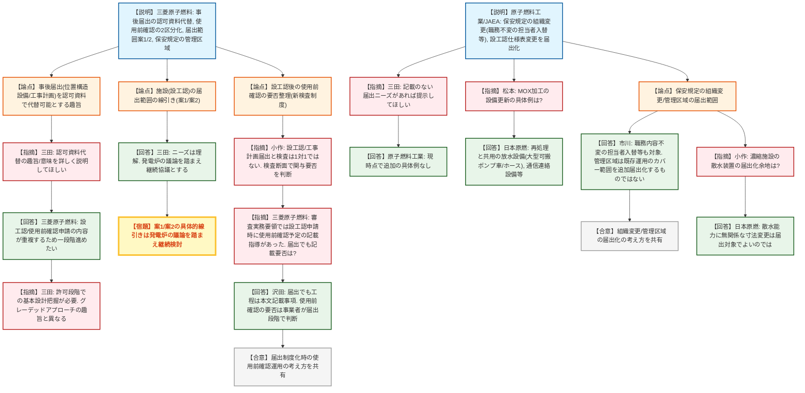
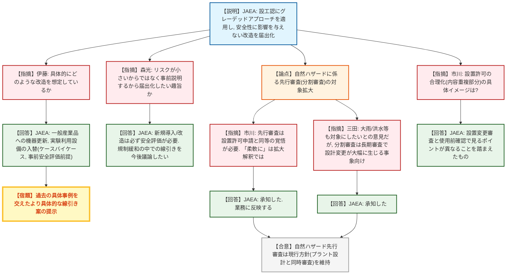
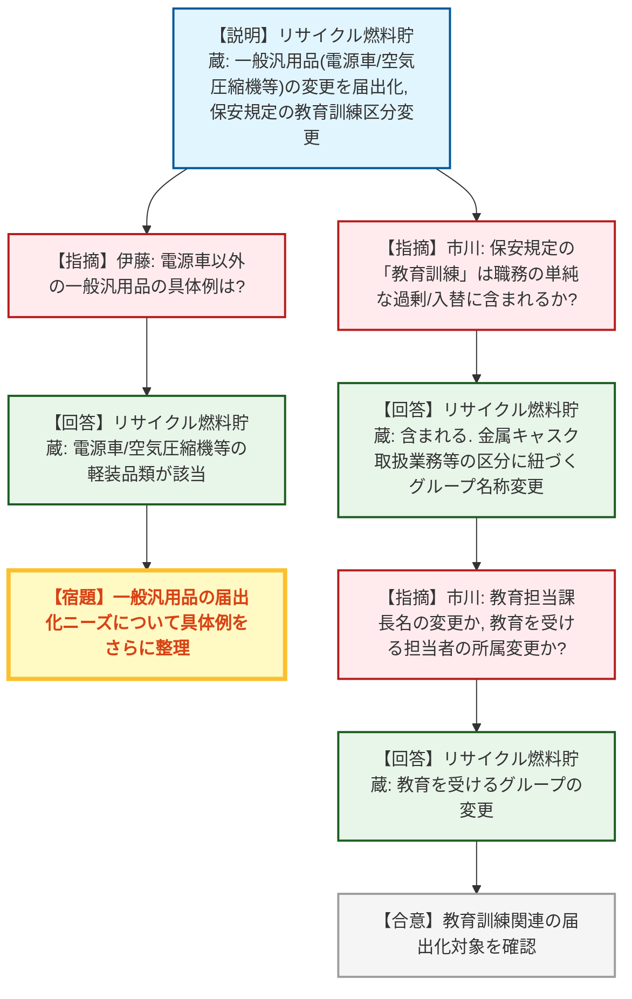
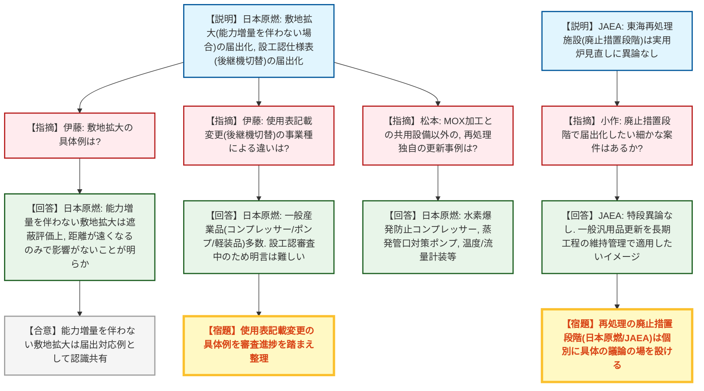
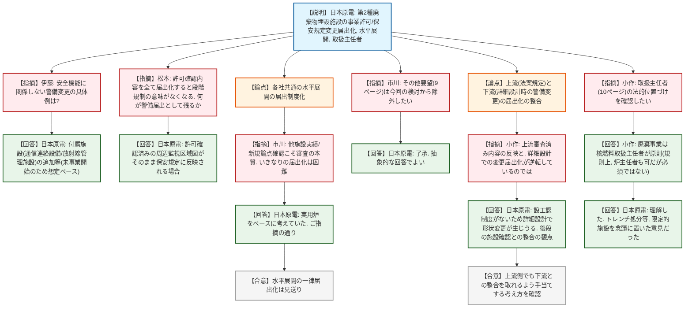
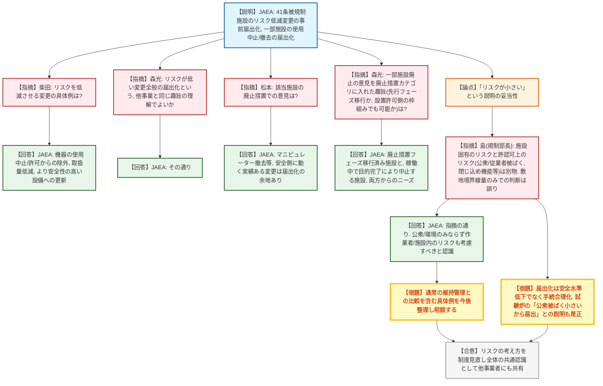
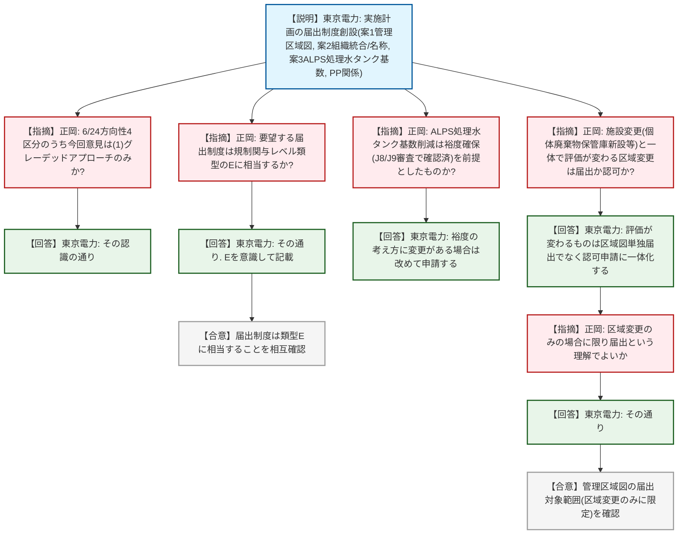
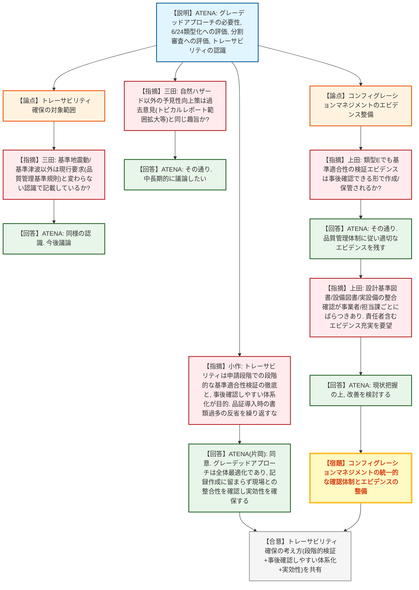

# 第5回実用発電用原子炉の許認可制度等の見直しに関する意見交換会合（令和8年7月21日）
> 出典 : https://youtube.com/live/AZJL8xA36ik?si=X6i9P3hkTasuTa8N

## 会合の概要
* **加工・試験炉等の各事業者から届出範囲拡大の具体提案が示されるも、規制庁は「認可資料での代替」等の届出見送りには慎重姿勢**
  三菱原子燃料は事後届出（構造設備・工事計画）を認可申請書内での対応に置き換えられないか提案したが、規制庁（三田）は許可時点で基本設計として把握する必要があるとして、グレーデッドアプローチの趣旨とは異なるとの認識を示した。一方、原子燃料工業・JAEA等からは保安規定の組織変更（職務内容不変の担当者入替等）や設工認の仕様表記載変更（後継機切替に伴う外形寸法変更）等、具体的な届出候補が多数提示された。
* **JAEA(原子力機構)の「リスクが小さい」という説明に対し、規制部長（島）から強い訂正コメント**
  核燃料使用施設・廃止措置に関するJAEAの届出化提案について、「敷地境界での被ばく線量が小さいからリスクが小さい」という理解は誤りであり、許認可上のリスクは公衆被ばくのみならず従業者被ばく・閉じ込め機能等の設備要求まで含む幅広い概念であると訂正。届出化は安全水準を下げるものではなく手続きの合理化であることが改めて強調され、この指摘はJAEA固有ではなく制度見直し全体の考え方として他事業者にも共有された。
* **東京電力（福島第一）は実施計画の届出制度創設を要望し、規制関与レベルの類型「E」相当であることを規制庁と相互確認**
  管理区域図の変更、アルプス処理水貯蔵タンクの基数削減、組織名称変更等を届出候補として提示。規制庁（正岡）は、施設変更（個体廃棄物保管庫新設等）と一体で敷地境界線量評価が変わる区域変更は届出化せず、区域変更のみの場合に限り届出とする方針を東京電力と確認した。
* **ATENA（原子力エネルギー協議会）が実用炉制度見直し全体についてグレーデッドアプローチの必要性を総論として説明**
  福島事故後の新規制基準強化に伴う審査資料・保安活動の増大を踏まえ、6月24日に規制委員会へ示された類型化の方向性を事業者意見に沿ったものと評価。規制庁（上田）からは、コンフィグレーションマネジメント（設計基準図書・設備図書・実設備の整合確認）の運用が事業者・担当課ごとにばらついているとの指摘があり、確認責任者を含めたエビデンスの充実が要望された。
* **各社共通の届出制度の水平展開、廃止措置計画等の「その他要望」は今回の検討対象から除外**
  規制庁（市川）は、他施設の認可実績や新規論点の有無確認こそが審査の本質であり、対象事業者間の横のつながりも薄いことから、水平展開の一律届出制度化は困難と説明。廃止措置計画の申請書簡素化（本文添付の扱い等）は制度見直しとは別に検討を進め、早期に規制委員会・パブリックコメントにかける方針が示された。

---

## 議題ごとの詳細整理

### 【議題1-1】加工事業に関する事業者意見（三菱原子燃料・原子燃料工業・JAEA）
* **議論の背景と論点:**
  三菱原子燃料（資料1-1）・原子燃料工業（資料1-2）・JAEA（資料1-3）から、事業許可の届出制度、設工認の届出制度化時の使用前確認の扱い、保安規定変更の届出範囲について具体的な提案が示された。事後届出とされた項目を認可申請書での対応に代替できないか、設工認の届出化に伴う使用前確認の要否をどう整理するか、保安規定の組織変更の届出範囲をどこまで拡大できるかが主な論点となった。

* **質疑応答（詳細）:**
    * 【説明者側】三菱原子燃料
      事後届出（位置構造設備・工事計画）のうち認可資料で内容が明確化されるものは、届出自体を不要にできないか提案。設工認の届出制度化に伴う使用前確認は「変更認可は従来通り供用開始前」「変更届出は事業者検査後に供用開始し事後確認」の2区分としたいと要望した。あわせて施設（設工認）の届出範囲について案1（耐震重要度分類第1類以外は変更届出）・案2（UF6ガス等は認可、ペレット・廃棄物等は届出）の2案を示し、工事に伴う管理区域指定変更は従来通り事業者管理としたいと要望した。
    * 【規制側】三田（規制庁）
      事後届出を認可資料で代替可能とする趣旨の詳細説明を求めた。現行でも6号（工事計画）は全て事後届出、5号（位置構造設備）も軽微なものは事後届出があり得るとしつつ、規制庁として許可段階で基本設計を把握する必要があるとの立場を示した。
    * 【説明者側】三菱原子燃料
      工事計画では設工認申請書と使用前確認申請の内容が重複しているとの認識を説明し、事後届出をさらに一段階進めて認可申請書で読み取れるようにできないか改めて提案した。
    * 【規制側】三田（規制庁）
      許可時点で把握すべき内容とその後の工事内容は趣旨が異なり、事前許可を不要とする考え方はグレーデッドアプローチの趣旨と少し異なるとの見解を述べた。一方、施設の届出範囲の線引き（案1・2）はニーズを理解するとし、発電炉の議論を踏まえた継続協議とする方針を示した。
    * 【規制側】三田（規制庁）
      三菱原子燃料以外の加工2社に、資料未記載の届出ニーズがあれば教えてほしいと確認した。
    * 【説明者側】原子燃料工業
      現時点で資料記載以外の具体的な届出ニーズはないと回答。実用炉側で届出制度が拡充されれば行政相談を活用しつつ加工施設にも適用したいとし、保安規定の届出対象となる組織改正は、名称変更に限らず職務追加・削減を伴わない担当者の入替・移管も対象にしてほしいと要望した。廃止措置計画の変更認可には特段の意見はないとした。
    * 【規制側】松本（規制庁）
      日本原燃資料1-5にあるMOX燃料加工施設の一般産業品を用いた設備更新について、具体例を確認した。
    * 【説明者側】日本原燃
      MOX燃料加工施設は再処理施設と設備を共用する部分が多く、放出抑制用の大型可搬ポンプ車・ホース、通信連絡設備等の一般産業品が対象になると回答した。
    * 【規制側】市川（規制庁）
      原子燃料工業の設工認に関する行政相談について、制度見直し後に届出が拡充・創設された場合の運用（該当区分は審査担当によく確認すること）を確認した。
    * 【説明者側】原子燃料工業
      現時点でも審査担当に随時相談しており、制度見直し後も同様に運用したいと回答した。
    * 【規制側】市川（規制庁）
      加工に限らず全事業共通の考え方として、保安規定の組織変更は単純な名称変更のみではなく職務の単純な入替も届出化の検討対象であることを訂正・説明。管理区域の扱いは、現行の事業者運用でカバーされている範囲を新たに届出化するのではなく、従来変更認可申請の一部としていた区域変更部分を届出化する前提であると説明した。
    * 【規制側】小作（規制庁）
      濃縮施設（日本原燃）における重大事故対応の散水装置等について、届出化の可能性を確認した。
    * 【説明者側】日本原燃
      濃縮の重大事故対応には散水用タンク・ホース類があり、散水能力に関係しない寸法等の変更は届出対象にしてもよいのではないかと回答した。
    * 【規制側】小作（規制庁）
      ウラン加工の重大事故対応は許可段階から様々な議論・工夫がなされており、整理を継続し重要度の高低を踏まえた線引きを検討したいとコメントした。
    * 【規制側】小作（規制庁）
      新検査制度の導入により設工認・工事計画の届出と検査は一対一の関係ではなくなったと説明。加工では設計・工事方法の変更を伴わない工事は使用前確認不要とされるが、審査不要でも検査で確認が必要なものもあり、検査の断面で規制関与の要否を判断する必要があるとした。
    * 【説明者側】三菱原子燃料
      本年2月頃の審査実務要領の議論で、設工認申請時に使用前確認の予定記載を求める指導を受けたことを踏まえ、届出の場合も工事計画・使用前確認の予定を記載する必要があるかを再確認した。
    * 【規制側】沢田（核燃料施設審査部・規制庁）
      当該実務要領は審査の流れの参考資料であるとし、届出であっても工事の工程は本文記載事項とする方針は変えないが、使用前確認の希望時期等を示すことで計画調整の入口とする運用とした。使用前確認の要否は事業者が届出段階で判断するものと整理した。

* **結論と宿題事項（アクションアイテム）:**
  * **決定事項:** 三菱原子燃料の意見3（施設の届出範囲の線引き案1・2）については、変更届出化のニーズがあることは規制庁として理解した。保安規定の組織変更・管理区域の扱いについて、規制庁の検討方針（職務内容が変わらない範囲での担当者入替等を対象に含める、現行事業者運用の追加的な届出化ではない）が明確化された。
  * **宿題事項:** 三菱原子燃料の意見3の具体的な線引き（案1・案2のどちらを採用するか等）は、発電炉の議論を踏まえて継続協議とする。加工施設における使用前確認の要否の整理は、設計及び工事の計画の届出制度の詳細設計と合わせて今後検討を深める。

---

### 【議題1-2】試験炉に関する事業者意見（JAEA）
* **議論の背景と論点:**
  JAEA（資料1-3）から、試験炉の設工認について、施設の安全性に影響を与えない改造（一般産業品への設備更新、実験利用設備の入替等）を届出対象にしたいとの提案があり、届出化の具体的な範囲・線引きの考え方、自然ハザードに係る先行審査（分割審査）の対象拡大の是非が論点となった。

* **質疑応答（詳細）:**
    * 【説明者側】JAEA（板垣）
      設工認にグレーデッドアプローチの考え方を適用し、施設の安全性に影響を与えない改造を届出対象にしたいと説明した。
    * 【規制側】伊藤（規制庁）
      グレーデッドアプローチの対象となる「改造」について、より具体的な工事の内容を確認した。
    * 【説明者側】JAEA（板垣）
      設計変更を伴わない一般産業品への更新や、試験目的でケースバイケースとなる実験利用設備等の入替（新規導入の都度、安全評価と事前説明を経て届出とできないか）を想定していると回答し、今後の議論での具体化を求めた。
    * 【規制側】森光（研究炉関係・規制庁もしくはJAEA側）
      「リスクが小さいから」ではなく「事前にきちんと説明するから」届出にしてほしいという趣旨か、確認を求めた。
    * 【説明者側】JAEA（板垣）
      新しいものを導入・改造する際には必ず安全評価が必要であるとし、従来設工認として申請していたものを規制緩和の中でどう線引きできるかが今後議論のポイントになるとの認識を示した。
    * 【規制側】森光
      過去の具体的な事例を挙げながら説明してもらえると議論しやすいと要望した。
    * 【規制側】三田（規制庁）
      試験炉にも発電用原子炉と同様に自然ハザードの先行審査（分割審査）へのニーズがあることは理解しつつ、対象を大雨・洪水等にも広げ柔軟に選択できるようにしてほしいとの要望には応じがたいと説明。分割審査は、設計変更が大幅に生じ長期審査を要する事象をプラント設計に先立って審査する仕組みであり、大雨等はプラント設計と同時に審査する方が合理的との現行方針を示した。
    * 【説明者側】JAEA（板垣）
      承知した旨を回答した。
    * 【規制側】市川（規制庁）
      自然ハザードの先行審査はあくまで基準適合性を確認する仕組みであり、許可を切り出して行うものであるため、現行の設置許可申請と同等程度の覚悟をもって臨んでほしいとコメント。「柔軟に」という事業者意見の表現について、規制庁側の拡大解釈である可能性を確認した。
    * 【説明者側】JAEA（板垣）
      指摘を承知し、今後業務に反映していきたいと回答した。
    * 【規制側】市川（規制庁）
      JAEA資料1ページ目の設置許可に関する合理化（内容が重複する部分の合理化）について、具体的なイメージを確認した。
    * 【説明者側】JAEA（板垣）
      加工の議論で三田から回答があったのと同様、設置変更審査で見るべきポイントと使用前確認の段階で見るべきポイントが異なるという理解に基づくものであると説明した。

* **結論と宿題事項（アクションアイテム）:**
  * **決定事項:** 自然ハザードに係る先行審査（分割審査）の対象は、大雨・洪水等ではなくプラント設計と同時審査すべき事象に限定するという現行方針が維持されることが確認された。
  * **宿題事項:** JAEAは、設工認の届出化対象となる「施設の安全性に影響を与えない改造」について、過去の具体事例を交えたより具体的な線引き案を今後提示する。

---

### 【議題1-3】貯蔵に関する事業者意見（リサイクル燃料貯蔵）
* **議論の背景と論点:**
  リサイクル燃料貯蔵（資料1-4）から、使用済燃料貯蔵施設（金属キャスク以外）における一般汎用品（電源車・空気圧縮機等の計装品）の変更を届出対象にしたいとの意見が示され、保安規定における教育訓練関連の届出化の範囲が論点となった。

* **質疑応答（詳細）:**
    * 【説明者側】リサイクル燃料貯蔵
      使用済燃料貯蔵施設のうち金属キャスク以外の設備について、連続監視のための負荷計測に用いる計装品（電源車・空気圧縮機等）は一般汎用品を使用しており、10年程度でメーカー都合による同一品の調達困難が生じうるため、こうした変更を届出対象にしてほしいと要望した。
    * 【規制側】伊藤（規制庁）
      一般汎用品の変更について、電源車以外にも同様の趣旨の具体例があれば教えてほしいと確認した。
    * 【説明者側】リサイクル燃料貯蔵
      （具体例のさらなる提示は行われず、電源車・空気圧縮機等の計装品類が該当する旨の説明にとどまった。）
    * 【規制側】市川（規制庁）
      リサイクル燃料貯蔵の資料の保安規定に関する記載中、「教育訓練」というフレーズについて、加工の議論で説明した「職務の単純な過剰・入替」に含まれる変更を想定しているか確認した。
    * 【説明者側】リサイクル燃料貯蔵
      教育訓練も含まれるとした上で、教育訓練の中身は金属キャスクの取扱業務に関わるものとそれ以外に区分されており、区分に紐づくグループ名称が変わった場合の変更を想定していると説明した。
    * 【規制側】市川（規制庁）
      教育担当者の課長名称が変わる場合か、教育を受ける担当者の所属グループが変わる場合かを確認した。
    * 【説明者側】リサイクル燃料貯蔵
      教育を受けるグループが変わる場合を想定していると回答した。

* **結論と宿題事項（アクションアイテム）:**
  * **決定事項:** 保安規定の教育訓練関連の届出化は、教育を受ける担当者の所属グループ名称変更等を想定したものであることが確認された。
  * **宿題事項:** リサイクル燃料貯蔵は、電源車以外の一般汎用品の届出化ニーズについて、さらなる具体例の整理を求められた。

---

### 【議題1-4】再処理に関する事業者意見（日本原燃・JAEA）
* **議論の背景と論点:**
  日本原燃（資料1-5）から、敷地範囲の拡大と設工認の仕様表記載変更の届出化について具体例を交えた提案があり、JAEA東海再処理施設の廃止措置段階における届出ニーズの有無が論点となった。

* **質疑応答（詳細）:**
    * 【規制側】伊藤（規制庁）
      日本原燃資料の5ページ目に記載のある、敷地の範囲拡大等、基準適合性に影響を与える恐れがない変更について、具体例を確認した。
    * 【説明者側】日本原燃
      現在進めている変更許可手続には敷地拡大の事項もあるが、今回は建屋の保管廃棄能力増量も合わせて行ったための変更許可であると説明。仮に敷地拡大のみであれば、線源が変わらない限り敷地境界までの距離が遠くなるだけで遮蔽評価上の影響がないことは評価するまでもなく明らかであり、こうした場合を届出対応の例として提案したと述べた。
    * 【規制側】伊藤（規制庁）
      同資料8ページの、メーカーの製造中止・後継機切替に伴う設工認の使用表（仕様表）記載変更について、事業種による違いがあれば教えてほしいと確認した。
    * 【説明者側】日本原燃
      再処理施設は一般産業品を用いる過渡的なSA設備（コンプレッサー・ポンプ・軽装品等）が非常に多く、可能な限り例示を整理するとした一方、施設の設工認が現在審査中で、使用表に何を記載するかの議論が進行中であるため、現時点で明確な回答は難しいと説明した。
    * 【規制側】松本（規制庁）
      先の加工の議論で日本原燃が挙げた、MOX燃料加工施設と再処理施設で共用する設備の更新について、加工と異なる（再処理独自の）更新事例があれば確認した。
    * 【説明者側】日本原燃
      再処理施設単独では、水素爆発防止用のコンプレッサー（空気供給）、蒸発管口対策の給水ポンプ、プロセス計装（温度計・流量計等、ホースに巻き付けるものや設備に直接取り付けるセンサー等）が一般産業品として該当すると説明した。
    * 【規制側】小作（規制庁）
      今回の資料に含まれていないJAEA東海再処理施設（廃止措置段階）について、届出化してほしい細かな案件の有無を確認した。
    * 【説明者側】JAEA
      実用炉見直しの議論の方向性に特段の異論はなく、その方向性を注視したいとの施設側の意見であるとし、一般汎用品の更新は長期にわたる廃止措置工程の維持管理の中で今後適用していきたいイメージを持っていると説明した。
    * 【規制側】小作（規制庁）
      再処理の廃止措置段階は、日本原燃六ヶ所とJAEA東海とでフェーズが大きく異なり、炉とも異なる廃止措置の形態であることから、それぞれ具体的な議論の際に改めて意見を聞きたいとコメントした。

* **結論と宿題事項（アクションアイテム）:**
  * **決定事項:** 敷地拡大のみで建屋能力増量を伴わない変更は、遮蔽評価上影響がないことが明らかな場合の届出対応例として規制庁も認識を共有した。
  * **宿題事項:** 日本原燃は設工認の使用表記載変更（後継機切替）に関する具体例整理を、審査中の設工認の進捗を踏まえつつ今後提示する。JAEA東海再処理施設の廃止措置段階における届出ニーズは、今後の個別議論の中で確認する。

---

### 【議題1-5】廃棄事業に関する事業者意見（日本原電）
* **議論の背景と論点:**
  日本原電（資料1-6）から、第2種廃棄物埋設施設（トレンチ処分を想定）について、事業許可・保安規定の変更届出化、その他要望（水平展開の届出化、取扱主任者の資格要件等）が示され、届出範囲の考え方・水平展開の可否・取扱主任者の法的位置づけが論点となった。

* **質疑応答（詳細）:**
    * 【説明者側】日本原電
      第2種廃棄物埋設施設には設工認制度がないため、事業許可・保安規定のうち安全機能・安全評価に影響しない変更は届出対応としたいと提案。トレンチ処分は施設の規模・形態が簡易で変更認可・届出を要するケースが少ないため廃止措置の届出制度新設の必要性は高くなく、基準地震動等のトレーサビリティ確保も施設特性上不要と考えると説明した。不正行為対応（届出への罰則強化）には異論がないとした上で、他施設への水平展開・取扱主任者に関する要望もあわせて示した。
    * 【規制側】伊藤（規制庁）
      資料の2ページ目にある安全機能・安全評価に関係しない警備（設備）変更の具体例を確認した。
    * 【説明者側】日本原電
      未事業開始のため想定が難しい面もあるとしつつ、付属施設として通信連絡設備の追加、放射線管理施設の要件変更に伴う追加等は、安全機能に影響しないと考えられる例として挙げた。
    * 【規制側】松本（規制庁）
      上流規制の反映（設備名称変更）には合理性があるとしつつ、許可で確認した内容を全て届出化すると段階規制の意味がなくなってしまうと指摘。その上でどのようなものが届出として残るのか説明を求めた。
    * 【説明者側】日本原電
      周辺監視区域の変更で、許可で確認された周辺監視区域図がそのまま保安規定に反映される場合を想定しており、このような場合は届出でよいのではないかと説明した。
    * 【規制側】市川（規制庁）
      同資料5ページに関するコメントとして、各社共通の水平展開について、他施設の認可実績や新規論点の有無を確認することこそが審査の本質であり、いきなり届出制度化するのは困難であるとの見解を示した。また、実用炉と異なり対象事業者間の横のつながりも薄いため、この観点からも難しいとコメントした。
    * 【説明者側】日本原電
      実用炉の議論をベースに考えていたため、各社共通と言っても現時点では自社と日本原燃（前提となる比較対象）程度しかないとして、規制庁の指摘の通りであると回答した。
    * 【規制側】市川（規制庁）
      資料9ページ全体の「その他要望」については、委員会指導ベースで議論する今回の検討からは外させてほしいとした。
    * 【説明者側】日本原電
      今回は許認可制度見直しが中心であることを理解しており、その他要望として抽象的な回答で構わないと回答した。
    * 【規制側】市川（規制庁）
      運用上の疑問があれば、審査・検査それぞれの担当によく確認してほしいと補足した。
    * 【規制側】小作（規制庁）
      松本の質問（上流規制で審査済みの内容を反映する場合の届出化）とは逆に、資料2ページでは詳細設計段階で変わりうる警備変更の届出化が提案されており、上流・下流の関係が逆転しているように見えると指摘。上流規制で安全評価の骨格を固め下流規制で具体化するのが原則であるとし、許可本文の記載粒度・品質管理体制の許可基準との関係を踏まえた日本原電の認識を確認した。
    * 【説明者側】日本原電
      第2種廃棄物埋設施設には設工認制度が存在しないため、詳細設計段階でトレンチの寸法等、安全機能は変わらないが形状が変わる可能性があると説明。こうした場合、後段の施設確認との整合性（許可と検査の整合性）の観点から、安全機能に影響しないのであれば届出とすることで整合が取れると考え、この意見を出したと述べた。
    * 【規制側】小作（規制庁）
      上流から下流までの整合を取れるよう上流側でも手当てをするという考え方であると理解したとし、品質管理についても許可時の体制の下でしっかり実施し、法案規定（保安規定）に基づき記載されるという理解でよいか確認した。
    * 【説明者側】日本原電
      その理解の通りであると回答した。
    * 【規制側】小作（規制庁）
      資料10ページの取扱主任者の記載について法的な位置づけを説明。廃棄事業の主任者は法律上、核燃料取扱主任者免状を受けている者が原則であり、規則上は炉主任者でもよいが炉主任者でなければならないわけではないとした。廃止措置段階の炉とは異なり、廃棄事業では炉規法上、安全確保の重要性を認識した有資格者による対応が引き続き必要であるとの考えを示した。
    * 【説明者側】日本原電
      説明内容を理解したとし、当初の意見はウラン廃棄物を埋めない（金属・コンクリートのみを埋設する）トレンチ処分等、限定的な施設を念頭に置いたものであったと補足した。

* **結論と宿題事項（アクションアイテム）:**
  * **決定事項:** 各社共通の水平展開の届出制度化は、審査の本質（他施設実績・新規論点確認）との関係、及び対象事業者間の連携の薄さから、今回の検討対象としないことが確認された。廃棄事業の取扱主任者に関する法的位置づけ（核燃料取扱主任者が原則）が明確化された。
  * **宿題事項:** 「その他要望」（9ページ）は制度見直しの検討対象から外し、運用上の疑問は審査・検査担当への個別相談で対応する。詳細設計段階での警備変更の届出化は、上流（許可）側での手当てとの整合を取りながら今後具体化する。

---

### 【議題1-6】使用に関する事業者意見（JAEA）
* **議論の背景と論点:**
  JAEA（資料1-3）から、核燃料物質の使用施設（41条被規制施設等）についてリスクを低減させる変更の事前届出化、及び一部施設の使用中止・撤去（廃止措置カテゴリ）の届出化が提案され、「リスクが小さい」という説明の妥当性を巡り規制部長（島）から強い訂正コメントが出された。

* **質疑応答（詳細）:**
    * 【規制側】柴田（規制庁）
      JAEA資料に基づき、核物質の取扱量を少なくする等リスクを低減させる変更として、具体的にどのようなものを想定しているか確認した。
    * 【説明者側】JAEA
      現時点で個別具体の想定は明確でないとしつつ、使用していた機器を使用中止して許可から落とす変更、取扱量を下げる変更、より安全性の高い施設設備を導入する変更等を、事前の届出で対応させてほしい旨の提案であると説明した。
    * 【規制側】森光
      許可の断面では該当被害等（該当施設の類型）自体には関係がなく、結果としてリスクが低いものに当てはまる例として挙げられたものと理解しているとして、「変更のリスクが低ければ届出にしてもよいのではないか」という趣旨で、他事業の議論と同じ中身の理解でよいか確認した。
    * 【説明者側】JAEA
      その理解の通りであると回答した。
    * 【規制側】松本（規制庁）
      該当施設について、廃止措置の観点で特段の意見があるか確認した。
    * 【説明者側】JAEA
      使用を中止して廃止する許可変更をこれまでいくつか対応してきた経験を踏まえ、安全側に施設が動く実績のある変更については、安全審査でよく確認した上で届出化していける余地があるのではないかとの意見を述べた。具体例として、マニピュレーターの使用中止・撤去に係る許可変更の実績を挙げ、これまで何度か撤去を行う中で安全上見るべきポイントや基準の適合性を一通り確認してきたことを踏まえ、今後は届出という方向に持っていけるのではないかと説明した。
    * 【規制側】森光
      一部施設の廃止に関する意見が「廃止措置計画」というカテゴリで挙げられている趣旨について、（1）廃止フェーズへ先行して入りたいという趣旨か、（2）設置許可側の議論（リスクが低い変更の届出化）と同じ枠組みでも実現できるのではないかという趣旨か、確認を求めた。
    * 【説明者側】JAEA（板垣）
      廃止措置フェーズに移行済みの施設で許可変更により対応してきたケースと、稼働中の施設で目的完了により機器を中止するケースの両方からニーズがあり、両方の観点から提案していると説明した。
    * 【説明者側】JAEA（伊藤）
      補足として、純粋にリスクがもともと小さく、機器の中止によりリスクが低減する方向のものは届出でよいのではないか、また核燃料使用施設における一部施設は排出（廃止）措置単独のフェーズになっていない実態があり、実質的に施設としてはやめていく方向のものについて、リスクを勘案しながら届出化と併用できないかとの提案であると補足した。
    * 【規制側】島（規制部長・規制庁）
      JAEAの説明は十分理解できないとした上で、「リスクが小さい」には施設そのものが持つリスクと許認可上見ているリスクの2つの意味があり、両者は別物であると指摘。「敷地境界の被ばく線量が小さいからリスクが小さい」という見方は誤りであり、規制庁が見ているのは公衆被ばくのみならず従業者被ばくや閉じ込め機能等の設備要求を含む幅広い概念であると説明した。あわせて、JAEA資料2ページの「維持管理設備」が歴史的経緯から中途半端な位置づけ（廃止でも使用継続でも検査対象でもない）になっている点はカテゴリ自体の見直しが必要であり、設備解体等に伴うリスクを踏まえると必ずしも全てが届出になるとは限らないとした。届出化は安全水準を下げるものではなく手続きの合理化であるとし、試験炉についても「公衆被ばくが小さいから届出」という考え方は改めてほしいと要請。加えて、廃止措置計画申請書の書き方（本文添付の扱い）の簡素化は制度見直しとは別に規制庁内で検討中であり、早期に規制委員会・パブリックコメントにかけた上で法改正後にさらに合理化する考えを示した。
    * 【説明者側】JAEA（伊藤）
      指摘を受け、リスクは公衆・環境のみならず、作業者・施設内のリスクも含めて考慮すべきであるとの認識を共有し、通常の維持管理との比較でリスクがどの程度異なるかを含め、具体例を今後整理して相談したいと回答した。
    * 【規制側】議長（司会・規制庁）
      今回のやりとりは、JAEAのみならず今回の許認可制度見直し全体に関する規制庁の考え方を示すものであるとして、他の事業者にも認識を共有するよう促した。

* **結論と宿題事項（アクションアイテム）:**
  * **決定事項:** 許認可上の「リスク」は施設固有のリスクの大小ではなく、公衆・従業者被ばくや閉じ込め機能等の設備要求を含む幅広い概念であることが規制庁から明確化された。届出化は安全水準の低下ではなく手続きの合理化であるとの位置づけが再確認された。
  * **宿題事項:** JAEAは、通常の維持管理と比較したリスクの違いを含む具体例を今後整理し、規制庁に相談する。廃止措置計画の申請書簡素化（本文添付の扱い）は、制度見直しとは別途、規制庁内で検討の上、規制委員会・パブリックコメントにかける。

---

### 【議題1-7】福島第一原子力発電所（1F）に関する事業者意見（東京電力）
* **議論の背景と論点:**
  東京電力（資料1-7、福島第一廃炉推進カンパニー）から、特定原子力施設としての実施計画について、実用炉と同様の届出制度創設が要望され、6月24日の委員会資料で示された見直しの方向性（4区分）との対応関係、規制関与レベルの3類型（A/E/U）との対応関係、アルプス処理水貯蔵タンク基数削減の考え方、管理区域図変更の届出範囲が論点となった。

* **質疑応答（詳細）:**
    * 【説明者側】東京電力
      福島第一は特定原子力施設として変更の都度実施計画の認可を得ているが、現在は安定状態の維持管理段階にあることを踏まえ、実用炉同様に届出制度を創設し災害防止・特定核燃料物質防護へ影響のない変更を届出対象としたいと要望。届出後は事業者側で基準適合性等を検証・保存し、必要に応じ保安検査等で確認する枠組みを想定していると説明した。届出対象範囲の案として、線量評価に影響のない区域変更（案1）、職務変更を伴わない組織統合・名称変更（案2）、アルプス処理水貯蔵タンクの基数削減（案3）、核セキュリティ関係の組織名称変更等を提示した。
    * 【規制側】正岡（規制庁）
      6月24日の委員会資料で示された見直しの方向性4区分（(1)グレーデッドアプローチの適用の徹底、(2)自然ハザードの認定性・分割申請、(3)中部電力の不正行為対応、(4)その他（電磁パルス・事前着手バックフィット等））のうち、今回の東京電力の意見は基本的に(1)に対するものであり、(2)〜(4)については特段の要望があれば対応するがなければそれでよい、という理解でよいか確認した。
    * 【説明者側】東京電力
      その認識の通りであると回答した。
    * 【規制側】正岡（規制庁）
      東京電力が要望する届出制度は、委員会資料でいう規制関与レベルの3類型（A: 従来通りの許認可、E: 審査なしの事前届出＋必要に応じ検査で確認、U: 自己届出）のうち「E」に相当するものと理解してよいか確認した。
    * 【説明者側】東京電力
      その認識の通りであり、Eを意識して記載したと回答した。
    * 【規制側】正岡（規制庁）
      アルプス処理水貯蔵タンクの基数削減について、単純に基数を減らすのではなく、大雨・台風による発生量急増や処理設備の故障復旧期間等を踏まえた裕度を確保した上での削減であるとの理解を確認。その裕度の考え方はJ8/J9タンク審査時に既に確認済みで実施計画にも記載されており、核セキュリティ（PP）側の措置も同様に大枠の記載範囲内での対応かをあわせて確認した。
    * 【説明者側】東京電力
      説明を割愛していたが、タンクの容量については裕度の考え方等に変更がある場合はその都度申請を行う考えであると回答した。
    * 【規制側】正岡（規制庁）
      線量評価の変更を伴う管理区域変更は申請するとされている点の意図を確認。福島第一では個体廃棄物保管庫等の新設時に敷地境界への追加線量評価が変わり管理区域図面変更も一体で生じるが、こうした場合に区域図のみ届出で出すのか施設変更（認可申請）と一体で扱うのかを尋ねた。
    * 【説明者側】東京電力
      正岡が例示した通り、新設等の施設変更に伴い評価（敷地境界線量評価）が変わるものについては、区域図だけの届出は考えておらず、区域変更も一体として認可申請することを想定していると回答した。
    * 【規制側】正岡（規制庁）
      区域変更のみの場合に限り届出とし、それ以外の変更が伴う場合は認可申請で一本化したいという理解でよいか、念のため再確認した。
    * 【説明者側】東京電力
      その通りであると回答した。

* **結論と宿題事項（アクションアイテム）:**
  * **決定事項:** 東京電力が要望する実施計画の届出制度は、規制関与レベルの類型「E」に相当することが正岡・東京電力間で相互確認された。管理区域図等の変更は、施設変更を伴わない区域変更のみの場合に限り届出対象とし、施設変更（新設等）と一体で評価が変わる場合は認可申請で一体的に扱う方針が確認された。アルプス処理水貯蔵タンクの基数削減は、裕度の考え方に変更がなければ届出対象とし、裕度の考え方自体に変更がある場合は改めて申請することが確認された。
  * **宿題事項:** 特段の宿題事項なし。6月24日方向性のうち(2)〜(4)区分について東京電力から追加要望が生じた場合は、別途対応する。

---

### 【議題2】実用発電用原子炉の許認可制度等の見直しに関する事業者意見（ATENA：原子力エネルギー協議会）
* **議論の背景と論点:**
  ATENA（資料2、田中・片岡）から、実用炉の許認可制度見直し全体について、グレーデッドアプローチの必要性、6月24日方向性（類型化）への評価、分割審査（自然ハザードに係る設計条件の認定制度）への評価、トレーサビリティ確保の考え方が総論として説明され、規制庁からはトレーサビリティの対象範囲、コンフィグレーションマネジメントの運用の統一性が論点となった。

* **質疑応答（詳細）:**
    * 【説明者側】ATENA（田中）
      福島第一事故後の新規制基準強化により審査資料・保安活動の物量が大幅に増加したことを踏まえ、リスクの多寡に応じてリソース投入や管理の厳格さを最適化するグレーデッドアプローチの重要性を説明。現行手続の課題として、届出対象の限定列挙により軽微変更でも変更認可や設工認手続が必要になる点、認可・届出後30日の着手制限が安全性向上の遅れにつながる点、保安規定に届出制度がなく軽微変更でも原則審査が必要な点等を挙げた。6月24日に示された類型化の方向性（災害防止上の支障の大小による手続区分）はグレーデッドアプローチに沿うものであり事業者意見に沿っていると評価し、類型Eでは事前確認不要化と30日間の着手制限撤廃により対応の早期化が期待されるとした。自然ハザードに係る設計条件の認定制度の創設は規制の予見性向上として歓迎し、トピカルレポートの範囲拡大等その他の予見性向上策も中長期的に議論したいと述べた。トレーサビリティ確保について、基準地震動・基準津波の追加的な記録保存要求は今後議論するとしつつ、それ以外の設置許可・設工認の基準適合性に関する検証・確認・保存は現行要求と変わらないとの認識を示した。
    * 【規制側】三田（規制庁）
      トレーサビリティに関して、基準地震動・基準津波以外の内容について、現行要求（品質管理基準規則で既に求められている内容）と変わらないとの認識で記載しているのか確認。基準地震動・基準津波の追加的措置についても、不正事案の防止・抑止策の検討の中で詳細を詰めていく段階であるとの認識を共有した。
    * 【説明者側】ATENA（田中）
      1点目は同様の認識であるとし、今後議論していきたいと回答した。
    * 【規制側】三田（規制庁）
      資料3ページ目にある「自然ハザード以外に関する予見性向上のための仕組み」について、過去に示された意見（トピカルレポートの範囲拡大等）と同じ趣旨かを確認した。
    * 【説明者側】ATENA（田中）
      その通りであり、要望内容としては前回等に示したものを中長期的に議論させてほしいという趣旨で整理したものであり、トピカルレポートの範囲拡大等について引き続き議論したいと回答した。
    * 【規制側】上田（専門検査部門・規制庁）
      資料2ページ目の類型Eについて、事業者が整備する図書類等を含め、原子力規制検査で確認する中で、基準適合性の検証が事業者によって適切に行われたことが事後的にも確認できるエビデンス類が作成・保管される理解でよいか確認した。
    * 【説明者側】ATENA（田中）
      その認識の通りであり、法案規定（保安規定）等でこれまで求めてきた品質管理の体制に従い、適切なエビデンスを残していくことはこれまで通りであると回答した。
    * 【規制側】上田（規制庁）
      検査実務上の課題として、設計基準図書・設備図書・実設備の3者の整合性を確認するコンフィグレーションマネジメントについて、事業者ごとに図書の作り方がばらつき、各担当課が部分的に確認するのみで3者の整合を一括確認している例はあまり見られないと指摘。基準適合性の確認が事業者によってどう行われたか事後的にも検証できるよう、誰が責任を持って確認しているかをエビデンスとして示せるよう検討してほしいと要望した。
    * 【説明者側】ATENA（田中）
      指摘を踏まえ、事業者の現状を把握した上で、改善すべき点があれば改善していきたいと回答した。
    * 【規制側】小作（規制庁）
      コンフィグレーションマネジメントは許認可・使用前事業者検査等の段階を経て順次書類を整備する活動であるとした上で、今回議論したいトレーサビリティは申請段階での基準適合性の審査・検証・妥当性確認を段階的に行い、事後も維持管理・確認しやすい体系にすることだと整理した。品質保証システム導入以降、書類増加により実務が手薄になった過去の経緯を繰り返したくないとし、各段階を確実に行いつつ全体像を見やすくする両立ができなければ現場の安全確保業務がおろそかになりかねないと指摘。規制庁として何を要求すべきか検討するとともに、事業者側からも運用しやすい提案を求めた。
    * 【説明者側】ATENA（片岡）
      指摘の通りであるとし、グレーデッドアプローチは安全レベルを変えるものではなく全体最適化によりトータルの安全性向上につなげるものであり、その中でトレーサビリティ確保は当然であるとの認識を示した。単に記録作成で終わらせず現場との整合性を確認しながら実効性を持たせることが重要であるとし、事業者として共通的に取り組める事項をしっかり進めていきたいと回答した。

* **結論と宿題事項（アクションアイテム）:**
  * **決定事項:** ATENAが要望する届出制度（類型E）の考え方、及びトレーサビリティ確保の基本的な範囲（現行の品質管理基準規則の要求を維持しつつ、基準地震動・基準津波は追加的に検討）について、規制庁との認識の一致が確認された。
  * **宿題事項:** 基準地震動・基準津波に関する追加的なトレーサビリティ要求の詳細は、不正事案の防止・抑止策の検討の中で今後詰める。自然ハザード以外の予見性向上策（トピカルレポートの範囲拡大等）は中長期的に議論する。コンフィグレーションマネジメントの運用（設計基準図書・設備図書・実設備の整合確認体制、責任者の明確化を含むエビデンスの充実）について、ATENA・事業者側で現状を把握し改善策を検討する。

---

## 論理構造の可視化（Mermaid）

### 【議題1-1】加工事業に関する事業者意見

### 【議題1-2】試験炉に関する事業者意見

### 【議題1-3】貯蔵に関する事業者意見

### 【議題1-4】再処理に関する事業者意見

### 【議題1-5】廃棄事業に関する事業者意見

### 【議題1-6】使用に関する事業者意見

### 【議題1-7】福島第一(1F)に関する事業者意見

### 【議題2】ATENA(原子力エネルギー協議会)の事業者意見

