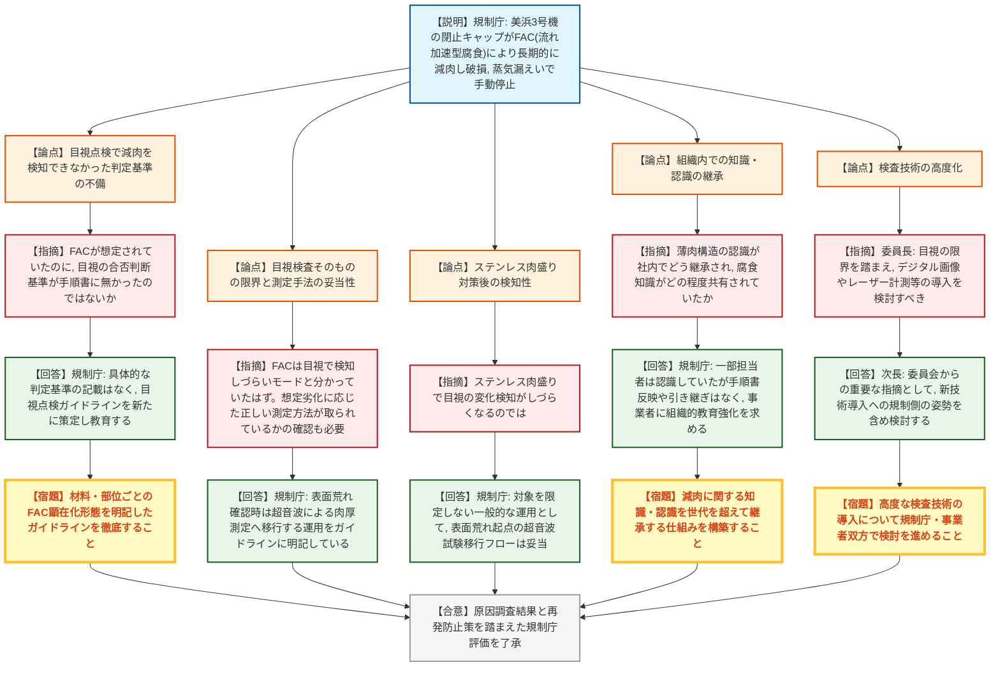
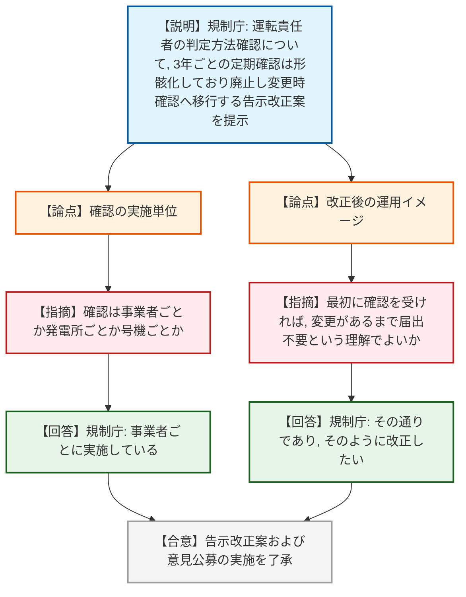
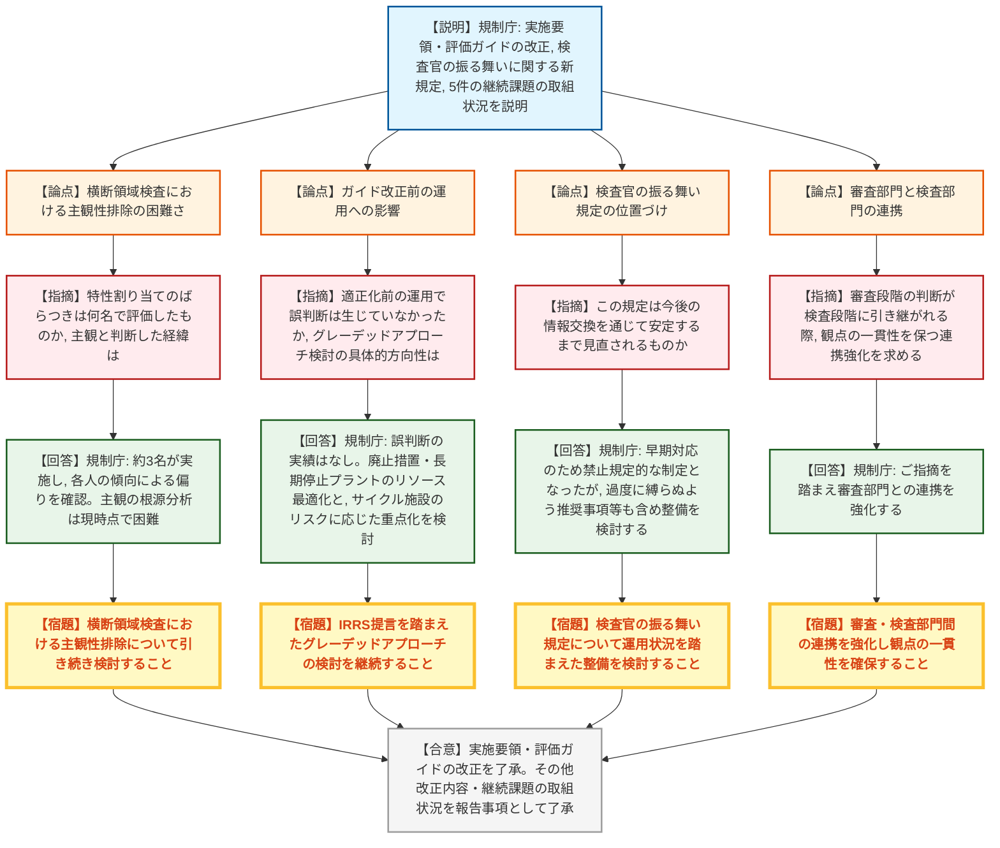

# 第22回原子力規制委員会（令和8年7月22日）
> 出典 : https://youtube.com/live/a5hSxvkxoiQ?si=9bWeolExyiUCLUsQ

## 会合の概要
* **美浜発電所3号機の高圧タービン閉止キャップ破損(蒸気漏えい)事象について、関西電力の原因対策報告と規制庁評価を了承。** 原因はFAC(流れ加速型腐食)による長期的な減肉と特定されたが、目視点検でこれを検知できなかった経緯や、目視検査の限界・検知手法の妥当性を巡り委員から突っ込んだ質疑があった。
* **運転責任者の判定方法確認制度について、形骸化していた3年ごとの定期確認を廃止し、変更時のみ確認する運用に改める告示改正案と意見公募の実施を了承。**
* **原子力規制検査の実施要領・評価ガイドの改正(表現の適正化、検査官の振る舞いに関する新規定の制定等)を了承。** 検査官の不適切対応事案を踏まえた再発防止の一環。
* **検査における5つの継続課題(重大事故等PIの見直し、横断領域検査、リスク情報活用、グレーデッドアプローチ検討等)の取組状況が報告され、うち1件(設計管理等検査の改善)は対応完了とされた。**

---

## 議題ごとの詳細整理

### 【議題1】関西電力株式会社からの美浜発電所３号機における原子炉手動停止事象に係る報告に対する評価

* **議論の背景と論点:**
  令和8年5月4日、定格出力運転中の美浜発電所3号機で高圧タービン排気室の閉止キャップ(蒸気漏れ防止用)が損傷し、二次系から約460立方メートルの蒸気が漏えいして原子炉が手動停止した事象について、関西電力から提出された原因調査・再発防止策の報告と、これに対する原子力規制庁の評価の妥当性が論点となった。損傷が長期間にわたる減肉(流れ加速型腐食、FAC)の進行によるものであったにもかかわらず目視点検で検知できなかった経緯と、再発防止策(目視点検ガイドラインの強化)の十分性が焦点となった。

* **質疑応答（詳細）:**
    * 【説明者側】志間・小野（原子力規制庁実用炉監視部門）
      美浜3号機では高圧タービン閉止キャップがFAC(流れ加速型腐食)により長期間にわたり減肉し、最終的に内圧に耐えられず破断して蒸気漏えい・手動停止に至ったと推定される。目視点検で気づけなかった要因として、表面荒れを減肉の兆候と認識できなかったこと、減肉はクレーター状に進行するとの思い込み、閉止キャップの薄肉構造を他プラント比較から厚肉と誤認していたことの3点を挙げ、規制庁はこの原因調査結果を妥当と評価した。
    * 【規制側】委員
      劣化モードとしてFACが想定されていたにもかかわらず、目視での合否判断基準(何をもって異常とするか)が手順書に明記されていなかったのではないか。
    * 【説明者側】志間・小野（実用炉監視部門）
      関西電力の手順書には具体的な判定基準の記載がなかった。これを踏まえ、材料ごとのFAC顕在化の形態を明記した目視点検ガイドラインを新たに策定し、教育していく方針である。
    * 【規制側】委員
      FACによる減肉は目視で検知しづらい劣化モードと分かっていたはずで、判断基準が不明確だった点は問題である。目視点検の高度化とは別に、想定される劣化モードに応じた正しい測定方法(超音波測定等)が取られているかを確認する視点も必要ではないか。
    * 【説明者側】志間・小野（実用炉監視部門）
      新ガイドラインでは、目視点検で表面荒れが確認された場合に超音波による肉厚測定へ移行することを明記し、目視のみに頼らない運用とする。閉止キャップについてはステンレスの溶接肉盛りによる耐食化対策も行う。
    * 【規制側】委員
      ステンレス肉盛りにより目視での変化検知がしづらくなる可能性があるが、超音波測定への移行は担保されているか。
    * 【説明者側】志間・小野（実用炉監視部門）
      今回のガイドラインは対象箇所を限定しない一般的な運用であり、表面荒れを起点に超音波試験へ移行するフローとして妥当と考えている。
    * 【規制側】委員
      減肉の認識が関西電力社内で世代を超えてどのように継承されていたのか、また腐食に関する知識が社内でどの程度一般的に共有されていたのか。
    * 【説明者側】志間・小野（実用炉監視部門）
      一部の担当者は薄肉構造であることを認識していたが、手順書への反映や後任への引き継ぎは行われていなかった。腐食一般の知識共有についても、事業者に組織的な教育の強化を求めていく。
    * 【規制側】委員長
      目視点検の限界を踏まえ、デジタル画像記録やレーザー計測など、より高度な検査技術の導入を規制・事業者双方で検討していくべきではないか。
    * 【説明者側】次長
      委員会からの重要な指摘として受け止め、新技術導入に向けた規制側の姿勢も含め検討していく。

* **結論と宿題事項（アクションアイテム）:**
    * **決定事項:** 関西電力の原因調査結果(FACによる長期的な減肉進行が損傷原因)および再発防止策(閉止キャップのステンレス肉盛り、目視点検ガイドラインの策定、教育強化、水平展開)を踏まえた原子力規制庁の評価を了承した。
    * **宿題事項:**
      1. 目視点検ガイドラインにおいて、材料・部位ごとのFAC顕在化形態を明記し、表面荒れ確認時は超音波等による肉厚測定へ移行する運用を徹底すること。
      2. 減肉に関する知識・認識を事業者内で世代を超えて継承する仕組みを構築すること。
      3. デジタル画像記録やレーザー計測等、目視に代わる高度な検査技術の導入について、規制庁・事業者双方で検討を進めること。
      4. 他の発電所の同種設備についても、高温高圧の蒸気・水が流れる機器を対象に保全の実施状況を改めて確認すること(水平展開)。

---

### 【議題2】運転責任者に係る基準等に関する規程の改正案及び意見公募の実施

* **議論の背景と論点:**
  運転責任者の判定方法について、原子力規制委員会が3年ごとに確認を行う現行制度は、JEAC等の改定頻度が低いため実質的に形式的な変更確認にとどまっており、新検査制度下での基本検査による毎年度確認とも重複していることから、事業者との意見交換を踏まえ、定期確認を廃止し変更が生じた都度確認する運用への告示改正の是非、および意見公募の実施が論点となった。

* **質疑応答（詳細）:**
    * 【説明者側】志間（実用炉監視部門）
      運転責任者の判定方法確認は3年ごとの定期確認となっているが、JEAC等の改定は頻繁ではなく変更のない申請や軽微な修正にとどまる申請が大半で、確認の意義が薄れている。新検査制度下では基本検査で毎年度確認しており、事業者との面談でも有効期間廃止・変更時確認への移行が双方の効率化に資するとの認識が一致したため、確認の有効期間(3年)を廃止し変更が生じた場合にのみ確認を求める告示改正案を提示し、了承と意見公募の実施を諮る。
    * 【規制側】委員
      この確認は事業者ごと・発電所ごと・号機ごとのいずれの単位で行っているのか。
    * 【説明者側】志間（実用炉監視部門）
      事業者ごとに行っている。
    * 【規制側】委員
      各事業者はほぼ同一の基準(JEAC等)に基づいて確認基準を定めているという理解でよいか。
    * 【説明者側】志間（実用炉監視部門）
      その通りである。
    * 【規制側】委員
      最初に確認を受ければ、その後は変更があるまで届出は不要という理解でよいか。
    * 【説明者側】志間（実用炉監視部門）
      その通りであり、そのように改正したい。

* **結論と宿題事項（アクションアイテム）:**
    * **決定事項:** 運転責任者の判定方法確認について、3年ごとの有効期間を廃止し変更時のみ確認を求める告示改正案(経過措置規定を含む)を了承した。あわせて、改正案について7月23日から8月21日までの30日間、電子政府の総合窓口(e-Gov)及び郵送により意見公募を実施することを了承した。
    * **宿題事項:**
      1. 意見公募終了後、結果および提出意見に対する考え方、それを踏まえた改正案の修正内容を改めて委員会に諮ること。

---

### 【議題3】原子力規制検査における運用改善のための検査ガイド等の改正及び課題に対する取組状況

* **議論の背景と論点:**
  原子力規制検査の実施要領・評価ガイドの改正(評価基準の表記適正化、追加検査における対応区分設定の運用明確化、スクリーニングガイドへの適用の考え方・事例の追記)、検査官の不適切対応事案を踏まえた「検査官に求められる振る舞い」の新規定制定、その他記載適正化・誤記修正等の改正の是非に加え、原子力規制検査における5件の継続的課題(重大事故等PIの見直し、横断領域検査、リスク情報活用、グレーデッドアプローチ検討、設計管理等検査の改善)の取組状況が論点となった。

* **質疑応答（詳細）:**
    * 【説明者側】水戸（検査監督総括課）
      実施要領の改正として対応区分の評価基準表記を適正化し、柏崎刈羽7号機での適用例、及び美浜3号機・仙台2号機の事案をスクリーニングガイドの参考事例として追記した。検査官の不適切対応事案を踏まえ、独立した技術的判断・客観性を疑われる行為の禁止・事業者の保安活動への配慮・対等なコミュニケーションの4点を「検査官に求められる振る舞い」として新規定し、教育訓練と本庁の相談窓口設置を予定している。5件の継続課題のうち設計管理等検査の改善は令和8年度から正式運用開始として対応完了とし、他4件(重大事故等PIの見直し、横断領域検査、リスク情報活用、新たに追加したIRRS提言を踏まえたグレーデッドアプローチ検討)は検討を継続する。
    * 【規制側】委員
      横断領域検査について、特性の割り当ての主観性排除が困難という結論は何名で評価し結果がばらついたのか、数年分をプールしても分析は困難なのか。判断のばらつきの要因を経験・能力ではなく主観と判断した経緯も確認したい。
    * 【説明者側】水戸（検査監督総括課）
      約3名の検査監督が特性の割り当てを実施し、各人がもともと持つ傾向により特定の特性に偏る主観性の強さが確認された。主観の根源まで掘り下げた分析は現時点では困難であり、引き続き検討する。
    * 【規制側】委員
      検査ガイドの改正により、適正化前の運用で誤った判断が生じたことはなかったか。IRRS提言を受けたグレーデッドアプローチ検討の具体的方向性も確認したい。
    * 【説明者側】水戸（検査監督総括課）
      火災防護スクリーニングの質問誤りは今回初めて適用した際に気づいたもので、これまで誤った判断が生じた実績はない。グレーデッドアプローチについては、実用炉の廃止措置・長期停止プラントのリソース配分最適化、及び核燃料サイクル施設のリスクの高低に応じた検査の重点化を検討している。
    * 【規制側】委員
      検査官の振る舞いに関する規定は、今後の検査官会議等での情報交換を通じて安定するまで見直されていくものか。
    * 【説明者側】水戸（検査監督総括課）
      今回は事案への早期対応のため禁止規定的な制定となったが、検査官を過度に縛らないよう、今後は推奨事項等も含めた整備を検討していく。
    * 【規制側】委員
      横断領域検査やリスク情報活用等、審査で判断された内容が運用段階で検査グループに引き継がれる際、審査と検査の観点が一貫するよう連携を強化してほしい。
    * 【説明者側】水戸（検査監督総括課）
      ご指摘を踏まえ、審査部門との連携を強化していく。
    * 【規制側】委員
      検査官の振る舞いに関する規定は、大半の検査官が守れていた中で一部守れなかった事案を踏まえた文書化であり、窓口設置による今後の改善につなげる趣旨と理解している。横断領域検査の主観排除は、検査官の技量を客観的に高める訓練を通じて改善を図るべき今後の課題である。

* **結論と宿題事項（アクションアイテム）:**
    * **決定事項:** 原子力規制検査の実施要領及び評価に関するガイドの改正を了承した。その他の検査ガイドの改正内容(記載適正化・誤記修正等)および5件の継続課題の取組状況について報告を受けた(このうち設計管理等に関わる検査及び使用前確認の改善の1件は対応完了)。
    * **宿題事項:**
      1. 横断領域検査における特性割り当ての主観性排除について、引き続き検討を進めること。
      2. 検査官に求められる振る舞いの規定について、今後の運用状況を踏まえ、推奨事項等も含めた整備を検討すること。
      3. 審査部門と検査部門の観点が一貫するよう、審査段階の議論内容を検査部門に適切に共有し連携を強化すること。
      4. IRRS提言を踏まえたグレーデッドアプローチの適用について、実用炉の廃止措置・長期停止プラント及び核燃料サイクル施設を対象に検討を継続すること。

---

## 論理構造の可視化（Mermaid）

### 【議題1】美浜発電所3号機の原子炉手動停止事象に係る評価

### 【議題2】運転責任者の判定方法確認制度の改正

### 【議題3】検査ガイドの改正及び継続課題の取組状況

