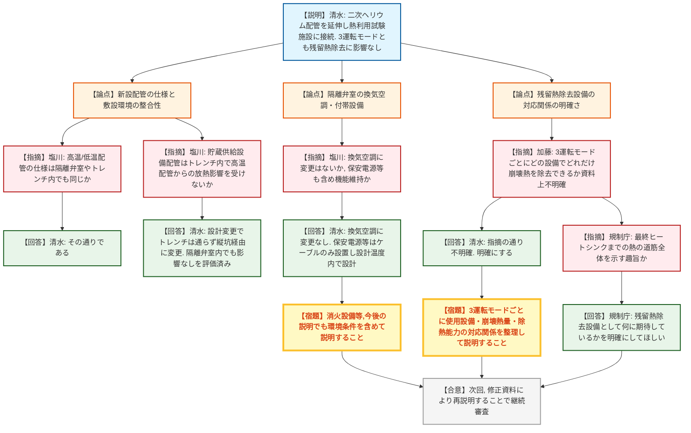
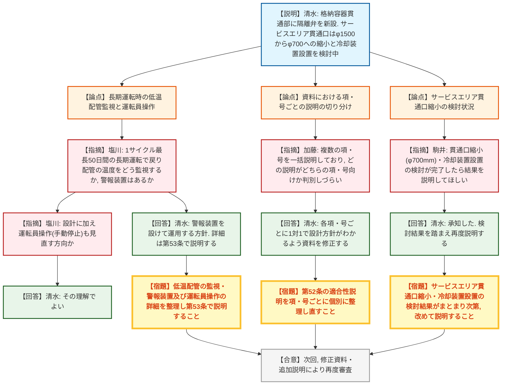
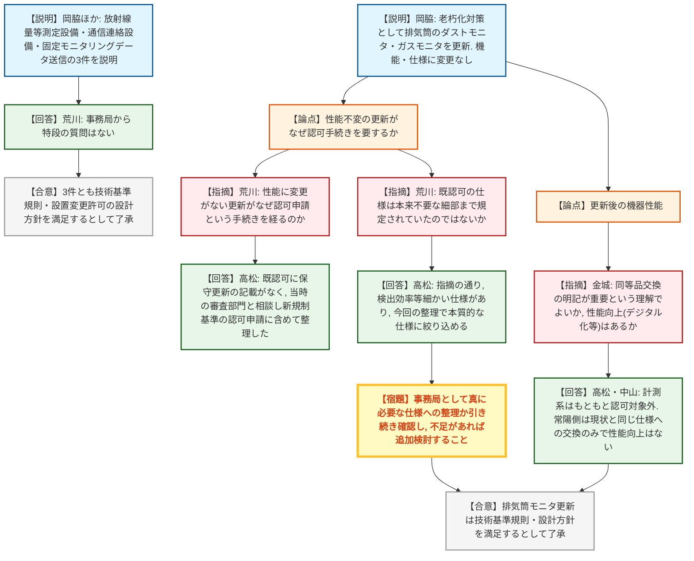

# 第589回核燃料施設等の新規制基準適合性に係る審査会合（令和8年7月22日）
> 出典 : https://youtube.com/live/ZoFGWuOzcyA?si=RhcVudkEH2FZIp9T

## 会合の概要
* **JAEA大洗原子力工学研究所(北地区)のHTTR熱利用試験施設接続について、第46条(残留熱除去)・第52条(原子炉格納施設)の適合性説明に対し、規制庁から資料構成・整理の甘さを指摘する質疑が相次いだ。** 残留熱除去設備がどれに当たるか運転モードごとに明確でない点、格納容器サービスエリア貫通口の設計変更(縮小)が検討中である点、複数の項・号を一括説明している記載のわかりにくさなど、実質的な安全性よりも「説明の整理不足」が主な論点となり、いずれも次回以降の再説明を求める形で継続審査となった。
* **HTTR熱利用試験施設からの高温流入に対する低温配管の長期監視(1サイクル最長50日間)について、警報装置設置と運転員による手動停止運用の見直しが議論された。** 設計に加えて運転員操作の運用見直しも検討中であることが確認された。
* **JAEA大洗(南地区)常陽の4件の設備変更(放射線量等測定設備、通信連絡設備、排気筒モニタ更新、固定モニタリングデータ送信多様化)は、いずれも技術基準規則の要求事項・設置変更許可の設計方針を満足するとして大きな異論なく了承された。**
* **排気筒モニタの更新(老朽化対策)について、性能変更のない「更新」がなぜ認可手続きを要するのかという手続き上の疑問が呈され、既認可の仕様が本来不要な細部まで規定されていた実態と、今回の整理で本質的な仕様に絞り込む狙いが説明された。**

---

## 議題ごとの詳細整理

### 【議題1】日本原子力研究開発機構大洗原子力工学研究所（北地区）のHTTR（高温工学試験研究炉）の熱利用試験施設接続に係る設置変更許可申請について

* **議論の背景と論点:**
  HTTRの二次ヘリウム系IHX出口から水素製造施設(熱利用試験施設)へ配管を延伸・接続する変更について、試験炉設置許可基準規則第46条(残留熱を除去することができる設備)及び第52条(原子炉格納施設)への適合性が論点となった。第46条では、通常停止時・強制循環可能なスクラム時・強制循環不可のスクラム時という3つの残留熱除去運転モードに対する説明の明確さが、第52条では格納容器・サービスエリア貫通部の改造(隔離弁新設、貫通部冷却装置設置)の設計成立性と、資料における項・号ごとの説明の切り分けが焦点となった。

* **質疑応答（詳細）:**
    **＜第46条：残留熱除去設備＞**
    * 【説明者側】清水（原子力機構）
      二次ヘリウム配管の延伸に伴い原子炉建屋隔離弁を新設し、増加するインベントリを補うため二次ヘリウム貯蔵供給設備の貯蔵タンクを原子炉建屋外に新設する。残留熱除去は通常停止時・強制循環可能時・強制循環不可時の3モードいずれも既存の冷却設備で対応でき、熱利用試験施設接続による影響はないと説明した。
    * 【規制側】塩川（規制庁）
      新設する高温配管(表面約160℃)・低温配管(保温材表面70℃以下)について、隔離弁室や二次ヘリウム貯蔵供給系の配管トレンチ内でも同じ仕様で敷設されるか確認した。
    * 【説明者側】清水（原子力機構）
      その理解の通りであると回答した。
    * 【規制側】塩川（規制庁）
      貯蔵供給設備からの新設配管が、高温配管と同居するトレンチ内で放熱の影響を受けないか質した。
    * 【説明者側】清水（原子力機構）
      設計進捗により、実際にはトレンチ内は貯蔵供給設備配管を通さず縦坑・隔離弁室のみを経由する設計に変更されており、トレンチは一般産業施設区分として整理し直したと訂正した。隔離弁室内の環境温度を踏まえても貯蔵供給設備配管への影響はないことを評価済みとした。
    * 【規制側】塩川（規制庁）
      隔離弁室の換気空調設備に変更はないか、また保安電源・通信連絡・消火設備等も含めて機能を維持する理解でよいか確認した。
    * 【説明者側】清水（原子力機構）
      換気空調に変更はなく、隔離弁室には隔離弁・配管・二次ヘリウム貯蔵供給設備と空調設備のみを設置し、保安電源等は機器本体ではなくケーブルを通すのみであると回答した。これらの配管等も換気空調の設計温度の範囲で設計するとした。
    * 【規制側】塩川（規制庁）
      今後、消火設備等の説明がある場合は環境条件も含めて説明してほしいと要望した。
    * 【説明者側】清水（原子力機構）
      承知した旨を回答した。
    * 【規制側】加藤（規制庁）
      残留熱除去の3運転モードについて、各モードでどの設備がどの程度の崩壊熱を除去できるかが資料上明確でないとし、残留熱除去設備がどれに当たるかを整理して説明するよう求めた。
    * 【説明者側】清水（原子力機構）
      残留熱除去設備がどれを指すか資料上わかりにくいという指摘として受け止め、明確にすると回答した。
    * 【規制側】加藤（規制庁）
      期待する説明の趣旨は、炉心に直接触れる一次系の除熱設備だけでなく、最終ヒートシンクまでの熱の道筋全体を示すことかと確認した。
    * 【説明者側】規制庁（補足）
      最終ヒートシンクは別条文で扱うため、ここでは残留熱除去設備として何に期待しているかを明確にしてほしい趣旨であると補足した。

    **＜第52条：原子炉格納施設＞**
    * 【説明者側】清水（原子力機構）
      二次ヘリウム配管の格納容器貫通部(高温側・低温側)に格納容器隔離弁を各1個新設し、高温側貫通部には貫通部冷却装置(独立2系統)を設置する。サービスエリア貫通部は当初φ1500mmを想定していたが、周辺の干渉物影響を低減するためφ700mmに縮小し貫通部冷却装置を設ける方向で検討中であり、設計成立性確認後に改めて説明すると述べた。
    * 【規制側】塩川（規制庁）
      前回(第6回)会合の指摘への回答について、熱利用試験施設側から戻る低温配管・コンクリートの温度を長期運転(1サイクル最長50日間)にわたりどう監視するのか、警報装置の有無を含めて説明を求めた。
    * 【説明者側】清水（原子力機構）
      一般産業施設側から高温のものが戻ってくる可能性を踏まえ警報装置を設けて運用する方針であり、詳細は第53条審査で説明するとした。最高使用温度を超えない範囲で原子炉を停止し隔離弁を締める考えであると回答した。
    * 【規制側】塩川（規制庁）
      設計に加えて運転員操作(手動停止の運用)も見直す方向という理解でよいか確認した。
    * 【説明者側】清水（原子力機構）
      その理解で良いと回答した。
    * 【規制側】加藤（規制庁）
      資料の一部で複数の項・号に対する説明を一括して記載しており、どちらの項・号への説明か判別しづらい箇所がある(33ページ等)とし、項・号ごとに個別に整理して説明するよう求めた。
    * 【説明者側】清水（原子力機構）
      趣旨を理解し、各項・号ごとに1対1で設計方針がわかるよう資料を修正すると回答した。
    * 【規制側】駒井（規制庁）
      サービスエリア貫通口の縮小(φ700mm)及び貫通部冷却装置設置の検討が完了した際には、その結果を踏まえ改めて説明してほしいと求めた。
    * 【説明者側】清水（原子力機構）
      承知した、検討結果を踏まえ再度説明すると回答した。

* **結論と宿題事項（アクションアイテム）:**
    * **決定事項:** 本日は資料説明を受け、規制庁から複数の整理不足の指摘があり、いずれも次回以降の修正・追加説明で対応することとし、了承・不承認の判断には至らず継続審査となった。
    * **宿題事項:**
      1. 3つの残留熱除去運転モードごとに、使用する設備・発生する崩壊熱量・除熱能力の対応関係を明確に整理して説明すること。
      2. 隔離弁室・配管トレンチ内の貯蔵供給設備配管に対する熱影響評価、及び消火設備等今後の説明でも環境条件を含めて説明すること。
      3. サービスエリア貫通口の縮小(φ700mm)・貫通部冷却装置設置の検討結果がまとまり次第、改めて説明すること。
      4. 熱利用試験施設側からの高温流入に対する低温配管の監視・警報装置及び運転員操作(手動停止)の詳細を整理し、第53条の審査で説明すること。
      5. 第52条の適合性説明を項・号ごとに個別に整理し直すこと。

---

### 【議題2】日本原子力研究開発機構大洗原子力工学研究所（南地区）の原子炉施設（高速実験炉原子炉施設「常陽」）の変更に係る設計及び工事の計画の認可申請について

* **議論の背景と論点:**
  常陽に関する4件の設備変更(放射線量等の測定に係る設備の整備、通信連絡設備の整備、排気筒モニタの更新、固定モニタリング設備のデータ送信システムの多様化)について、いずれも技術基準規則及び設置変更許可の設計方針への適合性が論点となった。特に排気筒モニタの更新は新規制基準の追加要求への対応ではなく老朽化対策であるため、なぜ認可申請という手続きを要するのかという手続き上の妥当性が主な論点となった。

* **質疑応答（詳細）:**
    **＜資料2-1, 2-2, 2-4：放射線量等測定設備・通信連絡設備・固定モニタリングデータ送信＞**
    * 【説明者側】岡脇ほか（原子力機構）
      直接線・スカイシャイン線の周辺空間線量率評価(最も近い地点で年間6.4µGy、基準の年間50µGy以下)、燃料取扱・貯蔵設備の放射線量・温度・液位の監視設備、通信連絡設備(構内一斉放送・所外/所内通信・非常用放送/ページング)、モニタリングポストのデータ送信多様化について、それぞれ技術基準規則及び設置変更許可の設計方針を満足すると説明した。
    * 【規制側】荒川（規制庁）
      この3件の資料について、事務局から特段の質問はないと述べた。

    **＜資料2-3：排気筒モニタの更新＞**
    * 【説明者側】岡脇（原子力機構）
      老朽化対策としてダストモニタ・ガスモニタを更新するものであり、機能・計測範囲に変更はなく既設許可と同じ仕様であると説明した。
    * 【規制側】荒川（規制庁）
      性能に変更がない「更新」であるにもかかわらず、なぜ認可申請という手続きを経る必要があるのか趣旨がわかりにくいと質した。
    * 【説明者側】高松（原子力機構）
      既認可には検出器の仕様が記載されている一方、保守範囲での交換・更新についての記載がなかったため、当時の審査部門と相談した結果、新規制基準適合性の認可申請の中で扱うこととし、今後保守範囲で検出器交換ができるよう記載も追加して整理したと回答した。
    * 【規制側】荒川（規制庁）
      既認可の仕様は、本来重要でない部分まで細かく規定されていたのではないかと確認した。
    * 【説明者側】高松（原子力機構）
      指摘の通り、検出効率の取り方など細かい仕様まで決まっている部分があり、今回の整理により本当に守るべき仕様まで絞り込めるのではないかと考えていると回答した。
    * 【規制側】荒川（規制庁）
      事務局として引き続き真に必要な部分か、不足がないかを確認し、必要であれば別途追加を求める可能性があるとした上で、現時点ではこの整理でよいとした。
    * 【規制側】金城（規制庁）
      仕様を簡潔に整理した上で、同等品と交換できるようにする旨を明記することが重要という理解でよいか確認し、あわせて古い機器から新しい機器への更新にあたり性能向上(デジタル化等)はあるのか質した。
    * 【説明者側】高松・中山（原子力機構）
      認可上は検出器の交換という整理であり、計測系(デジタル化等)はもともと認可の対象外であるとした上で、常陽側では現状と同じ仕様のものに入れ替えるのみで、性能面で新たな機能を加えるものではないと回答した。

* **結論と宿題事項（アクションアイテム）:**
    * **決定事項:** 常陽に関する4件(放射線量等測定設備、通信連絡設備、排気筒モニタ更新、固定モニタリングデータ送信多様化)は、いずれも技術基準規則の要求事項及び設置変更許可の設計方針等を満足していることが確認され、大きな異論なく了承された。排気筒モニタ更新の手続き上の位置づけについても事業者の説明に理解が示された。
    * **宿題事項:**
      1. 排気筒モニタ更新の仕様整理について、事務局として真に必要な範囲か引き続き確認し、不足があれば別途会合で追加検討すること。
      2. これまで未説明の部分について、次回以降の審査会合で説明を行うこと。

---

## 論理構造の可視化（Mermaid）

### 議題1-A：第46条（残留熱を除去することができる設備）

### 議題1-B：第52条（原子炉格納施設）

### 議題2：常陽の設備変更（放射線量等測定設備・通信連絡設備・排気筒モニタ・固定モニタリング）

