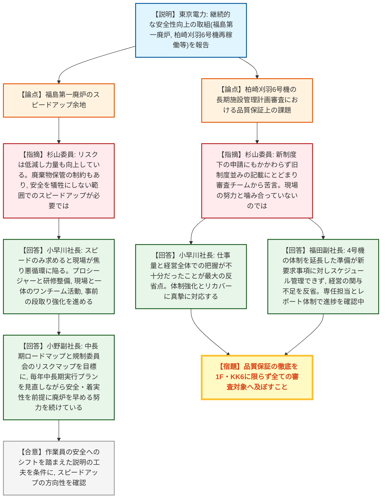
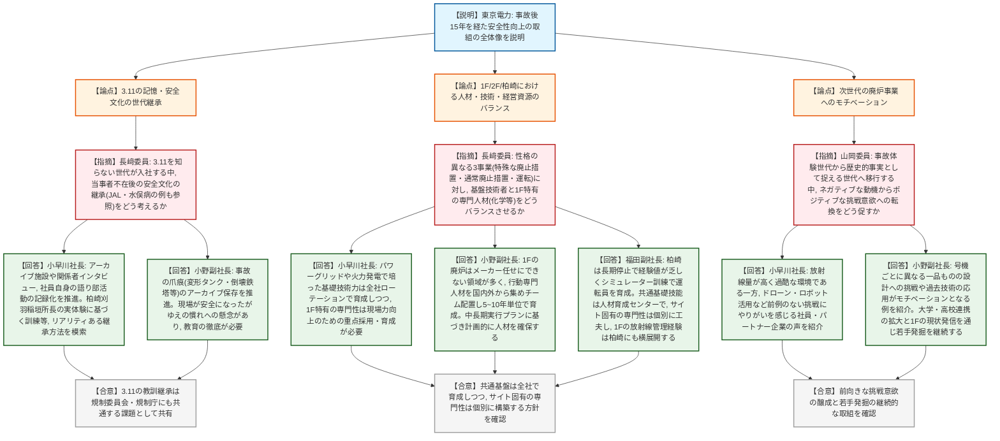
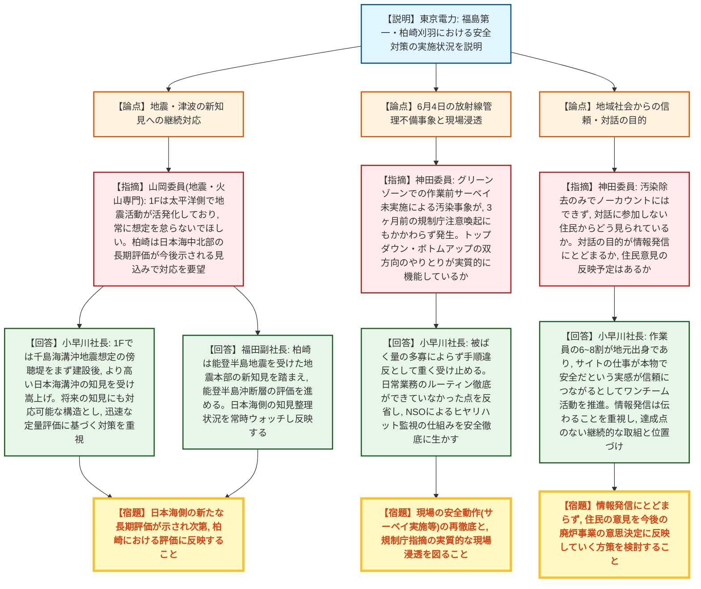
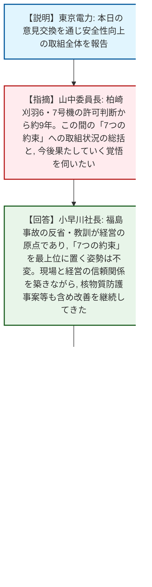

# 第23回原子力規制委員会臨時会議（令和8年7月22日）
> 出典 : https://youtube.com/live/9yMfzQaZipA?si=RYwsLCKPinZDaAv2

## 会合の概要
* **令和5年6月22日以来となる、原子力規制委員会と東京電力ホールディングス経営層(小早川社長、福田副社長、小野副社長)との意見交換。** 福島第一・柏崎刈羽・福島第二における「継続的な安全性向上の取組」全般について東電から説明があり、委員から多岐にわたる指摘・質問が行われた。
* **柏崎刈羽6号機の長期施設管理計画審査において、新制度が求める記載内容が不足し審査チームから苦言を呈されていたことが明らかになった。** 東電側は経営全体での仕事量把握の不足を最大の反省点として認め、体制強化を約束した。
* **6月4日に発生した放射線管理上の不備(作業前サーベイ未実施による身体汚染)について、事故の3ヶ月前に規制庁が同様のリスクを注意喚起していたにもかかわらず発生したことが問題視された。** 現場への指摘の浸透状況や、社長自身がどこまで現場の状況を把握しているかが厳しく問われた。
* **3.11を経験していない世代が増える中での安全文化の継承、及び性格の異なる3事業(1F/2F/柏崎)における専門人材のバランスについて突っ込んだ議論があった。** 東電はアーカイブ化や実体験に基づく訓練、サイト横断的な人材育成計画を紹介した。
* **柏崎刈羽6・7号機の設置変更許可判断から約9年を経て、改めて「7つの約束」の履行状況が問われ、東電は廃炉実施体制の見直し内容を秋頃に委員会へ報告する方針を示した。**

---

## 議題ごとの詳細整理

### 【議題】原子力規制委員会と東京電力ホールディングス株式会社経営層による意見交換

* **議論の背景と論点:**
  令和5年6月22日以来となる本意見交換では、東京電力から「継続的な安全性向上の取組」について、福島第一の廃炉、柏崎刈羽6号機の再稼働、福島第二の廃止措置を中心に説明が行われた。これを受け、委員からは福島第一廃炉の加速可能性、柏崎刈羽6号機審査での対応不備、3.11の記憶継承、1F/2F/柏崎における人材戦略、次世代のモチベーション醸成、地震・津波の新知見への対応、放射線管理事案とその現場浸透、地域社会との対話のあり方、そして「7つの約束」の履行総括という、経営レベルの多岐にわたる論点について意見が交わされた。

* **質疑応答（詳細）:**

  **＜福島第一廃炉のスピードアップ余地＞**
    * 【説明者側】東京電力(小早川社長)からの資料説明
      これまでの15年間の取組の全体像として、アルプス処理水放出の継続、2号機での燃料デブリ試験的取り出し、柏崎刈羽6号機の営業運転再開(14年ぶり)、福島第二の廃止措置着手、そして経営トップのリーダーシップのもとでの継続的な安全性向上とワンチーム活動の推進が報告された。
    * 【規制側】杉山委員
      15年間でリスクは着実に低減し作業員の力量向上も進んでいる一方、放射性廃棄物(焼却灰等)が保管スペースを圧迫し将来の作業を難しくする懸念があるため、安全を犠牲にしない範囲でのスピードアップが必要ではないか。
    * 【説明者側】小早川社長
      スピードのみを求めると現場が焦りトラブルを誘発する悪循環に陥りかねない。しっかりしたプロシージャーと研修の整備を前提に、発注者としてではなく現場と一体で段取りを作るワンチーム活動を反復作業(水処理メンテナンス等)から進めており、事前の計画・段取り(エンジニアリング機能)の強化が効率化の鍵になると回答。
    * 【説明者側】小野副社長
      国の中長期ロードマップと規制委員会のリスクマップを一つの目標として毎年中長期実行プランを見直しながら、安全性・着実性を大前提に廃炉をなるべく早く進める努力を続けていると補足。
    * 【規制側】杉山委員
      事故当初は公衆の安全が中心だったが、現在は作業員の安全にウェイトがシフトしており、その点を区別して社会に説明した方が印象も変わるのではないかとコメントし、スピードアップの認識共有を確認した。

  **＜柏崎刈羽6号機の長期施設管理計画審査における品質保証上の課題＞**
    * 【規制側】杉山委員
      柏崎刈羽6号機の長期施設管理計画審査は新制度後最初の申請案件ではなかったにもかかわらず、新制度が求める記載内容が十分でなく旧制度並みの内容にとどまり、審査チームから苦言を呈された。現場は精力的に努力している一方で審査対応がこの状況であることは、社全体の品質保証活動と噛み合っていないのではないか。
    * 【説明者側】小早川社長
      仕事のボリュームと、経営全体としてやるべきことを十分に把握できていなかったことが最大の反省点であり、弁解の余地はない。体制を強化しリカバーするとともに、後工程から逆算した情報共有の欠如がこれまでの不具合の一因になっていたとの認識も示した。
    * 【説明者側】福田副社長
      4号機のPLM審査で構築した体制の延長線上で6号機の準備を進めていたが、新たな要求事項に対するスケジュール管理が当初うまくいかなかった。経営側の関与が現場任せになっていたことを反省し、専任担当とレポート体制を整えて中身をチェックしながら審査対応を進めていると補足。
    * 【規制側】杉山委員
      品質保証の徹底は1Fや柏崎6号機のような大きな案件に限らず、全ての審査対象に及ぶべきであると念押しした。

  **＜3.11の記憶・安全文化の世代継承＞**
    * 【規制側】長﨑委員
      3.11を経験していない世代が入社してくる中、当事者が組織からいなくなった後の安全文化の継承方法について、JALや水俣病の事例も引きながら、マニュアルや形だけでなく「魂」として伝えていくための近い将来の方策を尋ねた。
    * 【説明者側】小早川社長
      アーカイブ施設の整備、事故当時の関係者へのインタビュー記録、社員自身による語り部活動の映像化を進めている。柏崎刈羽の稲垣所長が水素爆発当時の切実な体験を訓練の中で社員一人一人に伝えている例を挙げ、リアリティを持って次世代に継承する方法を今後も模索すると回答。
    * 【説明者側】小野副社長
      今後10年程度は事故の爪痕(変形したタンク、地震で倒壊した鉄塔等)がまだ現場に残っており直接学べる一方、廃炉が進むほど「事故の証拠品」は減っていくため、これらをアーカイブとして保存する取組を進めている。現場が安全になったことに作業員が慣れてしまう懸念もあり、教育の徹底が必要と補足した。
    * 【規制側】長﨑委員
      3.11の教訓は東京電力だけの課題ではなく、規制委員会・規制庁自身もこの反省に立って生まれた組織であるとして、次世代への継承・組織内での共有は双方の課題であるとの認識を共有した。

  **＜1F/2F/柏崎における人材・技術・経営資源のバランス＞**
    * 【規制側】長﨑委員
      事故を起こした特殊な廃止措置(1F)、通常の廃止措置(2F)、運転中サイト(柏崎)という性格の異なる3事業を同時に運営する中、電気・機械等の基盤技術者と、1F特有の化学等の専門人材をどうバランスさせていく考えかを尋ねた。
    * 【説明者側】小早川社長
      パワーグリッドや火力発電で培った基礎技術力は一つのサイトに限定せず全社的にローテーションしながら育成する一方、1Fでは化学やエンジニアリング等、未知の領域に対応する現場力を引き上げるための人材確保・育成に重点的に取り組む必要があると回答。
    * 【説明者側】小野副社長
      1Fの廃炉はプラントメーカーに任せきれない領域が多く、東京電力自身がエンジニアリングやプロジェクト遂行の能力を持つ必要があると認識している。国内外から行動専門人材を集め、東京電力社員をチームとして配置し5~10年単位で育成する方針であり、毎年策定する中長期実行プランに基づき計画的な人材確保・育成を進めていると補足。
    * 【説明者側】福田副社長
      柏崎は長期停止が続き運転経験が蓄積されていなかったため、シミュレーター訓練による運転員育成に力を入れてきた。機械・電気・放射線管理・燃料等の共通基礎技能は人材育成センターで育成し、サイト固有の専門性は各サイトで工夫している。福島第一の高線量下での放射線管理経験は柏崎にも横展開できると補足した。

  **＜次世代の廃炉事業へのモチベーション＞**
    * 【規制側】山岡委員
      事故を直接経験した世代から歴史的事実として捉える世代へ移行する中、「事故を何とかしたい」というネガティブな動機から「新しい領域に挑戦したい」という前向きな動機への転換が、結果的に廃炉を前進させる鍵になるのではないかとの見立てを示し、次世代へのモチベーションの持たせ方について考えを尋ねた。
    * 【説明者側】小早川社長
      放射線量が高く過酷な環境である一方、ドローンやロボットを活用した内部調査など前例のないプロジェクトの規模・ダイナミックさにやりがいを感じているという社員・パートナー企業の声を紹介し、中長期的な事業体としての方向性を示していくことが重要だと回答。
    * 【説明者側】小野副社長
      1号機から4号機でそれぞれ異なる設計のカバー・高台を作る「一品もの」の挑戦にやりがいを感じる技術者がいる一方、アルプス海底トンネル工事のようにゼネコンの若手が希望した現場だった例もあり、新技術・過去技術の応用の両方がモチベーションになり得ると説明。大学・高校との連携拡大や1Fの現状発信を通じて若手発掘を今後も継続する考えを示した。

  **＜地震・津波の新知見への継続対応＞**
    * 【規制側】山岡委員(地震・火山を専門とする委員)
      福島第一は太平洋側に位置し3.11後も地震活動が活発化しており、周辺で大地震・津波が起きる可能性を常に想定しておいてほしい。柏崎については日本海中北部の長期評価が地震本部から今後示される見込みであり、その対応も要望した。
    * 【説明者側】小早川社長
      福島第一では新知見に敏感に対応しており、まず千島海溝沖地震の切迫性を踏まえた防潮堤を建設した後、より高い津波を想定する日本海溝沖の知見を受けて嵩上げを実施した経緯を紹介。将来さらに高い津波想定が出た場合にも積み増しできる構造としており、迅速な定量評価に基づく対策が重要であると回答。
    * 【説明者側】福田副社長
      柏崎刈羽では能登半島地震を受けて地震本部が示した新たな知見を踏まえ、能登半島沖の断層評価をしっかり進めていく。日本海側の知見整理状況を常時ウォッチし、新知見が得られ次第反映して安全性を高めると補足した。

  **＜6月4日の放射線管理不備事象と現場への浸透＞**
    * 【規制側】神田委員
      6月4日、グリーンゾーンでの作業前に実施すべき作業環境サーベイを行わずに作業し、終了後に作業員の手・肘等への放射性物質付着が確認された事象が、その3ヶ月前の監視評価検討会で規制庁が同様のリスクを注意喚起していたにもかかわらず発生した。トップダウン・ボトムアップの双方向のやりとりが形骸化せず実質的に機能しているかを、社長がどこまで現場の状況・作業員の認識を把握しアクションしているか確認したいと質した。
    * 【説明者側】小早川社長
      被ばく量の多寡にかかわらず、サーベイをせずに作業に入った手順違反として重く受け止めるべき事案と認識している。ガス会社が換気のないマンホールで酸素測定を行う例に触れつつ、日常の反復業務のルーティンを徹底できていなかった点を反省。現場環境が改善したことへの慣れという懸念もあり、ヒヤリハットも含め現場の安全な振る舞いを観察・指摘するNSO(ニュークリアセーフティーオフィサー)の仕組みを、現場の安全徹底に生かしていくと回答した。

  **＜地域社会からの信頼・対話の目的＞**
    * 【規制側】神田委員
      汚染が除去されたからといって「ノーカウント」にはできず、作業員を大事にしているかは住民への配慮のバロメーターになる。2015年の意見交換会での「家族を送り出し無事に帰ってくることの積み重ねが信頼を作る」という趣旨の発言も引きつつ、資料19ページの対話活動に参加していない住民から東京電力がどう見られていると考えているか、また対話の目的が情報発信にとどまるのか、地域の意見を今後の廃炉事業に反映していく予定があるのか、地域性の異なる柏崎での重点の置き方も含めて質問した。
    * 【説明者側】小早川社長
      福島第一・柏崎いずれも作業員の6~8割が地元出身であり、地元の方が「サイトの仕事は本物で安全だ」と実感できることが最も信頼を高めるとして、発注者・受注者の関係を超えたワンチーム活動を進めていると説明。情報発信は「伝える」ことではなく「伝わる」ことを重視し、相手の関心に応じて内容を工夫しているが、達成点のない継続的な取組であると回答した。
    * 【規制側】神田委員
      地元からは情報発信への感謝の声もある一方、今後若い世代が対話の相手に加わりステークホルダーも変化する中、情報発信にとどまらず意思決定への反映の可能性も含めたコミュニケーションのあり方の検討を求めた。

  **＜「7つの約束」の履行総括と体制見直し＞**
    * 【規制側】山中委員長
      柏崎刈羽6・7号機の設置変更許可判断から約9年が経過する中、この間の福島第一廃炉と柏崎刈羽再稼働に向けた取組を踏まえ、改めて小早川社長に「7つの約束」への取組状況の総括と、今後これを確実に果たしていく覚悟を尋ねた。
    * 【説明者側】小早川社長
      福島の事故への反省と教訓が当社経営の原点であり、「7つの約束」を最上位に置く姿勢は今後も変わらないと明言。現場でものごとが起こるため経営がどうサポートするかが重要であり、核物質防護に関する不適切事案なども含め全てが順調だったわけではないが、現場と経営の信頼関係を築きながら改善を続けてきたと回答。第5次総合特別事業計画に記載した「福島最優先の経営判断」「廃炉事業遂行能力の向上」「現場主体の体制構築」の三本柱による改革を、来年度からの移行を目指し秋頃までに取りまとめる方針を改めて説明した。
    * 【規制側】山中委員長
      体制・役割分担の見直しがあっても「7つの約束」に抵触するものではないとの理解を示した上で、秋頃の具体的な報告を改めて委員会で議論したいと述べ、時間の都合により本日の意見交換を終了した。

* **結論と宿題事項（アクションアイテム）:**
  * **決定事項:** 本会合は許認可判断を行うものではなく、東京電力の継続的な安全性向上の取組状況を確認する意見交換として実施され、複数の分野にわたり規制側から指摘・要望が行われた。
  * **宿題事項:**
    1. 柏崎刈羽6号機の長期施設管理計画審査における新制度対応の不備について、経営全体での把握と体制強化によりリカバーし、他の審査対象にも品質保証を徹底すること。
    2. 3.11の記憶・教訓を、当事者が組織からいなくなった後も実効的に継承する仕組み(アーカイブ、映像記録、実体験に基づく訓練等)を継続的に発展させること。
    3. 1F/2F/柏崎という性格の異なる3事業に対応する専門人材(特に1Fの化学・エンジニアリング領域)を、中長期実行プランに基づき計画的に確保・育成すること。
    4. 柏崎刈羽について、日本海中北部の長期評価等、地震本部の新知見に継続的に対応すること。
    5. 6月4日の放射線管理不備事象を踏まえ、サーベイ実施等の基礎的な安全動作を現場に再徹底し、規制庁からの過去の注意喚起が実質的に現場へ浸透する体制を確立すること。
    6. 地域住民との対話について、情報発信にとどまらず、住民の意見を廃炉事業の意思決定に反映していく方策を検討すること。
    7. 「7つの約束」を確実に果たす体制であるかを整理した上で、廃炉実施体制の見直し内容を秋頃までに委員会へ報告すること。

---

## 論理構造の可視化（Mermaid）

### 福島第一廃炉のスピードアップ／柏崎刈羽6号機審査の品質保証課題

### 3.11の記憶継承と人材・モチベーション戦略

### 地震・津波の新知見対応／放射線管理事象／地域対話

### 「7つの約束」の履行総括

