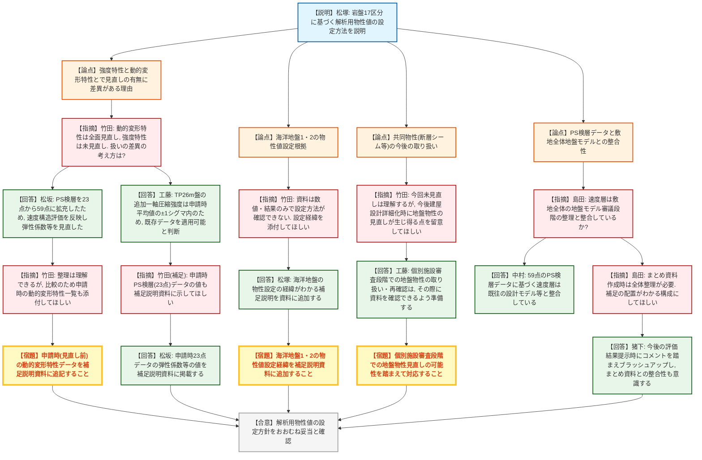
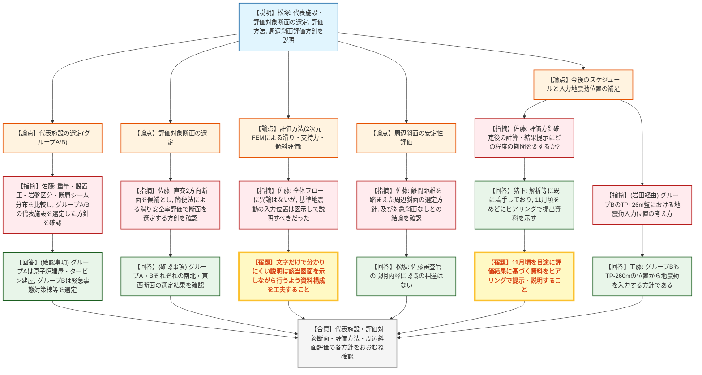

# 第1421回原子力発電所の新規制基準適合性に係る審査会合（令和8年7月24日）
> 出典 : https://youtube.com/live/XRIA9bE71m4?si=Er6MjrG2xZSEqlub

## 会合の概要
* **大間原子力発電所の基礎地盤及び周辺斜面の安定性評価「評価方針」を電源開発が説明し、規制側はおおむね妥当と確認した。** 解析用物性値の設定、代表施設・評価対象断面の選定、評価手法、周辺斜面の評価方針のいずれについても大きな異論は示されなかった。
* **解析用物性値のうち、強度特性と動的変形特性とで見直しの有無に差異がある点が焦点となった。** 強度特性(一軸圧縮強度等)は追加取得データが申請時のばらつき範囲内に収まることを理由に既存値を踏襲する一方、動的変形特性(初期せん断弾性係数・動ポアソン比)はPS検層データを23点から59点へ拡充した上で見直しており、規制側はこの整理を妥当と理解しつつ、比較のため申請時データの併記を求めた。
* **海洋地盤の物性値設定根拠や基準地震動の入力位置の説明について、資料が結果のみで分かりにくいとの指摘があり、事業者は補足説明資料の拡充を約束した。**
* **周辺斜面については、離間距離の検討の結果、安定性評価の対象となる周辺斜面は存在しないとの結論が確認された。**
* **今後のスケジュールとして、事業者は11月頃をめどにヒアリングで評価結果を提示する見通しを示した。** また、今回は設置(変更)許可段階の評価方針の確認であり、今後の個別施設審査で建屋設計が詳細化した際には地盤物性値の見直しが生じ得る点も共有された。

---

## 議題ごとの詳細整理

### 【議題1】電源開発（株）大間原子力発電所の基礎地盤及び周辺斜面の安定性評価について（評価方針）
* **議論の背景と論点:**
  設置変更許可申請に係る耐震重要施設及び常設重大事故等対処施設の基礎地盤及び周辺斜面の安定性評価について、その「評価方針」が対象。解析用物性値の設定根拠、代表施設・評価対象断面の選定手法、評価方法(有限要素法による解析)、周辺斜面の安定性評価方針の妥当性が論点となった。

* **質疑応答（詳細）:**
    * 【説明者側】松塚（電源開発）
      施設設置許可基準規則への適合確認内容、敷地の地質構造（岩盤17区分）、解析用物性値の設定方法（ボーリング・トレンチ・試掘坑調査等）、基準地震動、代表施設・評価対象断面の選定方針、評価方法（2次元有限要素法による滑り安全率・支持力・傾斜評価）、周辺斜面の安定性評価方針を通して説明した。

    * 【規制側】竹田（規制庁）
      解析用物性値のうち、動的変形特性（初期せん断弾性係数・動ポアソン比）は追加データを踏まえ全面的に見直す一方、強度特性（一軸圧縮強度等）は追加データがあるにもかかわらず見直しを行っていない。両者の扱いに差異があるように見えるため、事業者の考え方を確認したい。

    * 【説明者側】工藤（電源開発）
      TP+26m盤で追加取得した一軸圧縮強度の平均値が、申請時（新第三系）の平均値のプラスマイナス1シグマの範囲内に収まっていることを確認した。基礎地盤の安定性を支配する強度特性については、申請時のデータをそのままTP26m盤にも適用可能と判断した。

    * 【説明者側】松坂（電源開発）
      PS検層については申請時23点のデータを、その後59点まで拡充した。データ拡充により速度構造評価の精度向上が見込めるため、この追加データを反映して初期せん断弾性係数・動ポアソン比を見直した。

    * 【規制側】竹田（規制庁）
      動的変形特性は広範囲でのデータ拡充を踏まえた見直しであり、強度特性は局所的な追加にとどまり一軸圧縮強度の確認結果も大きく変わらないための判断、という整理は理解できる。ただし比較のため、見直し後の値と併せて申請時の動的変形特性一覧データも補足説明資料に追記してほしい。

    * 【説明者側】松坂（電源開発）
      申請時のPS検層（23点）データについて、初期せん断弾性係数・動ポアソン比がどのような値を示すかを補足説明資料に掲載する。

    * 【規制側】竹田（規制庁）
      海洋地盤1・2の物性値について、施設側の審査で設定方法が説明されているはずだが、本審査会合の資料では数値・結果のみが示され設定方法が確認できない。その設定経緯を補足説明資料に添付してほしい。

    * 【説明者側】松塚（電源開発）
      海洋地盤の物性値についても、設定の経緯がわかる補足説明を資料に追加する。

    * 【規制側】竹田（規制庁）
      共同物性（断層シーム等）について、申請時からの見直しを行わないという今回の判断は設置（変更）許可段階として理解する。ただし、今後個別施設審査の段階で建屋の設計が詳細に固まり重量・剛性等の見直しがなされた場合には、地盤物性値も必要に応じて見直しの対象となり得る点を念頭に置いてほしい。

    * 【説明者側】工藤（電源開発）
      個別施設審査における地盤物性の取り扱いや安定性の再確認については、その段階で資料を確認いただけるよう準備する。

    * 【規制側】竹田（規制庁）
      事業者との認識合わせができたので、そのように対応してほしい。私からの確認は以上である。

    * 【規制側】島田（規制部長）
      PS検層に基づくP波・S波の速度層について、敷地全体の地盤モデルを作成し審議していた段階での全体整理と整合しているか確認したい。

    * 【説明者側】中村（電源開発）
      59点のPS検層データに基づく地盤の速度層は、これまでの設計で用いてきたモデル等と整合している。

    * 【規制側】島田（規制部長）
      今後のまとめ資料作成時には全体としての整理が必要になる。どこにどのような補足を配置するか、資料構成をわかりやすくしておいてほしい。

    * 【説明者側】猪下（電源開発）
      今回は評価方針の説明であり、今後評価結果を示す段階で本日のコメントを踏まえてブラッシュアップするとともに、まとめ資料としての整合性も意識して対応する。

    * 【規制側】佐藤（規制庁）
      代表施設の選定について、評価対象施設をTP+12m盤以下のグループAとTP+28m盤のグループBに分類した上で、重量・設置圧・岩盤区分・断層シーム分布を比較検討し、グループAは原子炉建屋及びタービン建屋、グループBは緊急事態対策棟等を代表施設として選定した方針を確認した。

    * 【規制側】佐藤（規制庁）
      評価対象断面の選定について、代表施設を通過する直交2方向断面を候補とし、合計重量が増加する場合は保守側に断面位置を移動した上で、簡便法による滑り安全率評価に基づき断面を選定するとの方針、及びその結果としてグループA・グループBそれぞれで選定された断面を確認した。

    * 【規制側】佐藤（規制庁）
      評価方法について、2次元有限要素法による常時応力解析・地震応答解析で滑り・支持力・傾斜を評価する全体フローに異論はない。ただし基準地震動の入力位置の説明は文字のみでは分かりにくく、補足説明資料の該当図を示しながら説明すべきだった。地下水位の設定方針及び縦坑等のモデル化の方針については異論はない。

    * 【規制側】佐藤（規制庁）
      周辺斜面の安定性評価方針について、傾斜方向が評価対象施設に影響を及ぼし得る斜面を候補として抽出し、離間距離を踏まえて対象斜面を選定するとの方針、及びその結果として対象となる周辺斜面はなく、周辺斜面が評価対象施設に影響を与えないとの結論を確認した。

    * 【説明者側】松坂（電源開発）
      佐藤審査官の説明内容について、認識の相違はない。

    * 【規制側】佐藤（規制庁）
      本日確認した評価方針に基づき、今後計算を行い結果を提示・説明することになる。その計算にどの程度の期間を要する見通しか、スケジュール感を確認したい。

    * 【説明者側】猪下（電源開発）
      解析等は速報としてある程度把握しており、既に着手している段階である。11月頃をめどにヒアリングで提出資料を示して説明するスケジュール感を想定している。

    * 【規制側】佐藤（規制庁）
      津波については水位がやや高くなるものの波源は変わらないとの理解を確認し、自身からの確認事項は以上とした。

    * 【説明者側】工藤（電源開発）
      別の規制庁委員（岩田）からの確認事項を受け、グループBの緊急事態対策棟等が設置されるTP+26m盤についても、原子炉建屋設置位置付近と同様にTP-260mの位置から地震動を入力する方針である。

* **結論と宿題事項（アクションアイテム）:**
  * **決定事項:** 大間原子力発電所の基礎地盤及び周辺斜面の安定性評価に関する「評価方針」（解析用物性値の設定、代表施設・評価対象断面の選定、評価方法、周辺斜面評価の各方針）について、規制側からおおむね妥当との理解が得られた。
  * **宿題事項:**
    1. 比較のため、動的変形特性について申請時（見直し前）の初期せん断弾性係数・動ポアソン比の一覧データを補足説明資料に追記すること。
    2. 海洋地盤1・2の物性値の設定方法（経緯）がわかる説明を補足説明資料に追加すること。
    3. 基準地震動の入力位置等、文字だけでは分かりにくい説明については、該当する図面を示しながら説明する等、資料構成を工夫すること。
    4. 今後の個別施設審査段階において、建屋設計の詳細化に伴い地盤物性値の見直しが必要となる可能性があることを踏まえ対応すること。
    5. 11月頃を目途に、評価結果に基づく資料をヒアリングで提示・説明すること。

---

## 論理構造の可視化（Mermaid）

### 1. 解析用物性値の設定（強度特性・動的変形特性・海洋地盤・共同物性）

### 2. 代表施設・評価対象断面・評価方法・周辺斜面の安定性評価及び今後のスケジュール

