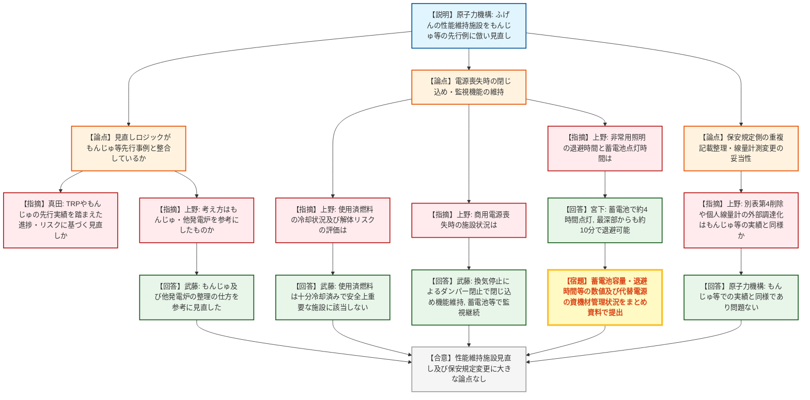
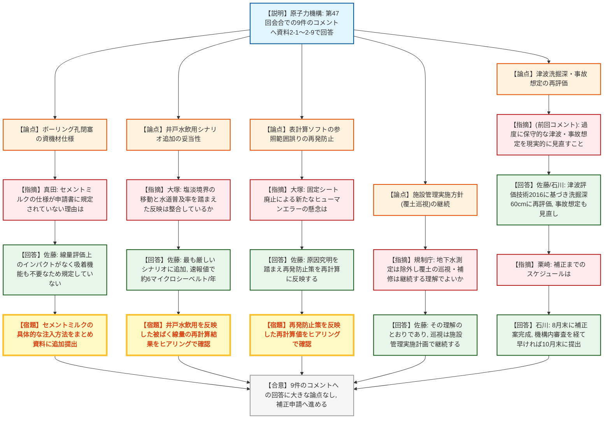

# 第49回核燃料施設等の廃止措置計画に係る審査会合（令和8年7月27日）
>
> 出典 : <https://youtube.com/live/xCc58agiciM?si=M6ewoaYai-3Wy1iG>

## 会合の概要

* **ふげん(新型転換炉原型炉施設)の性能維持施設見直しは、もんじゅ等の先行事例に整合**
  非常用照明の交流側、予備電源装置、空調換気設備、クレーン、解体装置等について、原子力災害の防止・廃止措置の安全確保の観点から性能維持対象外とする変更認可申請が示された。規制庁は、その整理の考え方がもんじゅや他の発電炉での先行実績と同様であることを確認し、大きな論点はないとした。
* **電源喪失時も閉じ込め・監視機能は確保**
  予備電源装置を性能維持から除外しても、外部電源喪失時は換気設備停止に伴うダンパー閉止で閉じ込め機能が維持され、蓄電池・モニタリングカーで監視を継続できること、非常用照明(約4時間)に対し退避(約10分)の余裕が十分にあることが確認された。
* **廃棄物埋設施設は前回9件の指摘事項への回答を提示、大きな論点なし**
  第47回会合(令和8年3月19日)でのコメント9件について、申請書記載の適正化、ボーリング孔の閉塞方法、安全機能・パラメータの設定、井戸水飲用シナリオの追加、津波による覆土流失量(洗掘深)の再評価、廃止措置中の事故想定、施設管理実施方針(覆土巡視の継続)等、多岐にわたる回答が示され、いずれも規制庁から大きな論点はないと確認された。
* **表計算ソフトの参照範囲誤りに対する再発防止策を確認**
  前回指摘された被ばく線量評価グラフへの反映漏れ(参照範囲の設定誤り)について原因と対策が説明されたが、規制庁からは今後固定シートを廃止する運用変更により新たなヒューマンエラーが生じないよう、再計算への確実な反映を求める指摘があった。
* **補正申請は早ければ10月末に提出見込み**
  廃棄物埋設施設の補正案は8月末を目途に完成させ、機構内審査を経て9月以降に手続きを進め、早ければ10月末までに提出する見込みであることが確認された。

---

## 議題ごとの詳細整理

### 【議題1】日本原子力研究開発機構新型転換炉原型炉施設（ふげん）の廃止措置計画変更認可申請及び保安規定変更認可申請について

* **議論の背景と論点:**
  ふげんの廃止措置の進捗に伴い、原子力災害の防止及び廃止措置の安全確保の観点から不要となった性能維持施設(非常用照明の交流側、予備電源装置、空調換気設備、クレーン、解体装置等)を性能維持対象から除外する変更認可申請、及びこれに伴う保安規定側の重複記載整理・巡視頻度明確化等の変更認可申請について、その見直しロジックの妥当性(もんじゅ等先行事例との整合)と、除外後も安全機能(閉じ込め機能・監視機能・退避時間)が確保されることが論点となった。

* **質疑応答（詳細）:**
  * 【説明者側】武藤・秋山（原子力機構）
      ふげんの性能維持施設について、原子力災害の防止・廃止措置の安全確保・廃止措置の進展に応じた機能性の見直しという3方針に基づき再確認を行った。非常用照明の交流側、予備電源装置、空調換気設備、クレーン(キャスク取扱いクレーンを除く)、解体装置等を性能維持から除外するもので、整理の考え方はもんじゅや他の発電炉の先行例と同様である。
  * 【規制側】真田（規制庁）
      性能維持施設見直しの先行実績としては、東海再処理施設(TRP)やもんじゅで、廃止措置の進捗に応じたリスク低下(使用済燃料冷却の進展等)に応じて随時見直しが行われてきた。今回のふげんの見直しも、そうした進捗・リスクの観点及び代替措置を含む性能維持解除のロジックに基づくものかを確認したい。
  * 【規制側】上野（規制庁）
      性能維持施設見直しの考え方(原子力災害の防止、廃止措置の安全確保の観点)は、もんじゅ及び他発電炉の考え方を参考にしたものかを確認したい。
  * 【説明者側】武藤（原子力機構）
      ご指摘の通り、もんじゅ及び他の発電炉の整理の仕方を参考に、今回の見直しを行った。
  * 【規制側】上野（規制庁）
      ふげんの使用済燃料の冷却状況及び解体に伴うリスクについて、現状の評価を説明してほしい。
  * 【説明者側】武藤（原子力機構）
      使用済燃料は十分に冷却されており冷却は不要である。大規模損壊・シビアアクシデントについても公衆被ばくが5ミリシーベルトを超えるおそれはなく、安全上重要な施設には該当しないと評価している。
  * 【規制側】上野（規制庁）
      非常用電源喪失時の施設の状況について説明してほしい。
  * 【説明者側】武藤（原子力機構）
      予備電源装置を性能維持から外しても、外部電源喪失時には換気設備が停止しフェイルクローズによりダンパーが閉止するため閉じ込め機能は維持される。モニタリング機能も蓄電池及びモニタリングカーにより継続監視が可能であり、管理区域内の作業員は換気設備停止に伴い速やかに退避する。
  * 【規制側】上野（規制庁）
      非常用照明の直流側について、作業員の退避に要する時間と、蓄電池による照明が確保できる時間を具体的に説明してほしい。
  * 【説明者側】宮下（原子力機構）
      直流の非常用照明は蓄電池により約4時間の点灯が可能であり、施設最深部からの退避でも約10分程度で退避可能なため、十分な時間的余裕がある。
  * 【規制側】上野（規制庁）
      数値等について、別途まとめ資料として提示してほしい。また電源の代替措置として、モニタリングポスト用の蓄電池やモニタリングカー、可搬型発電機による代替電源供給についても、保安規定に基づく資機材管理を徹底してほしい。
  * 【説明者側】武藤（原子力機構）
      資料は速やかに提出する。ご指摘の資機材管理についても承知した。
  * 【規制側】上野（規制庁）
      保安規定側の性能維持施設表(別表第4)の削除は廃止措置計画側の表(表6)との重複解消であり、もんじゅでも実施済みの変更で特段の論点はない。個人線量計測についても、外部認定機関からの受動型線量計調達への変更は他施設で実績があり、特段の論点はない。
  * 【説明者側】(原子力機構)
      ご理解の通りである。
  * 【規制側】栗崎（規制庁）
      資料1-1・1-2に基づく議論の結果、大きな論点はないと認識している。来年度の使用済燃料搬出開始等、新しいフェーズに入ることも踏まえ、引き続き安全第一で着実に進めてほしい。
  * 【説明者側】秋山（原子力機構）
      従前にもまして安全第一を第一に考え、進めていく。

* **結論と宿題事項（アクションアイテム）:**
  * **決定事項:** ふげんの性能維持施設見直し(資料1-1)及び保安規定変更(資料1-2)は、もんじゅ等の先行事例に沿った整理であり、電源喪失時の閉じ込め機能・監視機能・退避時間にも問題がないことが確認され、大きな論点はないとされた。
  * **宿題事項:** 非常用照明の蓄電池容量・退避所要時間等の数値、及びモニタリングポスト用蓄電池・モニタリングカー・可搬型発電機等の代替電源に関する資機材管理状況を、まとめ資料として別途提出すること。

---

### 【議題2】日本原子力研究開発機構原子力科学研究所廃棄物埋設施設の廃止措置計画認可申請及び保安規定変更認可申請について

* **議論の背景と論点:**
  前回第47回審査会合(令和8年3月19日)で示された9件のコメント(申請書記載の適正化、ボーリング孔の閉塞、安全機能・パラメータの設定、井戸水飲用シナリオ、被ばく計算の確認体制、津波による覆土流失量、廃止措置中の事故想定、施設管理実施方針等)への回答が論点となり、特にボーリング孔閉塞の資機材仕様、井戸水飲用シナリオの追加根拠、表計算ソフトの参照範囲誤りの再発防止、津波洗掘深の再評価根拠、施設管理(覆土巡視)継続方針の妥当性が詳細に確認された。

* **質疑応答（詳細）:**
  * 【説明者側】亀尾・石川（原子力機構）
      前回の指摘に対して経緯・事実関係を調査整理し、申請書全体の整合性点検とヒアリングでの確認を経て、資料2-1〜2-9として9件のコメントへの回答をまとめた。原災法適用除外は、廃止措置期間が約1か月と短く終了確認後は規制対象外となることから取り下げ、現行の非常時対応規定は削除しないこととした。
  * 【説明者側】石川（原子力機構）
      廃棄物埋設施設の付属施設について、事業許可申請書・保安規定・許可保安規定によらないものの区分に基づき整理し、廃止措置対象付属施設を設定した。用語も事業許可申請書に整合させ、図面(申請書13・14ページ)や工程表を追加して申請書の記載を充実させた。
  * 【規制側】真田（規制庁）
      ボーリング孔の閉塞について、現地調査の内容(現場と同等の土壌による埋め戻し、セメントミルクの充填、鉄管の溶接・塩ビ管の接着)には異論がないが、申請書では埋め戻し土壌の仕様は規定している一方、セメントミルクの仕様(OPC使用等)が規定されていない理由を確認したい。また、注入方法の具体案をまとめ資料に追加してほしい。
  * 【説明者側】佐藤（原子力機構）
      セメントミルクは放射性物質の吸着機能等を線量基準達成のために必要としているものではなく、線量評価上のインパクトがないため申請書本文には使用を規定していない。まとめ資料には、規制検査で確認が必要な充填方法の案を含めて追加提出する。
  * 【規制側】真田（規制庁）
      了解した。まとめ資料の内容はヒアリングで確認する。
  * 【説明者側】石川（原子力機構）
      被ばく評価に用いるパラメータ及び安全機能について、1000年後の気候変動を考慮した最新知見に基づき、更新なし・気候変動等による更新・新規設定の3区分で体系的に整理し、根拠集への反映を行う。廃棄物への収着や覆土の表面排水等、事業許可申請時に考慮していなかった安全機能も新規に設定した。
  * 【説明者側】佐藤（原子力機構）
      井戸水飲用シナリオについては、1000年後に埋設地下流端から海までの距離が伸びることで塩淡境界が変化する可能性を踏まえ、最も厳しい自然事象シナリオに井戸水飲用経路を追加する。一方、東海村の水道普及率が99.8%と高いため、最も可能性が高い自然事象シナリオでは従来通り井戸水飲用は考慮しない。
  * 【規制側】大塚（規制庁）
      1000年後の状態設定として塩淡境界の移動可能性を考慮し、最も厳しいシナリオに井戸水飲用を追加する一方、可能性が高いシナリオでは水道普及率を根拠に除外するという方針は、状態設定と被ばく経路の整合が図られたものと理解した。今後補正書への反映と、被ばく線量計算結果のヒアリングでの確認をお願いしたい。
  * 【説明者側】佐藤（原子力機構）
      補正申請に適切に反映する。速報値として、線量評価結果は約6マイクロシーベルト/年となる見込みである。
  * 【規制側】大塚（規制庁）
      最も厳しい自然事象シナリオの約300マイクロシーベルト/年に対し、非常に低い数値であると理解した。もう一点、被ばく計算の確認体制(表計算ソフトの参照範囲・データ受け渡しの再確認、品質マネジメントによる不適合管理)についても確認できたが、今後は固定した参照範囲のシートを使わず作業者自身が参照範囲を設定する運用になるため、新たなヒューマンエラーが生じないよう、原因究明を踏まえた再発防止策を再計算に確実に反映してほしい。
  * 【説明者側】佐藤（原子力機構）
      原因究明を踏まえた再発防止を行い、再計算値は今後のヒアリングで確認いただけるようまとめ資料を準備する。
  * 【規制側】規制庁
      施設管理実施方針について、廃止措置段階で不要となる地下水測定は保全の措置から除外する一方、この段階で必要な保全の措置(覆土の巡視・補修等)は引き続き実施することが読み取れるよう修正されたと理解した。今後の反映・運用について確認したい。
  * 【説明者側】佐藤（原子力機構）
      ご認識の通りであり、廃止措置段階でも覆土の巡視は施設管理実施計画の中で継続し、地下水測定のみ取りやめる。今後の保安規定・計画認可申請の中で適切に反映し、廃止措置作業中も適切な施設管理を実施する。
  * 【規制側】栗崎（規制庁）
      前回指摘した内容の整理結果を確認した。審査会合・ヒアリングで説明した内容を適切に補正へ反映してほしい。また、補正までのスケジュールを説明してほしい。
  * 【説明者側】石川（原子力機構）
      8月末を目途に補正案を完成させ、機構内(所内審査・本部・機構中央)の審査を経て9月以降に手続きを進め、早ければ10月末までに補正申請を提出する見込みである。
  * 【規制側】栗崎（規制庁）
      時間を要することを理解した。適切な補正をお願いする。

* **結論と宿題事項（アクションアイテム）:**
  * **決定事項:** 前回第47回会合での9件のコメントへの回答は、いずれも大きな論点はないと確認された。井戸水飲用シナリオの追加、津波洗掘深の再評価(浸水深1.0mの60%=60cm)、廃止措置中の事故想定の見直し、施設管理実施方針(覆土巡視の継続)等の対応方針が了承された。
  * **宿題事項:**
    1. ボーリング孔閉塞に用いるセメントミルクの具体的な注入方法をまとめ資料に追加提出すること。
    2. 井戸水飲用シナリオを反映した被ばく線量の再計算結果を、ヒアリングを通じて確認すること。
    3. 表計算ソフトの参照範囲誤りの再発防止策を、今後の全計算のやり直しに確実に反映し、その内容をヒアリングで確認すること。
    4. 上記コメントへの対応を反映した補正申請を、8月末の補正案完成、機構内審査を経て、早ければ10月末までに提出すること。

---

## 論理構造の可視化（Mermaid）

### 【議題1】ふげんの性能維持施設見直し及び保安規定変更

### 【議題2】廃棄物埋設施設の廃止措置計画に係る前回指摘事項への回答

