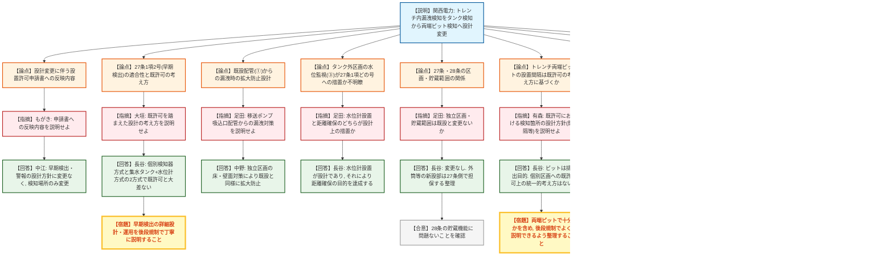
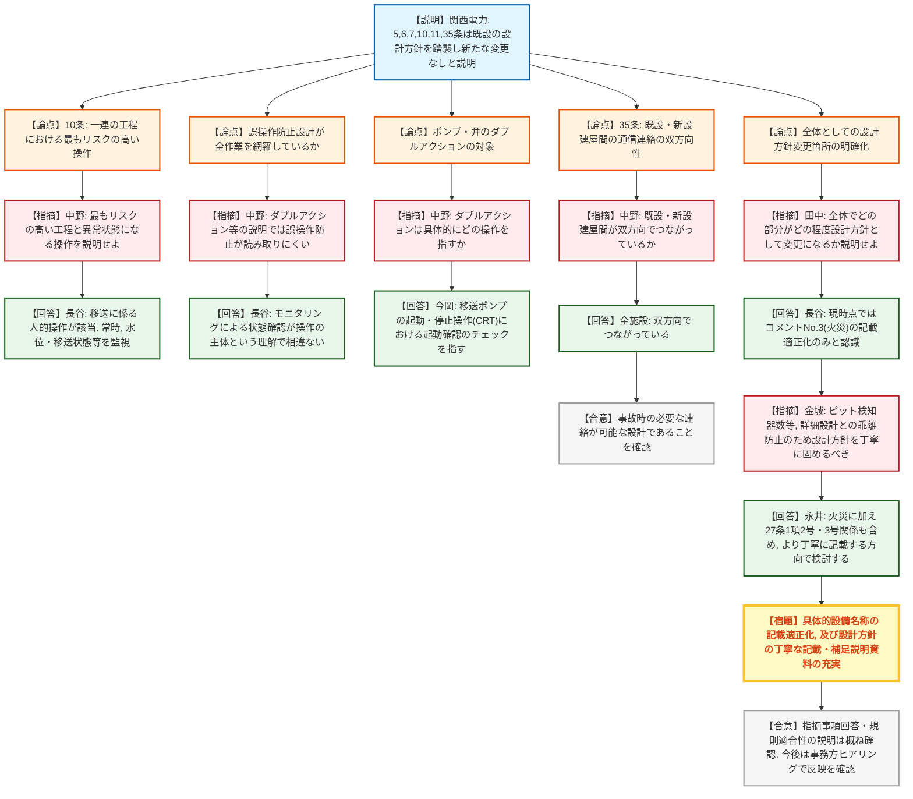

# 第1422回原子力発電所の新規制基準適合性に係る審査会合（令和8年7月28日）
> 出典 : https://youtube.com/live/Mtm4nedkWus?si=psvaVfQrQ7YOAsIM

## 会合の概要
* **トレンチ内漏洩検知の設計変更（タンク検知から両端ピット検知へ）**
  関西電力から、大飯発電所3・4号炉 使用済樹脂処理設備のトレンチ内配管について、従来の使用済樹脂処理槽・集水タンクでの検知から、トレンチ両端のピットに漏洩検知器を設置する方式へ設計変更した旨の説明があった。規制庁は申請書の設計方針（早期検出・警報発信）自体には変更がないことを確認しつつ、詳細設計の妥当性は後段規制で丁寧に説明するよう求めた。
* **使用済樹脂貯蔵タンクの水位監視と第27条適合性の論理性が焦点に**
  タンク開放期間中の水位監視という一つの措置が、第27条第1項第2号（漏洩防止）と第3号（散逸し難い設計）のどちらの、あるいは両方の要求にどう対応するのかについて、規制庁（有森氏）から複数回にわたり踏み込んだ確認がなされ、補足説明資料での考え方の充実が宿題となった。
* **火災対策（照明・消火設備を設置しない設計）は概ね了承**
  高線量区域である使用済樹脂供給タンクエリア等について、通常時は施錠管理・可燃物なし、立入時は可燃物管理と監視人配置により早期感知・消火を担保するとして、火災感知機・自動消火設備等を設置しない設計を説明し、規制庁から追加の指摘はなかった。ただし記載上、消火設備の具体的名称を明記する適正化が必要と関西電力自ら認めた。
* **第5・6・7・10・11・35条は既設の設計方針を踏襲し大きな争点なし**
  津波・外部衝撃・不法侵入防止・誤操作防止・安全避難通路・通信連絡設備について、既設の設計方針から変更がないことを説明し、比較的スムーズに確認が進んだ。ただし10条の誤操作防止については、リスクの高い工程（移送作業）や監視主体の運用実態について規制庁から具体的な確認がなされた。
* **規制庁から設計方針の記載の丁寧化を強く要求**
  会合終盤、規制庁（田中氏・金城氏）から、個別のやり取りを踏まえると設計方針に若干の変更が生じている箇所があるとして、詳細設計との乖離防止のため、補足説明資料も含め設計方針をより丁寧に記載するよう強く求められ、関西電力はこれを承知した。

---

## 議題ごとの詳細整理

### 【議題1】関西電力（株）大飯発電所3号炉及び4号炉の使用済樹脂処理設備の設置に係る設置変更許可申請の審査について

* **議論の背景と論点:**
  本議題は、大飯発電所3・4号炉における使用済樹脂処理設備の新設に係る設置変更許可申請について、(1) 4月21日・6月18日の審査会合で受けた指摘事項3件（トレンチ内漏洩検知、使用済樹脂貯蔵タンク開放時の設計・運用、高線量タンクエリアの火災対策）への回答（資料1-1）、および (2) 設置許可基準規則第5条・6条・7条・10条・11条・35条への適合性（資料1-2）を説明するものであった。論点は、既設設備の設計方針をどこまで踏襲でき、どこに新設に伴う設計変更が生じているかの整理の妥当性に集約された。

* **質疑応答（詳細）:**

  **＜資料1-1: 過去の指摘事項への回答＞**
  * 【説明者側】寺西・中江・長谷ほか（関西電力）
    トレンチ内配管は耐食性に優れた材料を使用し耐震設計により漏洩発生を防止する一方、従来案から設計を変更し、トレンチ両端のピットに漏洩検知器を設置して検知する方式とした。検知時は中央制御室・使用済樹脂処理建屋内制御室に警報を発信する設計とした。
  * 【規制側】もがき（規制庁）
    4月の会合から検知方式の方針を変更したとのことだが、この変更に伴う設置許可申請書等への反映内容を説明してほしい。
  * 【説明者側】中江（関西電力）
    申請書の添付書類8では「漏洩を早期に検出し、中央制御室等に警報を発信する設計とする」という設計方針を記載しており、今回の変更は検知の場所を変えるのみで、この設計方針自体には変更がないと考えている。
  * 【規制側】大垣（規制庁）
    現れるような変更ではないことは承知した。第27条第1項第2号の解釈にある「早期検出」への適合性について、既許可を踏まえた設計の考え方を説明してほしい。
  * 【説明者側】長谷（関西電力）
    早期検出の方法には、区画内で個別に検知器で検知する方法と、建屋の床等から集水タンクに収水し水位計で警報を発信する方法の2つがあり、今回のトレンチピットでの検知もこの考え方から大きく変わるものではない。
  * 【規制側】大木（規制庁）
    既設の考え方は変わらず、集水タンクからトレンチ内ピットでの検出に変更したと理解した。早期検出に関する詳細設計・具体的運用は後段規制で確認するため、その際は丁寧な説明をお願いしたい。
  * 【説明者側】足田（規制庁）
    移送ポンプ吸込口から使用済樹脂処理装置管（①）についても新設配管に耐食性材料を使用するとの説明だが、この箇所から万一漏洩した場合の対策を説明してほしい。
  * 【説明者側】中野（関西電力）
    使用済樹脂移送装置の出口配管から漏れた場合、既設建屋のフロアドレンから集水タンクで検知される設計である。漏洩拡大防止についても、当該区画は独立区画とし床・壁面に漏洩し難い対策を講じており、既設の考え方から変わるものではない。
  * 【規制側】足田（規制庁）
    使用済樹脂貯蔵タンクが設置された区画外への設計（③）について、タンクの水位監視そのものが第27条第1項第2号・第3号への適合根拠として設計上の措置なのか、それとも目的である「水面と区画上部開放箇所までの距離確保」が措置なのか不明瞭であり、両者の関係を説明してほしい。
  * 【説明者側】長谷（関西電力）
    設計としては操作盤に水位計を設置することを指しており、その水位計を監視して異常がないことを確認することで、開放箇所までの距離を十分に確保するという目的が達成されると考えている。
  * 【規制側】足田（規制庁）
    設計は水位計であり、目的である距離確保はその水位計監視によって担保されるという理解でよいか確認したところ、関西電力は同意した。詳細は今後の設計で確認するとして、補足説明資料への記載を依頼した。
  * 【説明者側】足田（規制庁）
    第27条・28条の関係（8ページ）について、独立区画・貯蔵範囲の変更は既設の考え方から変更がないという説明でよいか、また新設のポンプ搬入管台・外筒は28条に含まれないという理解でよいか確認した。
  * 【説明者側】長谷（関西電力）
    貯蔵に関する変更はなく、新設のポンプ搬入管台・外筒は28条には該当せず、27条の漏洩防止設計として整理していると回答した。
  * 【規制側】足田（規制庁）
    タンク上部からの漏洩を想定しないという既設の考え方について、それを含めなくても問題ない設計と言えるか理由を説明してほしい。
  * 【説明者側】長谷（関西電力）
    独立区画により、タンク内の流体（液層部）からの漏洩の拡大を防止する設計であり、大飯は待機開放型タンクであるため気層部が損傷しても液層部の漏洩は生じないと考えている。既許可段階でもポンプ搬入管台からの漏洩を想定して区画を設定したものではなく、その考え方は外筒設置後も変わらない。

  **＜有森氏によるコメントNo.1・No.2の深掘り＞**
  * 【規制側】有森（規制庁）
    トレンチ両端にピットを設置する方針は既許可の考え方を踏まえたものか、既許可における検知箇所の設計方針（間隔等の考え方）を説明してほしい。
  * 【説明者側】長谷（関西電力）
    ピットは漏洩後の排出のために設けたものであり、検知そのものは漏れたものを確実に検知できる設計であって、既許可の考え方から大きく変わるものではない。トレンチのような区画について既許可上、個別に示された統一的な考え方はない。
  * 【規制側】有森（規制庁）
    設置許可の設計方針（早期検出）に基づき、詳細設計の際に両端ピットのみで十分かを含め、後段規制でよく説明できるよう整理してほしいと要望した。
  * 【規制側】有森（規制庁）
    水位監視（③）が第27条第1項第3号（散逸し難い設計）にどう該当するのか、①②に示される密閉容器・配管での取り扱いとの関係で理由が不明瞭であり、繰り返し説明を求めた。
  * 【説明者側】中江・長谷（関西電力）
    固体廃棄物は貯蔵タンクに貯蔵・減衰させ、密閉された容器・配管内で取り扱うことで散逸し難い設計とすると添付書類に記載しており、水位監視はタンクという容器内に固体の樹脂が水位以下の状態で収まっていることを確認する趣旨として読めると回答した。
  * 【規制側】有森（規制庁）
    説明の趣旨は理解したが、設計方針としてそこまで明確に読み取れるかは疑問であるとし、補足説明資料でこの考え方をしっかり充実させ、適切な設計方針の記載を検討するよう求めた。関西電力（長谷）は承知した旨回答した。
  * 【規制側】有森（規制庁）
    28条の独立区画（7ページ）とは既許可時の塗装面までの範囲という理解でよいか確認したところ、長谷（関西電力）は塗装面プラス背面のコンクリートを含めて一つの区画と整理していると回答した。

  **＜鳥井田室長によるコメントNo.3（火災対策）の確認＞**
  * 【規制側】鳥井田（規制庁）
    高線量の使用済樹脂供給タンクエリア等について照明設備を設置しない設計とし、通常時は可燃物・火源がなく施錠管理により火災が発生する恐れがないこと、立入時は可燃物の持ち込み管理と監視人配置により早期感知・消火が可能であることから、自動火災感知機・自動消火設備・固定式消火設備を設置しない設計とした説明を理解し、追加の確認・指摘は特にない旨述べた。

  **＜資料1-2: 第5・6・7・10・11・35条への適合性＞**
  * 【説明者側】寺西（関西電力）
    第5条（津波）は使用済樹脂処理建屋・連絡トレンチを基準津波の遡上波が到達しない高所（TP約14m・TP10m以上）に設置、第6条（外部衝撃）はクラス3施設として修復可能な設計、第7条（不法侵入防止）は敷地境界での立入制限・出入確認・監視、第11条（安全避難通路）は蓄電池内蔵の非常灯・誘導灯設置、第35条（通信連絡設備）は保安電話・アンテナ・スピーカー等の設置と非常用電源からの給電とし、いずれも既設の設計方針から変更はないと説明した。
  * 【規制側】中野（規制庁）
    受入から処理までの一連の工程で最もリスクの高い工程はどこか、作業者はどのような操作を行い、どのような操作で異常な状態になり得るのか説明してほしい。
  * 【説明者側】長谷（関西電力）
    処理過程は基本的に自動化されており、人の操作が介在する移送に係る作業が比較的リスクのある工程となる。移送時は常時、操作盤・制御室で各タンクの水位状態や移送状態、ピットでの漏洩検知の有無を確認しながら作業する体制としている。
  * 【規制側】中野（規制庁）
    資料の説明では「適切に操作できる」「ダブルアクション」といった記載が中心で、全ての作業に対する誤操作防止が読み取りにくかったとし、人為的な誤操作による事故というより、モニタリングによる状態確認が操作の主体という理解でよいか確認した。長谷（関西電力）はその理解の通りで、状態確認・監視を中心に行う設計であると回答した。
  * 【規制側】中野（規制庁）
    ポンプや弁のスイッチのダブルアクションとは具体的にどの操作を指すのか説明してほしい。
  * 【説明者側】今岡（関西電力）
    CRTによる移送ポンプの起動・停止の手動操作を指しており、ワンタッチのみでは起動信号が出ないよう、起動してよいかを確認するチェックを介するダブルアクションとしている。中野（規制庁）は、これが移送に係るポンプの起動・停止操作に関する記述であると理解し了承した。
  * 【規制側】中野（規制庁）
    第35条の警報設備について、既設建屋と新設建屋が図上では分断されているように見えるが、双方向でつながっているという理解でよいか確認した。全施設（関西電力）は双方向でつながっていると回答し、中野（規制庁）は事故時にも必要な連絡ができる設計であることを確認した。

  **＜田中氏・金城氏による全体の設計方針への確認＞**
  * 【規制側】田中（規制庁）
    今回の説明を踏まえ、全体としてどの箇所・どの程度が設計方針として変更になるのか、現時点で説明できるか確認した。
  * 【説明者側】長谷（関西電力）
    現時点で手を加える必要があると考えているのは、コメントNo.3（火災）に関する記載の適正化（消火設備を設置しない旨の記載に、自動消火設備・固定式消火設備といった具体的な設備名称を明記する必要がある点）のみであり、それ以外は補足説明資料で考え方を整理する方向であると回答した。
  * 【規制側】金城（規制庁）
    個別のやり取りを踏まえると、新設建屋・トレンチの接続等により設計方針に若干の変更が生じている箇所が見られるとし、例えばトレンチのピット検知器の数など、詳細設計との乖離を防ぐため、設計方針自体をしっかり固めて補足説明資料を充実させるよう強く求めた。
  * 【説明者側】永井（関西電力）
    承知した旨回答し、火災だけでなく第27条第1項第2号・第3号関係についても、設計方針をより丁寧に記載する方向で検討すると述べた。

* **結論と宿題事項（アクションアイテム）:**
  * **決定事項:** 大飯発電所3・4号炉 使用済樹脂処理設備の設置について、これまでの審査会合（4月21日・6月18日）での指摘事項3件（トレンチ内漏洩検知、タンク開放時の設計・運用、高線量タンクエリアの火災対策）への回答、および設置許可基準規則第5条・6条・7条・10条・11条・35条への適合性は、概ね確認できたものと規制庁に認識された。
  * **宿題事項:**
    1. トレンチ内漏洩検知について、両端ピットのみで早期検出の役割を果たせるかを含め、既許可の考え方を踏まえた設計方針の考え方を後段規制でも丁寧に説明できるよう整理すること。
    2. 使用済樹脂貯蔵タンクの水位監視が第27条第1項第3号（散逸し難い設計）に該当する理由・考え方について、補足説明資料で充実させること。
    3. コメントNo.3（火災）について、消火設備を設置しない旨の記載を、自動消火設備・固定式消火設備等の具体的な設備名称を用いて適正化すること。
    4. 第27条第1項第2号・第3号関係を含め、新設に伴い変更が生じている設計方針の記載をより丁寧なものとし、詳細設計との整合を図ること（補足説明資料の充実）。
    5. 今後は事務方ヒアリングにより申請書・補足説明資料への反映状況を確認し、新たな論点が生じた場合には改めて審査会合での説明を求める。

---

## 論理構造の可視化（Mermaid）

### 【議題1-1】指摘事項への回答（トレンチ漏洩検知・タンク開放・火災対策）

### 【議題1-2】設置許可基準規則(第5・6・7・10・11・35条)への適合性

