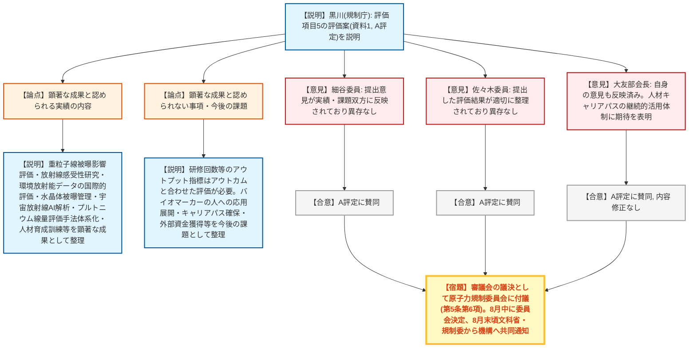

# 第24回国立研究開発法人審議会量子科学技術研究開発機構部会（令和8年7月28日）
> 出典 : https://youtube.com/live/16HW9SQO6Pw?si=nyIrGnlGbfKvYj6O

## 会合の概要
* **評価項目5（放射線被曝から国民を守るための研究開発と社会システム構築）はA評定で意見取りまとめ**
  前回7月7日の部会でのQSTからのヒアリングと各委員意見を踏まえ、事務局（黒川放射線防護企画課長）がまとめた評価案（資料1）について、3名の委員全員が「異存なし」と表明し、A評定（5段階のうち上から2番目、標準はB）で部会の評価として確定した。
* **重粒子線被曝影響評価・放射線感受性研究など、顕著な成果が多数認定**
  医療・宇宙分野における重粒子線被曝影響評価（バイオマーカー開発への貢献）、胎児期・新生児期の栄養環境が放射線感受性の個人差に及ぼす影響の解明、環境放射能データの国際的評価（表彰受賞）、水晶体被曝管理の実態把握、宇宙放射線のAI自動解析技術（スループット100倍以上）などが顕著な成果として整理された。
* **被曝医療・人材育成分野でも実績を評価**
  プルトニウム吸入事故を踏まえた被曝線量評価手法（肺モニタ計測とバイオアッセイの併用）の体系化提案、高線量放射線被曝による聴覚障害へのミューズ細胞療法の準備進捗、基幹高度被曝医療支援センターとしての高度専門人材育成・原子力災害対応訓練の実施等が評価された。
* **今後の課題はアウトプット指標からアウトカム指標への深化**
  研修回数やeラーニング運用実績等のアウトプットに加え、医療現場での実装状況・線量低減効果・センター間連携の実効性といったアウトカム指標の明確化、バイオマーカー研究等の人への応用展開、高度専門人材のキャリアパス確保が今後の課題として指摘された。
* **修正なしで審議会の議決へ**
  内容修正は行わず事務局案どおり確定。原子力規制委員会国立研究開発法人審議会の規定（第5条第6項）により、部会としてではなく審議会の議決として原子力規制委員会に付議され、8月中に委員会が決定、8月末頃に文部科学省と原子力規制委員会が共同でQSTへ通知・公表する予定。

---

## 議題ごとの詳細整理

### 【議題1】国立研究開発法人量子科学技術研究開発機構の令和7年度における業務の実績に関する評価（原子力規制委員会共管部分）についての意見の取りまとめ

* **議論の背景と論点:**
  前回7月7日の部会でのQSTからのヒアリング及びその後各委員から提出された意見を踏まえ、事務局が評価項目5（放射線被曝から国民を守るための研究開発と社会システム構築）に関する評価案（資料1、A評定）を取りまとめた。本評定案が各委員の意見を過不足なく反映しているか、また部会としての最終評価をA評定・修正なしで確定できるかが論点となった。

* **質疑応答（詳細）:**
  * 【説明者側】黒川（規制庁・放射線防護企画課長）
    評価項目5の評価案（資料1）を説明。顕著な成果が認められる実績として、医療・宇宙分野の重粒子線被曝影響評価、放射線感受性の個人差要因の解明、環境放射能データの国際的評価、水晶体被曝管理・個人線量計装着状況調査、宇宙放射線AI自動解析、プルトニウム吸入事故の線量評価手法体系化、基幹高度被曝医療支援センターとしての人材育成・訓練実績等を挙げ、これらを踏まえA評定を提案した。
  * 【説明者側】黒川（規制庁）
    一方、顕著な成果とまでは認められない事項として、研修回数・会議回数・eラーニング運用等はアウトプット指標にとどまり、技能定着や組織間連携対応時間短縮等のアウトカムと合わせた評価が必要との委員意見があったことを説明。今後の課題として、診断参考レベル・水晶体被曝管理の医療現場での実装状況の追跡、バイオマーカー研究等の人への応用展開、高度専門人材のキャリアパス確保、外部資金獲得によるリソース確保等を挙げた。
  * 【委員】細谷（東京大学）
    事前に提出した意見が評価すべき実績・今後の課題のいずれにも全て反映されているとし、A評定を含め評価案に異存はないと述べた。
  * 【委員】佐々木（電力中央研究所）
    事前に提出した評価結果が適切に整理されていることを確認したとし、A評定を含め評価案に異存はない旨を述べた。
  * 【部会長】大友
    自身が提出した意見も評価すべき実績・今後の課題ともに適切に反映されているとし、特に人材のキャリアパスについて、育成した優秀な人材を継続的に活用できる体制の維持に期待を示した上で、A評定に賛同した。

* **結論と宿題事項（アクションアイテム）:**
  * **決定事項:** 評価項目5について3名の委員全員がA評定に異存なしと表明し、部会の評価として事務局案どおりの内容（修正なし）で取りまとめることが決定した。
  * **今後の扱い（宿題事項）:** 本部会の評価は、原子力規制委員会国立研究開発法人審議会の規定（第5条第6項）により、部会としてではなく審議会の議決として原子力規制委員会に付議される。原子力規制委員会は8月中に決定する予定であり、決定後は文部科学省と原子力規制委員会が共同で8月末頃にQSTへ通知・公表する。

---

## 論理構造の可視化（Mermaid）

### 【議題1】業務実績評価（評価項目5）の意見取りまとめ

