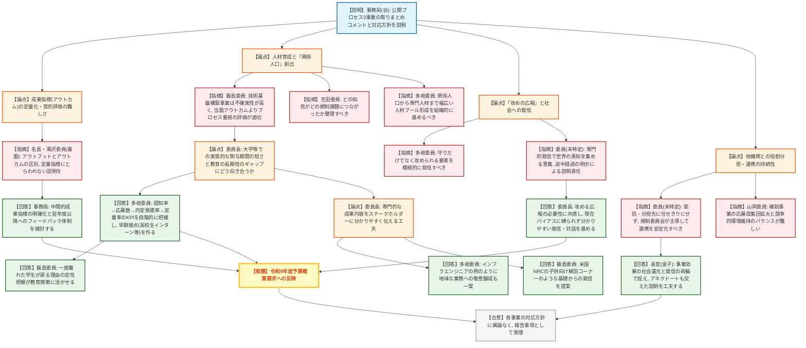
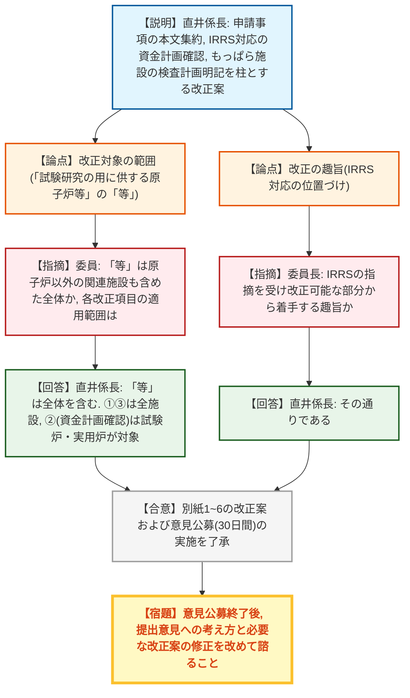
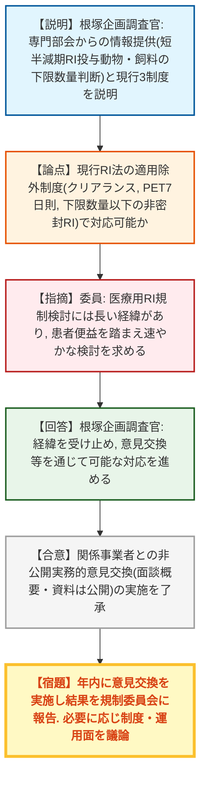
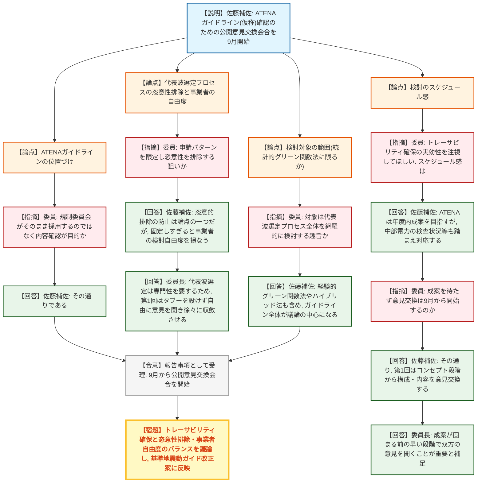
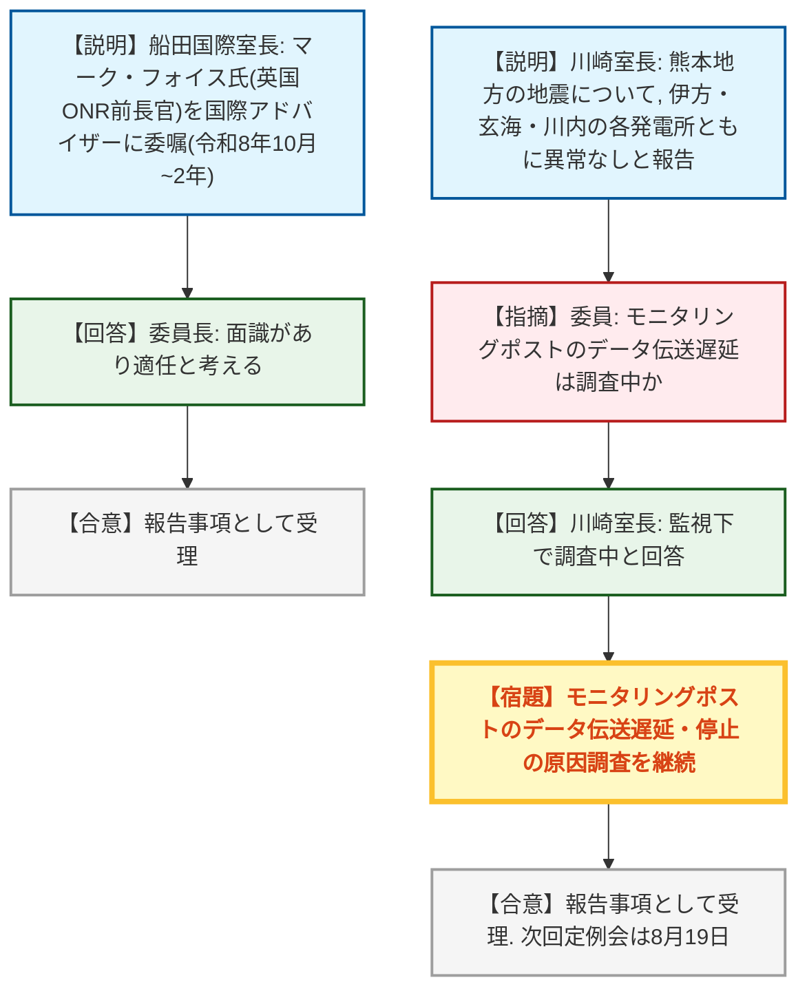

# 第24回原子力規制委員会（令和8年7月29日）
> 出典 : https://youtube.com/live/q2i9FxUc-pY?si=k-gGA7D0gRJHBaSa

## 会合の概要
* **令和8年度行政事業レビュー、公開プロセス対象3事業に外部有識者から講評**
  福島第一事故調査事業、放射線監視等交付金事業、技術基盤構築事業の3事業について、飯島・名島・吉田・滝沢・多岐の5名の外部有識者による講評が示された。人材育成における「関係人口」創出、成果指標の質的評価、分かりやすい情報発信のあり方などが共通の論点となり、委員長・長官からも今後の事業運営への反映方針が述べられた。
* **廃止措置計画に係る規則・審査基準の改正案を了承**
  試験研究用原子炉等の廃止措置計画について、申請事項の本文への集約や、IRRS勧告を受けた試験炉の資金計画確認規定の新設等を盛り込んだ改正案を了承。12月1日の施行を目指し、翌日から30日間の意見公募を実施することも了承した。
* **放射性医薬品の規制のあり方について実務者意見交換の実施を了承**
  原子力委員会専門部会からの情報提供を受け、短半減期RIを投与した動物・飼料のRI法上の取扱いの明確化に向け、関係事業者と規制庁による非公開の実務的意見交換を行う方針を了承した。
* **中部電力の不正行為を踏まえ、地震動評価プロセスの明確化に着手**
  ATENA（アテナ）が策定する地震動評価プロセスに関するガイドライン（仮称）について、外部有識者を交えた公開の意見交換会合を9月から開始する方針を報告。代表波選定プロセスの恣意性排除とトレーサビリティ確保が主眼であることが確認された。
* **国際アドバイザーの新規委嘱と熊本地震の施設影響（異常なし）を報告**
  英国原子力規制庁（ONR）前長官のマーク・フォイス氏を原子力規制国際アドバイザーに委嘱する方針、および前日発生した熊本県を震源とする地震について周辺原子力施設に異常がなかった旨が報告された。一部地域のモニタリングポストでデータ伝送の遅延が確認され、調査中。

---

## 議題ごとの詳細整理

### 【議題1】令和8年度行政事業レビューの取組に関する外部有識者による講評
* **議論の背景と論点:**
  行政事業レビューの一環として、外部有識者5名（飯島・名島・吉田・滝沢・多岐の各委員）が11事業を点検し、うち公開プロセス対象の3事業（①福島第一事故の事象進展解明に係る調査事業、②放射線監視等交付金事業、③原子力規制研究の強化に向けた技術基盤構築事業）について講評と対応方針が示された。成果指標（アウトカム）をどう定量化・質的評価するか、人材育成をどう「関係人口」の拡大につなげるか、専門的な取組をいかに分かりやすく社会に発信するかが横断的な論点となった。

* **質疑応答（詳細）:**
  * 【事務局（谷参事官）】
    3事業それぞれの取りまとめコメントと対応方針を説明。福島第一事故調査事業では広報の充実と中間的成果指標の明確化、放射線監視等交付金事業（通称「ランプ」によるコスト削減効果の定量化）では効果の国民への分かりやすい提示、技術基盤構築事業では各補助事業の成果比較と翌年度以降へのフィードバックの仕組み明確化を、それぞれ今後進めていく旨を回答した。公開プロセス以外の8事業についても、所見を踏まえた業務見直しを進めると付言した。
  * 【事務局（谷参事官）、名島委員・滝沢委員の書面講評を代読】
    名島委員からは、福島第一事故の検証内容の分かりやすい発信、ランプのコスト削減効果の国民との共有、技術基盤構築事業における定量指標にとらわれない丁寧な説明の必要性が指摘された。滝沢委員からは、成果指標におけるアウトプットとアウトカムの区別の弱さ、目標値設定根拠の明確化と翌年度予算への反映の仕組み、データ活用による執行効率化の重要性が指摘された。
  * 【飯島委員】
    技術基盤構築事業について、IRRS（IAEA総合規制評価サービス）でも指摘された人材育成とステークホルダーコミュニケーションの観点から、外部機関との交流を通じた「関係人口」創出の意義を強調し、不確実性が高い段階ではアウトカムよりプロセス重視での評価を提案した。あわせて、公開プロセス対象外の「最終処分の安全確保に係る規制技術研究事業」について、予算規模は小さいが世代間の信頼性データや若年層の関心を踏まえると重要度が高く、推進側との予算差を踏まえたコミュニケーションの工夫が必要と述べた。
  * 【吉田委員】
    3事業それぞれについて、中間的な成果指標の設定と「どの知見がどの規制課題につながったか」の整理、ランプのコスト削減効果を国全体で分かりやすく示し予算要求へ反映すること、補助事業の継続・見直し判断の過程を整理し説明責任を果たすことを求めた。公開プロセス対象外の8事業についても、成果指標見直しや機器更新計画化などの改善方向性を評価するとコメントした。
  * 【多岐委員】
    原子力規制委員会を「社会における安全を理解するための最後の拠り所」と位置づけ、関係人口から専門人材まで幅広い人材プールの形成を組織的に進めるべきと総括。政策の前提が変化する中でのレビューの意義、規制委員会の「攻めの広報」の必要性、限られた予算の中でコストを見たガバナンス（線引きの意思決定を可視化すること）の重要性の3点を述べた。
  * 【委員長】
    福島第一事故調査事業は民間・研究機関への委託にとどまらず、成果を持ち寄る国内外の会合を通じた知見の広がりを企図した活動の一部であると説明し、委託・受負先の拡大自体に意義があると補足。技術基盤構築事業についても、研究成果そのものだけでなく、受託組織の人材育成・設備強化・ノウハウ蓄積という将来の対応力を評価指標にどう織り込むかが今後の課題であるとの認識を示した。
  * 【委員長】
    大学等での人材育成における実質的な関与期間の短さ（就職活動により実働1年程度となる現実）を踏まえ、教育投資の長期性とのギャップにどう向き合うべきか、有識者の知見を求めた。あわせて、専門的な成果内容を一般住民等のステークホルダーに分かりやすく伝える工夫について、意見を求めた。
  * 【多岐委員】
    採用活動になぞらえ、認知率→応募数→内定受諾率→定着率という一連のKPIを段階的に把握することを提案。内定辞退の理由分析や、大学入学前の高校生インターンなど早期からの接点づくりの事例を紹介した。あわせて、ソフトウェア業界の「インフラエンジニア」が地味ながら尊敬される職種として認知されている例を挙げ、規制業務にも同様の意識醸成が持ち込めるのではないかと述べた。
  * 【飯島委員】
    一度原子力から離れた学生が後に戻ってくるケースがあるという過去の議論を踏まえ、「なぜ戻ってきたのか」という定性的な理由を把握できれば教育施策に反映できると指摘。また、米国原子力規制委員会（NRC）のウェブサイトにある子供向け解説コーナーのような、事実の正確性を保ちつつ基礎から発信する取組を提案した。
  * 【長官（金子）】
    事業効果を社会にどう還元するかという中身の論点と、それをどう伝えて効果を高めるかという発信の論点の2つに整理されると総括。人材育成の成果は評価が難しく、定量指標だけでなくエピソード（アネクドート）を交えた説明の工夫も必要との認識を示した。
  * 【山岡委員】
    研究・調査支援や補助事業の設計において、応募母集団を広げることと競争的環境を維持することのバランスの難しさを指摘。競争を厳しくしすぎると短期的な関与にとどまり、緩めすぎると特定先との関係が固定化するというジレンマがあり、最終的な規制・安全への成果最大化という目的から具体策を検討する必要があると述べた。
  * 【委員（未特定）】
    今回のレビューを通じ、原子力規制委員会が社会から閉じた組織と見られてはならないと強く感じたとして、専門的な情報発信により世界の研究者から助言を得る意義（福島第一事故の教訓の一つ）と、途中経過の明示による説明責任を指摘。また、放射線監視・技術基盤の維持には適切な役割分担が必要であり、委託・分担は「任せきり」にせず、規制委員会が主導して連携を安定化させる努力を継続すべきと述べた。
  * 【委員長】
    自身の経歴に触れつつ「攻める広報」の必要性に共感を示し、現在バイアスに縛られず分かりやすい情報発信・対話を進める意向を表明。安全研究と規制・安全向上との距離感はテーマごとに異なるが、関係人口の拡大につながる新しい連携の発想も取り入れながら、成果を国民に分かりやすく示す努力を続けるとした。

* **結論と宿題事項（アクションアイテム）:**
  * 本議題は「報告」区分であり、正式な採決は行われていないが、委員から出された対応方針（各事業の取りまとめコメントへの回答）について異論は出されなかった。
  * 事務局は、外部有識者の講評を踏まえ、令和9年度予算概算要求の作成に反映させる。
  * 宿題事項: 人材育成の実質的な関与期間の短さを踏まえた育成戦略、およびステークホルダーへの分かりやすい情報発信のあり方について、有識者から出た具体的知見（KPI活用、子供向け発信コーナー等）を踏まえたさらなる検討。

---

### 【議題2】廃止措置計画の審査実績を踏まえた規制基準等の記載の具体化・表現の改善
* **議論の背景と論点:**
  試験研究の用に供する原子炉等の廃止措置計画について、これまでの審査実績を踏まえた申請事項の適正化・記載整理に加え、IRRSからの勧告（試験炉の資金計画の確認）や、許認可制度見直しに関する事業者との意見交換会合で出た意見（廃止措置費用記述の適正化、性能維持施設の位置づけの明確化）を反映した規則・審査基準の改正案が論点となった。

* **質疑応答（詳細）:**
  * 【説明者（直井係長）】
    改正内容は主に3点。①これまで添付書類に記載していた使用済燃料取出し状況等の一部を申請書本文に集約し重複記載を解消、審査基準・審査要領・解説資料を区別して整理、性能維持施設が必須ではなく例示であることを明確化。②IRRS勧告を受け、試験炉について資金計画を審査基準で確認する規定を新設するとともに、2023年6月の法改正で実用炉の財務的責任が使用済燃料再処理・廃炉推進機構に移管されたことを踏まえ、同法に従っていれば資金確保を満たすものとみなす規定を追加。③廃止措置段階でのみ使用する「もっぱら施設」について、検査計画を廃止措置計画に明記させる規定を追加。施行は12月1日を予定し、既に申請済みの案件は原則従前の記載のままでよいが、再処理炉・発電炉についてはリスク等を踏まえ改正後の規則等を適用する。
  * 【委員】
    改正対象の「試験研究の用に供する原子炉等」の「等」が原子炉以外の関連施設も含めた全体を指すか、また改正項目①〜③がそれぞれどの範囲の施設に適用されるかを確認した。
  * 【説明者（直井係長）】
    「等」は原子炉に限らず関連施設全体を含む。改正項目のうち①と③は全施設が対象、②（資金計画確認）は試験炉・実用炉が対象と回答した。
  * 【委員長】
    今回の改正はIRRSの指摘を受け、改正可能な部分から着手する趣旨かを確認した。
  * 【説明者（直井係長）】
    その通りであると回答した。

* **結論と宿題事項（アクションアイテム）:**
  * **決定事項:** 別紙1〜6の改正案（規則・審査基準等）を了承。改正案に対する意見公募（明日から30日間）の実施も了承された。
  * **宿題事項:** 意見公募終了後、提出意見に対する考え方の回答および必要な改正案の修正を改めて規制委員会に諮ること。

---

### 【議題3】原子力委員会専門部会からの情報提供を踏まえた今後の対応方針
* **議論の背景と論点:**
  原子力委員会の「放射性医薬品の開発、製造、利用の促進及びそのサプライチェーン強化に関する専門部会」から、短半減期の放射性同位元素（RI）を投与した動物・飼料の取扱いに関する情報提供があり、現行RI法の枠組みでどこまで対応可能か、規制庁として関係事業者との意見交換を行うべきかが論点となった。

* **質疑応答（詳細）:**
  * 【説明者（根塚企画調査官）】
    専門部会からの情報提供の要旨は、①ごく微量の短半減期RIを投与した動物・飼料は時間経過でRI法の下限数量を十分に下回る場合があり、事業所外への持出し・分析ニーズがある、②その判断目安を明確化することが研究開発の円滑な推進と安全管理の両立に資する、というもの。加えてテクネチウム99製剤由来廃棄物の規制合理化についても専門部会で議論されており、今後同様の情報提供が予定されている。現行RI法には、クリアランス制度、PET7日則（短半減期のPET用核種であるC・N・O・Fを対象に7日間管理区域内で保管後は規制対象外とみなす制度）、下限数量以下の非密封RIを管理区域外で使用できる制度の3つの適用除外スキームがあると説明。これらの制度の適用可能性や追加の論点を整理するため、関係事業者と規制庁との非公開の実務的意見交換を行い、面談概要・資料は公開する方針の了承を求めた。
  * 【委員】
    医療用RIの規制検討には長い経緯があり、規制委員会が過去に短半減期核種の安全管理を重点テーマとして知見を蓄積してきたこと、2022年以降の原子力委員会との意見交換を通じて利用形態の輪郭が定まりつつある現状を説明。患者の便益を考えると、対応方針自体には賛同しつつ、できるだけ速やかに検討を進めてほしいと要望した。
  * 【説明者（根塚企画調査官）】
    指摘のとおり経緯を受け止め、意見交換等を通じて可能な対応を進めていく旨を回答した。

* **結論と宿題事項（アクションアイテム）:**
  * **決定事項:** 関係事業者との非公開の実務的意見交換の実施（面談概要・資料は公開）を了承。
  * **宿題事項:** 年内に意見交換を実施し、結果を改めて規制委員会に報告した上で、必要に応じてRI規制の制度面・運用面について規制委員会で議論する。

---

### 【議題4】中部電力株式会社の不正行為を踏まえた地震動評価プロセスの明確化に関する検討の進め方
* **議論の背景と論点:**
  中部電力の不正行為（統計的グリーン関数法による地震動評価に関するもの）を踏まえ、5月の規制委員会で報告した「地震動評価プロセスの明確化」の検討をどう進めるかが論点。ATENA（原子力エネルギー協議会）が地震動評価プロセスに関する共通的なガイドライン（仮称）を作成する動きがある中、規制庁としてその内容を確認するための公開の意見交換会合の設置方針が示された。

* **質疑応答（詳細）:**
  * 【説明者（佐藤補佐）】
    ATENAが作成予定の地震動評価プロセスに関するガイドライン（仮称）について、中部電力の不正事案を踏まえた内容になっているか、最新知見が反映されているかを確認するため、規制委員会委員・規制庁職員・外部有識者（地震動評価の専門家）による公開の意見交換会合を設置する方針を説明。第1回は9月中の開催を予定し、数回程度実施の上、その議論も踏まえて基準地震動ガイドの改正案を検討していくとした。
  * 【山岡委員】
    論点は統計的グリーン関数法固有の問題というより、代表波（地震動評価で用いる代表的な波形）をどう選定するかというプロセス全般の問題であるとの理解を示し、経験豊富な外部有識者・規制庁職員・ATENA双方からの忌憚のない意見交換を通じて適切な結論に至ることを期待すると述べた。
  * 【委員】
    ATENAのガイドラインをそのまま規制委員会が採用するわけではなく、まずは内容を確認する位置づけかを確認した。
  * 【説明者（佐藤補佐）】
    その通りであると回答した。
  * 【委員】
    ガイドラインがトレーサビリティ確保のためにどのような情報を残す設計になっているか、それによって恣意的な操作の余地がなくなるかを注視してほしいとコメントした上で、検討のスケジュール感を質問した。
  * 【説明者（佐藤補佐）】
    ATENAとしては年度内の成案取りまとめを目指しているが、中部電力の不正事案に係る原子力規制検査の状況等も踏まえて対応する必要があると回答した。
  * 【委員】
    ATENAの成案提出（年度内）を待たず、意見交換自体は9月から開始するのかを確認した。
  * 【説明者（佐藤補佐）】
    その通りで、第1回会合の時点では成案ではなくコンセプトの段階から構成・内容を含めて意見交換するイメージであると回答した。
  * 【委員長】
    外部有識者にもATENA側にもそれぞれ考えがあるはずで、成案が固まる前の早い段階で双方の意見を聞くことが重要だと補足した。
  * 【委員】
    このプロセスの狙いが、代表波選定における申請パターンを限定し恣意性を排除することにあるのかを確認した。
  * 【説明者（佐藤補佐）】
    恣意的な排除がなされない仕組みを議論の一つとしつつ、過度に固定すると事業者側の検討の自由度を損なうため、ガイドラインに何を盛り込むかは意見交換の中で議論していきたいと回答した。
  * 【委員長】
    統計的グリーン関数法自体は学術的に確立した手法だが、そこから代表波を選ぶプロセスは単純なスクリーニングではなく専門性を要するため、経験豊富な有識者を交え、第1回はあらかじめ議論の範囲を限定せず自由な意見交換から始め、徐々に方向性を収斂させていくイメージだと補足した。
  * 【委員】
    対象は統計的グリーン関数法に限らず、代表波を決めるプロセス全体を網羅的に検討する趣旨かを確認した。
  * 【説明者（佐藤補佐）】
    5月報告時は中部電力の不正事案が統計的グリーン関数法に関するものだったためその名称で報告したが、実際にはATENAは経験的グリーン関数法（断層モデルを用いた手法）や両者のハイブリッド法も含めてガイドラインを作成する予定であり、それらが議論の中心になると回答した。

* **結論と宿題事項（アクションアイテム）:**
  * **決定事項:** 本件は報告事項として了承（了承ではなく報告として受理）され、公開の意見交換会合を9月から開始する方針が確認された。
  * **宿題事項:** ATENAガイドラインのトレーサビリティ確保の実効性、代表波選定における恣意性排除と事業者の検討自由度のバランスについて、意見交換会合で継続的に議論した上で基準地震動ガイドの改正案に反映すること。

---

### 【議題5】原子力規制国際アドバイザーの委嘱
* **議論の背景と論点:**
  既存の原子力規制国際アドバイザー3名（リチャード・メザーブ氏、フィリップ・ジャメ氏、ルミナ・ベルシ氏）に加え、任期満了により退任した元アドバイザー（チェコ出身）の後任として、英国原子力規制庁（ONR）の前長官であるマーク・フォイス氏を新たに委嘱することが論点。

* **質疑応答（詳細）:**
  * 【説明者（船田国際室長）】
    マーク・フォイス氏を新たに原子力規制国際アドバイザーに委嘱したい旨を報告。任期は既存アドバイザーの任期満了時期に合わせ、令和8年10月から2年間とする。
  * 【委員長】
    マーク・フォイス氏とは面識があり、他の委員もよく承知しているはずで、適任と考える旨を述べた。

* **結論と宿題事項（アクションアイテム）:**
  * **決定事項:** 本件は報告事項として了承（報告として受理）された。マーク・フォイス氏の委嘱（令和8年10月～2年間）を進める。

---

### 【その他】熊本地方で発生した地震の影響について
* **議論の背景と論点:**
  前日に熊本県を震源として発生した地震について、周辺の原子力施設への影響の有無が急遽報告事項として追加された。

* **質疑応答（詳細）:**
  * 【説明者（川崎室長・事故対処室）】
    伊方発電所（四国電力）、玄海発電所・川内発電所（いずれも九州電力）ともに施設への異常はなし。川内1・2号機、玄海4号機、伊方3号機はいずれも運転を継続し停止はなかった。最も揺れが大きかった川内発電所でも観測加速度は水平27.1ガルとスクラム設定値を十分に下回った。PP（核物質防護）関連施設や保障措置カメラにも異常はない。核燃料サイクル施設・使用施設は報告対象施設なし、RI施設についても所在市町村の震度がいずれも5強未満のため異常報告はない。ただし、九州地方を中心に一部の周辺モニタリングポストでデータ伝送の遅延・停止が確認されており、現在原因を調査中である。
  * 【委員】
    モニタリングポストのデータ伝送遅延について、詳細は引き続き調査中かを確認した。
  * 【説明者（川崎室長・事故対処室）】
    監視情報課において調査中であると回答した。

* **結論と宿題事項（アクションアイテム）:**
  * **決定事項:** 本件は報告を受けたことで終了。
  * **宿題事項:** モニタリングポストのデータ伝送遅延・停止の原因調査の継続。
  * 次回定例会は8月19日（水）の予定。

---

## 論理構造の可視化（Mermaid）

### 【議題1】令和8年度行政事業レビューの取組に関する外部有識者による講評

### 【議題2】廃止措置計画の審査実績を踏まえた規制基準等の記載の具体化・表現の改善

### 【議題3】原子力委員会専門部会からの情報提供を踏まえた今後の対応方針

### 【議題4】中部電力株式会社の不正行為を踏まえた地震動評価プロセスの明確化に関する検討の進め方

### 【議題5】原子力規制国際アドバイザーの委嘱、およびその他（熊本地方の地震の影響）

