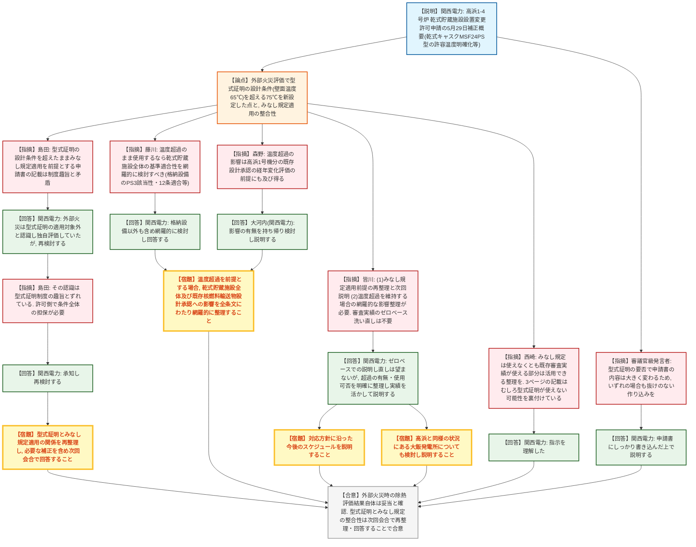

# 第1424回原子力発電所の新規制基準適合性に係る審査会合（令和8年7月30日）
> 出典 : https://youtube.com/live/qly6zGMmknI?si=pNR5weHkIChGbcPC

## 会合の概要
* **型式証明済み特定兼用キャスクの設計条件超過と「みなし規定」適用の矛盾が主論点に**
  関西電力から、高浜1〜4号炉の使用済燃料乾式貯蔵施設設置変更許可申請について、2026年5月29日付補正概要の説明があった。輸送・貯蔵兼用の型式証明（MSF24PS型）を受けた特定兼用キャスクについて、外部火災時の除熱評価で型式証明の設計条件（壁面温度65℃等）を超える75℃を新たに設定して評価している点が、原子炉等規制法上の「みなし規定」（型式証明済み設計をそのまま許可に取り込む制度）の適用前提と矛盾するのではないかと規制側（島田氏）から強く指摘された。
* **除熱評価の結果自体は妥当も、制度の理解にずれがあったことが判明**
  外部火災時にキャスク各部が許容温度以下となるとする評価結果自体は規制側もおおむね妥当と認めたが、関西電力側は当初「外部火災は型式証明の適用対象外なので独自に評価すればよい」との認識だった。規制側は、これは型式証明制度の趣旨（許可に取り込む際は条件全体を許可側で担保する必要がある）とずれていると再指摘し、関西電力は認識を改めて再検討する意向を示した。
* **温度条件超過を維持する場合、周辺設備・既存の設計承認まで含めた網羅的な影響評価が宿題に**
  藤川氏は、温度条件を超過したまま使用する方針を維持するのであれば、格納設備等の周辺設備を含め全条文にわたる網羅的な基準適合性評価が必要と指摘。森野氏も、既存の（高浜1号機分の）核燃料輸送物設計承認における経年変化評価の前提に影響し得ると指摘し、いずれも次回説明が求められた。
* **審査実績の合理的活用の道筋も示され、対応は前向きに整理される見通し**
  皆川氏は論点を2点に整理した上で、型式証明で得られた審査実績をゼロベースで洗い直す必要はなく、影響部分にフォーカスした合理的な審査は可能との考えを示した。西崎氏も同様の考えを補足。関西電力は高浜2期に加え、同様の状況にある大飯発電所についても検討・説明する方針を確認した。

---

## 議題ごとの詳細整理

### 【議題1】関西電力（株）高浜発電所1号炉、2号炉、3号炉及び4号炉の設置変更許可申請（使用済燃料乾式貯蔵施設の設置）に係る審査について

* **議論の背景と論点:**
  関西電力から、高浜1〜4号炉の使用済燃料乾式貯蔵施設の設置変更許可申請について、2026年5月29日付補正内容（外部火災時の乾式キャスク各構成部材及び使用済燃料の許容温度の明確化、斜面安定性評価におけるキャスク重量条件の明確化、消火水バックアップタンクの基数・設置場所の見直し（現行4基への見直し）、技術者数等データの更新、キャスクピット等の設備区分に関する他案件整理結果の水平展開、地震調査研究推進本部による海域活断層評価の反映等）の説明があった。主論点は、輸送・貯蔵兼用の型式証明（MSF24PS型）を受けた特定兼用キャスクについて、外部火災評価で型式証明上の設計条件（雰囲気温度45℃、壁面温度65℃）を超える75℃を新たに設定して評価している点が、原子炉等規制法上の「みなし規定」の適用前提と矛盾しないかという点。

* **質疑応答（詳細）:**
  * 【説明者側】相田（関西電力）
    高浜発電所の乾式貯蔵施設設置変更許可申請について、5月29日付の補正概要を説明する旨を挨拶した。
  * 【説明者側】長谷川（関西電力）
    高浜1・2号機背面道路北側での乾式貯蔵施設設置の経緯と、2026年5月29日補正の主な内容（許容温度の明確化、斜面安定性評価の条件明確化、消火水バックアップタンクの見直し、データ更新、設備区分の他案件整理結果の反映、海域活断層評価の反映）を説明した。
  * 【規制側】島田
    型式証明制度は、型式証明を受けた特定兼用キャスクの設計内容を許可側で変更できないことを前提とする制度であり、関西電力はこれまでみなし規定の適用を受ける前提で申請書を作成してきたと認識している。しかし今回の補正後も、外部火災評価で型式証明の壁面温度65℃の制限を超える75℃を新たに設定しており、これは型式証明の内容を逸脱・変更していることになるため、みなし規定適用の前提と明らかに矛盾していると指摘し、申請内容の整理を求めた。
  * 【説明者側】関西電力（担当者）
    型式証明の許容条件を超えていることは認識しているが、添付書類上、外部火災（竜巻以外の事象）は型式証明の適用対象外とされているため、その部分を独自に評価すれば申請可能と考えていたと説明した。指摘を受け、再検討する意向を示した。
  * 【規制側】島田
    その認識は、型式証明側が竜巻以外を「先取りして確認していない」というだけの説明にすぎず、許可に取り込む際は型式証明の設計条件全体を許可側で満足できるよう担保する必要がある、という型式証明制度の趣旨とずれていると再指摘し、申請内容の再検討を求めた。
  * 【説明者側】関西電力（担当者）
    承知した旨を回答し、再検討する意向を示した。
  * 【規制側】藤川
    温度条件（雰囲気温度45℃・壁面温度65℃）を超過したままキャスクを使用する方針を維持するのであれば、外部火災時の除熱評価以外の部分も含め、乾式貯蔵施設全体の基準適合性への影響を網羅的に検討・整理して説明する必要があると指摘した。例として、格納設備の壁面温度が65℃を超える場合、格納設備はPS3（安全施設）に該当するため、設置許可基準規則第12条等の要求事項への適合説明が必要になる点を挙げた。
  * 【説明者側】関西電力（担当者）
    格納設備に限らず他の設備についても網羅的に考えて回答すると回答した。
  * 【規制側】藤川
    キャスク自体の除熱機能への影響は限定的と考えているが、周辺施設である格納設備等も申請対象となっているため、温度超過に伴う影響を全条文にわたって改めて検討し、影響の有無を説明するよう重ねて求めた。
  * 【規制側】森野
    高浜2期では設置許可基準規則第3条特例が適用されており、型式証明の設計条件超過に伴う影響は、既に取得済みの高浜1号機分の設計承認における経年変化評価（貯蔵時・輸送時の温度比較を前提とする評価）にも及ぶ可能性があると指摘した。高浜2期で当該設計承認を継続使用する方針であれば、その適用性・妥当性についても説明するよう求めた。
  * 【説明者側】大河内（関西電力）
    設計承認側の経年変化評価（貯蔵時・輸送時の温度比較）について、今回の影響範囲に問題がないか含め持ち帰って検討・説明すると回答した。
  * 【規制側】皆川
    これまでの指摘を2点に整理。(1)外部火災評価自体は妥当と考えられるが、型式証明の設計条件を超えているためみなし規定適用の前提が崩れており、対応方針を次回以降説明すること。(2)温度条件超過のまま使用する方針を維持する場合、乾式貯蔵施設全体の基準適合性及び既存の核燃料輸送物設計承認への影響を網羅的に整理すること。なお、みなし規定を用いず型式証明の設計条件を変更して使用する道もあり、その場合も型式証明で得た審査実績をゼロベースで洗い直す必要はなく、影響部分にフォーカスした合理的な審査が可能との考えを示した。
  * 【説明者側】関西電力（担当者）
    全てをゼロベースで説明し直すことは望んでおらず、超過の有無や使用可否を明確に整理した上で、これまでの実績を活かした分かりやすい説明を行いたいと回答した。
  * 【規制側】皆川
    事業者の考えを了解した上で、次回会合では5月29日補正のさらなる補正の要否も含めた回答と、今後のスケジュールの説明を求めた。また高浜2期と同様の状況にある大飯発電所についても、本日の議論を踏まえた検討・説明を求めた。
  * 【説明者側】杉山（関西電力）
    大飯発電所も高浜と同様の状況であると理解しており、両者について同様の対応を進める旨を回答した。
  * 【規制側】西崎
    みなし規定は使えなくとも、これまでの審査実績が使える部分は活用できるという整理をすべきであり、これは型式証明に限らず通常の設置許可審査でも一般的に行われている進め方であると補足した。資料3ページの記載について、型式証明側が竜巻以外（外部火災を含む）を審査していないことは、逆に外部火災について型式証明を使える可能性を裏付けるものではなく、むしろ使えない可能性を裏付けているという論理関係を指摘し、型式証明についての認識共有と再整理を求めた。
  * 【説明者側】関西電力（担当者）
    指示の内容を理解した旨を回答した。
  * 【規制側】審議官級発言者
    型式証明を巡るこれまでの議論に付け加えることはないとした上で、型式証明を使うか使わないかで申請書の内容は大きく異なるため、いずれの場合も申請書の作り込みに抜けがないよう求めた。
  * 【説明者側】関西電力（担当者）
    申請書にしっかり書き込んだ上で説明する旨を回答した。

* **結論と宿題事項（アクションアイテム）:**
  * **決定事項:** 外部火災時の除熱評価結果（乾式キャスクの安全機能を担保する各部位が新たに設定した75℃の許容温度を満足するとする評価）自体は、概ね妥当なものと規制側に確認された。一方、型式証明の設計条件（壁面温度65℃等）を超過したままみなし規定の適用を前提とする現行の申請書の記載は制度趣旨と矛盾しており、申請内容を再整理した上で次回会合で対応方針を回答することとなった。
  * **宿題事項:**
    1. 型式証明とみなし規定適用の関係について申請内容を再整理し、必要に応じたさらなる補正の要否を含めて次回会合で回答すること。
    2. 温度条件超過のまま使用する方針を維持する場合、乾式貯蔵施設全体の基準適合性（設置許可基準規則第12条等）及び既存の核燃料輸送物設計承認（経年変化評価の前提）への影響を、全条文にわたり網羅的に検討・整理して説明すること。
    3. 上記いずれの対応方針を取るにせよ、今後想定するスケジュールを併せて説明すること。
    4. 高浜2期と同様の状況にある大飯発電所についても、本日の議論を踏まえて検討し、結果を説明すること。
    5. 申請書の作り込みに抜けがないよう対応すること。

---

## 論理構造の可視化（Mermaid）

### 【議題1】高浜1〜4号炉 使用済燃料乾式貯蔵施設設置変更許可申請の審査

