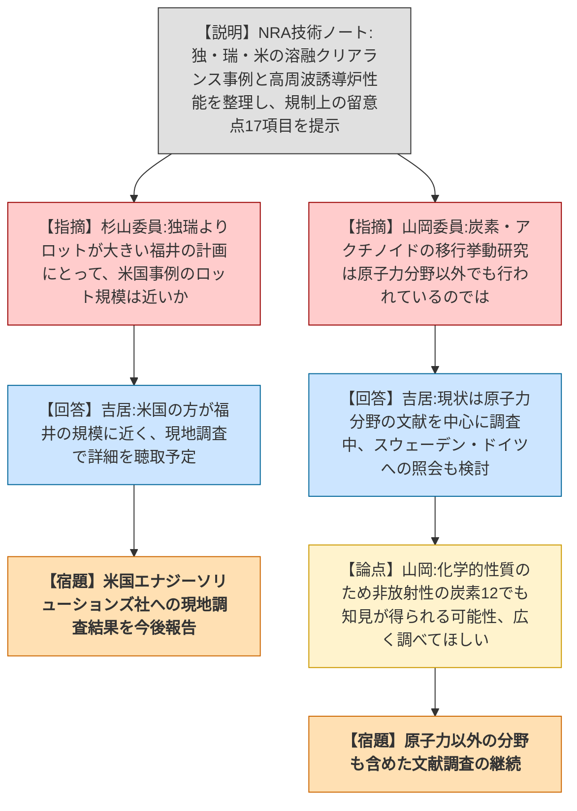
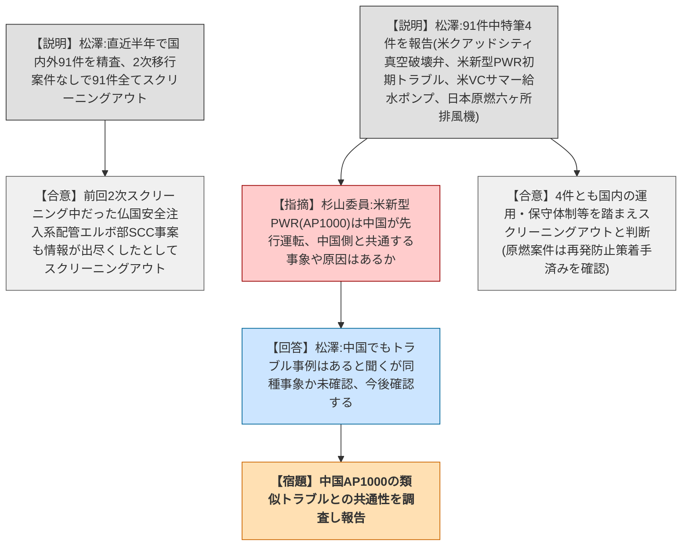
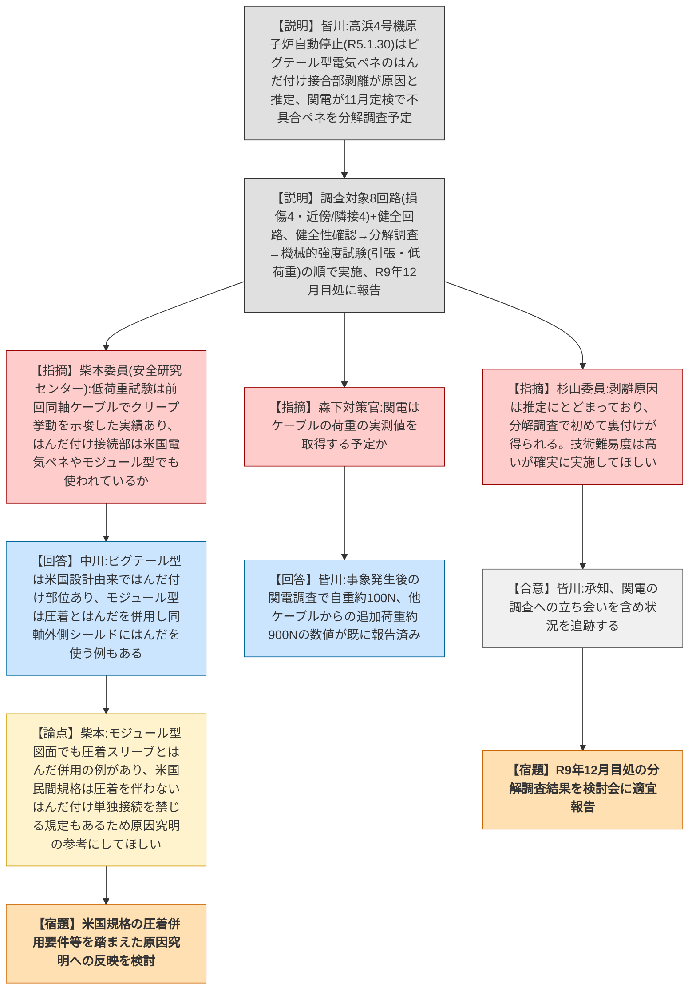
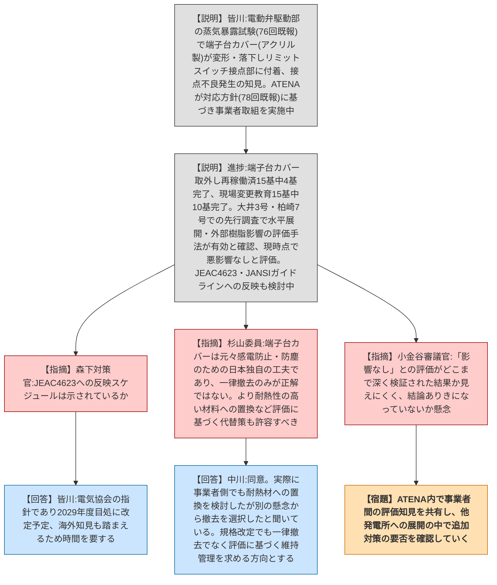

# 第81回技術情報検討会（令和8年7月30日）
> 出典 : https://youtube.com/live/bEVPntLYnv8?si=Tv4jGoRZsUHdEGIx

## 会合の概要

- NRA技術ノート「溶融クリアランスに関する技術的知見の整理－ドイツ、スウェーデン及び米国の事例調査並びに今後の検討課題－」が報告され、独・瑞・米の海外事例と高周波誘導炉の一般的性能を踏まえた規制上の留意点17項目が示された。福井県での溶融クリアランス集中処理事業を念頭に、ロットの規模や炭素・アクチノイドの移行挙動など、引き続き知見を積み上げる必要のある論点が委員から指摘された。
- 国内外の事故・トラブル情報スクリーニングでは、新規91件が全てスクリーニングアウトされ、継続審議中だった仏国安全注入系配管事案も情報が出尽くしたとして終了となった。米国の新型PWR(AP1000)の海外先行機との共通性など、追加調査を求める指摘があった。
- 高浜4号機の原子炉自動停止の原因とされる電気ペネトレーション(ピグテール型)のはんだ付け接合部剥離について、関西電力が本年11月の定期検査で不具合部を取り出し分解調査を実施する計画が説明され、原因究明に資すると評価された一方、委員からは米国民間規格の知見も踏まえた検証が望まれるとの指摘があった。
- 電動弁駆動部の端子台カバー変形・落下に関するアテナ・事業者の対応(カバー撤去、現場変更教育、水平展開調査)は着実に進捗していると評価された一方、杉山委員から「一律撤去」ではなく評価に基づく代替策(耐熱性の高い材料への置換等)も許容すべきとの指摘、小金谷審議官から「影響なし」評価の深度への懸念が示され、事業者間の知見共有の重要性が強調された。
- その他、要対応技術情報リスト(資料81-3-1)と検討会フォローアップ資料(参考資料81-1)が報告されたが、過去2回の議論を反映したもので新規内容はなかった。

## 議題ごとの詳細整理

### 【議題1】安全研究及び学術的な調査・研究から得られる最新知見(NRA技術ノート:溶融クリアランス)

**議論の背景と論点:**
炉規法61条の2第1項に基づく日本のクリアランス制度は発電所解体で20年程度の実績があるが、福井県で計画されている溶融クリアランス集中処理事業(解体金属を溶融施設で溶かしインゴット化した上で放射能濃度を測定)は国内初の取組となる。令和6年度第57回原子力規制委員会で了承された対応方針に基づき、技術基盤グループ放射線・廃棄物研究部門がドイツ・スウェーデンの制度(既報)に加え、米国エナジーソリューションズ社の事例と、原子力以外の一般鋳造業界で用いられる高周波誘導炉の性能に関する調査を新たに実施し、NRA技術ノートとして整理した。独・瑞は単一発生元の金属のみを溶融し、溶融前に受入基準への適合を確認する運用で共通する一方、米国はクリアランス制度自体がなく、複数発生元のスクラップを混合して溶融し用途・仕様に応じて放射性特性を調整する点が異なる。高周波誘導炉は炉容量・溶融対象・運転条件によって均一性等の性能が大きく変わり、一律の評価が難しいことが分かった。これらを踏まえ、規制側が留意すべき点として17項目が整理された。

**質疑応答（詳細）:**
- 杉山委員は、以前のドイツ・スウェーデンの報告時に、両国の溶融ロットの規模が福井県の計画より小さいためロット規模に依存する均一性等への継続的な注意を求めていた経緯を踏まえ、今回報告された米国事例のロットの大きさが福井県の計画とどの程度近いのかを質問した。吉居副主任技術研究調査官は、溶融容量の面では米国の方が福井県の計画に近い状況にあると考えられると回答し、米国はおそらく均一性を前提に保障評価を行っているとみられるが、企業ノウハウに関わる部分もあるため現地調査でどこまで聴取できるか分からないとしつつ、可能な限り情報を得たいと述べた。
- 山岡委員は、今後の課題として挙げられた炭素やアクチノイド等の移行挙動に関する研究は原子力分野に限らず様々な分野で行われている可能性があるとして、どのように調査を進める計画かを質問した。吉居副主任技術研究調査官は、現状は原子力関係で炭素14の移行等を調べた文献を数は多くないもののいくつか調査している段階であり、実績のあるスウェーデンやドイツへの照会も一つの手段として考えていると回答した。これに対し山岡委員は、移行挙動は基本的に化学的性質によるものであるため放射性同位体でなくても炭素12でも同様の挙動が見られるはずであり、原子力分野に限らず広く調べれば有用な研究が見つかるかもしれないとの意見を述べた。

**結論と宿題事項（アクションアイテム）:**
- 本件は報告・質疑にとどまり、特段の可否判断はなされていない。
- 米国エナジーソリューションズ社への現地調査を実施し、可能な範囲で溶融ロットの規模や均一性評価の考え方について聴取のうえ、結果を改めて報告することとした。
- 炭素・アクチノイド等の移行挙動に関する文献調査について、原子力分野以外の知見も含め継続することとした。

### 【議題2-1・2-2】国内外の原子力施設の事故・トラブル情報(スクリーニング状況・1次スクリーニング結果)

**議論の背景と論点:**
直近半年間に調査した国内外の事故・トラブル案件91件(国内23件、IAEA・NRC等海外情報70件程度)について、2次スクリーニングへ移行する案件がないか精査した結果が報告された。あわせて、前回まで2次スクリーニング対象としていたフランスの安全注入系配管エルボ部のSCC(応力腐食割れ)事案(国内の関西電力大飯3号機で発生したスプレー配管SCCとの類似性に注目し、IRSN等と情報交換を行いながら調査を継続していたもの)についても取扱いが報告された。

**質疑応答（詳細）:**
- 松澤原子力規制専門職は、新規91件全件について精査した結果2次へ移行する案件はなく、全てスクリーニングアウトとしたいと説明した。また、継続調査中であったフランスの配管エルボ部の事案についても、これ以上新たな情報は期待できない状況までは情報が得られたとして、ひとまずスクリーニングアウトとし、新情報が得られた場合は改めて報告するとした。
- 続けて松澤原子力規制専門職は、91件のうち特にピックアップした4件(米国クアッドシティ1号機の真空破壊弁機能喪失、米国新型PWR(AP1000)の試運転時トリップ事象、米国VCサマー1号機の非常用給水ポンプガバナー弁不具合、日本原燃六ヶ所再処理事業所の排風機故障)について詳細を説明した。クアッドシティ事案は国内では起動前の複数人確認運用が規定されているため発生しないと判断、VCサマー事案は国内PWRで補助給水ポンプの国産化工事が進み保守対応力が向上していることから安全性を確認、日本原燃事案は本年4月23日に原燃と面談し再発防止策への取組を確認済みであることから、それぞれスクリーニングアウトとした。
- 杉山委員は、米国新型PWR(AP1000)の事案について、同型機は米国が最初の号機であったものの、これに先んじて中国で運転を開始している号機があると記憶しているとして、中国側の運転実績との間に何か共通する事象や原因があるか把握しているかを質問した。松澤原子力規制専門職は、指摘のとおり同プラントはAP1000であり、米国に先んじて中国で運転しておりいくつかトラブルが起きたと聞いているが、今回の事案と同様の事象が発生していたかは調べていないため、改めて調査すると回答した。杉山委員は、事象そのものが同一かどうかに限らず、原因として考えられる点に共通性がないか興味があるとして調査を依頼した。

**結論と宿題事項（アクションアイテム）:**
- 新規91件は全てスクリーニングアウトとし、継続審議中であったフランスの配管エルボ部事案もスクリーニングアウトで終了とすることが了承された。新たな情報が得られた場合は改めて報告する。
- ピックアップされた4件はいずれも国内での運用・保守体制等を踏まえてスクリーニングアウトと判断された。
- 米国新型PWR(AP1000)について、中国の先行運転号機で発生したトラブルとの事象・原因の共通性を調査し、結果を改めて検討会に報告することとした。

### 【議題2-3】電気ペネトレーションの電線・ケーブルのはんだ付け接合部に関する調査（第3報）

**議論の背景と論点:**
本件は、令和5年1月30日に発生した関西電力高浜4号機の原子炉自動停止を契機とする。原因は、制御棒駆動装置回路の一部である原子炉格納容器電線貫通部(ピグテール型電気ペネトレーション)のケーブルに他ケーブルの荷重がかかり、内部接続部のはんだ付け接合部が剥離して接触不良が生じたことと推定されている。第60回検討会でははんだに関する情報調査結果を、第75回検討会では類似する他の電気ペネトレーションの調査状況を報告済みであり、関西電力が高浜4号機の不具合ペネの分解調査を計画しているとして継続報告する方針であった。今回、その分解調査計画の内容が聴取・報告された。調査対象は国内ではんだ付け接合部を有する電気ペネトレーション(単芯接続・同軸接続)のうち、不具合のあった単芯接続のピグテール型(使用年数41年)。損傷回路4回路・近傍/隣接回路4回路の計8回路を必須の分析対象とし、これに比較用の健全回路を加える。調査項目は健全性確認(外観、線抵抗、漏洩、導体抵抗)、分解調査(金具外観確認・分解・接着状態確認等)、機械的強度試験(引張試験、低荷重試験、ケーブルと樹脂の接着に関する引張試験)の3段階。分解に伴う損傷を避けるための手順(旋盤等での切断、ハンドグラインダーによる切断、樹脂除去、ロウ付け部の除去等)も具体化されている。最終報告は令和9年12月を目処とし、分解による回路取り出しが概ね終わる来年9月頃には状態確認・強度試験の一部結果も順次得られる見込み。

**質疑応答（詳細）:**
- 安全研究センターの柴本委員は、機械的強度試験に低荷重試験が含まれる点について、前回の同軸ケーブル試験結果でクリープ挙動の可能性が示された経緯があり、原因を幅広く考えて試験することは有意義だと評価した上で、はんだ付け接続部が米国の電気ペネトレーションや、逐次置き換えが進むモジュール型でも同様に使われているかを質問し、今回問題となった仕様が日本の旧型EPAに特有のものであれば原因究明に資する情報になると述べた。中川氏(基盤課)は、ピグテール型電気ペネトレーションはもともと米国設計を導入したものであるため米国でも同様のはんだ付け部位があると理解していると回答し、モジュール型についてもはんだ付けと圧着の両方の接続方法があり、メーカーの判断や施工性・作業環境等により使い分けられていること、同軸接続の外側シールド部分は圧着が難しくはんだ付けを用いる例があったと記憶している旨を説明した。柴本委員は、報告資料中のモジュール型の図でも圧着スリーブとはんだ付けが併用されている例が見られること、米国の民間規格では圧着による機械的結合を伴わないはんだ付け単独接続を禁じる規定もあるようだと補足し、今回の原因究明の参考にしてほしいと要望した。
- 森下対策官は、事象発生時に他ケーブルからケーブルにかかっていた荷重について、関西電力が実測値を取得する予定があるかを質問した。皆川原子力規制専門職は、事象発生後の関西電力の調査において、ケーブル自重による引張荷重が約100ニュートン、他ケーブルからの追加荷重が約900ニュートンという数値が既に規制委員会へ報告済みであると回答した。
- 杉山委員は、はんだ付け部剥離という原因は事象発生直後の推測に基づき対策が検討されてきたものであり、その推測が正しかったかどうかは今回の分解調査で初めて事実として確認されることになるため、覆される可能性は低いと考えられるものの、事実として押さえておくことは重要であると指摘した。分解プロセスは技術的難易度が高い面もあるが、関西電力にきちんと実施してもらい、基盤グループとして確実に追跡するよう求めた。皆川原子力規制専門職は承知した旨を回答した。

**結論と宿題事項（アクションアイテム）:**
- 説明された分解調査計画は、事業者が目的とする不具合の推定原因の確認・知見拡充に資する内容を含んでおり、原因究明に資すると評価された。
- 電気ペネトレーションの分解と損傷回路の取り出しは技術的難易度が高いため、状況に応じて調査方法を見直す可能性があることが確認された。
- 柴本委員が指摘した米国民間規格上のはんだ付け単独接続禁止規定等を、今後の原因究明の参考情報として活用することとした。
- 令和9年12月を目処とする分解調査結果について、調査への立ち会いを含め状況を聴取し、検討会に適宜報告することとした。

### 【議題2-4】実機材料を用いた安全研究から得られた電動弁駆動部の事故時環境下における動作不良の可能性に関する知見への事業者等の対応（第2報）

**議論の背景と論点:**
第76回検討会で報告された、規制庁実施の安全研究における電動弁駆動部の重大事故模擬蒸気暴露試験の結果、高温条件下で電動弁駆動部内の電気室にあるアクリル製の端子台カバーが変形・落下し、制御回路のリミットスイッチ接点部に付着して接点不良・動作不能となる知見が本件の出発点である。第78回検討会でATENA(原子力エネルギー協議会)の対応方針(端子台カバーの直接対策、水平展開的な付帯品確認、事故時環境悪化区画の樹脂落下影響確認、民間規格・ガイドラインへの知見反映の4項目)が報告済みであり、今回はその後の事業者取組状況の聴取結果が報告された。端子台カバーの取り外しは再稼働済15基中4基、現場変更に関する作業員教育は15基中10基で完了。水平展開に関する先行調査は大井3号・柏崎7号をパイロットプラントとし、事故時機能要求のある電気系・機械系の動的機器等を対象に、付帯品の有無・使用箇所・材料等を調査したうえで悪影響評価を行うフローの実効性を確認し、現時点でいずれも悪影響なしと評価された。外部樹脂落下の影響確認についても同様に評価フローの実効性を確認し、影響なしと評価された。また、前回検討会での議論を踏まえ、ATENAは民間規格であるJEAC4623の改定と、JANSI(原子力安全推進協会)が作成するEQ(対環境性能)管理ガイドラインの改定という2つの取組方針を新たに示した。

**質疑応答（詳細）:**
- 森下対策官は、JEAC4623への反映についてスケジュールが事業者側から示されているかを質問した。皆川原子力規制専門職は、JEAC4623は電気協会の指針であり改定スケジュールの都合や、本知見のみならず海外知見も踏まえた改定を目指すことから時間を要し、2029年度を目処に改定するとの説明を受けている旨を回答した。
- 杉山委員は、基盤グループの活動により本事象の発生可能性が判明し、事業者と共有した上で徹底した対応が取られていることを良い事例だと評価した一方、そもそも樹脂製の端子台カバーは米国にはない日本独自の工夫であり、作業員の感電防止や防塵の観点からは有効な配慮であったことを踏まえると、単純に「取り外すことが正解」という認識が広まるのは望ましくないと指摘した。短期的な対応として全て取り外すこと自体は妥当だが、現場の実情等を踏まえてより耐熱性の高い材料のカバーへ置き換えるという選択肢も十分あり得るとし、自主規格の改定にあたっては「取り付けてはいけない」という一律の規定ではなく、評価した上で問題のない状態を維持するという本来の趣旨に沿った規定としてほしいと要望した。中川氏(基盤課)は、指摘のとおりカバーを取り外すだけでなく耐熱性の高い頑丈なものに付け替えることも選択肢の一つであり、いずれの場合も安全機能に影響がないよう設計・据付・保守管理を行うことが必要と考えていると回答した。また、事業者側も今回の試験結果を踏まえて耐熱性の高い材料への置き換えを実際に検討したが、新たな別の懸念が生じる可能性も考慮し、そうした新たな部材を追加することは見送り取り外しを選択したと聞いていると説明し、今後の規格等の改善では「取り付けてはいけない」という規定ではなく、評価により機能への問題がないことを検証・維持することを求める方向になると考えていると述べた。
- 小金谷審議官は、事業者が今後モデルプラントでの評価を他の発電所に展開していくこと自体は徹底的に対応している印象を受けるとしつつ、報告資料で「いずれの設備についても影響がない」と評価された点について、一つ一つどこまで深く評価しているのかが資料からは見えにくく、結論ありきの評価になっていないか懸念があると指摘した。今後多数の発電所へ展開していく中で、対策が必要と判明する事例も出てくる可能性があるため、そうした知見をATENA内で発電所間で共有するよう図ってほしいと要望した。

**結論と宿題事項（アクションアイテム）:**
- ATENA・事業者の現時点の対応(端子台カバー取り外し・教育の進捗、水平展開及び外部樹脂影響評価フローの実効性確認、JEAC4623・JANSIガイドラインへの反映検討)は妥当と評価された。
- 杉山委員の指摘を踏まえ、今後の規格改定は端子台カバー等の付帯品の一律撤去を求めるものではなく、評価に基づき機能上の問題がないことを検証・維持することを求める方向とすることが基盤課側の認識として共有された。
- 小金谷審議官の指摘を踏まえ、ATENAにおいて発電所間での評価知見の共有を図ることとした。
- JEAC4623・JANSIガイドラインへの反映(2029年度目処)を含め、引き続き事業者等の取組状況を聴取し、検討会に適宜報告することとした。

### 【議題3】その他

**議論の背景と論点:**
資料81-3-1「規制対応する準備を進めている情報(要対応技術情報)リスト」及び参考資料81-1「技術情報検討会フォローアップ」について報告された。いずれも過去2回の検討会での議論内容を資料に反映したものであり、新規の内容は含まれていない。

**質疑応答（詳細）:**
特段の質疑はなかった。

**結論と宿題事項（アクションアイテム）:**
報告のみで完了し、特段の決定事項・宿題事項はない。

## 論理構造の可視化（Mermaid）

### 議題1:安全研究及び学術的な調査・研究から得られる最新知見(溶融クリアランス)

### 議題2-1・2-2:国内外の原子力施設の事故・トラブル情報(スクリーニング状況・1次スクリーニング結果)

### 議題2-3:電気ペネトレーションの電線・ケーブルのはんだ付け接合部に関する調査(第3報)

### 議題2-4:電動弁駆動部の事故時環境下における動作不良の可能性に関する知見への事業者等の対応(第2報)

