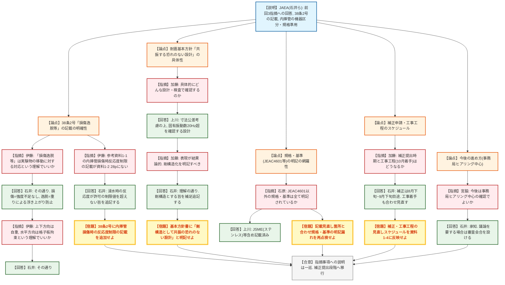
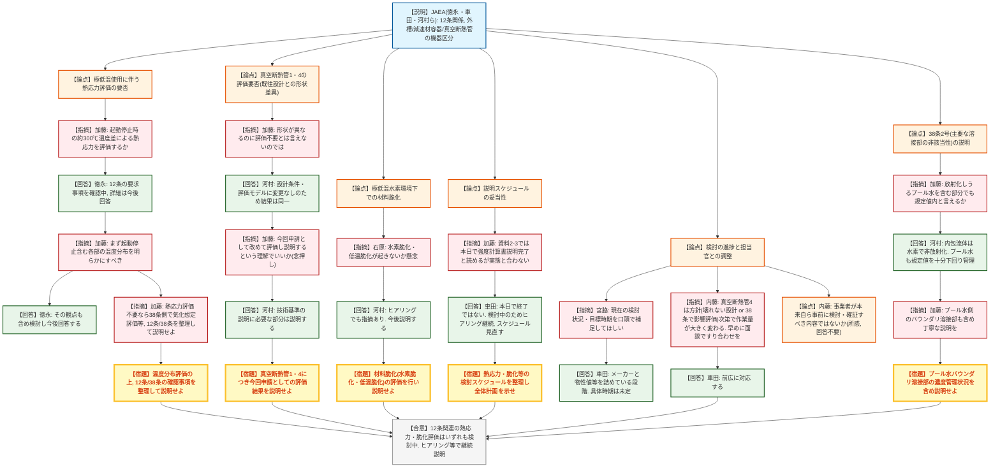

# 第590回核燃料施設等の新規制基準適合性に係る審査会合（令和8年7月31日）
> 出典 : https://youtube.com/live/xC9v2LJmrs4?si=dQBgSBiKXepm84JY

## 会合の概要
* **STACY施設(格子板・実験用装荷物の製作)は、前回指摘への回答が一巡し補正段階へ**
  日本原子力研究開発機構(JAEA)から、前回(5/22)審査会合でいただいた3点の指摘事項への回答が示され、技術基準規則38条(実験設備)の反応度異常投入防止に関する設計方針の追記や、内挿管の機器種別(第4種機器)・規格準用の明確化などが説明された。規制庁は概ね理解を示しつつ、内挿管損傷時の反応度制限に関する記載漏れなど細部の追記を求め、補正申請(8月下旬~9月下旬目途)に向けた段階に移行することを確認した。
* **STACY耐震基本方針は「共振する恐れのない設計」の具体化を要求**
  格子板・内挿管の耐震計算基本方針書について、規制庁(加藤)は「共振する恐れのない設計」という表現が結果論的であるとして、「剛構造として共振する恐れのない設計とする」旨、設計思想を明記するよう求め、事業者は記載修正に応じた。
* **JRR-3クライオスタット更新は、熱応力・材料脆化の評価がいずれも「検討中」で足踏み**
  冷中性子源装置(クライオスタット)更新に係る技術基準規則12条関連の説明が行われたが、極低温(20ケルビン)と常温の間で生じる約300℃の温度差による熱応力評価、および極低温水素環境下での水素脆化・低温脆化等の材料劣化評価について、事業者(JAEA)はいずれも検討中と回答するにとどまり、規制庁(加藤)から強い懸念と、12条・38条どちらで何を確認するのかを整理した説明を求める指摘が繰り返された。
* **規制庁管理官(内藤)から、事業者の主体的な検討プロセスの甘さを指摘する所感**
  技術的な質疑とは別に、内藤管理官から「規制側の問いかけに答える形で評価が進んでいるように見える」「形状・材料が変わる更新である以上、事業者自身が確証を得るための検討を本来事前に尽くしているべき」との踏み込んだ所感が述べられ、人材育成の観点も含め組織的な取り組みを促した。
* **両議題とも、今後は事務局ヒアリングでの確認を基本とする運用方針を確認**
  規制庁(宮脇)から、今後所要の確認事項は原則として事務局ヒアリングで対応し、議論を要する事項が生じた場合に限り改めて審査会合を開催するとの進め方が示され、JAEA側も了承した。

---

## 議題ごとの詳細整理

### 【議題1】国立研究開発法人日本原子力研究開発機構原子力科学研究所の原子炉施設(STACY(定常臨界実験装置)施設)の変更に係る設計及び工事の計画の認可申請(格子板及び実験用装荷物の製作)の審査について

* **議論の背景と論点:**
  本議題は、STACY施設の格子板及び実験用装荷物(内挿管)の製作に係る設工認(設計及び工事の計画の認可)申請について、前回(令和8年5月22日)審査会合でいただいた3点のコメント(①技術基準規則38条(実験設備)の設計方針・適合性説明の充実、②内挿管の機器種別・適用規格の明確化)への回答を中心に審査されたもの。あわせて、技術基準規則38条2号(反応度異常投入の防止)の記載明確化、格子板・内挿管の耐震計算基本方針(耐震クラス、固有振動数20Hz確保、共振対策)、適用規格・基準の明記方法、および今後の補正・審査スケジュールが論点となった。

* **質疑応答（詳細）:**
    * 【説明者側】石井(JAEA)
      前回審査会合(5/22)でいただいた3点の指摘事項への回答として、内挿管に挿入可能な核燃料物質・放射性物質はそれぞれの許可の範囲に限る旨と、使用目的・使用方法の遵守を申請書本文に追記すること、内挿管を第4種機器に区分し材料・構造の規格を準用して設計する旨を明記すること、および耐圧部の溶接部には該当しない整理であることを説明した。
    * 【規制側】伊藤(規制庁)
      技術基準規則38条2号(実験物の移動等により反応度が異常に投入されないこと)に対する設計方針として「損傷逸脱等により」との記載があるが、この「損傷逸脱等」は実験物の移動に対する対応を指すという理解でよいか確認した。
    * 【説明者側】石井(JAEA)
      その理解のとおりで、「損傷」は内挿管が必要な強度を有し状態変化がないこと、「逸脱」は内挿管が中空パイプで浮力により浮き上がる恐れがあるため重りを設置し浮き上がらない設計とすることを指すと回答した。
    * 【規制側】伊藤(規制庁)
      具体的な設計対応として、上下方向は内挿管の自重(重り)により浮き上がりを防止し、水平方向は格子板により拘束するという理解でよいか、重ねて確認した。
    * 【説明者側】石井(JAEA)
      その理解のとおりであると回答した。
    * 【規制側】伊藤(規制庁)
      参考資料1-1(原子炉設置(変更)許可申請書との整合性説明)の9~10ページには、内挿管が損傷した場合でも炉心への過度な反応度の転嫁を、浸水による反応度と可動装荷物による反応度転嫁量を合わせて制限する設計とする旨が記載されているが、資料1-2の28ページにはこの記載がない。これも38条2号の設計方針として記載すべきではないかと指摘した。
    * 【説明者側】石井(JAEA)
      内挿管が損傷し内部に浸水した場合でも、許可で約束した確定的規制限度を超えないことを、38条2号の記載に追加したいと回答した。
    * 【規制側】加藤(規制庁)
      耐震計算基本方針書(資料1-3、3ページ)の基本方針(3)で「Bクラスである格子板は共振する恐れのない設計とする」とされているが、具体的にどのような設計を行い、検査で何を確認するのか説明を求めた。
    * 【説明者側】上川(JAEA)
      材料力学の公式等を用い、寸法公差を考慮した上で固有振動数が20Hzを上回ることを確認する設計とすると回答した。
    * 【説明者側】石井(JAEA)
      補足として、使用前事業者検査で寸法公差の範囲内であることを確認することをもって、20Hz以上が確保されていることを担保する考え方であると説明した。
    * 【規制側】加藤(規制庁)
      説明内容は理解したが、「共振する恐れのない設計」という基本方針の表現は結果を追認するような書きぶりであり、「剛構造として共振する恐れのない設計とする」のように、剛構造化という設計思想を明記すべきではないかとコメントした。
    * 【説明者側】石井(JAEA)
      その理解で相違なく、剛構造とする旨を基本方針書に補足として追加すると回答した。
    * 【規制側】石原(規制庁)
      資料1-3(3ページ)に記載のJEAC4601以外に用いる規格・基準が、資料中に漏れなく明記されているか確認した。
    * 【説明者側】上川(JAEA)
      使用する規格はJEAC4601のほか、ステンレスについてはJSME、アルミニウムについては構造の技術基準の規格から引用しており、参考文献を含め記載済みであると回答した。
    * 【規制側】石原(規制庁)
      今後、当初申請から記載を見直す箇所(本日オレンジで示した箇所等)と合わせ、規格・基準の明記に漏れがないよう申請書全体を見直してほしいと要望した。
    * 【説明者側】上川(JAEA)
      承知した、再度チェックすると回答した。
    * 【規制側】加藤(規制庁)
      補足として、実用炉の申請書のように適合規格を一覧表で示す例もあるが、必須ではなく、該当箇所にきちんと明記されていれば足りるという趣旨であり、一覧表化するかは事業者判断でよいと説明した。
    * 【説明者側】石井(JAEA)
      実用炉の記載も参考に、記載の修正を検討したいと回答した。
    * 【規制側】加藤(規制庁)
      資料1-4(ヒアリング及び審査会合説明スケジュール)では本日をもって審査会合説明が終了する予定となっているが、本日示された当初申請からの変更点を踏まえた補正申請の時期と、申請書上の工事工程(10月着手)がどのように変わるか説明を求めた。
    * 【説明者側】石井(JAEA)
      補正の時期は早ければ8月下旬、遅くとも9月下旬までを予定している。申請書の工事工程(現行は10月着手)についても、補正のタイミングに合わせて見直す方針であると回答した。
    * 【規制側】加藤(規制庁)
      今の説明内容を含めて、資料1-4の全体スケジュールに反映した上で、今後のヒアリング等で共有してほしいと依頼した。
    * 【説明者側】石井(JAEA)
      承知した、補正を含めたスケジュールを資料1-4に反映し、今後のヒアリングで共有すると回答した。
    * 【規制側】宮脇(規制庁)
      これまでの議論を踏まえ、今後は補正で示される事項を中心に、所要の確認は原則として事務局ヒアリングで対応し、議論を要する事項が生じた場合には改めて審査会合の場を設けるという進め方でよいか、念のため確認した。
    * 【説明者側】石井(JAEA)
      今後の対応について承知した、補正の内容を示した上で、場合によっては審査会合で議論することも承知しており、必要な対応を行うと回答した。

* **結論と宿題事項（アクションアイテム）:**
  * **決定事項:** 前回審査会合でいただいた3点のコメントへの回答を含め、これまでの指摘事項に対する説明は本日をもって一巡した。技術基準規則38条2号の記載明確化、耐震基本方針書の表現修正(剛構造の明記)、規格明記の再点検についても対応方針が確認された。
  * **宿題事項:**
    1. 38条2号の設計方針として、内挿管の損傷により浸水した場合でも許可で約束した確定的規制限度を超えない旨を、申請書本文に追記すること。
    2. 耐震計算基本方針書の「共振する恐れのない設計」との記載を、「剛構造として共振する恐れのない設計とする」旨、設計思想を明確にする形で修正すること。
    3. JEAC4601以外に用いる規格・基準(JSME等)についても、記載見直し箇所と合わせて明記に漏れがないよう申請書全体を再点検すること。
    4. 補正申請を早ければ8月下旬、遅くとも9月下旬を目途に提出し、工事着手時期(現行申請書では10月)も補正タイミングに合わせて見直した上で、資料1-4のスケジュールに反映して共有すること。
    5. 今後の確認事項は原則として事務局ヒアリングで対応し、議論を要する事項が生じた場合に限り改めて審査会合を開催する運用とする。

---

### 【議題2】国立研究開発法人日本原子力研究開発機構原子力科学研究所の原子炉施設(JRR-3原子炉施設)の変更に係る設計及び工事の計画の認可申請(冷中性子源装置(クライオスタット)の更新)の審査について

* **議論の背景と論点:**
  本議題は、JRR-3原子炉施設の冷中性子源装置(クライオスタット)更新に係る設工認申請のうち、技術基準規則12条(材料及び構造)関連の説明を対象とした。液体水素を用いる極低温(約20ケルビン)機器特有の課題として、起動・停止時に生じる常温との約300℃の温度差による熱応力評価の要否、極低温水素環境下での材料脆化(水素脆化・低温脆化)、機器区分(外槽・減速材容器・真空断熱管1及び4等の第3種/第4種機器区分)の考え方、規格(米国機械学会規格ASMEの準用根拠)の適用、耐圧部溶接部の該当性、および技術基準規則38条2号(主要な溶接部の非該当性、放射性物質濃度)の説明の妥当性が論点となった。

* **質疑応答（詳細）:**
    * 【説明者側】徳永(JAEA)
      資料2-2に基づき、コメントリスト(資料2-1)のM3-1・M3-2への回答として、外槽を第4種機器とする整理、および減速材容器を第4種機器相当として設計する方針を説明した。あわせて、真空断熱管1・4は減速材容器破損時の最終的な水素圧力バウンダリを形成するため第3種機器として、外槽は真空断熱管内部に位置し原子炉プール水と接せず内包流体の放射能も極めて低いため第4種機器として設計する旨を説明した。
    * 【規制側】加藤(規制庁)
      クライオスタットは液体水素により約20ケルビンの極低温で使用され、起動・停止のたびに常温との間で約300℃の温度差が生じるため熱応力が懸念されるとし、特に液体水素にさらされる外槽・減速材容器について、熱応力評価を実施するのか確認した。
    * 【説明者側】徳永(JAEA)
      技術基準規則12条第1項への適合に必要な要求事項を現在改めて確認しているところであり、詳細な回答は今後検討して回答すると述べた。
    * 【規制側】加藤(規制庁)
      検討中ということであれば、まず起動・停止を含む運転状態におけるクライオスタット各部の温度分布を明らかにし、熱応力評価が必要かどうかを判断すべきであるとの観点を提示した。
    * 【説明者側】徳永(JAEA)
      その観点を含めて評価を検討し、今後回答すると述べた。
    * 【規制側】加藤(規制庁)
      仮に熱応力に対する健全性確認が不要という設計思想であるならば、外槽や減速材容器が熱応力で破損する可能性を想定した上で、技術基準規則38条(実験設備)側で液体水素の急激な気化等を想定した評価を行うなど、12条・38条それぞれで何を確認するのかを整理して説明すべきと指摘した。あわせて、真空断熱管1・4について今回の申請では既往の設工認と形状が異なる点があるため、単に「評価は不要、既往に含まれる」とは言えないのではと指摘した。
    * 【説明者側】徳永(JAEA)
      技術基準にのっとってどのような評価を行うか検討中であり、今後説明すると回答した。
    * 【規制側】加藤(規制庁)
      申請書や事前ヒアリングでは、設計条件が既往の設工認と変わらないため評価不要と読める資料もあったが、そうではなく今回の申請として改めて評価した内容を説明するという理解でよいか確認した。
    * 【説明者側】河村(JAEA)
      「評価不要」ではなく、設計条件・形状・評価モデル自体に変更がないため、評価結果としては同一になるという説明であると回答した。
    * 【規制側】加藤(規制庁)
      今回の申請として評価を行い、それを技術基準への適合性として説明するという理解でよいか、念を押して確認した。
    * 【説明者側】河村(JAEA)
      技術基準の説明にあたり必要な部分については説明すると回答した。
    * 【規制側】石原(規制庁)
      クライオスタットは20ケルビンという極低温で使用され、液体水素・水素ガスを内包する機器であるため、極低温水素環境下での材料脆化が起こらないか懸念しているとして確認を求めた。
    * 【説明者側】河村(JAEA)
      ヒアリングでも同様のコメントを受けており、今後説明していくと回答した。
    * 【規制側】加藤(規制庁)
      資料2-3(説明スケジュール)では、本日、12条関連の添付書類1(強度計算書)を説明する予定になっているが、実際の説明は先ほどの程度にとどまっており、この資料を見る限り以降は説明されないようにも読める、どのように考えているか説明を求めた。
    * 【説明者側】車田(JAEA)
      資料の作りが悪く申し訳ないとした上で、本日で説明が終わるものではなく、強度評価については検討中であるため、今後も引き続きヒアリング等で説明を継続する。スケジュールについては見直したものをヒアリング等で示すと回答した。
    * 【規制側】加藤(規制庁)
      熱応力や水素脆化・低温脆化等、内容的に重い検討事項について、どのような手順で検討を進めていくのかをスケジュールに明確に盛り込み、計画的に進めてほしい。前回審査会合では技術基準規則6条関連の議論もあり、12条の強度等を含めた全体計画を整理した上で、その計画どおりに説明してほしいと要望した。
    * 【説明者側】車田(JAEA)
      内容を承知したと回答した。
    * 【規制側】宮脇(規制庁)
      本日用意された資料以外に、熱応力や脆化等について現在検討している内容や今後の見通しについて、口頭で補足があれば説明してほしいと求めた。
    * 【説明者側】車田(JAEA)
      現在の状況として、耐震評価に移る前に強度評価を先に説明するとのコメントを踏まえ、詳細な評価を行っているメーカーと物性値等を詰めている段階であると回答した。
    * 【規制側】宮脇(規制庁)
      スケジュール的にいつ頃を目標としているか確認した。
    * 【説明者側】車田(JAEA)
      最短でできるよう急いでいるが契約等もあり、現時点で具体的な時期は示せない状況であると回答した。
    * 【規制側】宮脇(規制庁)
      規制庁側も他の案件を抱えており段取りの調整が必要なため、今後の予定はなるべく前広に相談してほしいと依頼した。
    * 【説明者側】車田(JAEA)
      承知した、進捗については言える部分を都度ヒアリング等で説明すると回答した。
    * 【規制側】内藤(規制庁管理官)
      本件は12条(強度)、影響としては38条に関係する内容であり、特に真空断熱管4については規格上、熱応力評価が要求されていない状況にあると認識しているが、破損した場合に外部へ影響があるかを38条側で確認するか、規格上要求がなくても壊れない設計であることを説明し切るかという二つの方針があり、どちらを取るかで作業量やスケジュール感が大きく変わるため、メーカーとの協議で作業方針が固まった段階で、面談等でもよいので担当官と早めにすり合わせてほしいと要望した。
    * 【説明者側】車田(JAEA)
      内容を承知した、前広に対応させていただくと回答した。
    * 【規制側】内藤(規制庁管理官)
      技術的なコメントではないと前置きした上で、今回の更新審査では規制側が問いかけたことに答える形で評価が進んでいるような印象を受けると述べた。形状も材料も変わる更新である以上、規制側が聞くか聞かないかに関わらず、事業者自身が「これでいける」という確証を得るための検討(モックアップ試験等を含む)を本来事前に尽くしているべきではないかとし、今回問いかけている内容は規制が細かいことを聞いているのではなく通常の準備の範囲であるとの所感を述べた。あわせて、こうした取り組みは審査を通すためというより現場の若手人材育成の観点からも組織全体の技術力向上につながる重要な取り組みであり、特に反論や回答は不要として、自らのためにしっかり取り組んでほしいと述べた。
    * 【規制側】加藤(規制庁)
      資料2-2(2ページ)で技術基準規則38条2号の「主要な溶接部に該当しない」との説明のうち、項番5(内包する放射性物質の濃度が規定値を超えないため非該当)について、JRR-3は放射化している可能性のある原子炉プール水を含む部分もあるはずだが、その場合でも規定値を超えないという説明になっているか確認した。
    * 【説明者側】河村(JAEA)
      内包流体として想定しているのは水素であり放射化するガスではない。原子炉プール水についても、JRR-3(オープンプール型)で規定値を設けており、それを十分下回る水準で放射性物質濃度を管理していると回答した。
    * 【規制側】加藤(規制庁)
      水素側の説明は理解したが、懸念していたのはプール水(漏水)側で、低い値で管理しているのであれば、その管理値や、水素・プール水のバウンダリとなる溶接部についても、丁寧に説明してほしいと今後の対応を依頼した。
    * 【説明者側】河村(JAEA)
      承知した、資料を準備して説明すると回答した。

* **結論と宿題事項（アクションアイテム）:**
  * **決定事項:** 本日は技術基準規則12条(材料及び構造)関連の設計方針の説明にとどまり、規制庁が最も重視する熱応力評価および水素脆化・低温脆化等の材料劣化評価は、いずれも「検討中」で具体的な適合性説明には至らなかった。資料2-3のスケジュール上は本日で12条関連の説明が完了するように読める作りとなっていたが、実際には検討状況を踏まえ継続することが確認された。
  * **宿題事項:**
    1. 起動・停止を含む運転状態におけるクライオスタット各部(外槽、減速材容器、真空断熱管1・4等)の温度分布を明らかにし、熱応力評価の要否を整理した上で、12条(強度)と38条(実験設備、水素の急激な気化等)のいずれでどの観点を確認するのかを整理して説明すること。
    2. 真空断熱管1・4について、既往の設工認と形状が異なる点を踏まえ、「評価不要」とせず、今回の申請としての評価結果を説明すること。
    3. 極低温水素環境下での材料脆化(水素脆化・低温脆化)について評価を行い、説明すること。
    4. 技術基準規則38条2号(主要な溶接部の非該当性)の説明のうち、原子炉プール水(放射化した漏水)がバウンダリとなる溶接部についても、濃度管理の状況を含め丁寧に説明すること。
    5. 熱応力・材料脆化等の検討の進め方及びスケジュールを整理し、担当官と前広にすり合わせながら計画的に進めること。全体計画(6条関連含む)を整理した上で示すこと。

---

## 論理構造の可視化（Mermaid）

### 【議題1】STACY施設(格子板及び内挿管)の設工認審査

### 【議題2】JRR-3クライオスタット更新(12条関係)の審査

