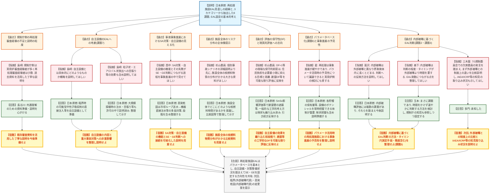

# 第17回緊急時活動レベルの見直し等への対応に係る会合（再処理施設）（令和8年7月31日）
> 出典 : https://youtube.com/live/4n6Se5Kh_AQ?si=COdyPlUZABZHG4iU

## 会合の概要
* **再処理施設のEAL（緊急時活動レベル）見直しの第1回会合として、日本原燃が「基本的な考え方」を提示**
  令和8年7月1日の第18回原子力規制委員会での了承を受け、本会合がキックオフとなった。日本原燃は、実用炉との比較・事故事象進展の整理・EALの中長期課題という3つのカテゴリーから再処理施設特有の考慮事項を検討し、あわせて8つの個別課題（線量率差、被曝形態、内部被曝の測定、評価の保守性、蒸発乾固時のルテニウム放出、パラメータベース化、自主設備の考慮、深刻度の整合）を整理した。
* **審査会合ではない「協力ベースの検討の場」であることを事務局が冒頭で明確化**
  規制庁・緊急事案対策室（三木屋氏）は、本会合が事業者の協力を得ながらEAL改正案を議論する場であり、進行中の設置変更許可審査の内容も適切に反映しながら効率的に進めたい旨を述べた。
* **規制側の「再処理審査経験の薄さ」への懸念と、丁寧な説明を求める声が相次いだ**
  規制庁側の出席者は実用炉審査の経験者が多く再処理施設の審査経験者が少ないとの指摘（島崎氏）や、杉山委員からの「詳細な個別説明より先に、施設全体でどこにどれだけ核燃料物質があるかという全体像を示してほしい」という要望など、今後の説明の粒度・進め方に関する注文が多く出された。
* **内部被曝の評価・判断の難しさが最大の論点として繰り返し提起された**
  再処理施設は臨界事故を除き内部被曝が支配的であり、外部被曝と異なり測定・判断に時間を要する。蔦沢氏・森下氏・三木屋氏から、内部被曝に基づくEAL判断のタイミング・方法論について次回以降丁寧に説明するよう求められた。
* **「住民に不必要な対応を取らせない」という現実的評価への志向が共有された**
  杉山委員から、現行評価がDF（除染係数）=1などの極端に保守的な前提を置いていることへの問題提起があり、工学的に説明可能な範囲で現実的な評価を積み上げるべきとの意見が出された。日本原燃側もこれに同意し、閉会挨拶でも「住民に不必要な対応を取らせない現実ベースの検討」を今後の作業方針として確認した。

---

## 議題ごとの詳細整理

### 【議題】再処理施設に係るEALの見直し

* **議論の背景と論点:**
  最終施設（＝再処理施設）の現行EALは2017年10月の防災業務計画修正時に新規制定されたが、2019年1月の総合防災訓練で、蒸発乾固事象について全ての貯蔵に一律の貯蔵温度120℃基準で全面緊急事態（GE）を判断する現行基準の妥当性に疑義が呈され、見直しの必要性が指摘された。2020年9月の第7回EL会合で中長期課題として取り上げられて以降、審査の進捗を待ってこの度キックオフに至った。論点は、①実用炉と再処理施設の特性差（放射性物質の分布、常温常圧未臨界という運転状態、事象進展の緩やかさ、内部被曝優位の被曝形態、PAZなしUPZ5kmのみという防災重点区域）をEAL設定にどう反映するか、②事故・機器種類・対策整備によって敷地境界線量率に大きな差（例：蒸発乾固で建屋間に5桁、対策失敗の有無で7桁の差）が生じる中でどう判断基準を設定するか、③内部被曝の評価手法・測定精度・判断タイミングをどう確立するか、の3点に集約される。

* **質疑応答（詳細）:**
    * 【説明者側】多門・立花（日本原燃）
      資料1・2に基づき、見直しの経緯（2020年の中長期課題化、2019年総合防災訓練での問題提起）と、実用炉比較・事故事象進展整理・中長期課題の3カテゴリーから抽出した考慮事項、それを踏まえた再処理施設EAL設定の基本的な考え方（パラメータベースでの設定、自主設備を考慮した対策整備からの設定、深刻度・タイミングの整合、放出兆候を捉えたGE設定など）を説明した。次回以降、設定プロセスの詳細と臨界・蒸発乾固を代表例としたEAL変更案を示す予定であるとした。
    * 【規制側】島崎（核燃料施設審査部門）
      規制側メンバーは実用炉審査の経験者が多く、再処理施設審査の経験者は少数である。事故の種類・対象機器・対策の整備状況によって実用炉と再処理施設の対応がかなり異なることが本日の説明でも示されたため、これまでの審査資料を活用し、再処理審査に不慣れな規制庁側にも理解が進むよう丁寧な説明を今後求めたい。
    * 【説明者側】長谷川（日本原燃）
      指摘を受け止めた。議論の前提となる共通理解・共通情報が必要であるため、そのための資料準備や説明を心がける。
    * 【規制側】島崎
      課題7の「自主設備」について、詳細は次回以降として、本日は概略の説明を求めたい。
    * 【説明者側】（日本原燃）
      許認可上、自主設備についてはまだ詳しい説明をしていない状況である。許可申請の添付書類では、自主設備が重大事故対策に悪影響を及ぼさないことを一部説明している。例えば臨界では、自動で中性子吸収剤を投入する設備が重大事故対策設備であるのに対し、施設外から中性子吸収剤を可搬で持ち込み直接注入することを自主設備として準備している。
    * 【規制側】島崎
      放出される放射性物質の形態には粒子状・エアロゾル状のものもあり、建物の開口部・隙間の目張りなども効果のある対策になり得るため、そうした点も含めて今後の説明を求めたい。
    * 【説明者側】（日本原燃）
      承知した。重大事故対処にとどまらず、大規模損壊も含めて建屋内への注水や、放射性物質を外部に出さないための目張りなども許可の中で説明しており、それらも整理して説明できるようにする。
    * 【規制側】西中（緊急事案対策室）
      資料2の11～14ページの事故事象進展の記述の中に、島崎の指摘にあったSA対策・機器（自主設備を含む）がどのように機能し、その失敗がどのようにSE・GE判断につながるのかを具体的に見える形で示してほしい。そうすれば理解が早く進む。
    * 【説明者側】（日本原燃）
      承知した。例えば蒸発乾固では対策が多段（冷却ループへの送水が失敗したら機器への直接注水に移行するなど）になっているため、そうした段階を含めて対策を整理して説明する。
    * 【規制側】蔦沢
      再処理施設は内部被曝の考慮が重要である旨が資料に示されているが、これまで実用炉中心に検討してきた中では外部被曝が中心だった。外部被曝は距離を取れば影響を抑えられるのに対し、内部被曝は一度摂取すると体内に長くとどまり排出に時間を要するなど影響の性質が異なる。そうした点を踏まえ、EALをどのような形で発すればよいか、今後説明してほしい。
    * 【説明者側】（日本原燃）
      内部被曝の評価方法には複数の課題があると認識している。それらを踏まえて今後説明していく。
    * 【規制委員会委員】杉山
      自身は主に実用炉を担当しており、再処理施設の全体像を十分把握しているわけではない。島崎の「丁寧な説明」の要望に関連して、次回以降、個別の事故シナリオを詳細に説明しすぎるとかえって分かりにくくなる。資料2・3ページの実用炉比較表にある設備概要のポンチ絵を、小さな表の中に押し込めるのではなく、施設全体でどこにどのような核燃料物質のリスクが分布しているかが分かる大きな資料として、常に参照できる形で用意してほしい（既存審査資料からのピックアップでよい）。また、現状の評価はDF（除染係数）=1のような極端に保守的な前提に基づいており、住民に不必要な対応を取らせず負担を必要最小限に抑えるという目指す姿とは乖離がある。自主設備等の効果を織り込む前に、建屋の基本的なDFなど工学的に見込める部分をできる限り評価に反映してほしい。
    * 【説明者側】（日本原燃）
      施設全体でどこにどのような核燃料物質があるかを押さえるだけでも再処理施設のポテンシャルが分かるという観点を意識し、実用炉比較図なども活用しながら整理して示す。DFについても、例えば安全上重要な施設の5mSv影響評価の判定において建屋の壁による遮蔽等、一般的な工学的考え方は現状でも織り込んでおり、そうした点も踏まえて整理していく。
    * 【規制側】星
      実用炉側では現在パラメータを活用したEL見直しを進めている。再処理施設は実用炉に比べ事象進展が緩やかであるため、パラメータを活用した際の事象進展の予見性がどの程度あるかを再処理側で議論できれば、実用炉側のパラメータ活用の検討にも波及し得る。この観点について説明してほしい。
    * 【説明者側】（日本原燃）
      重大事故対策設備を整備するだけでなく、各貯槽にどの程度の量が入っているかなど設備のポテンシャルを常に認識できることが重要であり、それによって沸騰に至るまでの時間等を把握しながら対応できる。運転員等が日頃からプラント情報を把握できるよう努めており、現状の施設状態の把握も織り交ぜながら説明できるよう準備する。
    * 【規制側】森下
      再処理施設で内部被曝が重視される点に関連し、内部被曝は判断の程度・タイミングが外部被曝と異なり、より時間を要するケースがある。それがEAL発動に直結するのであれば、この点をしっかり整理してほしい。
    * 【説明者側】玉本（日本原燃）
      まさにご指摘の点が課題であると認識している。内部被曝に着目した段階でいかに時間をかけずに速やかに判断できるかを今後検討し、必要に応じて規制庁の知見も参照しながら設定していきたい。
    * 【規制側】三木屋（緊急事案対策室）
      森下・蔦沢からの内部被曝に関する指摘に関連し、7月1日の原子力規制委員会において、欠席の委員から、実用炉側でこれまで検討されてきた外部被曝と比較して内部被曝の影響評価が制度上どう異なるのかという前提を先に確認すべきとの発言があった。次回はまず外部被曝との比較について説明を受けたうえで本検討会で議論を深めたい。また、IAEA・ICRP等の専門的知見の取り込み状況についても、あわせて次回説明してほしい。
    * 【説明者側】多門（日本原燃）
      承知した。

* **結論と宿題事項（アクションアイテム）:**
  * **決定事項:** 再処理施設EALの見直しは、実用炉比較・事故事象進展整理・EAL中長期課題の3カテゴリーから抽出した考慮事項に基づき、パラメータベースを基本としつつ自主設備・対策整備状況を踏まえてSE・GEを設定する方向性で概ね共有された。次回会合で設定プロセスの詳細と、臨界（外部被曝代表）・蒸発乾固（内部被曝代表）を例としたEAL変更案が提示される。
  * **宿題事項:**
    1. 再処理審査経験の薄い規制庁側にも理解が進むよう、既存審査資料を活用した丁寧な説明を準備すること。
    2. 自主設備（可搬型中性子吸収剤の直接注入、目張り、建屋内注水等）の内容と、重大事故対策への非悪影響について整理し、次回以降説明すること。
    3. 事故事象進展の説明において、SA対策・自主設備の機能とその失敗がSE・GE判断にどうつながるかを可視化し、多段の対策（例：蒸発乾固における冷却ループ送水→機器直接注水）が分かる形で示すこと。
    4. 施設全体で核燃料物質の種類・量・分布が把握できる大きな比較資料（実用炉との対比図含む）を用意すること。
    5. DF（除染係数）等について、自主設備の効果を織り込む前段階として、建屋構造等の一般的な工学的考え方をできる限り評価に反映し、住民に不必要な対応を取らせない現実的な評価を目指すこと。
    6. パラメータ活用時の再処理施設における事象進展の予見性について整理し、説明すること（実用炉側のパラメータ活用検討にも資する）。
    7. 内部被曝に基づくEAL判断の方法・タイミング（測定手段・精度を含む）を整理すること（課題3）。次回はまず外部被曝との制度上の違いを整理したうえで議論を深めること。IAEA・ICRP等の専門的知見の取り込み状況も併せて説明すること。

---

## 論理構造の可視化（Mermaid）

### 【議題】再処理施設に係るEALの見直し（キックオフ会合）

