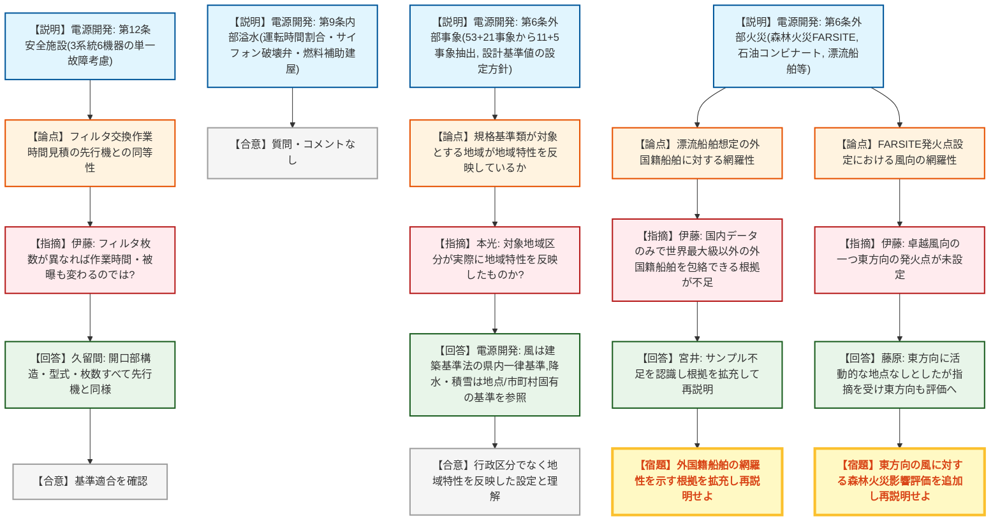
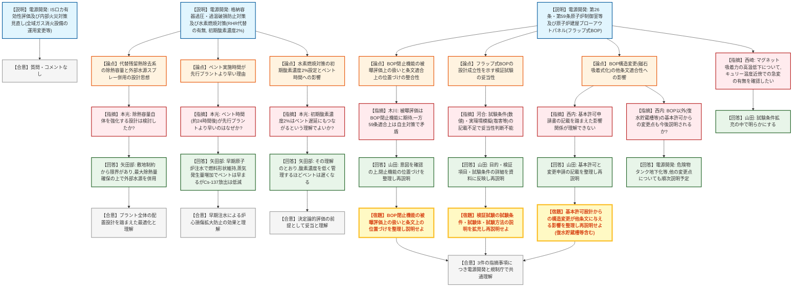
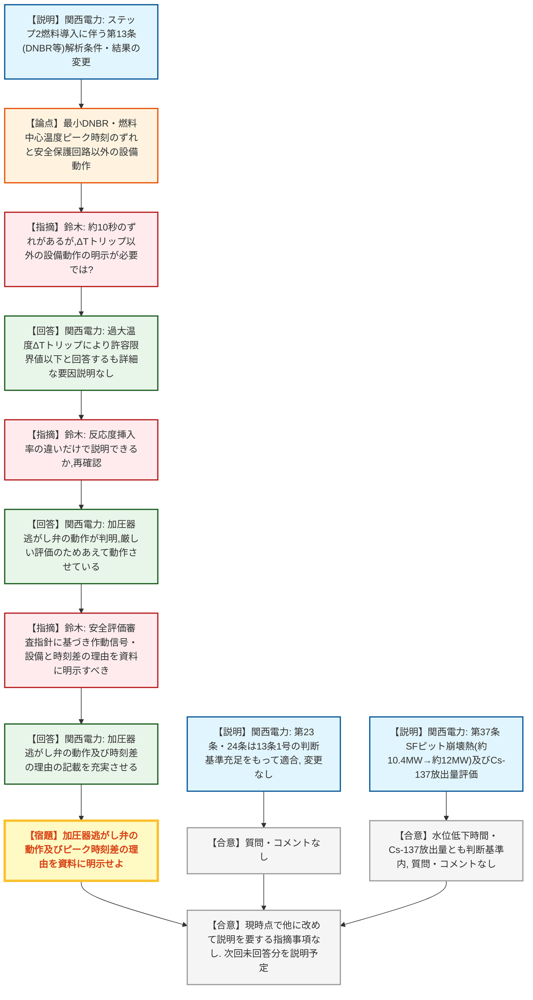

# 第1426回原子力発電所の新規制基準適合性に係る審査会合（令和8年8月18日）
> 出典 : https://youtube.com/live/_FxKYPpTM44?si=TtiilmvrXwC73lYC

## 会合の概要
* **大間原発の外部火災評価で2件の指摘、漂流船舶の想定根拠と森林火災の風向設定に不足**
  電源開発は、外部火災影響評価において国内タンカーデータから漂流船舶を保守的に設定していると説明したが、規制庁は「外国籍船舶を包絡している根拠が不足している」と指摘。また森林火災のFARSITE解析でも、卓越風向の一つである東方向の発火点を評価から除外していたことについて妥当性の説明を求められ、いずれも再説明が宿題となった。
* **原子炉建屋ブローアウトパネル（磁石吸着式・フラップ式BOP）の位置づけを巡り3件の指摘**
  大間で新規採用する磁石吸着式BOPについて、規制庁は「被曝評価ではBOPの閉止機能に期待した設定をしている一方、条文適合上は自主対策と位置づけており矛盾がある」「検証試験の試験条件・試験体の説明が不十分」「基本許可設計からの構造変更が新規制基準の他条文に与える影響の説明が不足」という3点を指摘し、いずれも次回以降の再説明を求めた。
* **格納容器過圧・過温破損対策および水素燃焼対策は規制庁の理解を得て進捗**
  代替残留熱除去系の除熱容量とプラント配置設計の関係、ベントタイミングが先行プラントより早まる理由（大間の早期原子炉注水方針による炉心損傷進展の抑制）、水素燃焼対策における初期酸素濃度2%の設定理由について、規制庁（本光）はいずれも技術的に妥当と理解を示し、宿題事項は生じなかった。
* **高浜3・4号炉の高燃焼度燃料（ステップ2燃料）導入、DNBR評価条件の見直しはおおむね確認**
  関西電力は設置許可基準規則第13条について、改良統計的熱設計手法の採用等により最も厳しい事象が停止ループ誤起動から全出力運転中の制御棒異常引抜きに変わったことなどを説明し、規制庁（鈴木）は最小DNBRと燃料中心温度のピーク発生時刻がずれる要因（加圧器逃がし弁の動作）の説明不足を指摘、資料の記載充実を宿題とした。
* **第37条（重大事故等拡大防止）はSFピット崩壊熱・セシウム137放出量とも判断基準内で確認完了**
  ステップ2燃料導入に伴いSFピット崩壊熱は既許可の約10.4MWから約12MWへ増加するが注水準備時間に対し十分な余裕があること、セシウム137総放出量も判断基準100テラベクレルを十分下回ることが示され、質疑なく確認された。

---

## 議題ごとの詳細整理

### 【議題1】電源開発（株）大間原子力発電所の設計基準への適合性及び重大事故等対策について

* **議論の背景と論点:**
  設計基準対象施設としての第12条（安全施設）、第9条（内部溢水）、第6条（外部事象の考慮・外部火災）、および重大事故等対策としてのインターフェースシステムLOCA（ISロカ）、内部火災対策の見直し、格納容器過圧・過温破損防止及び水素燃焼対策、第26条・第59条（原子炉制御室等）、原子炉建屋ブローアウトパネル（BOP）が審議された。建設中プラントである大間固有の設計（サイフォン破壊弁、危険物タンクの地下化、磁石吸着式BOP等）の妥当性、および外部事象評価における想定条件の保守性・網羅性が主な論点となった。

* **質疑応答（詳細）:**

  **＜第12条 安全施設＞**
  * 【説明者側】久保田（電源開発）
    静的機器の単一故障を考慮すべき機器として、非常用ガス処理系配管・フィルタ装置、中央制御室換気空調系ダクト・再循環フィルタ装置、原子炉格納容器スプレー冷却系スプレーヘッダーの3系統6機器を抽出し、修復性評価または安全解析への影響評価によりいずれも基準適合を確認したと説明した。
  * 【規制側】伊藤（規制庁）
    中央制御室換気空調系のフィルタ交換作業時間を先行プラントの実績に基づき見積もっているが、フィルタ枚数が異なれば作業時間・被曝線量も変わるはずであり、大間で使用するフィルタ装置が先行機と枚数・構造まで同一と確認した上での評価かを確認した。
  * 【説明者側】久留間（電源開発）
    開口部構造、フィルタ型式、フィルタ枚数など作業性に関わる観点はすべて先行機と同様であることを確認済みと回答し、伊藤は理解を示した。

  **＜第9条 内部溢水＞**
  * 【説明者側】長濱（電源開発）
    運転実績がないための保守的な運転時間割合の設定、タービン補機冷却海水系の水中放水に伴うサイフォン現象対策としてのサイフォン破壊弁の新規採用、燃料補助建屋に関する溢水評価は運転開始後の工事計画認可段階で示す方針であることの3点を審査実績のない内容として説明し、質問・コメントは特になかった。

  **＜第6条 外部事象の考慮＞**
  * 【説明者側】寺倉（電源開発）
    設計基準値の設定にあたり、規格基準類による設定値と地域の観測記録の起用最大値を比較しより保守的な値を採用する方針を説明。国内外文献から抽出した自然現象53事象・人為事象21事象をスクリーニングし、自然現象11事象・人為事象5事象を設計上考慮すべき事象として選定したこと、風速34m/s（建築基準法告示第1454号）、凍結-22.4℃、降水85.4mm/h、積雪128cmなどの設計基準値、航空機落下確率が評価基準の10⁻⁷を下回る約5.5×10⁻⁸であることなどを説明した。
  * 【規制側】本光（規制庁）
    大間では規格基準類が対象とする地域に対応した気象観測記録も参照する方針だが、その「規格基準類が対象とする地域」が実際に地域特性（気象特性等）を反映した区分になっているのかを確認した。
  * 【説明者側】電源開発
    風については建築基準法に基づき青森県内一律で基準風速が定められているため県内の観測記録を参照する一方、降水は気象観測所ごとの確率降雨強度式が地点固有の観測データに基づき算出されるため地点固有の値を、積雪は市町村単位で設定される垂直積雪量を参照するなど、自然現象ごとに規格基準類が対象とする地域の考え方が異なることを説明した。
  * 【規制側】本光（規制庁）
    行政区分で機械的に切っているのではなく地域特性を反映した設定であることが確認できたとして、妥当と理解した。

  **＜第6条 外部火災＞**
  * 【説明者側】藤原（電源開発）
    軽油タンク・重油タンクの地下埋設や復水貯蔵タンクの屋内設置化により外部火災耐性を強化したこと、森林火災はFARSITEシミュレーションにより評価し必要防火帯幅19.7mに対し25mを確保、火炎の防火帯到達最短時間約45分に対し予防散水は火災発見から約29分で開始可能であること、石油コンビナート等の危険物施設は10km圏内に存在しないこと、漂流船舶は国内登録タンカーのデータをグループ分けし保守的な船舶を仮想的に設定して評価していることなどを説明した。
  * 【規制側】伊藤（規制庁）
    津軽海峡は国際航路であり外国籍船舶も航行するが、評価は主に国内登録タンカーのデータに基づいており、積載量と喫水の相関という一般論だけでは、限られたサンプル数の国内データが世界最大級以外の外国籍船舶（特に喫水が浅く積載量の多い中小型船）まで包絡していると言える根拠が不足していると指摘した。
  * 【説明者側】宮井（電源開発）
    国内データのサンプル数に限りがあることを認識し、外国籍船舶を包絡することを示す根拠を拡充した上で改めて説明すると回答した。
  * 【規制側】伊藤（規制庁）
    続けて、FARSITE解析の発火点設定において卓越風向（南西・東北東・東）のうち東方向を考慮した発火点が設定されていないことについて妥当性を確認した。
  * 【説明者側】藤原（電源開発）
    敷地東方向には発火点候補となる人為的活動が活発な地点が確認されなかったため、東北東方向の発火点2・3のみで評価したと説明したが、伊藤は「発火点の位置の考え方」と「風向として東方向を評価しない理由」は別問題であると再指摘した。
  * 【説明者側】電源開発
    東方向も卓越風向の一つであることを踏まえ、東方向の風に対する影響評価も追加して改めて説明すると回答した。

  **＜インターフェースシステムLOCA（ISロカ）・内部火災対策の見直し＞**
  * 【説明者側】久野（電源開発）
    ISロカは高圧炉心注水系の隔離弁開閉試験時に逆止弁の固着と隔離失敗が重畳した場合を想定し、破断面積10cm²、原子炉隔離時冷却系の自動起動、事象発生25分後からの高圧炉心注水系による注水、逃がし安全弁による急速減圧、遠隔手動弁操作設備を用いた事象発生4時間後の隔離完了などの対策により、原子炉水位・燃料被覆管温度とも判断基準を満足することを説明した。隔離弁開閉試験中は全域ガス消火設備を自動から手動に切り替え、蒸気の逃げ道となる原子炉建屋通路部の火災対策を1時間耐火のラッピングから3時間以上耐火のラッピングへ強化する設計変更も併せて説明した。
  * 本セクションについては規制庁からの質問・コメントはなかった。

  **＜格納容器過圧・過温破損防止対策及び水素燃焼対策＞**
  * 【説明者側】矢田部（電源開発）
    代替残留熱除去系を使用する場合・使用しない場合それぞれの有効性評価、水素燃焼対策（初期酸素濃度2%での管理）について説明。フルMOX炉心とウラン炉心のセシウム137炉内蓄積量を比較し、燃焼度が支配的でありウラン炉心の方が蓄積量が大きく代表性を有することも説明した。
  * 【規制側】本光（規制庁）
    代替残留熱除去系の除熱容量が小さく外部水源による格納容器スプレーを組み合わせている設計について、除熱容量自体を強化する設計は検討したのかを確認した。
  * 【説明者側】矢田部（電源開発）
    除熱容量の強化は敷地条件等による設備配置上の制約から限界があり、実現可能な範囲で最大の除熱量を確保した上で先行プラント実績のある外部水源スプレーを組み合わせたと回答し、本光はプラント全体の配置設計を踏まえた最適化であると理解した。
  * 【規制側】本光（規制庁）
    ベント実施時間が事象発生から約24時間後と、先行プラントに比べ早期になっている理由を確認した。
  * 【説明者側】矢田部（電源開発）
    大間は原子炉注水開始が早いため燃料形状が維持されやすく、冷却材の流路確保により蒸気発生量が多くなり格納容器圧力上昇（ひいてはベント）が早まる一方、炉心損傷の進展自体が抑制されセシウム137放出量は先行プラントより大幅に低いことを、注水を40分遅らせた感度解析との比較で説明し、本光は早期注水による炉心損傷拡大防止の効果として理解した。
  * 【規制側】本光（規制庁）
    水素燃焼対策で初期酸素濃度を先行プラントの2.5%より低い2%に設定している理由が、窒素供給のための時間的余裕確保であること、その結果としてベント（フィルタベント）のタイミングも遅くなる関係にあるとの理解でよいか確認した。
  * 【説明者側】矢田部（電源開発）
    その理解の通りであり、格納容器内酸素濃度を低く管理するほどベント時間も遅くなると回答し、本光は決定論的な評価に基づく前提としての妥当性を理解した。

  **＜第26条・第59条 原子炉制御室等及び原子炉建屋ブローアウトパネル＞**
  * 【説明者側】阿部・野中（電源開発）
    中央制御室待避室への監視操作盤設置による被曝低減、有線系通信連絡手段の採用理由、フルMOX炉心を考慮したSA時被曝評価でウラン炉心を代表とする妥当性（被曝評価結果が大きいウラン炉心を採用）、設計基準事故時の被曝評価結果（原子炉冷却材喪失で約21mSv、主蒸気管破断で約0.41mSv、いずれも100mSv未満）、SA時被曝評価結果（最大約46mSv、100mSv未満）などを説明した。
  * 【説明者側】山田（電源開発）
    第1343回審査会合での指摘を踏まえ、原子炉建屋ブローアウトパネルに国内実績のない磁石吸着式（フラップ式）を採用したこと、開放・バウンダリ・閉止・強制開放の4つの必要機能をマグネット吸着力の設定（地震荷重より大きく開放荷重より小さい範囲）等により一体的に実現する設計であること、対環境試験・部分加振試験により設計成立性の見通しを得ていること、構造変更が新規制基準の追加要求のない条文（開放機能に係る第9条、バウンダリ機能に係る第26条・第32条）の適合性に影響しないことを説明した。
  * 【規制側】木川（規制庁）
    中央制御室居住性の被曝評価では燃料取替床ブローアウトパネルからの実効的な放出継続時間を1時間と設定しておりSA時の閉止機能に期待しているように見えるが、一方でブローアウトパネルの閉止機能は第59条適合上「自主対策」と位置づけられており、両者に矛盾があるとして閉止機能の位置づけの整理・再説明を求めた。
  * 【説明者側】山田（電源開発）
    地震以外の要因で開放するケースとSA時の関係が分かりにくいとの指摘意図を確認した上で、被曝評価上の非常用ガス処理系起動前の取り扱いも含め、閉止機能の位置づけを整理して改めて説明すると回答した。
  * 【規制側】河合（規制庁）
    フラップ式BOPの設計成立性を示す検証試験（対環境試験等）について、屋内外機器に付与する試験条件の具体的な数値や海風による塩害等の実環境模擬の有無が記載から読み取れず、実施した試験の妥当性が判断できないとして、試験条件・試験体・試験方法の説明拡充を求めた。
  * 【説明者側】山田（電源開発）
    対環境試験は国内実績のないフラップ式BOP構成部品がSA時の環境条件でも機能を発揮できることを確認する目的で実施したものであり、目的・検証項目・試験条件等の詳細を資料に反映し改めて説明すると回答した。
  * 【規制側】西内（規制庁）
    フラップ式BOPへの構造変更（基本許可設計からの変更）が新規制基準の追加要求のない条文の適合性に影響しないとする説明について、現状の記載では基本許可申請書の記載事項を踏まえてどのような影響があるのかの関係性が理解できないとして、改めての説明を求めた。
  * 【説明者側】山田（電源開発）
    基本許可でのBOPの記載内容と今回の変更申請での記載内容を整理し改めて説明すると回答した。
  * 【規制側】西内（規制庁）
    続けて、ブローアウトパネル以外にも「復水貯蔵槽やそれ以外」として指摘した設備・運用についても今後説明があるのかを確認した。
  * 【説明者側】電源開発
    本日説明した危険物タンクの地下化のように基本許可設計から変更している点が他にもあり、それらについても新規制基準の追加要求のない条文への影響がないことを今後説明していく方針であると回答した。
  * 【規制側】西崎（規制庁）
    マグネットの吸着力が高温環境下（約105℃で約1割）で低下する試験結果について、キュリー温度との関係で急激に吸着力が低下する現象が起きうるかを含め、試験条件を試験方法拡充の中で明らかにするよう求めた。

* **結論と宿題事項（アクションアイテム）:**
  * **決定事項:** 第12条（安全施設）、第9条（内部溢水）、第6条（外部事象の考慮）、ISロカ及び内部火災対策の見直し、格納容器過圧・過温破損防止対策及び水素燃焼対策については、審査会合においてコメント回答を要する指摘事項はなかった（今後の事実確認で新たな論点が出た場合は改めて審議）。
  * **宿題事項（外部火災）:**
    1. 漂流船舶の火災・爆発影響評価について、設定した船舶（国内登録タンカー及び世界最大級のタンカーに基づく仮想船舶）が世界最大級以外の外国籍船舶も包絡していることを示すなど、設定の妥当性を説明すること。
    2. 森林火災のFARSITE入力条件について、卓越風向の一つである東方向を考慮した発火点を設定していないことの妥当性を説明すること。
  * **宿題事項（原子炉建屋ブローアウトパネル）:**
    3. 中央制御室居住性に係る被曝評価（燃料取替床ブローアウトパネルからの実効的放出継続時間の設定）と、第59条適合上のブローアウトパネル閉止機能の位置づけ（自主対策）との整合性を整理して説明すること。
    4. フラップ式BOPの設計成立性の見通しを得るために実施した検証試験について、試験条件・試験体・試験方法等の説明内容を拡充した上で改めて説明すること。
    5. 原子炉建屋ブローアウトパネルの基本許可設計からの構造変更が新規制基準の追加要求のない条文への適合性に影響しないことについて、基本許可申請書の記載事項を踏まえ改めて説明すること（復水貯蔵槽等、同様に基本許可設計から変更している他の設備・運用も含む）。
  * 電源開発（石倉）は指摘事項の内容について認識の相違はないと確認し、規制庁との共通理解が得られた。

---

### 【議題2】関西電力（株）高浜発電所3号炉及び4号炉の高燃焼度燃料導入に係る設置変更許可申請の審査について

* **議論の背景と論点:**
  高浜3・4号炉における最高燃焼度55,000MWd/tのステップ2燃料（高燃焼度燃料）導入に伴い、設置許可基準規則第13条（運転時の異常な過渡変化及び設計基準事故の拡大の防止）、第23条・第24条（計測制御系統施設・安全保護回路）、第37条（重大事故等の拡大の防止等）への適合性が論点となった。第4回会合（7月9日）に続く第5回会合として、燃料の反応度特性変化や新たな解析手法採用に伴う解析条件・評価結果の変更の妥当性が審議された。

* **質疑応答（詳細）:**
  * 【説明者側】神田・早速・西川（関西電力）
    ステップ2燃料導入及び改良統計的熱設計手法の採用等により、最小DNBRが最も厳しくなる事象が変更前の原子炉冷却材停止ループの誤起動（約1.3）から変更後は全出力運転中の制御棒異常引抜き（約1.7、許容限界値も1.17から1.42に変更）に変わったこと、燃料中心最高温度の判断基準が2400℃から2300℃等に変更されたことなどを説明。第23条・第24条は第13条第1号の判断基準充足をもって適合を確認しており今回の申請で変更はないとした。
  * 【規制側】鈴木（規制庁）
    設置許可基準規則の解釈第13条が準拠する安全評価審査指針では、安全保護回路以外の設備の作動を考慮する場合はその旨を明示することが求められているが、資料の時間進展グラフでは最小DNBRと燃料中心温度がそれぞれ最小・最大となる時刻に約10秒のずれがあり、原子炉トリップ信号（過大温度ΔT）以外にどのような設備が動作しているのか、その説明を求めた。
  * 【説明者側】関西電力
    まず原子炉トリップ信号（過大温度ΔT）による原子炉トリップの作動でDNBR・燃料中心温度とも許容限界値以下になることを確認していると回答したが、鈴木は反応度挿入率が速い条件では圧力高信号でトリップするとの記載もあり、反応度挿入率の違いだけで時刻のずれを説明できるのかを再度質した。
  * 【説明者側】関西電力
    グラフ上のカーブの変化点について確認したところ、加圧器逃がし弁の動作によるものであることが判明し、DNBR・燃料中心温度を厳しくする観点から評価上あえて動作させているものであると回答した。
  * 【規制側】鈴木（規制庁）
    安全施設ではない加圧器逃がし弁（制御系）の動作が評価結果に影響しているのであれば、安全評価審査指針の要求に基づき、作動信号・作動設備の内容及び最小DNBRと燃料中心温度のピーク時刻が異なる理由を資料上明示すべきであると指摘した。
  * 【説明者側】関西電力
    加圧器逃がし弁の動作及びピーク時刻が異なる理由について、資料の記載を充実させる方針を回答し、鈴木は記載充実後に事務局で確認する意向を示した。

* **結論と宿題事項（アクションアイテム）:**
  * **決定事項:** 第13条・第23条・第24条について、今回説明された事象は判断基準を満足しており、規制庁（西内）からも現時点で改めて審査会合での説明を要する指摘事項はないことが確認された。第37条についても、ステップ2燃料導入に伴うSFピット崩壊熱の増加（既許可約10.4MWから約12MWへ）は注水準備完了時間（7時間）に対し水位低下時間（約1.8日）に十分な余裕があること、セシウム137総放出量も判断基準100テラベクレルを十分下回ること（7日後で約5.1テラベクレル、100日後で約5.6テラベクレル）が確認され、質問・コメントはなかった。
  * **宿題事項:** 最小DNBR及び燃料中心最高温度の評価結果について、原子炉トリップ信号（過大温度ΔT）以外に加圧器逃がし弁の動作が評価結果に影響していること、及び両者のピーク発生時刻が約10秒ずれる理由を、安全評価審査指針の要求に沿って資料（資料2-10等）に明示的に記載すること。
  * 次回第6回審査会合では、これまでの指摘事項のうち未回答のものが説明される予定。

---

## 論理構造の可視化（Mermaid）

### 【議題1-A】大間原子力発電所：設計基準対象施設（第12条・第9条・第6条）

### 【議題1-B】大間原子力発電所：重大事故等対策（ISロカ・格納容器破損防止・制御室・BOP）

### 【議題2】高浜発電所3号炉及び4号炉の高燃焼度燃料導入に係る審査

