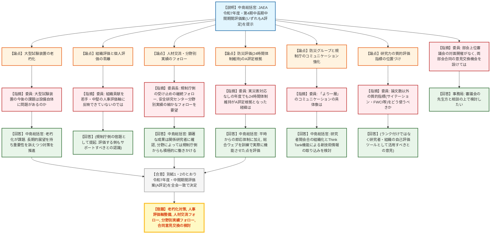
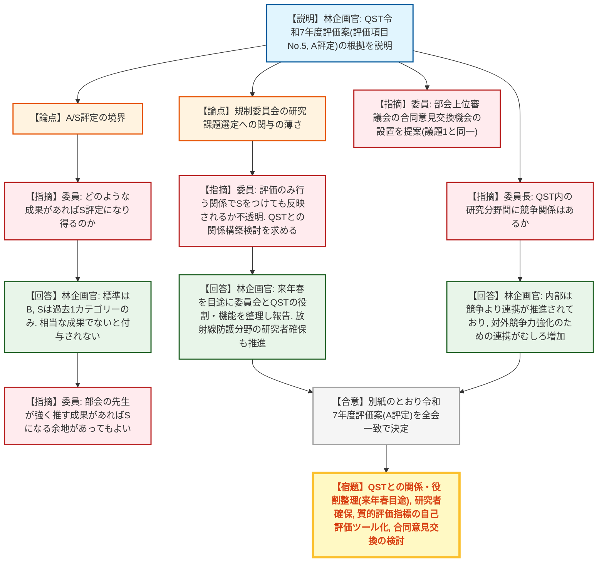
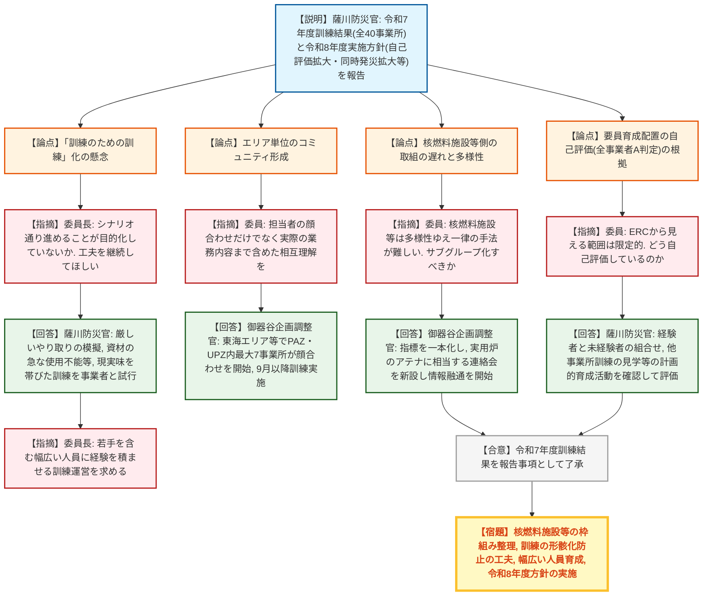
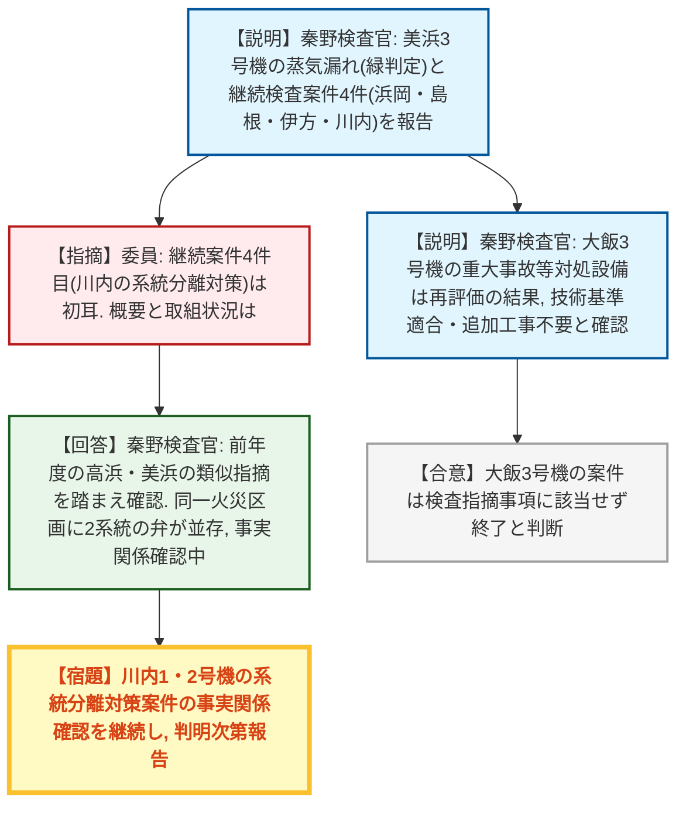
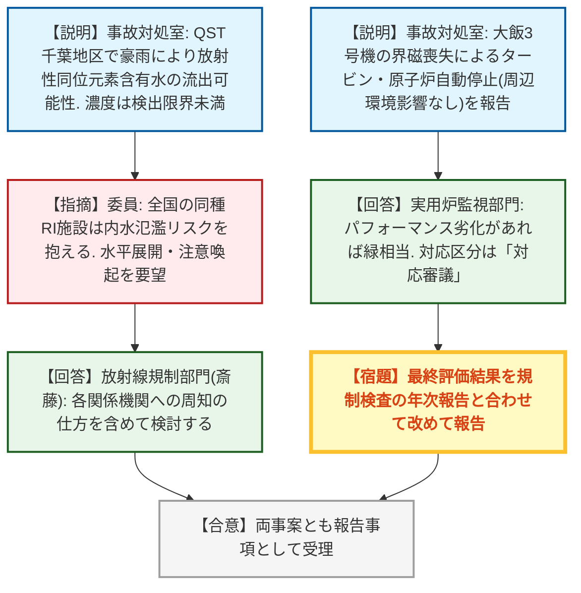

# 第26回原子力規制委員会（令和8年8月19日）
> 出典 : https://youtube.com/live/X7oZc5Cevr4?si=A4sUxWVPyR1o-sAq

## 会合の概要
* **JAEA・QSTの令和7年度業務実績評価はいずれも「A」評定で決定、一方で評価制度そのものへの疑問が相次ぐ**
  国立研究開発法人日本原子力研究開発機構(JAEA)の令和7年度及び第4期中長期目標中間期間評価、量子科学技術研究開発機構(QST)の令和7年度評価をいずれも原案(A評定)どおり決定した。委員からは、組織評価を個人の人事評価軸にどう反映するか、A評定とS評定の境界、規制委員会が研究課題の選定にほぼ関与しないままS評定を検討する構造的な難しさなど、評価制度自体の課題が多数提起された。
* **原子力事業者防災訓練、規制庁による3段階評価を廃止し事業者主体化へ本格移行**
  令和7年度は全40事業所(実用炉17、確認施設等23)で概ね適切な訓練実施を確認。実用炉評価では規制庁によるABC3段階評価を廃止しコメント形式に変更する一方、核燃料施設等側は事業者主体の改善活動の枠組みがまだ整理途上であることが明らかになった。委員長からは「訓練のための訓練」化への強い懸念が示された。
* **浜岡の基準地震動策定不正行為など検査継続案件4件を報告、大飯3号機の設計管理案件は再評価で決着**
  令和8年度第1四半期の検査結果として、美浜3号機の高圧タービン蒸気漏れ(緑判定)のほか、浜岡の基準地震動策定に係る不正行為、川内1・2号機の火災防護対策不備など4件の継続検査案件を報告。前年度から継続していた大飯3号機の重大事故等対処設備の設計管理案件は、事業者の再評価により技術基準適合・追加工事不要と確認され終了した。
* **大飯3号機の自動停止とQST千葉地区の放射性物質流出、法令報告2件を報告**
  大飯3号機ではタービン発電機の界磁喪失によりタービン・原子炉が自動停止(周辺環境への影響なし)。QST千葉地区では豪雨により放射性同位元素を含む水が流出した可能性があったが、濃度は検出限界未満で使用核種も短半減期のため実質的に減衰済みだったことが確認された。委員からは、同種施設の水害リスクに関する水平展開・注意喚起を求める意見が出された。

---

## 議題ごとの詳細整理

### 【議題1】国立研究開発法人日本原子力研究開発機構(JAEA)の令和7年度及び第4期中長期目標中間期間における業務の実績に関する評価(原子力規制委員会共管部分)
* **議論の背景と論点:**
  JAEAの業務実績評価は毎年度実施しており、本年度は令和7年度単年度評価に加え、第4期中長期目標の中間期間評価も併せて審議する。いずれも規制庁が原案としてA評定(標準はB評定)を示しており、原子力安全規制行政への技術的支援・安全研究、人材育成、原子力防災の3分野の実績と、大型試験装置の老朽化、人事評価軸、TSO(技術支援機関)としての中立性確保など今後の課題が論点となった。

* **質疑応答（詳細）:**
  * 【技術基盤課・中島総括官】
    資料1に基づき、令和7年度評価案(A評定)と第4期中長期目標中間期間評価案(全年度A評定)を説明。作読(査読)付き論文数や学会表彰の増加、内部被曝線量評価ソフトウェアIDCCの開発、大飯3号機の配管検査頻度変更に関する技術情報提示、行政訴訟における中性子照射脆化に係る技術情報収集、1F事故分析への貢献、指定公共機関としての24時間体制維持などを顕著な成果として説明した。
  * 【委員】
    今後の課題に挙げられた大型試験装置の利活用について、設備自体に何らかの問題があるのかを質問した。
  * 【技術基盤課・中島総括官】
    大型試験装置の老朽化が進んでいることが課題であり、対応には長期的な展望を持つ必要があると説明。装置の重要性を訴えつつ、老朽化対策を進めていきたいと回答した。
  * 【委員】
    今後の課題の4項目はいずれも組織への期待が大きい内容だが、実際に組織へ求めたときに個々の研究者が正当に評価されなければ、若手研究者は自分の専門研究以外の大きな業務にリソースを割く意欲を持てないと指摘。組織貢献を個人の人事評価軸につなげる仕組みを、評価する規制庁側もサポートすべきと述べた。
  * 【委員長】
    JAEAとの人材交流について、機構側の自己評価だけでなく規制庁側研究部門の受け止め方も継続的にフォローし信頼関係が保たれているか確認してほしいという点、また安全研究センター内の研究分野ごとに実績・人材確保の状況に差があり得るため、全体評価だけでなく分野別の状況も細かくフォローしてほしいという点の2点を要望した。
  * 【技術基盤課・中島総括官】
    顕著な成果とされた研究については関係研究者にコメントを求めて確認していること、補助金・委託研究等でも関係部署とのコミュニケーションを進めていること、分野によっては規制庁側からも積極的に働きかけて支援する方針であることを回答した。
  * 【委員】
    令和7年度は能登半島地震のような実災害対応がなかったにもかかわらず、指定公共機関としての24時間体制維持がA評定の根拠として高く評価された経緯・背景を質問し、評価の一貫性について尋ねた。
  * 【技術基盤課・中島総括官】
    緊急時に即応できる体制を平時から維持していること自体が重要である一方、令和7年度は総合ウェブを訓練で実際に活用し機能する体制を整えたことが特に高く評価された点だと説明した。
  * 【委員】
    大飯のPWR応力腐食割れ(SCC)対応に関する破壊力学的評価、福島事故調査への貢献、屋内退避の考え方への貢献を高く評価した上で、防災グループと規制庁の「より一層」のコミュニケーションを提案した趣旨の具体的内容を質問した。
  * 【技術基盤課・中島総括官】
    研究者間のコミュニケーションをより組織的に推進する会合の設置や、Think Tank機能を通じ学術機関との連携で得た新技術情報をJAEA経由で取り込む仕組みの構築を検討していると回答した。
  * 【委員】
    今後の課題に挙げられた研究力の質的評価(論文数だけでなくサイテーション、Hインデックス、FWCI等)について、これらの指標は研究者や組織のランク付け・比較のためではなく、研究者自身・組織が自己評価に活用するツールとして位置づけるべきと述べた。あわせて、研究業務と規制・防災協力業務の両方をしっかり評価できる仕組みの工夫を、規制庁側にも検討してほしいと求めた。
  * 【委員】
    部会の上位審議会(国立研究開発法人審議会)が10年以上対面開催されておらず書面開催が続いている点を踏まえ、次回開催時にはJAEA部会・QST部会の委員が一堂に会し、評価のあり方について意見交換する機会を設けてはどうかと提案した。
  * 【事務局】
    確かに対面開催がない状況を踏まえ、審議会の先生方とも相談の上で検討したい旨を回答した。

* **結論と宿題事項（アクションアイテム）:**
  * **決定事項:** 別紙1・2のとおり、JAEAの令和7年度業務実績評価及び第4期中長期目標中間期間業務実績評価(いずれも原子力規制委員会共管部分、評定A)を全会一致で決定。
  * **宿題事項:** 大型試験装置の老朽化対策の長期的検討、組織貢献を反映する人事評価軸の整備、規制庁研究部門側からのJAEAとの人材交流に関する評価の継続フォロー、安全研究センター内の分野別実績のきめ細かなフォロー、部会上位審議会の合同意見交換機会の検討。
  * 決定後、8月末までに文部科学大臣からJAEAへ通知するとともに公表予定。

---

### 【議題2】国立研究開発法人量子科学技術研究開発機構(QST)の令和7年度における業務の実績に関する評価(原子力規制委員会共管部分)
* **議論の背景と論点:**
  QSTの中長期目標期間3年度目にあたる令和7年度業務実績評価案(評定A)の決定議題。放射線影響研究・福島復興支援、被曝医療研究、基幹高度被曝医療センター等としての人材育成の3分野の実績に加え、A/B/S評定の基準の考え方、規制委員会が研究課題の選定プロセスにほぼ関与しない中での評価の妥当性が論点となった。

* **質疑応答（詳細）:**
  * 【放射線防護企画課・林企画官】
    資料2に基づき評価項目No.5(A評定)の根拠を説明。重粒子線の種類によって誘発されるリンパ腫の染色体変異に特徴的な違いが見られたこと、DOHaD説(胎児期・小児期の環境が疾病感受性を決めるという説)を放射線感受性についてマウス実験で示したこと、環境中の放射性核種の動態研究とIAEA報告書への貢献、J-RIME(医療被曝研究情報ネットワーク)を通じた日本の診断参考レベル2025年版の公表への貢献、目の水晶体の被曝限度引き下げに伴う個人線量計装着率の実態調査、AIを用いた宇宙滞在時の被曝線量自動解析手法の開発、プルトニウム吸入時の内部被曝線量評価手法の高度化、基幹高度被曝医療センターとしての人材派遣・国際研修講師派遣などを顕著な成果として説明した。あわせて、QST部会委員から研修・会議の開催自体をアウトプットとして評価するのではなく、対応力向上というアウトカムを踏まえて評価すべきとのコメントがあった旨も紹介した。
  * 【委員】
    A評定という結果に異論はないとしつつ、どのような成果があればS評定になり得るのか(論文の大幅増加、顕著な成果、緊急時対応での顕著な貢献等)を質問した。
  * 【放射線防護企画課・林企画官】
    標準はB評定でありA評定はその一段階上、S評定は過去の実績で1カテゴリーしか付与されておらずBも半数近くを占める状況で、相当な成果がなければ付与されないとの認識を回答。放射線防護分野は社会的インパクトが直ちに見えにくい分野であり、A評定でもかなりの高評価と考えていると説明した。
  * 【委員】
    部会の先生が強く推す成果があればS評定になり得る余地があってもよいとの意見を述べた。
  * 【委員】
    人材育成分野は規制庁の実務の一部であり評価しやすい一方、放射線影響研究・被曝医療研究の分野は規制委員会が研究課題の選定や計画策定にほとんど関与せず評価のみを行う関係にあるため、規制委員会がS評定を付けても直ちにS評定に反映されるかは不透明であると指摘。7月に着手されたQSTとの関係・役割に関する検討結果を踏まえ、規制委員会のニーズが研究課題に反映されるようになれば評価の姿勢も変わり得るとの見方を示し、関係構築の検討を力強く進めるよう求めた。
  * 【放射線防護企画課・林企画官】
    来年春を目途に委員会とQSTの関係における役割・機能のあり方を整理し報告する予定であり、特に研究者が少なく従来弱かった放射線防護分野の研究者確保について基盤グループとも連携して取り組む旨を回答した。
  * 【委員】
    部会の上位審議会の対面開催が長期間行われていない点を踏まえ、両部会(JAEA部会・QST部会)合同での意見交換機会の設置を提案した(議題1と同一提案)。
  * 【委員長】
    個人的な関心として、QST内の工学系研究者と放射線防護系研究者などの間で「競争」的な関係性があるかを質問した。
  * 【放射線防護企画課・林企画官】
    QST内部では競争よりも連携が推進されており、専門性の違いや病院由来のサンプル等を活かして対外的な競争力を高めるための機構内連携がむしろ増えていると回答した。

* **結論と宿題事項（アクションアイテム）:**
  * **決定事項:** 別紙のとおり、QSTの令和7年度業務実績評価案(原子力規制委員会共管部分、評定A)を全会一致で決定。
  * **宿題事項:** QSTとの関係・役割の在り方について来年春を目途に整理・報告する方針を確認。放射線防護分野の研究者確保、質的研究評価指標(サイテーション、FWCI等)の自己評価ツールとしての活用、研究業務と規制・防災協力業務の両立を評価する仕組みの検討、部会上位審議会の合同意見交換機会の検討。
  * 決定後、文部科学省内手続きを経て8月末までに文部科学大臣からQSTへ通知・公表予定。

---

### 【議題3】令和7年度原子力事業者防災訓練の結果及び令和8年度の訓練実施方針
* **議論の背景と論点:**
  原災法(原子力災害対策特別措置法)に基づき原子力事業者が実施する防災訓練について、令和7年度の結果(実用炉17事業所・確認施設等23事業所、計40事業所)と令和8年度の実施方針を報告。実用炉評価における規制庁の3段階(ABC)評価廃止・事業者主体化、確認施設等(核燃料施設等)側の取組の遅れ、同一地域内の同時発災訓練の拡大、「訓練のための訓練」化の回避が主な論点となった。

* **質疑応答（詳細）:**
  * 【緊急事案対策室・薩川防災官】
    資料3に基づき、令和7年度は全40事業所で概ね適切な訓練が実施され着実な改善活動が確認されたと報告。実用炉評価については事業者と規制庁の評価がこれまで概ね一致してきたことから、規制庁による3段階(ABC)評価を廃止し、良好事例(good practice)や見解相違点をコメントする方式に変更したことを説明。確認施設等では同一地域の複数施設による同時発災訓練が拡大し、統合原子力防災ネットワークシステム未設置施設でもWebEx等を用いた情報共有が定着していることも紹介した。令和8年度は実用炉について事業者主体の改善活動継続、確認施設等について同一地域内の防災重点区域内全事業所を対象とした同時発災訓練(最大7事業所)の実施、事業者による自己評価の全項目への拡大、訓練評価指標(指標1・指標10の1)の改定、確認施設等評価指標の一本化を行う方針を説明した。
  * 【委員】
    実用炉側の訓練は事業者主体への移行が着実に進んでいると評価する一方、自身が出席していない核燃料施設等側の訓練については施設の規模・リスクの多様性ゆえに一律の手法が適用しにくいと指摘し、核燃料施設等をさらにサブグループ化すべきかどうか等、現時点での考えを質問した。
  * 【緊急事案対策室・御器谷企画調整官】
    核燃事業者は実用炉に比べ訓練への取組がまだ発展途上であり、従来あったリスク大小による指標の区分を一本化した上で、実用炉における事業者間の情報共有の場に相当する連絡会を新たに設け、事業者間の情報融通を進め始めた段階であると説明した。
  * 【委員】
    エリア単位(同一地域の多業種事業所)でのコミュニティ形成についても、担当者同士が顔を合わせるだけでなく、実際の業務内容まで含めた相互理解を進めてほしいと要望した。
  * 【緊急事案対策室・御器谷企画調整官】
    今年度から実用炉のPAZ・UPZ内の関係機関(東海エリアで最大7事業所)が一堂に会し、同時発災に向けた顔合わせ・相談を開始しており、9月以降の訓練実施に向けて準備を進めていると説明した。
  * 【委員】
    ERCで見る事業者の対応者はベストメンバーと見受けられるが、指標「3の4 要員の育成配置」で全事業者がA判定となっている根拠・舞台裏を質問した。
  * 【緊急事案対策室・薩川防災官】
    フロントライン担当者は緊急時手順や安全評価に精通した人員が基本的にアサインされており、複数名体制で経験者と未経験者を組み合わせて訓練に臨ませる、他事業所の訓練を見学させるといった計画的な育成活動を確認した上で評価をつけていると説明した。
  * 【委員長】
    当初は現場に立ち入らずERCと速報センター間で激しい情報共有のやり取りを行う訓練だったが、近年はシナリオベースの事故対応に変化してきたと振り返り、シナリオ通りに進めることが目的化し「訓練のための訓練」になっていないか懸念を表明。シナリオから意図的に外れる訓練形態の検討など、工夫を継続してほしいと要望した。
  * 【緊急事案対策室・薩川防災官】
    昨年度は緊張感を持たせるため厳しいやり取りを模擬する訓練を試行したことを説明し、使用資材の急な使用不能や時間的制約の付与など、現実味を帯びた訓練の工夫について事業者と意見交換の上で試行していきたいと回答した。
  * 【委員長】
    訓練参加者を必ずしもトップクラスの熟練者に限定せず、若手を含む幅広い人員に経験を積ませる訓練運営を求めた。

* **結論と宿題事項（アクションアイテム）:**
  * **決定事項:** 令和7年度の訓練結果(全40事業所で概ね適切な訓練実施・着実な改善活動)を報告事項として了承。実用炉評価における規制庁3段階評価の廃止(コメント形式への変更)は令和7年度から実施済みであることを確認。
  * **宿題事項:** 核燃料施設等側の訓練枠組みの整理(サブグループ化の要否)、「訓練のための訓練」化の回避に向けた継続的な工夫、若手を含む幅広い人員育成の観点からの訓練運営の見直し、令和8年度方針(同時発災訓練の拡大、自己評価の全項目拡大、評価指標改定)の実施。

---

### 【議題4】令和8年度第1四半期の原子力規制検査等の結果
* **議論の背景と論点:**
  令和8年度第1四半期の原子力規制検査結果(実用炉:検査指摘事項1件、継続検査案件4件、深刻度評価のみの案件なし、安全実績指標(PI)は全炉緑)、及び東京電力福島第一原子力発電所の実施計画検査結果(前年度からの違反1件が解消、継続案件1件)を報告。美浜3号機の高圧タービン蒸気漏れによる手動トリップ(緑判定)や、浜岡の基準地震動策定に係る不正行為をはじめとする複数の継続検査案件の内容確認が論点となった。

* **質疑応答（詳細）:**
  * 【検査グループ専門検査部門・秦野検査官】
    令和8年5月8日、運転中の美浜3号機で運転員が高圧タービン周辺からの蒸気漏えいを確認し、手動トリップにより原子炉を停止した事案を検査指摘事項(緑判定)として報告。継続検査案件として、浜岡原子力発電所の新規制基準適合性審査における基準地震動策定に係る不正行為、島根2号機の燃料支持金具の使用相違によるLCO逸脱、伊方3号機の炉内核計装系統交換時における原子炉出力記録系選択スイッチ誤りによる記録不備、川内1・2号機の系統分離対策における火災防護対象機器等選定時の不十分な評価、の4件を報告した。前年度第4四半期からの継続案件だった大飯3号機の重大事故等対処設備(原子炉補給冷却水冷却機)の設計管理については、設工認(設計及び工事の計画の認可)に従った設計管理が実施されていなかったものの、事業者が設工認に基づき再評価した結果、技術基準に適合し追加工事も不要であることが確認できたため、検査指摘事項には該当しないと判断したことを報告した。福島第一原子力発電所の実施計画検査については、増設雑固体廃棄物焼却設備の水蒸気発生に伴う火災報知機作動に係る違反が是正処置により解消されたことを確認し、コア走行付近の通信ケーブル敷設・測量工事における放射線管理の不備は引き続き検査中であると報告した。
  * 【委員】
    継続検査案件4件目(川内1・2号機の系統分離対策における火災防護対象機器等選定の不十分な評価)について、初めて聞く案件であり、概要と現在の取組状況を質問した。
  * 【検査グループ専門検査部門・秦野検査官】
    まだ検査継続中のため概要のみとした上で、前年度に高浜・美浜で判明した高圧注入系の系統分離対策不備の指摘事項を踏まえ、同様の観点から川内で確認したところ、SI信号により動作する弁が同一の火災区画内に2系統並んで設置されていたことを検査官が確認しており、前回指摘事項の未然防止処置の実効性も含め現在事実関係を確認中であると説明した。

* **結論と宿題事項（アクションアイテム）:**
  * **決定事項:** 令和8年度第1四半期の検査結果(実用炉検査指摘事項1件・継続案件4件、福島第一実施計画検査の違反1件解消・継続案件1件)を報告事項として了承。大飯3号機の重大事故等対処設備に係る継続検査案件は、再評価の結果、技術基準適合・追加工事不要と確認され終了。
  * **宿題事項:** 川内1・2号機の火災防護対象機器の系統分離対策に関する案件、及び福島第一の通信ケーブル敷設・測量工事における放射線管理不備は、事実関係確認・検査を継続し、判明次第改めて報告する。

---

### 【その他】トピックス(法令報告事案2件)
* **議論の背景と論点:**
  令和8年7月29日〜8月17日のトピックスとして、大飯3号機の原子炉自動停止(8月10日発表)及びQST千葉地区研究所における放射性同位元素含有水の管理区域外流出の可能性(8月17日報告)の2件の法令報告事案が報告された。いずれも周辺環境への影響は確認されていないが、水害等のリスクに関する水平展開・注意喚起のあり方が論点となった。

* **質疑応答（詳細）:**
  * 【事故対処室】
    令和8年8月8日、大飯3号機で界磁喪失の警報が発信され、発電機・主タービン及び原子炉が自動停止した事案を報告。励磁系に関する故障が原因である可能性が高いと判断され法令報告がなされたが、モニタリングポストの指示値に変化はなく周辺環境への影響はないと説明。QST千葉地区の事案については、令和8年8月13日の豪雨の影響で放射性同位元素を含む水が流出した可能性があるとして法令報告がなされたが、浸水した水中の放射能濃度は検出限界未満であり、直近で使用していた炭素11及び銅64は短半減期核種であるため、使用量・経過時間から見て事実上ほとんど残存していない状態だったと確認されたことを説明した。
  * 【検査グループ実用炉監視部門】
    大飯3号機の事案は、原子炉トリップに伴うパフォーマンス劣化があれば緑相当になるとの見立てから、対応区分は「対応審議」とする方針を説明。最終的な評価結果は規制検査の年次報告と合わせて改めて報告するとした。
  * 【委員】
    QSTの事案について、同種の放射性同位元素(RI)使用施設は全国に多数あり、近年ゲリラ豪雨等が頻発している中、内水氾濫のハザードマップ上でも当該施設周辺が浸水想定区域に含まれていた可能性を指摘。同様の立地条件を持つ他施設は全国に多いとして、法令報告事案の水平展開・注意喚起を関係機関に行うよう要望した。自身の経験からも、大学施設で地下の電気室・図書館が浸水被害を受けた事例など、想定外の豪雨被害が常態化していると付言した。
  * 【放射線規制部門・斎藤】
    各関係機関への周知の仕方も含めて検討する旨を回答した。

* **結論と宿題事項（アクションアイテム）:**
  * **決定事項:** 大飯3号機の界磁喪失によるタービン・原子炉自動停止事案は「対応審議」で対応する方針を確認。QST千葉地区の事案は、流出した水の放射能濃度が検出限界未満であり、使用核種も短半減期のため実質的にほぼ存在しない状態だったことを確認。
  * **宿題事項:** 大飯3号機の事案の最終評価結果を規制検査の年次報告と合わせて報告すること、内水氾濫等のリスクを踏まえた同種RI使用施設への注意喚起・水平展開の検討。

---

## 論理構造の可視化（Mermaid）

### 【議題1】JAEAの令和7年度及び第4期中長期目標中間期間における業務実績評価

### 【議題2】QSTの令和7年度における業務実績評価

### 【議題3】令和7年度原子力事業者防災訓練の結果及び令和8年度の訓練実施方針

### 【議題4】令和8年度第1四半期の原子力規制検査等の結果

### 【その他】トピックス(大飯3号機自動停止・QST放射性同位元素流出)

