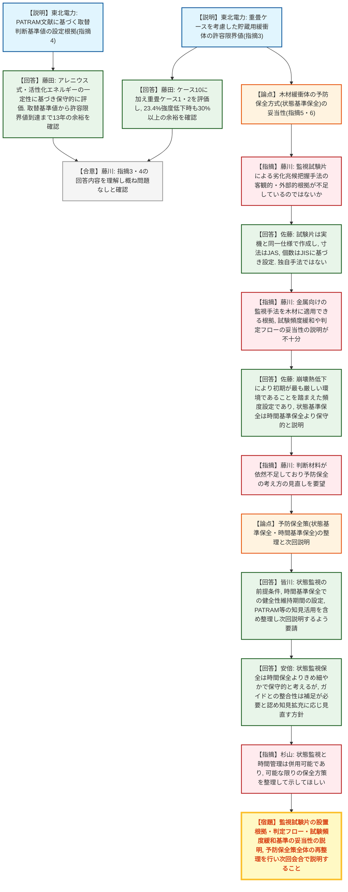

# 第1427回原子力発電所の新規制基準適合性に係る審査会合（令和8年8月20日）
> 出典 : https://youtube.com/live/1_gDGOpK9S4?si=UdQ6p4DISyT04XWG

## 会合の概要
* **重畳ケースを考慮した貯蔵用緩衝体の許容限界値（指摘事項3）は概ね妥当と確認された**
  女川2号機の乾式貯蔵施設は地盤に支持しない方式のため地震時の地盤変位を想定しており、最大衝突エネルギーとなるケース10に加え、トレーラー走行面へさらに落下する重畳ケース1・2を評価。緩衝体強度が23.4％低下した場合でも30％以上の吸収エネルギー余裕があることが確認され、既存の許容限界値の変更は不要と結論づけられた。
* **PATRAM文献に基づく取替判断基準値の設定根拠（指摘事項4）も理解が得られた**
  木材の活性化エネルギーが樹種・環境によらずほぼ一定であるとの知見に基づきアレニウス式を適用し、保守的な評価で取替判断基準値から許容限界値到達までに13年の余裕があることを確認。密度低下率と質量低下率を同一指標として扱う妥当性も示された。
* **一方、供用期間中の緩衝体取替運用フローと監視試験片の設置個数（指摘事項5・6）には強い懸念が示された**
  規制庁（藤川）は、前例の乏しい木材緩衝体に対する状態基準保全の妥当性を裏付ける客観的・第三者的根拠が不足していると指摘し、東北電力の自主的な説明だけでは受け入れられないとの姿勢を示した。
* **判定フローと試験頻度変更の根拠にも疑義**
  質量低下率・吸収エネルギーの両方が基準値を下回った場合のみ緩衝体交換に進む判定フローの妥当性、および6年目以降に試験頻度を緩和する際の劣化有無の判断方法についても、十分な説明がなされていないとの指摘があった。
* **予防保全策全体を再整理し次回会合で説明することに**
  規制庁（皆川）は状態基準保全・時間基準保全いずれを採るにせよ緩衝性能を維持する仕組みの整理を要請。議長（杉山）も両保全方式は併用可能との見解を示し、東北電力（安倍・阿部）は木材緩衝体という初の使用実績を踏まえさらに検討を深める方針を表明した。

---

## 議題ごとの詳細整理

### 【議題1】東北電力（株）女川原子力発電所第2号機の使用済燃料乾式貯蔵施設の設置工事に係る設計及び工事計画認可申請の審査について
* **議論の背景と論点:**
  前回（6月2日）会合での指摘事項3～6について東北電力が回答した。指摘事項3・4は貯蔵用緩衝体の許容限界値や取替判断基準値の技術的な数値評価の妥当性が論点となったのに対し、指摘事項5・6は木材緩衝体という前例の乏しい部材に対する予防保全方式（状態基準保全）の妥当性を裏付ける根拠の十分性が主な争点となった。

* **質疑応答（詳細）:**
    * 【説明者側】藤田（東北電力）
      指摘事項3（重畳ケースを考慮した緩衝体の許容限界値）について、地盤に支持しない女川2号機の乾式貯蔵方式では、最大衝突エネルギーとなるケース10に加え、トレーラー走行面上へさらに落下する重畳ケース1（水平）・重畳ケース2（斜め）を想定して評価した。両ケースとも判定基準を満足し、緩衝体強度が23.4％低下した場合でも吸収エネルギーに30％以上の余裕があることを確認し、既存の許容限界値を変更不要と説明した。
    * 【説明者側】藤田（東北電力）
      指摘事項4（取替判断基準値とPATRAM文献の適用性）について、木材の長期高温データが存在しないため、自社の1年間先行確認試験（劣化傾向なし）に加え、PATRAM文献の90℃・140℃加熱試験データを保守的に活用した。木材の活性化エネルギーが樹種・環境によらずほぼ一定（約125kJ/mol）との複数文献の知見に基づきアレニウス式を適用し、密度低下率と質量低下率も同一の劣化指標として扱えることを確認。取替判断基準値から許容限界値到達までの期間は密度・質量いずれでも13年で一致し、緩衝体の製造リードタイムを踏まえても十分な余裕があると説明した。
    * 【規制側】藤川（原子力規制庁）
      指摘事項3・4の回答内容は理解でき概ね問題ないと評価する一方、指摘事項5・6（供用期間中の取替運用フロー、監視試験片の設置個数）については、木材緩衝体の予防保全方式（状態基準保全）の考え方について確認したい点があると提起した。
    * 【規制側】藤川（原子力規制庁）
      金属キャスクガイドでは緩衝体装着状態で貯蔵する場合、経年変化の確認が求められており、本来は長期健全性を有する材料選定が原則だが、確認できない場合は適切な予防保全方式による取替で同等の安全水準を確保する考え方も許容される。設置許可時に示された方針のうち、取替基準による対応を定める後半部分を今回適用しているとの理解でよいか確認した。
    * 【説明者側】佐藤（東北電力）
      藤川の理解の通りであり、基本設計段階で示した方針（機能維持が確認できない場合は取替）を踏まえ、設工認段階で点検頻度・取替基準等の評価を整理して説明していると回答し、認識の一致を確認した。
    * 【規制側】藤川（原子力規制庁）
      状態基準保全を採用する以上、木材の劣化兆候を適切に把握できることが前提となるが、東北電力が示す把握手法は規格等に基づくものではなく独自の手法であり、監視試験片の設置位置・個数の妥当性、実施頻度、ばらつきの大きい木材への統計的評価手法、取替運用フローの妥当性について客観的・外部的な裏付けが不足していると指摘した。予防保全の考え方自体を見直す必要があるのではないかと問題提起した。
    * 【説明者側】佐藤（東北電力）
      監視試験片は実機緩衝体と同一の木材種・充填率・含水率で製作し、寸法は日本農林規格、個数はJIS規格に基づき設定しており、根拠のない独自手法ではないと反論した。ただし木材は金属に比べ試験実績や参照知見が少なくばらつきが大きい点は認識しており、試験計画・供試体作成は総合的に適切と考えていると説明した。
    * 【規制側】藤川（原子力規制庁）
      圧力容器の照射脆化監視方法を参考にしている面はあるが、金属と木材は材料特性が異なり同じ手法を適用できるかの客観的根拠が不足していると再指摘した。具体的には、6年目以降に試験頻度を緩和（3年間隔化）する際の劣化有無の判断基準、および質量低下率・吸収エネルギーの両方が基準値を下回った場合のみ交換工程に入る判定フローの妥当性についても、十分な説明がなされていないと指摘した。
    * 【説明者側】佐藤（東北電力）
      5年目以降の3年間隔化については議論の余地を認めつつ、燃料の崩壊熱低下に伴い環境が緩和方向へ向かうため初期が最も厳しい条件であるとの考えに基づくと説明した。異常兆候が確認された時点で取替える状態基準保全は時間基準保全より保守的な保全方式と考えていると強調しつつ、木材のばらつきの大きさや前例のなさは認識しており、大学の原子力材料の専門家にも相談したが公式な保証は得られていない旨も説明した。
    * 【規制側】藤川（原子力規制庁）
      東北電力の説明は理解するが、妥当性を判断するための材料が依然として不足しており、考え方の見直しを求めると改めて表明した。
    * 【規制側】皆川（原子力規制庁）
      設置許可時の基本方針は、耐食性のある材料選定または取替基準の設定により緩衝性能を60年間維持することが前提であり、状態基準保全を採る場合は状態を適切に監視できることが大前提になると整理した。時間基準保全を採る場合も健全性維持期間の適切な設定が必要であり、東北電力が進めている先行確認試験やPATRAM文献による知見の蓄積（保守的に見ても10年以上は女川で必要な緩衝性能が維持されるとの説明済みの結果を含む）を予防保全策にどう活用するか含め対応を整理し、次回会合で改めて説明するよう要請した。
    * 【説明者側】安倍（東北電力）
      劣化兆候把握の裏付けが不足している点、木材のばらつきが大きい点を認識した上で、状態監視保全は時間保全による交換よりもきめ細やかに状況を確認できる分、より保守的な保全であると考えていると説明した。ガイド等との整合性については補足が必要であることを認め、知見拡充に応じて保全方式を適切に見直していく方針を示した。
    * 【議長】杉山
      「状態監視保全」「状態基準保全」「時間管理保全」といった用語の受け止め方に事業者・規制庁間で若干の違いがあると指摘した。状態監視と時間管理は本来二律背反ではなく併用可能な考え方であるとし、木材緩衝体という新しい部材について可能な限りの保全方策を整理して示すよう要望した。
    * 【説明者側】阿部（東北電力）
      木材を長期の緩衝体として使用する前例がないことを踏まえ、指摘内容をさらに深掘りし保全方策を再提案したいと回答した。

* **結論と宿題事項（アクションアイテム）:**
  * **決定事項:** 指摘事項3（重畳ケースを考慮した貯蔵用緩衝体の許容限界値）及び指摘事項4（取替判断基準値とPATRAM文献に基づく経年劣化予測の妥当性）については、東北電力の説明内容に概ね理解が得られ、大きな懸念は示されなかった。
  * **宿題事項:** 指摘事項5・6に関連し、木材緩衝体の予防保全方式（状態基準保全）について、(1)監視試験片の設置位置・個数・試験頻度・統計的評価手法の妥当性を裏付ける客観的・外部的根拠の提示、(2)質量低下率・吸収エネルギーの両方が基準値を下回った場合のみ緩衝体交換に進む判定フローの妥当性の説明、(3)6年目以降に試験頻度を緩和する際の劣化有無の判断方法の明確化、(4)状態基準保全・時間基準保全を含めた予防保全策全体の再整理、を行い、次回会合で改めて説明することとなった。現段階では確定的な結論は出されていない。

---

## 論理構造の可視化（Mermaid）

### 【議題1】女川原子力発電所第2号機の使用済燃料乾式貯蔵施設設置工事に係る審査

