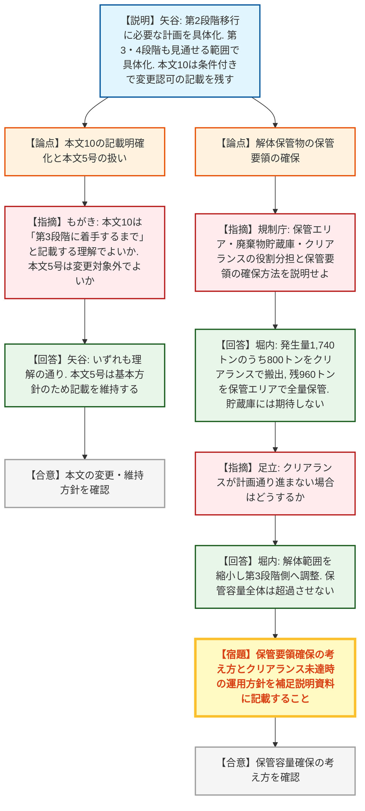
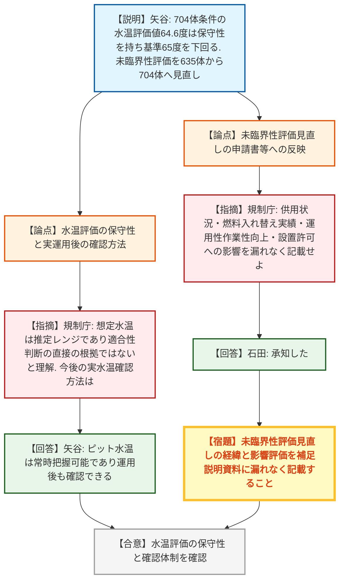
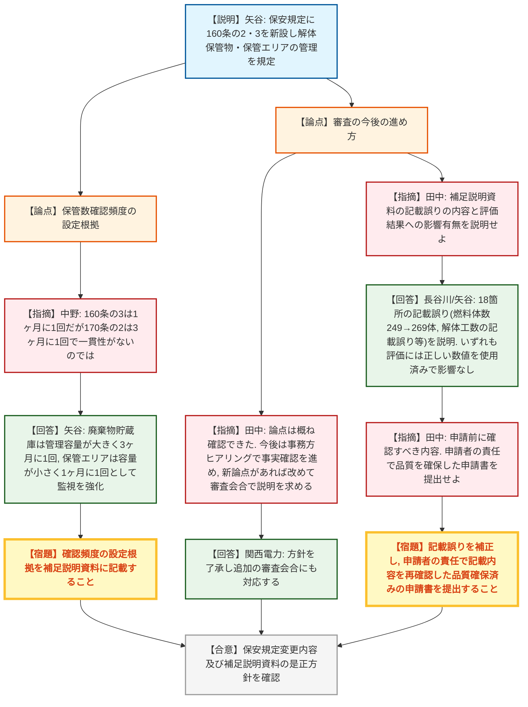

# 第49回実用発電用原子炉施設の廃止措置計画に係る審査会合（令和8年8月20日）
> 出典 : https://youtube.com/live/QThghvA3V9Y?si=v8otvfFGgLQ6Msjs

## 会合の概要
* **前回指摘4点への回答は概ね確認、審査は事務局ヒアリング段階へ移行**
  関西電力（株）大飯発電所1号炉・2号炉の廃止措置計画変更認可申請について、前回審査会合（6月16日）で示された4つの指摘事項（各段階評価の妥当性、解体保管物の発生量・保管エリア設定の妥当性、使用済み燃料ピット水温評価の保守性、未臨界性評価等への影響）への回答が説明され、規制側は技術的な論点を概ね確認できたとの認識を示した。今後は事務局ヒアリングで補正の反映状況を事実確認するフェーズへ移行する。
* **解体保管物の保管容量確保の考え方を巡る質疑**
  第2段階で発生する解体保管物約1,740トンのうち、クリアランス制度で800トンを搬出し、残り960トンを保管エリア（廃棄物貯蔵庫には期待しない）で全量保管する計画について、クリアランスが計画通り進まなかった場合の対応（解体範囲の縮小・後ろ倒し）を含め、規制側から繰り返し確認が行われた。
* **使用済み燃料ピット水温評価の保守性は確認、実運用後の水温確認体制も整理**
  704体貯蔵条件での冷却停止時水温評価値64.6℃が保安規定上の基準65℃を下回り、かつ評価に保守性が含まれることを規制側は理解した一方、示された「想定水温」はあくまで推定レンジであり、審査基準適合性判断の直接の根拠とはしていないとの理解が確認された。
* **保安規定の申請内容（資料2-1）についても概要説明を実施**
  廃止措置計画の変更に伴う保安規定の変更概要が説明され、解体保管物・保管エリアの管理条項（新設）や確認頻度の設定根拠について質疑が行われた。
* **補足説明資料に18箇所の記載誤りが判明、事業者に品質確保を要求**
  事務方ヒアリングの過程で補足説明資料に18箇所の記載誤り（燃料体数の記載誤り、被ばく線量算定における工数の記載誤り等）が判明したことが説明されたが、いずれも評価結果・申請書本文への影響はないことが確認された。規制側は、本来申請前に確認すべき内容であるとして、申請者の責任で品質を確保した資料の提出を求めた。

---

## 議題ごとの詳細整理

### 【議題1】関西電力（株）大飯発電所1号炉及び2号炉の廃止措置計画変更認可申請及び原子炉施設保安規定変更認可申請の審査について

* **議論の背景と論点:**
  本会合は、6月16日の審査会合で示された4つの指摘事項（(1)各段階時点の評価の妥当性と今後の変更認可事項、(2)解体保管物の発生量・保管エリア設定の妥当性及びNR（クリアランス相当物）の総量、(3)使用済み燃料ピット冷却停止時水温の実測値と評価値の差(7.3℃)の704体条件への適用性・評価の保守性、(4)未臨界性評価の見直しに伴う集合体落下等関連評価への影響及び3・4号炉設置許可への影響）に対する事業者の回答を確認することを主眼とした。あわせて、当該廃止措置計画の変更を踏まえた原子炉施設保安規定の変更認可申請（6月25日申請）の概要も説明された。

* **質疑応答（詳細）:**

  **＜指摘事項1：各段階評価の妥当性と本文記載の整理＞**
  * 【説明者側】関西電力・矢谷
    今回の申請は第2段階への移行に必要な計画の具体化に加え、第3・第4段階についても現時点で合理的に見通せる範囲を具体化したものである。被ばく評価等は概ね第4段階まで見通せているが、解体保管物の物流成立性は第2段階までしか見通せておらず、廃棄物処理処分方法の具体化に応じて順次変更認可を受けるとした。また、廃止措置計画の本文6・7・10にある「変更認可を受ける」旨の記載のうち、性能維持施設に関するもの（本文6・7）は補正で削除し、固体廃棄物の管理に関するもの（本文10）は「第3段階に着手するまで」という条件を追記して残す方針とした。
  * 【規制側】規制庁（もがき）
    本文10について、対応方針である「今後補正により明確化する」との説明は、括弧書きで「第3段階に着手するまで」と記載する趣旨で良いか事実確認を求めた。あわせて、本文5号にある着手要件・関与要件は基本方針を示すものであり、今回の変更対象ではないという理解でよいか確認した。
  * 【説明者側】関西電力・矢谷
    いずれも指摘の通りの理解である。本文5号は廃止措置の基本的な方針・思想を示す記載であるため、現状のまま残す。

  **＜指摘事項2：解体保管物の保管要領の確保＞**
  * 【規制側】規制庁（担当者）
    廃止措置計画の審査基準は、放射性固体廃棄物を適切に廃棄するまでの保管要領の確保を求めている。保管エリアと廃棄物貯蔵庫それぞれにどのような保管能力を期待しているか、クリアランス処理を必ず行う前提なのか、保管要領の確保の考え方を具体的に説明するよう求めた。
  * 【説明者側】関西電力・堀内
    第2段階では解体保管物が約1,740トン発生する見込みだが、このうちクリアランス制度により約800トンを管理区域外に搬出し、残り約960トンは保管エリアに設けたスペースで全量保管できる整理としている。廃棄物貯蔵庫（2mSv超のものを対象とする施設）は、この保管容量には含めていない。
  * 【規制側】規制庁（足立）
    クリアランス制度の適用が計画通りに進まず保管容量が不足する事態になった場合、どのように対応するのかを質問した。
  * 【説明者側】関西電力・堀内
    クリアランスによる搬出ができなければ保管容量が不足し得ることは認識しており、その場合は解体範囲を縮小し第3段階側で多めに解体するなど解体の順序を調整することで、保管容量全体を超過しないように進める。廃棄物貯蔵庫へ一時的に退避させるような運用は想定していない。
  * 【規制側】規制庁（足立）
    保管容量として想定しているのは保管エリア（960トン）とクリアランスのみで、廃棄物貯蔵庫は保管容量として含めないという整理でよいか改めて確認した。また、クリアランスが計画通り進まない場合でも最大保管量を超えないよう運用するという説明を、補足説明資料に明記するよう求めた。
  * 【説明者側】関西電力・堀内
    保管容量として廃棄物貯蔵庫には期待していないという理解でよい。指摘のあった内容は補足説明資料に追記する。

  **＜指摘事項3：使用済み燃料ピット水温評価の保守性＞**
  * 【規制側】規制庁（担当者）
    704体貯蔵条件での水温評価値64.6℃が保守性を有した値であり、保安規定に定める施設運用上の基準65℃を下回ることは理解した。一方、あわせて示された「想定水温」（53.7～57.3℃程度）は確定的な評価値ではなく推定レンジであるため、審査基準適合性の判断そのものの根拠とはしていないと理解している。今後、629体条件を一時的に超える運用や保管状態となった場合、実際の水温はどのように確認していく予定か説明を求めた。
  * 【説明者側】関西電力・矢谷
    使用済み燃料ピットの水温自体は常時把握できる状態にあるため、実際の運用開始後も水温の確認は可能である。

  **＜指摘事項4：未臨界性評価の見直しに伴う影響＞**
  * 【規制側】規制庁（担当者）
    今回の未臨界性評価見直し（貯蔵容量635体から704体への見直し）の経緯である使用済み燃料ピットの供用状況、燃料入れ替えの実績、運用性・作業性の向上、及び貯蔵条件変更が申請書や3・4号炉設置許可へ与える影響について、補足説明資料にも漏れなく記載するよう求めた。
  * 【説明者側】関西電力・石田
    承知した。

  **＜保安規定変更（資料2-1）の説明と確認頻度の考え方＞**
  * 【説明者側】関西電力・矢谷
    保安規定の変更は、第2段階の廃止措置に係る保安管理措置を規定するためのものであり、変更理由は「廃止措置計画の反映」と「記載の適正化」の2つである。新設する160条の2（解体保管物の管理）・160条の3（保管エリアの管理）では、保管容器への標識・整理番号の付与、保管エリアの区画・掲示、1週間に1回の巡視、1ヶ月に1回の容器保管数の確認等を定める。
  * 【規制側】規制庁（中野）
    新設する160条の3では解体保管物の保管数確認を1ヶ月に1回としているが、既認可の170条の2（放射性固体廃棄物の管理）は3ヶ月に1回、170条の3（クリアランスの管理）は1ヶ月に1回となっており、一見一貫性がないように見える。確認頻度をどのような考え方で設定しているか説明を求めた。
  * 【説明者側】関西電力・矢谷
    廃棄物貯蔵庫のように管理できる容量の絶対値が大きい設備は3ヶ月に1回を基本とする一方、解体保管物の保管エリアは補助建屋内の一部エリアに限られ保管できる絶対量が小さく早期に容量を超過しかねないため、より高頻度の1ヶ月に1回として監視を強化している。クリアランスの管理も同様の考え方である。
  * 【規制側】規制庁（中野）
    了解した。この考え方を補足説明資料に記載するよう求めた。
  * 【説明者側】関西電力・矢谷
    了解した。

  **＜今後の対応方針及び補足説明資料の記載誤りへの対応＞**
  * 【規制側】規制庁（田中）
    本日説明のあった前回指摘事項への回答内容は概ね確認できたとの認識を示した上で、今後は申請書・補足説明資料の内容について事務方ヒアリングで事実確認を継続し、新たな論点が判明した場合は改めて審査会合で説明を求める方針を提示した。
  * 【説明者側】関西電力（担当者）
    方針を了承し、必要な追加の審査会合にも対応する旨を回答した。
  * 【規制側】規制庁（田中）
    あわせて、事務方ヒアリングの過程で補足説明資料の記載内容に後日修正を要する箇所が判明しているとの説明があったことを踏まえ、その主な内容と、これまでの審査会合資料・申請書本文・評価結果への影響の有無について説明するよう求めた。
  * 【説明者側】関西電力・長谷川、矢谷
    今回提出済みの補足説明資料に18箇所の記載誤りがあったことを謝罪した上で、主な内容として、(1)1号機の使用済み燃料のうち4号機補助建屋内に貯蔵している燃料体数を249体と記載すべきところ269体と記載していた点（1号機から4号機への燃料20体の譲渡が資料に未反映であったことが原因）、(2)原子炉周辺設備解体撤去に伴う被ばく線量算定において、1号機・2号機の解体工数を誤って解体日数の数値で記載していた点、を説明した。いずれも該当数値は使用済み燃料ピット水温評価・未臨界性評価には使用しておらず、評価自体は正しい数値を用いて実施済みであるため、評価結果及び申請書への影響はないと説明した。
  * 【規制側】規制庁（田中）
    申請書や評価結果への影響がないことは確認できたとしつつ、本来は申請前に申請者自身が確認すべき内容であるとして、申請者の責任のもとで記載内容の適切性を改めて確認し、品質が確保された申請書・補足説明資料を提出するよう求めた。
  * 【説明者側】関西電力（担当者）
    承知した。

* **結論と宿題事項（アクションアイテム）:**
  * **決定事項:** 6月16日の審査会合で示された4つの指摘事項への回答内容は規制側に概ね確認され、技術的な論点の確認は完了したものとして、今後は事務方ヒアリングによる申請書・補足説明資料への反映状況の事実確認フェーズに移行することが確認された。あわせて保安規定変更（資料2-1）の概要説明も行われた。
  * **宿題事項:**
    1. 解体保管物の保管要領確保について、保管エリア・クリアランス・廃棄物貯蔵庫それぞれの役割分担、及びクリアランスが計画通り進まない場合でも最大保管量を超過させない運用の考え方を、補足説明資料に明記すること。
    2. 未臨界性評価見直し（635体→704体）の経緯（供用状況、燃料入れ替え実績、運用性・作業性向上、貯蔵条件変更の申請書・3・4号炉設置許可への影響）を補足説明資料に漏れなく記載すること。
    3. 保安規定における確認頻度（160条の3等）の設定根拠の考え方を補足説明資料に記載すること。
    4. 廃止措置計画本文10の記載を、「第3段階に着手するまで」との条件を明記する形で補正すること。
    5. 補足説明資料に判明した18箇所の記載誤りを補正するとともに、申請者の責任のもとで記載内容の適切性を再確認し、品質を確保した申請書を提出すること。
    6. 事務方ヒアリングの中で新たな論点が判明した場合は、改めて審査会合の場で説明を求める。

---

## 論理構造の可視化（Mermaid）

### 1. 各段階評価の妥当性と解体保管物の保管容量確保

### 2. 使用済み燃料ピット水温評価と未臨界性評価の見直し

### 3. 保安規定の変更概要及び補足説明資料の記載誤りへの対応

