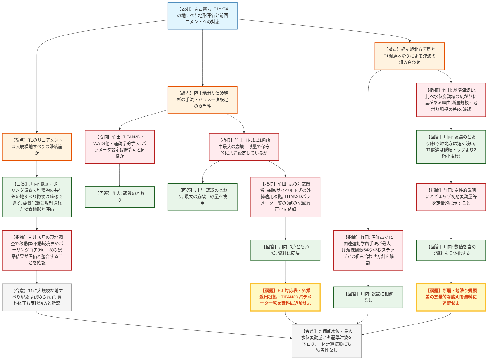
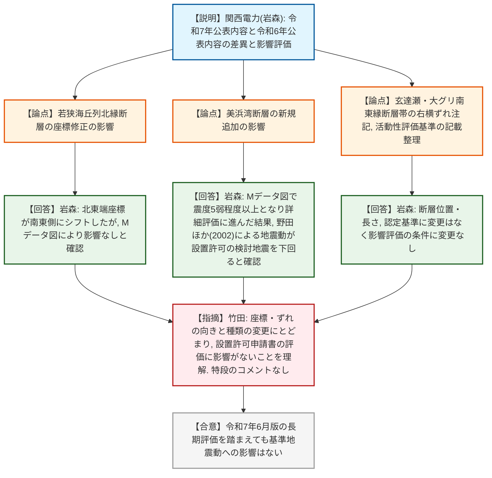

# 第1428回原子力発電所の新規制基準適合性に係る審査会合（令和8年8月21日）
> 出典 : https://youtube.com/live/1Ct-N4y-x08?si=mFQr59bJOZyGKOTX

## 会合の概要
* **関西電力（株）大飯発電所の日本海中南部の海域活断層の長期評価（令和7年6月27日公表）に関する影響確認**が唯一の議題として審査され、基準津波・基準地震動のいずれについても既許可の評価に変更はないとの結論に至った。
* 丹後半島の陸上地滑り（T1関連・T3・T4）を対象とした津波解析について、前回会合（第1304回）でのコメントへの対応状況（露頭の追加観察、ボーリングコア観察、経ヶ岬北方断層との組み合わせ解析等）が説明され、規制庁が6月4日に実施した現地調査の結果とも整合していることが確認された。
* 経ヶ岬北方断層と丹後半島陸上地滑り（T1関連）を組み合わせた津波の評価点水位は、いずれも既許可の基準津波1・基準津波2を下回ることが確認され、基準津波の見直しは不要と判断された。
* 断層基準地震動については、若狭海丘列北縁断層の座標修正、美浜湾断層の新規追加という令和7年公表内容の変更点があったが、Mデータ図によるスクリーニングおよび野田ほか(2002)による地震動評価の結果、いずれも基準地震動への影響はないことが確認された。
* 規制庁からは、H-L（崩壊土砂量と等価摩擦係数の関係式）の記載適正化やTITAN2Dパラメータの一覧化、断層・地滑りの規模差に関する定量的な補足説明など、資料の分かりやすさを高めるための宿題事項が複数提示されたが、審査の実質的な論点では大きな対立はなく、総じて「概ね妥当な検討」と評価された。

---

## 議題ごとの詳細整理

### 【議題1】関西電力（株）大飯発電所の日本海中南部の海域活断層の長期評価に関する影響確認について

* **議論の背景と論点:**
  地震調査研究推進本部が令和7年6月27日に公表した「日本海中南部の海域活断層の長期評価（第一版）―近畿地域・北陸地域北方沖―」を受け、大飯発電所の基準津波・基準地震動への影響を確認する回。基準津波（資料1-1系列）については、前回会合（第1304回）で規制庁から出された6件のコメント（露頭調査の詳細化、ボーリング調査の位置づけの明記、移動体内コアの観察結果の充実、滑り面設定の地下水・地質的根拠、各ステップのまとめの追加、陸上地滑りの崩壊方針の明確化）への対応状況の説明と、規制庁による6月4日の現地調査結果の報告が中心となった。断層・基準地震動（資料1-2）については、2024年12月の第1304回会合以降の地震本部公表内容の変更点（若狭海丘列北縁断層の座標修正、美浜湾断層の新規追加、活動性評価基準の記載整理）を踏まえた影響評価が論点となった。

* **質疑応答（詳細）:**
  **＜前回コメントへの対応・現地調査結果の確認＞**
    * 【説明者側】川内（関西電力）
      T1（防災科研が示す地すべり移動の初期状態）については、詳細地形調査・現地調査・追加のボーリング調査（点載荷試験による一軸圧縮強度の測定を含む）の結果、滑落崖直下の露頭でも開口割れ目への堆積物の共在など地すべりを示す現象が確認できず、大規模なT1に関連する現象は認められないと評価した。一方でT2・T2’・T3・T4については、防災科研が示す範囲とおおむね一致する地すべり地形を抽出した。
    * 【説明者側】川内（関西電力）
      T1内のリニアメントについては、文献調査により丹後半島北東端付近に同様の走行を持つ断層・リニアメントが複数存在することを確認しており、節理の発達した安山岩など局所的に硬質な岩盤の分布に規制された浸食地形であって、地すべりによる滑落崖ではないと考察した。ボーリングコア（No.3）ではNW走向・NE傾斜の面構造が確認され、T2が東側の海へ滑落するモデルと整合するノンテクトニック構造も認められた。
    * 【規制側】三井（原子力規制庁）
      本年6月の現地調査において、資料65ページに示された移動体と不動域の境界、および複数の露頭・ボーリングコア（No.1〜3）の観察結果が、関西電力の評価と整合していることを確認した。また前回会合で指摘した資料の修正（T1滑落崖に関する考察の追記、ボアホールTV画像の追加等）が反映されていることも確認しており、認識の相違はない。

  **＜陸上地滑りによる津波解析の手法・パラメータ設定＞**
    * 【規制側】竹田（原子力規制庁）
      T1内21箇所・T2・T2’を同時に活動させて「T1関連」として評価する方針、TITAN2Dによる崩壊シミュレーションとWATSほかによる方法・運動学的手法による津波解析、パラメータ設定方針が既許可申請書での評価と同様であるという理解でよいか確認した。
    * 【説明者側】川内（関西電力）
      認識のとおりであると回答した。
    * 【規制側】竹田（原子力規制庁）
      H-L（等価摩擦係数）の算定において、T1内21箇所については保守性の観点から、その中で崩壊土砂量が最大となる箇所の値を用いて共通的に設定しているという理解でよいか確認した。
    * 【説明者側】川内（関西電力）
      認識のとおりであり、21箇所のうち最大の地滑りの崩壊土砂量を用いて評価していると回答した。
    * 【規制側】竹田（原子力規制庁）
      保守的な設定の考え方は理解した上で、（1）資料の表における崩壊土砂量とH-Lの対応関係の記載が分かりにくいため適正化すること、（2）H-Lの算定に用いた森脇(1987)・サイベルト(2002)の評価式には一部外挿範囲のデータが含まれるため、これらを適用する事業者としての考え方を追記すること、（3）TITAN2Dの計算に用いるパラメータの一覧表を追加すること、の3点を資料の適正化として依頼した。
    * 【説明者側】川内（関西電力）
      3点とも承知した、資料に反映すると回答した。

  **＜経ヶ岬北方断層との津波の組み合わせ＞**
    * 【規制側】竹田（原子力規制庁）
      評価点（3・4号炉海水ポンプ室前面・取水路奥）ではT1関連の運動学的手法による水位が最大となり、既許可の陸上地滑り評価で最大を示すNo.17の結果を下回ることを確認した。また、経ヶ岬北方断層による津波とT1関連地滑りによる津波の組み合わせについて、ジェニングス型の崩落線関数から求めた地震動継続時間（54秒）の範囲内で3秒ステップで時間差をずらして評価するという方針を確認した。
    * 【説明者側】川内（関西電力）
      認識に相違ないと回答した。

  **＜基準津波との比較・水位変動範囲の差異の分析＞**
    * 【規制側】竹田（原子力規制庁）
      経ヶ岬北方断層＋T1関連地滑りによる津波の一体計算結果と基準津波1を最大水位分布図で比較すると、水位変動が大きい領域の広がりに大きな差があることを指摘し、その要因についての関西電力の分析（経ヶ岬北方断層は若狭海丘列付近断層より断層長さが短く初期地盤変動量も小さいこと、T1関連地滑りの崩壊土砂量は隠岐トラフ海底地すべり（エリアB）と比べて2桁程度小さいこと）を確認した。
    * 【説明者側】川内（関西電力）
      認識のとおりであると回答した。
    * 【規制側】竹田（原子力規制庁）
      上記の分析について、初期地盤変動量や水深等の差を定性的な表現にとどめず、具体的な数値を示して説明性を向上させるよう求めた。
    * 【説明者側】川内（関西電力）
      現状はスナップショットなど図での説明にとどまっているため、数値も含めて資料を具体化すると回答した。
    * 【規制側】竹田（原子力規制庁）
      評価点における水位（4.0m・2.8m）が基準津波による水位（5.9m・6.3m）を下回ること、基準津波定義値との比較でも最大水位変動量（1.58m）が基準津波の値（2.66m・3.09m）を下回ること、一体計算の時刻歴波形についても第1波で断層起因の津波が到達し後続して地滑り起因の津波が重なるという特徴的だが特異ではない波形であることを確認した。

  **＜断層基準地震動（資料1-2）の変更点確認＞**
    * 【説明者側】岩森（関西電力）
      令和7年公表内容と令和6年公表内容を比較した結果、検討対象としていた断層の長さに変更はなく新たな断層の公表もないことを確認した上で、変更点として（1）若狭海丘列北縁断層の北東端座標が南東側にシフトしたこと、（2）玄達瀬・大グリ南東縁断層帯について右横ずれ成分を伴うという注記が地震本部から追記されたが断層位置・長さに変更はないこと、（3）活動性評価基準の記載が実態に即して整理されたが認定基準自体に変更はないこと、の3点を説明した。これらを踏まえ、若狭海丘列北縁断層はMデータ図による影響検討の結果影響なしと確認され、新規追加された美浜湾断層は震度5弱程度以上となったため野田ほか(2002)により地震動評価を行った結果、設置許可の検討地震による震度を下回り基準地震動への影響はないと評価した。
    * 【規制側】竹田（原子力規制庁）
      令和6年8月版からの変更が断層座標やずれの向き・種類等の点にとどまり、影響確認の結果として設置許可申請書の評価に影響がないことを理解したとして、特段のコメントはない旨を述べた。

* **結論と宿題事項（アクションアイテム）:**
  * **決定事項:** 地震本部が令和7年6月に公表した日本海中南部の海域活断層の長期評価を踏まえても、大飯発電所の基準津波（基準津波1・2）および基準地震動を変更する必要はないと評価された。丹後半島陸上地滑りの地滑り地形抽出・規模設定（T1関連として21箇所＋T2・T2’を保守的に同時活動させる方針を含む）は、現地調査の結果とも整合しており妥当と確認された。
  * **宿題事項:**
    1. H-L算定に用いた崩壊土砂量との対応関係が分かるよう資料の表記を適正化すること。
    2. H-Lの算定式（森脇1987、サイベルト2002）について、一部外挿範囲のデータを適用する理由・考え方を資料に追記すること。
    3. TITAN2Dによる崩壊シミュレーションに用いるパラメータの一覧表を追加すること。
    4. 経ヶ岬北方断層と若狭海丘列付近断層、およびT1関連地滑りと隠岐トラフ海底地すべりとの規模差について、初期地盤変動量・水深等の具体的な定量値を示した説明に改めること。
    5. 上北変電所等に関する事項ではないが、経ヶ岬北方断層・T1関連の津波との組み合わせに関する結果を含め、本日のコメント内容をまとめ資料に反映し事務局が確認すること。
  * 総合評価として、大飯発電所の日本海中南部の海域活断層の長期評価を踏まえた基準地震動・基準津波の影響評価は「概ね妥当な検討がなされたもの」と評価された。

---

## 論理構造の可視化（Mermaid）

### 【議題1-A】基準津波（丹後半島陸上地滑りの影響評価）

### 【議題1-B】断層・基準地震動（令和7年公表内容の影響確認）

