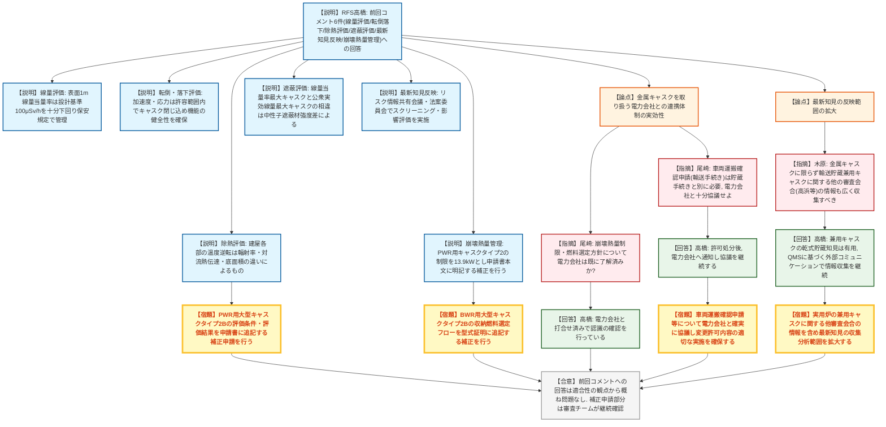

# 第591回核燃料施設等の新規制基準適合性に係る審査会合（令和8年8月24日）
> 出典 : https://youtube.com/live/IUm-f59cQO0?si=tKVxKdS5BrLSd_XW

## 会合の概要
* **前回(5月22日)審査会合で示された6件のコメントへの回答を、規制庁が概ね適合性の観点から妥当と評価**
  リサイクル燃料貯蔵株式会社(RFS)から、金属キャスクの線量評価、転倒・落下時の構造健全性、除熱評価における温度逆転現象の理由、遮蔽評価の相違理由、最新知見の反映プロセス、崩壊熱量の制限管理という多岐にわたる論点について回答があり、規制庁はいずれも問題ないとの理解を示した。
* **金属キャスクを取り扱う電力会社との連携体制の実効性が焦点に**
  規制庁は、崩壊熱量制限や燃料選定フローといった変更許可の内容を、搬入元となる電力会社が了解済みか確認するとともに、貯蔵の手続きとは別に必要となる車両運搬確認申請(輸送手続き)についても、電力会社と十分に協議するよう求めた。RFSは電力会社との打合せ・認識確認を既に実施済みと回答した。
* **最新知見の収集範囲を、金属キャスクに限らず輸送貯蔵兼用キャスク全般へ拡大するよう要請**
  規制庁は、実用炉の使用済燃料乾式貯蔵施設で用いられる輸送貯蔵兼用キャスクについても国内で導入・審査が進んでいるとして、7月30日の高浜発電所設計変更許可審査会合での議論などを例に挙げ、他の審査会合の情報も広くフォローアップするようRFSに求めた。
* **除熱評価における温度逆転(崩壊熱量が低いキャスクの方が高温部位を生じる現象)について、輻射率・対流熱伝達・底面積という3要因から技術的に説明**
  RFSは模式図を用いて、PWR用キャスクの方が崩壊熱量が大きいにもかかわらず床以外の部位で温度が高くなる理由を説明し、評価条件・結果を申請書に追記する補正を行う方針を示した。
* **会合全体としては前回指摘への回答を妥当と確認しつつ、補正申請の必要な点は規制庁審査チームが引き続き確認する運びに**
  追加の論点が見つかった場合には、審査会合を改めて設ける可能性も示された。

---

## 議題ごとの詳細整理

### 【議題1】リサイクル燃料貯蔵株式会社リサイクル燃料備蓄センター使用済燃料貯蔵施設の事業変更許可申請について
* **議論の背景と論点:**
  5月22日の審査会合で規制庁から示された6件のコメント(①金属キャスク表面1m位置の線量当量率と放射線防護対策の要否、②キャスクの転倒・重量物落下時の安全性、③建屋の除熱評価における温度逆転現象の理由、④線量当量率が最大となるキャスクと公衆実効線量が最大となるキャスクが異なる理由、⑤最新知見の反映検討プロセス、⑥収納燃料の崩壊熱量の制限管理)に対するRFSの回答の妥当性、および金属キャスクの安全な運用を電力会社と確実に連携できる体制になっているかが論点となった。

* **質疑応答（詳細）:**
    * 【説明者側】高橋（RFS）
      前回コメント6件について、金属キャスク表面1m位置の線量当量率は設計基準(100μSv/h)を十分下回ることを確認し保安規定に基づき管理すること、転倒・重量物落下時も判定基準の範囲内でキャスクの閉じ込め機能の健全性が確保され公衆への被ばくリスクはないこと、建屋各部の温度逆転はキャスク表面の輻射率・天井から側壁への対流熱伝達・底面積の違いという3要因によるものであり評価条件・結果を申請書に追記する補正を行うこと、線量当量率最大キャスクと公衆実効線量最大キャスクが異なるのは収納燃料の濃縮度・燃焼度・冷却期間の違いに起因する中性子遮蔽材強度差によること、最新知見はリスク情報共有会議・法案委員会でのスクリーニング・影響評価により反映していること、崩壊熱量制限(PWR用キャスクタイプ2で13.9kW)は申請書本文に明記し電力会社への通知・記録確認により管理することを、それぞれ回答として説明した。
    * 【規制側】尾崎（規制庁）
      前回指摘事項への回答はいずれも適合性の観点から問題ないと理解した。その上で、今回示された崩壊熱量制限や燃料選定方針の運用方針について、金属キャスクをRFSへ搬入する電力会社側も既に了解済みか確認したい。
    * 【説明者側】高橋（RFS）
      電力会社とは既に打合せの場を持ち、認識の確認を行っている。
    * 【規制側】尾崎（規制庁）
      車両運搬確認申請(原子炉等規制法第59条第2項等に基づく輸送手続き)は、貯蔵の手続きとは別に必要となる。RFS社内での設計条件・収納条件の共有に加え、輸送の申請者となる電力会社ともきちんと協議し、今回の変更許可の内容が適切に実施されるよう対応してほしい。
    * 【説明者側】高橋（RFS）
      許可処分をいただいた後、電力会社へ崩壊熱量制限や燃料選定フローの内容をしっかりと通知し、今後とも協議を継続して適切に運用できるようにしていく。
    * 【規制側】木原（規制庁)
      最新知見の反映において、発電所を含む故障トラブル情報等を収集・スクリーニングしている点は理解した。金属キャスクに限らず、実用炉の使用済燃料乾式貯蔵施設で用いられる輸送貯蔵兼用キャスクについても国内で導入・審査が進んでおり、例えば7月30日の高浜発電所の設計変更許可審査会合では型式証明を受けた輸送貯蔵兼用キャスクの議論が行われている。こうした他の審査会合の情報も広くフォローアップし、最新知見として確認してほしい。
    * 【説明者側】高橋（RFS）
      実用炉における兼用キャスクの乾式貯蔵で得られる知見は当社にとっても有用であり、QMSに基づく外部コミュニケーション活動等を通じて引き続き情報収集し、事業変更許可申請や設計活動に活かしていきたい。
    * 【説明者側】赤坂（RFS）
      高浜の件など、しっかり対応していきたいので、今後とも指導いただきたい。

* **結論と宿題事項（アクションアイテム）:**
  * **決定事項:** 前回コメント6件への回答は、規制庁として適合性の観点から概ね問題ないことが確認された。今後は補正申請が必要な点について規制庁審査チームが引き続き内容を確認する。他に論点が見つかった場合は、審査会合を新たに設ける可能性がある。
  * **宿題事項:**
    1. 建屋の温度逆転理由を踏まえ、PWR用大型キャスクタイプ2Bの評価条件・評価結果を申請書に追記する補正申請を行うこと。
    2. BWR用大型キャスクタイプ2Bの型式証明に記載の収納燃料選定フローを追記する補正を行うこと。
    3. 崩壊熱量の制限(13.9kW)を申請書本文に明記する補正を行うこと。
    4. 金属キャスクの輸送に係る車両運搬確認申請等について、電力会社と確実に協議し、変更許可内容が適切に実施されるようにすること。
    5. 実用炉における輸送貯蔵兼用キャスクに関する他の審査会合(高浜発電所等)の情報を含め、最新知見の収集・分析範囲を拡大すること。

---

## 論理構造の可視化（Mermaid）

### 【議題1】リサイクル燃料貯蔵株式会社リサイクル燃料備蓄センター使用済燃料貯蔵施設の事業変更許可申請

