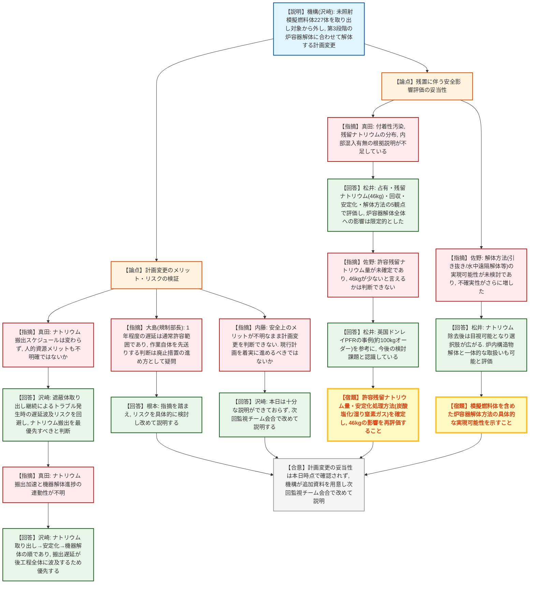
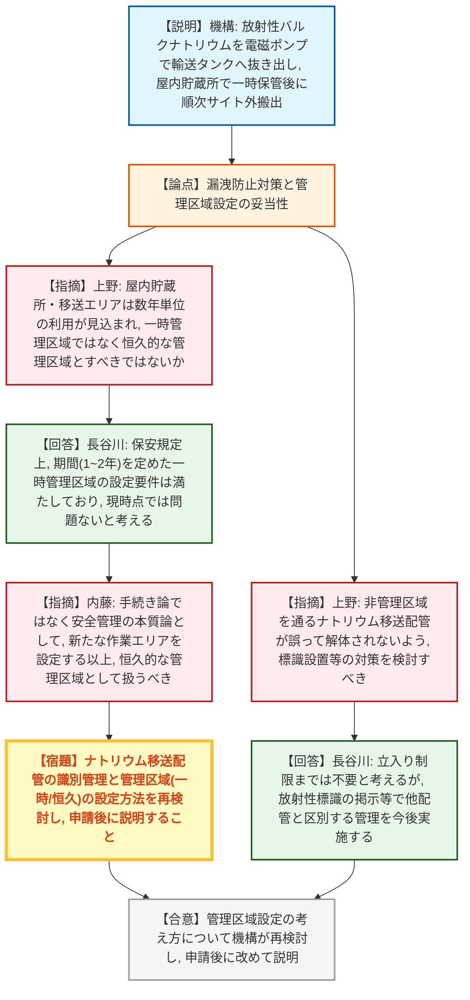
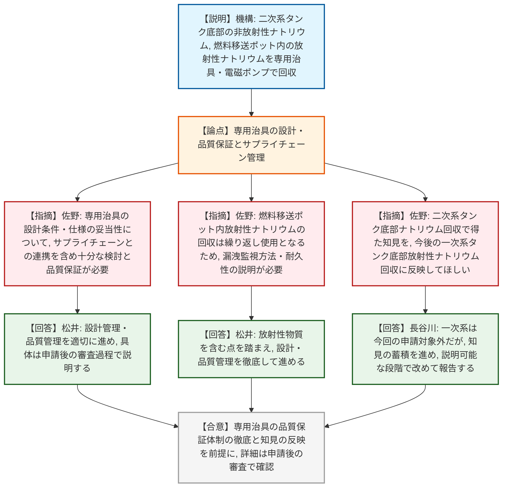
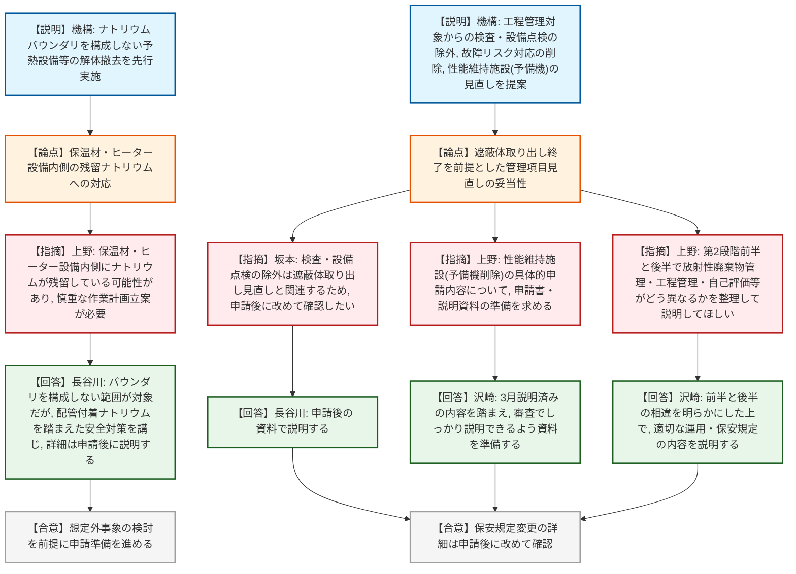

# 第53回もんじゅ廃止措置安全監視チーム（令和8年8月24日）
> 出典 : https://youtube.com/live/3PFz_bMyCnA?si=9Jks7ns_6Yufu5Gj

## 会合の概要
* **遮蔽体等取り出し作業の見直し(未照射模擬燃料体227体の残置)に対する規制側の強い疑義**
  原子力機構から、原子炉容器内に残る未照射の模擬燃料体227体を取り出し対象から外し、第3段階の炉容器解体に合わせて解体するという計画変更が説明された。規制庁は、ナトリウム搬出スケジュール自体は変わらず人的資源メリットも不明確であること、残留ナトリウムや解体方法の不確実性がむしろ増すことを指摘し、原子力規制部長からも「1年程度の遅延なら現行計画通り確実にやるべきではないか」という根本的な疑問が呈された。機構は本日十分な説明ができなかったとして、次回監視チーム会合で改めて資料を用意し説明することとなった。
* **放射性ナトリウム搬出における管理区域設定の妥当性**
  ナトリウム移送配管が非管理区域を通る点について、誤って解体されないよう標識設置等の対策強化が求められたほか、屋内貯蔵所等での保管が数年単位に及ぶことから、「一時管理区域」ではなく恒久的な管理区域とすべきではないかとの指摘があり、機構は再検討することとなった。
* **専用治具・サプライチェーン管理の重要性**
  二次系タンク底部の非放射性ナトリウムおよび燃料移送ポット内の放射性ナトリウムの回収に用いる専用治具について、設計条件・仕様の妥当性とサプライチェーンとの連携を踏まえた品質保証の徹底が規制庁から求められた。
* **保安規定変更は遮蔽体見直しの帰趨次第で申請後に確認**
  工程管理対象からの検査・設備点検の除外等、保安規定の変更内容は、遮蔽体取り出し作業の見直しと密接に関連するため、詳細な確認は申請後に持ち越すこととされた。
* **規制庁と機構の間での意思疎通不足が露呈**
  会合の締めくくりで、模擬燃料体の取り出し順序や管理区域設定の考え方について、規制庁・機構間で十分な意思疎通ができていなかった点が指摘され、申請前に双方でしっかり確認するよう求められた。

---

## 議題ごとの詳細整理

### 【議題1】「もんじゅ」第2段階に係る廃止措置計画及び保安規定の変更認可申請の概要について

* **議論の背景と論点:**
  原子力機構は、①放射性ナトリウム搬出方法の具体化、②二次冷却設備等の解体準備、③遮蔽体等取り出し作業内容の変更(未照射模擬燃料体の残置)、④性能維持施設の見直しからなる廃止措置計画の変更と、工程管理方法・施設管理計画に関する保安規定の変更を、今後申請する予定であることを説明した。最大の争点は、③の遮蔽体等取り出し作業の見直しについて、安全上・工程上のメリットとリスクが十分に立証されているかという点であった。

* **質疑応答（詳細）:**

  **＜遮蔽体等取り出し作業の見直し(未照射模擬燃料体の残置)＞**
    * 【説明者側】沢崎（原子力機構）
      従来計画では原子炉容器内の遮蔽体等を全て取り出す予定だったが、残る未照射の模擬燃料体227体は取り出し対象から外し、第3段階の原子炉容器解体に合わせて解体することとした。狙いは、ナトリウム中での作業時に不具合が発生するリスクを低減し、人的資源をナトリウム搬出作業に集中させることにある。
    * 【規制側】真田（原子力規制庁）
      遮蔽体取り出しをやめても放射性バルクナトリウムの搬出スケジュール自体は変わらず、人的資源メリットの実態も不明確ではないか。一方で残留ナトリウムは確実に増加し、模擬燃料体の安定化処理という新たなモードも加わるため、廃止措置計画全体で見て本当に利益があるのか疑問である。現行計画が物理的に実施可能なのであれば、なぜあえて見直す必要があるのか説明してほしい。
    * 【説明者側】沢崎（原子力機構）
      遮蔽体取り出しを継続した場合、ナトリウム中でのトラブル発生時に原因究明や復旧に時間を要し、後続のナトリウム搬出や解体ステップに遅延が波及するリスクが大きいと評価している。ナトリウム機器の解体を着実に進めるためには、まずナトリウム搬出の工程を優先すべきと判断した。
    * 【規制側】真田（原子力規制庁）
      ナトリウム機器の解体が重要であること自体には同意するが、ナトリウム搬出を早めることと機器解体が着実に進むこととの関連性が具体的に説明されておらず、理解できない。
    * 【説明者側】沢崎（原子力機構）
      プロセスとしてはナトリウム取り出し→安定化→機器解体の順であり、搬出が遅れれば後工程全体が遅延する。着実な機器解体のためにはナトリウム搬出の遅延防止に注力すべきという方向性であり、本日は口頭説明にとどまったため、改めて資料を用意して説明する。
    * 【規制側】真田（原子力規制庁）
      模擬燃料体を残置することで、これまで議論されていなかった安定化処理・解体方法という新たな不確実性が追加されており、全体工程との関係で本当にメリットがあるのか、この場では判断できない。
    * 【説明者側】松井（原子力機構）
      模擬燃料体残置の影響を、占有（放射化汚染・二次的汚染なし）、残留ナトリウム（増加分は46kgで既存の残留量25トンに比べ僅少）、回収（特別な追加作業は不要）、安定化（炉容器全体の安定化処理と一体的に検討）、解体方法（ナトリウム除去後は目視可能となり選択肢が広がり、炉内構造物解体と一体的な取扱いも可能）の5つの観点で評価し、原子炉容器解体全体への影響は大きくないとした。
    * 【規制側】佐野（原子力規制庁）
      汚染の観点は理解したが、許容される残留ナトリウム量自体がまだ確定していないため、25トンに対し46kgが少ないと言えるかどうかは、この情報だけでは判断できない。安定化処理方法（炭酸塩化か湿り窒素ガスか）も未確定であり、方法を固めた上で許容量との関係を示してほしい。解体方法についても、模擬燃料体が加わることで既存の不確実な検討にさらに不確実な要素が積み上がっており、実現可能性の説明が不足している。
    * 【説明者側】松井（原子力機構）
      許容残留ナトリウム量については、英国ドンレイのプロトタイプ高速炉（PFR）の事例を確認しており、セーフティケースとして概ね100kgオーダーまで低減する必要があったと理解している。もんじゅについても総量25トンの抜き取り・回収は今後の検討課題と認識しており、解体方法の具体も検討が進み次第、改めて説明する。
    * 【規制側】内藤（原子力規制庁）
      取り出せるものを残置するという判断が、安全上のインパクトの有無を含めて全く説明されておらず、計画を変更してよいかどうか判断できない。変更によりリスクが増大しないことを具体的に示せないのであれば、現行計画（取り出せるものは取り出す）を着実に進めるべきではないか。
    * 【説明者側】沢崎（原子力機構）
      指摘は理解した。本日はメリット・合理性を十分に説明できる資料を用意できていなかったため、別途準備の上で改めて監視チーム会合で説明する。
    * 【規制側】大島（原子力規制部長）
      非常に珍しい申請だという印象を持っている。計画からの遅れが1年程度であれば、通常はトラブル対策を講じた上で許容範囲として扱われるのが一般的であり、その程度の遅延で作業自体を先送りするのが正しい廃止措置の進め方なのか疑問である。解体方法の具体的な検討はこれからだと聞こえており、それであれば1年程度の遅延を許容してでも現行計画を確実に実施すべきではないか。人的資源の観点のみで正当化するのではなく、機構としての判断を求めたい。
    * 【説明者側】根本（原子力機構）
      指摘を踏まえ、作業に伴うリスクを改めて具体的に検討し、結果を示す。

  **＜放射性ナトリウムの搬出・管理区域設定＞**
    * 【説明者側】沢崎・長谷川（原子力機構）
      放射性バルクナトリウムは、既存のナトリウム配管に接続配管を追加し電磁ポンプで輸送タンクへ抜き出した後、サイト内の屋内貯蔵所で一時保管し、輸送準備が整ったものから順次サイト外へ搬出する。安全対策として、既存の漏洩対策設備に加え新設系統にも漏洩検知器等を設置し、抜き出しエリアと屋内貯蔵所は一時管理区域として設定する。
    * 【規制側】上野（原子力規制庁）
      非放射性バルクナトリウム搬出時の安全対策（新設系統の4種機器・Sクラス相当、漏洩検出器、ナトリウム受け容器等）と概ね同様であることは理解した。ただし、非管理区域を通るナトリウム移送配管について、誤って通常の配管として解体されることがないよう、標識設置等でより安全側の対応を検討してほしい。再処理施設等では非管理区域内の配管内部を管理区域として設定する事例もある。
    * 【説明者側】長谷川（原子力機構）
      当該配管は人の立ち入りを制限する必要がある場所ではないため管理区域の設定までは不要と考えるが、放射性標識の掲示等により他の配管と区別する管理は今後実施する。
    * 【規制側】上野（原子力規制庁）
      屋内貯蔵所での保管や移送作業は数年単位に及ぶ見込みであり、期間を限定した「一時管理区域」ではなく、恒久的な管理区域として設定する方がより安全側の対応ではないか。
    * 【説明者側】長谷川（原子力機構）
      保安規定上、期間を定めて一時管理区域を設定することは認められており、今回はバルクナトリウム搬出作業に限り1～2年程度の期間を定めて設定し、作業終了後に解除する考えであるため、現時点では問題ないと考えている。
    * 【規制側】内藤（原子力規制庁）
      一時的か恒久的かという手続き上の呼び方の問題ではなく、安全管理上どう考えるべきかという本質的な話である。配管を新設し新たな作業場所を設定する以上、その区域を管理区域として設定すべきかどうかをまず検討し、必要であれば期間を限定せず恒久的な管理区域として設定すべきではないか。改めて検討してほしい。

  **＜二次系タンク底部ナトリウム・燃料移送ポット内ナトリウムの回収＞**
    * 【説明者側】沢崎（原子力機構）
      回収ナトリウムのうち、二次系タンク底部の非放射性ナトリウムは既存配管に挿入した電磁ポンプで、燃料移送ポット内の放射性ナトリウムは炉外燃料貯蔵槽内へ電磁ポンプで排出する方法をそれぞれ想定しており、漏洩検知器・ナトリウム受け戸の設置やアルゴンガス漏洩の監視等の安全対策を講じる。
    * 【規制側】佐野（原子力規制庁）
      回収には専用治具を用いる必要があり、その設計条件・仕様はサプライチェーンとの連携も踏まえて十分に検討し、適切な品質保証のもとで作業を実施してほしい。燃料移送ポット内の放射性ナトリウムは、カバーガスバウンダリを繰り返し使用することになるため、漏洩がないような設計・製作、漏洩監視方法、使用期間を見通した耐久性についてもしっかり説明してほしい。
    * 【説明者側】松井（原子力機構）
      専用治具の設計管理・サプライチェーン管理の重要性は理解しており、放射性物質を含む点も踏まえて品質管理を徹底して進める。具体的な内容は申請後の審査過程で説明する。
    * 【規制側】佐野（原子力規制庁）
      二次系タンク底部ナトリウムの回収で得られる知見は、今後申請予定の一次系タンク底部の放射性ナトリウム回収の設計・施工計画にも適切に反映してほしい。
    * 【説明者側】長谷川（原子力機構）
      一次系は今回の申請対象外だが、二次系での知見の蓄積は重要と認識しており、説明可能な段階で改めて報告する。

  **＜二次冷却設備等の解体準備＞**
    * 【説明者側】沢崎・長谷川（原子力機構）
      二次冷却設備・補助冷却設備に付属する予熱設備等、ナトリウムバウンダリを構成しない設備を先行して解体・撤去する。ナトリウム配管自体は残存し、バウンダリに変更はない。
    * 【規制側】上野（原子力規制庁）
      保温材やヒーター設備の内側にナトリウムが残留している可能性が想定されるため、慎重な作業計画の立案が必要である。予期せぬ漏洩や想定外の事象がないか、しっかり検討してほしい。
    * 【説明者側】長谷川（原子力機構）
      申請対象はナトリウムバウンダリを構成しない範囲だが、配管付着ナトリウムを踏まえた安全対策を講じつつ準備を進め、具体は申請後の審査で説明する。

  **＜保安規定の変更＞**
    * 【説明者側】沢崎（原子力機構）
      廃止措置計画の実施工程管理の対象から、検査及び設備点検を除外する。これまで遮蔽体取り出し作業に関わる検査・設備点検が全工程の半分程度を占め工程成立性に大きく影響していたが、遮蔽体取り出しを終了すればナトリウム搬出作業が中心となり、これらの検査・点検にかかる時間は短期間で済むため対象から外す。また、燃料体取り出し作業や遮蔽体取り出し作業のために講じてきた予備品確保等の故障リスクへの対応も、遮蔽体取り出し終了に伴い不要となるため削除する。
    * 【規制側】坂本（原子力規制庁）
      検査・設備点検の除外は遮蔽体取り出し作業の見直しと関連する内容であるため、申請がされた段階で改めて内容を確認したい。
    * 【説明者側】長谷川（原子力機構）
      申請後の資料の中で説明する。
    * 【規制側】上野（原子力規制庁）
      性能維持施設の見直し（遮蔽体取り出し作業の中断リスク回避のために2系統維持してきた冷却系・窒素噴液調整装置等の予備機を、作業終了に伴い削除するもの）について、具体的な申請内容は申請書で確認するため、申請書及び説明資料を準備してほしい。第2段階後半における放射性廃棄物管理・工程管理・自己評価等の見直しについても、第2段階前半との違いを整理して説明してほしい。
    * 【説明者側】沢崎（原子力機構）
      性能維持施設の見直しについては審査でしっかり説明できるよう資料を準備する。保安規定の変更についても、第2段階前半と後半で何が異なるのかを明らかにした上で、どのような運用・保安規定とすべきかを説明できるよう準備する。

* **結論と宿題事項（アクションアイテム）:**
  * **決定事項:** 放射性ナトリウム搬出、二次系タンク底部・燃料移送ポット内ナトリウムの回収、二次冷却設備等の解体準備といった今後の申請予定内容の概要については、安全対策の基本的な方向性は確認されたが、いずれも専用治具の設計・品質保証やサプライチェーン管理、管理区域設定の妥当性等、申請後の審査で詳細確認が必要な事項が残された。
  * **宿題事項:**
    1. 遮蔽体等取り出し作業の見直し（未照射模擬燃料体227体の残置）について、安全上・工程上のメリットとリスクを具体的に整理し、次回監視チーム会合で改めて説明すること。特に、残留ナトリウムの分布・付着性汚染、模擬燃料体内部へのナトリウム混入有無、安定化処理方法（炭酸塩化・湿り窒素ガス）と許容残留ナトリウム量の関係、解体方法の実現可能性、全体スケジュールへの影響を明確にすること。
    2. 放射性ナトリウム移送配管の識別管理（標識設置等）、及び屋内貯蔵所・移送エリアの管理区域設定（一時的か恒久的か）の考え方を再検討し、申請後に説明すること。
    3. 専用治具（二次系タンク底部・燃料移送ポット内ナトリウム回収用）の設計条件・仕様の妥当性について、サプライチェーン管理を含む品質保証体制を申請後の審査過程で示すこと。
    4. 二次冷却設備等の解体準備において、内部残留ナトリウムを踏まえた想定外事象への対応を含む作業計画を申請時に示すこと。
    5. 保安規定の変更（工程管理からの検査・設備点検の除外、性能維持施設の見直し、第2段階前半・後半の管理項目の相違）について、申請後に改めて内容を確認すること。
    6. 遮蔽体取り出し作業の見直しや管理区域設定の考え方等について、規制庁・機構間の意思疎通が不足していた点を踏まえ、申請前に双方で十分な確認を行うこと。

---

## 論理構造の可視化（Mermaid）

### 【議題1-1】遮蔽体等取り出し作業の見直し（未照射模擬燃料体の残置）

### 【議題1-2】放射性ナトリウムの搬出・管理区域設定

### 【議題1-3】二次系タンク底部ナトリウム・燃料移送ポット内ナトリウムの回収

### 【議題1-4】二次冷却設備等の解体準備／保安規定の変更

