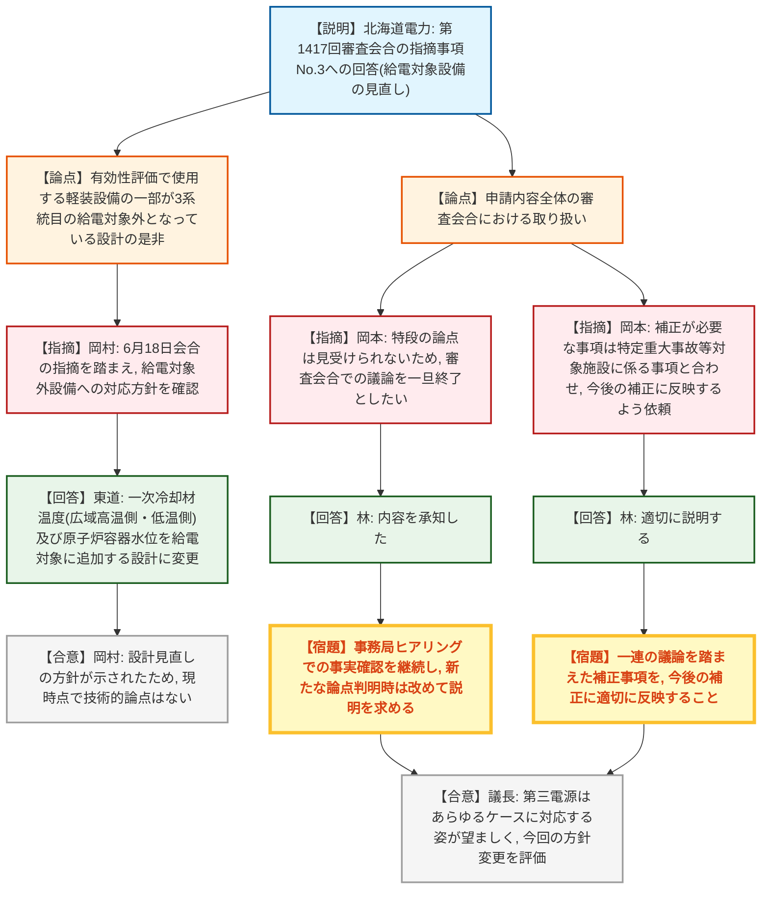

# 第1429回原子力発電所の新規制基準適合性に係る審査会合（令和8年8月25日）
> 出典 : https://youtube.com/live/jnaZaNABzXQ?si=cqcwyrZfDCoHMUvv

## 会合の概要
* **冒頭、北海道電力から泊発電所構内での死亡事故について報告・謝罪**
  防潮堤建設に伴うセメント改良土製造設備の骨材運搬用ベルトコンベア付近で、33歳の作業員が死亡する事故が先週発生したことが報告された。北海道電力は工事を一旦全て停止し、それぞれの安全確認を行った上で順次再開する方針を説明した。
* **泊発電所3号炉「所内常設直流電源設備（3系統目）」設置に係る前回指摘事項への回答**
  第1417回審査会合（令和8年6月18日）で示された指摘事項のうち、「3系統目の給電対象から有効性評価で使用する一部設備が外れている設計」について、北海道電力が対応方針を説明した。
* **給電対象外だった軽装設備を3系統目の給電対象に追加する設計変更**
  従来は代替パラメーターで対応可能として給電対象外としていた一次冷却材温度（広域高温側・広域低温側）及び原子炉容器水位について、有効性評価上の必要性を踏まえ、3系統目（蓄電池3系統目、6000Ah）からの給電対象に追加し、容量算定根拠も見直した。
* **規制側は技術的論点なしと判断し、本申請に関する審査会合での議論を一旦終了**
  規制庁は、事務局ヒアリングによる事実確認は継続するとした上で、新たな論点が判明した場合には改めて審査会合での説明を求めるとした。
* **議長より、第三電源（3系統目）はあらゆるケースに対応する設計が望ましいとのコメント**
  条件付きでの利用にとどまらず、あらゆるケースに対応できる姿が望ましいとし、今回の給電対象拡大の方針変更を好ましいと評価した。

---

## 議題ごとの詳細整理

### 【議題1】北海道電力（株）泊発電所3号炉の所内常設直流電源設備（3系統目）の設置に係る設置変更許可申請の審査について
* **議論の背景と論点:**
  第1417回審査会合（令和8年6月18日）で示された3件の指摘事項のうち、指摘事項No.1（3系統目設置に伴う重量増分の原子炉建屋への影響）及びNo.2（新設火災区域の火災防護設計の詳細）は別途、耐震・火災関連の審査会合で説明されるものとされ、本会合では指摘事項No.3（3系統目の給電対象が有効性評価で使用する設備の一部について給電対象外となっている設計の是非）への回答が論点となった。

* **質疑応答（詳細）:**
    * 【説明者側】金田（北海道電力）
      本題に先立ち、防潮堤建設に伴うセメント改良土製造設備の骨材運搬用ベルトコンベア付近で33歳の作業員が死亡する事故が先週発生したことを報告し謝罪した。全工事を一旦停止し、それぞれの安全性を確認した上で順次再開していく方針を説明した。
    * 【説明者側】東道（北海道電力）
      指摘事項No.3について、有効性評価の各シナリオで直流電源からの電源供給が必要な設備を再整理した結果、従来は代替パラメーターで対応可能として3系統目からの給電に期待しない扱いとしていた一次冷却材温度（広域高温側・広域低温側）及び原子炉容器水位を、3系統目の給電対象に追加する設計へ変更したと説明した。給電元をA/B直流母線間で切り替え可能な電路構成を追加することで実現し、負荷一覧表に基づく容量算定根拠も見直した上で、蓄電池3系統目（容量6000Ah）が全交流動力電源喪失時に24時間にわたり直流電力を供給できることを確認したと報告した。
    * 【規制側】岡村（規制庁）
      6月18日の会合での指摘内容（給電対象外となる設備について、有効性評価と同等の対応が可能であることの説明、又は給電対象となるよう設計を見直すことのいずれかを求めた経緯）を振り返った上で、今回、給電対象外だった軽装設備を給電対象に追加する設計変更方針が示されたことから、現時点で技術的論点はないとの見解を示した。
    * 【説明者側】東道（北海道電力）
      岡村の見解に対し、特段補足することはない旨を回答した。
    * 【規制側】岡本（規制庁）
      全体を通じて、本申請内容については現時点で特段の論点は見受けられず、今回をもって審査会合での議論は一旦終了になるものと認識していると述べた。他方、今後の事務局ヒアリングによる事実確認は継続し、その中で新たな論点が明らかになった場合には、改めて審査会合での説明を求めるとした。
    * 【説明者側】林（北海道電力）
      岡本の発言内容について、当社も承知している旨を回答した。
    * 【規制側】岡本（規制庁）
      今回の一連の議論等を踏まえ補正が必要な事項があれば、特定重大事故等対象施設の設置に係る事項と合わせて、今後行われる補正において適切に反映するよう求めた。
    * 【説明者側】林（北海道電力）
      適切に説明させていただく旨を回答した。
    * 【議長】（規制庁）
      いわゆる「第三電源」は、さらなる安全性向上のためのものであり、条件付きで利用できるのではなく、あらゆるケースに対応できる姿が望ましいと考えていると述べ、今回の給電対象拡大という方針変更を好ましいと評価した。これに対し北海道電力から特段の発言はなかった。

* **結論と宿題事項（アクションアイテム）:**
  * **決定事項:** 指摘事項No.3（給電対象外設備の扱い）について、有効性評価で使用する軽装設備（一次冷却材温度2点、原子炉容器水位）を3系統目の給電対象に追加する設計変更が示され、現時点で技術的論点はないものと確認された。本申請内容に関する審査会合での議論は今回をもって一旦終了となる。
  * **宿題事項:**
    1. 今後の事務局ヒアリングによる事実確認を継続し、新たな論点が明らかになった場合には改めて審査会合での説明を求める。
    2. 一連の議論等を踏まえて補正が必要な事項があれば、特定重大事故等対象施設の設置に係る事項と合わせて、今後の補正において適切に反映すること。

---

## 論理構造の可視化（Mermaid）

### 【議題1】泊発電所3号炉の所内常設直流電源設備（3系統目）設置に係る審査

