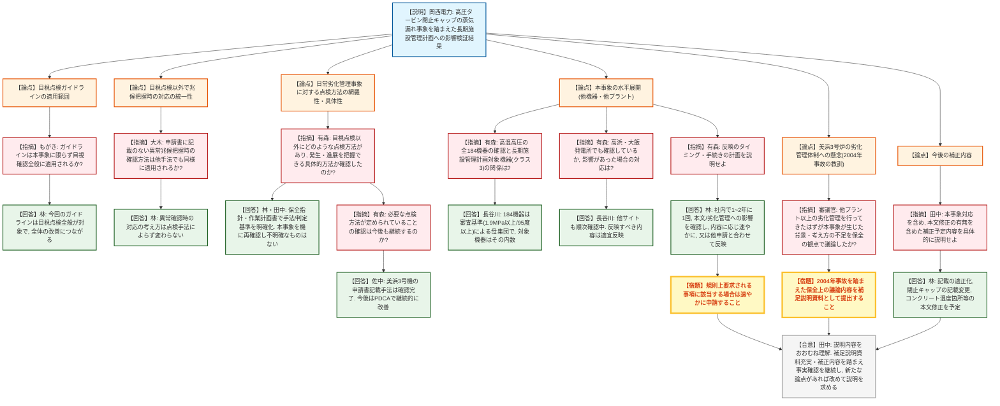
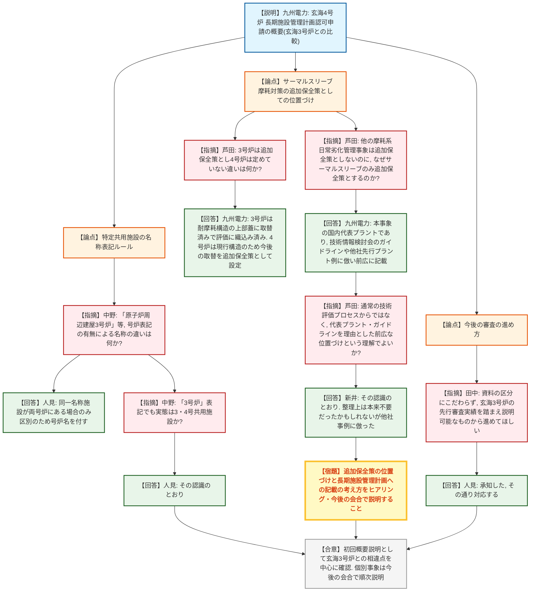

# 第34回実用発電用原子炉の長期施設管理計画等に係る審査会合（令和8年8月25日）
> 出典 : https://youtube.com/live/Tb1pO-Gb5fo?si=dP9lK2oT1FLw9iiZ

## 会合の概要
* **美浜3号炉：高圧タービン閉止キャップの蒸気漏れ事象を踏まえた長期施設管理計画への影響検証**
  関西電力は、5月8日に発生した高圧タービン閉止キャップの蒸気漏れ（流れ加速型腐食(FAC)による減肉が原因）を踏まえ、経年劣化事象の発生・進展、劣化管理の両観点から長期施設管理計画を検証した結果、見直しは不要と説明。技術評価書上は閉止キャップを車室から独立した部位として記載する変更のみを行う方針を示した。
* **規制側は目視点検改善策の適用範囲・他号機への水平展開を執拗に確認**
  規制庁（有森ら）は、今回策定した目視点検ガイドラインが特定事象に限らず点検全般に適用されるか、日常劣化管理事象の他の点検手法（寸法計測、応力腐食割れ検査、気密確認試験等）についても具体的方法が定められていることの確認プロセス、高浜・大飯発電所への水平展開状況を細かく追及した。
* **審議官から、2004年美浜3号機事故の教訓を踏まえた踏み込んだ補足説明の要求**
  審議官は、美浜3号炉が2004年の二次系配管破損事故以降、他プラント以上に炭素鋼の劣化管理を実施してきたはずであるにもかかわらず今回の事象が生じたことを踏まえ、保全の観点での議論内容を補足説明資料として改めて提出するよう強く求めた。
* **玄海4号炉：長期施設管理計画認可申請の初回概要説明（玄海3号炉との比較）**
  九州電力は、2027年7月に運転開始30年を迎える玄海4号炉の申請概要を、先行する玄海3号炉との相違点（MOX燃料の不使用、特定共用施設の範囲、サーマルスリーブ摩耗対策、基準地震動SS6・SS7への対応等）を中心に説明した。
* **サーマルスリーブ摩耗対策の「追加保全策」としての位置づけに規制側が疑義**
  九州電力が原子炉容器上部蓋の取替えを追加保全策として記載した根拠が、技術評価プロセスによる抽出ではなく代表プラント・業界ガイドラインを踏まえた事業者独自の判断であることが判明し、規制庁（芦田）は長期施設管理計画への記載の考え方の明確化を今後の会合で引き続き求めることとなった。

---

## 議題ごとの詳細整理

### 【議題1】関西電力（株）美浜発電所3号炉の長期施設管理計画認可申請に係る審査について
* **議論の背景と論点:**
  2026年5月18日の前回審査会合で、5月8日発生の高圧タービン閉止キャップからの蒸気漏れ事象を踏まえ「申請内容に反映すべき事項があれば整理して説明する」よう指摘されたことを受け、関西電力が回答。閉止キャップの内面が流れ加速型腐食(FAC)により減肉した原因・対策と、長期施設管理計画（経年劣化事象の発生・進展、劣化管理の各観点）への影響の有無、及び目視点検を中心とした点検体制全般の妥当性が論点となった。

* **質疑応答（詳細）:**
    * 【説明者側】林・長谷川・田中・佐中（関西電力）
      閉止キャップは炭素鋼製の高圧タービン射出（ロータ周り）の一部としてFACを想定していたが、目視点検で表面荒れを確認しながら減肉を示す劣化情報と認識できず損傷に至った。対策として、内面をステンレス鋼で肉盛りした閉止キャップへの取替と、目視点検の着眼点を明確化したガイドラインの整備等を実施し、検証の結果、経年劣化事象の発生・進展、劣化管理いずれの観点でも長期施設管理計画本文の見直しは不要と判断したと説明した。
    * 【規制側】もがき（規制庁）
      技術評価書に記載されている「懸念劣化事象に関する技術的評価」への対応は、本事象に限らず申請書に記載された目視確認全般に適用されるものと理解してよいか確認した。
    * 【説明者側】林（関西電力）
      今回策定した目視点検ガイドラインは今回のFAC事象専用ではなく目視点検全般を対象としたものであり、目視点検全般の改善につながると回答した。
    * 【規制側】大木（規制庁）
      技術評価書には異常やその兆候を把握した場合の確認方法が記載されているが申請書にはその記載がない。目視点検以外の方法で兆候を把握した場合も同様に確認・評価が行われるという理解でよいか確認した。
    * 【説明者側】林（関西電力）
      異常が確認された場合の対応の考え方は、点検手法によらず変わらないと回答した。
    * 【規制側】有森（規制庁）
      日常劣化管理事象の劣化管理という観点から、目視点検以外にどのような点検（寸法計測、応力腐食割れに対する探傷検査、亀裂診断、気密確認試験等）が定められているか、それらが発生・進展を把握できる具体的な方法となっていることをどのように確認したか、また今後もその確認を継続するのか説明を求めた。
    * 【説明者側】林・田中・佐中（関西電力）
      点検内容は保全指針・作業計画書で確認手法・判定基準を明確化しており、今回の事象を機に再確認し不明確なものがないことを確認したと回答。全ての点検手法に個別ガイドラインがあるわけではないが、日常保全のPDCAの中で改善しており、目視点検ガイドラインの制定もその一環であるとした。美浜3号炉の申請書記載の点検手法についての確認は既に完了しており、今後は保全のPDCAとして継続的な改善を図ると説明した。
    * 【規制側】有森（規制庁）
      本事象の水平展開について、高温高圧の全184機器を対象とした確認と、長期施設管理計画の対象機器（クラス3機器）との関係、及び高浜・大飯発電所での確認状況と影響があった場合の反映方法を確認した。
    * 【説明者側】長谷川・林（関西電力）
      184機器は長期施設管理計画の審査基準（1.9MPa以上又は95℃以上）で抽出した母集団であり、長期施設管理計画の対象機器はその内数として含まれると説明。他サイトも順次確認中であり、反映すべき内容があれば適宜反映するとした上で、社内では少なくとも1～2年に1回、本文記載事項・劣化管理の考え方への影響という観点で確認しており、内容に応じて速やかな申請、又は他の申請と合わせた反映を行うと回答した。
    * 【規制側】審議官
      美浜3号炉は2004年の事故を踏まえ、二次系炭素鋼の劣化管理を他プラント以上に実施してきたはずであるにもかかわらず今回の事象が生じたことを指摘し、保全の観点でどのような議論・検討がなされたかを、詳細な補足説明資料として改めて提出するよう求めた。
    * 【説明者側】関西電力
      補足説明資料として改めて説明する旨、了承した。
    * 【規制側】田中（規制庁）
      5月以降のヒアリングでの事実確認を踏まえ、本事象対応を含め、本文記載を含めた補正予定の内容を具体的に説明するよう求めた。
    * 【説明者側】林（関西電力）
      現時点で明確な補正内容として、一部記載の適正化、及び閉止キャップに関する記載変更に加え、前回会合で説明したコンクリート温度に関する箇所など本文記載事項についても補正予定であると回答した。

* **結論と宿題事項（アクションアイテム）:**
  * **決定事項:** 今回の閉止キャップ蒸気漏れ事象について、経年劣化事象の発生・進展及び劣化管理の両観点から検証した結果、長期施設管理計画本文の見直しは不要と判断されたことをおおむね確認。技術評価書上は閉止キャップを車室から独立した部位として記載する変更を行う方針が了承された。
  * **宿題事項:**
    1. 目視点検以外の点検手法への影響検証の詳細、及び2004年事故の経緯を踏まえた保全上の考え方の議論内容について、補足説明資料として改めて提出すること。
    2. 高浜・大飯発電所等、他プラントへの水平展開の確認結果、及び影響が判明した場合の反映方針・タイミングについて、必要に応じて説明すること。
    3. 本文記載事項を含む今後の補正内容（記載の適正化、コンクリート温度関連箇所等）を確定し、事務局ヒアリングでの事実確認を経て反映すること。

---

### 【議題2】九州電力（株）玄海原子力発電所4号炉の長期施設管理計画認可申請に係る審査について
* **議論の背景と論点:**
  玄海4号炉は2027年7月25日に運転開始後30年を迎えることから、2026年7月2日に長期施設管理計画（30～40年）の認可申請を実施。本会合は初回であり、既に認可済みの玄海3号炉との相違点（MOX燃料の不使用、特定共用施設の範囲、追加保全策の内容、基準地震動SS6・SS7への対応等）を中心とした申請内容全体の概要が論点となった。

* **質疑応答（詳細）:**
    * 【説明者側】右田・人見（九州電力）
      玄海3号炉との比較を軸に、経年劣化に関する技術評価（低サイクル疲労、中性子照射脆化とPTS評価、照射誘起型応力腐食割れ、二相ステンレス鋼の熱時効、電気計装品・電気ペネトレーションの絶縁低下・気密性低下、コンクリート強度低下、テンドン緊張力低下等）はいずれも判定基準を満足すること、耐震・耐津波安全性評価も問題ないことを確認したと説明。追加保全策として、原子炉容器の疲労割れ、原子炉容器胴部の中性子照射脆化、低圧ケーブルの絶縁低下、炭素鋼配管母管のFAC、基準地震動SS6追加に係る評価、及びサーマルスリーブ摩耗に伴う原子炉容器上部蓋の取替えの6項目を抽出したと説明した。
    * 【規制側】中野（規制庁）
      資料60ページの特定供用施設の記載について、「原子炉周辺建屋3号炉」のように号炉名が付されている施設と付されていない施設（原子炉補助建屋等）がある理由について説明を求めた。
    * 【説明者側】人見（九州電力）
      3・4号炉に同一名称の施設が存在する場合のみ区別のため号炉名を付しており、同一名称の施設がなく特定の必要がないもの（原子炉補助建屋等）には号炉名を付していないと回答した。
    * 【規制側】中野（規制庁）
      「原子炉周辺建屋3号炉」という表記であっても実態は3・4号共用施設であるという理解でよいか確認し、その認識通りである旨の回答を得た。
    * 【規制側】芦田（規制庁）
      サーマルスリーブ摩耗事象に関する原子炉容器上部蓋の取替えについて、玄海3号炉は追加保全策として定めているが玄海4号炉では定めていないとされる違いの理由を確認した。
    * 【説明者側】九州電力
      玄海3号炉は既に耐摩耗構造を有する上部蓋に取り替え済みで、その構造を前提に評価を行っているため追加保全策としては抽出されていない一方、玄海4号炉は現行構造の上部蓋のまま評価しており、今後の取替えを追加保全策として定めていると回答した。
    * 【規制側】芦田（規制庁）
      サーマルスリーブ以外の摩耗に関する日常劣化管理事象は追加保全策として定めていないにもかかわらず、サーマルスリーブのみを追加保全策とした理由の説明を求めた。
    * 【説明者側】九州電力
      玄海4号炉は本事象（サーマルスリーブ摩耗）の国内代表プラントであり、国の技術情報検討会での議論を経てガイドラインが制定されたこと、また他社先行プラントの申請書にも同様の記載があることを踏まえ、前広に追加保全策として記載したと回答した。
    * 【規制側】芦田（規制庁）
      すなわち、高経年化対策上着目すべき経年劣化事象の抽出・健全性評価・追加保全策抽出という通常の技術評価プロセスから抽出されたものではなく、代表プラント・業界ガイドラインを理由とした事業者独自の前広な位置づけであるという理解でよいか確認した上で、他の摩耗系事象との位置づけの整合性が不明確であるとして、長期施設管理計画に何を記載すべきかの考え方について、ヒアリング及び今後の会合で引き続き確認したい旨を伝えた。
    * 【説明者側】新井（九州電力）
      その認識のとおりであり、日常劣化管理事象としての整理上は本来追加保全策に記載する必要はなかったかもしれないが、他社先行プラントの例に倣ったものであると説明し、記載の考え方について今後相談させていただきたいと回答した。
    * 【規制側】田中（規制庁）
      今回は概要説明であり、今後は個別事象について審査会合で詳細説明を行う方針に変更はないことを確認した上で、玄海3号炉の先行審査実績があることを踏まえ、資料上の区分にこだわらず説明可能な事項から順次説明するよう求めた。
    * 【説明者側】人見（九州電力）
      承知した、その方針で対応する旨を回答した。

* **結論と宿題事項（アクションアイテム）:**
  * **決定事項:** 玄海4号炉の長期施設管理計画認可申請について、玄海3号炉との相違点を中心とした概要が確認された。特定供用施設の名称表記ルールについては九州電力の説明で疑義が解消された。
  * **宿題事項:**
    1. サーマルスリーブ摩耗対策（原子炉容器上部蓋取替え）を追加保全策とする位置づけ、及び長期施設管理計画に記載すべき内容の考え方について、ヒアリング及び今後の審査会合で引き続き説明すること。
    2. 個別の経年劣化事象・追加保全策について、玄海3号炉の先行審査実績を踏まえ、資料の区分にこだわらず順次詳細説明を行うこと。

---

## 論理構造の可視化（Mermaid）

### 【議題1】美浜発電所3号炉の長期施設管理計画認可申請に係る審査

### 【議題2】玄海原子力発電所4号炉の長期施設管理計画認可申請に係る審査

