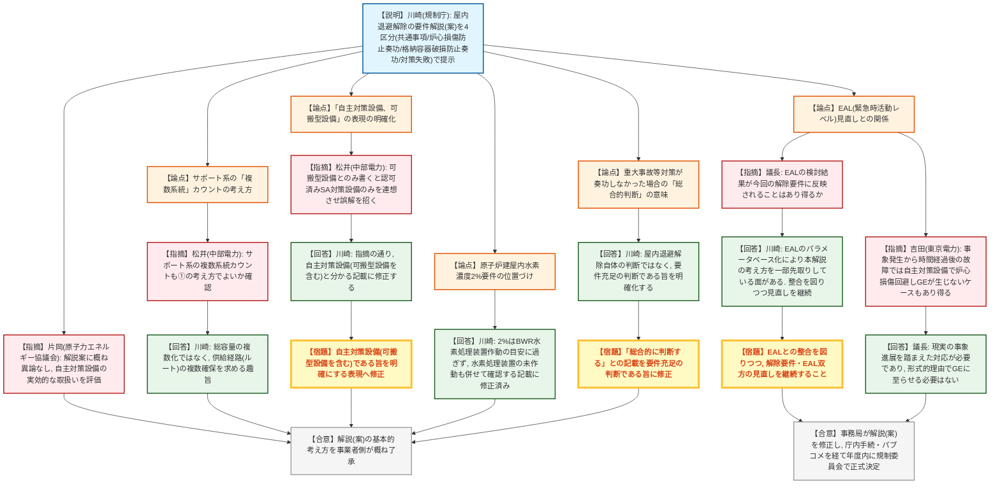

# 第18回緊急時活動レベルの見直し等への対応に係る会合（屋内退避）（令和8年8月25日）
> 出典 : https://www.youtube.com/live/qCVI5pMpwR8

## 会合の概要
* **規制庁が屋内退避解除の要件を定めた解説（案）を提示、事業者側から概ね了承**
  緊急事案対策室（川崎）が、5月13日会合での事業者意見を踏まえた原子力災害対策指針の解説（案）を説明。共通事項、著しい炉心損傷防止対策が奏功した場合、炉心損傷後に格納容器破損防止対策が奏功した場合、重大事故等対策がいずれも奏功しなかった場合の4区分で要件を整理し、事業者側からは概ね異論なしとの評価を得た。
* **「複数系統」の考え方はルート・経路の複数化を意味することを規制庁が明確化**
  中部電力からサポート系の複数系統カウントの考え方について確認があり、規制庁は総容量自体の複数化ではなく、水源・電源等の供給経路（ルート）が複数確保されていることを求める趣旨であると回答した。
* **「自主対策設備、可搬型設備」の表現が誤解を招く可能性があり、規制庁が修正を約束**
  可搬型設備とだけ記載すると認可を受けたSA対策上の可搬型設備のみを連想させるとの指摘を受け、自主対策設備（可搬型設備を含む）であることが明確になるよう解説案の記載を修正する方針が示された。
* **原子炉建屋内水素濃度2%要件は、水素処理装置の作動状況も合わせて確認する記載に修正**
  従来の「水素濃度2%以下」という数値は、BWR設置変更許可申請における水素処理装置作動の目安に過ぎず、これを上回れば直ちに建屋水素爆発に至るわけではないとの事業者意見を踏まえ、水素濃度の監視に加えて水素処理装置が作動していないことも確認する記載とした。
* **EAL見直し（パラメータベース化）との関係性や、現実の事象進展を踏まえた運用の必要性について意見交換**
  EALの検討結果が屋内退避解除要件に反映され得るかとの質問に対し、規制庁はパラメータベース化により本解説の考え方を一部先取りしている面があると回答。東京電力からは、事象発生からの時間経過により自主対策設備のみで炉心損傷を回避できるケースもあり得る旨のコメントがあった。

---

## 議題ごとの詳細整理

### 【議題1】屋内退避を解除できる原子炉施設の要件等の具体化
* **議論の背景と論点:**
  令和6年3月に設置された「原子力災害時の屋内退避の運用に関する検討チーム」の議論を経て、令和7年3月に報告書が取りまとめられ、これに合わせて原子力災害対策指針も改正済みである。同指針は、原子力施設の状態が安定して一定の要件を満たし、かつ新たにプルームが到達するおそれがなく、既に放出されたプルームも滞留しないことが確認できれば屋内退避を解除できるとしている。今回の解説（案）は、報告書が示した「①著しい炉心損傷を防止する対策が奏功した場合」「②炉心損傷後に格納容器破損を防止する対策が奏功した場合」「③重大事故等対策のいずれも奏功しなかった場合」という区分ごとの要件を、5月13日の事業者意見も踏まえて具体化したものであり、事業者からの読み方の確認・表現の明確化が主な論点となった。

* **質疑応答（詳細）:**
    * 【説明者側】川崎（規制庁・緊急事案対策室）
      解説案の共通事項として、原子炉が確実に停止し未臨界状態が維持されていること、保安規定の手順または代替パラメータにより施設状態を把握できていること、事業者から国へ必要な情報が適宜共有されていることを前提とすると説明した。あわせて、対策の実施体制が整い試運転等で稼働状況が確認できていれば、事業者間の融通により施設外から搬入された対策設備の使用も許容する旨を述べた。
    * 【説明者側】川崎
      「著しい炉心損傷を防止する対策が奏功した場合」の要件として、(1)注水・除熱機能について、インサービス1系統に加え待機中1系統以上（各系統が十分な冷却・除熱容量を保有）、(2)サポート系の複数系統確保、(3)炉心冷却水位・格納容器温度圧力等のプラントパラメータが安定または低下傾向にあることを説明した。使用済燃料プールへの注水はPWR・BWRで要件が異なり、BWRはプール沸騰に伴う建屋内環境悪化を避けるため、崩壊熱相当の注水量に加え崩壊熱相当の除熱手段も必要になると補足した。
    * 【説明者側】川崎
      「炉心損傷後に格納容器破損を防止する対策が奏功した場合」の5要件（注水・除熱の複数系統確保〔格納容器下部への注水を含む〕、サポート系の複数系統確保、格納容器温度・圧力の安定/低下傾向、原子炉建屋内水素濃度、外部支援の見通し）を説明した。水素濃度要件については、「2%以下」という数値がBWRの設置変更許可申請における水素処理装置作動の目安として示されていたものであり、これを上回れば直ちに建屋の水素爆発に至るとしているものではないとの事業者意見を踏まえ、水素濃度の監視状態に加えて水素処理装置が作動していないことも確認する記載とした旨を説明した。
    * 【説明者側】川崎
      重大事故等対策のいずれも奏功しなかった場合（格納容器破損等に至った場合）については、未臨界維持、炉心・使用済燃料プールの冷却確保、格納容器圧力の安定/低下傾向を要件としつつ、水素爆発による建屋損傷や火災に伴う放射性物質の再浮遊等、想定される状況が多岐にわたるため、これ以上の明確化は行わず、事故進展・施設状態・復旧策の信頼性等を踏まえた総合判断とする方針を説明した。あわせて、「総合的に判断する」という記載が屋内退避解除そのものの判断を意味するものではなく、あくまで要件充足の判断である旨が伝わるよう、解説案の記載を修正する意向を示した。
    * 【説明者側】松井（中部電力）
      解説案3ページ冒頭の「自主対策設備、可搬型設備」の許容に関する複数系統の考え方（3ポツ①・4ポツ①の複数系統要件の解説）を、サポート系（4ポツ②）の複数系統カウントにもそのまま適用してよいか確認した。
    * 【説明者側】川崎
      その理解でよいと回答し、「複数系統」とは水源・電源等の総容量自体が複数であることを求めるものではなく、その総容量から供給する経路・ルートが複数確保されていることを求める趣旨であると説明した。
    * 【説明者側】松井（中部電力）
      「自主対策設備、可搬型設備」という表現について、可搬型設備とだけ記載すると認可を受けたSA対策上の可搬型設備のみを連想させ、それが許容されるのは当然と受け取られかねないため、自主対策設備（可搬型設備を含む）である旨を明確にする趣旨か確認した。
    * 【説明者側】川崎
      指摘の通りであるとし、解説案の当該記載を修正すると回答した。
    * 【説明者側】片岡（原子力エネルギー協議会）
      これまでの論点提示と事業者意見交換を反映した解説案であり、概ね異論はないと表明した。自主対策設備（施設外からの搬入分や許認可を受けていない設備を含む）を実効性のある形で使用可能とした点、プラントパラメータについても複数の確認手段を組み合わせるコンセプトが反映されている点を良い点として評価した。
    * 【議長】
      本会合はEAL（緊急時活動レベル）の見直しに向けた対応の一環であるが、今回確認する解除要件が、今後のEAL自体の検討結果によって影響を受けることはあり得るか質問した。
    * 【説明者側】川崎
      現在検討中のEALのパラメータベース化が実現すれば、自主対策設備等の実力を反映してEALのフラグが立たなくなる場合があり、その意味で今回の解除要件の考え方を一部先取りしている面があると説明した。EAL見直し後は本解説の適用機会が減る可能性もあるとしつつ、EALとの整合を図る観点、および解説内容自体をより良いものにする観点の双方から、今後も見直しを継続する方針を述べた。
    * 【説明者側】吉田（東京電力）
      前回会合で示した事象進展フローは、運転停止直後に設備が故障し崩壊熱が高く事象進展が早いケースを想定したものであり、その場合は自主対策設備のみでは炉心損傷を回避できないと説明していたが、事象発生から時間が経過した後の設備故障であれば、遅れるほど設備の復旧余地が大きくなり、自主対策設備で炉心損傷を回避できる（緊急事態〔GE〕に至らない）ケースも十分考えられ、その場合は屋内退避解除の議論自体が生じない可能性もあるとコメントした。
    * 【議長】
      現在の議論は主に設置許可時の有効性評価シナリオ（事象進展が早いケース）に基づくことが多いが、配管破断のように現実に起こり得る事象の進展を踏まえ、実態に即した対応を検討することが求められているとの認識を示し、自主設備で収束できるケースを形式的な理由で緊急事態（GE）に至らせる必要はないと述べた。

* **結論と宿題事項（アクションアイテム）:**
  * **決定事項:** 提示された解説（案）の基本的な考え方（共通事項、区分ごとの要件、「複数系統」の考え方、水素濃度要件の位置づけ等）について、事業者側から概ね異論はなく了承された。
  * **宿題事項:**
    1. 「自主対策設備、可搬型設備」の記載について、自主対策設備（可搬型設備を含む）である旨が明確になるよう表現を修正すること。
    2. 重大事故等対策がいずれも奏功しなかった場合の「総合的に判断する」という記載について、屋内退避解除自体の判断ではなく要件充足の判断である旨が明確になるよう修正すること。
    3. 事務局は本日の議論を踏まえ解説（案）を修正し、庁内手続きを経た上でパブリックコメントにかけ、年度内に規制委員会での正式決定のプロセスに進めること。
    4. 令和8年度の事業者防災訓練等の機会に、各社が解説（案）に規定された内容の確認を試行すること。
    5. EALの見直し（パラメータベース化）の検討状況を踏まえ、今回の解除要件との整合を図りつつ、双方の見直しを引き続き検討すること。

---

## 論理構造の可視化（Mermaid）

### 【議題1】屋内退避を解除できる原子炉施設の要件等の具体化

