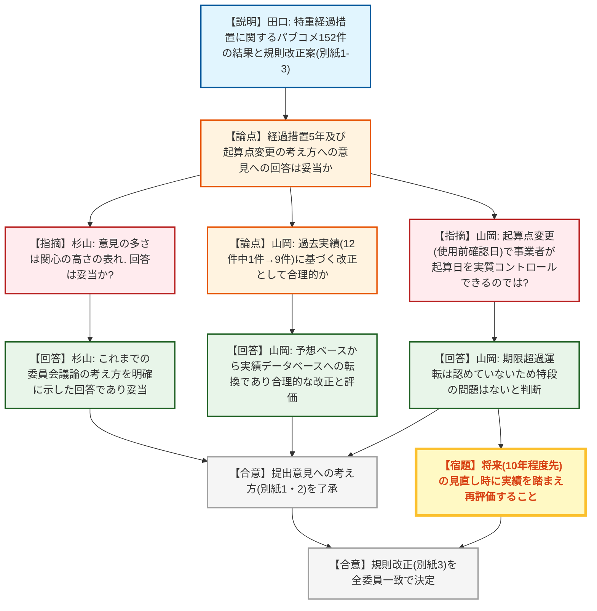
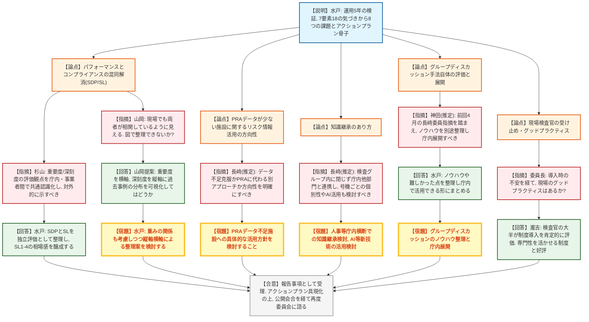
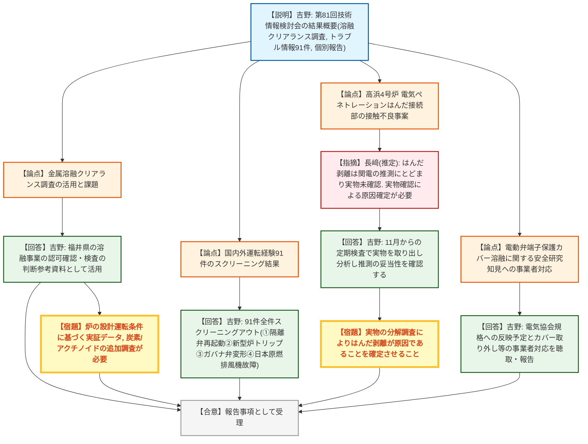

# 第28回原子力規制委員会（令和8年8月26日）
> 出典 : https://youtube.com/live/SsJhBUwWgzo?si=3hIvFC3HRnTttGD8

## 会合の概要
* **特定重大事故等対処施設（特重）の経過措置見直しに関する規則改正を決定**
  152件の意見公募（パブリックコメント）に寄せられた意見への回答案と規則改正案が審議された。委員からは「経過措置が一律5年から起算点変更（施行日→使用前確認日）に見直されたことで、過去実績（12件中1件しか間に合わなかった旧基準に対し、新基準では12件中9件が間に合う計算）に基づく合理的な改正である」との評価があり、意見への回答・規則改正案とも全会一致で了承・決定された。
* **原子力規制検査制度の運用5年を機とした自己検証（中間報告2回目）**
  制度導入時に目指した7つの要素について検証し、18個の気づきから8つの課題（リスク情報活用、コンプライアンス対応の明確化、スクリーニング判断のばらつき等）とアクションプラン骨子が報告された。特に「重要度評価（SDP）」と「深刻度評価（SL）」の混同解消が論点となり、両者の関係を軸（縦軸・横軸）で可視化して整理してはどうかとの具体的な提案が委員からなされた。
* **検査官の意識変化という「ソフト」な成果への評価**
  現場検査官へのグループディスカッションを通じ、従来のチェックリスト型検査から安全性維持を軸とする現行制度への転換により、検査官が自身の専門性を活かしやすくなったとの声が紹介され、委員長は心理的安全性と職員エンゲージメントの向上という観点からこれを高く評価した。
* **技術情報検討会での知見共有：金属溶融クリアランスと高浜4号炉のトラブル事案**
  金属溶融によるクリアランス測定に関する国内外調査結果、国内外運転経験情報91件のスクリーニング結果（全件スクリーニングアウト）、および高浜発電所4号炉の電気ペネトレーションはんだ接続部の接触不良事案について報告された。後者については、剥離が原因とする説明が現時点では推測にとどまっており、実物の分解調査による原因確定を求める意見が出された。

---

## 議題ごとの詳細整理

### 【議題1】実用発電用原子炉及びその附属施設の位置、構造及び設備の基準に関する規則及び技術基準に関する規則案に対する意見公募の結果及び規則の改正
* **議論の背景と論点:**
  特定重大事故等対処施設（特重）の経過措置（完成期限の考え方等）を見直す規則改正案について、6月3日の委員会で了承されたパブリックコメントの結果（152件の意見）への回答の妥当性と、規則改正案（起算点を施行日から本体施設の使用前確認日に変更）の是非が論点となった。

* **質疑応答（詳細）:**
    * 【説明】田口達也（原子力規制企画課長）
      パブリックコメントの結果、152件の意見が寄せられ、内容を5つのグループに分類し回答案（別紙1・2）を整理した。（1）経過措置5年の考え方（2016年時点の趣旨等）、（2）経過措置見直し自体の是非（規制緩和ではないかとの懸念）、（3）事業者との関係（特重を優先しない運転の可能性、経過措置の根拠が事業者意見ではないか等）、（4）自治体・住民の意見聴取、（5）規則の書きぶり、（6）その他の意見——のそれぞれについて、これまでの委員会での議論内容を踏まえた回答を用意したと説明。規則案本文についても、条文中の「同規則」を、直前で定義した「技術基準規則」という用語に統一する修正（意見公募で1件指摘があり反映）を行ったと報告した。
    * 【委員】杉山智之
      152件という意見の多さは本件への関心の高さの表れであり、回答内容はこれまでの委員会議論の考え方を明確にした上で改めて説明するものであり妥当と評価した。
    * 【委員】山岡耕春
      2016年までの議論と今回の議論の双方が回答に反映されている点を評価した上で、定量的な裏付けとして、旧経過措置（施行日起算）では特重完成が「間に合った」のは過去12件中1件だったのに対し、新基準（使用前確認日起算）では12件中9件（約8割）が間に合う計算になると指摘。従来「予想」に基づいていた判断が「実績データ」に基づく判断に変わった点を改正の合理性として評価した。また、意見公募の中にあった「起算点を事業者の工事進捗に左右される使用前確認日に変更することで、事業者が起算日を実質的にコントロールし得るようになるのではないか」との指摘について、鋭い視点だとしつつ、期限を超えた運転は認められていないため特段の問題はないとの見解を示した。ただし、将来（10年程度先）の見直し時には、この点についても実績を踏まえた再評価が必要になり得るとコメントした。
    * 【委員長】山中伸介
      杉山委員・山岡委員の発言を踏まえ、これまでの委員会での議論の考え方が回答に十分反映されていると総括。2016年当時は工事実績が全くなかったのに対し、今回は10年間の実績を踏まえた判断へと変化した点が今回の見直しの最大のポイントであるとし、将来的にさらに実績を積んだ段階で再度見直しが必要になる可能性にも言及した。

* **結論と宿題事項（アクションアイテム）:**
  * **決定事項:** 別紙1・2のとおり、提出意見に対する考え方を了承した。その上で、別紙3のとおり規則改正を決定した（出席委員が一人ずつ「決定してよいと考えます」と表明し、全会一致で決定）。
  * **宿題事項:** 特になし。ただし、今後10年程度の実績を踏まえ、必要に応じて制度の再見直しを検討する可能性がある旨、委員から言及があった。

---

### 【議題2】原子力規制検査制度の鍵となる要素に係る取組状況の検証の状況（中間報告2回目）
* **議論の背景と論点:**
  2020年に米国のReactor Oversight Process（ROP）を参考に導入された原子力規制検査制度について、運用開始から5年が経過したことを踏まえ、制度導入時に目指した7つの鍵となる要素それぞれについて、現状との差異を検証するもの。中間報告1回目（要素1〜3）に続き、残り4要素を含む7要素全体について検証チームが事業者・有識者からも意見を収集し、計18個の気づきから8つの課題とアクションプラン骨子を整理した。

* **質疑応答（詳細）:**
    * 【説明】水戸侑哉（検査監督総括課係長）
      抽出された8つの課題とアクションプラン骨子を報告。
      1. **リスク情報のさらなる活用**：PRA整備施設ではリスクインフォームド検査の具体的実現イメージが不足、PRA未整備施設ではリスク情報活用手法の提示が必要 → 検査官がPRA等を参照できる環境整備、定性的リスク情報の検索性向上等を実施。
      2. **低リスク施設へのグレーデッドアプローチの深化**：長期停止炉・廃止措置段階炉等へのより一層の適用が必要 → 検査サンプル数の最適化。
      3. **コンプライアンス違反対応の仕組みの明確化**：安全性に影響がない違反でも程度・性質に応じた評価とフォローアップの仕組みが必要 → 重要度評価（SDP）と深刻度評価（SL）を独立した評価として整理し、SL1〜4の相場感を醸成。
      4. **スクリーニング判断のばらつき**：軽微とするか指摘事項とするかの判断基準が訂正的で、検査官によるばらつきが大きい → 判断基準の明確化事例・解説の整備、ケーススタディによる共通認識の醸成。
      5. **施設種別・状況に応じたフリーアクセス**：施設事情等によりフリーアクセスが限定され事業者負担が生じる場合がある → 規模等に応じたフリーアクセスの相場感の醸成、検査官の振る舞いの周知徹底。
      6. **事業者との円滑なコミュニケーション**：現場でのコミュニケーション改善余地 → 意見交換会合等を通じた継続的改善。
      7. **力量維持・向上及び知識継承**：資格取得後の力量維持研修が受講しづらい、知識伝承の推進が必要 → 研修環境の改善、指導官・専門家による技術指導、知識管理の推進。
      8. **基本検査以外の対応に関する運用の明確化**：事故対応等における現行検査概念の記載が不十分で都度個別判断・委員会付議となっている（米国NRCは手順化済み）→ 追加検査・特別検査等の考え方・運用の明確化、技術的根拠の導入検討。
      なお4番目の要素「事業者の一義的責任」は6番目の要素の中で改善を図る方針とした。今後アクションプラン骨子を具現化し、公開会合で事業者・外部有識者の意見を聴取した上で委員会に諮る予定だが、当初説明していた上半期末（9月末）の目途からは後ろ倒しになる可能性があるとした。
    * 【委員長】山中伸介
      制度導入5年の節目での振り返りを自ら宿題として指示した経緯を説明。急ぐことなく現場検査官も含めてしっかり議論し結論を出すよう求めたものであり、今後の審査制度改善や、審査・検査のバランスの検討にも関係する重要な議論であると位置付けた。
    * 【委員】杉山智之
      振り返りに時間をかけたことについて、当初は時間をかけすぎではと感じたが、本庁からの視点だけでなく検査官同士のディスカッション等を通じた深い振り返りが行われており、時間をかける価値があったと評価。特に3つ目の課題（パフォーマンスとコンプライアンスの関係＝重要度評価と深刻度評価の関係・分離）について、規制側がどのような観点で評価しているかを規制側・事業者間で共通認識化した上で、対外的にも適切に説明できるようにすることが重要であるとコメントした。
    * 【委員】（発言内容から長﨑晋也委員と推定）
      具体的なアクションプランは実際に実効性のあるものにすべきとした上で、（1）PRA関連データが少ない施設について、データ不足を克服してPRA活用を目指すのか、別のアプローチを取るのか、方向性を明確にした検討を求めた。（2）7つ目の要素（知識継承）については、検査グループ内の議論に閉じず、人事等庁内の他部門とも連携して検討すべきとし、同じPWR・BWRでも号機ごとに性格が異なる点を踏まえ、AI等の新技術も活用しながら知識を次世代に伝承していくことを提案した。
    * 【委員】（発言内容から神田玲子委員と推定）
      グループディスカッションという手法自体が検査官の自己啓発に良い効果をもたらしているとの期待を示しつつ、前回4月の会合で長﨑委員から「意見が反映されないと今後意見が出にくくなる」との指摘があったことに触れ、手法の運用次第で職場環境への影響が変わり得ると指摘。実施を通じて得られたノウハウ（特にうまくいかなかった点）を、アクションプランとは別に整理しておくことを提案した。
    * 【説明】水戸侑哉
      グループディスカッションで得られたノウハウや難しかった点を整理し、庁内で活用できる形でまとめたいと回答した。
    * 【出席者（検査制度導入時の関係者）】
      検査官によって重視する要素（フリーアクセス、リスク情報活用、コンプライアンス等）が異なることが今回の議論を通じて可視化された点を、良い機会であったと評価した。
    * 【委員】山岡耕春（本人発言「山岡ですけども」で自認）
      現場検査への立会い経験はこれまで2回のみだが、今回整理された課題・アクションプランは理解の助けになったと述べた。委員会や報告で頻出する3つ目の課題（パフォーマンスとコンプライアンスの混同）について、現場でも両者が相関しているような印象を受けていたとし、重要度評価を横軸、深刻度評価を縦軸として過去事例の分布を図示すれば、整理・理解が進むのではないかと具体的な提案を行った。
    * 【説明】水戸侑哉
      SDPとSLの間には重みの関係等もあり得るとし、提案された縦軸・横軸による整理案も考慮しながら検討したいと回答した。
    * 【委員長】山中伸介
      自身が委員就任直後から関わった検査制度導入時の経緯（現場検査官の大きな不安、多いサンプル数への懸念、NRCインストラクターとの意見交換等）を振り返った上で、検査グループの瀧吉氏に現場のグッドプラクティスの有無を尋ねた。
    * 【説明】瀧吉幸嗣（専門検査部門企画調査官）
      グループディスカッションの結果、検査官からの意見は「この制度になって良かった」「さらに良くしていきたい」というものが大半だったと報告。従来の法令適合性中心のチェックリスト型検査から、安全性維持を軸とする現行の原子力規制検査制度への転換により、検査官が自身の専門性をより活かせるようになったとの声が多いと説明した。
    * 【委員長】山中伸介
      検査に限らず、まず職員の心理的安全性が確保されていることが、様々な意見が自然に出てくる環境の土台となり、それが職員のエンゲージメントにつながるとの見解を述べ、従来のチェックリスト遵守型から、安全確保に自らの技能を発揮するという、より主体性を持った業務姿勢への転換がうかがえるとコメントした。今後、審査と検査のバランスを検討する必要があるとし、引き続き十分な時間をかけて議論を進めるよう検査グループに要請した。

* **結論と宿題事項（アクションアイテム）:**
  * **決定事項:** 本件は報告事項として受理された（規則改正等の決定事項はなし）。
  * **宿題事項:**
    1. アクションプラン骨子を具現化し、検査グループ全体での議論、公開会合における事業者・外部有識者からの意見聴取を経て、改めて委員会に諮ること（当初目途としていた9月末からのスケジュール後ろ倒しの可能性あり）。
    2. 重要度評価（SDP）と深刻度評価（SL）の関係整理にあたり、縦軸・横軸による可視化案（山岡委員提案）も含めて検討すること。
    3. PRAデータが少ない施設について、データ不足克服の方向性を含む具体的な検討を行うこと。
    4. 知識継承について、検査グループ内に閉じず庁内の他部門（人事等）とも連携して検討し、号機ごとの個別性やAI等新技術の活用も視野に入れること。
    5. グループディスカッション手法の運用ノウハウ（うまくいった点・いかなかった点）をアクションプランとは別に整理し、庁内の他分野でも参考にできるようにすること。

---

### 【議題3】第81回技術情報検討会の結果概要
* **議論の背景と論点:**
  令和8年7月30日に開催された第81回技術情報検討会の結果概要として、（1）金属溶融によるクリアランス測定に関する調査研究知見、（2）国内外の運転経験（トラブル）情報91件のスクリーニング結果、（3）高浜発電所4号炉の電気ペネトレーションはんだ接続部の接触不良事案、（4）電動弁の端子保護カバー溶融に関する安全研究知見――が報告された。

* **質疑応答（詳細）:**
    * 【説明】吉野亜文（技術基盤課長）
      金属溶融クリアランスについて、規制庁が実施した調査（令和5年スウェーデン、令和6年ドイツの実地調査に加え、複数の受入元からのスクラップを混合して溶融処理する米国の事例調査、金属溶融用高周波誘導炉の性能調査）の結果をNRA技術ノートとして公表したと報告。今後、福井県で検討されている溶融事業のクリアランス認可確認手続きや検査等の判断参考資料として活用する方針とし、溶融インゴットの放射能濃度は溶融炉の性能・容量・運転状況等により変動するため炉の設計運転条件に基づく実証データが必要であること、コバルト・セシウム等の移行傾向は把握できたが炭素・アクチノイドについては情報がなお不足しており追加調査が必要であることを説明した。
      続いて、国内外運転経験情報のスクリーニングについて、一次スクリーニング対象91件は全てスクリーニングアウトとしたと報告。個別報告した事案は次の4件：
      ① 米国BWRで定期点検中に閉止した隔離弁を開放しないまま再起動した事案 → 国内プラントでは起動前に弁の状態を複数人で確認する運用のためスクリーニングアウト。
      ② 米国の新型BWRが試運転中にトリップした事案（新型炉特有の運転特性を十分反映していない運用が原因）→ 国内に同型炉がないためスクリーニングアウト。
      ③ 米国PWRでタービン駆動非常用給水ポンプのガバナ弁部品の変形によりトリップした事案（NRC検査報告書で事業者の保全管理の問題と特定）→ 事業者固有の保全管理上の問題としてスクリーニングアウト。
      ④ 日本原燃・再処理施設の排ガス処理設備排風機の故障事案（回転数系ケーブルの脱落による誤認起動でA・B系統が同時運転しA系統が過熱・故障。設備の負圧は維持され安全機能への影響はなく、事業者はケーブルの増し締め等の再発防止策を実施）→ スクリーニングアウト。
      さらに、令和5年1月に関西電力高浜発電所4号炉で発生した、制御棒駆動装置の電気ペネトレーションのケーブルはんだ接続部の接触不良による自動停止事案について、関西電力が11月から実施する定期検査の中で該当部分を取り出して分解調査を行う計画が報告されたと説明した（この事案について杉山委員から、はんだ剥離の原因を今後の調査でしっかり確認するよう指示済みであることも紹介）。
      最後に、原子力規制庁の安全研究において、電動弁を用いた試験で駆動部が高温になった場合に端子の保護カバーが溶け落ち駆動部に悪影響を与える可能性があることが判明した事案について、事業者の取り組み状況（電気協会規格への反映予定、カバー取り外し等の対応）を聴取した結果を報告した。
    * 【委員】（発言内容から長﨑晋也委員と推定）
      高浜4号炉の電気ペネトレーションの件について、はんだ接続部が剥離したという説明は現時点では関西電力の推測にとどまっており、実物はまだ確認されていない点を指摘。原因を確定させるためには、実際に取り外した実物の分析による確認が必要であり、関西電力に対し確実な調査継続を求めるべきとコメントした。
    * 【説明】吉野亜文
      計画どおり実物を取り外して分析を行い、推測が正しかったかどうかをしっかり確認してもらう旨、確認的に回答した。

* **結論と宿題事項（アクションアイテム）:**
  * **決定事項:** 本件は報告事項として受理された。
  * **宿題事項:** 高浜発電所4号炉の電気ペネトレーションはんだ接続部について、11月からの定期検査で実物を取り出して分解・分析を行い、剥離が原因であるとの推測を確定させること。

---

## 論理構造の可視化（Mermaid）

### 【議題1】特重の経過措置見直しに係る規則改正

### 【議題2】原子力規制検査制度の鍵となる要素に係る取組状況の検証（中間報告2回目）

### 【議題3】第81回技術情報検討会の結果概要

