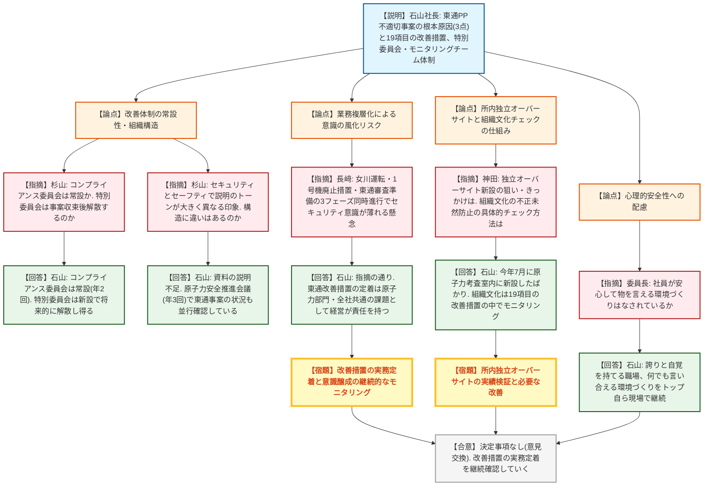
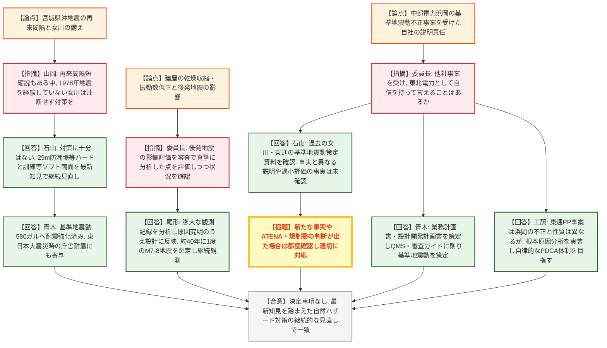
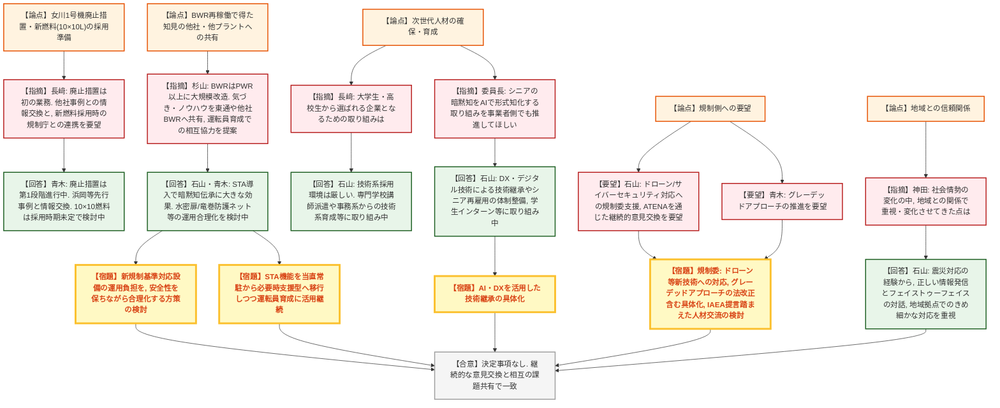

# 第29回原子力規制委員会臨時会議（令和8年8月26日）
> 出典 : https://youtube.com/live/zc3Z1lrnsOA?si=MotoG_6vxFzKm3lM

## 会合の概要
* **女川2号機の再稼働(2024年11月、国内BWR初・14年ぶり)に至る安全性向上の取り組みを東北電力が説明**
  実機体感研修やシフトテクニカルアドバイザー(STA)の導入など、運転員の経験値・技術力継承のための施策が紹介され、委員からは大きな問題なく運転が継続している点が評価された。
* **東通原子力発電所の核物質防護不適切事案への改善措置(19項目)と監視体制が論点に**
  「問い直す意識の弱さ」等3つの根本原因分析を踏まえた改善措置と、特別委員会・モニタリングチームによる二線監視体制が説明された。委員からは、パフォーマンス管理との構造的な違いや、業務の複層化に伴う意識の風化への懸念が指摘された。
* **女川周辺の地震活動を踏まえ、山岡委員・委員長が「油断のない対応」を重ねて要望**
  宮城県沖地震の再来間隔をめぐる専門家間の見解の相違や、東日本大震災後発地震による建屋の乾燥収縮・振動数低下の影響が話題となり、最新知見に基づく継続的な見直しの必要性が確認された。
* **中部電力浜岡発電所の基準地震動不正事案を受け、委員長が東北電力自身の姿勢を質問**
  社長・幹部から、過去の基準地震動策定において事実と異なる説明や過小評価の手法を用いた事実は確認されていない旨の説明があった。
* **事業者側から、グレーデッドアプローチの推進や自然ハザード審査プロセスの改善、IAEA提言を踏まえた人材交流、AI活用等、規制の継続的改善に向けた複数の要望が示された。**

---

## 議題ごとの詳細整理

### 【議題1】原子力規制委員会と東北電力株式会社経営層による意見交換

* **議論の背景と論点:**
  女川2号機の再稼働(2024年11月、BWRとして国内初)から約2年を迎える中、これまでの安全性向上の取り組みと、東通原子力発電所で判明した核物質防護に関わる不適切事案への改善措置の実施状況を東北電力が説明し、委員から自然ハザード対応・組織文化・人材育成・地域信頼確保等、多岐にわたる論点について質疑が行われた。出席者は原子力規制委員会側が山中伸介委員長、杉山智之委員、長﨑晋也委員、山岡耕春委員、神田玲子委員、東北電力側が石山一弘代表取締役社長、青木常務執行役員(原子力本部長)、尾形土木建築部長、工藤原子力部副部長。

* **質疑応答（詳細）:**
    * 【説明】石山一弘社長
      冒頭、本日の委員会で特定重大事故等対処施設の経過措置見直しに係る規則改正が了承されたことに触れ、工事実績を踏まえた規制の継続的改善によるものと認識していると述べ、女川2号機の特重の早期完成を目指す考えを示した。
    * 【説明】石山社長
      女川2号機が2024年11月に14年ぶり・国内BWRとして初の再稼働を果たし、現在第13サイクル目の運転を継続していること、東通原子力発電所は地震・津波に関する審査が大筋終了し敷地造成を前提としたプラント審査の準備を進めていることを説明。安全性向上に必要な「設備強化」「人材育成」「パフォーマンス向上」「危機管理」の4要素を挙げ、地域の理解と信頼をベースにこれらを継続的に改善する方針を示した。
    * 【説明】石山社長
      東通で判明した核物質防護不適切事案について、「問い直す意識の弱さ」「核物質防護業務の重要性の認識不足」「現場への関与不足」の3つを根本原因として特定し、社外の独立検証委員会の提言も踏まえた19項目の改善措置を策定・実施中であると説明。全社員向けコンプライアンス研修や経営層による現場対話等を通じ、社員一人ひとりが「自分ごと」として問い直す意識の醸成に取り組んでいると述べた。
    * 【指摘】杉山智之委員
      東通の不適切事案を受けて設置された特別委員会・モニタリングチームについて、上位に位置するコンプライアンス委員会が既存の常設組織か、また特別委員会は事案収束後に解散する位置づけかを質問した。
    * 【回答】石山社長
      コンプライアンス委員会は自身が委員長を務める常設組織で年2回程度開催していること、特別委員会はコンプライアンス担当副社長を委員長として今回新設した組織であり、事務局のリスクコンプライアンス統括部や原子力品質管理室等がモニタリングを担っていると説明。特別委員会自体は状況を見て将来的に解散し得る位置づけであると回答した。
    * 【指摘】杉山智之委員
      核物質防護(セキュリティ)への取り組みと、資料9ページで説明されたパフォーマンス向上(セーフティ)の取り組みとでアプローチの説明のトーンが大きく異なる印象を受けたとし、両分野ともコンディションレポートやキャップ会合等の仕組みは本来似通っているはずではないかと、その構造的な異同について尋ねた。
    * 【回答】石山社長
      資料の説明が不足していたとした上で、自身がトップを務め年3回開催する「原子力安全推進会議」において、QMS・品質面を含むPDCAの確認とあわせて東通の核物質防護事案の状況・改善措置の動向も並行して確認していると説明。日常的な小さな気づきを拾い上げる仕組みは核物質防護分野にも存在するとした。
    * 【指摘】長﨑晋也委員
      核物質防護事案への対応は現時点では意識が高まっていても、女川2号機の安定運転・1号機廃止措置・東通のプラント審査準備という性格の異なる3つのフェーズが同時進行する中で、時間の経過とともにセーフティ優先の意識に押されセキュリティ・セーフガードへの意識が薄れる懸念があるとし、社員一人ひとりへの意識の継続的な醸成を求めた。
    * 【回答】石山社長
      指摘の通りであるとした上で、女川・東通で複層化する業務全体をどう的確にこなすかが課題であるとし、東通の改善措置の定着は東通だけでなく原子力部門全体、さらには全社共通の課題と捉え、「自分ごと」として全社員に問題意識を持たせる取り組みを経営として責任を持って継続する考えを示した。
    * 【指摘】長﨑晋也委員
      女川1号機の廃止措置は東北電力にとって初めての業務であり、先行する中部電力等の事例や乾式貯蔵施設の先行事例も踏まえ、電力各社間で十分な情報交換をしながら進めてほしいと要望した。また、10×10燃料の型式証明が話題になる中、新燃料の採用を検討する際は規制庁とも十分にコミュニケーションを取りながら準備を進めるよう求めた。
    * 【回答】石山社長・青木常務(原子力本部長)
      石山社長は、他社の廃止措置・乾式貯蔵の取り組み状況をメーカーも含め確認しながら対応する考えを示し、10×10燃料についても燃料高度化の観点で有効性はあると認識しつつ、採用や申請時期は未定で今後検討していく段階であると回答した。青木常務は、女川1号機の廃止措置は現在第1段階として燃料搬出と放射線管理区域外設備の解体を進めており、今後の第2段階以降は浜岡等の先行プラントとの情報交換を密にする方針を説明。10×10燃料についてはBWRで型式証明審査が完了した実績を認識しており、熱的余裕の向上による安全性向上や高燃焼度化による廃棄物減少等のメリットがあると評価しつつ、採用時期は未定であると補足した。
    * 【指摘】山岡耕春委員
      女川発電所は宮城県沖地震の震源域が至近にあることに触れ、東日本大震災の発生後、専門家の間では宮城県沖地震の再来間隔が短くなった可能性を指摘する説がある一方でそうでないとする説もあり評価が分かれていると紹介。1978年の地震をほぼフルスペックで経験していない女川発電所において、いつ地震が起きても不思議ではないとの前提で油断なく対策を進めてほしいと要望し、現状の取り組みを尋ねた。
    * 【回答】石山社長・青木常務
      石山社長は、東日本大震災を経験した事業者として自然ハザード対応を極めて重要と認識しており、対策に「これで十分」はないとの考えのもと、国内最大級となる29メートルの防潮堤整備等ハード対策に加え、訓練の充実等ソフト面の対応も含め最新知見を踏まえた継続的な見直しを行っていく方針を説明した。青木常務は、宮城県沖地震の経験を踏まえ基準地震動を580ガルに引き上げる耐震強化を行っており、これが東日本大震災時の庁舎の耐震性確保にも寄与したと説明した上で、今後も最新知見に基づき必要な対策の要否を常に検討していく考えを示した。
    * 【指摘】山中伸介委員長
      山岡委員のコメントに関連し、東日本大震災の際に女川2号機で振動数の低下や建屋の乾燥収縮によるダメージが生じ、後発地震の影響が本震以上に大きかった可能性がある点について、新規制基準の審査の中で自社のコンクリート特性を真摯に分析していた点や、津波対策の防潮堤を基礎から作り直す決断をした議論の真摯さを高く評価した。その上で、中部電力浜岡発電所の基準地震動に関する不正事案(他社事案)を引き合いに、東北電力として自信を持って言えることがあれば聞かせてほしいと問いかけた。
    * 【回答】石山社長・青木常務・尾形土木建築部長・工藤原子力部
      石山社長は、浜岡の事案を原子力事業への信頼を著しく損なう重大な事案と認識しているとした上で、公表情報等をもとに女川・東通の過去の基準地震動策定資料を確認した結果、事実と異なる説明や基準地震動を過小評価する手法を用いた事実は確認されていないと回答した。ただし今後新たな事実やATENA・規制委員会の判断が示され次第、都度状況を確認し適切に対応する考えを示した。青木常務は、設置許可業務全体の枠組みの中でQMSに則った業務計画書・設計開発計画書を策定し、基準地震動の策定・審査ガイドへの対応を適切に行ってきていると補足した。尾形部長は、建屋の乾燥収縮や振動数低下について膨大な観測記録を分析して原因を明らかにし設計に反映したこと、宮城県沖・岩手青森沖ともに地震が比較的多く発生する地域であるとの認識のもと観測・分析・蓄積を継続し新知見を設計に取り込んでいく方針、および約40年に一度M7~8級の地震が来るとの想定で「答え合わせの時期」に恥じないよう取り組む考えを説明した。工藤(原子力部)は、東通のPP不適切事案は浜岡の「不正」とは性質が異なるものの、根本原因分析の結果を実務に実装し、規制からの縛りに頼らず自律的にPDCAを回せる業務体制を目指すことがゴールであるとし、現場に近いサイト側の機動力を生かした地元との情報公開・関係性維持が強みになり得ると述べた。
    * 【指摘】山中伸介委員長
      東日本大震災時の女川2号機の建屋の振動数低下等の損傷影響について、新規制基準の審査の中できちんと確認された上で現在の運転に至っていると理解しているとしつつ、規制委員会としてもその点を引き続き意識して見ていくとし、重ねて油断のない対応を求めた。
    * 【指摘】神田玲子委員
      資料9ページで説明された「所内独立オーバーサイト」の新設について、設置のきっかけや狙い・目的を尋ねた上で、狙いが明確であるほど新たな取り組みの効果が検証しやすいとコメントした。また、先月の規制委員会でも議題に上った組織文化に関わる規制検査(横断領域)は定点観測なしには気づきにくい問題であるとし、東北電力社内で不正・トラブルの未然防止のためにどのような点をチェックしているか説明を求めた。
    * 【回答】石山社長
      所内独立オーバーサイトは、JANSI等の組織からの意見も踏まえて検討し、今年7月に原子力考査室内に新設したばかりの組織であり、実績を積みながら必要な改善を図っていく考えを説明した。組織文化に関する部分については、東通の不適切事案の根本原因分析でも内部統制・ガバナンス・安全文化・核セキュリティ文化にまたがる経営課題として浮き彫りになったとし、19項目の改善措置計画の中で組織文化に関わる実施計画を進めながらモニタリングを行っていくと回答した。
    * 【指摘】神田玲子委員
      創業以来の「東北の繁栄なくして発展なし」との基本理念のもと、資料12ページで紹介された立地当初からの地域との取り組みについて、社会全体のリテラシー向上や福島第一事故・再稼働等の社会的経験を経て地域コミュニティ側の受け止めも変化してきていると考えられる中、社長自身が地域との関係で重視している点や時代とともに変化させてきた点について尋ねた。
    * 【回答】石山社長
      自身が福島第一原発から25キロの営業所長として東日本大震災の対応に当たった経験に触れ、地域から必要な物資や避難先の提供等の支援を受けられたのは、長年かけて築いてきた地域との信頼関係があったからだと説明した。正しい情報を伝え続けること、できることを真剣に考える姿勢、フェイストゥーフェイスでの率直な対話を重視しており、女川・東通に設けた地域拠点を通じてきめ細かな地域対応を継続していく考えを示した。
    * 【指摘】山中伸介委員長
      社員が安心して仕事ができ、物が言える環境づくり(心理的安全性)への配慮がなされているか尋ねた。
    * 【回答】石山社長
      東通の事案に限らず、社員には電力のプロとしての誇りと自覚を持って仕事をしてほしいと常々伝えていること、何でも言い合える職場環境づくりを重視し様々な場面で伝えてきたこと、経営トップとして現場に足しげく通い社員の考えや悩みを聞く姿勢を今後も続けていく考えを示した。
    * 【指摘】杉山智之委員(二巡目)
      国内BWRとして初めて再稼働を果たした女川2号機について、新規制基準対応でBWRはPWR以上に大規模な改造工事を要したと推測されるとし、改造後の運用で以前と使い勝手が変わり手間が増えた点や、対策設計上「こうしておけばよかった」という気づきがあれば、東通や他のBWR事業者に共有・活用してほしいと要望した。あわせて、資料3ページで紹介された稼働中プラントへの運転員派遣研修について、今後は逆に女川が他のBWR事業者の運転員育成に貢献できるのではないかとコメントした。
    * 【回答】石山社長・青木常務
      石山社長は、女川2号機という「生きたプラント」の存在が社員の経験蓄積に大きく寄与しているとし、14年ぶりの再稼働で原子力部門の運転未経験者が約4割を占める中、STA(シフトテクニカルアドバイザー)の導入効果は非常に大きかったとし、元当直長OBが持つ手順書に書き込まれない暗黙知を伝承できたと評価。再稼働後1サイクルで終了したこの取り組みの成果をいかに継続させるかが今後の課題であると述べた。青木常務は、水密扉・防火扉・竜巻防護ネット等、新規制基準対応設備の増加により現場作業の準備負担が増している実態を説明し、監視員配置による水密扉の開放運用や竜巻防護対策の簡素化、ホースの軽量化等、安全性を保ちながら運用面で改善を図る考えを示した。また、STAが伝えた臨界近接時の制御棒操作等の暗黙知を今後も運転員育成に活用しつつ、STA機能自体は当直常駐から必要時支援の形へ移行させる方針を説明した。
    * 【指摘】山中伸介委員長
      STAの活用や水密扉・竜巻防護ネットの運用に関する経験に基づく話は非常に貴重であるとした上で、対応の手間が10年20年後に負担として感じられるようになることを懸念し、同じ機能を維持したまま合理化できる方策の検討を求めた。また、東北電力がBWRマーク1型の同型炉を全基導入しているユニークな特徴を踏まえ、女川2号機で培った人材が東通や3号機でも生きるはずであり、他社にない堅実な人材育成が期待できるとコメントした。
    * 【指摘】長﨑晋也委員
      現在の人材育成の話は既に在籍する社員向けの取り組みであるとした上で、将来世代(大学生・高校生等)から選ばれる企業となるためにどのような独自の取り組みを行っているか尋ね、規制庁にとっても参考になるとコメントした。
    * 【回答】石山社長
      技術系(電気・土木等)人材の新卒採用環境は厳しさを増しているとし、遠隔地では工業高校の定員割れや大学進学率の上昇により高校卒人材の確保が特に困難であると説明。専門学校への講師派遣による2年間の人材育成や、事務系人材を技術系として育成する取り組み等、幅広い施策に取り組んでいるが、技術系採用の環境自体は依然厳しいと述べた。
    * 【指摘】山中伸介委員長
      規制委員会・規制庁も同様の課題を抱えているとした上で、シニアの持つ暗黙知を最先端のAI技術を用いて形式知に変える取り組みを事業者側でも進めてほしいと要望。規制委員会としてもAI技術の活用を議論しており、海外のサンドボックスプロジェクトにも参加して検討を進めているとし、既存の規制ルールにとらわれず、高精細カメラとAI診断による検査等、最先端技術の活用に事業者側からも積極的にチャレンジしてほしいと期待を示した。
    * 【回答】石山社長
      資料10ページで触れている技術継承へのDX・デジタル技術活用に取り組んでいる最中であるとし、高齢者の再雇用等シニア人材の継続的な活用や処遇・体制の整備、学生向けインターンシップや小中学生向けの認知向上活動等、次世代層への取り組みも進めていると補足した。
    * 【説明】石山社長(規制庁への要望・締めくくり)
      規制の継続的改善のため、ATENAを通じた技術的な意見交換を含め、今後も事業者との継続的な意見交換を要望。DXの推進については規制適合・セキュリティ面での慎重な検討が必要になるとしつつ、率直なコミュニケーションを重ねたいとした。また、ドローン対策・サイバーセキュリティ対策は事業者の取り組みが大前提としつつも、状況変化の速さや対応の多様化を踏まえ、警察・海上保安庁・自衛隊等の関係機関との連携に加え、規制委員会からの情報共有・対応能力強化への支援を要望した。
    * 【説明】青木常務
      許認可の届出変更やハザード認定等、規制側の対応に感謝を示した上で、限られた人的・物的リソースを重要な箇所に振り向けるグレーデッドアプローチの考え方が重要であるとし、今後もその実現に向けた提案・議論を継続したいとした。
    * 【説明】尾形土木建築部長
      DXやドローンを活用した保守点検への取り組みに加え、設計面でも最新技術の導入や新しい手法へのチャレンジを部員に促していると説明。東通での本格的な技術継承を見据え、地道な取り組みを次世代につなげていきたいと述べた。
    * 【説明】工藤原子力部
      女川2号機の再稼働にあたり北海道電力等他電力から運転員の出向支援を受け、若手が触発され相乗効果でモチベーション・技量が向上した実感があったとし、各社が再稼働する際に相互支援し合う「オール原子力」的な機運の醸成を提案した。また、現場の検査官・対策官と日頃からしっかりコミュニケーションを取りながら、より良いプラント運用を共に作り上げていきたいと述べた。

* **結論と宿題事項（アクションアイテム）:**
  * **性格:** 本会合は決定事項を伴う審議ではなく意見交換であり、正式な決定事項はない。
  * **東北電力側の宿題・対応事項:**
    1. 東通核物質防護不適切事案の改善措置(19項目)を実務に定着させ、特別委員会・モニタリングチームによる監視を継続するとともに、意識の風化を防ぐ全社的な取り組みを継続すること。
    2. 女川1号機の廃止措置・乾式貯蔵施設の整備にあたり、先行する中部電力等の事例や他社との情報交換を密に行うこと。10×10L燃料の採用を検討する際は規制庁と十分にコミュニケーションを取ること。
    3. 女川・東通の自然ハザード対応について、最新知見を踏まえた継続的な見直しを行い、油断のない対応を維持すること(委員長・山岡委員より重ねての要望)。
    4. 中部電力浜岡の基準地震動不正事案に関連し、新たな事実やATENA・規制委員会の判断が示された場合は都度状況を確認し適切に対応すること。
    5. STA(シフトテクニカルアドバイザー)導入等の再稼働で得た知見・ノウハウを東通や他のBWR事業者と共有すること。新規制基準対応設備に伴う現場作業負担について、安全性を維持しながら運用面での合理化を検討すること。
  * **原子力規制委員会側の宿題・対応事項:**
    1. ドローン・サイバーセキュリティ対策について、事業者からの情報共有・支援要望を踏まえ意見交換を継続すること。
    2. グレーデッドアプローチの実現に向け、法改正を含む具体的な取り組みを進めること(IAEAレビューへの対応)。
    3. 自然ハザードに係る審査プロセスについて、安全水準を維持しつつ不正が起きにくい環境づくりを山岡委員中心に検討すること。
    4. IAEAの提言を踏まえ、事業者と規制当局の人材交流の可能性を検討すること。
    5. AI・DX技術の検査等への活用について、サンドボックスプロジェクト等を通じた検討を継続すること。

---

## 論理構造の可視化（Mermaid）

### 【議題1-1】核物質防護不適切事案への改善措置・組織文化

### 【議題1-2】自然ハザード対応と浜岡基準地震動不正事案

### 【議題1-3】BWR再稼働の知見共有・人材育成・地域信頼確保

