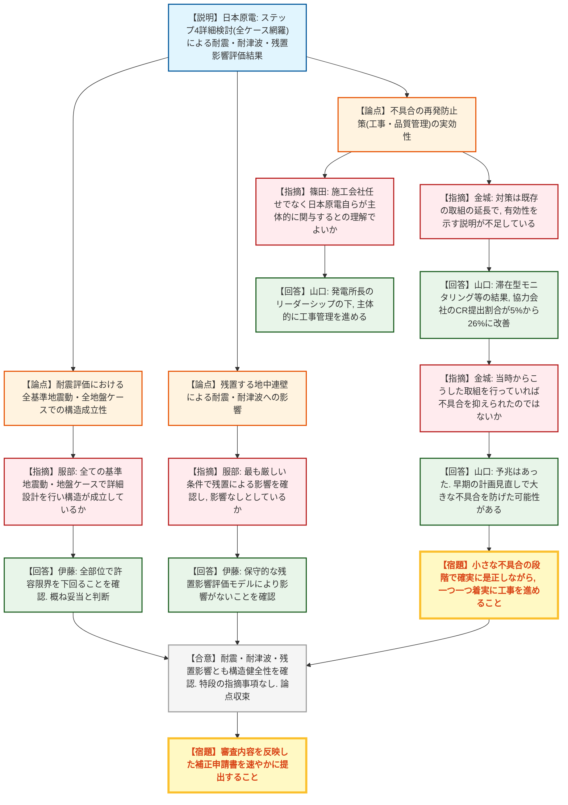
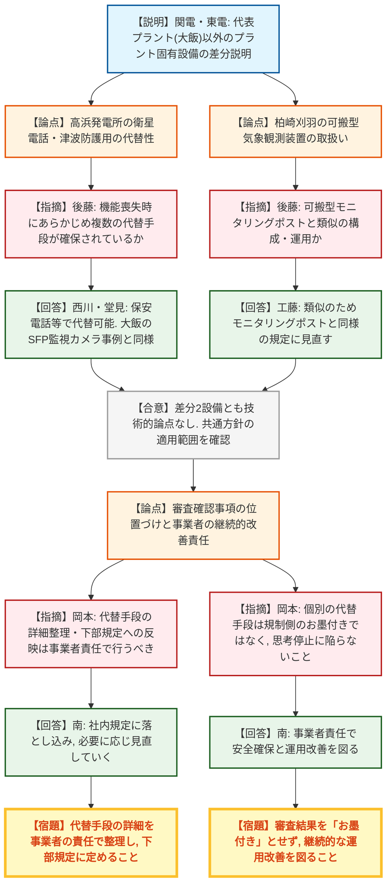

# 第1430回原子力発電所の新規制基準適合性に係る審査会合（令和8年8月27日）
> 出典 : https://youtube.com/live/pdxLniNrNKM?si=Z0H7Do6MOJCYzSGW

## 会合の概要
* **東海第二発電所の防潮堤（鋼製防護壁）構造変更審査が事実上収束**
  日本原子力発電から、地中連壁の施工不具合を受けた構造変更について、ステップ4の詳細検討（全ての基準地震動・津波・地盤ケース・評価対象部位を網羅した最終評価）の結果が説明された。規制庁は耐震・耐津波・残置する地中連壁の影響評価のいずれについても構造健全性・止水性が確保されると判断し、特段の指摘事項なしで主要な論点の審議は収束。事務局は「今回で会合が最後になる可能性が高い」との見解を示し、今後は補正申請の提出を待つ段階に移行した。
* **地中連壁不具合の再発防止策について、規制庁が「有効性の裏付け不足」を鋭く指摘**
  日本原電が提示したコンディションレポート（CR）活動の強化や「滞在型モニタリングオブザベーション」等の再発防止策に対し、規制庁委員から「既存の取組の延長にすぎず、有効性を示すデータが不足している」との厳しい指摘があった。日本原電はCR提出割合が協力会社ベースで5%（16件）から26%（59件）に改善したという定量データを追加提示し、一定の理解を得た。
* **保安規定変更（LCO見直し）は美浜・高浜・柏崎刈羽の差分確認で決着**
  関西電力・東京電力の重大事故等対処設備LCO見直しについて、代表プラント（大飯）以外の差分（高浜の衛星電話・津波防護用、柏崎刈羽の可搬型気象観測装置）が説明され、規制庁はいずれも代表プラントで確認済みの類似事例と同様であり技術的論点はないと判断。本件申請全体として論点は残っていないとの認識で一致した。
* **規制庁が「審査＝お墨付き」という誤解に強く釘を刺す**
  代替手段の詳細（衛星電話固定の故障時に携帯型通話装置等で代替する等）について、規制庁は「審査の場で個別事項に規制側がお墨付きを与えたわけではない」と明言。事業者が思考停止に陥り継続的改善を怠ることへの強い懸念を表明し、検査対応や運用改善は事業者自らの責任で行うよう念押しした。

---

## 議題ごとの詳細整理

### 【議題1】日本原子力発電（株）東海第二発電所の防潮堤（鋼製防護壁）の設計変更に係る設計及び工事の計画の変更認可申請の審査について
* **議論の背景と論点:**
  東海第二発電所の防潮堤（鋼製防護壁）は、施工中に地中連壁の不具合が確認されたことを受け、地中連壁を構造部材として考慮せず、新設の鋼管杭・巻き立て鉄筋コンクリートによる複合基礎と周辺地盤改良に設計を変更した。本会合はステップ4（詳細設計として実施すべき全ての条件を対象とした最終評価）の残りの説明であり、①耐震評価、②耐津波評価、③残置する地中連壁による影響評価、④ステップ3以降の設計進捗（部材仕様変更）の反映、の妥当性が論点となった。あわせて、不具合の根本原因である工事管理上の問題に対する再発防止策の実効性も論点となった。

* **質疑応答（詳細）:**
    * 【説明者側】伊藤（日本原電）
      ステップ4では、既工認（過去に認可を受けた設計）と同じ方針で、全ての基準地震動・地盤ケース・津波種別・評価対象部位を網羅的に評価。基礎・鋼製防護壁・接合部・地盤のいずれも許容限界（共有限界）を下回ることを確認し、止水機構についても許容限界内であることを確認した。ステップ3以降の設計進捗として、中実鉄筋コンクリート南基礎への先端補強筋の追加、巻き立て鉄筋コンクリートの鉄筋仕様変更を反映済みである。
    * 【規制側】服部（規制庁）
      耐震・耐津波ともに全ケース・全部位で構造成立性を確認していること、地中連壁を残置することによる影響評価においても最も厳しい条件で耐震・耐津波への影響がないとしていること、設計仕様の変更を考慮しても構造が成立するとしていることの4点を確認し、詳細設計の内容はおおむね妥当と判断。特段の指摘事項はない。
    * 【規制側】篠田（規制庁）
      前回指摘した再発防止の取組について、施工会社・協力会社任せにするのではなく、日本原電自らが主体的に現場に関与し、発電所長のリーダーシップの下で改善を徹底し、不具合の事前防止を図るという理解でよいか確認したい。
    * 【説明者側】山口（日本原電）
      今回の不具合は自身が発電所長時代に発見したものであり、重く受け止めている。発電所長の強いリーダーシップの下、日本原電が能動的・主体的に工事管理を進める。この方針は後任の発電所長にも引き継いでいる。
    * 【規制側】金城（規制庁）
      コンディションレポート活動の活性化や現場管理の強化は、従来から実施している取組の延長であり、他の工事にも一般的に適用できる内容に見える。既に実施している対策があれば、その有効性を示す具体的な説明が不足しているのではないか。
    * 【説明者側】山口（日本原電）
      発電所長時代の火災事象の多発を契機に、当社管理員・ベテラン社員・協力会社作業責任者の3者が現場に滞在して対話する「滞在型モニタリングオブザベーション」を実施している。CR活動についても協力会社への説明や投書箱の増設等を行った結果、協力会社からのCR提出割合は改善前の5%（16件）から、7月以降は26%（59件）まで向上しており、一定の効果が出ていると認識している。
    * 【規制側】金城（規制庁）
      対策には一定の有効性が見られる。ただし、今回の不具合を自身が所長として発見した経緯を踏まえると、こうした取組を当時から実施していれば、より早い段階で不具合を抑えられたのではないか。
    * 【説明者側】山口（日本原電）
      振り返れば不具合発生前に予兆的な兆候はあったと認識している。その時点で計画変更や施工計画の練り直しを行っていれば、これほど大きな不具合には至らなかった可能性がある。
    * 【規制側】金城（規制庁）
      小さな不具合の段階で工事を止め、見直しを行っていれば防げた可能性がある。スケジュールを優先するのではなく、不具合が生じるたびに是正しながら着実に工事を積み上げていくことが根本的な対策になるはずであり、しっかりとした管理を求める。
    * 【規制側】岡本（規制庁）
      ステップ4の詳細検討結果の説明を受け特段の指摘事項がなかったことから、主要な論点に係る審査会合での議論は収束したと認識している。今後は事務局ヒアリングで補足説明資料に対する事実確認を継続し、その内容を反映した補正申請の提出を求める。補正申請の確認において新たな論点が確認された場合は、改めて審査会合での説明を求めることがある。
    * 【説明者側】竹本（日本原電）
      これまでの審査内容を踏まえた補正書を速やかに提出できるよう準備を進める。事実確認の中で新たな論点が生じた場合は審査会合で確認されることも承知している。

* **結論と宿題事項（アクションアイテム）:**
  * **決定事項:** ステップ4の詳細検討により、構造変更後の防潮堤（鋼製防護壁）及び関連する止水機構は、耐震・耐津波・残置する地中連壁の影響のいずれについても構造健全性・止水性を確保する設計であることを規制庁が確認。特段の指摘事項はなく、主要な論点に係る審査会合での議論は収束したとの認識で一致した。事務局からは、今回が実質的に最後の審査会合となる可能性が高いとの見解が示された。
  * **宿題事項:**
    1. これまでの審査内容を反映した補正申請書を、日本原電が準備でき次第速やかに提出すること。
    2. 事務局ヒアリングでの事実確認の結果、新たな論点が確認された場合は改めて審査会合での説明に応じること。
    3. 地中連壁不具合の再発防止策（CR活動強化、滞在型モニタリングオブザベーション等）について、引き続き具体的なデータ等により有効性を示していくこと。
    4. 認可後の現場施工段階においても、一つ一つ確実に工事を進め、不具合が生じた場合は是正しながら進める管理を徹底すること。

---

### 【議題2】関西電力（株）美浜発電所、高浜発電所及び大飯発電所並びに東京電力ホールディングス（株）柏崎刈羽原子力発電所の保安規定変更認可申請（重大事故等対処設備及び特定重大事故等対処施設を構成する設備の運転上の制限に係る記載の一部見直し）の審査について
* **議論の背景と論点:**
  重大事故等対処設備の運転上の制限（LCO）に関する保安規定変更について、これまで2回の審査会合で大飯発電所を代表プラントとして全プラント共通の対応方針を確認済み。本会合では、代表プラント以外のプラント固有の差分（高浜発電所の衛星電話・津波防護用、柏崎刈羽原子力発電所の可搬型気象観測装置）及び特定重大事故等対処施設を構成する設備への共通方針の適用可否が論点となった。

* **質疑応答（詳細）:**
    * 【説明者側】西川（関西電力）
      高浜発電所は敷地高さ3.5mに対し想定津波高さ最大6.7mであり、大津波警報時は防潮ゲート閉止で対応するが、警報が発表されない津波（警報なし津波）に対しては潮位変動を検知してプラント停止・防潮ゲート閉止を行う運用としている。この対応のため、津波監視用の潮位計と、1・2号機と3・4号機の中央制御室間の連携を担う衛星電話・津波防護用（4台）を新たにLCO対象設備として設定した。同設備が4台未満となりLCOを満足しない場合でも、保安電話・運転指令設備等の補助設備により同等の連絡機能を代替できることを確認しており、この運用実態に合わせてLCO逸脱の判断基準を見直す。なお美浜発電所については代表プラント（大飯）との対応方針の差分はない。
    * 【規制側】後藤（規制庁）
      高浜の衛星電話・津波防護用について、機能喪失時にも保安電話・運転指令設備等、あらかじめ複数の代替手段が確保されていることを確認した。これは代表プラント（大飯）で確認した使用済燃料ピット監視カメラの事例と類似の状況であり、同様の対応方針を適用するものとして技術的な論点はないと考える。
    * 【説明者側】堂見（関西電力）
      高浜発電所の衛星電話・津波防護用は、大飯発電所で説明した使用済燃料ピットの監視カメラの対応と同様であり、補足事項は特にない。
    * 【説明者側】工藤（東京電力ホールディングス）
      柏崎刈羽原子力発電所6・7号機固有の設備である可搬型気象観測装置（衛星回線を使用したデータ伝送系）について、10分未満のデータ伝送機能の喪失は重大事故等対処への支障がないことから、可搬型モニタリングポストと同様の規定に見直す。それ以外は関西電力と同様の見直し方針であり説明は割愛する。
    * 【規制側】後藤（規制庁）
      柏崎刈羽の可搬型気象観測装置のデータ伝送系は、可搬型モニタリングポストと類似の設備構成・運用方法であり、同様の対応方針を適用するものとして技術的な論点はないと考える。
    * 【説明者側】工藤（東京電力ホールディングス）
      特に補足はない。
    * 【規制側】岡本（規制庁）
      本件申請全体を通じ、代表プラント（大飯）以外の差分として、高浜の衛星電話・津波防護用及び柏崎刈羽の可搬型気象観測装置の2設備の取扱方針を確認した。これら以外の設備には全プラント共通の対応方針が適用可能と認識している。また美浜・高浜・大飯の特定重大事故等対処施設を構成する設備の対応方針についても、全プラント共通方針が適用可能であることを確認した。以上から、本件申請全体として現時点で技術的な論点は残っていないと認識しているが、この認識でよいか。
    * 【説明者側】南（関西電力）
      岡本の認識のとおりであり、高浜の衛星電話・津波防護用及び特定重大事故等対処施設について、美浜・高浜・大飯を通じて共通方針で整理できるという点に異議はない。
    * 【規制側】岡本（規制庁）
      誤解のないよう念のため申し添えるが、今回確認したのはLCO設定対象設備の機能喪失時における代替手段の確保及びLCO逸脱判断の基本的な考え方であり、実際の運用にあたっては事業者自らの責任で代替手段の詳細をあらかじめ整理し、下部規定に必要な事項を定める必要がある。会合資料に示された代替手段は現時点における整理・考え方であり、今後必要に応じて見直されるものと考えるが、この認識でよいか。
    * 【説明者側】南（関西電力）
      今後、審査いただいた内容を社内規定にきちんと落とし込んだ上で運用し、必要に応じて見直していくことを承知した。
    * 【規制側】岡本（規制庁）
      資料2-1-2の9ページを例に、中央制御室の衛星電話固定の機能喪失時の代替手段（携帯型通話装置2台、衛星電話携帯1台、テレビ会議システム等2台等）について、こうした個別の詳細事項に規制側がお墨付きを与えたわけではないことを強調したい。事業者が「審査で認められた」と誤って解釈すると思考停止に陥り、継続的な運用改善が図られなくなることを懸念しており、今後の運用において十分配慮してほしい。この点も理解いただけるか。
    * 【説明者側】南（関西電力）
      事業者責任で安全を確保しつつ、運用の改善を図っていくという点を承知した。

* **結論と宿題事項（アクションアイテム）:**
  * **決定事項:** 美浜（大飯と差分なし）、高浜（衛星電話・津波防護用）、柏崎刈羽（可搬型気象観測装置）について、代表プラント（大飯）との差分に技術的論点はないことを確認。特定重大事故等対処施設を構成する設備を含め、全プラント共通の対応方針の適用性が確認され、本件申請全体として現時点で技術的な論点は残っていないとの認識で規制庁・事業者双方が一致した。
  * **宿題事項:**
    1. 事業者は、LCO設定対象設備の機能喪失時の代替手段の詳細を自らの責任で整理し、社内の下部規定に定めること。
    2. 会合資料に示された代替手段はあくまで現時点の整理であり、必要に応じて継続的に見直すこと。
    3. 原子力規制検査等の現場対応において、代替手段の妥当性を「審査で認められた」という受け身の説明にとどめず、事業者自らが理解した上で検査官に説明できる体制とすること。

---

## 論理構造の可視化（Mermaid）

### 【議題1】東海第二発電所の防潮堤（鋼製防護壁）構造変更審査

### 【議題2】保安規定変更（重大事故等対処設備LCO見直し）差分確認

