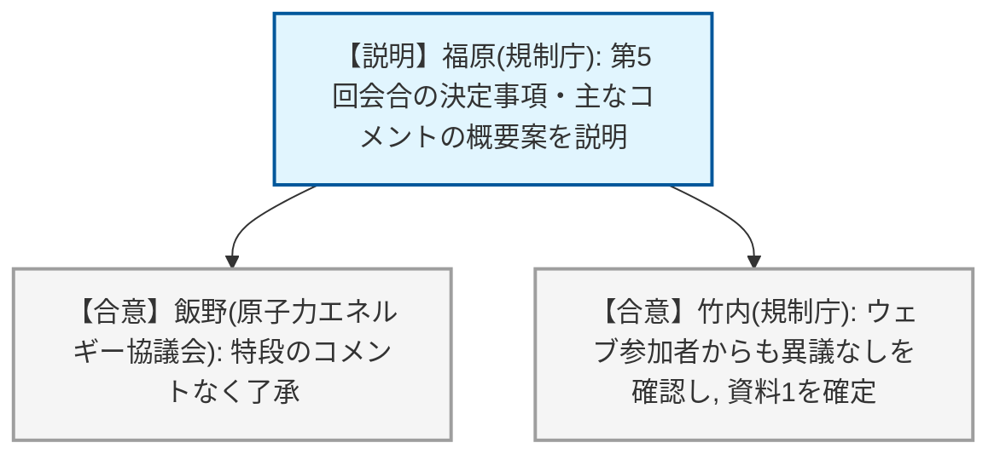
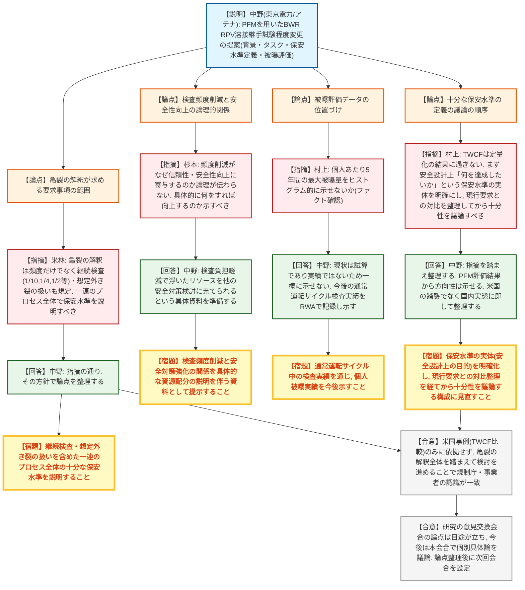

# 第6回リスク情報活用に関する事業者との実務レベルの技術的意見交換会（令和8年8月27日）
> 出典 : https://youtube.com/live/HOUkdGYU_8Q?si=WLLzgrQovDMNEftv

## 会合の概要
* **BWR原子炉圧力容器（RPV）溶接継手の非破壊検査（UT）頻度見直しに向けた本格的な技術論議が開始**
  原子力エネルギー協議会（アテナ）から、確率論的破壊力学（PFM）を活用し、現行の「供用期間10年で100%」というRPV一般部溶接継手の検査要求を、米国BWRの事例（周方向溶接線は非実施、縦溶接線のみ100%）を参考にリスクに応じた頻度へ変更したいとの提案があり、規制庁との実務レベルでの議論が本格的に始まった。
* **「検査頻度を減らせば安全性が向上する」というロジックの説明不足が繰り返し指摘される**
  緊急事態対策課の対策官から、検査頻度削減がなぜ設備信頼性向上や安全対策強化につながるのか、論理が読み手に伝わらないとの指摘があり、事業者（東京電力）は「検査時間短縮で浮いたリソースを他の安全対策検討に振り向けられる」という具体的な資料を準備すると回答した。
* **規制庁が「十分な保安水準」の議論の前提として、まず安全設計上の目的を明確にすべきと注文**
  評価室長から、TWCF（貫通き裂発生頻度）は結果指標に過ぎず、その前提として「本来何を達成したいのか（検査頻度削減という結果の前にある安全設計上の意図）」を明らかにした上で、現行の維持規格要求との対比を整理してから「保安水準として十分か」を議論すべきとの本質的な問題提起があった。
* **検査頻度だけでなく、亀裂の解釈が定める継続検査プロセス全体を視野に入れる必要性で規制・事業者が合意**
  規制庁評価室から、亀裂の解釈は単純な検査頻度だけでなく、供用期間の1/10・1/4・1/2等の時期に行う継続検査や想定外き裂の扱いも規定しているため、検査を省略する箇所を定めるならこれらのプロセス全体への対応を整理すべきとの指摘があり、米国事例のみに依拠せず亀裂の解釈全体を踏まえて検討を進めることで両者の認識が一致した。
* **研究レベルの意見交換会合は一定の目途が立ち、今後は本会合で個別具体論を進める方針**
  ソフトウェアのV&Vなど研究課題としての論点は研究の意見交換会合で検討の目途が立ったとされ、今後は主に本会合でTWCFの中身を明らかにする作業を進め、論点が定まった段階で次回会合を設定する方針が示された。

---

## 議題ごとの詳細整理

### 【議題1】第5回リスク情報活用に関する事業者との実務レベルの技術的意見交換会の概要（案）（資料1）
* **議論の背景と論点:**
  前回（第5回）会合で確認された決定事項・主なコメントの概要案について、規制庁から要点が読み上げられ、内容に相違がないか確認された。前回は、PFMを用いたRPV溶接継手試験程度の変更をリスク情報活用の対象として検討を進めること、アテナが技術根拠資料を整理すること等が決定事項として確認されている。

* **質疑応答（詳細）:**
  * 【説明者側】福原（原子力規制庁）
    前回会合の決定事項（PFMをリスク情報活用の対象として検討すること、アテナが十分な保安水準の確保を説明する技術根拠資料を作成すること等）と、主なコメント（検査頻度変更を正当化する動機づけの重要性、研究の意見交換会合との役割分担、不確かさの取り扱い等）の概要案を説明した。
  * 【説明者側】飯野（原子力エネルギー協議会）
    概要案の内容に特段のコメントはなく、その内容で了承する旨を回答した。
  * 【説明者側】竹内（原子力規制庁、進行）
    ウェブ参加の事業者にも異議がないか確認し、特段の意見がなかったことを確認した。

* **結論と宿題事項（アクションアイテム）:**
  * **決定事項:** 資料1（第5回会合概要案）の内容に異議はなく、原案どおり確定した。
  * **宿題事項:** 特になし。

---

### 【議題2】確率論的破壊力学（PFM）を用いた原子炉圧力容器溶接継手試験程度の変更について（資料2）
* **議論の背景と論点:**
  国内のBWR原子炉圧力容器（RPV）一般部溶接継手は、技術基準規則の解釈（亀裂の解釈）により維持規格の試験程度が読み替えられ、供用期間中の全溶接継手を対象に「10年で100%」の非破壊検査（UT）が要求されている。一方、米国のBWRでは中性子照射量の低さや溶接線ごとの破損リスクの違いを踏まえ、縦溶接線のみ100%実施し周方向は非実施とするリスク程度に応じた検査へ変更済みである。アテナは、PFM評価結果に基づき国内BWRでも同様にリスクに応じた試験程度へ変更したいとし、（1）試験程度変更までのタスクと役割分担・全体像、（2）技術基準規則に照らして「十分な保安水準」が確保されたと判断するための定義（案）、および被曝量評価の3点について説明・提案した。「十分な保安水準」の定義案は、現行（10年100%）のTWCF（貫通き裂発生頻度）と変更後のTWCFの差が十分小さければ保安水準は維持されるという考え方で、米国の10 CFR 50.61aにおけるTWCF許容基準（1×10⁻⁶/年）が参考として示された。

* **質疑応答（詳細）:**
  * 【説明者側】中野（東京電力／アテナ）
    資料2の全体構成を説明。試験程度変更を希望する背景（米国BWRとの比較、リスク程度に応じた検査への変更で設備信頼性向上・安全対策検討リソース確保・被曝低減が期待できること）、試験程度変更までのタスクと役割分担（NRC Regulatory Guide 1.245、EPRI/BWRVIP-05、JEAG4640等を参考に技術根拠資料の目次案を検討したこと）、十分な保安水準の定義（案）、被曝量評価の4点を説明した。研究の意見交換会合で扱ってきたソフトウェアのV&V等の論点は目途が立ったとし、今後は本会合で試験程度変更に必要な個別具体論を議論したいとした。
  * 【規制側】米林（原子力規制庁評価室）
    技術基準規則の解釈（亀裂の解釈）は検査頻度のみを規定しているのではなく、クラス1機器について進展のおそれのある欠陥があれば継続検査（供用期間の1/10・1/4・1/2等の時期の検査）を行うことや、想定外き裂等の扱いを追加要件として規定している。したがって、単に「10年100%」という頻度だけでなく、その後の評価・継続検査を含めた一連のプロセス全体を対象に十分な保安水準を説明する必要があるのではないか、との指摘を行った。
  * 【説明者側】中野（東京電力／アテナ）
    指摘のとおり対応すべきと考える、そのように整理することで試験程度変更の判断における論点がより明確になると回答し、この方針での検討を進めることとした。
  * 【規制側】杉本（緊急事態対策課）
    資料5ページ目の「試験頻度を変更することで設備の信頼性向上・安全性向上に寄与する」という説明が、文章のみでは論理的につながって読めない。作業品質確保や被曝低減、リソース確保による安全対策検討の深掘りといった複合的な効果として理解できるが、より分かりやすい説明と、具体的に何をすれば安全対策が向上するのかという内容を示す必要があるとの意見を述べた。
  * 【説明者側】中野（東京電力／アテナ）
    検査頻度が半減する等により工事管理等の負担が軽減され、浮いた時間を海外事象への対策検討など他の安全性向上策の検討に充てられるようになる、という具体的な資料を準備して説明したいと回答した。
  * 【規制側】杉本（緊急事態対策課）
    その説明を今後よく行ってほしいと回答した。
  * 【規制側】村上（原子力規制庁評価室、室長）
    資料17ページの被曝評価について、法定の被ばく限度（5年で100mSv）との対比で、個人あたり5年間の最大被曝量がどの程度になるかをヒストグラム的に示せないかとファクト確認を行った。
  * 【説明者側】中野（東京電力／アテナ）
    今回の被曝評価は実績ではなく試算であるため、一概に示すことが難しい。今後、通常運転サイクル中に検査を実施するプラントが出てくるため、その実績をRWA（線量管理記録）を通じて記録し、示していきたいと回答した。
  * 【規制側】村上（原子力規制庁評価室、室長）
    資料13ページ③の「十分な保安水準」の定義について、本来の議論の順序としては、TWCFという定量指標を出す前に、そもそも安全設計上「何を達成したいのか」という保安水準の実体を明確にすべきであり、それを現行の維持規格が求める要求内容と対比して何がどう変わるのかをファクトとして整理した上で、初めて「保安水準として十分か」という議論に進むべきであるとの本質的な問題提起を行った。長期施設管理計画の審査基準でも、震源（地震）影響が大きい領域は100%検査を求めるといった安全設計上の方針が先にあり、「頻度を減らしたい」というのはその結果であるはずだと補足した。
  * 【説明者側】中野（東京電力／アテナ）
    指摘を踏まえてそのように整理したいと回答した。PFM評価結果をもとに「このようにしたい」という考え方は既に示せる状況にあるとし、米国と同じ考え方を単純に踏襲するのではなく、国内プラントの実態に即した整理を行う方針であると補足した。また、研究の意見交換会合の参加者が次回から本会合にも参加できるよう調整済みであることを付言した。
  * 【規制側】村上（原子力規制庁評価室、室長）
    事業者の説明は現時点でTWCFの観点でしか米国BWRの事例を示せておらず、亀裂の解釈全体を見た検討を詰める必要があるという点は、事業者側も同じ認識でよいか確認した。
  * 【説明者側】中野（東京電力／アテナ）
    その認識に相違ない旨を回答した。
  * 【規制側】竹内（原子力規制庁、進行）
    今後の進め方として、TWCFの中身を明らかにする作業を進めながら、論点が定まった段階で次回会合を設定する考えを示した。
  * 【説明者側】片岡（原子力エネルギー協議会、理事）
    我が国の規制に則った整理は必須であるとしつつ、米国の合理的なアプローチも踏まえながらより良いものにしていくことが結果的に安全性向上につながるとし、引き続きの議論への協力を求める締めのコメントを述べた。

* **結論と宿題事項（アクションアイテム）:**
  * **決定事項:** 試験程度変更の検討は、米国事例（TWCFの比較）のみに依拠せず、亀裂の解釈が定める継続検査プロセスや想定外き裂の扱い等を含めた一連の要求事項全体を対象に整理していく方針で規制庁・事業者双方が認識を一致させた。研究の意見交換会合で扱ってきた論点は検討の目途が立ったとされ、今後は主に本会合で個別具体論の議論を進める。次回会合は、TWCFの内容整理を進め論点が定まった段階で設定する。
  * **宿題事項:**
    1. 亀裂の解釈が求める継続検査（供用期間の1/10・1/4・1/2等の検査）・想定外き裂の扱いを含めた一連のプロセス全体について、十分な保安水準が確保されることの説明を整理すること（規制庁・米林氏指摘）。
    2. 検査頻度削減がどのように設備信頼性向上・安全対策強化につながるのかを、具体的な資源配分の説明を伴う資料として準備すること（規制庁・杉本氏指摘）。
    3. TWCFという定量評価の前提として、安全設計上「本来何を達成したいのか」という十分な保安水準の実体を明確にし、現行の維持規格要求との対比を整理した上で保安水準の十分性を議論する構成に見直すこと。米国事例をそのまま踏襲せず、国内プラントの実態に即した整理とすること（規制庁・村上室長指摘）。
    4. 被曝評価について、個人あたりの被曝実績（法定限度との対比を含む）を、今後の通常運転サイクル中の検査実績（RWA記録）を通じて示すこと（規制庁・村上室長のファクト確認への対応）。

---

## 論理構造の可視化（Mermaid）

### 【議題1】第5回会合概要案の確認

### 【議題2】PFMを用いたRPV溶接継手試験程度の変更

