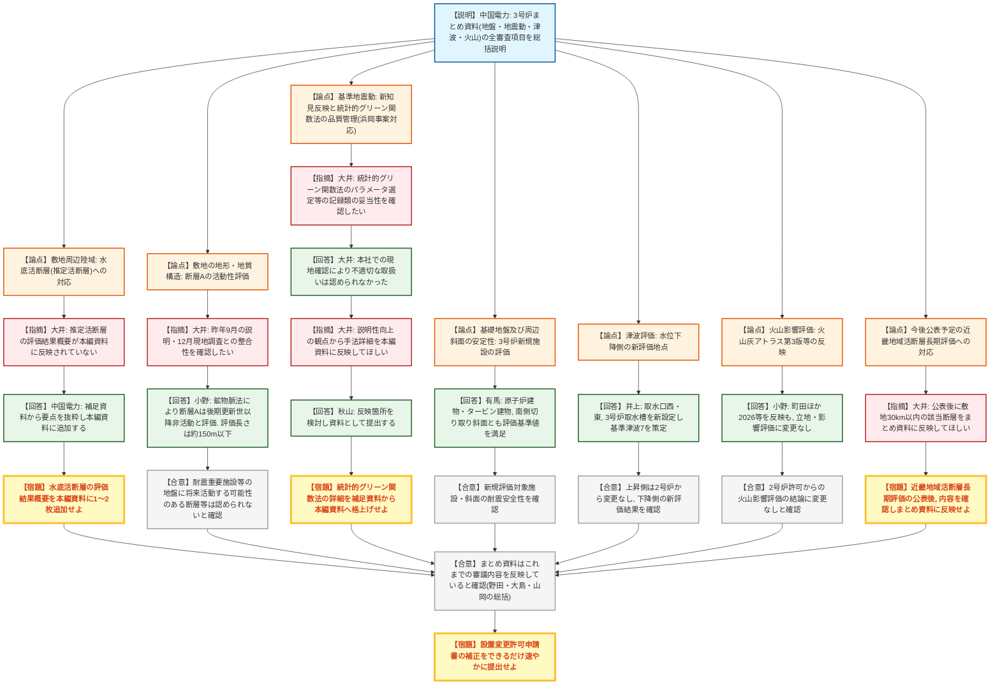

# 第1431回原子力発電所の新規制基準適合性に係る審査会合（令和8年8月28日）
> 出典 : https://youtube.com/live/acSnkyeDzG0?si=WtGBf5JkYhiWwBEL

## 会合の概要
* **島根原子力発電所3号炉「まとめ資料」の総括審議が行われ、実質的な審議終了水準に到達**
  中国電力から、地盤・地震・津波・火山の全審査項目を網羅した「まとめ資料」が提示され、2号炉設置変更許可審査からの新規説明内容・最新知見の反映状況が説明された。規制庁（大井氏）が全審査項目を順に確認した結果、まとめ資料はこれまでの審議内容を反映したものと認められた。
* **3号炉固有の新規審査事項は、断層Aの活動性評価・基礎地盤/周辺斜面の安定性評価・津波下降側評価の3点**
  3号炉の新設施設に伴い新たに審査が必要となった項目として、①耐震重要施設等の設置地盤に認められた断層Aの活動性評価（鉱物脈法により後期更新世以降非活動と評価）、②基礎地盤及び周辺斜面の安定性評価（3号炉南側切り取り斜面等）、③津波評価の水位下降側（新たな評価地点の設定）が新規に審査された。
* **宮内ほか編『日本の活断層総覧』(2025)が示す敷地近傍の推定活断層について、現地調査により震源として考慮する活断層でないと評価**
  宍道（鹿島）断層帯から敷地に向けて示された推定活断層について、文献調査・変動地形学的調査・現地地質調査・剥ぎ取り調査等の結果、震源として考慮する活断層の存在を示唆するデータは認められないと評価された。規制庁は現地調査でこの結論を確認した一方、評価結果の概要を本編資料にも明記するよう求めた。
* **浜岡原子力発電所の事案を踏まえた統計的グリーン関数法の品質管理状況を確認**
  基準地震動策定に用いた統計的グリーン関数法について、本社での関連記録の現地確認を経て不適切な取扱いは認められなかったことが報告された。規制庁は、説明性向上の観点から手法の詳細説明を補足資料から本編資料へ格上げするよう求めた。
* **規制部長・審査担当委員から総括コメントがあり、申請書補正の早期提出を要請**
  規制部長（大島氏）は断層Aの評価・推定活断層への対応・浜岡事案対応の3点を今回審査のポイントとして総括し、審査担当委員（山岡氏）も審査期間中に新知見や新規地震が相次いだことに触れつつ、事業者の丁寧な対応を評価した。中国電力に対しては、指摘事項の反映と設置変更許可申請書の補正をできるだけ早期に提出するよう求められた。

---

## 議題ごとの詳細整理

### 【議題1】中国電力（株）島根原子力発電所3号炉に係る審査のうち地震等について（まとめ資料の総括）
* **議論の背景と論点:**
  3号炉の審査は、既に許可済みの2号炉本体許可及び2号炉設置変更許可の内容を前提として、(a) 3号炉の新設施設に伴い新たに評価が必要となった項目（断層Aの活動性、基礎地盤・周辺斜面の安定性、津波評価の水位下降側）と、(b) 2号炉許可以降に収集された最新の科学的・技術的知見（宮内ほか編2025『日本の活断層総覧』、向吉ほか2024による和久羅山断層周辺の調査、令和8年1月6日発生の島根県東部の地震（M6.4）、『火山灰アトラス第3版』(2026)等）を反映した際の評価結果への影響、の2点を中心に、地盤（陸域・海域・敷地）、基準地震動、基礎地盤・周辺斜面安定性、津波、火山影響評価の全審査項目について、これまでの審査会合・現地調査での指摘事項への対応状況も含め総括的に確認された。

* **質疑応答（詳細）:**

  **＜敷地周辺陸域の地質・地質構造（新知見の反映と推定活断層）＞**
    * 【説明者側】小野（中国電力）
      2号炉本体許可以降に収集した知見として宮内ほか編『日本の活断層総覧』(2025)等7件を反映し、他の都断層の評価長さを約5kmから約10kmに見直すとともに、新たに約6kmの和久羅山断層を震源として考慮する活断層に追加した。また、宍道（鹿島）断層帯から敷地に向けて示された推定活断層について、文献調査・変動地形学的調査・現地地質調査・剥ぎ取り調査等を実施した結果、震源として考慮する活断層の存在を示唆するデータは認められないと評価した。
    * 【規制側】大井（規制庁）
      現地調査（路頭状況や標高データの提示等）により、推定活断層に関する評価結果及び資料の充実化状況を確認できた。ただし当該評価結果は補足説明資料にとどまっており、本編資料には概要が反映されていないため、最新知見の反映事項として1～2枚程度の概要を本編資料にも追加してほしい。
    * 【説明者側】中国電力（担当者）
      承知した。現状、本編資料（1-2-1・160ページ）には調査地点図と結論のみを記載しているため、補足説明資料から要点を抜粋し分かりやすく整理して追加する。
    * 【規制側】大井（規制庁）
      追加箇所や抜粋内容については、資料の提出を受けた上で改めて確認する。

  **＜敷地周辺海域・敷地の地形地質構造（断層Aの活動性評価）＞**
    * 【説明者側】小野（中国電力）
      敷地周辺海域は2号炉本体許可からの変更がないことを確認した。敷地については、耐震重要施設等が設置される地盤に認められた断層Aについて鉱物脈法による活動性評価を実施し、断層Aを横断するローモンタイト等の熱水変質鉱物を含む白色脈が変異変形を受けていないことから、断層Aは後期更新世以降活動していないと評価した。断層Aの評価長さは、非常用ディーゼル発電設備燃料貯蔵タンク格納槽底面の観察及び追加のNo.9-2壁面調査を踏まえ、露頭で確認された約40mから、断層が認められない南北の壁面間の約150m以下とした。
    * 【規制側】大井（規制庁）
      昨年9月の審査会合及び12月の現地調査での説明内容と整合しており、研磨片観察で白色脈が変異変形を受けていないことも現地で確認できた。耐震重要施設等の設置地盤に将来活動する可能性のある断層等は認められないとの結論を確認した。

  **＜基準地震動の策定＞**
    * 【説明者側】井上（中国電力）
      最新の地震観測データ及び宮内ほか編(2025)の活断層知見を反映して検討用地震の再評価を行ったが、検討用地震・基準地震動・年超過確率のいずれも2号炉からの変更はないことを確認した。また、令和8年1月6日発生の島根県東部の地震（M6.4、最大震度5強）についても、被害地震の震央距離と震度の関係図（Mデルタ図）や地下構造評価に反映したが、これまでの評価結果への影響はないことを確認した。
    * 【規制側】大井（規制庁）
      地震観測記録を反映しても検討用地震の選定に影響がないことを確認した。また、本年5月の審査会合で説明のあった統計的グリーン関数法による地震動評価の品質管理については、本年6月の現地確認でパラメータ選定等に関する文書記録類を確認し、不適切な点は認められなかった。この統計的グリーン関数法の詳細説明については、説明性向上の観点から補足説明資料ではなく本編資料に反映してほしい。
    * 【説明者側】秋山（中国電力）
      承知した。反映箇所を検討の上、資料として取りまとめて提出する。

  **＜基礎地盤及び周辺斜面の安定性評価＞**
    * 【説明者側】有馬（中国電力）
      3号炉の新規評価対象施設（原子炉建物・タービン建物等）について地震応答解析を実施し、基礎地盤の滑り・支持力・基礎底面の傾斜・地殻変動による変形影響のいずれも評価基準値（の目安）を満足することを確認した。周辺斜面についても3号炉南側切り取り斜面の地震応答解析を実施し、評価基準値1.2を満足することを確認した。
    * 【規制側】大井（規制庁）
      2号炉・3号炉共通施設は評価済みであることを前提に、新規の代表施設・評価対象斜面に対する地震応答解析結果が基準を満足していることを確認した。

  **＜津波評価＞**
    * 【説明者側】井上（中国電力）
      水位上昇側は評価地点が2号炉本体許可と同一であるため基準津波1・2・5を維持した。水位下降側は3号炉取水口西・東及び3号炉取水槽を新たな評価地点として設定し、2号炉本体許可の基準津波1・3に加えて新たに基準津波7を策定した。年超過確率、取水への影響のいずれも問題ないことを確認した。
    * 【規制側】大井（規制庁）
      上昇側は2号炉からの変更なし、下降側は新設した評価地点における評価結果がまとめ資料に整理されていることを確認した。

  **＜火山影響評価＞**
    * 【説明者側】小野（中国電力）
      2026年4月公表の『火山灰アトラス第3版』（町田ほか2026、2011年発行の町田・新井『新編火山灰アトラス』第2刷からの改訂版）等6件の最新知見を反映したが、立地評価及び降下火砕物の影響評価（層厚56cm）を含め、2号炉許可からの評価結果に変更はないことを確認した。三瓶山・大山の地下構造トモグラフィー結果についても、既往文献と松原ほか(2019・2022)の比較を2段の表から3段の表に整理し直した。
    * 【規制側】大井（規制庁）
      最新の知見を踏まえても火山影響評価に変更がないことを確認した。

  **＜今後の対応事項＞**
    * 【規制側】大井（規制庁）
      地震調査研究推進本部から近畿地域の活断層長期評価が近く公表される予定であり、敷地から30km以内の断層が対象に含まれることから、公表後にまとめ資料へ反映してほしい。まとめ資料の内容を踏まえた設置変更許可申請書の補正時期についても確認したい。
    * 【説明者側】中国電力（担当者）
      知見の内容を確認し、適切に対応する。
    * 【説明者側】水村（中国電力）
      本日説明したまとめ資料全体を含め、設置許可申請書本体へ反映すべき項目を確認しており、準備でき次第、補正として申請書を提出する。

  **＜規制庁・規制委員会の総括＞**
    * 【規制側】野田（規制庁）
      3号炉審査の全体像（2号炉評価からの変更有無を確認する項目と、3号炉新設施設に伴い新規審査した項目の2区分）を振り返った上で、①敷地周辺陸域の水底活断層評価概要の本編記載、②統計的グリーン関数法の詳細の本編記載への格上げ、③近畿地域活断層長期評価の反映、の3点の資料適正化と、申請書補正のできるだけ早い提出を要請する。
    * 【説明者側】アビル（中国電力）
      3点についてまとめ資料に反映するとともに、補正書もなるべく早期に提出する。
    * 【規制側】大島（規制部長）
      今回審査のポイントは、①断層Aの活動性評価（既存の確立された工法で丁寧に説明された）、②宮内ほか編(2025)が示す推定活断層への対応（網羅的な路頭調査等により震源として考慮する活断層の存在を否定）、③浜岡発電所の事案を踏まえた統計的グリーン関数法による地震動評価の自主的な再説明と本社記録確認、の3点であり、いずれも委員による現地調査で確認できたと総括した。
    * 【規制側】山岡（審査担当委員）
      3号炉審査は2号炉からの差分を中心とした効率的な議論であったが、まとめ資料の分量には改めて驚いた。審査期間中にも新たな知見（和久羅山断層等）や新規地震（島根県東部の地震）が生じており、島根の海域側は陸域に比べ観測データが少ないため、今後海域で地震が発生した場合には改めて記録の確認等の対応が必要になり得るとした。現地調査（2回）を通じて発電所の状況や建設中の3号炉（ABWR）への理解が深まったとし、本日の指摘事項への対応を求めた。

* **結論と宿題事項（アクションアイテム）:**
  * **決定事項:** 島根原子力発電所3号炉のまとめ資料は、これまでの審議内容を反映したものであることが確認され、地震等に関する審査は実質的な総括を終えた。
  * **宿題事項:**
    1. 敷地周辺陸域の水底活断層（宍道（鹿島）断層帯から敷地に向けた推定活断層）に関する評価結果の概要を、補足説明資料に加えて本編資料にも1～2枚程度追加記載すること。
    2. 統計的グリーン関数法による基準地震動評価の手法詳細（現状は補足説明資料171～176ページに記載）を、説明性向上の観点から本編資料に反映すること。
    3. 地震調査研究推進本部が公表予定の近畿地域の活断層長期評価について、公表後に内容を確認し、敷地から30km以内の該当断層をまとめ資料に反映すること。
    4. 上記の資料適正化を踏まえ、島根原子力発電所3号炉設置変更許可申請書の補正をできるだけ速やかに提出すること。

---

## 論理構造の可視化（Mermaid）

### 【議題1】島根原子力発電所3号炉 まとめ資料の総括審議

