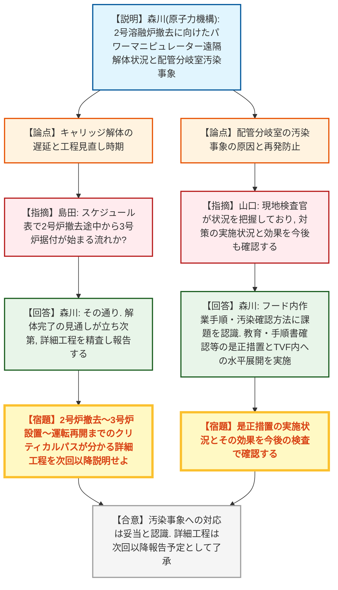
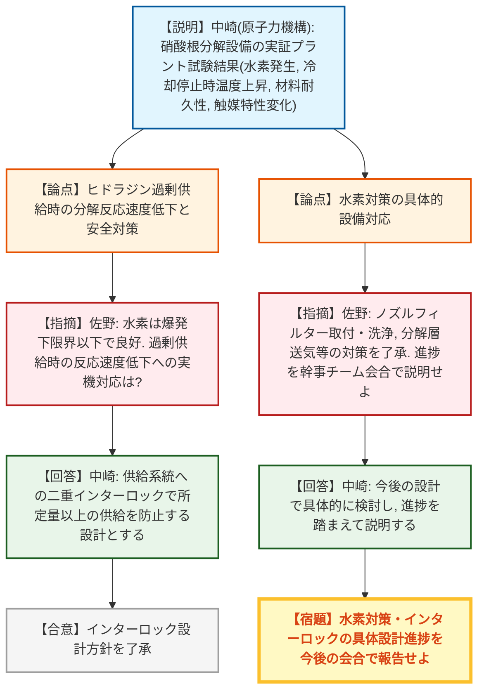
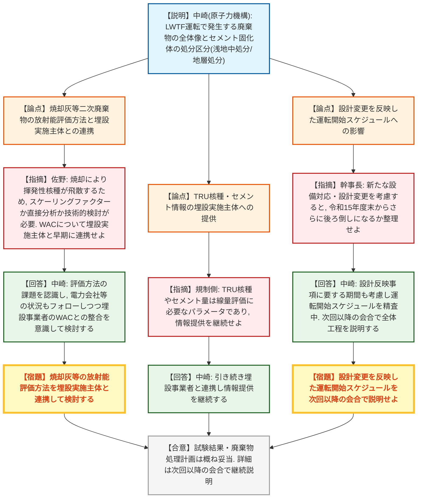
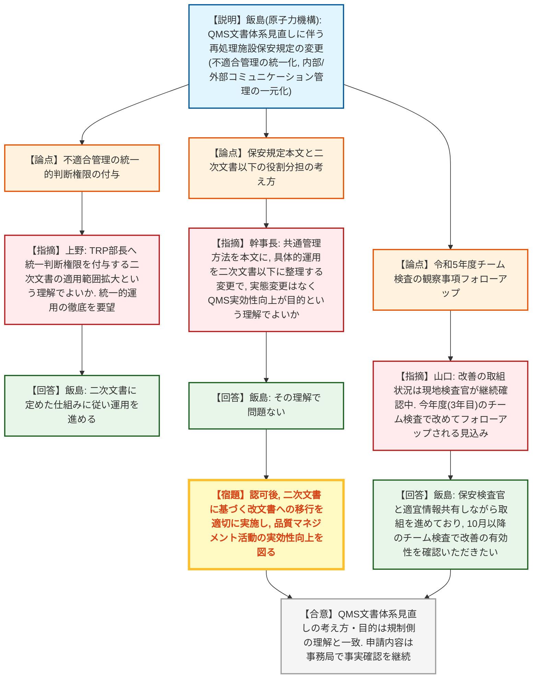
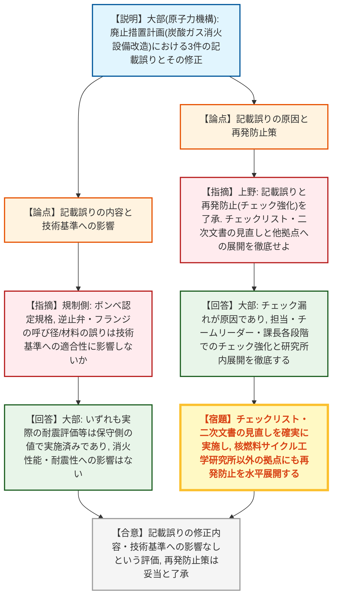

# 第84回東海再処理施設安全監視チーム（令和8年8月31日）
> 出典 : https://youtube.com/live/HBGMVmT8IpM?si=t3de7fyrBYBKPqFn

## 会合の概要
* **TVF(ガラス固化技術開発施設)の2号溶融炉撤去作業が、旧解体場パワーマニピュレーターの遠隔解体の難航と配管分岐室での汚染事象により大幅に遅延。** 3号溶融炉の運転再開に向けた工程見直し時期は、当初目途としていた6月末から11月頃へ再設定された。規制側は、クリティカルパスが分かる詳細な工程表の提示を強く求めた。
* **LWTF(低放射性廃棄物処理技術開発施設)の硝酸根分解設備に関する実証プラント試験が完了。** 水素発生・冷却停止時温度上昇・材料耐久性等の安全関連データが揃い、規制側から高い納得感が得られた一方、ヒドラジン過剰供給インターロック等の追加設計を反映した場合に、既に「令和15年度末」へ後ろ倒しされている運転開始時期がさらに遅れるのかが今後の焦点として残された。
* **セメント固化体の処分(浅地中処分/地層処分)に関し、放射能濃度評価の技術的課題(焼却灰のスケーリングファクター適用可否等)が指摘され、埋設実施主体(JAEA埋設事業センター・NUMO)との早期かつ緊密な連携を求める意見が複数出された。**
* **再処理施設保安規定について、QMS文書体系の見直し(不適合管理の統一的審議への一元化、内部・外部コミュニケーション管理の一元化)に伴う変更認可申請(8月28日申請)が報告され、規制側の理解と概ね一致し、特段の異論は出なかった。**
* **廃止措置計画(廃棄物等貯蔵施設の炭酸ガス消火設備改造)の変更認可申請(7月16日申請)について、ボンベ認定規格・逆止弁呼び径・フランジ材料の3件の記載誤りが判明。** いずれも消火性能・耐震性等の技術基準への適合性には実質的な影響がないことが確認され、規制側はチェック体制の強化と他拠点への水平展開の徹底を求めた。

---

## 議題ごとの詳細整理

### 【議題1】ガラス固化処理に向けた準備状況(TVF)
* **議論の背景と論点:**
  2号溶融炉の撤去に向け、固化セル内の仮置きスペースを確保するため、更新工事で取り外した旧解体場のパワーマニピュレーターの遠隔解体と、TVFから発生する廃棄物の搬入作業が進められている。構造が大型かつ複雑なキャリッジの解体に時間を要しており、当初想定していた3号溶融炉運転再開までの工程見直し時期をいつに設定するかが論点となった。また、6月に発生した配管分岐室での汚染事象の原因究明と再発防止策も議題となった。

* **質疑応答（詳細）:**
    * 【説明者側】森川(原子力機構)
      旧解体場パワーマニピュレーターの遠隔解体は、スレーブアーム・横行ケーブルベア・ガイダイまでは計画より約1ヶ月遅れで4月下旬に完了した。その後着手した大型で構造の複雑なキャリッジは、4層式のテレスコチューブを内側から1層ずつ切断・抜き取る必要があり、レーザー切断時に溶融金属が再溶着して同一箇所を繰り返し切断する事態が生じるなど、想定以上に時間を要している。当初「6月末」を目途としていた工程見直し判断の時期は、キャリッジ解体完了の見通しが立たなかったため「11月頃」に再設定した。
    * 【説明者側】森川(原子力機構)
      6月4日、フード内の雰囲気モニターのバルブ切り替え操作後、作業員の一部および床面に汚染を確認した。簡易除染で管理基準値を下回り、被ばく・環境への影響はなかった。詳細調査の結果、原因は当該作業以前のフード内作業に伴う残留汚染がバルブ操作によりフード外へ拡大したものと推定され、約1ヶ月間解体作業を中断して是正措置を実施した。
    * 【規制側】山口(規制庁)
      配管分岐室の汚染事象については、発生直後から現地検査官が現場を確認しており、原因調査とバルブ操作の適正化を含む再発防止策の内容を把握している。今後も対策の実施状況とその効果を継続して確認していく。
    * 【説明者側】森川(原子力機構)
      フード内作業の手順やフード内作業後の汚染確認方法、除染の仕方に課題があったと認識している。是正措置として、まず教育を含めた手順書の確認、汚染に対する感受性向上等の意識向上を図る。同様のフード内作業はTVF内の他工程にもあるため、同様の問題がないか水平展開して精査する。
    * 【規制側】島田(規制部長)
      更新スケジュール表について、2号溶融炉の撤去作業(二重配管の取り出し等)が進行する途中の段階から、3号溶融炉の据え付けが並行して始まるという理解でよいか。今後の判断材料として、クリティカルパスや要注意な作業が見える、より詳細な工程表を別途作成し、次回以降の会合で説明してほしい。
    * 【説明者側】森川(原子力機構)
      その理解の通りである。現在示している工程はまだ大まかな実績の延長であり、解体作業完了の見通しが得られた段階で、過去の実績等をもとに詳細なスケジュールを精査し、運転再開までの工程を次回以降の会合できちんと説明する。

* **結論と宿題事項（アクションアイテム）:**
  * **決定事項:** 配管分岐室の汚染事象については、原因究明と是正措置の内容が規制側に概ね理解され、特段の異論は出なかった。
  * **宿題事項:**
    1. キャリッジ解体作業完了の見通しが得られた段階で、2号炉撤去〜3号炉設置〜運転再開までのクリティカルパスが分かる詳細な工程を精査し、次回以降の会合で報告すること。
    2. 汚染事象の是正措置(手順書確認・教育等)の実施状況とその効果について、検査を通じて継続的に確認すること。

---

### 【議題2】低放射性廃棄物処理技術開発施設(LWTF)の施設整備に向けた取組状況
* **議論の背景と論点:**
  LWTFでは低放射性の濃縮廃液をセメント固化する計画だが、含まれる硝酸性窒素(硝酸根)が環境規制物質に該当するため、固化前に硝酸根を分解する設備を導入する計画である。昨年度実施した実証プラント規模試験の最終結果(水素発生挙動、冷却停止時の温度上昇、材料耐久性、触媒特性の変化等)と、それを踏まえた設計への反映事項が論点となった。あわせて、LWTF運転に伴い発生する廃棄物の全体像と、セメント固化体の処分(浅地中処分・地層処分)に向けた埋設実施主体との連携状況が報告された。

* **質疑応答（詳細）:**
  **＜実証プラント規模試験結果＞**
    * 【説明者側】中崎(原子力機構)
      廃触媒回収系統は分解層内の触媒をフィルターに回収できることを確認し、ポンプ・フィルター等に詰まり等の不具合も生じなかった。ヒドラジンを意図的に約10%過剰供給した際の水素ガス濃度は最大でも0.65%程度で、爆発下限界(4%)を十分に下回ることを確認した。冷却停止時の温度上昇率は約10℃/hで急激な温度上昇は生じず、ヒドラジン供給停止操作を行うまでに十分な時間的余裕があることも確認した。材料耐久性については、分解層や撹拌機に腐食は確認されず、板厚・シャフト外径の測定でも減肉は確認されなかった。
    * 【説明者側】中崎(原子力機構)
      ヒドラジン過剰供給試験後の触媒を用いて実機相当条件(100%相当のヒドラジンを20時間供給)で追加試験を行ったところ、分解率は目標の90%以上に到達したが、硝酸根濃度が低い領域で分解速度が低下する傾向を確認した。分析の結果、ヒドラジン供給により触媒の担持金属(パラジウム・銅)の凝集が進み、その一部が脱離して金属担持率が低下したことが、触媒特性変化の要因と考えられる。
    * 【規制側】佐野(規制庁)
      水素濃度が爆発下限界より十分低かった点は良好である。ヒドラジン過剰供給時に分解反応速度が低下することが分かったが、実機ではヒドラジン供給系統にインターロックを設け、所定量以上の供給を防ぐ設計とするという説明で了解した。今後の具体的設計では、今回の試験結果を参考に計画的に進めてほしい。
    * 【説明者側】中崎(原子力機構)
      水素対策として、より安全性を向上させる観点から、ヒドラジン供給ノズルへのフィルター取付・洗浄機構や分解層内の送気対策を候補として検討しており、今後の設計の中で具体化し、進捗を踏まえて改めて説明する。
    * 【規制側】佐野(規制庁)
      水素対策(ノズルフィルターの取付・洗浄、分解層内送気)についても了解した。今後、計画的に設計対応を進めるとともに、進捗が進んだ段階で幹事チーム会合で説明してほしい。

  **＜LWTFで発生する廃棄物と処分に向けた取組＞**
    * 【説明者側】中崎(原子力機構)
      液体廃棄物は最終的にセメント固化体とする。処理過程で発生するフィルター・吸着剤・焼却灰等の二次廃棄物は、他の原子力施設で発生するものと材質・形態が類似しており特異的なものではない。将来的に廃棄体化施設で処分場の受入要件を満たす廃棄体を製作する方針で、それまでの間は施設内で貯蔵する。セメント固化体は放射能濃度に応じて浅地中処分するものと地層処分するものに区分し、浅地中処分はJAEA埋設事業センター、地層処分はNUMOがそれぞれ担当しており、両埋設事業者に対して処分場設計に必要な固化体情報を提供済みで、今後も技術的な連携を継続する。
    * 【規制側】佐野(規制庁)
      焼却灰は材質・形態の点で他施設のものと大きく異ならないと考えられる一方、焼却によりセシウム等の揮発性核種が飛散するため、従来のスケーリングファクター法が使えるのか、固化前に直接サンプリング・分析する必要があるのか、技術的な検討課題が残っている。これは埋設実施主体が主体的に扱うべき事項ではあるが、廃棄体化設計を進める上ではTRPと埋設実施主体(NUMO・JAEA)が受入基準(WAC)について早い段階から緊密に連携する必要があり、廃棄体を作った後にデータ不足が判明する事態を避けてほしい。
    * 【説明者側】中崎(原子力機構)
      焼却灰の放射能濃度評価方法(直接分析かスケーリングファクターか)やサンプリングの代表性が課題であると認識しており、電力会社等の状況もフォローしながら検討を進める。埋設事業者が定める受入基準(WAC)との関係も十分に意識し、引き続き連携しながら検討していく。
    * 【規制側】(規制庁)
      TRU核種やセメントの情報は、地層処分・浅地中処分の線量評価に必要なパラメータとなるため、埋設実施主体とよく連携・意見交換し、廃棄物発生者側から必要な情報をしっかり提供してほしい。加えて、近隣施設(幌延)で低アルカリセメント等が使用されている事例もあるため、その点も含めて情報共有をお願いしたい。
    * 【説明者側】中崎(原子力機構)
      承知した。引き続き埋設事業者と連携しながら情報提供を進めていく。
    * 【規制側】幹事長(規制庁)
      LWTFの処理運転開始時期は、前回の会合で「令和10〜11年度」から「令和15年度末」へ変更するとの説明を受けている。前回、低レベル廃棄物全体まで視野を広げて工程を整理してほしいと要望済みだが、今回報告されたヒドラジン過剰供給防止対策・分解層内送気対策・保守性向上対策等の新たな設備対応や設計変更を考慮すると、運転開始時期が令和15年度末よりさらに後ろにずれ込むのか、次回以降の会合で全体工程を説明する際に整理してほしい。
    * 【説明者側】中崎(原子力機構)
      今回の実証プラント試験結果を踏まえた設計反映事項に伴う設備対応に要する期間も考慮しながら、LWTFの運転開始に向けたスケジュールを精査しており、次回以降の会合で全体工程を説明する。

* **結論と宿題事項（アクションアイテム）:**
  * **決定事項:** 実証プラント試験で得られた水素発生挙動・冷却停止時温度上昇・材料耐久性等の安全関連データ、およびヒドラジン供給系統への二重インターロック設置という設計方針は、規制側に妥当なものとして了承された。
  * **宿題事項:**
    1. 水素対策(ノズルフィルター取付・洗浄、分解層内送気)およびインターロックの具体的な設計進捗を、今後の幹事チーム会合等で報告すること。
    2. 焼却灰等の二次廃棄物の放射能濃度評価方法について、埋設実施主体(NUMO・JAEA)とWACに関する連携を早期から密に行い検討すること。
    3. LWTFで発生する廃棄物の発生量を含む処理計画全体を、TRPから発生する低放射性廃棄物全体の整理の中で次回以降の会合にて説明すること。
    4. 実証試験結果を踏まえた設計変更を反映した運転開始スケジュール(令和15年度末からのさらなる変更有無)を、次回以降の会合で全体工程として説明すること。

---

### 【議題3】核燃料サイクル工学研究所QMS文書体系の見直しに係る再処理施設保安規定の変更の概要
* **議論の背景と論点:**
  令和5年度末の原子力規制検査(チーム検査)において、QMSの運用に関する改善措置活動の実行に係る観察結果(気づき事項)が示されたことを受け、再処理施設の不適合管理を4部門(TRP部・放管部・工務部・保安部)がそれぞれ個別に審議していた従来の運用を、統一的に審議する仕組みへ改善した(令和8年4月運用開始)。この運用を保安規定に反映するとともに、共通的な管理方法を定める文書と具体的な運用を定める文書を体系的に整理するQMS文書体系全体の見直し(内部・外部コミュニケーション管理の一元化を含む)が論点となった。

* **質疑応答（詳細）:**
    * 【説明者側】飯島(原子力機構)
      不適合情報はスクリーニング会議で原子力安全への影響度評価・区分判定・水平展開の要否を判定した上で、TRP部の不適合管理検討部会が一括審議する運用に既に移行している。今回の保安規定変更では、廃止措置技術開発部長(TRP部長)に再処理施設に関する不適合を統一的に判断する権限を付与し、「不適合管理並びに是正及び未然防止措置要領書」を研究所の二次文書として位置づけ、QMS文書体系に明記する。
    * 【規制側】上野(規制庁)
      不適合管理については、TRP部長に再処理施設の不適合を統一的に判断する権限を付与するため、該当する研究所の二次文書の適用範囲に再処理施設を加えるものと理解している。今後の運用にあたっては、再処理施設として統一的に不適合が審議できるよう、適切な運用を図ってほしい。
    * 【説明者側】飯島(原子力機構)
      承知した。仕組みを研究所の二次文書の中にしっかり定めた上で、それに従って運用を進めていく。
    * 【規制側】幹事長(規制庁)
      QMS文書体系の見直しは、共通的な管理方法を定める文書を保安規定本文に登録し、具体的な運用を定める文書を二次文書以下の文書として整理し直す変更であると理解した。二次文書以下の文書は引き続き研究所内の二次文書に紐づく改文書として移行するもので実態としての変更はなく、QMSの実効性を実態に応じて柔軟かつ適切に向上させることが目的という理解でよいか。
    * 【説明者側】飯島(原子力機構)
      その理解で問題ない。
    * 【規制側】幹事長(規制庁)
      保安規定認可後、具体的な運用を定める文書が二次文書に基づく改文書に移行する際は、適切に文書を制定した上で運用を図ってほしい。また改文書に基づく運用や品質マネジメント活動についても継続的な改善を図ってほしい。申請書の内容については、今後面談等で事実確認をしていきたい。
    * 【説明者側】飯島(原子力機構)
      承知した。品質マネジメント活動の実効性につながる活動になるよう改善を図る。申請内容については、面談の中で個別に説明する。
    * 【規制側】山口(規制庁)
      QMSに関するチーム検査は3年に1回の周期で実施しているもので、当時の検査では特段の指摘事項はなかったが、確認された観察事項(気づき)に対して事業者は既に改善の取組みを開始しており、現地検査官が日常の検査活動の中で確認・監視を継続している。現時点で特段の指摘や気づきの報告はないが、今年度実施予定の(3年目となる)チーム検査で改めてフォローアップされる見込みであり、引き続き適切な対応を求める。
    * 【説明者側】飯島(原子力機構)
      今回いただいた気づきへの取組状況については保安検査官に適宜情報共有しながら進めている。今年10月以降に実施予定のチーム検査の中で、改善が有効に機能しているかを確認いただきたい。

* **結論と宿題事項（アクションアイテム）:**
  * **決定事項:** 不適合管理の統一化とQMS文書体系見直しの考え方・目的について、規制側の理解と事業者の説明が一致することが確認され、8月28日申請の保安規定変更内容については事務局で事実確認を進めることとなった。
  * **宿題事項:**
    1. 保安規定認可後、二次文書に基づく改文書への移行を適切に実施し、品質マネジメント活動の実効性向上を図ること。
    2. 申請書の内容について、面談等で事実確認を継続すること。
    3. 令和8年10月以降に実施予定のチーム検査で、不適合管理改善の有効性を確認すること。

---

### 【議題4】東海再処理施設の廃止措置計画変更認可申請（令和8年7月16日申請）
* **議論の背景と論点:**
  令和7年6月25日申請・同年9月16日認可済みの廃止措置計画(廃棄物等貯蔵施設の炭酸ガス消火設備の一部改造)について、記載内容に3件の誤りがあることが判明した。既設の炭酸ガス消火設備のボンベ増量および追加設置により、消火用の炭酸ガス量を確保する改造内容自体に変更はないが、記載誤りを是正するための変更認可申請(7月16日申請)の内容、誤りの原因、再発防止策、および技術基準への適合性への影響が論点となった。

* **質疑応答（詳細）:**
    * 【説明者側】大部(原子力機構)
      記載誤りは3件。(1)炭酸ガスボンベについて、本来「高圧ガス保安法」に基づく認定品とすべきところを「一般財団法人日本消防設備安全センター」の認定品と記載し、確認方法も容器の刻印確認とすべきところを性能票による確認と誤記載していた。(2)逆止弁の呼び径について、本来20Aとすべきところ15Aと記載していた。(3)フランジについて、材料を本来S25Cとすべきところ配管と同一規格のSTPG370と記載し、呼び径も本来10AとすべきところJIS規格にない8Aと記載していた。
    * 【説明者側】大部(原子力機構)
      原因は、(1)申請書作成時の設計図書確認が不十分でボンベ本体に関する高圧ガス保安法の記載を見落としたこと、メーカーへの電話問合せ時に確認対象(ボンベ本体か容器弁か)を明確にせず、容器弁側の認定情報をボンベ本体の認定情報と誤認したこと、チェックリストに部品単位で適用法令を確認する項目がなかったこと。(2)担当者が逆止弁の呼び径が読み取れない配管図のみを確認し、呼び径が記載された別図面(機器図)を確認しなかったこと。(3)設計図書にフランジ単体の使用情報が含まれておらず、担当者が配管と同一規格と誤って判断し、確認者もフランジ単体としての照合を行わなかったこと、である。
    * 【説明者側】大部(原子力機構)
      技術基準への適合性への影響については、いずれの誤りも、消火に必要な炭酸ガス量を確保する設計や耐震C類としての強度設計に変更はない。実際の耐震評価は、申請書記載値よりも保守側の値(逆止弁20A相当、フランジ15A相当重量)を用いて実施済みであるため、評価結果への影響もないことを確認している。
    * 【説明者側】大部(原子力機構)
      再発防止策として、ボンベ関連は設計図書に基づき部品ごとに適用法令を一つ一つ照合して作成・確認する運用をチェックリストに明記した。逆止弁関連は分散していた図面情報を一元化した使用リストを設計図書に含めるよう求め、リストを用いた突合確認を行う。フランジ関連は部品単位での使用確認漏れがないことを確認し、担当者・チームリーダーによるダブルチェック、課長によるエビデンスチェックを徹底する。あわせてTRP部内での規則改定・教育、研究所内での事例共有、機構内各拠点への会議体を通じた注意喚起を実施している。
    * 【規制側】上野(規制庁)
      今回の廃止措置計画変更申請は、廃棄物等貯蔵施設の火災防護設備である炭酸ガスボンベの使用等に係る記載誤りを正すものと認識している。再発防止として設計上の管理改善・チェックの強化を図るとのことだが、チェックリストの見直しや二次文書の改善についてもきちんと対応してほしい。あわせて、設計当初の確認や各職員による確認についても要領に基づき対応し、核燃料サイクル工学研究所以外の拠点への展開についても同様の事象が生じないよう再発防止の共有を図ってほしい。今回の変更内容自体には特段の技術的論点はないと理解しているが、必要に応じて面談等で事実確認を継続する。
    * 【説明者側】大部(原子力機構)
      基本的にチェック漏れが原因であり、チェックリストに基づき担当者・チームリーダー・課長それぞれの立場に応じたチェックの強化で対応する。核燃料サイクル工学研究所内においてもしっかり展開を図り、再発防止に努める。

* **結論と宿題事項（アクションアイテム）:**
  * **決定事項:** 記載誤り3件はいずれも消火性能・耐震性等の技術基準への適合性に実質的な影響がないことが確認され、修正内容および再発防止策(チェック体制強化等)は規制側に妥当なものとして了承された。
  * **宿題事項:**
    1. チェックリストおよび二次文書の見直しを確実に実施すること。
    2. 核燃料サイクル工学研究所以外の拠点にも、同様の記載誤りが生じないよう再発防止策を水平展開すること。

---

## 論理構造の可視化（Mermaid）

### 【議題1】ガラス固化処理に向けた準備状況(TVF)

### 【議題2】低放射性廃棄物処理技術開発施設(LWTF)の施設整備に向けた取組状況 - 実証プラント試験

### 【議題2】低放射性廃棄物処理技術開発施設(LWTF)の施設整備に向けた取組状況 - 廃棄物処理・処分

### 【議題3】核燃料サイクル工学研究所QMS文書体系の見直しに係る再処理施設保安規定の変更の概要

### 【議題4】東海再処理施設の廃止措置計画変更認可申請（令和8年7月16日申請）

