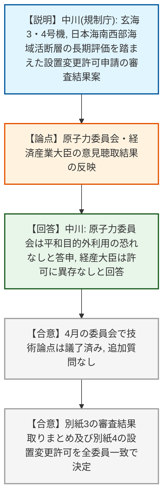
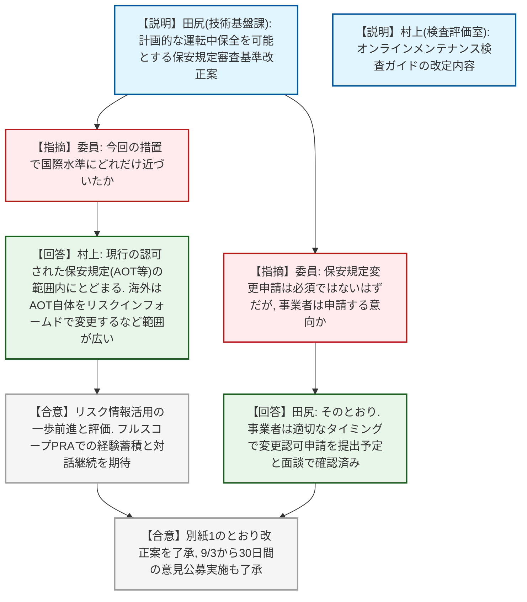
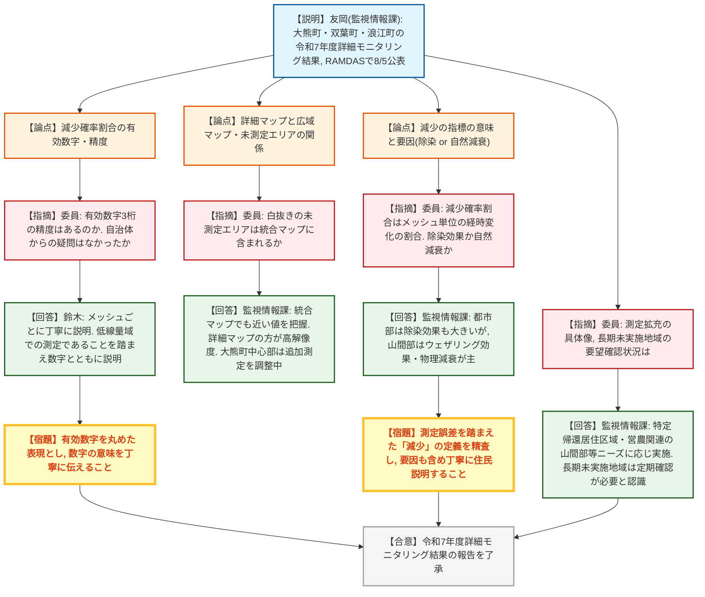
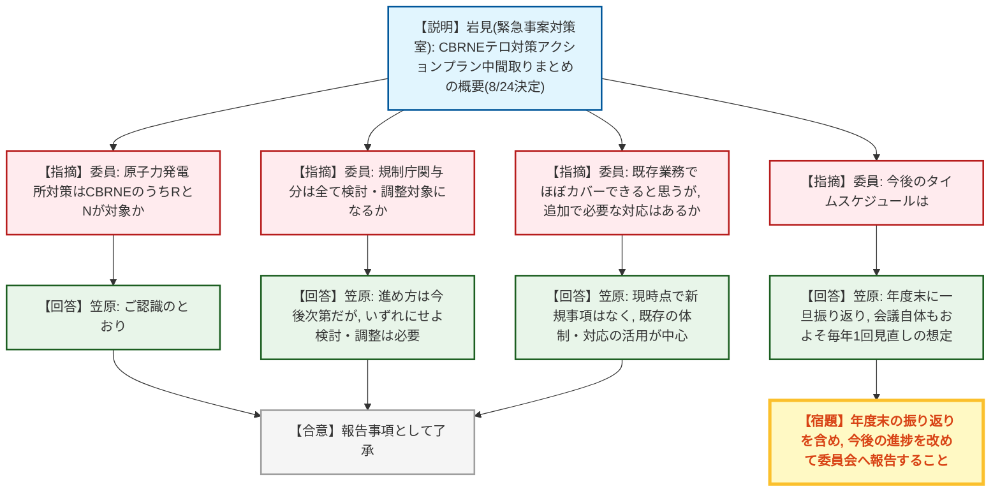
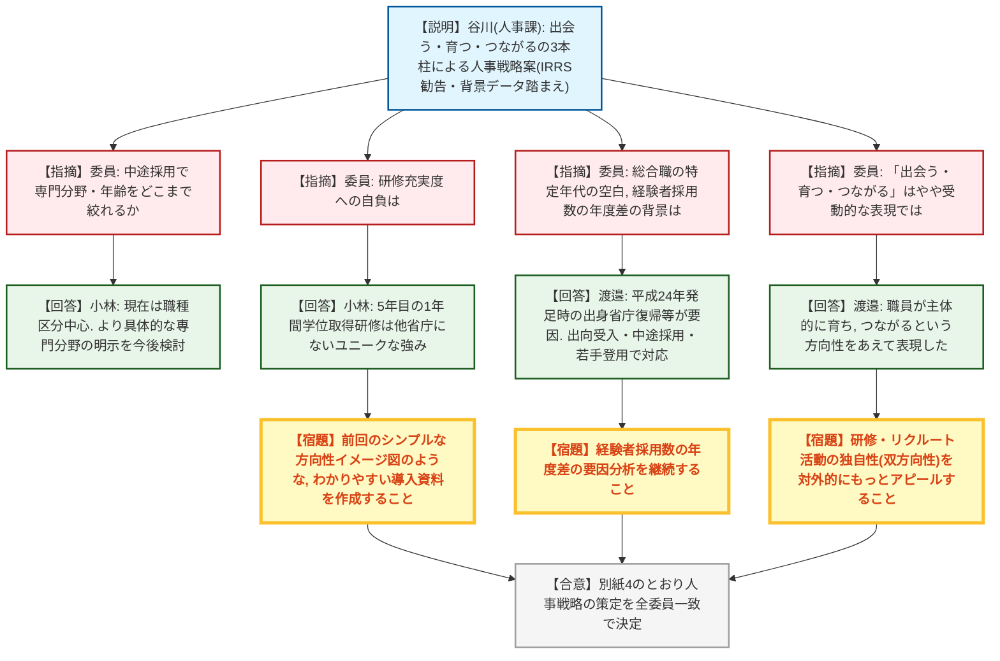
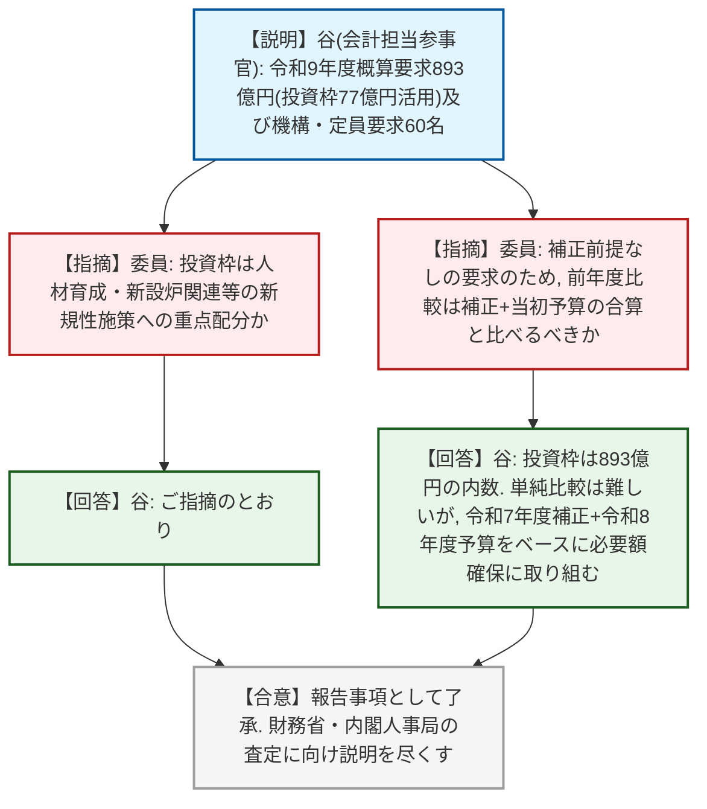

# 第30回原子力規制委員会（令和8年9月2日）
> 出典 : https://youtube.com/live/6gwVZPcjXoo?si=SF7OMYfV9uO8Alhi

## 会合の概要
* **玄海3・4号機の設置変更許可を全会一致で決定**
  日本海南西部の海域活断層の長期評価(第一版)の知見を踏まえた九州電力玄海3・4号機の設置変更許可申請について、原子力委員会・経済産業大臣への意見聴取結果を踏まえ許可を決定。技術的な論点は既に4月の委員会で議了済みであり、本日は追加質問なく形式的な決定に終始した。
* **オンラインメンテナンスに係る保安規定審査基準改正案を了承、パブコメへ**
  「やむを得ず」実施する場合に限られていた運転中保全について、新たに「計画的に」実施する場合の規定を整備する改正案を了承し、9月3日から30日間の意見公募を実施することとした。規制側は現行の認可範囲(AOT等)内にとどめる保守的な制度設計であることを確認しつつ、海外はAOT自体をリスクインフォームドで変更するなどより進んでいる旨の整理がなされた。
* **帰還困難区域等の詳細モニタリング結果、「減少確率割合」の説明の丁寧さを求める指摘が集中**
  大熊町・双葉町・浪江町の令和7年度詳細モニタリング結果(8月5日RAMDASで公表)が報告されたが、複数の委員から「減少確率割合」を有効数字3桁で示すことの精度への疑義、減少していないメッシュの意味、除染効果と自然減衰(ウェザリング効果)の切り分けなど、住民・自治体への説明の質を高めるよう具体的な指摘が相次いだ。
* **CBRNEテロ対策アクションプラン(中間取りまとめ)の概要を報告**
  関係省庁局長級会議が8月24日に決定した中間取りまとめについて、原子力規制庁の役割はCBRNEのうちR(放射性物質)・N(核)分野が中心であることを確認。現時点では既存の原子力災害対応・核物質防護体制の活用が中心で、新規の追加対応は想定していないとの説明があった。
* **人事戦略(出会う・育つ・つながるの3本柱)の策定を決定**
  IRRSからの勧告(人事戦略の策定・人材流動性の向上)や職員の在職状況データを踏まえた人事戦略案を全委員一致で決定。3本柱の表現の受動性や、まとめ資料のわかりやすさ、研修・リクルート活動の独自性のアピール不足など、内容よりも伝え方に関するコメントが複数寄せられた。
* **令和9年度概算要求(総額893億円)を報告**
  「強く豊かな日本投資枠」(要求上限なし)を活用した77億円を、人材育成事業や新設軽水炉対応、保障措置体制強化、福島第一の損傷メカニズム解明など新規性のある施策に重点配分する方針が示された。

---

## 議題ごとの詳細整理

### 【議題1】九州電力株式会社玄海原子力発電所の発電用原子炉設置変更許可（３号及び４号発電用原子炉施設の変更）―日本海南西部の海域活断層の長期評価(第一版)の知見を踏まえた変更―
* **議論の背景と論点:**
  日本海南西部の海域活断層の長期評価(第一版)の知見を踏まえた玄海3号・4号炉の設置変更許可申請について、本年7月15日の委員会で審査結果案を取りまとめ、原子力委員会・経済産業大臣への意見聴取を実施済み。技術的な論点は既に4月の委員会で議論済みであり、本日は意見聴取結果を踏まえた最終決定のみが論点。

* **質疑応答（詳細）:**
    * 【説明者側】中川(実用炉審査部門): 原子力委員会からは「当該発電用原子炉が平和の目的以外に利用される恐れがないものと認められる」との答申、経済産業大臣からは「許可することに異存はない」との回答を得た。7月15日の審査結果案から変更はなく、原子炉等規制法の許可基準のいずれにも適合していると認められることから、許可を決定いただきたい。
    * 【委員長】: 技術的な議論は既に4月の委員会で行っているが、追加の質問・コメントはあるか確認した。
    * (委員から追加の質問・コメントなし)

* **結論と宿題事項（アクションアイテム）:**
  * **決定事項:** 別紙3のとおり審査の結果を取りまとめること、及び別紙4のとおり発電用原子炉設置変更許可を決定することを、全委員一致で決定した。
  * **宿題事項:** なし。

---

### 【議題2】実用発電用原子炉及びその附属施設における発電用原子炉施設保安規定の審査基準の一部改正案及びその意見公募の実施
* **議論の背景と論点:**
  本年3月18日にオンラインメンテナンスに関する対応方針(実証実施)が委員会で了承済み。今回はその実証実施を踏まえ、①計画的な運転中保全を可能とする保安規定審査基準の改正案とその意見公募の実施、②検査官向け検査ガイドの改定内容、の2点が論点。焦点は、計画的なオンラインメンテナンスを現行の認可制度の枠内でどう位置づけるかにあった。

* **質疑応答（詳細）:**
    * 【説明者側】田尻(技術基盤課): 保安規定審査基準の改正案では、これまで「やむを得ず」実施する場合のみ規定されていた運転中保全について、新たに「計画的に」実施する場合の規定を整備する。保全作業をAOT(許容待機除外時間)内に実施すること、必要な安全措置を講じること、PRA等を用いて措置の有効性を検証することを定める。了承が得られれば9月3日から30日間パブリックコメントを実施する予定。
    * 【説明者側】村上(検査評価室): 検査ガイドでは、作業計画段階・実施段階の確認項目を追記した。検査体制は現場検査官による日常検査を基本とし、経験の浅い事業者からの相談には本庁が柔軟に対応する。作業計画段階のリスク管理では深層防護の堅持を基本とし、基準を超えるリスクが示された場合はリスクを下げる措置をとることを求めている。
    * 【委員】: 計画的なオンラインメンテナンスを認めることで、国際的な水準にどの程度近づいたのか、感触を聞きたい。
    * 【説明者側】村上: 今回のコンセプトは現行の認可された保安規定の範囲内(AOT等の制限内)にとどめるというもの。海外はAOT自体をリスクで変更したりサーベイランス頻度を変更するなど、より広い範囲でリスクインフォームドな運用をしており、その意味では今回はまだ現行の枠内にとどまる内容と言える。
    * 【委員】: 事業者は法令上必ずしも保安規定変更申請が必要ないが、実際には変更申請を行う意向と説明している、という理解でよいか。
    * 【説明者側】田尻: そのとおり。運転中保全自体は審査基準の施行後直ちに実施可能だが、事業者は機材の明確化等のため適切なタイミングで保安規定変更認可申請を提出する予定であることを面談で確認している。
    * 【委員】(コメント): リスク情報の活用が制限された範囲内ではあるが前進したと理解している。フルスコープPRAを用いた経験を積みながら、コミュニケーションツールとして事業者との対話にリスク情報の活用を続けてほしい。

* **結論と宿題事項（アクションアイテム）:**
  * **決定事項:** 別紙1のとおり保安規定審査基準の改正案を了承。同案について9月3日から30日間の意見公募(パブリックコメント)を実施することも了承。検査ガイドは既に庁内決裁済みであり、審査基準の改正と同日に施行する。
  * **宿題事項:** 意見公募終了後、提出意見に対する考え方及びそれを踏まえた改正案について改めて委員会に諮ること。

---

### 【議題3】帰還困難区域等を対象とした令和7年度の詳細モニタリング結果
* **議論の背景と論点:**
  平成27年度の委員会決定に基づき、平成28年度以降、帰還困難区域等を対象に走行・徒歩サーベイによる詳細モニタリングを継続実施している。令和7年度は大熊町・双葉町・浪江町を対象に実施し、8月5日にRAMDAS(原子力規制委員会の放射線モニタリング情報公表サイト)で結果を公表、大部分のメッシュで空間放射線量率の低下が確認された。論点は、公表する「減少確率割合」等の数値の有効数字・精度、及び線量低下の要因(除染効果か自然減衰・ウェザリング効果か)の適切な説明のあり方。

* **質疑応答（詳細）:**
    * 【説明者側】友岡(監視情報課): 令和7年度は大熊町・双葉町・浪江町で空間放射線量率測定を実施しマップを作成、8月5日にRAMDASで公表した。測定対象3町では大部分のメッシュで空間放射線量率の低下が確認された。今後の予定として、住民問い合わせ対応や除染検証委員会での活用、再開予定の公共施設周辺、営農再開が見込まれる区域等の測定ニーズがある。
    * 【委員】: 減少確率割合を有効数字3桁で示しているが、実際の測定手法にそこまでの精度があるのか疑問である。自治体への公表前説明で、なぜ100%ではないのか、双葉町で約1割のメッシュが減少していないのはなぜか、といった質問はなかったか。
    * 【説明者側】鈴木(監視情報課): 各自治体への説明ではメッシュ一つ一つについて説明しており、微増や横ばいの箇所についても丁寧に説明している。かなり低い線量率での測定であることを踏まえ、数字を示しながら個別に説明している。
    * 【委員】(コメント): 今後、山間部や農地など重点的に測る場所が変われば減少割合の傾向も変わりうる。数字を出す際はその意味するところを丁寧に伝えてほしい。
    * 【委員】: 詳細モニタリングのマップ(車両・徒歩による測定)と、別途示される広域マップとの関係、及び詳細マップで白く抜けている未測定エリアの扱いについて確認したい。
    * 【説明者側】監視情報課: 毎年公表している統合マップでも当該箇所を含めて示しており、値もおおむね詳細マップに近い。詳細マップの方がより解像度が高いため、両者を併用して説明している。大熊町中心部の大きな未測定エリアについては、測定ニーズがあるため追加測定を調整中。
    * 【委員】: 「減少確率割合」は、同一メッシュでの経時変化を比較して減少したメッシュの割合を示す指標であり、特定地点の線量が例えば9割減ったという意味ではないという理解でよいか。また、これは除染の効果ではなく自然減衰(ウェザリング効果)によるものと理解してよいか。
    * 【説明者側】監視情報課: ご理解のとおり。市街地・都市部では除染の効果も大きいと考えられるが、山間部は主に道路(林道)沿いの除染にとどまるため、ウェザリング効果や物理減衰の寄与が大きいと考えている。
    * 【委員】: 空間放射線量率測定の拡充について、具体的にはどのような測定を想定しているか。
    * 【説明者側】監視情報課: 特定帰還居住区域や、これまで測定していなかった営農関連の山間部など、自治体からニーズがあれば測定を実施していく。
    * 【委員】: 長期間実施していない地域についても、毎年要望の有無を確認しているのか。
    * 【説明者側】監視情報課: 要望を聞いてはいるが、かなり前に収束した地域については定期的に聞けていない部分があり、定期的な確認が必要と認識している。
    * 【委員】(詳細コメント): 減少確率割合を有効数字3桁で示すと、双葉町87%・浪江町99%のように差が明確に見えるが、低線量域での測定であり道路の通り方等でも変わりうる精度のため、そこまでの精度で割合を示すべきではない。減っていないメッシュについても、増加ではなく変化なしと考えられ、その要因や場所ごとの違いについて、今後の住民説明の中でより丁寧に説明すべき。
    * 【委員】(関連コメント): 有効数字の問題は、前年との測定誤差の範囲内かどうかをどう「減少」と判定するかという問題でもある。物理減衰・ウェザリング効果は基本的に減る方向にしか働かないことを踏まえ、測定誤差を考慮した上で「減少」の定義を精査し、要因も含めて住民に説明していく必要がある。
    * 【委員長】: 今後、山間部や広範囲の測定に別の測定方法を導入する場合は不確かさも変わりうるため、その点にも留意しながら住民に分かりやすい説明をしてほしい。

* **結論と宿題事項（アクションアイテム）:**
  * **決定事項:** 令和7年度詳細モニタリング結果の報告を了承。
  * **宿題事項:** 減少確率割合等の指標について有効数字を丸めた表現とすること、減少・変化なしの要因(除染効果/自然減衰・ウェザリング効果)を含め自治体・住民への説明をより丁寧に行うこと、長期未実施地域についても要望の有無を定期的に確認すること。

---

### 【議題4】CBRNEテロから国民を守り抜くためのアクションプラン(中間取りまとめ)の概要
* **議論の背景と論点:**
  関係省庁局長級によるCBRNE(化学・生物・放射性物質・核・爆発物)テロ対策会議(規制庁も参加)が8月24日の第3回会議で中間取りまとめを決定した。論点は、原子力規制庁が担う役割の範囲・位置づけと、今後の実務者級検討の進め方。

* **質疑応答（詳細）:**
    * 【説明者側】岩見(緊急事案対策室): 中間取りまとめは①司令塔機能の強化、②対処能力の向上、③危機対応医薬品等の確保の推進及び医療提供体制の強化、④その他CBRNEテロから国民を守り抜くための諸対策の推進を柱とする。規制庁関係分としては、専門的知見の活用・専門家リスト作成・研修による人材育成、危機対応医薬品の搬送体制具体化、除染監視活動の連携強化、原子力発電所対策の強化、放射性物質の厳格な管理等が挙げられている。科学技術の進展・国際情勢の変化に応じて随時見直す前提の「中間」取りまとめである。
    * 【委員】: 原子力発電所に関する対策は、CBRNEのうち主にR(放射性物質)とN(核)が対象という理解でよいか。
    * 【説明者側】笠原(緊急事案対策室): ご認識のとおり。
    * 【委員】(コメント): 不拡散・セーフガードや核セキュリティの文化を、事業者も含めてしっかり浸透させていくことも併せて進めてほしい。
    * 【委員】: 施策のうち検討・調整が必要なものは、テーマごとに実務者級で検討を進めるとされているが、原子力規制庁が関与するものは全てこの検討・調整の対象になるという理解でよいか。
    * 【説明者側】笠原: 今後どのような形で調整が進むか次第であり、いずれにせよ何らかの形で検討・調整は必要になると考えている。
    * 【委員】(提案): 議論を始めるにあたり、例えば除染・監視活動の連携強化については規制庁の環境モニタリングシステムをテロ対策に活用する場合の検討課題を整理する、研修充実については過去の放射線安全規制研究の枠組みで蓄積した原子力災害と放射線・原子力テロの違いに関する知見をまとめておく、といった着手しやすいところから進めるのも一案。
    * 【説明者側】笠原: 関係部署は庁内でも多いと考えられるため、連携を図っていきたい。
    * 【委員】: 資料に示された規制庁に求められる対応は、既に平素から行っている核物質防護・原子力災害対応の業務でほぼカバーできると考えるが、本アクションプランに従う観点で追加的に必要となることはあるか。
    * 【説明者側】笠原: 現時点では新たに何かを立ち上げるというよりは、既に用意している体制・対応をどのように取り入れ活用していくかが中心になると考えている。
    * 【委員長】(コメント): これまでの核物質防護の取り組みの延長・充実を基本としつつ、他省庁との連携やプランで新たに提案された事項に対して核物質防護上の取り組みに不足があれば補っていくべき。
    * 【委員】: 今後のタイムスケジュールはどうなっているか。
    * 【説明者側】笠原: 会議からは、今年度末頃に一旦振り返りを行う予定と聞いている。会議自体もおよそ毎年1回開催され、その時々の状況を踏まえて見直す想定と理解している。

* **結論と宿題事項（アクションアイテム）:**
  * **決定事項:** 報告事項として了承。
  * **宿題事項:** 今後のフォローアップの進捗(年度末の振り返りを含む)について、改めて委員会へ報告すること。

---

### 【議題5】原子力規制委員会人事戦略の策定
* **議論の背景と論点:**
  本年2月の委員会での議論(採用・人材育成・職場環境・セルフマネジメントの4本柱)を踏まえ、職員の在職状況等データ(別紙1)と本年5月のIRRS報告書の勧告(人事戦略の策定・人材流動性の向上、別紙2)を基に、人事戦略案(「出会う」「育つ」「つながる」の3本柱に再編)を取りまとめた。論点は、採用戦略の具体性、研修等の独自性のアピール、及び3本柱の表現ぶりの適切さ。

* **質疑応答（詳細）:**
    * 【説明者側】谷川(人事課): 2月の議論では人事政策を「採用」「人材育成」「職場環境」「セルフマネジメント」の4本柱としていたが、今回の戦略案では「出会う(採用)」「育つ(研修・任用・評価の一体マネジメント)」「つながる(職場環境・セルフマネジメント)」の3本柱に整理した。目指す組織像として「人が出会い、育ち、繋がり、多様な専門性で支え合う強靭な組織」を掲げる。了承が得られれば人材育成の基本方針を全部改正し、本戦略を策定する。
    * 【委員】: 多様なチャネルでの戦略的な採用アプローチについて、特に技術系の中途採用で、募集時にどこまで専門分野や年齢層を絞り込めているのか、または絞っているのか。
    * 【説明者側】小林(人事課): 現在は審査官・検査官・防災専門官といった職種で区分し、その中で具体的な業務内容を示している状況。今後はより具体的な専門分野を示すことも検討したい。
    * 【委員】(コメント): ニーズを明確に示す方法とざっくり募集する方法の両方があり、ケースバイケースで検討してほしい。
    * 【委員】: 研修・OJTの充実について、他組織と比較してどの程度充実していると自負しているか。
    * 【説明者側】小林: 一般職技術系ではおおむね5年目に1年間業務を離れ学位取得のための研修に専念できる制度があり、これは他省庁にはないユニークな取り組み。採用説明でも強調しており、学生の反応も好意的で、組織の強みと考えている。
    * 【委員】(コメント): 新卒だけでなく転職者へのアピールも重要。前回2月に示されたシンプルな方向性イメージ図は分かりやすかったが、今回の最終まとめ資料は内容を盛り込みすぎて複雑になり、キャッチーさが失われた印象がある。詳細は戦略本文に譲るとして、本文への導入となる、より取っつきやすい資料を用意した方がよい。
    * 【委員】(コメント): 職員の在職状況等の事実確認データは有用。年齢分布が高年齢層にピークを持つ、経験者採用が多いといった傾向は、専門性を要する規制庁の業務を考えれば当然の面もあり、30代以下の離職率もゼロにはできない以上、現状の数値は特段悪くないと感じた。既存の取り組みの成果として現状の水準が維持されており、今回のような事実確認と見直しを今後もどこかの段階で行うことが重要。
    * 【委員】: データを見ると、総合職で特定の年代の採用実績が薄い箇所があること、経験者採用数が年度によって多い年と少ない年があることについて、これは需要(募集)がなかったのか、需要はあったが供給(応募)がなかったのかなど、背景を教えてほしい。
    * 【説明者側】渡邉(人事課長): 総合職では平成16~25年度採用世代、一般行政職事務系では30代~40代の職員が薄い。これは平成24年の原子力規制委員会発足時に経済産業省・文部科学省等から異動してきた若手職員が、その後出身省庁へ戻った事情等による。対応として、他省庁からの出向受け入れの継続、民間等の経験者採用、若手の早期登用の3点で穴を埋めていく。
    * 【説明者側】小林: 経験者採用数の年度別のばらつきについては、当該年の業界動向やコロナの影響等も分析したが、要因を明確に特定するには至っていない。
    * 【委員】: 中期目標時点からの大きな方向性は変わっていないか、あるいは今回加わった要素はあるか。
    * 【説明者側】小林: 大きな流れは変わっていない。背景情報を整理した上で中期目標実現のための人事施策をまとめたものであり、強いて挙げれば「人材マネジメント」の柱でこれまで各部署が個別に行っていた研修・配置・評価をより一体的・効果的に行うという要素を加えた。独立性・専門性という大原則(福島事故の教訓・反省に基づく)は維持している。
    * 【委員】(表現に関する指摘): 「出会う・育つ・つながる」という3本柱の表現はやや上品・受動的に感じ、「見つける・分かる・育てる・つなげる」のような能動的な表現の方が合うのではないか。
    * 【説明者側】渡邉: 当初は「育てる」「つなげる」も検討したが、組織や人事当局が引っ張るのではなく、職員一人一人が主体的に育ち、みんなでつながっていくという方向性をあえて出したく、この表現とした。
    * 【委員】: 意図は理解した。組織側が一方的に育てるのではなく、職員が自律的に育つ・つながるという趣旨であれば良いと思う。人材育成プログラムやリクルート活動は他組織と異なり双方向的でユニークな点があるので、その点はもう少しアピールしてよいのではないか。

* **結論と宿題事項（アクションアイテム）:**
  * **決定事項:** 別紙4のとおり原子力規制委員会人事戦略を策定することを、全委員一致で決定。人材育成の基本方針を全部改正する。
  * **宿題事項:** 採用における専門分野の具体的な明示、戦略本文へのより分かりやすい導入資料の作成、経験者採用数の年度差の要因分析、独自の研修・リクルート活動の対外アピール強化について、今後検討すること。

---

### 【議題6】原子力規制委員会の令和9年度概算要求及び機構・定員要求等の概要
* **議論の背景と論点:**
  8月末に財務省・内閣人事局へ提出した令和9年度概算要求(総額893億円、特殊要因を除き810億円)の内容。今年度は要求上限額を設けない「強く豊かな日本投資枠」(77億円を活用)が新設され、骨太の方針・日本成長戦略を踏まえた安全規制見直し・原子力防災体制充実・保障措置体制強化等に重点配分。論点は、投資枠の位置づけと、補正予算を前提としない要求における前年度との比較の考え方。

* **質疑応答（詳細）:**
    * 【説明者側】谷(会計担当参事官): 総額893億円(一般会計257億円、エネルギー対策特別会計609億円、東日本大震災復興特別会計20億円)のうち、特殊要因(庁舎移転等)を除くと810億円。第3期中期目標の5本柱に沿って事業を整理しており、新規事業として、審査支援AIパイロットシステムの設計開発着手、新設軽水炉の新技術対応のための技術基盤整備、六ヶ所再処理施設の本格操業を見据えた保障措置実施体制強化、MOX燃料加工施設の計画を踏まえた分析機器導入、福島第一原子力発電所のペデスタルコンクリート損傷メカニズム解明のための実規模試験等がある。機構要求として放射線規制制度見直しのための企画官ポスト1、定員要求として高経年化対応・新技術対応・DX推進等のため合計60名を要求している。
    * 【委員】: 「強く豊かな日本投資枠」は、人材育成事業の強化や新設炉関連の新規研究など、新規性のある施策に重点的に配分しているという理解でよいか。
    * 【説明者側】谷: ご指摘のとおり。
    * 【委員】: 今年度は補正予算を前提としない要求であるため、前年度と比較する際は、令和7年度補正予算額と令和8年度予算額を合算したものと、今回の要求額(投資枠も含む)を比較するという理解でよいか。
    * 【説明者側】谷: 投資枠77億円は893億円の内数であり、単純な前年度比較は難しい面があるが、令和7年度補正予算額と令和8年度予算額を合わせた額をベースに、必要な予算が確保できるよう取り組んでいく。
    * 【委員】(コメント): 概算要求の中身は、これまでも中期目標で議論されてきた人材育成・保障措置体制強化・安全研究等に重点的に配分されており、その内訳として「強く豊かな日本投資枠」も活用して全体の予算を要求しているものと理解した。

* **結論と宿題事項（アクションアイテム）:**
  * **決定事項:** 報告事項として了承。
  * **宿題事項:** 今後、財務省・内閣人事局による査定を受け、必要な予算・機構・定員が措置されるよう説明を尽くすこと。

---

## 論理構造の可視化（Mermaid）

### 【議題1】玄海3・4号機の設置変更許可

### 【議題2】保安規定審査基準の一部改正案及び意見公募

### 【議題3】帰還困難区域等の令和7年度詳細モニタリング結果

### 【議題4】CBRNEテロ対策アクションプラン(中間取りまとめ)の概要

### 【議題5】原子力規制委員会人事戦略の策定

### 【議題6】令和9年度概算要求及び機構・定員要求等の概要

