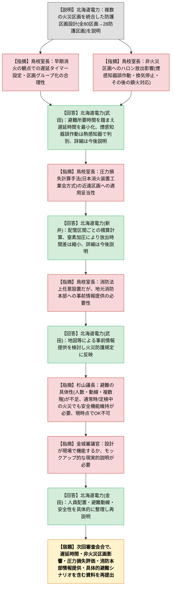

# 第1433回原子力発電所の新規制基準適合性に係る審査会合（令和8年9月3日）
> 出典 : https://youtube.com/live/Dq1k2MR_JAg?si=_VBtjLmJRfhD1NPu

## 会合の概要

- 北海道電力・泊発電所3号機について、ハロゲン化物消火設備（ハロン）を複数の火災区画に同時放出する設計とし、全80区画の火災区画を28区画の防護区画に統合する設定の妥当性が議題となった。
- 説明側は、消防関係法令と原子炉等規制法の火災防護審査基準の両面から、複数区画を統合した防護区画の設定自体を否定する法令上の要求はないとし、区画の類型化・確認項目の整理を通じて技術上の基準を満たしていると主張した。
- 規制庁からは、(1) 早期消火の観点での遅延タイマー設定の合理性、(2) 火災が発生していない区画への放出による煙感知器誤作動・換気停止等の影響、(3) 近い区画と遠い区画への放出圧力・時間差を踏まえた圧力損失計算手法の妥当性、(4) 消防法上は任意設置設備であるが地元消防本部への事前の情報提供の必要性、の4点にわたり具体的な指摘がなされた。
- 審査官・審議官からは、技術的な消火性能の確認だけでなく、実際に発災時に施設内の人員がどのように避難できるかという現実的・具体的な説明（人数・時間・複数フロアにまたがる避難動線）が不足しているとの厳しい指摘があり、「現時点ではOKを出せない」との明言があった。
- 本日示された資料では規制庁の指摘に十分に答えられていないことを北海道電力側も認め、次回審査会合で資料を整えて再説明する方針で合意し、議事を終えた。

## 議題1: 北海道電力（株）泊発電所3号機の設計及び工事の計画の審査について（ハロゲン化物消火設備の防護区画の設定）

### 議論の背景と論点

令和8年6月18日の設置変更許可審査会合において、泊発電所3号炉の所内常設直流電源設備3系統目に関する指摘（新たに設定する火災区画における火災防護設計の詳細、消火設備と火災区画の関係、複数区画への同時消火ガス放出時の避難経路・排気等）が出されていた。この指摘は当該設備に限らず、泊発電所3号機本体施設の火災防護設計全般にも関わることから、本会合では本体施設を対象に、防護区画の設定およびハロゲン化物消火設備に係る火災防護設計の妥当性が議題となった。

争点は大きく二つに整理できる。一つは、消防関係法令上は任意設置設備であるハロゲン化物消火設備について、複数の火災区画を一つの防護区画として統合する設計が、消防法令・原子炉等規制法双方の要求を満たすと言えるかという技術的な論点。もう一つは、火災が発生していない区画にもハロンガスが放出される設計であることに伴う、人命安全確保・実際の避難行動の実効性という、より現場運用に近い論点である。

### 質疑応答（詳細）

- 【説明】北海道電力（新井ほか）: 消防関係法令には複数区画を統合した防護区画を明確に否定する規定がないことを法令解釈上整理した上で、消火性能・人命安全確保・早期消火・火災非発生区域への影響という観点から区画構成を類型化（単一区画、隣接、離れた区画、異なる階、およびこれらの組合せ）し、確認項目を満たすことを確認したと説明した。その結果、全80区画の火災区画を最大限細分化した28区画の防護区画に整理し、防護区画ごとに噴射ヘッドを設置する共有分配方式を採用したとした。
- 【指摘】規制庁・鳥枝室長: 早期消火の観点から、消火設備作動までの遅延時間（人の退避時間を確保するための遅延）の設定根拠と、その遅延設定が問題ないかを追加説明するよう求めた。あわせて、火災が発生していない区画にもハロンが放出されることで、煙感知器の誤作動や換気設備停止等の影響が生じ得ること、また放出後の消火対応の考え方についても、影響を網羅的に検討した上で説明するよう指摘した。
- 【回答】北海道電力（武田）: 消防関係法令上「早期消火」の定義はないが、火災の拡大により防護対象に許容できない影響が生じる前に消火するという初期消火の考え方に基づき、退避に必要な最小限の時間を確保しつつ遅延時間は極力短く設定していると説明した。煙感知器の誤作動については、ハロンが液体（沸点約マイナス58度）から気化する際に一瞬白煙状のミストとなることが原因であり、熱感知器との組合せで実際の火災か否かを現場確認する体制としていると回答した。換気停止の影響は設置許可段階で説明済みであること、放出後に別途火災が生じた場合は消火器・水消火設備等で初期消火にあたること、予備のハロンガスも発電所内に確保していることを説明したが、いずれも本日資料には明記しておらず、今後詳細に説明する意向を示した。
- 【指摘】規制庁・鳥枝室長: 方向性は理解したとした上で、消火剤の噴射圧力・流量の算定に用いている日本消火装置工業会の一般的な計算手法について、単一区画への放出を前提とした手法であるところ、ボンベから近い区画と遠い区画に同時に放出する今回の設計で、放出の時間差・圧力差を踏まえてもこの計算手法で妥当と言えるか、資料からは判断できないとして追加説明を求めた。
- 【回答】北海道電力（新井）: ノズル圧力の算出には消防法施行令第20条で要求される技術上の基準を満たす方法として、配管区間を細かく区切って圧力損失を積算する日本消火装置工業会の計算手法を用いており、この手法は自治体消防や防災メーカーでも広く採用されていると説明した。近いノズルの方が放出開始は早いが、ハロンが液体から気体へ膨張する過程で配管内を高速で流れるため遠いノズルにもほぼ瞬時に到達すること、また放出終盤は窒素ガスによる押し出しで遠いノズルの放出終了が遅くなる分、結果として放出時間差は縮小すると考えられることを説明したが、三次元的に分散した区画構成や時間差の定量的な扱いについては本日資料では十分に説明できていないとして、今後の審査で改めて説明するとした。
- 【指摘】規制庁・鳥枝室長: 口頭説明だけでは理解が難しい部分があるとして、資料に基づいた説明を改めて求めた。
- 【指摘】規制庁・鳥枝室長: ハロゲン化物消火設備が消防法上は任意設置設備であり、予防の観点から地元消防本部・消防署への届出義務がないことは理解しているとしつつ、複数区画同時放出という消防法が想定していない複雑な放出形態であるため、実際に119番通報を受けて地元消防本部が現場に到着した際、火災が発生していない区画でハロンが放出中という状況に混乱し対応が遅れるおそれがあると指摘し、管轄消防本部への事前の情報提供・体制整備を求めた。
- 【回答】北海道電力（武田）: 初期消火は発電所常駐者による対応（自動放出を含む）で行い、最終的な鎮火確認は地元消防に来てもらい行う体制であるとした上で、どの区画でハロンが放出され、どのような検知状況かを消防隊が現場で迷わないよう、事前に分かりやすい地図等を用いて情報提供・説明を行い、今後策定する火災防護規定にも反映していく方針を示した。
- 【指摘】議長・杉山（審査官）: 「避難時間等を確認した」という結論のみでは納得できないとし、ある時点でどこに何人いて、ハロン放出後どこからどこへ、複数フロアにまたがってどのように避難できるのかを具体的に示すよう求めた。また、火災防護基準はシビアアクシデント時の火災対応だけでなく、通常運転中・定検中の火災であっても停止機能や安全設備の機能を損なわないことを求める基準であるとした上で、アクセスルートを使用中の人員がいる状態でハロンが放出されても本当に安全と言えるのか懸念を示し、現時点では了承できないとして、資料の充実を求めた。
- 【回答】北海道電力（金田）: 本日の資料は規制庁の指摘に十分に答えるものになっていなかったことを認め、指摘内容を踏まえ、どの程度の人員がどのように安全に避難できるかを含めて資料を整理し、改めて説明する意向を示した。
- 【指摘】規制庁・金城審議官: 審査官の指摘と重なるとしつつ、設計通りに現場で機能するか、機能した場合に何が起き、現場が対応できるのかについて、モックアップ的な、より現実的・具体的な説明が必要であるとの見解を示した。
- 【回答】北海道電力（金田）: 人がどのような状態からどのように避難し、安全に対応できるかという点と、火災区画における消火・延焼防止という技術的な説明の両面について、改めて具体的に説明していく方針を示した。
- 【進行】規制庁・中川: 会合のまとめとして、北海道電力からは複数火災区画を統合し非火災区画も含めて同時消火する設計の説明があったこと、規制庁からは早期消火・遅延時間の設定合理性、非火災区画への影響要因の抽出、複数区画への消火剤噴射能力の評価手法の妥当性、および管轄消防本部への情報提供について指摘があったことを確認し、次回審査会合で資料を準備した上で説明するよう求めた。

### 結論と宿題事項（アクションアイテム）

- 本日の議題については了承・不了承の判断に至らず、次回審査会合に持ち越しとなった。
- 北海道電力は、次回説明までに以下を含む資料を準備することとなった。
  1. 遅延タイマー設定の考え方と、区画グループ化の合理性の裏付け
  2. 非火災区画へのハロン放出に伴う影響（煙感知器誤作動、換気停止等）の網羅的な検討結果
  3. 近距離・遠距離区画へ同時放出する場合の圧力損失計算手法（日本消火装置工業会方式）の妥当性、放出時間差の定量的な説明
  4. 管轄消防本部への事前の情報提供・体制整備の具体策
  5. 実際の火災発生時に施設内人員が安全に避難できることを示す、具体的な人員配置・避難動線・避難所要時間を踏まえた現実的な説明（複数フロアにまたがるケースを含む）
- 議長は、特に5点目（避難の実効性）について現時点では了承できないとの姿勢を明確に示しており、次回審査会合での焦点になると見込まれる。

## 論理構造の可視化（Mermaid）

