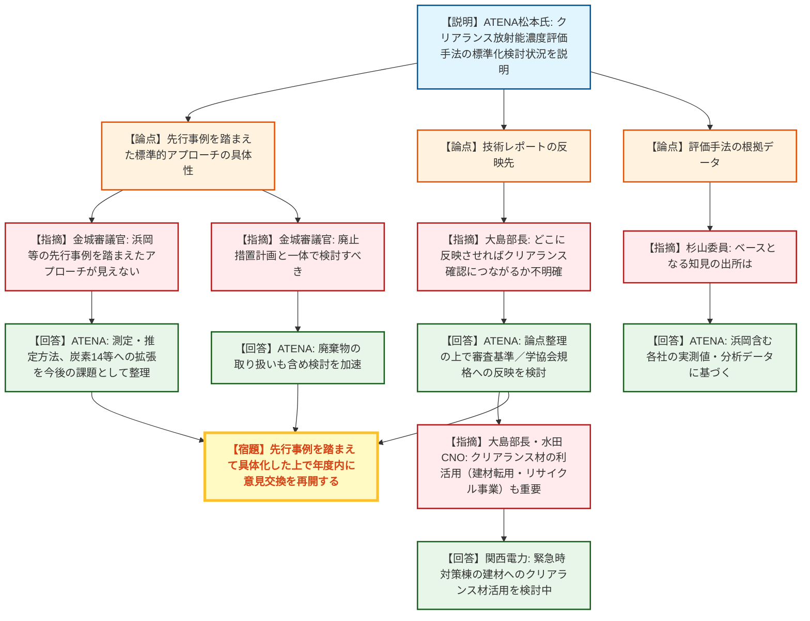
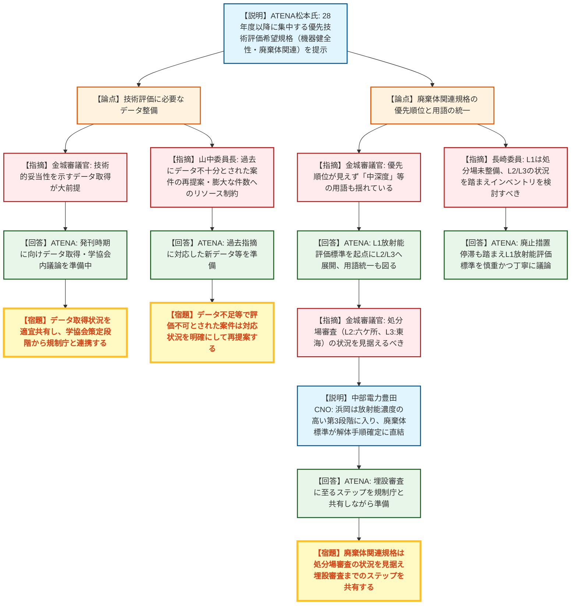
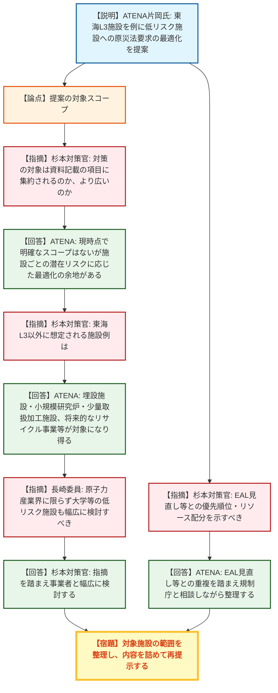
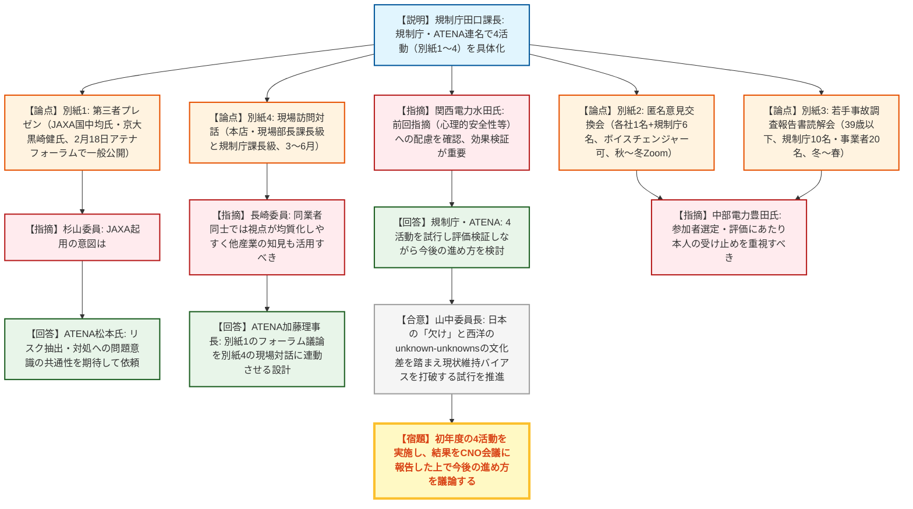

# 第24回主要原子力施設設置者（被規制者）の原子力部門の責任者との意見交換会（令和8年9月3日）
> 出典 : https://youtube.com/live/Jirtbo97XYw?si=xfadUzGm7fvFLJJr

## 会合の概要

* **クリアランス評価手法の標準化提案に「具体性不足」の指摘**
  ATENAが核種選定・不確かさ評価の合理化に向けたクリアランス放射能濃度評価手法の標準化検討状況を説明したが、規制庁は浜岡など先行事例を踏まえた標準的アプローチが見えないと指摘。次回以降は具体的に困っている点から議論を始める方針で一致した。
* **規格基準の技術評価要望が28年度以降に集中、データ整備が焦点に**
  機器健全性関連・廃棄体関連の規格類について、規制庁は技術的妥当性を裏付けるデータの重要性を繰り返し強調。委員長は過去にデータ不足で評価不可とされた案件を再提案する際の留意を求め、双方のリソース制約も課題として共有された。
* **廃棄物埋設施設の「低リスク」防災対応最適化を提案**
  ATENAは東海L3廃棄物埋設施設を例に、原災法上の防災業務計画・組織・設備等をリスクに応じて最適化するグレーディッドアプローチの検討を提案。規制庁は対象範囲の明確化と、EAL見直し等の他検討との優先順位整理を求めた。
* **「欠け（unknown-unknowns）」対応の4活動が具体化、2月以降順次試行**
  第三者プレゼンテーション（JAXA・京都大学）、匿名意見交換会、若手による事故調査報告書読解会、現場訪問対話の4活動の詳細が固まり、今年度内から順次試行される。山中委員長は日本特有の「現状維持バイアス」を打破する必要性を強調した。
* **その他：運転期間延長（長期サイクル運転）の手続き確認**
  関西電力が運転サイクルを現行の13か月から変更するための規制上の手続きについて規制庁と面談を終え、申請に向けた準備を進める方針を表明した。

---

## 議題ごとの詳細整理

### 【議題1】クリアランスにおける放射能濃度評価手法について

* **議論の背景と論点：**
  廃止措置の本格化に伴い大量・広範なクリアランス対象物の発生が見込まれる中、ATENAは核種選定・核種組成比・不確かさ評価を合理化する共通手順（放射能評価手法の標準化）を技術レポートとして取りまとめ中であり、規制庁・規制委員会との公開の場での議論開始を提案した。争点は、提案内容が抽象的で、浜岡など先行事例を踏まえた具体的な標準アプローチが見えないことであった。

* **質疑応答（詳細）：**
  * 【説明者側】ATENA松本氏
    クリアランス手続きの共通手順整備を優先取組案件として位置づけ、事前調査・核種選定・放射能濃度評価手法の3点を技術レポートに取りまとめ中であると説明した。
  * 【規制側】金城審議官
    説明だけでは取組の中身が見えず、何を目的に意見交換したいのか不明確であると指摘。現場では浜岡（中部電力）などクリアランス対象物の増加に対し保守性ではなく利活用の遅れが課題になっており、まず先行事例を踏まえた標準的アプローチを示した上で、そこでの課題を個別に議論すべきではないかと提起した。
  * 【説明者側】ATENA松本氏
    今回は具体例を盛り込めなかったことを認めた上で、発生経路が不明な対象物の測定・推定方法、コバルト60中心の評価を炭素14等にどう広げるかが今後の課題であると説明。またクリアランスの「入口」（対象物の判定）が今回の主題であり、「出口」（発電所外への利用）は事業者側の課題と整理した。
  * 【規制側】大島部長
    レポート取りまとめ自体は有益だが、どこにどう反映させれば審査基準や学協会規格のエンドースにつながるのかが不明確であるとして、課題を整理した上で意見交換すべきと求めた。
  * 【説明者側】ATENA松本氏
    技術レポートを制定した上で、審査基準または学協会規格のどちらに反映すべきかは今後の検討課題として議論していくと回答した。
  * 【規制側】杉山委員
    技術レポートのベースとなる知見の出所を質問。
  * 【説明者側】ATENA松本氏
    浜岡を含む各社が測定した実際のデータに基づき評価を加えたものであり、今後もデータの蓄積に応じてレポートを更新していくと回答した。
  * 【規制側】大島部長
    クリアランス物の利活用（福井県でのリサイクル活動、高校生等による取組）を引き続き後押ししたいと表明。
  * 【説明者側】関西電力水田氏
    緊急事態対策棟の新築にあたりクリアランス材を建材として使用する計画を紹介し、評価手法の標準化が利活用の推進にもつながると期待を示した。
  * 【規制側】金城審議官
    クリアランスは廃止措置計画（履歴不明物の分別等）と表裏一体であり、廃止措置の在り方も含めて議論すべきと要請。
  * 【説明者側】ATENA松本氏
    現状の廃止措置計画は解体・設備維持に重点が置かれているとしつつ、廃棄物の取り扱いも含め検討を加速すると回答した。
  * 【規制側】山中委員長
    クリアランスは廃止措置の物量に大きく影響するテーマであり、今回の資料はあっさりしすぎているとして、情報を増やし具体化した議論を求めた。

* **結論と宿題事項（アクションアイテム）：**
  * **決定事項：** クリアランス放射能評価手法の標準化に取り組むこと自体は妥当と了承された。技術レポートの反映先（審査基準／学協会規格）は今後の検討課題として持ち越された。
  * **宿題事項：** ATENAは浜岡など先行事例を踏まえた具体的な困りごと・論点を整理し、情報量を増やした上で、年度内に改めて意見交換を行う。

---

### 【議題2】規格基準の技術評価について

* **議論の背景と論点：**
  ATENAは、6月の会合で示したロードマップのうち特に28年度以降に技術評価が集中する規格（機器健全性関連4件、廃棄体関連4件）について、改めて技術評価開始を要望した。論点は、技術評価の前提となるデータ整備の状況、廃棄体関連規格の優先順位・用語の整理、および規制庁・ATENA双方のリソース制約であった。

* **質疑応答（詳細）：**
  * 【説明者側】ATENA松本氏
    PWR炉心槽の亀裂評価（JSME S-NA-CC-0XX、米国ロビンソン炉での傷確認を受け国内点検開始に備える）、原子炉構造材の監視試験、圧力容器の供用期間中破壊靭性試験、フェライト鋼、蒸気発生器伝熱管の供用期間中渦流探傷試験（ECTプローブ製造中止への対応）を28年度技術評価開始の優先案件として説明した。
  * 【規制側】金城審議官
    技術評価には技術的妥当性を示すデータの取得が大前提であり、過去にデータ不足でエンドースに至らなかった例があると指摘。各規格のデータ取得準備状況の説明を求めた。
  * 【説明者側】ATENA松本氏
    発刊時期を目指してデータを揃え学協会内で議論を進めており、規制庁が策定段階から参加していることが審査上必要な項目の把握に有益であると回答した。
  * 【規制側】金城審議官
    廃棄体関連規格（3ページ）について、2028・2030年度と時期が並ぶ中で優先順位が見えにくく、「中深度」「余裕深度」等の用語も資料内で揺れていると指摘。
  * 【説明者側】ATENA松本氏
    まずL1放射能評価標準を策定し、それを踏まえてL2・L3の放射能評価標準につなげる段取りであり、L2容器の製作・検査標準は検討が先行しているためスケジュールに先に記載したと説明。用語の揺れは事務局に伝えて統一を図ると回答した。
  * 【規制側】金城審議官
    廃棄体の審査は具体的な処分場審査（L2は六ケ所事業、L3は現在進行中の事業）と連動するため、その状況を見据えて準備すべきと要望。また「廃棄物」「廃棄体」の呼称も統一するよう求めた。
  * 【説明者側】中部電力豊田CNO
    浜岡は放射能濃度の高い第3段階の処理に入りつつあり、L1・L2廃棄体の標準が定まることでサンプリング方法や容器サイズ、解体・収納手順が具体化するとして、規格策定を強く要望した。
  * 【規制側】金城審議官
    廃棄体の審査は最終的に埋設の審査で見ることになるため、そこに至るステップを規制庁と共有しながら準備を進めるよう要請。解体廃棄物の審査実績があるのは現状東海のみである点も念頭に置くよう付言した。
  * 【規制側】長崎委員
    L1は処分場の想定自体がなく、L2は六ケ所事業、L3は日本原電で準備が進む中、処分上重要となるインベントリの考え方についてL1から規制庁と情報共有・意識合わせを進めるよう要請。
  * 【説明者側】ATENA松本氏
    処分場が定まらないと議論が進まない面はあるが、廃止措置停滞というデメリットもあるため、L1放射能評価標準は慎重かつ丁寧に議論すると回答した。
  * 【規制側】山中委員長
    過去に「データ不十分」と評価された案件が今回の優先リストに含まれていることを指摘し、古い図表や実際には使われていない測定法の記載が残っているケースもあったとして、事前の議論を尽くした上での再提案を求めた。提案数・分量とも膨大であるため、委員会内でも優先順位付けを議論する必要があると付言した。
  * 【説明者側】ATENA松本氏
    過去の指摘内容は承知しており、同じ指摘を繰り返さないよう新データ等を準備すると回答した。
  * 【規制側】金城審議官
    規制庁側もリソースに限りがあるため、検討状況・スケジュールを事務局に適宜詳しく共有し、学協会の規格策定段階から技術的妥当性を説明できるよう準備してほしいと要請。
  * 【説明者側】ATENA松本氏
    学協会の中立性・独立性を踏まえつつ、スケジュール管理を中心に規制庁と密に連携すると回答した。

* **結論と宿題事項（アクションアイテム）：**
  * **決定事項：** 規格基準の技術評価が審査効率化・最新知見反映の観点で有益であることは双方が確認。個別規格の技術評価着手はデータ整備状況を踏まえ順次判断する。
  * **宿題事項：**
    1. 各規格について、技術評価に必要なデータ取得状況を規制庁に適宜共有すること。
    2. 廃棄体関連規格の優先順位の考え方と用語（廃棄物／廃棄体、中深度等）の統一を整理すること。
    3. 廃棄体関連規格は処分場審査（L2:六ケ所、L3:東海）の状況を見据え、埋設審査に至るステップを規制庁と共有すること。
    4. 過去にデータ不足等で評価不可とされた案件は、指摘への対応状況を明確にした上で再提案すること。

---

### 【議題3】廃棄物埋設施設等におけるリスクに応じた原子力防災対応について

* **議論の背景と論点：**
  許認可制度見直しの意見交換の中で事業者から提案があったテーマで、ATENAは東海L3廃棄物埋設施設を例に、取り扱う放射能レベル・ハザードが低く原子力災害対策指針上PAZ・UPZの設定も不要な低リスク施設について、原災法が求める防災業務計画・組織・設備等をリスクに応じて最適化（グレーディッドアプローチ）できないか提案した。論点は、提案の対象範囲の明確さと、他の検討テーマとの優先順位整理であった。

* **質疑応答（詳細）：**
  * 【説明者側】ATENA片岡氏
    東海L3施設は評価上大きな保守性を考慮しても敷地外への影響が限定的で、臨界のような急激な事象進展もなく、原災法で規定される通報基準にも達しないレベルと評価されている一方、実用炉と同等の防災業務計画・組織・設備等を廃止措置終了まで長期間維持する必要があるのが現状であると説明し、リスクに応じた規制の最適化を提案した。
  * 【規制側】杉本対策官
    グレーデッドアプローチは事業者防災訓練の簡素化など既に一部取り入れており、今回の提案は原災法上の防災業務計画・組織・設備等の最適化と理解した上で、対策の対象がどこまでのスコープか（資料記載の項目に集約されるのか、より広いのか）を質問。
  * 【説明者側】ATENA片岡氏
    現時点で明確なスコープはないが、原災法は全事業者に適用される一方RI施設等は適用除外があるように、施設ごとの潜在的リスクの違いに応じた最適化の余地があるとの認識を示した。
  * 【規制側】杉本対策官
    資料タイトルは「廃棄物埋設施設等」と広く捉えているが、説明は東海L3のみであるため、他に想定する施設例を質問。
  * 【説明者側】ATENA片岡氏
    原子力災害対策指針でPAZ・UPZ設定が不要とされる埋設施設・小規模研究炉・少量取扱いの加工施設等に加え、廃止措置の進展で燃料取り出し後の原子炉施設や、福井県で検討されているリサイクル事業のような既存施設とは独立した低リスク施設も対象になり得ると説明した。
  * 【規制側】長崎委員
    リスクに応じた原災法対応の最適化は原子力産業界に限らず、大学や他の核燃料サイクル施設の低リスク施設も含め幅広に検討すべきと要請。
  * 【規制側】杉本対策官
    長崎委員の指摘も踏まえて事業者と対応するとした上で、EALの見直し等リソース配分に関連する他検討との優先順位を示してほしいと要望。
  * 【説明者側】ATENA片岡氏
    EAL見直し等と重複・関連する部分があるため、規制庁側の検討状況とのバランスを見ながら相談して進めたいと回答した。

* **結論と宿題事項（アクションアイテム）：**
  * **決定事項：** リスクに応じた原子力防災対応の最適化という方向性自体は妥当と了承された。対象施設の範囲や具体的な最適化内容は未確定。
  * **宿題事項：** ATENAは対象施設の範囲（東海L3以外の例を含む）とEAL見直し等との関連・優先順位を整理し、規制庁と面談等で内容を詰めた上で改めて提案する。

---

### 【議題4】「欠け（unknown-unknowns）」への対応について

* **議論の背景と論点：**
  継続的安全性向上の一環として複数回議論してきたテーマで、前回提案した4つの活動案について事業者側とATENAが詳細を詰め、今回具体化した内容が報告された。論点は、各活動の設計意図（他産業起用の狙い、活動間の連動設計）と、初回実施にあたっての配慮・評価方法であった。

* **質疑応答（詳細）：**
  * 【説明者側】規制庁田口課長
    規制庁・ATENA連名の資料として、別紙1〜4の4活動を説明。共通コンセプトは、科学的技術的事項に限らず制度面・運営面も対象に、通常と異なる「揺らぎ」を与える議論で普段浮かび上がりにくい課題（欠け）の端緒を捉えることであり、今回はまず試行し、結果をCNO会議に報告しながら今後の進め方を検討するとした。
    * 別紙1：第三者（JAXA国中均氏、京都大学黒崎健氏）を招いたプレゼンテーションとディスカッションを、アテナフォーラム内（2月18日予定）で実施し、当日一般公開・事後にATENAホームページで結果公開する。
    * 別紙2：匿名意見交換会。各社1名程度・規制庁6名程度が参加し、希望者はボイスチェンジャーを使用可能。中立ファシリテーターは山梨県立大学松井亮太氏・長岡技術科学大学大場恭子氏。事前の組織的な発言調整や事後確認を行わないことを条件とし、秋から冬にかけZoom等で開催予定。
    * 別紙3：事故調査報告書を読んだ若手（39歳程度まで）による議論会。規制庁10名・事業者20名程度が参加し、原子力学会倫理部会の研究会として冬から春頃に開催予定。福島第一原子力発電所事故の対応経験者による講演も予定し、一部報道公開も検討する。
    * 別紙4：事業者現場への訪問対話。本店・現場の部長／課長クラスと規制庁課長クラス・規制事務所職員が参加し、別紙1のフォーラム議論を引き継いで現場見学を行った上で議論する。3月から6月頃に実施予定。
  * 【説明者側】ATENA加藤理事長
    技術的な欠けが実際に見つかるかは未知数だが、管理面・制度面を含め「他業界ではこうしている」といった気づきが得られることに意義があると補足した。
  * 【規制側】杉山委員
    別紙1で他産業からJAXAを起用する意図（宇宙産業の「安全」は人命に関わる安全と直結するイメージが薄いのでは）を質問。
  * 【説明者側】ATENA松本氏
    JAXAは有人飛行や公衆安全の実績こそ少ないが、ミッション成功のためリスク評価・対処に真摯に取り組んでおり、同様の問題意識をもとに「揺らぎ」を得たいとの狙いで依頼したと回答した。杉山委員は否定的な趣旨ではないと断った上で、今後シリーズ化する場合はより安全のイメージに近い分野の識者も招いてほしいと要望した。
  * 【規制側】長崎委員
    別紙4の現場訪問について、同じ原子力産業界・同じ電気事業者同士では「お互いちゃんとやっている」という先入観のフィルターがかかりやすいとして、他産業へも視野を広げる取組を将来的に検討してほしいと要請。
  * 【説明者側】ATENA加藤理事長
    同じ関係者同士では発想が似通いがちであるため、まず別紙1のアテナフォーラムでの他産業講演・ディスカッションを踏まえた上で現場対話につなげる設計とし、初回の結果を見て見直していくと回答した。
  * 【説明者側】関西電力水田氏
    前回指摘した配慮事項（心理的安全性等）が今回反映されていることを評価しつつ、4活動とも実施後の評価・検証が重要であると強調した。
  * 【説明者側】中部電力豊田氏
    別紙2・3のような各社・若手の人選を想像すると、参加者自身がどう感じたかを規制庁側でも重視して評価してほしいと要望した。
  * 【規制側】山中委員長
    日本では「欠け」という神秘的な言葉のために「100%安全は不可能であり考えても意味がない」という現状維持バイアスが働きやすい一方、西洋では安全工学・信頼工学等の観点から「アジャイルレギュレーション」「イネーブリングセーフティ」といった概念で継続的安全性向上を不可能ではないものとして扱っていると対比。規制庁・事業者双方に、技術論・制度論の両面でこのバイアスを突き破るトライアルを求めた。

* **結論と宿題事項（アクションアイテム）：**
  * **決定事項：** 別紙1〜4の4活動を今年度の試行として実施することが了承された。
  * **宿題事項：**
    1. ATENAは別紙2の匿名意見交換会（秋〜冬）、別紙3の若手議論会（冬〜春）、別紙4の現場訪問対話（3〜6月）を、別紙1のアテナフォーラム（2月18日）と連動させながら順次実施する。
    2. 各活動終了後、参加者自身の受け止めを含めて効果を評価・検証し、結果をCNO会議に報告した上で今後の実施方針を見直す。

---

### その他：運転期間延長（長期サイクル運転）に係る手続き確認

* 【説明者側】関西電力水田氏
  運転サイクルを現行の13か月から変更するために必要な規制上の手続きについて、7月23日の面談で規制庁と確認できたと報告し、安全最優先で実機プラントへの導入を図るべく申請に向けた準備を進める方針を表明した。
* 【規制側】大島部長
  面談で事務的な調整を進めており、準備が整い次第申請の話になるとの認識を共有。あわせて運転中保全（既にパブコメ手続き中）やLCO見直し（法令規定の認可申請提出済み、審査会合での議論もほぼ収束）など他の優先取組案件も進展しているとして、ATENAの優先取組案件リストの見直しを求めた。
* 【説明者側】ATENA松本氏
  進展のあった項目（LCO見直し等）は一覧からグレーアウトするなど、優先取組案件リストを適宜アップデートしていくと回答した。

---

## 論理構造の可視化（Mermaid）

### 【議題1】クリアランスにおける放射能濃度評価手法について

### 【議題2】規格基準の技術評価について

### 【議題3】廃棄物埋設施設等におけるリスクに応じた原子力防災対応について

### 【議題4】「欠け（unknown-unknowns）」への対応について

