# 第16回クリアランスに関する審査会合（令和8年9月7日）
> 出典 : https://youtube.com/live/CDfBsFT8iJo?si=UczS1mwI1QedOWHD

## 会合の概要

- 東京大学の研究用原子炉「弥生」の廃止措置に伴うクリアランス(放射能濃度確認)の測定・評価方法承認申請について、東京大学からの説明と規制庁による質疑が行われた。既存の電力事業者(主に浜岡方式)の審査実績を参考にしつつ、研究炉特有の事情(低稼働率、高速中性子源、実験ポートなど)を踏まえた独自の評価手法を構築している点が特徴。
- コンクリート類(重コン・普通コン)については保守的な場所からのサンプル測定による評価手法が概ね了承された一方、炭素鋼については最大汚染モデル(浜岡方式)の適用の妥当性・保守性の程度について複数の規制庁委員から疑義が示され、東京大学は再検討を約束した。
- 規制庁の複数の委員(佐田氏・川崎氏)から、「先行電力(浜岡)の手法をそのまま踏襲すると過度に保守的になりすぎ、実際にはクリアランス可能な物量が処理できなくなる恐れがある」との指摘があり、東京大学の汚染モード(付着汚染ではなく放射化汚染)に即した独自の検討を求められた。
- 放射能濃度評価日、不確かさと保守性の書き分け、ステンレス材の扱いなど、記載の整合性に関する複数の補正指示が出され、いずれも東京大学は同意し、次回会合までに整理して再説明する方針。
- 今回は東京大学にとって初めてのクリアランス申請であり、規制庁からは測定要員の教育訓練・QMS・測定機器点検など運用面の着実な準備を求めるコメントもあった。

## 議題ごとの詳細整理

### 東京大学原子炉(弥生)において用いた資材に含まれる放射性物質の放射能濃度の測定及び評価の方法の承認申請について

**議論の背景と論点**

東京大学の研究炉「弥生」の解体に伴い発生するコンクリート(重コン・普通コン)、炭素鋼、鉛について、クリアランス(放射能濃度確認)のための測定・評価方法の承認を申請するもの。弥生は実用発電炉と異なり、小型・低出力・低稼働率(稼働率1%程度)の高速中性子源炉であり、電力事業者の先行事例(浜岡等)をベースとしつつも、炉特有の汚染モード(付着汚染ではなく放射化汚染)や、ビームポート等によるストリーミングの影響、地下遮蔽が当初の安全審査で評価されていなかった点など、独自に検討すべき論点が多い。

**質疑応答（詳細）**

- 【規制庁・川崎氏】評価計算の妥当性確認にステンレス材のデータを使用しているにもかかわらず、本文中ではステンレス材を申請対象から除外する記載があり、整合性が取れていないと指摘。【東京大学】除外の記載を補正するか、妥当性確認からステンレス材を除く方向で検討すると回答。
- 【規制庁・川崎氏】炭素鋼にトリウムやウランが含まれていないにもかかわらず評価結果に超ウラン元素(プルトニウム、アメリシウム)が出てくる点について、根拠の説明を申請書に追記すべきと指摘。【東京大学】計算コードの特性によるものだが、誤解を招かない記載に改めると回答。
- 【規制庁・高橋氏】放射性核種の選定における放射化計算の妥当性について、コンクリート類は中性子エネルギースペクトル形状の変化とユーロピウム初期濃度の変動幅を考慮しても選定結果(主要核種はコバルト60とユーロピウム152)に影響しないことを確認したと理解してよいか確認。【東京大学】その理解でよく、ユーロピウム初期濃度に関する図についても補正すると回答。
- 【規制庁・高橋氏】ビームポート等による中性子ストリーミングの影響について、最も運転時間の長いシールドプラグ位置で影響がないことを確認しており、他のポート部についても炉心に近い保守的な位置からサンプルを採取すれば評価上問題ないと考えてよいか確認。【東京大学】その通りであり、他のポートも問題ないと考えていると回答。
- 【規制庁・高橋氏】重コン・普通コンの放射化計算とゲルマニウム測定の比較結果において、評価対象核種として選定すべき第3の核種(コバルト60、ユーロピウム152以外)がないことを確認したと理解してよいか確認。【東京大学】その通りと回答。
- 【規制庁・高橋氏】コンクリートの保守的な採取位置がブロックごとに変わりうる点や、サンプル採取の厚さ(審査基準で目安とされる建屋コンクリート5cm程度等)の考え方を申請書に明記し補正すべきと指摘。【東京大学】その方向で補正すると回答。
- 【規制庁・高橋氏】炭素鋼の最大汚染モデルに関し、(1)1測定単位あたり何グラムをいくつ溶解するのか、(2)溶解後の溶液の体積、(3)小領域における最大放射能濃度を決めるための想定体積、の3点を確認。【東京大学(鈴木氏)】(1)1つの測定単位に対して最低1つ以上を測定、(2)100mLのメスフラスコで規格化、(3)炭素鋼約30g(直径10mm・長さ5cm程度、比重7.3前後)を想定していると回答。
- 【規制庁・川崎氏】最大汚染モデルは本来、コンクリートのようにサンプル測定で決める手法とは前提条件(小領域の大きさとの関係)が異なるのではないかとコメント。小さすぎるサンプルで決めると過度に保守的になる懸念を指摘し、換算係数の算定にモンテカルロ法や汎用のISOCS法を用いる等、他の評価方法の検討も提案。【東京大学】ヒアリングでも同様の指摘を受けており、溶解測定以外の方法(ISOCS等)も含めて検討中で、今回の会合時点では最終的な結論に至っていないと回答。
- 【規制庁・米永氏】鉛(Ag-108m)の放射能濃度評価日について、申請書本文では「あらかじめAg-108mの評価日として設定される」とある一方、補足説明資料では「最終搬出予定日(2032年3月31日)」と記載されており、半減期による減衰を考慮すると、最終搬出予定日を評価日とするより評価対象核種選定の基準日(2026年4月1日)や確認申請日を評価日とする方が保守的であり、搬出時点によってはD/Cが1を超える可能性を否定できないと指摘。概要書では「確認申請日前の任意の時点」と説明されていたことから、申請書の記載も概要書に合わせて補正されるか確認。【東京大学】その通り補正すると回答。
- 【規制庁・佐田氏】炭素鋼の収納方法の検討、トレイ型の採用検討、妥当性確認試験、弥生の汚染状況を踏まえた設定、対象物の見直し等の一連の検討事項は了承するが、浜岡方式は生体遮蔽外側の付着汚染(ランダム型点源)を前提とした手法であるのに対し、弥生の汚染モードは放射化汚染であり性質が異なるため、東京大学固有の汚染モード・測定条件に即して検討すべきと指摘。参考資料の実測値(最大D/C=1、平均D/C=0.21)ではクリアランスレベルを実力上満足しているにもかかわらず、浜岡方式をそのまま適用するとNGになってしまう例があるとし、過度に保守的になりすぎないよう整理して次回会合で説明するよう要請。【東京大学(斉藤氏)】先行電力の手法を踏襲すれば審査に通ると考えていた面があったが、ヒアリングを重ねる中で保守性の部分が弥生の実態に合わないことが分かってきたとし、弥生と先行電力の違いを改めて整理した上で、方法論を修正し次回説明すると回答。
- 【規制庁・川崎氏】(1)申請書に記載のピークBG測定は浜岡の発電所で測定室外の線源移動を想定したものであり、東大の場合は周囲に線源がなく不要ではないか、(2)最大汚染モデルの前提条件として、小領域内の放射能が既知量であることの保証と、実際の測定値が均一密度前提の測定値より過度に小さくならないことの確認が必要である旨を改めて指摘。【東京大学】ピークBGについてはヒアリングでも指摘されており、先行電力の記載をそのまま流用してしまっていたため削除して補正する。最大汚染モデルの前提(既知量であることの保証、遮蔽の考え方)についても理解しており、説明を用意すると回答。
- 【規制庁・井上氏】放射能換算係数の設定において、不確かさとして評価されたパラメータと保守的に設定(丸め)されたパラメータが混在した書き方になっており、どの段階で不確かさが保守的な値に置き換わったかが分かるように記載すべきと指摘。また放射化計算の不確かさについても、各要因の値は示されているが、それらを合成した最終的な不確かさが示されていないため、表等で示してほしいと要請。【東京大学(斉藤氏・鈴木氏)】不確かさを積み上げて評価した上で最終的に片側に丸めて保守的な値に落とし込む過程を、読んで分かるように記載する。合成不確かさについても評価し本文に記載する方向で対応すると回答。
- 【規制庁・佐賀氏】東京大学にとって初めてのクリアランス作業となることを踏まえ、認可後は放射能濃度確認対象物以外の異物混入や追加汚染防止の措置を保安規定・学内規定に定めて実行すること、測定従事者の教育訓練・QMS・測定機器点検などの体制整備を計画的に進めるよう要請。【東京大学(斉藤氏)】保安規定・所内規定の整備、下請け含めた適切な訓練の実施等、着実に対応すると回答。

**結論と宿題事項（アクションアイテム）**

- ステンレス材の扱い、超ウラン元素の記載根拠、ユーロピウム初期濃度の図、放射能濃度評価日(鉛)、サンプル採取厚さの根拠、ピークBG測定の要否、不確かさと保守性の書き分け・合成不確かさの提示など、記載整合性に関する複数の指摘についてはいずれも東京大学が補正に同意した(条件付き了承)。
- 炭素鋼の最大汚染モデル適用の妥当性・保守性については結論に至らず、次回会合までの持ち越しとなった。東京大学は浜岡方式をベースにしつつも弥生固有の汚染モード(放射化汚染)に即した方法論へ修正し、モンテカルロ法やISOCS法等の代替評価方法も比較検討した上で、選定理由とともに次回会合で改めて説明する。
- コンクリート・炭素鋼の保守的採取位置の考え方、放射能換算係数の不確かさ評価の書きぶりについても、申請書補正の上で改めて審査会合または個別のヒアリングで確認する。
- 全体として、東京大学は先行電力(浜岡)の手法を参考にしつつも、過度な保守性によりクリアランス対象物量が処理できなくなることのないよう、弥生の実態に即した合理的な方法論を整理し、次回会合で提示する方針が確認された。

## 論理構造の可視化（Mermaid）

### 東京大学原子炉(弥生)クリアランス測定・評価方法承認申請

```mermaid
graph TD
    classDef explain fill:#cfe2ff,stroke:#3366cc,color:#000;
    classDef issue fill:#ffd6d6,stroke:#cc3333,color:#000;
    classDef point fill:#fff2cc,stroke:#cc9900,color:#000;
    classDef answer fill:#d9f2d9,stroke:#339933,color:#000;
    classDef homework fill:#ffe0b3,stroke:#e67300,color:#000,font-weight:bold;
    classDef agree fill:#e6e6e6,stroke:#666666,color:#000;

    S1["【説明】弥生解体に伴うクリアランス申請の概要(コンクリート・炭素鋼・鉛の測定評価方法)"]:::explain
    S1 --> P1["【論点】ステンレス材"]:::point
    P1 --> I1["【指摘】妥当性確認にステンレス材を使用しているが本文では除外と記載、不整合(川崎)"]:::issue
    I1 --> A1["【回答】除外記載を補正、または妥当性確認から除く方向で検討"]:::answer

    S1 --> P2["【論点】超ウラン元素の出現根拠"]:::point
    P2 --> I2["【指摘】ウラン・トリウムを含まないのに超ウラン元素が計算結果に出る理由が不明(川崎)"]:::issue
    I2 --> A2["【回答】計算コードの特性、誤解のない記載に修正"]:::answer

    S1 --> P3["【論点】評価対象核種選定の妥当性"]:::point
    P3 --> I3a["【指摘】エネルギースペクトル・ユーロピウム初期濃度変動でCo-60/Eu-152の選定は変わらないか(高橋)"]:::issue
    I3a --> A3a["【回答】その理解でよい、図は補正する"]:::answer
    P3 --> I3b["【指摘】重コン・普通コンで第3核種はないと理解してよいか(高橋)"]:::issue
    I3b --> A3b["【回答】その通り"]:::answer
    A3a --> AG3["【合意】主要核種はCo-60とEu-152"]:::agree
    A3b --> AG3

    S1 --> P4["【論点】中性子ストリーミングの影響"]:::point
    P4 --> I4["【指摘】ビームポート等の影響は他ポートも含め無視できるか(高橋)"]:::issue
    I4 --> A4["【回答】最長運転のシールドプラグ位置で影響なしを確認、他ポートも問題ないと考える"]:::answer

    S1 --> P5["【論点】コンクリート採取位置・厚さ"]:::point
    P5 --> I5["【指摘】保守的位置がブロックごとに変わる点、採取厚さの根拠(審査基準5cm等)を明記すべき(高橋)"]:::issue
    I5 --> A5["【回答】その方向で補正"]:::answer

    S1 --> P6["【論点】炭素鋼の最大汚染モデル運用パラメータ"]:::point
    P6 --> I6["【指摘】溶解量・溶液体積・小領域想定体積を確認したい(高橋)"]:::issue
    I6 --> A6["【回答】約30g(直径10mm×5cm)を100mLに溶解、測定単位ごとに最低1つ測定"]:::answer

    S1 --> P7["【論点】最大汚染モデルの適用妥当性"]:::point
    P7 --> I7["【指摘】コンクリート(サンプル測定)と炭素鋼(溶解測定)で前提条件が異なるのでは、小サンプルは過度に保守的では(川崎)"]:::issue
    I7 --> H7["【宿題】モンテカルロ法・ISOCS法等の代替評価方法も含め比較検討し次回説明"]:::homework

    S1 --> P8["【論点】鉛(Ag-108m)の放射能濃度評価日"]:::point
    P8 --> I8["【指摘】本文は「あらかじめ設定」、補足資料は「最終搬出予定日」で不整合、搬出時点次第でD/Cが1超の恐れ(米永)"]:::issue
    I8 --> A8["【回答】概要書の「確認申請日前の任意の時点」に合わせて補正"]:::answer

    S1 --> P9["【論点】炭素鋼の汚染モードと浜岡方式の適用範囲"]:::point
    P9 --> I9["【指摘】浜岡方式は付着汚染(ランダム型点源)前提、弥生は放射化汚染で性質が異なる。過度な保守性でクリアランス物量が処理できない恐れ(佐田)"]:::issue
    I9 --> H9["【宿題】弥生固有の汚染モードに即して方法論を修正し次回会合で説明"]:::homework

    S1 --> P10["【論点】ピークBG測定・最大汚染モデルの前提"]:::point
    P10 --> I10["【指摘】ピークBG測定は浜岡特有で東大には不要では。小領域の放射能は既知量である保証、測定値が過小にならないことの確認が必要(川崎)"]:::issue
    I10 --> A10["【回答】ピークBGは先行電力の記載を流用していたため削除。前提条件は理解しており説明を用意する"]:::answer

    S1 --> P11["【論点】放射能換算係数・放射化計算の不確かさ"]:::point
    P11 --> I11["【指摘】不確かさと保守的丸めの区別、合成不確かさの提示が必要(井上)"]:::issue
    I11 --> H11["【宿題】丸め込みの過程を明記し、合成不確かさを評価・記載"]:::homework

    S1 --> P12["【論点】運用体制の整備"]:::point
    P12 --> I12["【指摘】初のクリアランス作業として保安規定・学内規定・教育訓練・QMS体制の整備を要請(佐賀)"]:::issue
    I12 --> A12["【回答】保安規定・所内規定整備、下請け含む訓練を着実に実施"]:::answer
```

