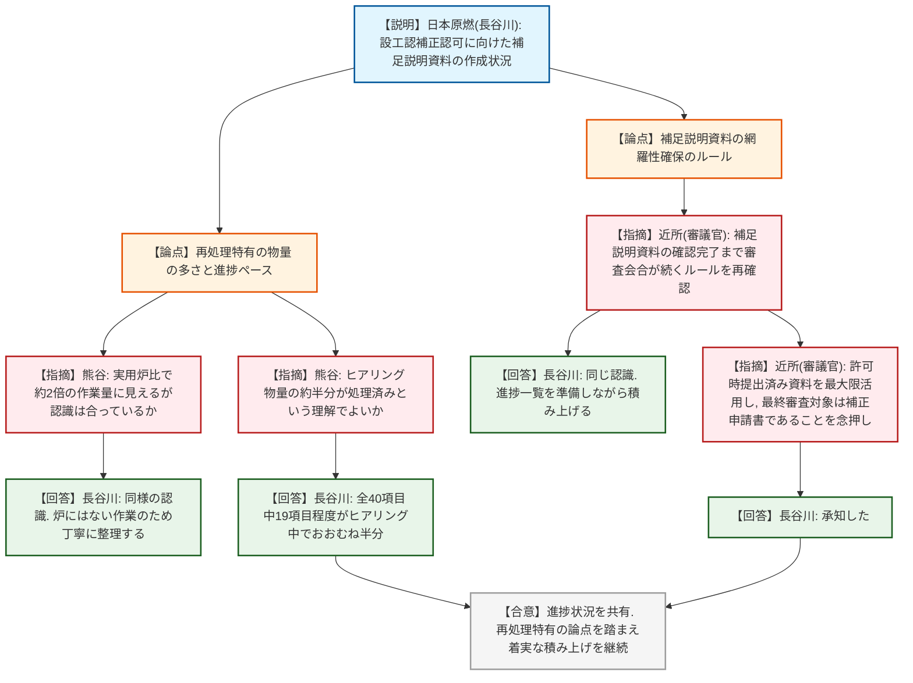
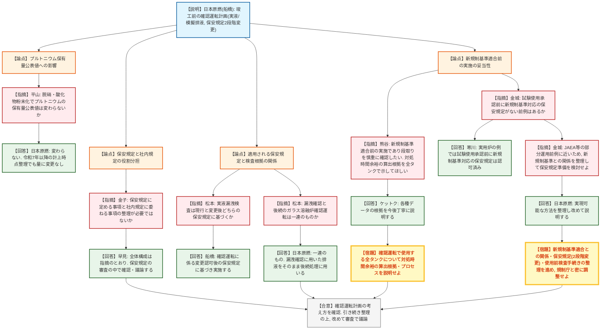
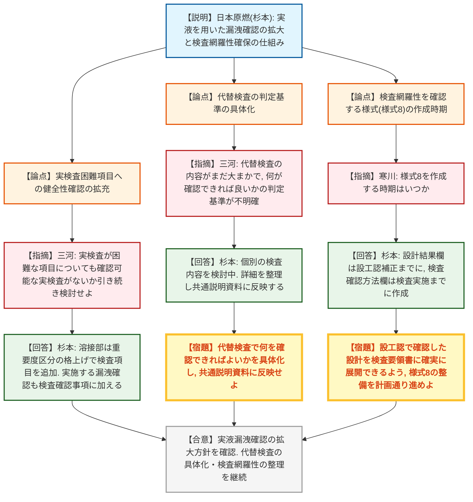

# 第592回核燃料施設等の新規制基準適合性に係る審査会合（令和8年9月7日）
> 出典 : https://youtube.com/live/K6u_4BzlvWY?si=yBvNiUYvTmWsgvKu

## 会合の概要
* **設工認補正に向けた作業は全体の約半分が進行中、規制庁は再処理特有の物量を踏まえた着実な積み上げを要求**
  日本原燃から、六ヶ所再処理施設・廃棄物管理施設の設工認補正認可に向けた補足説明資料の作成状況が報告された。約40項目の別紙のうち約19項目がヒアリング中で進捗率は約5割。規制庁は実用炉と比較した物量の多さ（作業量で約2倍、施設全体では5～6倍との認識）を踏まえつつ、過去の事業指定変更許可時の資料の最大限の活用と、補足説明資料の網羅的な確認を経て初めて補正申請書に反映されるという審査の原則を改めて念押しした。
* **竣工前の「確認運転」計画に、新規制基準適合前の実施であることへの慎重な確認が相次ぐ**
  使用工程停止の長期化を受け、竣工前に実排液・模擬排液を用いた確認運転（ガラス固化炉の処理能力確認、他系統の漏洩確認等）を実施する方針が示された。規制庁からは、適用される保安規定が確認運転前の変更認可後のものになる点、試験使用承認のタイミングと新規制基準対応の保安規定準備の関係、他施設（JAEA廃棄物処理施設等）の部分運用前例との整合など、新規制基準適合前に運転を行うことの位置づけについて複数の観点から慎重な確認要求が出された。
* **確認運転による安全側への影響は限定的と説明も、データの妥当性は個別に再検証へ**
  日本原燃は、確認運転は新たな使用済燃料のせん断を伴わないため臨界のリスクは生じず、系統内の放射能量も重大事故等対策の有効性評価で想定した値の数パーセント程度であり、電源車接続（8時間）等の対処時間余裕内で収まると説明した。規制庁（熊谷）は、この時間余裕の算出根拠・プロセスについて、代表例だけでなく確認運転で使用する全タンクについて改めて説明・確認したい旨要請した。
* **使用前事業者検査は実液を用いた漏洩確認の拡大を表明、代替検査の判定基準の具体化が課題に**
  ガラス溶融炉以外の容器・缶についても、可能な限り実液を用いた漏洩確認を使用前事業者検査として実施する方針へ見直された。一方、代替検査（書類確認等）の類型化は前回審査会合からあまり進展しておらず、規制庁（三河）から「何を確認できればよいか」の判定基準を明確化するよう改めて指摘があったほか、技術基準要求への検査の網羅性を担保する様式（様式8）の作成時期についても確認が行われた。
* **全体を通じ、規制庁は今後「物量との勝負」になるとして効率的なコミュニケーションを要請**
  会合の最後に規制庁（金城）から、審査が今後さらに物量的に厳しくなるとの見立てが示され、日本原燃・規制庁双方が効率的に準備・確認を進められるよう協力を求める発言があった。

---

## 議題ごとの詳細整理

### 【議題1】日本原燃株式会社再処理事業所再処理施設及び廃棄物管理施設の設計及び工事の計画の認可申請について

* **議論の背景と論点:**
  本議題は、(1) 設工認補正認可に向けた補足説明資料の準備状況、(2) 竣工前に実施する確認運転の計画（保安規定・使用前事業者検査との関係を含む）、(3) 使用前事業者検査の実施方針の見直し（実液を用いた漏洩確認の拡大、代替検査の具体化）という3つのサブテーマで構成された。

* **質疑応答（詳細）:**

  **＜設工認の補正認可に向けた取組状況＞**
    * 【説明者側】長谷川（日本原燃）
      補正認可に向けた補足説明資料の作成状況を説明。優先条文から着手し、そこで得られた指摘をICT等を活用して他の条文にも効率的に展開したい。
    * 【規制側】熊谷（規制庁）
      MOX加工施設は先行実績や規則上の別表が整備されていないため独自の補足資料を作成しており、実用炉の設工認と比べて約2倍の作業量になっていると見受けられる。耐震・設計基準・重大事故対策のいずれも再処理特有の論点（火災・臨界等）が多く、時間を要していると理解しているが、その認識で合っているか。
    * 【説明者側】長谷川（日本原燃）
      同様の認識である。指摘のあった資料は炉にはあまりない作業であり、許可内容との整合も含めてしっかり整理していきたい。再処理特有の論点については丁寧に対応している。
    * 【規制側】熊谷（規制庁）
      資料全体を見ると、ヒアリング対象となる物量のおよそ半分程度が現時点で処理済みという理解でよいか。
    * 【説明者側】長谷川（日本原燃）
      補足説明資料（別紙）は全体でおよそ40項目あり、うち19項目程度が現在ヒアリング中で、おおむね半分という認識は規制庁と同じである。再処理特有の論点を踏まえ、時間をかけて着実に積み上げていきたい。
    * 【規制側】近所（規制庁・審議官）
      これまでの審査会合では、条文ごとの説明を受けた上で、必ず補足説明資料として網羅的な説明を改めて求めてきた。補足説明資料の確認が完了するまでは審査会合での説明が続くというルールであることを、3月の会合でも念押ししている。今回、進捗状況を一覧化した資料が示されたことで、補足説明資料管理の必要性の認識が共有できたと考えるが、この点に関して補足する説明はあるか。
    * 【説明者側】長谷川（日本原燃）
      補足説明資料をしっかり確認いただくまでという認識は同じであり、これまで議論いただいた設計ルールに基づき、進捗を示す一覧を準備しながら必要な補足説明資料を積み上げていく。①②のうち②は物量の多い資料もあり、そこに手間取っている面はあるが、順次他の条文にも展開していきたい。
    * 【規制側】近所（規制庁・審議官）
      物量感については実用炉の設工認と比べて5～6倍と言われる規模になる認識であるが、規制庁としても許可時に確認済みの内容を重ねて求めるつもりはなく、事業指定変更許可時に提出済みの補足説明資料を最大限活用してほしい。最終的な審査対象は、審査会合と補足説明資料で確認された内容が反映された補正申請書であることを改めて確認しておきたい。
    * 【説明者側】長谷川（日本原燃）
      承知した。

  **＜確認運転＞**
    * 【説明者側】船橋（日本原燃）
      使用工程停止が長期化していることを踏まえ、竣工前に施設の健全性を確認する「確認運転」を実施したい。確認運転までに使用前事業者検査・保安規定変更認可等の対応を完了させ試験使用承認を得る。確認運転ではガラス溶融炉には模擬排液、その他系統には実排液を用い、あわせて使用前事業者検査としての漏洩確認も行う。保安規定は「確認運転に係る変更」と「新規制基準対応に係る変更」の2段階で変更認可申請する。
    * 【規制側】平山（規制庁）
      確認運転で脱硝工程を経て酸化物粉末を作るところまで想定していると理解しているが、これによりプルトニウムの存在形態は変わっても、我が国のプルトニウム保有量の公表値自体に変化はないという認識でよいか。
    * 【説明者側】日本原燃
      その認識で相違ない。令和7年以降、分離プルトニウムとして公表する量の計上時点の整理を見直しているが、今回の確認運転によって公表量が変わることはない。
    * 【規制側】金子（検査グループ核燃料施設等監視部）
      本日は結論を求めるものではなく検査部門としての問題意識の共有だが、保安規定に定める事項と社内規定に委ねる事項は、検査の観点から役割を踏まえて整理する必要がある。資料18ページの高レベル濃縮廃液の保有量管理等の記載を見ると、確認運転に係る計画自体は保安規定本体で定め、それに基づく手順書整備・体制整備は社内規定に委ねる構成に見える。社内規定はあくまで事業者が自らの管理下で定めるものであり、審査で妥当性を確認した保安規定を基準に行う遵守事項の確認とは性格が異なる。必要な事項まで社内規定に委ねられていないか、検査部門として重点的に確認したい。
    * 【説明者側】早見（日本原燃）
      保安規定に定める部分と、具体的な運用として社内規定等に定める部分に分かれるという全体構成の理解は指摘のとおりであり、適切な管理のために保安規定にどこまで定めるべきかは、今後の保安規定変更の審査の中で確認・議論させていただきたい。
    * 【規制側】松本（規制庁）
      使用前事業者検査（実液を用いた漏洩確認）は、現行の保安規定に基づき実施するのか、それとも確認運転に係る変更認可後の保安規定に基づき実施するのか。検査の基準が変わるため確認したい。
    * 【説明者側】船橋（日本原燃）
      確認運転に係る保安規定の変更認可を受けた後の保安規定に基づいて実施する。
    * 【規制側】松本（規制庁）
      あわせて、資料21ページに示された漏洩確認と、その後のガラス溶融炉の確認運転（処理能力確認）は一連のものであり、漏洩確認に使用した排液をそのまま後続の処理に用いるという理解でよいか。
    * 【説明者側】日本原燃
      その理解のとおりであり、前段の漏洩確認に用いた排液をそのまま後続の排液処理等に用いる予定である。
    * 【規制側】熊谷（規制庁）
      確認運転は新規制基準適合前の段階で実施する計画であり、ソフト・ハード・手続きの各面で慎重な確認が必要と考えている。17ページに示された段取りで良いか、前例も踏まえて確認していきたい。また、19ページに示された対処時間余裕の算出データ・プロセスについて、面談等で改めて説明してほしい。代表例だけでなく、確認運転で使用する全てのタンクについて同様の評価を示してもらい、数値の妥当性を確認したい。
    * 【説明者側】ケットク（日本原燃）
      指摘のあった各種データの根拠や規制庁の疑問点への回答について、今後丁寧に議論し情報を提示していきたい。
    * 【規制側】金城（規制庁）
      通常、試験使用承認を出す段階までには新規制基準対応の保安規定が準備されているはずだが、実用炉でこれまで新規制基準対応の保安規定がない状態で試験使用承認を出した実績はあるか。
    * 【説明者側】寒川（専門検査本部）
      実用炉はフルスペック運転を前提とするため今回とは状況が異なるが、実用炉の例では試験使用承認の前に新規制基準対応の保安規定は認可されている。
    * 【規制側】金城（規制庁）
      その点が論点になる。一方でJAEAの廃棄物処理施設等では、新規制基準対応の保安規定を部分的に準備し、その部分（例えば廃棄物処理系統）のみ先行して稼働させた事例もある。今回は実用炉よりもそうした事例に近いと考えられるため、新規制基準との関係を整理した上で保安規定の準備を検討してほしい。
    * 【説明者側】日本原燃
      指摘を踏まえて整理し、回答を準備する。新規制基準のリスクを引き上げる前にできる限りのことをしたいという考えで確認運転を計画しており、実現可能な方法を整理して改めて説明したい。
    * 【規制側】（座長）
      2段階に分けて手続きを進めることには安全面でのメリットと課題の双方があると考えられるため、新規制基準適合との関係、保安規定と確認運転に係る手順書等の整備を含め、規制庁・事務局側としっかりコミュニケーションを取りながら準備を進めてほしい。

  **＜使用前事業者検査の実施方針＞**
    * 【説明者側】杉本（日本原燃）
      第576回審査会合ではガラス溶融炉について模擬排液を用いた漏洩確認を説明し、第585回審査会合では代替検査の類型化と、ガラス溶融炉以外の容器・缶への漏洩確認の拡大検討を説明した。今回、ガラス溶融炉以外の容器・缶についても、試験使用承認を得た上で実液を用いて通常運転と同様の条件で漏洩の有無を確認する方針とした。あわせて技術基準の要求事項に対する検査の網羅性確保の仕組み（設計結果と適合性確認状況一覧表による機能・設置・評価・運用要求の分類）を説明する。
    * 【規制側】三河（専門検査部）
      別紙5の代替検査について、前回審査会合で類型化（括弧1・括弧2、A・Bの区分）を説明したが、代替検査の具体的な内容（何をもって確認できたとするか）はまだ大まかな記載にとどまっており、判定できる水準まで具体化されていない。今後どのようなエビデンスがあれば確認できたと言えるかを明確化してほしい。また、実検査が困難とされている項目についても、確認可能な実検査が本当にないか引き続き検討してほしいと前回申し上げたが、今回、実液・模擬排液を用いた漏洩確認が追加されることで、健全性確認に資する部分もあると考えられるため、あわせて検討してほしい。
    * 【説明者側】杉本（日本原燃）
      代替検査の類型化を踏まえ、個別の検査内容は現在検討中であり、どのような点を確認すればよいかの詳細を整理し共通説明資料に反映する。また、溶接部については重要度区分の格上げに伴い検査項目が追加されており、過去の記録に加え、今後実施する漏洩確認も検査確認事項に含めて整理していく。
    * 【規制側】寒川（専門検査本部）
      技術基準要求への検査の網羅性を確認する様式（様式8）を作成する時期はいつになるか。
    * 【説明者側】杉本（日本原燃）
      様式8は左欄・中欄・右欄で作成時期が分かれる。設工人の設計結果に関する欄は設工認補正までに、具体的な設計結果・検査確認方法に関する欄は検査実施までに作成する。
    * 【規制側】寒川（専門検査本部）
      検査を実施するまでには整備されると理解した。設工認で確認された設計を具体的な検査にどう展開するかという重要なプロセスであり、この整理結果に基づいて検査要領書が作成され検査が実施される流れになるため、しっかり対応してほしい。

* **結論と宿題事項（アクションアイテム）:**
  * **決定事項:** 設工認補正、確認運転、使用前事業者検査の実施方針のいずれについても、事業者から今後適切に対応していく旨の回答があり、審議結果案が原案どおり確定した。
  * **宿題事項:**
    1. 設工認補正について、補足説明資料を用いた網羅的な説明など必要な対応を引き続き行うこと。
    2. 確認運転について、新規制基準適合との関係、保安規定（2段階変更）、使用前事業者検査に係る手続きの整理を引き続き進めること（対処時間余裕の算出根拠は確認運転で使用する全タンクについて説明すること）。
    3. 使用前事業者検査について、代替検査適用の具体化（何が確認できれば良いかの明確化）と実検査の拡充等、検査における考慮事項の検討を進め、整理して説明すること。

---

## 論理構造の可視化（Mermaid）

### 【議題1-1】設工認の補正認可に向けた取組状況

### 【議題1-2】確認運転

### 【議題1-3】使用前事業者検査の実施方針

