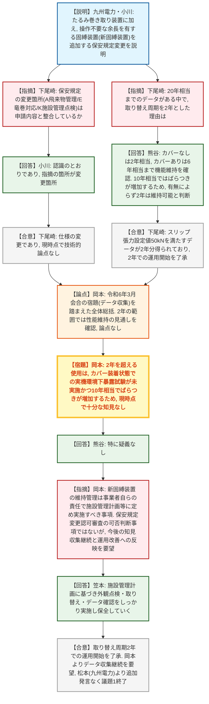

# 第1434回原子力発電所の新規制基準適合性に係る審査会合（令和8年9月8日）
> 出典 : https://youtube.com/live/yoWgHkefVOg?si=q4TH31Rhl36NZ8Gr

## 会合の概要

* **玄海3・4号機、竜巻対策の固縛方式に「余長を有する固縛装置」を追加する保安規定変更認可申請を審査。技術的論点なしで決着**
  九州電力は、従来の「たるみ巻き取り装置」（竜巻襲来時に固縛のたるみを巻き取る操作が必要）に加え、竜巻発生時の車両横滑りを緩衝装置の摩擦で許容範囲内に留め、操作が不要な「余長を有する固縛装置」（新固縛装置）を追加する保安規定変更認可申請（2026年6月29日申請、10月認可希望）を説明。規制庁は保安規定の変更箇所（飛来物管理・竜巻襲来予想時対応・施設管理点検の各条項）が申請内容と整合していることを確認し、現時点で技術的論点はないとした。

* **新固縛装置の取り替え周期「2年」の妥当性を、複合サイクル腐食試験（CCT試験）のデータに基づき確認**
  実際の使用環境・海塩粒子を模擬したCCT試験の結果、カバー装着なしの状態では経過年数2年相当まで、カバー装着ありの状態では6年相当まで、竜巻対策としての機能（スリップ張力の設定値50kN）を維持できることが確認された一方、10年相当ではデータのばらつきが増大した。九州電力はこれを踏まえ、カバー装着の有無によらず「少なくとも2年」は機能を維持できると判断し、取り替え周期を2年に設定。規制庁（下尾崎氏）はこの判断根拠を確認し、了承した。

* **試験では、経過年数の増加に伴う発錆がスリップ張力の変動要因と推定されたが、原因は未解明**
  外観観察の結果、固縛装置の発錆状態がスリップ張力に影響を与えていると推定され、発錆対策としてカバーを装着した状態での再試験も実施されたが、カバー装着ありでも10年・20年相当ではデータのばらつきが見られ、規制庁（岡本氏）は「2年を超える使用については、実機環境下での暴露試験が行われておらず、現時点で十分な知見は得られていない」と指摘した。

* **規制庁は、2年を超える使用に関する知見収集の継続を事業者の責任として明確化し、要望を付した**
  規制庁（岡本氏）は、新固縛装置の維持管理は本来、保安規定変更認可審査で是非を判断する事項ではなく、事業者が自らの責任において施設管理計画等に定め適切に実施すべきものと整理した上で、今後も知見収集を継続し、結果を施設管理計画へ反映していくよう九州電力に要望。九州電力（笠本氏）はこれを受け入れ、外観点検・取り替え・データ確認を継続する方針を示した。

---

## 議題ごとの詳細整理

### 【議題1】九州電力（株）玄海原子力発電所の3号炉及び4号炉の竜巻対策における固縛方式の一部変更に係る保安規定変更認可申請の審査について

* **議論の背景と論点:**
  玄海原子力発電所の保安規定（第1編添付2「火災、内部溢水、火山減少、自然災害、有毒ガス対応及び火山活動のモニタリング等に係る実施基準」）には、竜巻防護対策としての固縛装置のうち、「たるみ巻き取り装置」（既固縛装置、竜巻襲来の恐れがある場合に固縛のたるみを人が巻き取って拘束する方式）の運用が定められている。
  これとは別に、2020年9月10日申請の緊急時対策所設置変更許可審査において、竜巻発生時に車両の横滑りを緩衝装置の摩擦で許容範囲内に抑える「余長を有する固縛装置」（新固縛装置）が新たな固縛方式として設置変更許可を受けていたが、保守点検の動作確認周期は保安規定申請までに具体的に決定することとされていた。続く2024年9月19日申請の緊急時対策所保安規定審査では、新固縛装置は一旦動作すると必要な機能を維持できなくなる特性を踏まえ、動作確認周期ではなく「取り替え周期」を設定する方針とし、その信頼性を高めるためのデータ収集が必要と判断。データ収集完了までの間、緊急時対策所の発電機車には自主的判断で新固縛装置ではなく既固縛装置（たるみ巻き取り装置）を採用していた。
  今回、新固縛装置の取り替え周期の信頼性を高めるための追加データ収集が完了したため、竜巻防護対策として新固縛装置を採用するための保安規定変更認可申請（2026年6月29日申請）に至った。論点は、(1) 保安規定の変更箇所が申請内容（固縛方式の追加）と整合しているか、(2) 新固縛装置の取り替え周期を2年とする根拠が妥当か、の2点。

* **質疑応答（詳細）:**
    * 【説明者側】九州電力・小川氏
      資料1-1に基づき、新固縛装置の追加に伴う保安規定（第1編添付2、6.竜巻、6.4手順書の整備）の変更内容を説明。既固縛装置（たるみ巻き取り装置）は通常時は拘束せず固縛し、竜巻襲来の恐れがある場合にたるみを巻き取って拘束する。新固縛装置（余長を有する固縛装置）は設計時点で車両の横滑りを考慮した余長を確保しているため、通常時・竜巻襲来時のいずれも操作は不要で、一旦動作（作動）すると機能を維持できなくなるため、機能喪失後は復帰のための補修・取り替えを行う。保安規定上は、6.4手順書整備のうちA「飛来物管理」とE「竜巻の襲来が予想される場合の対応」については、たるみ巻き取り装置を対象とする規定である旨の明確化を、K「施設管理点検」については、たるみ巻き取り装置に加え新固縛装置を追記する変更を行う。
    * 【規制側】原子力規制庁・下尾崎氏
      令和3年4月23日認可の緊急時対策所設置に係る設計及び工事の計画を踏まえ、衛星車両の固縛装置として、竜巻襲来時に巻き取る手順が必要なたるみ巻き取り装置に加え、そうした手順が不要な余長を有する固縛装置を追加する「仕様の変更」であるとの認識を示し、保安規定変更箇所が上記A・E・K条項である理解でよいか確認。
    * 【説明者側】九州電力・小川氏
      認識のとおりであり、指摘の箇所が変更箇所である旨回答。
    * 【規制側】原子力規制庁・下尾崎氏
      回答を了承。本申請は仕様変更を踏まえたものであり、現時点で技術的な論点はないとした。
    * 【規制側】原子力規制庁・下尾崎氏
      続けて、資料1-1の10ページ（新固縛装置の今後の保全方針）について、取り替え周期を2年と保全計画に定めた理由を確認。8ページのCCT試験データにはカバー有無双方で20年相当までのデータが示されているが、最終的に2年とした根拠の説明を求めた。
    * 【説明者側】九州電力・熊谷氏
      8ページのグラフ（カバーなし: 黒・青、カバーあり: 赤）を示し、カバーなし状態では経過年数2年相当まで機能維持を確認、カバーあり状態では6年相当まで機能維持を確認できたが、10年相当ではデータのばらつきが大きく、許容値（スリップ張力設定値50kN）を下回る結果も見られたと説明。この結果を踏まえ、カバー装着の有無にかかわらず「少なくとも2年」は機能を維持できると判断し、取り替え周期を2年に設定したと回答。
    * 【規制側】原子力規制庁・下尾崎氏
      カバー有無いずれの条件でも、設置変更許可で確認したスリップ張力設定値50kNを満足するデータが少なくとも2年分得られていることから、まずは取り替え周期2年で運用を開始するという理解でよい旨を確認し了承。
    * 【規制側】原子力規制庁・岡本氏
      令和6年3月開催の緊急時対策所保安規定変更認可申請審査会合において、九州電力が取り替え周期の信頼性を高めるためのさらなるデータ収集を行うとしていたことを踏まえ、今回の申請でその結果が示されたと総括。カバーの有無にかかわらず、取り替え周期とする2年の範囲に限れば性能を十分維持できる見通しが確認されており、特段の技術的論点はないと認識していると述べた。一方、2年を超える使用については、カバー装着状態での実機環境下での暴露試験が行われていないこと、またカバー装着状態でも経過年数10年程度になると性能のばらつきが見られることを踏まえ、現時点ではまだ十分な知見が得られていないとの認識を示し、疑義の有無を確認した。
    * 【説明者側】九州電力・熊谷氏
      特に疑義はない旨回答。
    * 【規制側】原子力規制庁・岡本氏
      新固縛装置の維持管理は、事業者自らの責任において、保安規定の下部規定にあたる施設管理計画等に具体的内容を定め、適切に実施すべきものであり、本来、保安規定変更認可の審査においてその是非を判断する事項ではないと整理。今回は、これまでの審査経緯を踏まえて参考的に確認したものであるとした上で、今後も事業者自らの責任において知見収集を継続し、その結果を適宜施設管理計画等へ反映して運用の改善を図り、新固縛装置の性能を適切に維持していく必要があるとの認識を示し、相違がないか確認した。
    * 【説明者側】九州電力・笠本氏
      指摘のとおりであり、事業者として施設管理計画に基づき、外観点検・取り替え・データの確認をしっかり実施し、保全を行っていく旨回答。
    * 【規制側】原子力規制庁・岡本氏
      新固縛装置に関するデータ収集は今後も続ける価値があるとして、引き続きの取り組みを要望。
    * 【説明者側】九州電力・松本氏
      全体について特に追加の発言はない旨回答。

* **結論と宿題事項（アクションアイテム）:**
    * **決定事項:** 保安規定の変更内容（たるみ巻き取り装置・新固縛装置それぞれの対象条項の明確化、施設管理点検への新固縛装置の追記）は申請どおり妥当と判断され、現時点で技術的な論点はないとされた。新固縛装置の取り替え周期を2年とする設定は、CCT試験データ（カバー有無いずれの条件でも2年相当まではスリップ張力設定値50kNを満足）に基づく合理的な判断として規制庁に了承され、審査上の異論なく了承された。
    * **条件・留保事項:** 今回了承されたのはあくまで「取り替え周期2年」の範囲内での運用開始であり、2年を超える使用の妥当性についてはカバー装着状態での実機環境下での暴露試験が未実施であること、経過年数10年相当以降で試験データのばらつきが増加すること（発錆との相関が疑われるが原因は未解明）から、現時点では十分な知見が得られていないと規制庁は評価している。
    * **宿題事項（事業者の自主的取り組み）:** 新固縛装置の維持管理・性能維持は事業者自らの責任で施設管理計画等に定め実施する事項であるとされ、九州電力は今後も外観確認（半年に1回）・供試体を用いた動作確認とスリップ張力測定（1年間隔、サンプル6本、判定基準はスリップ張力設定値50kN以上）などによる知見収集を継続し、結果を取り替え周期の見直し等の形で施設管理計画へ反映していくこととされた。規制庁（岡本氏）は、このデータ収集を今後も継続する価値があるとして、事業者に継続的な取り組みを要望した。

---

## 論理構造の可視化（Mermaid）

### 1. 玄海3・4号機 竜巻対策（固縛方式の一部変更）保安規定変更認可申請

