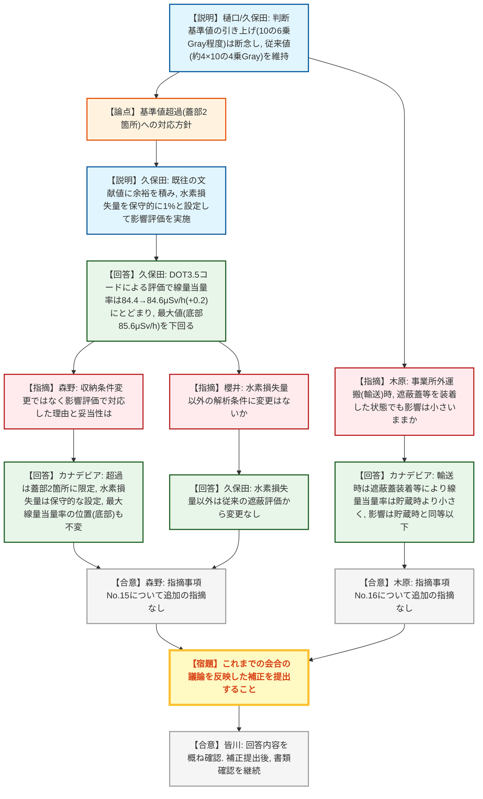

# 第44回特定兼用キャスクの設計の型式証明等に係る審査会合（令和8年9月8日）
> 出典 : https://youtube.com/live/eYfKIWELY7U?si=eFNkKY9On26GUIiL

## 会合の概要
* **ガンマ線照射量の判断基準値、当初検討していた引き上げ(10の6乗Gray程度)を断念し、従来値を維持**
  カナデビアは、特定兼用キャスクHitz-P24型の中性子遮蔽材(NS-4-FR)へのガンマ線照射に対する判断基準値について、10の6乗Gray程度への変更を検討していたが、機械的特性の変化と遮蔽性能維持との相関を定量的に説明することが困難と判断し、従来通り約4×10の4乗Grayを維持する方針に転換した。
* **基準値を超過する蓋部2箇所についても、保守的な水素損失評価による影響評価で決着**
  収納物の詰め替えを想定した場合に判断基準値を超える蓋部レジン(2箇所)について、既往の文献値に余裕を積んだ保守的な水素損失量(1%)を用いて線量当量率への影響を評価した結果、増加量はわずか0.2μSv/h(84.4→84.6μSv/h)にとどまり、キャスク全体の最大線量当量率(底部、85.6μSv/h)や規制基準値(100μSv/h)を下回ることを確認。規制庁(櫻井・森野)は解析条件の妥当性・保守性を確認し、指摘事項No.15について追加の指摘なしとした。
* **事業所外運搬(輸送)時の影響も貯蔵時と同等以下であることを確認**
  木原氏(規制庁)からの事業所外運搬の観点の確認に対し、カナデビアは輸送時は遮蔽蓋等の装着により線量当量率は貯蔵時よりも小さくなるため、影響は貯蔵時と同等以下になると回答。規制庁はこれを了承し、指摘事項No.16についても追加の指摘なしとした。
* **規制庁は回答内容を概ね了承、今後は補正提出フェーズへ移行**
  皆川氏(規制庁)は、本日までの指摘事項への回答内容を概ね確認できたとし、これまでの会合での議論を適切に反映した補正の提出に向けて準備を進めるよう要請。補正提出後は書類確認を進め、必要であれば改めて審査会合で確認するとした。

---

## 議題ごとの詳細整理

### 【議題1】カナデビア（株）特定兼用キャスクの設計の型式指定について（Hitz-P24型）
* **議論の背景と論点:**
  前回(令和8年3月19日)審査会合の指摘事項No.15・No.16への回答が論点。No.15は、中性子遮蔽材(NS-4-FR)に対するガンマ線照射の「影響がないと判断する基準値」を、従来の約4×10の4乗Grayから、文献データに基づく10の6乗Gray程度へ変更しようとしたことについて、機械的特性の変化だけでなく遮蔽性能への影響までの説明が不十分との指摘。No.16は、長期貯蔵後に輸送容器として使用する場合、事業所外運搬(輸送)の観点からも判断基準値の妥当性を説明するようにとの指摘。

* **質疑応答（詳細）:**
    * 【説明者側】樋口・久保田（カナデビア）
      判断基準値の引き上げ(10の6乗Gray程度)は、機械的特性の変化が生じないことと遮蔽性能が維持されることとの相関を定量的に説明することが困難と判断し断念。従来通り約4×10の4乗Grayを判断基準値として維持する方針に転換したと説明。この基準値を適用すると、収納物の詰め替えを可能とする条件下では、全ての中性子遮蔽材のうち蓋部の2箇所のみが基準値を超えるため、収納条件は変更せず、当該箇所の水素損失量と線量当量率への影響を評価する方針とした。
    * 【説明者側】久保田（カナデビア）
      蓋部の中性子遮蔽材NS-4-FR(NS-4、水酸化アルミニウム、炭化ホウ素の混合体)について、既往の照射試験結果に基づき、水素を含むNS-4・水酸化アルミニウムそれぞれの水素損失量を保守的に1%(NS-4-FR全体としても1%)に設定。DOT3.5コードを用いた貯蔵時代表・B型燃料条件での線量当量率評価の結果、蓋部軸方向表面から1mの位置での線量当量率は、従来の遮蔽解析結果84.4μSv/hに対し、水素損失を考慮しても84.6μSv/h(増加量0.2μSv/h)にとどまり、キャスク全体の最大線量当量率である底部軸方向の85.6μSv/hを下回り、規制基準値100μSv/hに対しても十分な裕度があると説明。
    * 【規制側】櫻井（規制庁）
      判断基準値を変更しないとする結論は理解したとした上で、それに伴う影響評価において、解析モデルや水素損失量以外の解析条件に変更がないか確認。
    * 【説明者側】久保田（カナデビア）
      水素損失量以外の条件については、従来の遮蔽評価から変更していないと回答。櫻井氏はこれを理解した旨述べた。
    * 【規制側】森野（規制庁）
      当初の指摘(基準値の妥当性説明が困難な場合は収納条件の変更等で対応)に対し、今回は収納条件を変更せず影響評価での対応となった理由と妥当性を確認。基準値を超える部位が蓋部の2箇所に限定されること、水素損失量1%が客観性のある文献値にさらに余裕を積んだ保守的な設定であること、解析結果でも最大線量当量率を示す位置(底部)が変わらず規制基準値(100μSv/h)を下回ることを確認できたとして、指摘事項No.15について追加の指摘はないと表明。
    * 【規制側】木原（規制庁）
      事業所外運搬(輸送)の観点から、輸送時は遮蔽蓋や緩衝体を装着するなど貯蔵時とは異なる状態になるが、一般・特別の輸送試験条件においても同様に影響が小さいと考えてよいか確認。
    * 【説明者側】（カナデビア）
      輸送時は遮蔽蓋の装着等により線量当量率は貯蔵時よりも小さくなるため、その影響は貯蔵時と同等以下になると回答。
    * 【規制側】木原（規制庁）
      構造的な特徴も踏まえ、輸送時についても同様に影響が小さいことを理解したとし、指摘事項No.16について追加の指摘はないとした。
    * 【規制側】皆川（規制庁）
      本日の回答内容について、これまでの指摘事項への回答を概ね確認できたとし、今回だけでなくこれまでの会合での議論を適切に反映した補正の提出に向けて準備を進めるよう要請。補正提出後は書類確認を進め、その過程で改めて議論が必要となれば審査会合で確認するとした。
    * 【説明者側】樋口（カナデビア）
      承知した旨回答。

* **結論と宿題事項（アクションアイテム）:**
    * **決定事項:** ガンマ線照射量の判断基準値は従来通り約4×10の4乗Grayを維持することで決着。基準値を超過する蓋部レジンについては、保守的な水素損失評価に基づく線量当量率評価により、規制基準値(100μSv/h)および既存の最大線量当量率(85.6μSv/h)をいずれも下回ることが確認され、収納条件・設計の変更は不要と判断された。事業所外運搬(輸送)時の影響についても貯蔵時と同等以下であることが確認された。指摘事項No.15・No.16はいずれも追加の指摘なしで決着。
    * **宿題事項:** カナデビアは、本日までを含むこれまでの会合での議論を適切に反映した補正を提出すること。規制庁は補正提出後、書類確認を進め、必要に応じて改めて審査会合で確認する。

---

## 論理構造の可視化（Mermaid）

### 1. Hitz-P24型 ガンマ線照射量の判断基準値と影響評価

