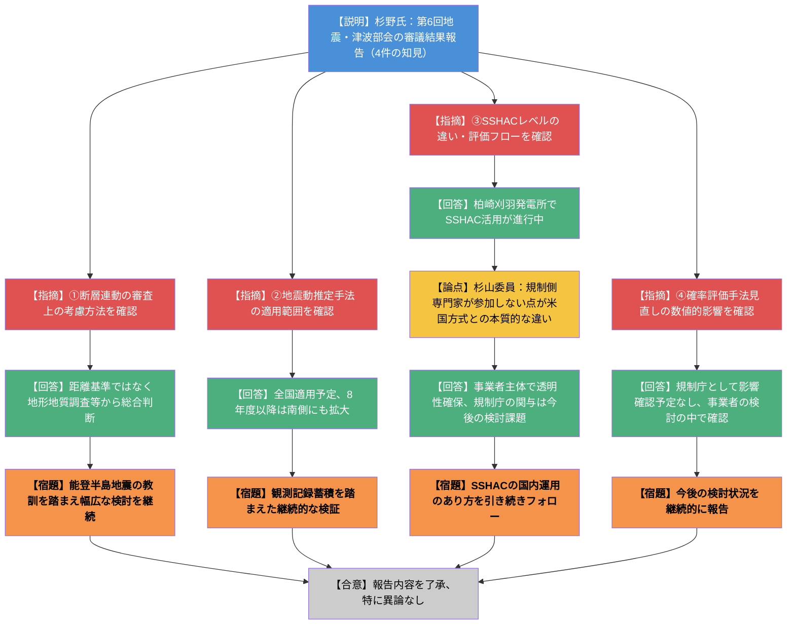
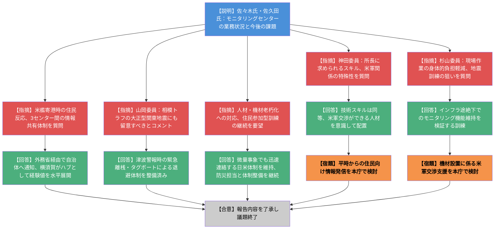
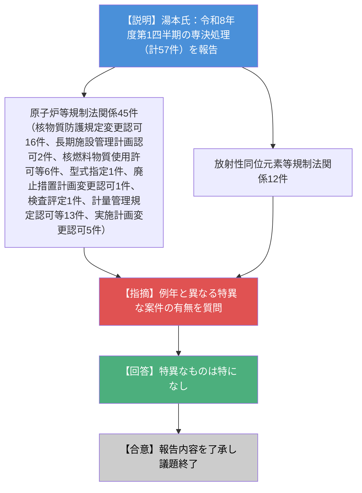

# 第31回原子力規制委員会（令和8年9月9日）
> 出典 : https://youtube.com/live/LjRidgmCeGw?si=kAQ8AgYR2IpeACgl

## 会合の概要

- 議題は報告事項3件のみで、いずれも大きな異論・対立点は生じず、委員会として粛々と報告を了承する回であった。
- **地震・津波部会報告**では、日本海中南部の海域活断層評価や南海トラフ長期評価改定など4件の知見が紹介され、特に日本原子力学会標準が採用したSSHAC（Senior Seismic Hazard Analysis Committee）手法について、杉山委員から「方法論のみを輸入し、米国のように規制側専門家が参加する仕組み全体までは取り入れていない」という本質的な懸念が示された点が最大の論点。
- **原子力艦モニタリングセンター報告**では、平均年齢66歳という職員の高齢化、実務経験者不足による所長後継者育成の遅れ、老朽化した測定機材の更新、米軍との継続的な信頼関係構築という、体制の持続可能性に関わる複数の構造的課題が明らかになった。
- 委員からは、モニタリング業務における海水・泥の採取など肉体的負担の大きい現場作業について、技術的な負担軽減や本庁による米軍との交渉支援を求める声が上がった。
- 令和8年度第1四半期の専決処理は原子炉等規制法関係45件・RI法関係12件の計57件で、例年と比べ特異な案件はなかったことが確認された。

## 議題ごとの詳細整理

### 【議題1】原子炉安全専門審査会・核燃料安全専門審査会第６回地震・津波部会の審議結果報告

**議論の背景と論点**

令和7年6月20日開催の第5回地震・津波部会以降、約1年間で収集された地震・津波関連の知見のうち、技術情報検討会で報告された4件について、その概要と原子力規制委員会としての対応状況を部会に報告し、部会委員からのコメントを踏まえて原子力規制委員会に報告するもの。論点は、新たに公表された学術的知見・学会標準を規制の審査実務にどう取り込むか（特に断層連動の判断基準、地震動評価手法の妥当性確認、SSHACという米国発の手法の国内適用可能性）。

**質疑応答（詳細）**

- **【説明者側】杉野英治（安全技術管理官・地震津波担当）**: ①日本海中南部の海域活断層の長期評価第一版（地震調査研究推進本部公表、近畿・北陸・北方域）について、近接断層の連動可否は審査ガイドに基づき、距離による確率的判断ではなく変動地形学的調査・地形地質調査等の結果から総合的に判断していると説明。
- **【部会委員】**: 令和6年能登半島地震を踏まえ、隣接断層の傾斜方向の違いや最近の地震活動のみをもって連動可能性を否定する考え方にはならない、という指摘があった。
- **【説明者側】杉野氏**: 断層の構造・連続性・実際の地震発生状況等の詳細情報を確認しながら連動可能性を個別に判断しており、できるだけ幅広に検討していく方針を回答。
- **【説明者側】杉野氏**: ②標準応答スペクトル策定に用いる解放基盤相当面の地震動推定手法（規制庁安全研究の公表論文、スペクトルインバージョン解析）について、適用対象を長野県北部から茨城県にかけての地域とした理由と、今後の適用範囲の見通しを説明。日本全国への適用を予定しており、令和7年度は日本の北側、8年度以降は北側に加え南側についても解析し、手法の適用性・妥当性を確認していくと回答。
- **【部会委員（久田部会長）】**: 地震動の観測記録は継続的に蓄積されており、本手法の検証は継続的な課題であるとして、引き続きの検討を要望。
- **【説明者側】杉野氏**: ③日本原子力学会標準「原子力発電所に対する地震を起因とした確率論的リスク評価に関する実施基準,2024」について、米国原子力規制委員会が採用するSSHAC（Senior Seismic Hazard Analysis Committee）ガイドラインを全面的に採用する改定がなされたことを紹介。東京電力が柏崎刈羽発電所を対象にSSHACの活用を進めている状況も情報提供した。
- **【部会委員】**: SSHACのレベル区分の違いと、改定版実施基準の評価フローについて確認を求めるコメントがあった。
- **【説明者側】杉野氏**: ④南海トラフの地震活動の長期評価第2版一部改定（地震調査研究推進本部）について、地震発生確率の評価手法が見直されたことを説明。
- **【部会委員】**: この見直し手法を確率論的評価に取り入れた場合の数値的な影響を確認してほしいとの質問があった。
- **【説明者側】杉野氏**: 規制庁として影響確認を行う予定はなく、今後事業者が安全性向上評価等の中で当該知見を反映した検討を実施する中で確認していくと回答。委員からは、データ・記録が十分残されていないため追跡調査は容易ではないものの、今後の検討状況について継続的に報告してほしいとの要望があった。
- **【委員】山岡耕春委員**: 部会委員のコメントについて特に異論はなく、①の海域活断層評価については実際の審査や意見聴取会合等ですでに取り入れられていると認識していると発言。能登半島の北西部断層の連動性についても慎重に検討した経緯があることを申し添えた。④の長期評価については超過確率の参照への影響検討が今後の課題であり、時間の経過とともにリスクが高まる以上、事業者・規制庁双方が緊張感を持つことが重要と総括した。
- **【委員】杉山智之委員**: ③のSSHACについて、柏崎刈羽発電所への東京電力の適用結果は安全性向上評価報告書を通じて規制庁が確認できるのかを質問。
- **【説明者側】杉野氏**: そのような認識ではいるが、報告に上げるかどうかの最終判断は東京電力が行うため確約はできないと回答。あわせて、東京電力が進めている津波対策の検討（尺度検討）についても、地質・津波分野の担当者がオブザーバーとして参加し状況を注視していると補足した。
- **【委員】杉山委員**: SSHACは米国では規制側の専門家もプロセスに参加する仕組みであるのに対し、日本では方法論のみを取り入れ、規制側がプロセスに参加する仕組みまでは導入されていない点が本質的な違いであると指摘。中部電力の不正事案も踏まえ、SSHACが日本の制度の中で成立するかを、その「使い方」の観点から検討すべきとコメントした。
- **【説明者側】杉野氏**: 現状、事業者側が関連専門家を集めて意見を聞き、透明性・公平性を確保しながら結果を公開するところまでは実施していると認識している。規制庁がその結果を受け取った際にどう扱うかは今後の判断課題であり、委員会の意見も踏まえて方向性を決めていきたいと回答。
- **【委員長】**: 技術情報検討会で改めて取り上げるべきコメントがあったかを確認。
- **【説明者側】杉野氏**: 改めて取り上げる必要のあるものは特にないが、標準応答スペクトルについては観測記録が追加され次第、妥当性の確認を継続し、結果が出れば改めて報告すると回答。標準応答スペクトルの見直し周期を問う質問に対しては、年数を定めたルールはなく、5年間の蓄積データで一度結果を確認し、NRA技術ノートの形で変化の有無を報告する運用としており、今後も概ね5年程度の周期で同様の報告を行う見通しであると説明した。

**結論と宿題事項（アクションアイテム）**

- 4件の知見について、規制委員会としての対応状況に特に異論はなく、報告を了承。
- 断層連動の判断については、能登半島地震の教訓を踏まえ、引き続き幅広な検討を継続することを確認。
- 標準応答スペクトルの妥当性確認は、観測記録の蓄積を踏まえ概ね5年周期で継続実施し、結果が出次第改めて報告する。
- SSHAC（学会標準への採用）について、規制側がプロセスに関与しない現状の運用が日本の規制制度の中で妥当かどうかは未解決の論点として残った。柏崎刈羽発電所での適用状況を含め、引き続き動向をフォローし情報提供することが宿題となった。

### 【議題2】原子力艦モニタリングセンターの業務状況

**議論の背景と論点**

原子力艦の放射能調査は1964年（昭和39年）の米国原子力潜水艦寄港以来継続実施されており、2008年（平成20年）の横須賀港における米国原子力空母の母港化を契機に原子力艦モニタリングセンターが開設された（その後、佐世保市・うるま市にも順次開設）。今回は横須賀原子力艦モニタリングセンターの業務状況と今後の課題について報告を受けた。論点は、米軍という特殊な相手との連携を前提とした業務体制（人材・機材・訓練）の持続可能性。

**質疑応答（詳細）**

- **【説明者側】佐々木潤（環境放射線企画室長）**: モニタリングセンターの設置経緯と体制（危機管理対策資格を持つ所長・副所長、常駐の技術参与）を説明。
- **【説明者側】佐久田聡（横須賀原子力艦モニタリングセンター所長）**: 平常時の業務（①モニタリングポストによる365日24時間の空間放射線量率・海水中放射線係数率の連続測定、②設備の維持管理、③調査要員の教育訓練、④防災訓練、⑤米軍・自治体・関係省庁との連携）と、緊急時の業務（⑥緊急時モニタリングセンターの設置・運営）を説明。原子力艦特有の機材として、港湾内に検出器を沈める海水中放射線測定機と、専用測定機を搭載したモニタリングボートがあることを紹介。屋外・海上運用のため塩害や台風・高波の影響で老朽化しやすく、計画的な更新が必要であると述べた。日米合同の原子力艦防災訓練は平成19年から毎年実施（令和2年度のみ新型コロナウイルスの影響で中止）しており、令和5年度は三浦半島断層群を震源とするマグニチュード6.8の地震、令和6年度は空母からのごく微量の冷却水漏洩、令和7年度は空母帰還時のごく微量の放射性物質を含む水の漏洩を想定した訓練を実施したと説明。今後の課題として、緊急時の本庁・センター間手順整備、所長の後継者育成、米軍担当者の異動・退官に対応した人的交流の活性化、老朽化機材の計画的更新、職員の高齢化（横須賀センターの所長・技術参与・調査班長の平均年齢は66歳）への対応の5点を挙げた。
- **【委員】神田玲子委員**: 米軍・自治体・海上保安庁との連携体制が確認できたとした上で、住民もステークホルダーの一つであり、平時からの情報発信も緊急時対応準備の一要素になり得るとして、監視情報課とともに本庁として何ができるか検討してほしいと要望。あわせて、所長に求められるスキルが常駐の放射線防災専門官と異なる点、特に米軍司令部との関係維持・強化にどのような経験・スキルが必要かを質問。
- **【説明者側】佐々木氏**: モニタリング技術自体のスキルは通常の放射線防災専門官と大きな差はないが、米軍との交渉は外務省・防衛省が知見を持つ分野であり規制庁には経験の蓄積が少ないため、自衛隊出身者など米軍関係の交渉や基地内調査の説明ができる人材を意識してアサインしていること、いきなりセンターに配置せず本庁で経験を積ませてから配置する体制を検討していることを回答。
- **【委員】杉山智之委員**: 海水・泥の採取作業は好天・穏やかな海況とは限らず肉体的負担が大きいとして、年齢に関わらず負担を技術的に軽減できないか本庁側でも検討すべきと指摘。あわせて機材設置に係る米軍との受け入れ交渉についても本庁側の支援を要望。令和5年度の地震想定訓練について、船自体は地震に対して安定と考えられる中、訓練のポイントはモニタリング設備・体制が機能するかどうかにあるのかを質問。
- **【説明者側】佐久田氏**: その認識の通りで、停電・通信途絶・電源途絶などインフラが被災した状況下でもモニタリングが有効に機能するかを検証することが訓練の主眼であると回答。
- **【委員】**: 悪天候下や米軍という相手ゆえの不規則な対応など現場の労苦への謝意を述べた上で、「異常なし」というメッセージ自体が地元住民にとって重要な情報であるとコメント。米軍艦船の寄港時における地元住民の反応・懸念の現状と、横須賀・佐世保・うるまの3センター間の情報共有体制を質問。
- **【説明者側】佐々木氏**: 米原子力艦の寄港連絡は外務省から自治体に必ず通知され、モニタリングセンターは入港前から調査体制を組んで待機し、寄港中は毎日プレス発表を実施、自治体・本庁でも公表しており、自治体側の納得は得られていると回答。3センターについては、寄港数が最多（延べ約300日）で経験値も豊富な横須賀が情報共有のハブとなり、検出器の異常等の知見を佐世保・うるまへ水平展開していると説明した。
- **【委員】山岡耕春委員**: 相模トラフを震源とする大正型の関東地震（三浦半島先端の隆起や伊豆半島への津波などをもたらした地震）についても、いずれ発生し得るものとして時々思い返してほしいとコメント。
- **【説明者側】佐々木氏**: 原子力艦は津波警報発令時に少人数でも係留索を切断し緊急発信できる体制や、機関停止時に備えた大型タグボートによる港外脱出体制を整えていると承知していると回答。
- **【委員】**: 人材・機材老朽化への対応を引き続き要望した上で、米軍が相手であるがゆえの機密事項を含む訓練の難しさに理解を示しつつ、住民参加型の防災訓練を今後も工夫しながら継続してほしいと要望。
- **【説明者側】佐々木氏**: 日米合同防災訓練では、米側が災害に至る事故を起こさないことを前提としつつ、ごく微量の事象であっても迅速に連絡・連携して調査する体制を構築していること、モニタリングにより住民への影響を把握し自治体と連携して防災体制を整備していくことを説明。この点についてはまだ体制整備の途上であり、防災担当と引き続き進めていくと回答した。

**結論と宿題事項（アクションアイテム）**

- 報告内容自体に異論はなく、報告を了承して議題を終了。
- 平時からの住民向け情報発信のあり方について、監視情報課を中心に本庁として検討することが宿題となった。
- 現場作業（海水・泥の採取等）の身体的負担軽減策の検討が本庁側の宿題として挙げられた。
- 所長後継者の育成、老朽化機材の計画的更新（予算確保含む）、職員高齢化への対応、米軍担当者の異動に対応した人的交流の活性化は、いずれも構造的な課題として引き続き取り組むことが確認された。

### 【議題3】令和8年度第１四半期における専決処理（報告）

**議論の背景と論点**

令和8年度第1四半期に原子力規制委員会への報告を要する専決処理（原子炉等規制法関係45件、放射性同位元素等規制法関係12件、計57件）の内容を報告するもの。論点は特になく、定例の実績報告として例年との異同を確認する内容。

**質疑応答（詳細）**

- **【説明者側】湯本淳（総務課長）**: 原子炉等規制法関係45件の内訳として、核物質防護規定の変更認可16件（最多）、発電用原子炉施設の長期施設管理計画の認可2件、核燃料物質の使用許可・変更許可6件、型式指定1件（三菱重工関係）、原子炉施設等の廃止措置計画の変更認可1件（電力中央研究所我孫子地区の関係）、原子炉規制検査結果に基づく総合的な評定1件、国際規制物資に係る計量管理規定の認可・変更認可13件、東京電力福島第一原子力発電所に係る実施計画の変更認可5件（処理水関連配管の設置等）を説明。放射性同位元素等規制法関係は12件と報告した。
- **【委員】**: 例年と大きな変化はないように見えるが、特異な案件はなかったかを質問。
- **【説明者側】湯本氏**: 特に特異なものはないと回答。

**結論と宿題事項（アクションアイテム）**

- 報告を了承し、議題を終了。特段のアクションアイテムなし。

## 論理構造の可視化（Mermaid）

### 議題1：地震・津波部会審議結果報告

### 議題2：原子力艦モニタリングセンターの業務状況

### 議題3：令和8年度第１四半期における専決処理

