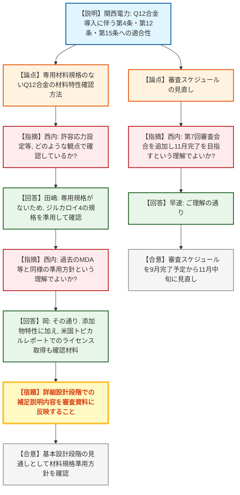
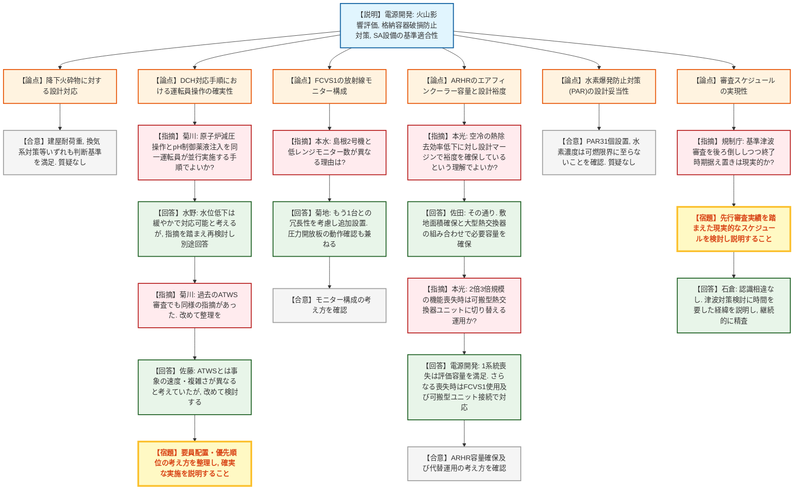
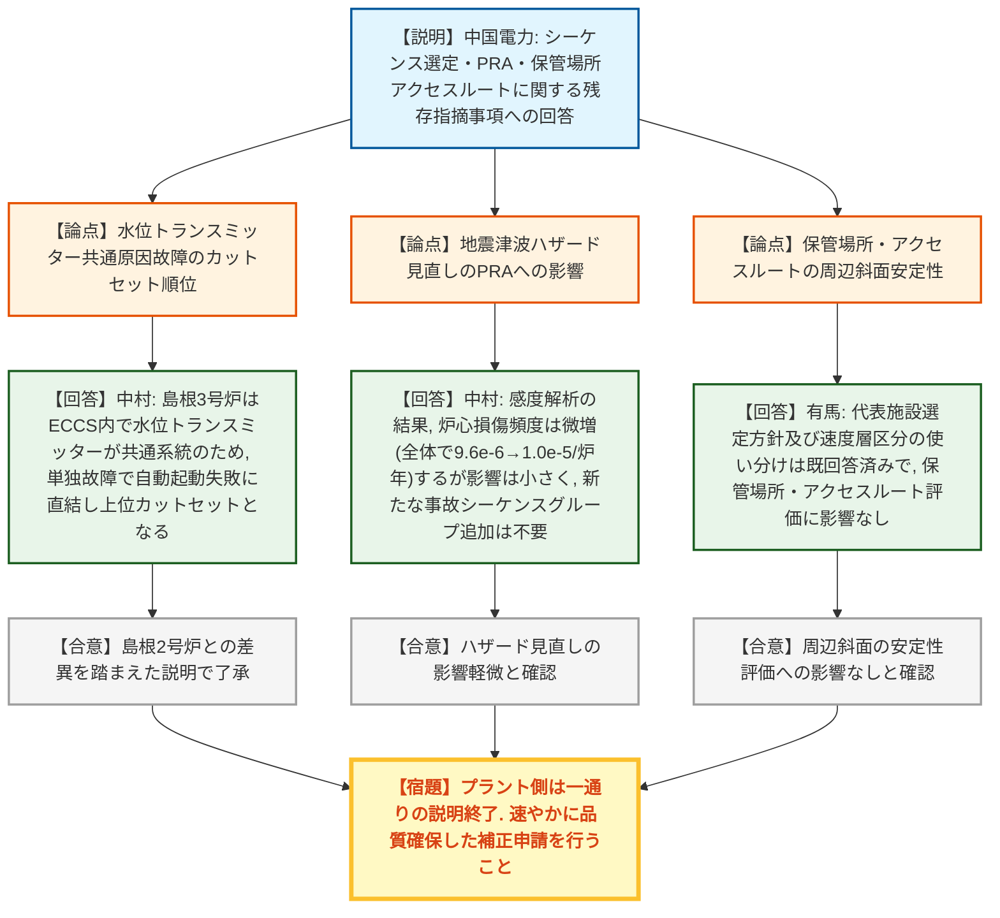
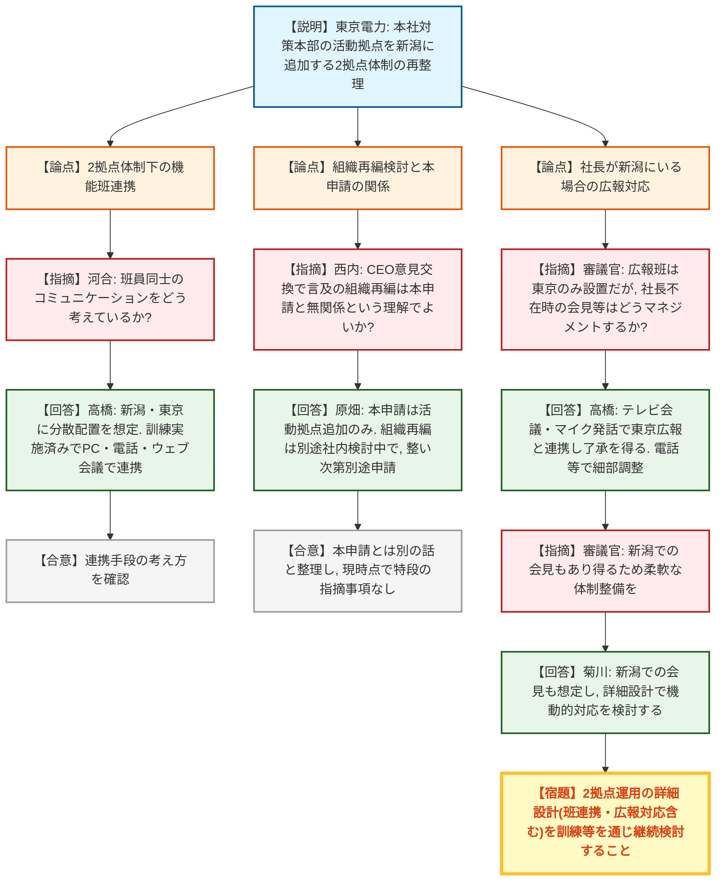

# 第1435回原子力発電所の新規制基準適合性に係る審査会合（令和8年9月10日）
> 出典 : https://youtube.com/live/cB6SpX-dI-w?si=eihDzPiGYNBZQ_Xi

## 会合の概要
* **高浜3・4号炉の高燃焼度燃料導入(Q12合金)は材料規格の「準用」方針を規制庁がおおむね了承**
  関西電力から、海外製高燃焼度燃料の構造材Q12合金について、専用の材料規格がないため既存のジルカロイ4規格を準用して健全性を確認する方針が説明された。規制庁は、過去にも同様に他号金(MDA等)で準用実績があることや、米国トピカルレポートでのライセンス取得実績も確認材料としていることを踏まえ、現時点の基本設計段階の見通しとして理解を示しつつ、詳細設計段階での補足説明を求めた。
* **大間原発の格納容器破損防止対策(DCH/FCI/MCCI)は有効性評価上は基準を満足するも、運転員操作の確実性に正式な指摘**
  電源開発は、原子炉圧力容器破損に伴う格納容器破損防止対策(DCH・FCI・MCCI)の有効性評価結果が判断基準を満足することを説明したが、規制庁は、水位監視を伴う重要な原子炉減圧操作と格納容器pH制御の薬液注入操作を同一の運転員が並行して行う手順について、過去のATWS審査での指摘と同様の懸念を示し、要員配置・作業優先順位の考え方の整理と実施確実性の説明を正式に指摘した。
* **大間原発の審査スケジュール、基準津波影響確認の後ろ倒しにもかかわらず全体終了時期を据え置く計画の実現性に規制庁が疑義**
  基準津波への影響確認に係る審査会合時期が約1か月半後ろ倒し(9月末→11月中旬)となる一方、一通りの説明終了時期(2027年2月末)は変更なしとする電源開発の説明に対し、規制庁は先行審査実績を踏まえた現実的なスケジュールか不明であるとして、改めての検討・説明を求めた。
* **島根3号炉はプラント側の残存指摘事項(シーケンス選定・PRA・保管場所アクセスルート)への回答が完了し、一通りの説明を終了**
  中国電力は、事故シーケンス選定における水位トランスミッター共通原因故障の扱いの違い(島根2号炉との比較)、地震津波ハザード見直しに伴うPRAへの影響(感度解析で影響小と確認)、可搬型重大事故等対処設備の保管場所・アクセスルートに関する指摘事項に回答し、規制庁はプラント側審査における新たな指摘事項はないと確認、事業者は速やかな補正申請へ移行する。
* **柏崎刈羽6・7号炉の新潟事態即応センター追加は審査上の指摘事項なしも、2拠点体制の実運用面で規制側から確認・示唆**
  東京電力は、本社対策本部の活動拠点を東京に加え柏崎刈羽近くの新潟にも設置する計画を再整理し説明。規制庁からは、機能班単位での班員間連携や、社長が新潟にいる場合の広報対応(広報班は東京のみに設置)等、2拠点運用の実効性に関する確認・示唆があったが、審査上の正式な指摘事項はないとされた。

---

## 議題ごとの詳細整理

### 【議題1】関西電力（株）高浜発電所3号炉及び4号炉の高燃焼度燃料導入に係る設置変更許可申請の審査について
* **議論の背景と論点:**
  第6回審査会合として、初回・第2回審査会合で指摘のあった海外製高燃焼度燃料の構造材「Q12合金」について、国内使用実績がないことを踏まえた設置許可基準規則の関連条文(第4条：地震による損傷の防止、第12条：安全施設、第15条：炉心等)への適合性確認内容が論点となった。Q12合金はジルカロイ4と同様の性能を持つとされるが、その材料特性の確認方法(規格の準用)の妥当性が焦点となった。

* **質疑応答（詳細）:**
    * 【説明者側】橋爪・田嶋・岡（関西電力）
      Q12合金の採用に伴い、支持格子・制御棒案内シンブルの材料変更が生じるが、機械強度はジルカロイ4と同等であり、燃料集合体の健全性・耐震性への影響は小さいと評価した。核分裂断面積との比較でも合金添加元素による炉心特性への影響は軽微とした。
    * 【規制側】西内（規制庁）
      材料特性の確認方法について、Q12合金には専用の材料規格がない中で、許容応力の設定等をどのように確認しているのか説明を求める。
    * 【説明者側】田嶋（関西電力）
      Q12合金には特定の材料規格がないため、ジルカロイ4と同等以上の性能であることを、ジルカロイ4の規格を準用して確認する予定である。
    * 【規制側】西内（規制庁）
      過去にも被覆管の改良合金(三菱製MDA等)で同様に規格を準用して確認してきた実績があり、今回のQ12合金も同じジルコニウム系合金として同様の準用方針という理解でよいか確認する。
    * 【説明者側】岡（関西電力）
      その理解の通りであり、加えて添加物の特性面からの見通しや、米国でのトピカルレポートによるQ12合金のライセンス取得実績も確認材料としており、十分な見通しがあると考えている。
    * 【規制側】西内（規制庁）
      回答内容を了承する。今後、詳細設計段階での申請書ベースの具体的な強度計算内容についても確認していくことになるが、現時点は基本設計段階の見通しとしての説明と理解した。今回の補足内容についても審査資料に反映しておくよう求める。

* **結論と宿題事項（アクションアイテム）:**
  * **決定事項:** Q12合金の材料規格準用方針、及びこれに基づく第4条・第12条・第15条への適合性の考え方は、基本設計段階の見通しとして規制庁の理解が得られた。
  * **宿題事項:** 米国トピカルレポートでのライセンス取得実績等、本日説明のあった補足的な確認内容を審査資料に反映すること。
  * **スケジュール:** 前回示したスケジュールに第7回審査会合を追加し、未回答の指摘事項への回答を11月中旬を目途に説明する予定(従来の9月完了予定から後ろ倒し)。許可希望時期は改めて審査会合スケジュールを踏まえて示す。

---

### 【議題2】電源開発（株）大間原子力発電所の設計基準への適合性及び重大事故等対策について
* **議論の背景と論点:**
  火山影響評価（降下火砕物対策）、格納容器破損防止対策（DCH・FCI・MCCI）の有効性評価、これに関連するSA設備（第一原子炉格納容器フィルタベント系(FCVS1)、代替残留熱除去系(ARHR)、水素爆発による原子炉建屋等の損傷防止設備）の基準適合性、及び審査全体の説明スケジュールが論点となった。建設中プラントであることのメリットを生かした対策選択(常設・空冷式のエアフィンクーラー採用等)の妥当性の説明が求められている。

* **質疑応答（詳細）:**

  **＜火山影響評価（降下火砕物）＞**
    * 【説明者側】松田（電源開発）
      降下火砕物(層厚20cm等)に対する建屋・屋外設備の耐荷重設計、換気系・電気系統への閉塞・摩耗・腐食対策、及び7日間の外部電源喪失を想定した非常用ディーゼル発電機の燃料確保等の設計方針を説明し、いずれも判断基準を満足することを確認した。
    * 本議題については規制庁からの質問・コメントはなく、了承された。

  **＜格納容器破損防止対策の有効性評価（DCH・FCI・MCCI）＞**
    * 【説明者側】高村（電源開発）
      石灰岩系コンクリートの浸食モデル、モックス燃料(フルMOX炉心)特有の溶融炉心物性がMCCIに与える影響等、審査実績のない内容を整理した上で、DCH・FCI・MCCIいずれの有効性評価結果も判断基準(格納容器圧力・温度、セシウム放出量、コンクリート浸食量等)を満足することを説明した。
    * 【規制側】菊川（規制庁）
      対応手順では、水位監視を伴う重要な原子炉減圧操作(逃がし安全弁の手動操作)を、格納容器pH制御用の薬液注入操作と同一の運転員が並行して実施する計画となっている。原子炉減圧操作は事故時の重要な操作・監視作業であるため、要員配置や作業優先順位の考え方を整理し、各操作・監視作業が確実に実施できることを説明するよう指摘する。
    * 【説明者側】水野（電源開発）
      水位の低下傾向が緩やかであることから、薬液注入操作を一時中断して減圧操作の監視も含めて対応可能と考えているが、指摘を踏まえ水位監視の確実性向上の観点から対応を再検討し、別途回答する。
    * 【規制側】菊川（規制庁）
      以前の原子炉停止機能喪失(ATWS)の審査でも同様に運転員操作の確実性が確認事項となった経緯があるため、改めて考え方を整理してほしい。
    * 【説明者側】佐藤（電源開発）
      ATWSとは事象のパラメータ変化速度や複雑さが異なると考え一人の運転員による対応を想定していたが、指摘を踏まえ確実性の観点から改めて検討する。

  **＜第一原子炉格納容器フィルタベント系(FCVS1)＞**
    * 【説明者側】岡本（電源開発）
      PCV破損防止のためベンチュリスクラバー・金属フィルタ・銀ゼオライトフィルタを内蔵する一体型フィルタ装置を設置し、排気経路は設計基準対象施設から独立した構成とし、隔離弁はサプレッションチェンバー側・ドライウェル側それぞれに直列2弁を設置する設計とした。
    * 【規制側】本水（規制庁）
      フィルタ装置出口の放射線モニター構成について、大間は高レンジ2個・低レンジ2個としているが、同様設計の島根2号機は低レンジ1個であり、この違いの考え方を説明してほしい。
    * 【説明者側】菊地（電源開発）
      島根2号機との違いは、圧力開放板の前に設置する低レンジモニター1台について、もう1台の低レンジモニターとの冗長性を考慮して追加しているものである。
    * 【規制側】本水（規制庁）
      圧力開放板の前後にモニターを配置することで、放射線量変化の感知に加えて圧力開放板の動作確認も意図しているという理解でよいか確認する。
    * 【説明者側】菊地（電源開発）
      その理解で問題ない。

  **＜代替残留熱除去系(ARHR)＞**
    * 【説明者側】長田・佐田（電源開発）
      最終ヒートシンクとして常設・空冷式のエアフィンクーラーを採用し、既設の残留熱除去系や第一原子炉格納容器フィルタベント系との多様性・独立性・位置的分散を確保する設計とした。必要容量(19.74MW)は建設中プラントのメリットを生かした設置面積(10ベイ、33m×25m)確保と大型熱交換器の採用により確保している。
    * 【規制側】本光（規制庁）
      空冷は水冷に比べ熱除去効率が劣るため設備大型化が必要になるが、大間では敷地面積確保に加え専用熱交換器の設計マージンを大きく取ることでシステム全体としての設計裕度を確保しているという理解でよいか確認する。
    * 【説明者側】佐田（電源開発）
      その認識の通りであり、設備の単純化・多様性確保の観点でエアフィンクーラーを採用した上で、敷地面積の確保と先行プラントより大きな熱交換器の設置を組み合わせて必要容量を確保している。
    * 【規制側】本光（規制庁）
      エアフィンクーラーが仮に2ベイ・3ベイ規模で機能喪失した場合、必要容量が確保できなくなると考えられるが、その際は可搬型熱交換器ユニットを接続して除熱を図る運用になっているか、念のため確認する。
    * 【説明者側】電源開発担当者
      1系統機能喪失であれば有効性評価上の容量を満足するが、2ベイ・3ベイと喪失が進んだ場合は、まず第一原子炉格納容器フィルタベント系を使用し、可搬型熱交換器ユニットの接続も可能な運用としている。

  **＜水素爆発による原子炉建屋等の損傷を防止するための設備＞**
    * 【説明者側】岡本（電源開発）
      フルMOX燃料を踏まえた水素発生量(1,800kg)を条件に、静的触媒式水素再結合装置(PAR)を原子炉建屋地上4階に31個設置し、水素濃度計8個で建屋内水素濃度を監視する設計とした。PAR設計条件・有効性評価条件いずれの解析でも水素濃度は可燃限界に至らないことを確認した。
    * 本議題については規制庁からの質問・コメントはなかった。

  **＜審査全体の確認・スケジュール＞**
    * 【規制側】秋元（規制庁）
      本日指摘のあった有効性評価(DCHの運転員操作)以外については、現時点で特段の指摘事項はないが、今後の事実確認の中で新たな論点が見出された場合は審査会合で議論することとする。
    * 【説明者側】石倉（電源開発）
      整理いただいた内容を承知した。今後論点が生じれば都度対応する。
    * 【説明者側】石川（電源開発）
      基準津波への影響確認に係る審査会合時期を9月下旬から11月中旬に見直す(データ拡充のための追加作業のため)。これに伴い対津波設計の審査会合時期も11月中旬から12月下旬に見直す。第39条(耐震設計)の反映時期も、解析コードT-TAP3の不具合による地震PRA解析リソースの都合で11月から1月に見直す。

* **結論と宿題事項（アクションアイテム）:**
  * **決定事項:** DCH・FCI・MCCI、FCVS1、ARHR、水素爆発防止対策のいずれも有効性評価・基準適合性の判断基準を満足することが確認された。島根2号機との放射線モニター構成の違い、エアフィンクーラー機能喪失時の代替運用等は質疑を通じて明確化された。
  * **正式な指摘事項（審議結果まとめ、天野・規制庁が読み上げ）:**
    1. 格納容器破損防止対策(DCH)における原子炉減圧操作について、他の操作と同時並行的に1人の運転員が行う手順となっているが、要員配置や作業の優先順位等の考え方を整理し、各操作及び各監視作業が確実に実施できることを説明すること。
    2. 説明スケジュールについて、クリティカルパスを構成する基準津波の審査時期を2026年9月末から2026年11月中旬へ約1か月半後ろ倒しする一方、一通りの説明終了時期(2027年2月末)は変更なしとしているが、先行審査実績を踏まえて現実的なスケジュールとなっているか不明であるため、改めて現実的なスケジュールを検討し説明すること。
  * **電源開発の対応:** 上記指摘事項に認識の相違はなく、津波対策についてはより安全な対策とするための検討に時間を要した経緯があるとした上で、今後の考え方を説明するとともに、審査スケジュールについても継続的に精査するとした。

---

### 【議題3】中国電力（株）島根原子力発電所3号炉の重大事故等対策について
* **議論の背景と論点:**
  プラント関係の残存指摘事項として、事故シーケンス選定（高圧注水・減圧機能喪失時の水位トランスミッター共通原因故障の扱い）、確率論的リスク評価(PRA)（地震津波ハザード見直しの影響）、及び可搬型重大事故等対処設備の保管場所・アクセスルート（周辺斜面の安定性評価）への回答が論点となった。

* **質疑応答（詳細）:**
    * 【説明者側】中村（中国電力）
      高圧注水・減圧機能喪失の事故シーケンス分析において、原子炉注水自動起動不能に係るカットセットが島根3号炉で上位に抽出される理由を説明した。島根2号炉は高圧炉心スプレー系の水位トランスミッターが専用系統として構成され他のECCSと分離評価されるため主要カットセットに現れないが、島根3号炉はECCS起動信号の水位トランスミッターがECCS内で共通系統として構成されているため、その共通原因故障が単独でECCS自動起動失敗に直結し、上位カットセットとして抽出される。
    * 【説明者側】中村（中国電力）
      地震津波PRAで用いるハザードについて、地震津波側審査での最新知見反映によるハザード見直し(震源モデル、津波波源モデル等)を踏まえた感度解析を実施した結果、地震PRAの炉心損傷頻度は4.5×10⁻⁶から5.3×10⁻⁶/炉年、津波PRAは1.2×10⁻⁷から1.4×10⁻⁷/炉年、全炉心損傷頻度は9.6×10⁻⁶から1.0×10⁻⁵/炉年に変化するが、いずれも影響は小さく、新たな事故シーケンスグループの追加は不要と確認した。
    * 【説明者側】有馬（中国電力）
      地震・津波側審査(第1366回等)で指摘のあった周辺斜面の崩壊、敷地下斜面及び道路面の滑りについて、基礎地盤の代表施設選定方針(タービン建物と原子炉建物の比較)や、南側切り取り斜面における速度層区分の使い分け(2号炉の速度層区分を適用)の妥当性は既に第1402回・第1410回審査会合で回答済みであり、いずれも保管場所・アクセスルートの評価には影響しないことを確認した。
    * 本議題については、規制庁からの質問・コメントはなかった。

* **結論と宿題事項（アクションアイテム）:**
  * **決定事項:** シーケンス選定、地震津波PRA、保管場所・アクセスルートに関する残存指摘事項への回答はいずれも了承され、本日の説明をもってプラント側審査会合における一通りの説明が終了した。本日の審査会合においてコメント回答を要する追加の指摘事項はなかった。
  * **宿題事項:** 中国電力は速やかに補正申請を行う。既に7月29日にプラント側の一部補正は提出済みだが、社内確認の結果、追加のプラント側補正もあり得るとされ、規制庁(秋元)は品質が確保された補正を行うよう求めた。

---

### 【議題4】東京電力ホールディングス（株）柏崎刈羽原子力発電所6号炉及び7号炉の設置変更許可申請（新潟の原子力施設事態即応センターの追加）に係る審査について
* **議論の背景と論点:**
  第1回審査会合(6月9日)での指摘(通信連絡などの本文5号にも関連する記載があるため対象条文を整理した上で概要から再説明すること)を受け、本社対策本部の活動拠点を東京に加え柏崎刈羽近くの新潟(新本社事務所)にも設置し、2拠点体制とする申請内容が改めて説明された。設置許可基準規則(第34条・第35条・第61条・第62条)及び重大事故等対処に係る技術的能力審査基準への適合性、並びに2拠点体制における実運用面の実効性が論点となった。

* **質疑応答（詳細）:**
    * 【説明者側】高橋（東京電力）
      本社対策本部の活動拠点を東京に加え新潟にも設置することで、発電所近くでの勤務によるプラント状態理解・現場実態把握の強化、及び発災時の実態に即した発電所外部支援を狙いとする。通信連絡設備の発電所外連絡先に本社新潟を追加し、緊急時対策所と本社新潟・本社東京間はテレビ会議等で常時情報連携する設計とした。社長は緊急時態勢発令時点の所在場所を基準に、より早期に参集可能な拠点を活動場所とし、初動では基本的に移動しない方針とした。
    * 【規制側】河合（規制庁）
      2拠点同時活動に伴い機能班単位での班員間連携も重要となるが、班員同士のコミュニケーションについてどのように考えているか説明を求める。
    * 【説明者側】高橋（東京電力）
      班員が新潟・東京に分散配置される想定であり、社内訓練を2度実施済みである。同一班内の連携は課題として認識しているが、PC・電話・ウェブ会議ツール等を用いて活動可能と考えており、訓練を通じて実効性向上に努める。
    * 【規制側】西内（規制庁）
      7月22日のCEOとの意見交換の場で言及のあった組織再編の検討について、本申請と直接関係しないとの理解でよいか確認する。
    * 【説明者側】原畑（東京電力）
      本申請は活動拠点の追加のみを内容としており、組織再編を前提としていない。組織再編及び福島第一の廃炉組織改革については社内で別途検討中であり、準備が整い次第、実施計画変更等の申請を別途行う予定である。
    * 【規制側】西内（規制庁）
      本件申請(活動拠点変更に伴う通信連絡設備運用変更)と、別途検討中の組織再編とは別の話という理解で了承した。現時点で本件申請について会合で改めて説明を聴取するような特段の指摘事項はないが、事実確認を進める中で新たな論点があれば議論する。
    * 【規制側】審議官（規制庁）
      2拠点体制のうち、広報班は東京のみに設置する整理となっているが、社長が柏崎(新潟)にいる場合の記者会見等の広報対応をどのようにマネジメントするか教えてほしい。
    * 【説明者側】高橋（東京電力）
      社長が新潟にいる際は、大きな相談事項はテレビ会議・マイク発話で東京の広報と連絡し了承を得て対応し、細かい調整は電話連絡等で行う。訓練を通じてこうした2拠点運用のデメリットになり得る部分を潰し込んでいきたい。
    * 【規制側】審議官（規制庁）
      社長が新潟にいる場合は記者会見も新潟で行うことになるケースも考えられるため、そうした点も含めてしっかり機能する体制を整備してほしい。
    * 【説明者側】菊川（東京電力）
      通信手段は新潟にもあるため、場合によっては社長が新潟で会見を行うこともあり得ると考えており、詳細設計を進める中で機動的な対応を検討する。

* **結論と宿題事項（アクションアイテム）:**
  * **決定事項:** 本件申請について、現時点で会合における追加の指摘事項はないとされた。設置許可基準規則(第34条・第35条・第61条・第62条)及び技術的能力審査基準への適合方針は、通信連絡先の2拠点化に伴う記載明確化を中心に、規制庁との間で共通理解が得られた。
  * **宿題事項:** 東京電力は、機能班単位での連携体制の実効性向上、及び社長不在時(新潟滞在時)の広報対応を含む2拠点運用の詳細設計を訓練等を通じて継続的に検討し、今後の補正申請の中で適宜対応する。許可希望時期は2026年度下半期を目標とするが、運用開始自体は柏崎新本社事務所のインフラ整備状況を踏まえ2027年度後半を想定している。

---

## 論理構造の可視化（Mermaid）

### 【議題1】高浜発電所3号炉及び4号炉の高燃焼度燃料導入に係る審査

### 【議題2】大間原子力発電所の設計基準への適合性及び重大事故等対策

### 【議題3】島根原子力発電所3号炉の重大事故等対策

### 【議題4】柏崎刈羽原子力発電所6号炉及び7号炉の新潟事態即応センター追加

