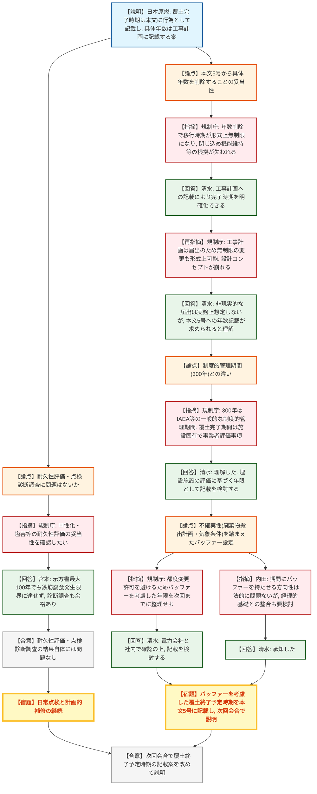
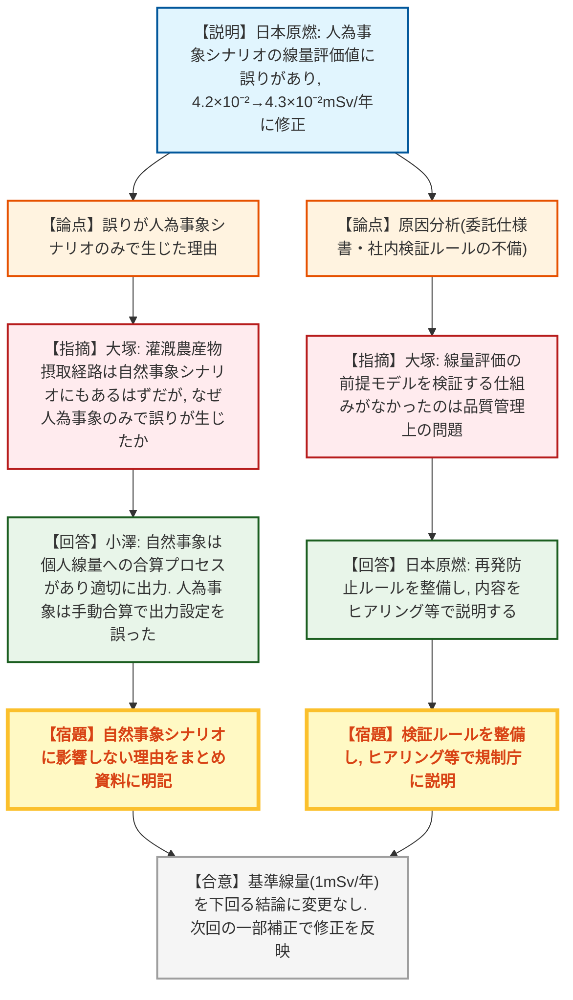
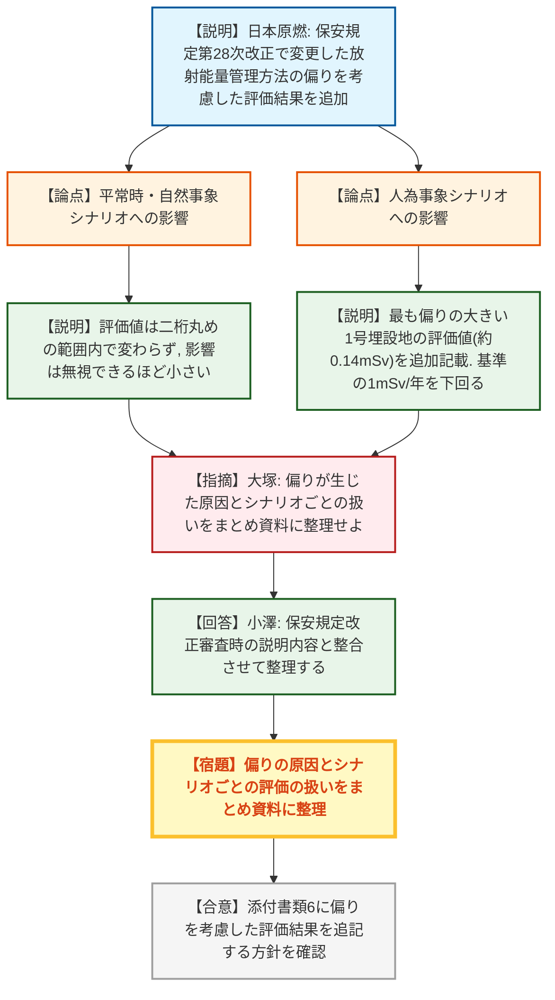
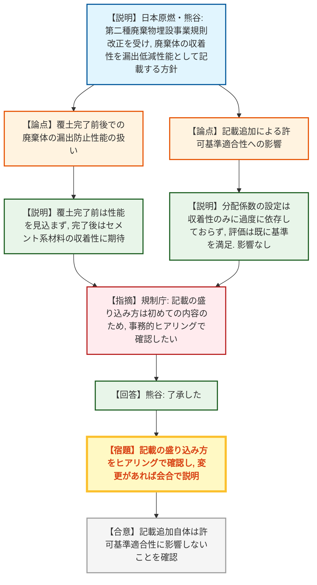

# 第593回核燃料施設等の新規制基準適合性に係る審査会合（令和8年9月10日）
> 出典 : https://youtube.com/live/_PIRC2S1FB8?si=M0Sc-f_Ekzl64-EY

## 会合の概要
* **覆土終了予定時期の申請書への記載方法をめぐり、規制側と事業者の考え方に大きな隔たりが判明**
  日本原燃は、複数号にまたがる廃棄物埋設地の覆土終了予定時期を申請書本文には具体的な年数を書かず、工事計画（届出事項）にのみ記載する方式を提案した。しかし規制庁は、本文から年数を削除すると保安措置の移行時期が形式上無制限になり、埋設設備の閉じ込め機能維持・コンクリート構造物選定・保安措置採用の各根拠が崩れると指摘し、本文への具体的年数の記載を求めた。日本原燃はこれを受け、廃棄物搬出計画の不確実性を考慮した「バッファー」を持たせた年限を改めて設定し、次回会合で説明する方針に転換した。
* **埋設設備の耐久性評価・点検診断調査の結果自体には問題なしと確認**
  コンクリート標準示方書に基づく耐久性調査（最大100年を想定）および保安規定に基づく診断調査の結果、中性化・塩害・凍害いずれも問題なく、実測値は計算上の想定より余裕があることを規制庁も確認した。ただし表面損傷等の兆候を見逃さないよう、日常点検と計画的な補修の継続が求められた。
* **人為事象シナリオの線量評価値に誤りがあったことが判明し、修正（4.2×10⁻²→4.3×10⁻²mSv/年）**
  沢水利用の灌漑農産物摂取経路の計算結果を出力すべき箇所で、誤っておぶち沼利用経路の計算結果を出力していたことが2026年5〜6月にかけて判明。基準線量（1mSv/年）を下回る結論への影響はないが、規制庁はモデル検証の仕組みが社内に存在しなかったことを品質管理上の問題と指摘し、再発防止ルールの整備とヒアリングでの内容確認を求めた。
* **1号廃棄物埋設施設の放射能量の偏りを考慮した評価結果を申請書に追加記載**
  保安規定第28次改正で変更済みの放射能量管理方法（1群〜6群への配分）について、偏りを考慮した評価結果（人為事象シナリオで最大線量約0.14mSv、基準の1mSv/年を下回る）を添付書類6に追加する。規制庁は、偏りが生じた経緯や自然事象・人為事象シナリオでの扱いの違いをまとめ資料に整理するよう要請した。
* **規則改正を踏まえ、廃棄体の「漏出防止等の性能」に関する記載を申請書に追加する方針を説明**
  2021年10月の第二種廃棄物埋設事業規則改正を受け、廃棄体（セメント固化体・充填固化体の固形化材）が持つ放射性物質の収着性を「漏出を低減する性能」として申請書本文・添付書類6に記載する方針を提示。許可基準適合性への影響はないとされたが、規制庁は記載の盛り込み方について改めてヒアリングで確認するとした。

---

## 議題ごとの詳細整理

### 議題(1) 日本原燃(株)濃縮・埋設事業所の廃棄物埋設事業変更許可申請について

#### 資料1: 事業変更許可申請書における覆土終了予定時期の記載の考え方
* **議論の背景と論点:**
  第587回審査会合では、覆土終了予定時期が延長されても漏出防止機能・移行抑制機能への影響はないとの共通認識が得られた一方、将来の期間変更リスクを考慮する必要がある旨のコメントを規制庁から受領していた。日本原燃は、覆土終了予定時期を申請書本文には記載せず工事計画で整理する方針を示していたが、本文に記載しない場合の設計上の考え方の記載方法について検討するよう求められていた。今回、日本原燃は「本文には各廃棄物埋設地の覆土完了時期を保安のために講ずべき措置の変更予定時期として記載し、具体的な年数は工事計画の使用工程に記載する」という案（本文と工事計画の「合わせ技」）を提示し、埋設設備が約100年程度の劣化抵抗性を有すること、諸外国の浅地中処分施設で機能維持・耐久性の観点から操業期間を定めている事例がないことを根拠として説明した。

* **質疑応答（詳細）:**
    * 【規制庁】前回会合のおさらいとして、覆土完了時期は廃棄体搬出計画に依存し他律的で不確実性があるため、都度の変更許可申請ではなく届出で工事計画に反映する運用を事業者が提案していたこと、規制庁からは「本文からの削除は設計の前提事項の削除に当たるため、安全上の問題の有無」と「申請書への記載方法」を整理するよう求めていたことを確認した。
    * 【日本原燃・宮本】前回会合での議論を受け、覆土完了時期を仮に延長した場合でも問題ないか、耐久性評価を定量的に改めて実施し本日提示したものであると説明した。
    * 【規制庁】中性化はコンクリート標準示方書に基づき施工誤差・中性化残りを考慮しても現状評価（約27年相当）はもとより示方書の最大値（100年）でも鉄筋腐食発生限界まで達しないこと、塩害・凍害も立地条件から問題ないこと、他の原子力施設の経年劣化評価（強度低下・放射線劣化）も参考に問題なしと確認したことを述べ、耐久性評価の計算自体に問題はないと評価した。ただし表面損傷が構造物の有意な損傷に至らないよう、日常点検と適切な補修の継続を要望した。
    * 【日本原燃・宮本】指摘内容について問題ないことを確認しており、今後表面等に損傷があれば保安規定等に基づき適切に管理していくと回答した。
    * 【規制庁】診断調査（中性化試験・塩分含有試験）の結果は調査上の計算値よりも実測値が低く、計算条件が保守的であること、実力としても中性化・塩害に十分な余裕があることを確認したとした上で、乾燥収縮によるひび割れ等も含め、3号等の今後の運転開始も見据え、保安規定に基づく点検診断調査の継続を求めた。
    * 【日本原燃・宮本】今後も適切に維持管理を継続すると回答した。
    * 【規制庁】耐久性評価・点検診断調査に問題がないことを確認した上で、次の論点として、本文5号に具体的な変更予定時期を記載しないとした場合、保安措置の移行時期に制約がなくなり形式上無制限になること、それに伴い①埋設設備による閉じ込め機能を維持できるとする根拠、②添付書類5にある「覆土完了までの期間は数十年程度であることから、セメント系材料を用いたコンクリート構造物とすることが合理的」という設計前提の根拠、③添付書類6に記載された、覆土完了前に実施する保安措置の妥当性の根拠――がそれぞれ失われるのではないかと指摘した。
    * 【日本原燃・清水】これまで有意な濃度の放射性物質の検出がないこと、排水が確認されても補修により減少させられることを保安活動で確認していること、耐久性評価・診断調査の結果にも問題がないことを踏まえ、工事計画に覆土完了の時期を記載することで、いつまでに行うかを明確にできると説明した。
    * 【規制庁】工事計画は届出のため、極端な例では期間を無制限に(例えば数千年にも)変更することが形式上可能になってしまい、許可時に確認した「数十年程度であればコンクリート構造物で足りる」という設計コンセプトが届出によって覆されかねないと指摘し、本文5号への具体的な年数記載が必要と重ねて説明した。
    * 【日本原燃・清水】届出により非現実的な期間を申請することは事業者として現実的にはないとしつつも、耐久性のある範囲（約100年）を超える、あるいは新知見により耐久性が想定より低いと分かった場合は改めて許可変更申請を行うプロセスになるとの認識を示した。
    * 【規制庁】技術論は理解しているとした上で、覆土完了時期が形式上無制限になれば、添付の事業計画書に記載する廃棄物受入計画数量・予定埋設数量や、経理的基礎（資金計画・事業収支見積り）の説明も成り立たなくなり、許可要件である技術的能力・経理的基礎の判断根拠にも影響すると指摘した。
    * 【日本原燃・清水】非現実的な届出を行った場合に経理的基礎等の説明が成り立たなくなるとの指摘には同意した上で、本文5号には「覆土完了」という行為をもって終了予定時期とし、工事計画に具体的な完了時期を書くという「合わせ技」で説明したつもりだったが、本文5号には具体的な年限そのものの記載が求められているとの理解でよいか確認した。
    * 【規制庁】その理解で正しく、規制要求としては本文5号に数字を記載することが必要であると改めて説明した。
    * 【日本原燃・清水】覆土完了後の廃止措置開始までの期間については300〜400年という具体的基準があるが、覆土完了までの期間には具体的な年限の指定がないと認識していたためこのような記載案を検討していたとし、改めて記載を検討すると回答した。
    * 【規制庁】300年という数字はIAEA等の基準に基づく「制度的管理期間」であり、これは各国共通の一般的基準として規定できるのに対し、覆土完了までの措置期間は埋設施設の設計（コンクリートピットかトレンチか等）・地質環境・埋設する廃棄物に依存するファシリティ固有の事項であるため、規制側が一律の年数を定めることはできず、事業者の設計・評価に基づき申請時に確認する事項であると説明した。
    * 【日本原燃・清水】制度的管理と措置変更時期の要求の違いについて理解したとした上で、保安措置の期間は事業者の埋設施設の評価に基づき設定すべき年限であるため、記載方法を検討したいと回答した。
    * 【規制庁】覆土完了期間の算定が廃棄物搬出計画（他律的で気象条件等の影響も受ける）に依存し不確実性があることを踏まえ、安全上問題がないことは確認済みであるものの、都度の変更許可申請を避けるためにも、事業者としてバッファーを考慮した年限を設定し、次回会合までに整理して示すよう求めた。
    * 【日本原燃・清水】バッファーの考え方について、①電力会社が想定するスケジュールを踏まえて設定する方法と、②耐久性の上限（約100年程度）を超えない範囲で覆土する方法のいずれを想定しているか確認した。
    * 【規制庁】いずれの案を採るかは事業者の裁量であるとしつつ、耐久性の上限を用いる場合も事業計画・経理的基礎との整合、点検調査実績が現時点で20数年分にとどまり100年までの妥当性を言い切れるかという課題があるとし、廃棄物搬出計画上の不確実性とコンクリート構造物としての不確実性の両面から、事業者・電力側で相場感を改めて検討するよう求めた。
    * 【日本原燃・清水】100年という数字は一つの極端な例として示したものであり、基本的には廃棄体受入計画・覆土工事計画・経理的基礎との整合性を持った説明ができるよう、電力会社と社内で確認の上、記載を検討すると回答した。
    * 【規制庁】法的な観点から、覆土完了までの期間は廃棄物の搬入見込み等に基づく合理的な考え方を整理し、事業達成の見込みを確認するためのものであり、期間にバッファーを持たせる方向性自体は法的に問題ないと説明した。一方でバッファーを過大にすると経理的基礎の説明が難しくなるため、持込み先の電力各社とよく相談の上、妥当なバッファー水準を検討し示すよう求めた。
    * 【日本原燃・清水】了承した。
    * 【規制庁】工事計画についても、覆土完了時期を紐づけるかどうかを含めて整理し、改めて説明するよう求めた。
    * 【日本原燃・清水】了承した。

* **結論と宿題事項（アクションアイテム）:**
  * **決定事項:** 埋設設備の耐久性評価および点検診断調査の結果自体には問題がないことを規制庁が確認した。
  * **宿題事項:**
    1. 覆土終了予定時期について、申請書本文5号に具体的な年数を記載する方向で、廃棄物搬出計画・気象条件等の不確実性を考慮したバッファーを設定し、次回審査会合で説明すること（日本原燃）。
    2. 工事計画に覆土完了時期を紐づけるかどうかを含めて整理し、改めて説明すること（日本原燃）。

---

#### 資料2: 人為事象シナリオの線量評価における評価値の修正
* **議論の背景と論点:**
  最新の規制要求に基づく解析モデルと事業変更許可申請の線量評価計算結果を比較したところ、人為事象シナリオに係る評価値に差異があることを2026年5月に確認。調査の結果、沢水を利用した灌漑農産物摂取による内部被曝の計算結果を出力すべき箇所で、誤っておぶち沼を利用した経路の計算結果を出力していたことが2026年6月までに判明した。他の経路の計算結果には誤りがないことも確認済みで、基準線量（1mSv/年）を下回るとの結論に変更はないが、評価値は4.2×10⁻²mSv/年から4.3×10⁻²mSv/年に修正される。原因は2018年の審査期間中に追加した沢水利用経路モデルについて、入力データ・解析モデル内部の検証は行ったが、計算結果が出力ファイルへ正しく引き渡されているか、出力設定が適切かの検証が行われていなかったことにあり、委託先への検証範囲明確化の要求が仕様書になかったこと、解析モデルの検証範囲を定める社内ルールがなかったことが直接原因とされた。

* **質疑応答（詳細）:**
    * 【規制庁・大塚】灌漑農産物摂取経路は自然事象シナリオにも存在するはずだが、今回の誤りが人為事象シナリオのみで生じた理由を質問した。
    * 【日本原燃・小澤】自然事象シナリオでは経路ごとの線量を個人の線量に合算する計算プロセスが別途あり、そこで適切に経路を抽出し個人線量として出力していたのに対し、人為事象シナリオはもともと単一経路の評価用でモデル化されておらず、途中で複数経路を考慮することになった際にモデルへの反映が不十分で、個別経路の出力結果を評価担当者が手動で合算するプロセスとなっていたため、そこに誤りが生じたと説明した。
    * 【規制庁・大塚】自然事象シナリオに影響しない理由が資料からは読み取れないため、原因・対策に加えてこの点もまとめ資料に明記するよう求めた。
    * 【日本原燃・小澤】承知したと回答した。
    * 【規制庁・大塚】原因分析（委託先の検証範囲が仕様書で明確化されていなかったこと、社内での検証ルールがなかったこと）について、線量評価の前提となるモデルを検証する仕組みがなかったことは品質管理上の問題であるとし、社内ルールの整備後、ヒアリング等でその内容を確認したいと述べた。
    * 【日本原燃】ルールを整備し再発防止を徹底するとともに、定めたルールについては適宜ヒアリング等で説明すると回答した。
    * 【規制庁・大塚】評価担当者が値の違いに気づいたことで発覚した事象であり、仕組みとして誤りが起きないようにすることが重要であると付言した。

* **結論と宿題事項（アクションアイテム）:**
  * **決定事項:** 評価値の修正（4.2×10⁻²→4.3×10⁻²mSv/年）は基準適合性の結論に影響しないことを確認。修正は次回の一部補正時に反映する。
  * **宿題事項:**
    1. 自然事象シナリオでは影響が生じない理由を、原因・対策とあわせてまとめ資料に明記すること（日本原燃）。
    2. 検証に係る具体的確認項目等の社内ルールを整備し、内容をヒアリング等で規制庁に説明すること（日本原燃）。

---

#### 資料3: 放射能量の偏りを考慮した評価の取り扱い
* **議論の背景と論点:**
  保安規定第28次改正における1号廃棄物埋設施設の放射能量管理方法（1群〜6群への配分）の変更に際し、当時は偏りを考慮した評価結果を示し許可基準規則への適合性を確認していたが、2026年4月の事業変更許可申請書には当該評価結果が反映されていなかった。第587回審査会合で、運用を変更した1号埋設施設について偏りを考慮した場合の評価結果を示すようコメントを受けたことを踏まえ、今回その取り扱いを整理した。廃止措置開始前の平常時評価および開始後の自然事象シナリオでは、偏りを考慮しても評価値は二桁丸めの範囲内で変わらず影響は無視できるほど小さいため記載を追記するのみとする一方、人為事象シナリオでは全廃棄物埋設地の中で最も偏りが大きく評価値も大きい1号廃棄物埋設地の評価結果（約0.14mSv、基準の1mSv/年を下回る）を添付書類6に追加記載する方針が示された。

* **質疑応答（詳細）:**
    * 【規制庁・大塚】前回会合でのやり取りを踏まえ偏りの影響を考慮した評価値が適正化されたことに謝意を示した上で、平常時評価・自然事象シナリオでは影響が無視できるほど小さいこと、人為事象シナリオのみで顕在化することを理解した旨を述べた。その上で、1号埋設で放射能濃度に偏りが生じることになった原因（保安規定審査時に説明済み）や、自然事象シナリオ・人為事象シナリオそれぞれでの評価の扱いについて、審査に参加していない者が将来見ても分かるようまとめ資料に整理するよう求めた。
    * 【日本原燃・小澤】保安規定改正審査時の説明内容と同様の整理になるとしつつ、きちんとまとめると回答した。
    * 【規制庁・大塚】必要な情報が一箇所にまとまっていることで、過去の経緯を後から参照しやすくなる点が重要であると付言した。

* **結論と宿題事項（アクションアイテム）:**
  * **決定事項:** 平常時・自然事象シナリオでは偏りの影響は無視できるほど小さく、人為事象シナリオのみで1号埋設地の評価結果を追加記載する方針を確認。
  * **宿題事項:** 1号埋設地で放射能濃度に偏りが生じた原因と、シナリオごとの評価の扱いをまとめ資料に整理すること（日本原燃）。

---

#### 資料4: 事業変更許可申請書の一部補正における廃棄体の「漏出防止等の性能」の記載方針
* **議論の背景と論点:**
  2021年10月に改正された第二種廃棄物埋設事業規則により、申請書本文に放射性廃棄物が廃棄物埋設地の外へ漏出することを防止・低減する性能（「漏出防止等の性能」）の記載が求められることとなった。2026年4月の変更許可申請（主たる変更事項は1号覆土終了予定時期の変更）では、炉規法上の「廃棄する核燃料物質等の性状及び数量の変更」に該当しないと解釈し、当該記載を行わずに申請していたが、第1回審査会合後のヒアリングで規則改正内容の反映要否について規制庁と議論した結果、一部補正において記載を追加し適正化することが適当と判断した。廃棄体に期待する性能としては、覆土完了までの期間は廃棄体自体に漏出防止性能を見込まない一方、覆土完了後は廃棄体（均一固化体のうちセメント固化体、充填固化体）の固形化材中のセメント系材料に放射性物質の収着性（漏出を低減する性能）を期待する、と整理した。2号廃棄物埋設施設は既に埋設が完了しているが特段の差別化はせず、1号〜3号廃棄物埋設施設すべての申請書本文・添付書類6に記載を追加する。許可基準規則第13条・第12条等との関係を整理した結果、各シナリオの評価では収着性を分配係数として考慮しているものの、収着性のみに過度に依存せず既に評価基準を満足していることを確認しており、今回の記載追加による許可基準適合性への影響はないとされた。

* **質疑応答（詳細）:**
    * 【規制庁】規則改正の趣旨（廃棄体に人工バリアとしての漏出防止・低減機能を期待する場合はその性能を申請書に記載することを求めるもの）を踏まえた今回の説明は、許可のベースを適正化するものと理解できるとした上で、申請書への具体的な記載の盛り込み方については内容が初めてのものであるため、事務的にヒアリングで改めて確認したいと述べ、ヒアリングの過程で記載内容に変更があれば改めて会合で説明するよう求めた。
    * 【日本原燃・熊谷】要請事項を理解した旨を回答した。

* **結論と宿題事項（アクションアイテム）:**
  * **決定事項:** 廃棄体の「漏出防止等の性能」に係る記載追加は許可基準適合性に影響しないことを確認。
  * **宿題事項:** 申請書への具体的な記載の盛り込み方について、事務的ヒアリングで規制庁と確認し、変更があれば会合で説明すること（日本原燃）。

---

#### 会合全体のまとめ
* **議論の背景と論点:**
  司会（規制庁）が全議題の質疑を総括し、次回会合に向けた宿題事項を確認した。
* **質疑応答（詳細）:**
    * 【規制庁】前回会合での指摘事項について事業者が整理した結果を確認し、耐久性評価等についても問題がないことを理解したとした上で、覆土終了予定時期の記載については本日の指摘を踏まえて事業者が検討し、次回会合で説明するよう求めた。
    * 【日本原燃・清水】承知した旨を回答した。
    * 【規制庁】今後、現地でピットの状況等を確認したいとし、準備を依頼した。
    * 【規制庁】覆土終了予定時期の検討にあたっては、埋設事業者として、事業の重要な転換点についての見通しを自ら主体的に示すよう求めた。
    * 【日本原燃・清水】埋設事業の許可を受けた事業者として、電力会社とのコミュニケーションは取りつつも、当社としてあるべき措置の変更時期を適切に設定し説明すると回答した。
    * 【規制庁】人為事象シナリオの評価誤りについて、今回の対応にとどまらず、なぜ当初気づけなかったのかを遡って社内で議論し、今後の2号・3号等への横展開も見据えて再発防止を徹底するよう求めた（規制庁への報告は不要、社内での対応を求めるとした）。

* **結論と宿題事項（アクションアイテム）:**
  * **宿題事項:**
    1. 覆土終了予定時期の記載方法（バッファーを含む）を整理し、次回審査会合で説明すること（日本原燃）。
    2. 人為事象シナリオの評価誤りについて、根本原因を社内で深掘りし、再発防止を徹底すること（日本原燃）。
    3. 現地でのピット状況確認の準備を進めること（日本原燃）。

---

## 論理構造の可視化（Mermaid）

### 資料1: 覆土終了予定時期の記載の考え方

### 資料2: 人為事象シナリオの線量評価値の修正

### 資料3: 放射能量の偏りを考慮した評価の取り扱い

### 資料4: 廃棄体の「漏出防止等の性能」の記載方針

