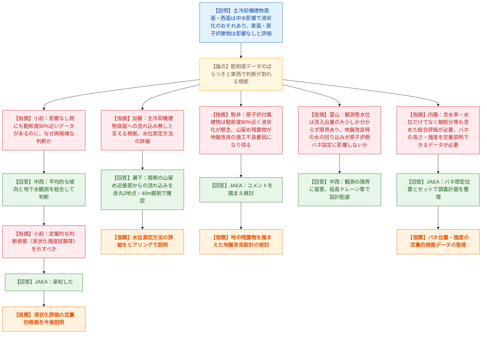
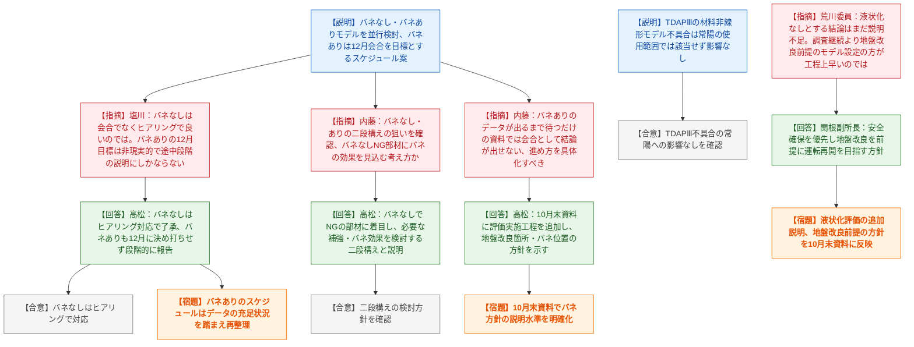

# 第594回核燃料施設等の新規制基準適合性に係る審査会合（令和8年9月11日）
> 出典 : https://youtube.com/live/8cNGAFQDP_g?si=JsPxgjqC34hJSG-z

## 会合の概要
- 今回は令和7年1月6日付申請の「常陽」原子炉施設変更に係る設計及び工事の計画（設工認）第2回申請の継続審査で、7月22日会合の続き。側面地盤バネの設定根拠となる追加ボーリング調査結果の議論が中心だった。
- JAEAは主冷却機建物・原子炉建物周辺の水位・含水率・飽和度・細粒分含有率・PS検層等を総合評価し、主冷却機建物の南面・西面は中水（地山由来の地下水）の影響を受け液状化のおそれがある一方、東面と原子炉建物周辺は影響なしと結論づけたが、規制庁側は飽和度データのばらつきを踏まえた判断根拠の説明不足を強く指摘した。
- 規制庁（塩川氏、内藤管理官）は、側面地盤バネなし・ありの二段階評価スケジュール（バネなし：ヒアリング中心、バネあり：12月会合を目標）について、12月目標は非現実的で途中経過の報告にしかならないとして、データや検討状況が固まってから改めてスケジュールを示すよう求めた。
- 荒川委員は、液状化のおそれなしとする結論はまだ十分に説明されていないと述べるとともに、調査継続でデータを積み上げるより地盤改良を前提としたモデル設定の方が全体工程上早いのではないかという大きな方向性の再検討を促した。JAEA（関根副所長）はこれを受け、地盤改良を前提として安全確保・運転再開を目指す方針を示した。
- 資料3では、常陽の解析コードTDAPⅢの不具合について、常陽では当該不具合に関係するモデルを使用していないため影響がないことが報告され、特段の異論なく了承された。

## 議題ごとの詳細整理

### 議題1: 日本原子力研究開発機構大洗原子力工学研究所（南地区）の原子炉施設（高速実験炉原子炉施設「常陽」）の変更に係る設計及び工事の計画の認可申請について

#### (1) 資料1：設計用床応答スペクトル（FRS）作成方針に係る指摘回答（側面地盤バネ関連の追加ボーリング調査）

**議論の背景と論点**
常陽の設工認第2回申請では、地震時の設計用床応答スペクトル（FRS）算定にあたり主冷却機建物・原子炉建物側面の地盤バネをどう設定するかが最大の論点。これまでの審査（3月16日・6月17日会合等）を踏まえ、地山から埋め戻し土内への中水（地下水）の浸入有無を確認する追加ボーリング調査を実施し、その結果に基づき液状化のおそれの有無を評価した。

**質疑応答（詳細）**
- 【説明者側】JAEA（関根副所長・根本氏）は、主冷却機建物・原子炉建物周辺で観測井・オールコア・PS検層・含水率・飽和度・細粒分含有率調査を実施した結果、主冷却機建物の南面・西面（山留め工法により地山に近接する部分）で水位が確認され、コアも湿潤状態を示したことから中水の影響を受け液状化のおそれがあると評価。東面（オープンカット工法）と原子炉建物周辺は水位・コア状態・PS検層のいずれも低含水・不飽和の傾向で整合しており、影響なしと評価したと説明した。
- 【規制側の懸念】小前氏（規制庁）は、飽和度データを見ると、影響なしとした東面・原子炉建物側にも飽和度90%近いデータ（東面125項で90%超、原子炉建物側124項で約85%、B-101〜103で88〜89%）が存在するのに、なぜ「影響あり」「影響なし」という両極端な判断に分かれるのか根拠が不明確だと指摘した。
- 【説明者側の回答】JAEA（中西氏）は、飽和度にばらつきがあることを前提に「平均的な像」で判断しており、地下水観測による滞水状況も含めて総合的に判断していると説明した。
- 【再反論・確認】小前氏は、側面地盤バネの設定という最終目的のためには定性的な二択の判断ではなく定量的な説明が必要であり、6月17日会合で言及のあった液状化強度試験等のデータも踏まえて今後説明するよう求めた。JAEAは「承知した」と回答するにとどまった。
- 【規制側の懸念】加藤氏（規制庁）は、主冷却機建物底面への中水の流れ込みの有無を確認するため南側に追加ボーリング2箇所（赤丸）を計画しているが、その2地点のみで底面への流れ込みがないと言えるのか、水位測定の具体的な方法（水位そのものを測るのか、滞水量を測るのか）を含めて説明が必要と指摘した。
- 【説明者側の回答】JAEA（瀬下氏）は、これまでの調査で中水の流れ込みは山留めに近い南側からと分かっているため赤丸位置で確認すること、40m掘削するのはTP30m付近の地山の中水位と合流する可能性を考慮したためと説明した。加藤氏は、今後のヒアリングで水位測定方法まで含めた詳細説明を求めた。
- 【規制側の懸念】駒井委員は、原子炉付属建物はB-101〜103で飽和度がほぼ90%に達しており、基準地震動が来た際に液状化しないか懸念を示した。山留め工法で施工されているため親杭・横矢板が地中に残置されている可能性があり、今後の地盤改良（高圧噴射工法等）を検討する際に残置物が施工不良の原因になり得るとして、現状の地中残置物の状態を踏まえた設計対応を求めた。
- 【説明者側の回答】JAEAは「コメントを踏まえた検討を行う」と回答した。
- 【規制側の懸念】富山氏（規制庁）は、観測管による水位計測は有効管内への流入量と流出量の大小関係しか分からず、パッカー等で層ごとの影響を排除する手法（地盤工学会の解説書に記載）に比べて限界があるとして、中水影響の考察にあたってはこの制約に留意するよう指摘した。また、影響ありと評価した主冷却機建物周辺を地盤改良した場合に水の流れが変わることで、原子炉建物側の側面地盤バネ設定に影響しない設計とできるか確認した。
- 【説明者側の回答】JAEA（中西氏）は、観測方法の限界を今後の検討で留意するとし、地盤改良に伴う水の回り込みの影響は延長ドレーン等の併用も含め設計上配慮すると回答した。
- 【規制側の懸念】内藤管理官は、含水率や水位の有無だけで液状化を判断するのは不十分で、道路橋示方書等の考え方に倣い細粒分等も含めた総合評価が必要と指摘。水位測定はあくまで「水が下までジャブジャブではない」という参考情報に過ぎず、側面バネの高さ・強度を定量的に説明できるデータが揃わなければモデルの妥当性は判断できないとして、必要なデータ取得を求めた。
- 【説明者側の回答】JAEAは、バネの想定位置とセットで調査計画を整理し説明すると回答した。

**結論と宿題事項（アクションアイテム）**
- 追加ボーリング調査（9箇所）を2026年10月末までに完了し、結果を整理・提示する。
- 飽和度・含水率データのばらつきを踏まえた液状化影響の定量的な判断根拠、水位測定方法の詳細、山留め工法の地中残置物の状況を踏まえた地盤改良設計上の配慮について、今後のヒアリング・会合で説明する。
- 主冷却機建物南面・西面の液状化影響評価は現時点では十分な説明に至っておらず、規制庁・委員双方から継続的な指摘があり、宿題として持ち越しとなった（条件付き了承ではない）。

#### (2) 資料2：FRS作成に向けた当面の説明スケジュールについて

**議論の背景と論点**
JAEAは側面地盤バネを考慮しないモデル（バネなし）と考慮するモデル（バネあり）を並行して検討する二段構えの進め方を提示した。バネなしモデルはヒアリングで、バネありモデルは10月末のボーリング結果総括・地盤改良計画案の提示を経て12月会合での説明を目指すとした。

**質疑応答（詳細）**
- 【規制側の懸念】塩川氏（規制庁）は、バネなしモデルの説明は内部検討状況の共有が中心であり、会合ではなくヒアリングで行うべきではないかと指摘。バネありモデルについても、12月会合を目指すスケジュールは非現実的で、地盤改良を含めた検討の途中段階の説明にしかならないとした上で、側面地盤バネの成立性について8月7日の現地確認や本日の調査結果を踏まえ、まずはヒアリングで後戻りのない説明ができる目処を立ててからスケジュールを引き直すべきと述べた。
- 【説明者側の回答】JAEA（高松氏）は、バネなしはヒアリングで1つずつ回答する方針を了承し、バネありについても12月と決め打ちせず、説明がまとまった段階で報告する考えを示した。
- 【規制側の懸念】内藤管理官は、バネなしモデルとバネありモデルを二段構えで進める意図を確認。バネなしで厳しい結果が出た部材について、地盤バネでどの程度期待する必要があるかを見極めた上で、バネありモデルで具体的な強度検討・補強要否を判断するという考え方かを問うた。
- 【説明者側の回答】JAEA（高松氏）は、その理解で相違ないと回答し、バネなしで評価OKの部材はスクリーニングとして扱い、バネなしでNGとなった部材について着目して検討を進めると説明した。
- 【規制側の懸念】内藤管理官は、バネありモデルのスケジュールについて、バネなしの検討結果を踏まえたデータが出てくる前提のスケジュールでは方針説明にしかならず、会合として結論を得られる内容にならないと指摘。今後どのようなデータ・検討の進捗を踏まえてスケジュールを具体化するのか整理して示すよう求めた。
- 【説明者側の回答】JAEA（高松氏）は指摘を踏まえ、バネありモデル側にも「評価等の実施」の工程を明示すること、10月末の資料では地盤改良箇所・バネを付与する位置の方針を示す説明にとどまる見込みであることを説明した。

**結論と宿題事項（アクションアイテム）**
- バネなしモデルの検討はヒアリングで進め、会合には諮らない方針で了承。
- バネありモデルの12月会合開催は固定目標とせず、検討の進捗（データの充足状況）を踏まえてスケジュールを再整理し、改めて示す。
- 10月末に提出予定の資料は、地盤改良を行う箇所とバネを設定する方針を示す説明にとどまる見込みであることを確認。

#### (3) 資料3：高速実験炉原子炉施設（「常陽」）計算機プログラム（解析コード）TDAPⅢにおける不具合に対する影響確認結果について

**議論の背景と論点**
解析コードTDAPⅢで材料非線形モデルに関する不具合が確認されたことを受け、常陽の設計評価への影響有無を確認した。

**質疑応答（詳細）**
- 【説明者側】JAEA（川原氏）は、常陽では当該不具合に関係する材料非線形モデルを使用していないため、影響はないことを確認したと説明した。
- 【規制側】特段の異論・追加質問はなく、常陽の使用範囲では影響なしとの理解が確認された。

**結論と宿題事項（アクションアイテム）**
- 常陽の設計評価にTDAPⅢの不具合による影響はないことが確認され、了承された。

#### 全体を通じたコメント

**議論の背景と論点**
会合の最後に、荒川委員から液状化評価の結論の妥当性と、今後の調査方針の大きな方向性について総括コメントがあった。

**質疑応答（詳細）**
- 【規制側の懸念】荒川委員は、主冷却機建物東面・原子炉建物周辺について「液状化のおそれなし」とするまとめは、これまでの質疑を踏まえるとまだ十分に説明しきれていないと述べた。また、地盤を精査してバネを設定するアプローチを続けるより、地盤改良を前提にモデルを組む方が全体工程上早いのではないかとして、大きな方向性を再検討してほしいと求めた。加えて、指摘への回答は定量的根拠を揃えること、未整理のデータがまとまり次第説明することを求めた。
- 【説明者側の回答】JAEA（関根副所長）は、安全確保を最優先に、地盤改良を行った上での運転再開を目指す方針であることを説明し、コメントを踏まえて対応すると回答した。
- 【規制側の確認】内藤管理官は、地盤改良を前提とする方針が示されたことを受け、改良を行う範囲を前提にモデルを組んだ上で、追加で取得すべきデータ・地点を整理すれば調査の効率化が図れるとして、大きな方針を明確にした上で計画を進めるよう求めた。
- 【説明者側の回答】JAEA（高松氏）は、方針を10月末の資料に反映する考えを示した。
- 【規制側の追加コメント】規制庁実務担当者は、追加調査を積み重ねる進め方は使えるデータが得られる保証がなく時間がかかりやすいため、地盤改良を前提とした設計の方が時間短縮になり得るとして、時間とコストを踏まえた方針判断を求めた。審議官からも、現地確認でのボーリングコアの状況を踏まえ、周辺土も含めた信頼性の高い設計を工学的にしっかり検討するよう要望があった。

**結論と宿題事項（アクションアイテム）**
- JAEAは地盤改良を前提とした設計方針を明確化し、10月末の資料に反映する。
- 液状化のおそれなしとする評価（主冷却機建物東面・原子炉建物周辺）は引き続き説明を尽くす必要があり、宿題として持ち越し。
- 未整理データの提示、定量的根拠の提示は継続課題。

## 論理構造の可視化（Mermaid）

### 議題1・資料1：側面地盤バネ関連の液状化影響評価

### 議題1・資料2/資料3/全体コメント：スケジュール・TDAPⅢ・総括

